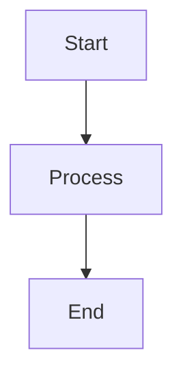

# Workshop Plugin

AI-assisted development plugin for the Plaited framework. Provides comprehensive knowledge of behavioral programming patterns, template creation, and web platform best practices through auto-invoked skills.

## Features

### 🎯 Plaited Patterns Skill (Auto-Invoked)

Automatically activates when you're working with Plaited templates, behavioral programs, or web platform patterns. Provides deep knowledge of:

- **Behavioral Programming**: Super-step execution model, thread composition, event selection strategies, rule composition patterns
- **Templates & Styling**: JSX syntax, FunctionalTemplate pattern, CSS-in-JS (atomic styles, host styles, design tokens, keyframes)
- **Custom Elements**: bElement decorator, islands architecture, Shadow DOM, form-associated elements
- **Cross-Island Communication**: Parent-child patterns, signals, actor model, pub/sub coordination
- **Testing**: Story-based testing with Playwright, workshop CLI workflows, accessibility testing
- **Web Workers**: bWorker pattern, message passing, thread lifecycle management

All documentation uses **mermaid diagrams** for token-efficient, structured visual context.

### 🔍 Extract Web Pattern Skill (User-Invoked)

Extract modern HTML and Web API patterns from articles to build your own project-specific knowledge base.

**What it extracts:**
- Modern HTML features (dialog, popover, invokers, form validation)
- Web APIs (Intersection Observer, Priority Hints, Mutation Observer)
- Performance optimizations (resource hints, fetchpriority, loading strategies)
- Accessibility improvements (ARIA, semantic HTML, keyboard navigation)
- Shadow DOM compatible patterns

**Output:** Creates auto-invoked skills in your project's `.claude/skills/` directory for progressive disclosure (token-efficient, loads only when relevant).

### ⚙️ SessionStart Hook

Runs once at session start to verify dependencies and display helpful commands:

- Checks for TypeScript LSP plugin (recommended for type inference)
- Verifies Bun runtime installation
- Shows workshop CLI command reference

## Installation

### Prerequisites

- **Bun >= 1.2.9** (required by Plaited framework)
- **TypeScript LSP plugin** (recommended): `typescript-lsp@claude-plugins-official`

### Option 1: Install from Marketplace (Recommended)

Add the Plaited marketplace to your Claude Code settings (`.claude/settings.json`):

```json
{
  "extraKnownMarketplaces": {
    "plaited": "https://raw.githubusercontent.com/plaited/plaited/main/.claude-plugin/marketplace.json"
  },
  "enabledPlugins": {
    "workshop@plaited": true,
    "typescript-lsp@claude-plugins-official": true
  }
}
```

Restart Claude Code to activate.

### Option 2: Local Development

Clone the repository and enable locally:

```bash
git clone https://github.com/plaited/plaited.git
cd plaited
```

Add to your project's `.claude/settings.json`:

```json
{
  "extraKnownMarketplaces": {
    "plaited": {
      "source": {
        "source": "directory",
        "path": "."
      }
    }
  },
  "enabledPlugins": {
    "workshop@plaited": true,
    "typescript-lsp@claude-plugins-official": true
  }
}
```

Restart Claude Code.

## Usage

### Plaited Patterns (Automatic)

The `plaited-patterns` skill activates automatically when you're:

- Creating or modifying Plaited templates
- Working with behavioral programs (bThread, bSync, behavioral)
- Implementing islands architecture
- Writing story tests
- Using CSS-in-JS (createStyles, createHostStyles)
- Coordinating cross-island communication with signals
- Setting up web workers

**No commands needed** - Claude automatically uses the knowledge when relevant.

### Extract Web Patterns (On-Demand)

When you find a useful article about modern web patterns:

1. **Invoke the skill**: Describe what you want to extract
2. **Provide the URL**: Article link with the pattern
3. **Review extraction**: Skill formats pattern for Plaited integration
4. **Skill created**: Auto-invoked skill added to your project

**Example:**
```
User: Extract the HTML dialog pattern from this article: https://web.dev/building-a-dialog-component

Claude: [Extracts pattern, formats for Plaited, creates skill]

Output: .claude/skills/html-dialog-pattern/SKILL.md
```

### Workshop CLI Commands

The SessionStart hook displays these helpful commands at session start:

```bash
# Testing
bun plaited test                 # Run all story tests
bun plaited test <path>          # Run tests from directory/file
bun plaited test -p 3500         # Custom port
bun plaited test -c dark         # Dark mode

# Development
bun plaited dev                  # Start dev server
bun --hot plaited dev            # Dev server with hot reload
```

## Why Skills Over Rules?

The workshop plugin uses **skills** for pattern knowledge instead of **rules** for token efficiency:

### Skills (Progressive Disclosure)
- ✅ ~100 tokens loaded initially (just metadata)
- ✅ Full content (~5k tokens) loads only when relevant
- ✅ Massive token savings for large knowledge bases

### Rules (Always Loaded)
- ⚠️ Full token cost paid at session start
- Best for project-wide standards that always apply

**Result:** You get comprehensive pattern knowledge without bloating your context window.

## Documentation Structure

```
plugins/workshop/
├── skills/
│   ├── plaited-patterns/        # Framework knowledge (auto-invoked)
│   │   ├── SKILL.md
│   │   └── plaited/
│   │       ├── behavioral-programs.md    # BP foundations
│   │       ├── b-element.md              # Custom elements
│   │       ├── styling.md                # Templates + CSS-in-JS
│   │       ├── stories.md                # Testing
│   │       ├── form-associated-elements.md
│   │       ├── cross-island-communication.md
│   │       └── web-workers.md
│   └── extract-web-pattern/     # Pattern extraction (user-invoked)
│       └── SKILL.md
└── hooks/
    └── SessionStart             # Dependency check + CLI help
```

## Diagram Format

All diagrams in the plugin use **mermaid** syntax for token efficiency and better structured context:



**Benefits:**
- Significantly fewer tokens than ASCII art
- Clearer semantic meaning for AI
- Easier to maintain and update

## Contributing

This plugin is part of the [Plaited](https://github.com/plaited/plaited) framework. For issues or contributions, please visit the main repository.

## License

Same license as the Plaited framework.

## Version

- **Current Version**: 0.1.0
- **Requires**: Bun >= 1.2.9
- **Recommends**: TypeScript LSP plugin

## Support

- **GitHub Issues**: https://github.com/plaited/plaited/issues
- **Documentation**: https://github.com/plaited/plaited
- **Skills Guide**: https://www.claude.com/blog/skills-explained

## Changelog

### 0.1.0 (2025-12-24)

**Features:**
- Plaited Patterns skill with comprehensive framework documentation
- Extract Web Pattern skill for building project-specific pattern libraries
- SessionStart hook for dependency checking and CLI command reference
- Mermaid diagram format for token efficiency
- Behavioral programming anti-pattern fix (thread replacement prevention)

**Documentation:**
- Complete behavioral programming foundations
- Template and styling patterns
- Testing workflows
- Islands architecture and cross-island communication
- Web Worker patterns
- Form-associated elements

**Design:**
- Skills-first approach for progressive disclosure
- User-owned pattern extraction (not plugin-bundled)
- Auto-invoked skills reduce token costs while maintaining comprehensive knowledge
