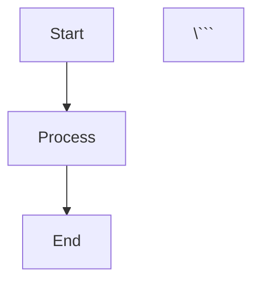

# Documentation Philosophy

## Core Principles

- Public APIs require comprehensive documentation without code examples (tests/stories serve as living examples)
- Internal modules need maintainer-focused documentation
- All documentation should be practical and actionable
- Avoid redundant or obvious comments
- Use `@internal` marker for non-public APIs
- Document the "why" not just the "what"
- **No `@example` sections in TSDoc** - Tests and stories provide living examples
- **Type over interface**: Always prefer `type` declarations
- **Factory functions only**: Never show raw `yield` statements in behavioral documentation
- **Cross-references**: Use `@see` tags to connect related APIs
- **Mermaid diagrams only**: Use mermaid syntax for all diagrams (flowcharts, sequence diagrams, etc.) - more token-efficient and better structured than ASCII art

## Diagram Guidelines

### Use Mermaid for All Diagrams

Always use [mermaid](https://mermaid.js.org/) syntax for diagrams in markdown files:

```markdown


**Benefits**:
- **Token efficiency**: Mermaid diagrams use significantly fewer tokens than ASCII art
- **Structured context**: Clearer semantic meaning for AI agents
- **Maintainability**: Easier to update and modify
- **Consistency**: Standardized diagram syntax across all documentation

**Common diagram types**:
- `flowchart TD` - Top-down flowcharts for processes and logic
- `sequenceDiagram` - Interaction diagrams for communication patterns
- `graph LR` - Left-right graphs for relationships

**Line breaks in labels**: Use `<br/>` for multi-line text in node labels

**Avoid**: ASCII box-drawing characters (`┌`, `│`, `└`, `─`, etc.)

## Documentation Requirements

For detailed TSDoc templates and type documentation guidelines, see:
- @.claude/skills/code-documentation/SKILL.md
- @.claude/rules/documentation/tsdoc-overview.md
