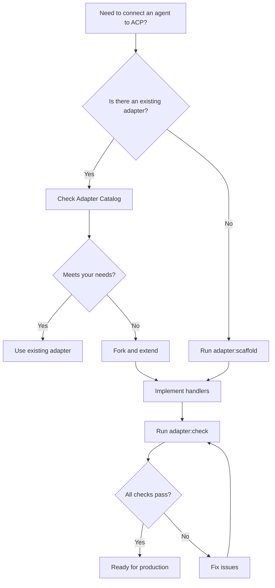
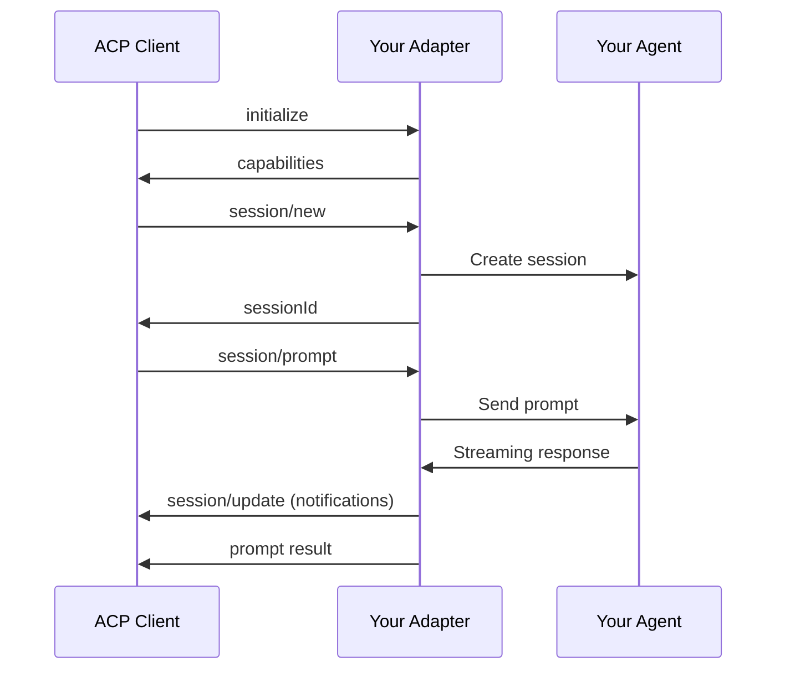

# ACP Adapters

## Purpose

This skill helps developers **integrate agents with ACP** (Agent Client Protocol). Whether you need to connect an existing adapter or build a custom one, this skill provides:

- **Discovery**: Find and evaluate existing adapters
- **Creation**: Scaffold new adapter projects with best practices
- **Validation**: Verify compliance with the ACP protocol specification

| Use Case | Tool | Description |
|----------|------|-------------|
| Connect existing agent | [Adapter Catalog](references/adapter-catalog.md) | Curated list of production adapters |
| Build custom integration | `adapter:scaffold` command | Generate project boilerplate |
| Verify implementation | `adapter:check` command | Validate protocol compliance |

## Quick Decision Tree



## CLI Commands

### adapter:scaffold

Scaffold a new adapter project with ACP protocol handlers.

```bash
acp-harness adapter:scaffold [name] [options]
```

**Options:**
| Flag | Description | Default |
|------|-------------|---------|
| `-o, --output` | Output directory | `./<name>-acp` |
| `--lang` | Language: `ts` or `python` | `ts` |
| `--minimal` | Generate minimal boilerplate only | false |

**Examples:**

```bash
# Scaffold TypeScript adapter
acp-harness adapter:scaffold my-agent -o ./adapters/my-agent-acp

# Scaffold Python adapter
acp-harness adapter:scaffold my-agent --lang python

# Minimal TypeScript scaffold
acp-harness adapter:scaffold my-agent --minimal
```

**Generated Structure (TypeScript):**

```
my-agent-acp/
├── package.json
├── tsconfig.json
├── src/
│   ├── main.ts               # Entry point with AgentSideConnection
│   ├── session-manager.ts    # Session lifecycle management
│   └── handlers/
│       ├── initialize.ts     # initialize method handler
│       ├── session-new.ts    # session/new handler
│       ├── session-prompt.ts # session/prompt handler
│       └── session-cancel.ts # session/cancel notification handler
└── README.md
```

### adapter:check

Validate that an adapter implements the ACP protocol correctly.

```bash
acp-harness adapter:check <command> [args...]
```

**Options:**
| Flag | Description | Default |
|------|-------------|---------|
| `--timeout` | Timeout for each check in ms | `5000` |
| `--verbose` | Show detailed protocol messages | false |

**Checks Performed:**

| Check | Description |
|-------|-------------|
| `spawn` | Adapter can be launched as subprocess |
| `initialize` | Responds to initialize with valid `agentCapabilities` |
| `session/new` | Creates session and returns `sessionId` |
| `session/prompt` | Accepts prompt and emits `session/update` notifications |
| `session/cancel` | Accepts cancel notification gracefully |
| `framing` | All messages are newline-delimited JSON-RPC 2.0 |

**Example:**

```bash
# Check a local adapter
acp-harness adapter:check bun ./my-adapter/src/main.ts

# Check with verbose output
acp-harness adapter:check bunx my-published-adapter --verbose

# Check with longer timeout
acp-harness adapter:check python ./adapter.py --timeout 10000
```

**Sample Output:**

```
Checking ACP compliance for: bun ./my-adapter/src/main.ts

✓ spawn: Adapter launched successfully
✓ initialize: Protocol version 1, capabilities: loadSession, promptCapabilities.image
✓ session/new: Session sess_abc123 created
✓ session/prompt: Received 3 updates (thought, tool_call, message)
✓ session/cancel: Acknowledged without error
✓ framing: All messages valid JSON-RPC 2.0

6/6 checks passed. Adapter is ACP-compliant.
```

## Protocol Overview

ACP (Agent Client Protocol) uses **JSON-RPC 2.0 over stdio** for client-agent communication. An adapter translates between your agent's API and the ACP protocol.



### Required Methods

| Method | Type | Description |
|--------|------|-------------|
| `initialize` | request | Protocol handshake, returns capabilities |
| `session/new` | request | Create conversation session |
| `session/prompt` | request | Send prompt, receive response |
| `session/cancel` | notification | Cancel ongoing prompt |
| `session/update` | notification (outgoing) | Stream updates to client |

See [Protocol Quick Reference](references/protocol-quick-ref.md) for complete method signatures.

## Getting Started

### Option 1: Use Existing Adapter

Check the [Adapter Catalog](references/adapter-catalog.md) for your agent:

```bash
# Claude Code (official)
bunx @zed-industries/claude-code-acp

# Gemini CLI
bunx @anthropic/gemini-acp

# See catalog for more
```

### Option 2: Build Custom Adapter

1. **Scaffold project:**
   ```bash
   acp-harness adapter:scaffold my-agent
   cd my-agent-acp
   bun install
   ```

2. **Implement handlers:**
   See [Implementation Guide](references/implementation-guide.md) for step-by-step instructions.

3. **Validate compliance:**
   ```bash
   acp-harness adapter:check bun ./src/main.ts
   ```

4. **Test with harness:**
   ```bash
   acp-harness capture prompts.jsonl bun ./src/main.ts -o results.jsonl
   ```

## References

| Document | Description |
|----------|-------------|
| [adapter-catalog.md](references/adapter-catalog.md) | Curated list of existing adapters |
| [protocol-quick-ref.md](references/protocol-quick-ref.md) | ACP protocol cheat sheet |
| [implementation-guide.md](references/implementation-guide.md) | Step-by-step adapter creation |

## Related

- **[@agentclientprotocol/sdk](https://www.npmjs.com/package/@agentclientprotocol/sdk)** - ACP SDK with TypeScript types
- **[acp-harness skill](../acp-harness/SKILL.md)** - Running evaluations against adapters
- **[ACP Specification](https://agentclientprotocol.org)** - Official protocol documentation
