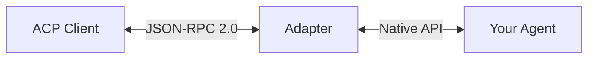

# ACP Adapter Implementation Guide

Step-by-step guide to creating an ACP-compliant adapter for your agent.

## Overview

An ACP adapter translates between the Agent Client Protocol and your agent's native API. The adapter:

1. **Receives** JSON-RPC requests from clients (like acp-harness)
2. **Translates** requests to your agent's API format
3. **Emits** session updates as the agent processes
4. **Returns** responses in ACP format



---

## Prerequisites

- Node.js 18+ or Bun 1.2+
- Basic understanding of JSON-RPC 2.0
- Access to your agent's API

---

## Quick Start with Scaffold

The fastest way to start:

```bash
# Scaffold a TypeScript adapter
acp-harness adapter:scaffold my-agent

# Navigate to project
cd my-agent-acp

# Install dependencies
bun install

# Run the adapter
bun run src/main.ts
```

This creates a working adapter skeleton you can customize.

---

## Manual Implementation

### Step 1: Project Setup

**package.json:**
```json
{
  "name": "my-agent-acp",
  "version": "1.0.0",
  "type": "module",
  "bin": {
    "my-agent-acp": "./src/main.ts"
  },
  "dependencies": {
    "@agentclientprotocol/sdk": "^0.0.1"
  },
  "devDependencies": {
    "typescript": "^5.0.0"
  }
}
```

**tsconfig.json:**
```json
{
  "compilerOptions": {
    "target": "ES2022",
    "module": "ESNext",
    "moduleResolution": "bundler",
    "strict": true,
    "esModuleInterop": true,
    "skipLibCheck": true
  },
  "include": ["src"]
}
```

### Step 2: Entry Point

**src/main.ts:**
```typescript
#!/usr/bin/env bun

import { AgentSideConnection } from '@agentclientprotocol/sdk'
import { handleInitialize } from './handlers/initialize.ts'
import { handleSessionNew } from './handlers/session-new.ts'
import { handleSessionPrompt } from './handlers/session-prompt.ts'
import { handleSessionCancel } from './handlers/session-cancel.ts'

// Create connection using stdin/stdout
const connection = new AgentSideConnection({
  inputStream: process.stdin,
  outputStream: process.stdout,
})

// Register handlers
connection.onInitialize(handleInitialize)
connection.onSessionNew(handleSessionNew)
connection.onSessionPrompt(handleSessionPrompt)
connection.onSessionCancel(handleSessionCancel)

// Start listening
connection.start()
```

### Step 3: Initialize Handler

**src/handlers/initialize.ts:**
```typescript
import type { InitializeRequest, InitializeResponse } from '@agentclientprotocol/sdk'

export const handleInitialize = async (
  params: InitializeRequest
): Promise<InitializeResponse> => {
  // Verify protocol version
  if (params.protocolVersion !== 1) {
    throw new Error(`Unsupported protocol version: ${params.protocolVersion}`)
  }

  return {
    protocolVersion: 1,
    agentInfo: {
      name: 'my-agent',
      version: '1.0.0',
    },
    agentCapabilities: {
      // Declare what your adapter supports
      loadSession: false,
      promptCapabilities: {
        image: false,
      },
    },
  }
}
```

### Step 4: Session Handler

**src/handlers/session-new.ts:**
```typescript
import type { SessionNewRequest, SessionNewResponse } from '@agentclientprotocol/sdk'
import { sessionManager } from '../session-manager.ts'

export const handleSessionNew = async (
  params: SessionNewRequest
): Promise<SessionNewResponse> => {
  // Create session in your session manager
  const sessionId = sessionManager.createSession({
    cwd: params.cwd,
    mcpServers: params.mcpServers ?? [],
  })

  return { sessionId }
}
```

**src/session-manager.ts:**
```typescript
import { randomUUID } from 'node:crypto'

type Session = {
  id: string
  cwd: string
  mcpServers: unknown[]
  createdAt: Date
}

class SessionManager {
  #sessions = new Map<string, Session>()

  createSession(params: { cwd: string; mcpServers: unknown[] }): string {
    const id = `sess_${randomUUID().slice(0, 8)}`
    this.#sessions.set(id, {
      id,
      cwd: params.cwd,
      mcpServers: params.mcpServers,
      createdAt: new Date(),
    })
    return id
  }

  getSession(id: string): Session | undefined {
    return this.#sessions.get(id)
  }

  deleteSession(id: string): boolean {
    return this.#sessions.delete(id)
  }
}

export const sessionManager = new SessionManager()
```

### Step 5: Prompt Handler

**src/handlers/session-prompt.ts:**
```typescript
import type {
  PromptRequest,
  PromptResponse,
  ContentBlock,
  AgentSideConnection,
} from '@agentclientprotocol/sdk'
import { sessionManager } from '../session-manager.ts'

export const handleSessionPrompt = async (
  params: PromptRequest,
  connection: AgentSideConnection
): Promise<PromptResponse> => {
  const session = sessionManager.getSession(params.sessionId)
  if (!session) {
    throw new Error(`Session not found: ${params.sessionId}`)
  }

  // Extract text from prompt content blocks
  const promptText = params.prompt
    .filter((block): block is ContentBlock & { type: 'text' } =>
      block.type === 'text'
    )
    .map((block) => block.text)
    .join('\n')

  // Emit thinking update
  connection.sendSessionUpdate(params.sessionId, {
    sessionUpdate: 'agent_thought_chunk',
    content: { type: 'text', text: 'Processing your request...' },
  })

  // Call your agent's API here
  const response = await callYourAgentAPI(promptText, session)

  // Emit response update
  connection.sendSessionUpdate(params.sessionId, {
    sessionUpdate: 'agent_message_chunk',
    content: { type: 'text', text: response },
  })

  // Return final response
  return {
    content: [{ type: 'text', text: response }],
  }
}

// Replace with your actual agent API call
const callYourAgentAPI = async (
  prompt: string,
  session: { cwd: string }
): Promise<string> => {
  // Example: call OpenAI, local model, or custom API
  return `Echo: ${prompt}`
}
```

### Step 6: Cancel Handler

**src/handlers/session-cancel.ts:**
```typescript
import type { CancelNotification } from '@agentclientprotocol/sdk'
import { sessionManager } from '../session-manager.ts'

// Track active requests for cancellation
const activeRequests = new Map<string, AbortController>()

export const handleSessionCancel = async (
  params: CancelNotification
): Promise<void> => {
  const controller = activeRequests.get(params.sessionId)
  if (controller) {
    controller.abort()
    activeRequests.delete(params.sessionId)
  }
}

// Export for use in prompt handler
export const registerActiveRequest = (
  sessionId: string,
  controller: AbortController
): void => {
  activeRequests.set(sessionId, controller)
}

export const unregisterActiveRequest = (sessionId: string): void => {
  activeRequests.delete(sessionId)
}
```

---

## Streaming Updates

For long-running operations, emit updates to keep clients informed:

### Thought Updates

```typescript
connection.sendSessionUpdate(sessionId, {
  sessionUpdate: 'agent_thought_chunk',
  content: { type: 'text', text: 'Analyzing the codebase...' },
})
```

### Tool Call Updates

```typescript
// Tool started
connection.sendSessionUpdate(sessionId, {
  sessionUpdate: 'tool_call',
  toolCallId: 'tool_123',
  title: 'Read',
  status: 'pending',
  rawInput: { file_path: '/path/to/file.ts' },
})

// Tool completed
connection.sendSessionUpdate(sessionId, {
  sessionUpdate: 'tool_call',
  toolCallId: 'tool_123',
  title: 'Read',
  status: 'completed',
  rawOutput: 'file contents here...',
})
```

### Message Updates

```typescript
connection.sendSessionUpdate(sessionId, {
  sessionUpdate: 'agent_message_chunk',
  content: { type: 'text', text: 'Here is what I found...' },
})
```

---

## Error Handling

### Request Errors

Throw errors to send JSON-RPC error responses:

```typescript
export const handleSessionPrompt = async (params: PromptRequest) => {
  const session = sessionManager.getSession(params.sessionId)
  if (!session) {
    // This becomes a JSON-RPC error response
    throw new Error(`Session not found: ${params.sessionId}`)
  }
  // ...
}
```

### Graceful Degradation

Handle agent API failures gracefully:

```typescript
try {
  const response = await callAgentAPI(prompt)
  return { content: [{ type: 'text', text: response }] }
} catch (error) {
  // Return error as response content
  return {
    content: [{
      type: 'text',
      text: `Error: ${error instanceof Error ? error.message : 'Unknown error'}`,
    }],
  }
}
```

---

## Testing Your Adapter

### Manual Testing

```bash
# Start adapter
bun run src/main.ts

# In another terminal, send test messages
echo '{"jsonrpc":"2.0","id":1,"method":"initialize","params":{"protocolVersion":1,"clientInfo":{"name":"test","version":"1.0.0"},"clientCapabilities":{}}}' | bun run src/main.ts
```

### Compliance Check

```bash
acp-harness adapter:check bun ./src/main.ts
```

### Integration Test

```bash
# Create test prompts
echo '{"id":"test-1","input":"Hello"}' > test-prompts.jsonl

# Run with harness
acp-harness capture test-prompts.jsonl bun ./src/main.ts -o results.jsonl

# Check results
cat results.jsonl | jq .
```

---

## Python Adapter

For Python agents, use a similar structure:

**adapter.py:**
```python
#!/usr/bin/env python3
import json
import sys
from typing import Any

def handle_request(method: str, params: Any) -> Any:
    if method == 'initialize':
        return {
            'protocolVersion': 1,
            'agentInfo': {'name': 'my-agent', 'version': '1.0.0'},
            'agentCapabilities': {}
        }
    elif method == 'session/new':
        return {'sessionId': f'sess_{id(params)}'}
    elif method == 'session/prompt':
        prompt_text = ' '.join(
            b['text'] for b in params['prompt'] if b['type'] == 'text'
        )
        return {'content': [{'type': 'text', 'text': f'Echo: {prompt_text}'}]}
    else:
        raise ValueError(f'Unknown method: {method}')

def main():
    for line in sys.stdin:
        request = json.loads(line)
        try:
            result = handle_request(request['method'], request.get('params'))
            response = {
                'jsonrpc': '2.0',
                'id': request['id'],
                'result': result
            }
        except Exception as e:
            response = {
                'jsonrpc': '2.0',
                'id': request.get('id'),
                'error': {'code': -32603, 'message': str(e)}
            }
        print(json.dumps(response), flush=True)

if __name__ == '__main__':
    main()
```

Run with: `python adapter.py`

---

## Best Practices

### 1. Validate Input

Always validate incoming parameters:

```typescript
const session = sessionManager.getSession(params.sessionId)
if (!session) {
  throw new Error(`Session not found: ${params.sessionId}`)
}
```

### 2. Stream Updates

Don't wait until the end—stream progress:

```typescript
// Good: Stream as you go
for await (const chunk of agentStream) {
  connection.sendSessionUpdate(sessionId, {
    sessionUpdate: 'agent_message_chunk',
    content: { type: 'text', text: chunk },
  })
}

// Bad: Wait until complete
const fullResponse = await getFullResponse()
return { content: [{ type: 'text', text: fullResponse }] }
```

### 3. Handle Cancellation

Support cancellation for long-running operations:

```typescript
const controller = new AbortController()
registerActiveRequest(sessionId, controller)

try {
  await longOperation({ signal: controller.signal })
} finally {
  unregisterActiveRequest(sessionId)
}
```

### 4. Clean Shutdown

Handle process termination gracefully:

```typescript
process.on('SIGTERM', async () => {
  // Clean up sessions
  await cleanup()
  process.exit(0)
})
```

---

## Next Steps

1. **Validate**: Run `acp-harness adapter:check` to verify compliance
2. **Test**: Create test prompts and capture trajectories
3. **Publish**: Share your adapter on npm for others to use
4. **Document**: Add to the [Adapter Catalog](adapter-catalog.md)
