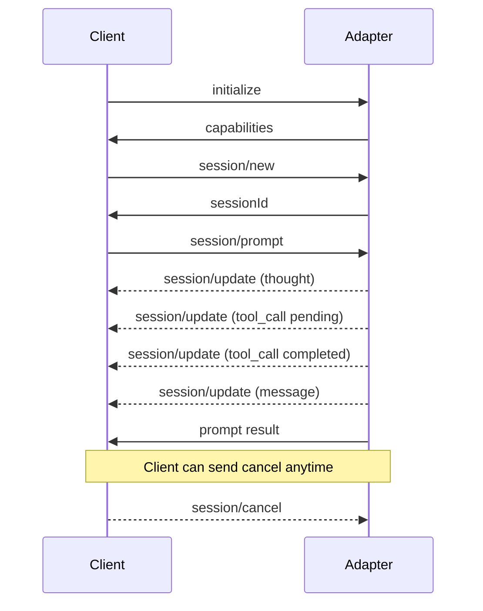

# ACP Protocol Quick Reference

Quick reference for implementing ACP (Agent Client Protocol) adapters.

## Transport

- **Framing**: Newline-delimited JSON-RPC 2.0
- **Channel**: stdin/stdout (subprocess)
- **Encoding**: UTF-8

```
{"jsonrpc":"2.0","id":1,"method":"initialize","params":{...}}\n
{"jsonrpc":"2.0","id":1,"result":{...}}\n
```

## Message Types

### Request (requires response)

```typescript
type JsonRpcRequest = {
  jsonrpc: '2.0'
  id: string | number
  method: string
  params?: unknown
}
```

### Response

```typescript
// Success
type JsonRpcSuccessResponse = {
  jsonrpc: '2.0'
  id: string | number
  result: unknown
}

// Error
type JsonRpcErrorResponse = {
  jsonrpc: '2.0'
  id: string | number | null
  error: {
    code: number
    message: string
    data?: unknown
  }
}
```

### Notification (no response)

```typescript
type JsonRpcNotification = {
  jsonrpc: '2.0'
  method: string
  params?: unknown
}
```

---

## Required Methods

### initialize

Protocol handshake. Must be the first message.

**Request:**
```json
{
  "jsonrpc": "2.0",
  "id": 1,
  "method": "initialize",
  "params": {
    "protocolVersion": 1,
    "clientInfo": {
      "name": "acp-harness",
      "version": "1.0.0"
    },
    "clientCapabilities": {}
  }
}
```

**Response:**
```json
{
  "jsonrpc": "2.0",
  "id": 1,
  "result": {
    "protocolVersion": 1,
    "agentInfo": {
      "name": "my-agent",
      "version": "1.0.0"
    },
    "agentCapabilities": {
      "loadSession": true,
      "promptCapabilities": {
        "image": true
      }
    }
  }
}
```

### session/new

Create a new conversation session.

**Request:**
```json
{
  "jsonrpc": "2.0",
  "id": 2,
  "method": "session/new",
  "params": {
    "cwd": "/path/to/workspace",
    "mcpServers": []
  }
}
```

**Response:**
```json
{
  "jsonrpc": "2.0",
  "id": 2,
  "result": {
    "sessionId": "sess_abc123"
  }
}
```

### session/prompt

Send a prompt and receive response.

**Request:**
```json
{
  "jsonrpc": "2.0",
  "id": 3,
  "method": "session/prompt",
  "params": {
    "sessionId": "sess_abc123",
    "prompt": [
      {
        "type": "text",
        "text": "Hello, can you help me?"
      }
    ]
  }
}
```

**Response:**
```json
{
  "jsonrpc": "2.0",
  "id": 3,
  "result": {
    "content": [
      {
        "type": "text",
        "text": "Of course! How can I assist you today?"
      }
    ]
  }
}
```

### session/cancel (notification)

Cancel an ongoing prompt. No response expected.

**Notification:**
```json
{
  "jsonrpc": "2.0",
  "method": "session/cancel",
  "params": {
    "sessionId": "sess_abc123"
  }
}
```

---

## Outgoing Notifications

Adapters emit these to stream updates to clients.

### session/update

Stream progress updates during prompt processing.

**Notification:**
```json
{
  "jsonrpc": "2.0",
  "method": "session/update",
  "params": {
    "sessionId": "sess_abc123",
    "update": {
      "sessionUpdate": "agent_thought_chunk",
      "content": {
        "type": "text",
        "text": "Let me think about this..."
      }
    }
  }
}
```

### Update Types

| sessionUpdate | Description |
|---------------|-------------|
| `agent_thought_chunk` | Internal reasoning (streaming) |
| `agent_message_chunk` | Response to user (streaming) |
| `tool_call` | Tool invocation with status |
| `plan` | Structured plan entries |

### Tool Call Update

```json
{
  "jsonrpc": "2.0",
  "method": "session/update",
  "params": {
    "sessionId": "sess_abc123",
    "update": {
      "sessionUpdate": "tool_call",
      "toolCallId": "tool_123",
      "title": "Read",
      "status": "pending",
      "rawInput": {"file_path": "/path/to/file.ts"}
    }
  }
}
```

Tool call status progression: `pending` -> `running` -> `completed` | `failed`

---

## Optional Methods

### session/load

Resume an existing session (requires `loadSession` capability).

**Request:**
```json
{
  "jsonrpc": "2.0",
  "id": 4,
  "method": "session/load",
  "params": {
    "sessionId": "sess_abc123"
  }
}
```

### session/request_permission (incoming request)

Agent requests permission from client. Adapter must handle client response.

**Request (from agent via adapter):**
```json
{
  "jsonrpc": "2.0",
  "id": 100,
  "method": "session/request_permission",
  "params": {
    "sessionId": "sess_abc123",
    "options": [
      {"optionId": "opt_1", "kind": "allow_once", "label": "Allow this action"},
      {"optionId": "opt_2", "kind": "allow_always", "label": "Always allow"},
      {"optionId": "opt_3", "kind": "deny", "label": "Deny"}
    ],
    "message": "Allow reading /etc/passwd?"
  }
}
```

**Response (from client):**
```json
{
  "jsonrpc": "2.0",
  "id": 100,
  "result": {
    "outcome": {
      "outcome": "selected",
      "optionId": "opt_2"
    }
  }
}
```

---

## Error Codes

| Code | Name | Description |
|------|------|-------------|
| -32700 | Parse Error | Invalid JSON |
| -32600 | Invalid Request | Not a valid JSON-RPC request |
| -32601 | Method Not Found | Method doesn't exist |
| -32602 | Invalid Params | Invalid method parameters |
| -32603 | Internal Error | Internal server error |
| -32800 | Request Cancelled | Request was cancelled |

**Error Response Example:**
```json
{
  "jsonrpc": "2.0",
  "id": 1,
  "error": {
    "code": -32601,
    "message": "Method not found: invalid/method"
  }
}
```

---

## Content Blocks

Content in prompts and responses uses typed blocks:

### Text

```json
{
  "type": "text",
  "text": "Hello, world!"
}
```

### Image (if supported)

```json
{
  "type": "image",
  "source": {
    "type": "base64",
    "mediaType": "image/png",
    "data": "iVBORw0KGgo..."
  }
}
```

---

## Capabilities Reference

### Agent Capabilities

Advertised in `initialize` response:

```typescript
type AgentCapabilities = {
  loadSession?: boolean          // Can resume sessions
  promptCapabilities?: {
    image?: boolean              // Accepts image input
  }
}
```

### Client Capabilities

Sent in `initialize` request:

```typescript
type ClientCapabilities = {
  // Currently reserved for future use
}
```

---

## MCP Server Configuration

Passed to `session/new` for tool integration:

### Stdio Transport

```json
{
  "type": "stdio",
  "name": "filesystem",
  "command": "mcp-filesystem",
  "args": ["/data"],
  "env": [
    {"name": "DEBUG", "value": "true"}
  ]
}
```

### HTTP Transport

```json
{
  "type": "http",
  "name": "api",
  "url": "https://mcp.example.com",
  "headers": [
    {"name": "Authorization", "value": "Bearer token"}
  ]
}
```

---

## Sequence Diagram



---

## SDK Types

Import from `@agentclientprotocol/sdk`:

```typescript
import type {
  InitializeRequest,
  InitializeResponse,
  SessionNotification,
  ContentBlock,
  AgentCapabilities,
  McpServer,
} from '@agentclientprotocol/sdk'
```
