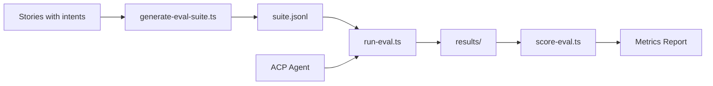
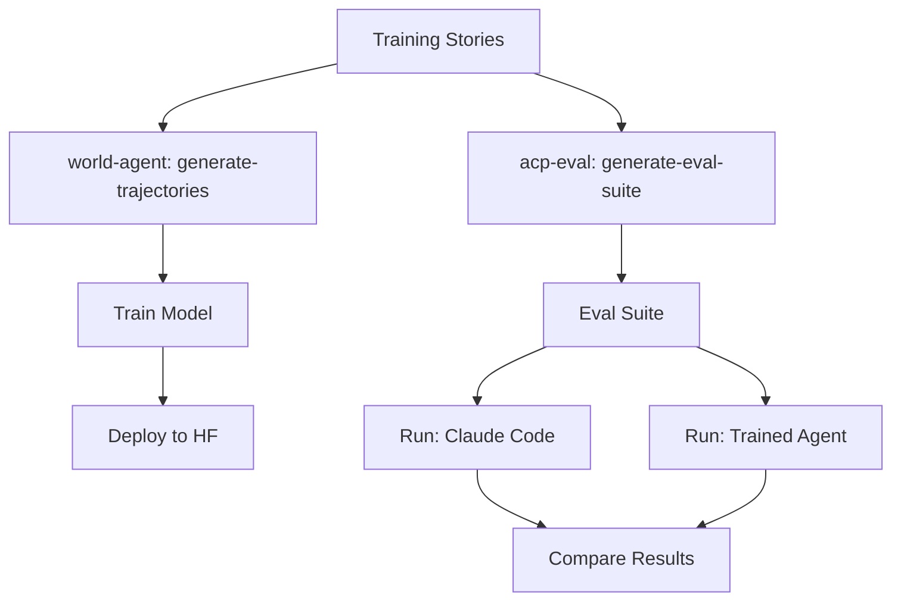

# ACP Evaluation Harness

## Purpose

This skill provides tools for **evaluating ACP-compatible agents** programmatically. It uses the headless ACP client (`plaited/acp`) to connect to agents like Claude Code, Droid, or Gemini CLI and run structured evaluations.

**Use this when:**
- Generating evaluation suites from existing stories
- Running automated evals against ACP agents
- Scoring agent responses on accuracy, tool usage, and latency
- Comparing agent performance across different prompts
- Testing skills, MCP servers, or A2A integrations via agent evaluation

## Evaluation Workflow



1. **Generate** - Extract intents from stories to create eval prompts
2. **Execute** - Run prompts against target agent via ACP client
3. **Capture** - Record responses, tool calls, session updates
4. **Score** - Compute metrics (accuracy, tool usage, latency)
5. **Report** - Output structured results

## Quick Reference

| Task | Script |
|------|--------|
| Generate eval suite | `scripts/generate-eval-suite.ts` |
| Run evals | `scripts/run-eval.ts` |
| Score results | `scripts/score-eval.ts` |
| Evaluation patterns | [eval-patterns.md](references/eval-patterns.md) |

## Scripts

### generate-eval-suite.ts

Generate an evaluation suite from stories with intents.

```bash
bun scripts/generate-eval-suite.ts <stories-path> -o <output.jsonl>
```

**Arguments:**
- `stories-path`: Directory containing `*.stories.tsx` files
- `-o, --output`: Output JSONL file (default: `evals/suite.jsonl`)
- `--filter`: Filter stories by pattern (e.g., `Button*`)

**Output format (JSONL):**
```json
{"id": "button-primary-1", "intent": "Create a primary button", "source": "button.stories.tsx", "export": "PrimaryButton"}
```

### run-eval.ts

Execute evaluation suite against an ACP agent.

```bash
bun scripts/run-eval.ts <suite.jsonl> --agent <agent-command> -o <results-dir>
```

**Arguments:**
- `suite.jsonl`: Evaluation suite file
- `--agent`: Agent command (e.g., `"claude code"`, `"droid"`)
- `-o, --output`: Results directory (default: `results/`)
- `--cwd`: Working directory for agent
- `--timeout`: Request timeout in ms (default: 60000)
- `--concurrency`: Parallel evaluations (default: 1)
- `--mcp-server`: MCP server config JSON (repeatable)
- `-s, --skills-dir`: Skills directory path (relative to cwd)

**MCP Server Configuration:**

Pass MCP servers to the evaluation session using JSON configs:

```bash
# Stdio transport (most common)
--mcp-server '{"type":"stdio","name":"filesystem","command":["mcp-filesystem","/data"]}'

# HTTP transport
--mcp-server '{"type":"http","name":"api","url":"http://localhost:3000"}'

# SSE transport
--mcp-server '{"type":"sse","name":"events","url":"http://localhost:8080/events"}'
```

Multiple MCP servers can be specified by repeating the `--mcp-server` flag.

**Output:**
```
results/
├── button-primary-1.json    # Individual eval result
├── button-secondary-2.json
└── summary.json             # Aggregate statistics
```

### score-eval.ts

Compute evaluation metrics from results.

```bash
bun scripts/score-eval.ts <results-dir> --metrics <metric-list>
```

**Arguments:**
- `results-dir`: Directory with eval results
- `--metrics`: Comma-separated metrics (default: `accuracy,latency,tool-usage`)
- `--format`: Output format (`json`, `markdown`, `table`)

**Available metrics:**
- `accuracy` - Response completeness and correctness
- `latency` - Time to first response and total time
- `tool-usage` - Tool calls made and success rate
- `errors` - Error rate and error types

## Evaluation Suite Format

Each eval case in the JSONL suite:

```typescript
type EvalCase = {
  /** Unique identifier */
  id: string
  /** Natural language intent/prompt */
  intent: string
  /** Source story file */
  source: string
  /** Story export name */
  export: string
  /** Optional expected tool calls */
  expectedTools?: string[]
  /** Optional timeout override */
  timeout?: number
  /** Optional tags for filtering */
  tags?: string[]
}
```

## Result Format

Each evaluation result:

```typescript
type EvalResult = {
  /** Eval case ID */
  id: string
  /** Status: passed, failed, error, timeout */
  status: 'passed' | 'failed' | 'error' | 'timeout'
  /** Agent response text */
  response: string
  /** Tool calls made */
  toolCalls: Array<{
    name: string
    status: 'completed' | 'error' | 'pending'
    duration?: number
  }>
  /** Timing metrics */
  timing: {
    startTime: number
    firstResponseTime: number
    endTime: number
    totalDuration: number
  }
  /** Any errors encountered */
  errors?: string[]
  /** Session updates received */
  updates: number
}
```

## Evaluation Targets

The ACP client enables evaluating multiple targets:

| Target | How to Evaluate |
|--------|-----------------|
| **Agent itself** | Direct prompts, measure response quality |
| **Skills** | Include skill in agent context, test skill prompts |
| **MCP Servers** | Agent connects to MCP, eval tests MCP tool usage |
| **A2A integration** | Agent has A2A configured, eval tests delegation |

### Skill Evaluation

To evaluate a skill:

1. Ensure skill is in agent's `.claude/skills/` directory
2. Create prompts that trigger skill usage
3. Set `--cwd` to point to the project containing the skill
4. Run eval and check for expected skill invocations

```bash
# Eval suite with skill-focused prompts
bun scripts/run-eval.ts skill-evals.jsonl --agent "claude code" --cwd /project/with/skill

# With skills directory specified
bun scripts/run-eval.ts skill-evals.jsonl --agent "claude code" --cwd /project --skills-dir .claude/skills
```

**Note:** Skills are filesystem-based - agents read `SKILL.md` from the specified directory. The `--cwd` parameter is essential for skill discovery.

### MCP Server Evaluation

To evaluate MCP server integration:

1. Pass MCP server configs via `--mcp-server` flag
2. Create prompts requiring MCP tool usage
3. Verify correct MCP tool invocations in results

```bash
# Evaluate with a filesystem MCP server
bun scripts/run-eval.ts mcp-evals.jsonl \
  --agent "claude code" \
  --mcp-server '{"type":"stdio","name":"fs","command":["mcp-filesystem","/data"]}'

# Multiple MCP servers
bun scripts/run-eval.ts mcp-evals.jsonl \
  --agent "claude code" \
  --mcp-server '{"type":"stdio","name":"fs","command":["mcp-filesystem"]}' \
  --mcp-server '{"type":"http","name":"api","url":"http://localhost:3000"}'
```

## Example Usage

### Basic Evaluation Run

```bash
# Generate suite from training stories
bun scripts/generate-eval-suite.ts training/stories -o evals/training-suite.jsonl

# Run against Claude Code
bun scripts/run-eval.ts evals/training-suite.jsonl \
  --agent "claude code" \
  --cwd /path/to/project \
  -o results/claude-code/

# Score results
bun scripts/score-eval.ts results/claude-code/ --format markdown
```

### Comparing Agents

```bash
# Run same suite against multiple agents
bun scripts/run-eval.ts evals/suite.jsonl --agent "claude code" -o results/claude/
bun scripts/run-eval.ts evals/suite.jsonl --agent "droid" -o results/droid/

# Compare scores
bun scripts/score-eval.ts results/claude/ --format json > claude-scores.json
bun scripts/score-eval.ts results/droid/ --format json > droid-scores.json
```

## Integration with World Agent

This skill complements the **world-agent** skill for training workflows:

1. **world-agent** generates trajectories from story execution
2. **acp-eval** evaluates trained models against baseline agents
3. Use `/create-world-agent-eval` to scaffold comparative evaluation



## Programmatic Usage

The scripts can also be imported for custom workflows:

```typescript
import { createACPClient, createPrompt, summarizeResponse } from 'plaited/acp'

const client = createACPClient({
  command: ['claude', 'code'],
  cwd: '/path/to/project'
})

await client.connect()
const session = await client.createSession()

const { result, updates } = await client.promptSync(
  session.id,
  createPrompt('Create a button with hover state')
)

const summary = summarizeResponse(updates)
console.log({
  text: summary.text,
  toolCalls: summary.toolCallCount,
  hasErrors: summary.hasErrors
})

await client.disconnect()
```

## Related Skills

- **world-agent** - Training workflow, trajectory generation
- **workbench** - Story discovery and preview
- **plaited-ui-patterns** - Templates and stories
