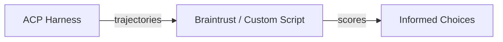
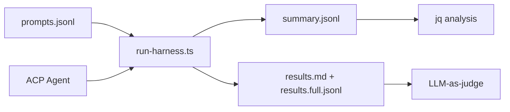

# ACP Harness

## Purpose

This skill provides a **unified toolkit for ACP client usage and agent evaluation**, optimized for TypeScript/JavaScript projects using Bun.

1. **ACP Client API** - Headless programmatic access to ACP-compatible agents
2. **Evaluation Harness** - Run prompts against agents and capture full trajectories

**Use this when:**
- Comparing skills across different agents (Claude Code, Cursor, OpenCode, Amp, Goose, Factory)
- Evaluating built-in tools vs MCP servers vs skills for the same task
- Generating training data with full trajectory capture
- Running regression tests in CI/CD pipelines
- Building multi-agent applications on a headless transport layer

## Foundation Use Cases

The harness is a **foundation layer** - it captures trajectories; scoring happens downstream.



| Use Case | Harness Provides | You Build |
|----------|------------------|-----------|
| **Cross-agent skill eval** | Same prompts → multiple agents → trajectories | Scoring pipeline (Braintrust, custom) |
| **Tool comparison** | Trajectory with tool/skill attribution | Diff analysis, preference data |
| **Training data** | Structured I/O with tool calls, plans, thoughts | SFT/DPO formatting for world-agent |
| **Regression testing** | Deterministic prompt → trajectory capture | CI integration, golden file comparison |
| **Multi-agent apps** | `createACPClient` transport layer | Session management, UI, agent switching |

### Agents Supporting Skills

Skills can be installed across multiple agents, enabling cross-agent comparison:

| Agent | Skills Directory | Install Command |
|-------|------------------|-----------------|
| Claude Code | `.claude/skills/` | `./install-workshop.sh --agent claude` |
| Cursor | `.claude/skills/` | `./install-workshop.sh --agent cursor` |
| OpenCode | `.opencode/skill/` | `./install-workshop.sh --agent opencode` |
| Amp | `.agents/skills/` | `./install-workshop.sh --agent amp` |
| Goose | `.claude/skills/` | `./install-workshop.sh --agent goose` |
| Factory | `.factory/skills/` | `./install-workshop.sh --agent factory` |

### Example: Comparing Built-in vs Skill

```bash
# Run same prompt with built-in tool
bun scripts/run-harness.ts prompts.jsonl \
  --agent claude-code-acp \
  -o results-builtin.jsonl

# Run same prompt with custom skill installed
bun scripts/run-harness.ts prompts.jsonl \
  --agent claude-code-acp \
  --cwd /project/with/typescript-lsp-skill \
  -o results-skill.jsonl

# Compare trajectories - which used better tools? faster? more accurate?
diff <(jq '.toolCalls' results-builtin.jsonl) <(jq '.toolCalls' results-skill.jsonl)
```

## Execution Environment

**Recommendation:** Run evaluations in Docker containers for consistent, isolated execution.

```bash
# Build and run with Docker Compose
docker compose -f docker-compose.acp.yml run --rm acp-harness

# Or build directly
docker build -f Dockerfile.acp -t acp-harness .
docker run --rm -e ANTHROPIC_API_KEY acp-harness
```

Docker provides:
- Consistent environment across local and CI
- Filesystem isolation without app-level sandboxing
- Reproducible results for training data generation

See [assets/](assets/) for example container configurations:
- `Dockerfile.acp` - Base container with Bun and git
- `docker-compose.acp.yml` - Compose file with volume mounts for results

## Non-Goals

This harness is optimized for TypeScript/JavaScript projects using Bun. It is **not** designed for:

- **Python projects** - Use [SWE-bench](https://github.com/SWE-bench/SWE-bench), [Braintrust Python SDK](https://www.braintrust.dev/)
- **Academic model benchmarking** - Use [EleutherAI lm-evaluation-harness](https://github.com/EleutherAI/lm-evaluation-harness)
- **IDE integrations** - Use Copilot Evaluation Harness
- **SaaS observability** - Use Braintrust, Langfuse platforms directly

## Quick Reference

| Resource | Description |
|----------|-------------|
| `scripts/run-harness.ts` | Execute prompts against agent, capture trajectories |
| [client-api.md](references/client-api.md) | `createACPClient` configuration, helpers |
| [output-formats.md](references/output-formats.md) | JSONL schemas, format options |
| [downstream.md](references/downstream.md) | Integration patterns (Braintrust, jq, LLM-as-judge) |
| [llm-judge-templates.md](references/llm-judge-templates.md) | Evaluation prompt templates |

## Evaluation Workflow



1. **Prepare** - Create `prompts.jsonl` with evaluation cases
2. **Execute** - Run harness against target agent
3. **Capture** - Trajectories streamed to output files
4. **Analyze** - Pipe to downstream tools for scoring

## Harness Script

### Basic Usage

```bash
bun scripts/run-harness.ts <prompts.jsonl> --agent <command> [options]
```

### Arguments

| Flag | Description | Default |
|------|-------------|---------|
| `prompts.jsonl` | Input file with evaluation prompts | Required |
| `-a, --agent` | ACP agent command | `"claude-code-acp"` |
| `-o, --output` | Output file/path | stdout |
| `-c, --cwd` | Working directory for agent | current |
| `-t, --timeout` | Request timeout in ms | `60000` |
| `-f, --format` | Output format: `summary`, `judge` | `summary` |
| `--progress` | Show progress to stderr | false |
| `--append` | Append to output file | false |
| `--mcp-server` | MCP server config JSON (repeatable) | none |

### Examples

```bash
# Summary format (default) - minimal JSONL
bun scripts/run-harness.ts prompts.jsonl -o results.jsonl

# Judge format - creates two files for two-tier evaluation
bun scripts/run-harness.ts prompts.jsonl --format judge -o results
# Creates: results.md (summary with step IDs) + results.full.jsonl (complete trajectory)

# With MCP server (stdio transport)
bun scripts/run-harness.ts prompts.jsonl \
  --mcp-server '{"type":"stdio","name":"fs","command":["mcp-filesystem","/data"]}'

# With MCP server (HTTP transport)
bun scripts/run-harness.ts prompts.jsonl \
  --mcp-server '{"type":"http","name":"api","url":"http://localhost:3000"}'

# Different agent (Droid ACP adapter)
bun scripts/run-harness.ts prompts.jsonl --agent droid-acp -o results.jsonl

# Stream with progress
bun scripts/run-harness.ts prompts.jsonl --progress -o results.jsonl
```

## Input Format

Each line in `prompts.jsonl`:

```jsonl
{"id":"test-001","input":"Create a primary button","expected":"should contain <button>","metadata":{"category":"ui"}}
{"id":"test-002","input":"Write a bThread for form validation","metadata":{"category":"behavioral"}}
```

| Field | Required | Description |
|-------|----------|-------------|
| `id` | Yes | Unique identifier |
| `input` | Yes | Prompt text for the agent |
| `expected` | No | Expected output (for downstream scoring) |
| `metadata` | No | Tags, category, difficulty for filtering |
| `timeout` | No | Override default timeout for this prompt |

## Output Formats

### Summary Format (default)

Minimal JSONL for quick metrics and analysis:

```jsonl
{"id":"test-001","input":"Create a button","output":"I created...","toolCalls":["Write"],"status":"passed","duration":1234}
```

### Judge Format (two-tier)

Creates two files for LLM-as-judge evaluation:

**`<output>.md`** - Markdown summary with step IDs and code previews:

```markdown
## Evaluation Record: test-001

**Input:** Create a primary button

**Trajectory:**
1. [THOUGHT] I'll create a styled button template... [->test-001-step-1]
2. [TOOL:Write] -> completed (234ms) [->test-001-step-2]
   File: src/button.tsx (847 chars)
   ```tsx
   import { createStyles } from 'plaited'

   type ButtonProps = {
     label: string

   // ... 30 lines omitted ...

   export const Button = ({ label }: ButtonProps) => (
     <button {...styles.btn}>{label}</button>
   )
   ```
3. [MESSAGE] I created the button... [->test-001-step-3]

**Output:** I created the button template with primary styling.
**Metadata:** category=ui, agent=claude-code-acp
**Status:** passed
**Duration:** 1234ms

---
```

**`<output>.full.jsonl`** - Complete trajectory with step IDs for correlation:

```jsonl
{"id":"test-001","input":"...","output":"...","trajectory":[{"type":"thought","content":"...","timestamp":100,"stepId":"test-001-step-1"},{"type":"tool_call","name":"Write","status":"completed","input":{...},"output":{...},"duration":234,"stepId":"test-001-step-2"}],...}
```

**Usage patterns by judge context window:**

| Judge Model | Strategy |
|-------------|----------|
| Gemini (1M+ tokens) | Feed `results.full.jsonl` directly |
| Claude/GPT-4 (128-200k) | Use `results.full.jsonl` for most runs |
| Smaller models | Use `results.md`, retrieve specific steps by ID as needed |

## Programmatic Usage

```typescript
import { createACPClient, createPrompt, summarizeResponse } from 'plaited/acp'

// Requires: npm install -g @zed-industries/claude-code-acp
const client = createACPClient({
  command: ['claude-code-acp'],
  cwd: '/path/to/project',
})

await client.connect()
const session = await client.createSession()

const { updates } = await client.promptSync(
  session.id,
  createPrompt('Create a button with hover state')
)

// Full trajectory is in updates
const summary = summarizeResponse(updates)
console.log({
  text: summary.text,
  toolCalls: summary.completedToolCalls,
  hasErrors: summary.hasErrors
})

await client.disconnect()
```

See [client-api.md](references/client-api.md) for complete API documentation.

## Downstream Integration

The harness outputs standard JSONL that pipes to any tool:

```bash
# Filter with jq
cat results.jsonl | jq 'select(.metadata.category == "ui")'

# Count tool usage
cat results.jsonl | jq -s 'map(.toolCalls | length) | add'

# Feed full trajectory to Gemini (large context)
cat results.full.jsonl | your-gemini-judge.ts
```

See [downstream.md](references/downstream.md) for integration patterns with Braintrust, Gemini, and custom scorers.

## Evaluation Targets

| Target | How to Evaluate |
|--------|-----------------|
| **Agent capability** | Direct prompts, analyze trajectory quality |
| **Skills** | Set `--cwd` to project with skill, test skill-specific prompts |
| **MCP Servers** | Use `--mcp-server` flag, verify tool usage in trajectory |
| **Behavioral programs** | Analyze trajectory for bThread coordination patterns |

### Skill Evaluation

```bash
bun scripts/run-harness.ts skill-prompts.jsonl \
  --cwd /project/with/skill \
  -o results.jsonl
```

### MCP Server Evaluation

```bash
bun scripts/run-harness.ts mcp-prompts.jsonl \
  --mcp-server '{"type":"stdio","name":"fs","command":["mcp-filesystem"]}' \
  -o results.jsonl
```

## Related

- **plaited/acp** - Core ACP client module
- **world-agent** - Training workflow, trajectory generation
- **plaited-behavioral-core** - bThread patterns for agent coordination
