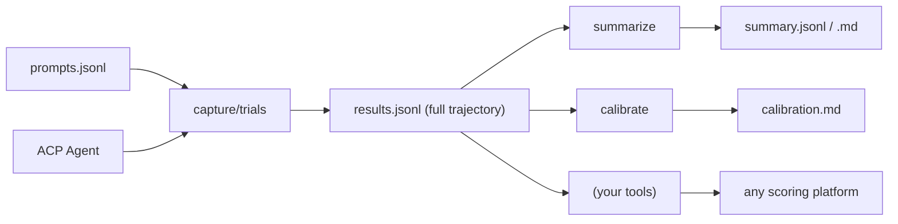

# ACP Harness

## Purpose

CLI tool for capturing trajectories from ACP-compatible agents, optimized for TypeScript/JavaScript projects using Bun.

**The harness captures. You score.**

| Harness Provides | You Provide |
|------------------|-------------|
| Prompt execution against ACP agents | Scoring logic (Braintrust, custom scripts) |
| Full trajectory capture (thoughts, tools, plans) | Pass/fail determination via graders |
| Structured JSONL output | LLM-as-judge prompts |
| Reproducible execution environment | CI integration, golden file comparison |

**Use this when:**
- Capturing trajectories for downstream evaluation
- Generating training data (SFT/DPO) with full context
- Building regression test fixtures for agent behavior
- Comparing agent responses across configurations

## Installation

```bash
# Run without installing (recommended for CI)
bunx @plaited/acp-harness capture prompts.jsonl bunx claude-code-acp -o results.jsonl

# Or install globally for repeated use
bun add -g @plaited/acp-harness
acp-harness capture prompts.jsonl bunx claude-code-acp -o results.jsonl

# Or add as project dependency
bun add @plaited/acp-harness
```

**Note:** Examples below use `acp-harness` (the command available after global install). Replace with `bunx @plaited/acp-harness` if not installed globally.

## Core Principle: Capture Once, Derive Many Views



**Single output format:** Full trajectory JSONL (always)
**No `--format` flag:** Derive views with separate commands
**Schema exports:** Zod schemas + JSON Schema for any tooling

## Commands

| Command | Input | Output | Purpose |
|---------|-------|--------|---------|
| `capture` | prompts.jsonl + agent | results.jsonl | Trajectory capture (full) |
| `trials` | prompts.jsonl + agent | trials.jsonl | Multi-run + optional metrics |
| `summarize` | results.jsonl | summary.jsonl or .md | Derive compact views |
| `calibrate` | results.jsonl | calibration.md | Sample failures for review |
| `validate-refs` | prompts.jsonl | validation.jsonl | Check reference solutions |
| `balance` | prompts.jsonl | balance.json | Analyze test set coverage |
| `schemas` | (none) | JSON Schema | Export schemas for non-TS users |

All commands support optional `--grader ./grader.ts` for scoring.

## Capture Command

### Basic Usage

```bash
acp-harness capture <prompts.jsonl> <command> [args...] [options]
```

### Arguments

| Argument/Flag | Description | Default |
|------|-------------|---------|
| `prompts.jsonl` | Input file with prompts to execute | Required |
| `command [args]` | ACP agent command (e.g., `bunx claude-code-acp`) | Required |
| `-o, --output` | Output file/path | stdout |
| `-c, --cwd` | Working directory for agent | current |
| `-t, --timeout` | Request timeout in ms | `60000` |
| `--progress` | Show progress to stderr | false |
| `--append` | Append to output file | false |
| `--mcp-server` | MCP server config JSON (repeatable) | none |
| `-g, --grader` | Path to grader module | none |

### Examples

```bash
# Basic capture
acp-harness capture prompts.jsonl bunx claude-code-acp -o results.jsonl

# Using a local adapter script
acp-harness capture prompts.jsonl bun ./my-adapter.ts -o results.jsonl

# With grader (adds score to each result)
acp-harness capture prompts.jsonl bunx claude-code-acp --grader ./grader.ts -o results.jsonl

# With MCP server
acp-harness capture prompts.jsonl bunx claude-code-acp \
  --mcp-server '{"type":"stdio","name":"fs","command":"mcp-filesystem","args":["/data"],"env":[]}' \
  -o results.jsonl
```

## Trials Command

Run each prompt multiple times for pass@k/pass^k analysis.

```bash
# Capture only (no grader)
acp-harness trials prompts.jsonl bunx claude-code-acp -k 5 -o trials.jsonl

# With grader (computes pass@k, pass^k)
acp-harness trials prompts.jsonl bunx claude-code-acp -k 5 --grader ./grader.ts -o trials.jsonl
```

### Output

Without grader:
```jsonl
{"id":"search-001","input":"Find the CEO","k":5,"trials":[{"trialNum":1,"output":"...","trajectory":[...],"duration":1234},...]}
```

With grader:
```jsonl
{"id":"search-001","input":"Find the CEO","k":5,"passRate":0.8,"passAtK":0.99,"passExpK":0.33,"trials":[{"trialNum":1,"output":"...","pass":true,"score":1.0},...]}
```

## Summarize Command

Derive compact views from full trajectory results.

```bash
# Summary JSONL (for jq analysis)
acp-harness summarize results.jsonl -o summary.jsonl

# Markdown (for LLM-as-judge)
acp-harness summarize results.jsonl --markdown -o results.md
```

## Calibrate Command

Sample failures for grader review. Calibration helps you distinguish between **agent failures** (agent did wrong thing) and **grader bugs** (agent was correct, grader too strict).

```bash
# Sample failures for human review
acp-harness calibrate results.jsonl --sample 10 -o calibration.md

# Re-score with different grader to compare
acp-harness calibrate results.jsonl --grader ./loose-grader.ts --sample 10 -o comparison.md
```

See [eval-concepts.md](references/eval-concepts.md#grader-calibration) for why calibration matters.

## Validate-Refs Command

Check that reference solutions pass your grader before evaluating agents.

```bash
# Validate reference solutions
acp-harness validate-refs prompts.jsonl --grader ./grader.ts -o validation.jsonl

# Check for failures
cat validation.jsonl | jq 'select(.pass == false)'
```

### Why Use This?

If your reference solution fails your own grader:
- The task definition is ambiguous
- The grader is too strict
- The expected output is wrong

**Fix the eval before evaluating the agent.**

### Input Format

Prompts must include a `reference` field:

```jsonl
{"id":"test-001","input":"Create a button component","expected":"<button>","reference":"export const Button = () => <button>Click</button>"}
```

### Output Format

```jsonl
{"id":"test-001","input":"Create a button component","reference":"export const Button = () => <button>Click</button>","pass":true,"score":1.0,"reasoning":"Contains expected element"}
```

## Balance Command

Analyze test set coverage to ensure balanced evaluation.

```bash
# Analyze prompt distribution
acp-harness balance prompts.jsonl -o balance.json

# Pretty print
acp-harness balance prompts.jsonl | jq .
```

### Why Use This?

An eval with only "make X work" misses "don't break Y". Balance analysis shows:

- **Category distribution** (from `metadata.category`)
- **Positive/negative case ratio**
- **Coverage gaps**

### Output Format

```json
{
  "total": 50,
  "categories": {
    "ui": 20,
    "logic": 15,
    "api": 10,
    "edge-case": 5
  },
  "hasExpected": 45,
  "hasReference": 30,
  "hasMetadata": 50
}
```

### Balanced Eval Design

Include both positive and negative cases:

| Type | Example | Purpose |
|------|---------|---------|
| Positive | "Add a login button" | Agent should succeed |
| Negative | "Add a button without breaking tests" | Agent should not break things |
| Edge case | "Handle empty input gracefully" | Agent should be robust |

See [eval-concepts.md](references/eval-concepts.md#test-set-balance) for more on balanced test sets.

## Schemas Command

Export JSON schemas for non-TypeScript tools.

```bash
# List available schemas
acp-harness schemas

# Export all schemas as JSON
acp-harness schemas --json -o schemas.json

# Export specific schema
acp-harness schemas CaptureResult --json
acp-harness schemas TrialResult --json
acp-harness schemas GraderResult --json
```

### Available Schemas

| Schema | Description |
|--------|-------------|
| `CaptureResult` | Single capture output (id, input, output, trajectory, timing) |
| `TrialResult` | Multi-run trial output (includes passAtK, passExpK) |
| `GraderResult` | Grader return value (pass, score, reasoning) |
| `PromptInput` | Input prompt format |
| `TrajectoryStep` | Single step in trajectory array |
| `SummaryResult` | Compact summary format |

### Usage in Other Languages

Export schemas for validation in Python, Go, etc.:

```bash
# Export all schemas
acp-harness schemas --json -o schemas.json

# Use in Python with jsonschema
python -c "
import json
from jsonschema import validate

with open('schemas.json') as f:
    schemas = json.load(f)

with open('results.jsonl') as f:
    for line in f:
        result = json.loads(line)
        validate(result, schemas['CaptureResult'])
        print(f'{result[\"id\"]}: valid')
"
```

## Grader Interface

Graders provide semantic pass/fail scoring for captured trajectories. The harness supports graders written in **any language**.

### TypeScript Grader

```typescript
// my-grader.ts
import type { Grader } from '@plaited/acp-harness/schemas'

export const grade: Grader = async ({ input, output, expected, trajectory }) => {
  const pass = output.toLowerCase().includes(expected?.toLowerCase() ?? '')
  return {
    pass,
    score: pass ? 1 : 0,
    reasoning: pass ? 'Contains expected answer' : 'Missing expected answer'
  }
}
```

### Python/Executable Graders

Any executable can be a grader using stdin/stdout JSON protocol:

```python
#!/usr/bin/env python3
import json, sys

data = json.load(sys.stdin)
output = data.get("output", "").lower()
expected = (data.get("expected") or "").lower()

pass_result = expected in output if expected else True
print(json.dumps({
    "pass": pass_result,
    "score": 1.0 if pass_result else 0.0,
    "reasoning": "Contains expected" if pass_result else "Missing expected"
}))
```

```bash
chmod +x ./grader.py
acp-harness capture prompts.jsonl bunx claude-code-acp --grader ./grader.py -o results.jsonl
```

See [graders.md](references/graders.md) for complete polyglot grader documentation including shell scripts and LLM-as-judge patterns.

## Input Format

Each line in `prompts.jsonl`:

```jsonl
{"id":"test-001","input":"Create a primary button","expected":"should contain <button>","metadata":{"category":"ui"}}
{"id":"test-002","input":"Write a function for form validation","metadata":{"category":"logic"}}
```

| Field | Required | Description |
|-------|----------|-------------|
| `id` | Yes | Unique identifier |
| `input` | Yes | Prompt text for the agent |
| `expected` | No | Expected output (for downstream scoring) |
| `reference` | No | Reference solution (for validate-refs) |
| `metadata` | No | Tags, category, difficulty for filtering |
| `timeout` | No | Override default timeout for this prompt |

## Output Format

Full trajectory JSONL (always):

```jsonl
{
  "id": "test-001",
  "input": "Find the CEO of Anthropic",
  "output": "The CEO of Anthropic is Dario Amodei.",
  "trajectory": [
    {"type": "thought", "content": "I'll search for this...", "timestamp": 100, "stepId": "test-001-step-1"},
    {"type": "tool_call", "name": "WebSearch", "status": "completed", "input": {...}, "output": {...}, "duration": 500, "stepId": "test-001-step-2"},
    {"type": "message", "content": "The CEO of Anthropic is Dario Amodei.", "timestamp": 700, "stepId": "test-001-step-3"}
  ],
  "metadata": {"category": "search", "agent": "claude-code-acp"},
  "timing": {"start": 1704067200000, "end": 1704067201234, "firstResponse": 100},
  "toolErrors": false
}
```

**Note:** `toolErrors` replaces misleading `status: 'passed'|'failed'`. Real pass/fail comes from YOUR grader.

## Schema Exports

Consumers can import Zod schemas directly:

```typescript
import { CaptureResultSchema, TrialResultSchema } from '@plaited/acp-harness/schemas'

// Validate external data
const result = CaptureResultSchema.parse(jsonData)

// Generate JSON Schema (Zod 4 native)
import { z } from 'zod'
const jsonSchema = z.toJSONSchema(CaptureResultSchema)
```

Or export JSON schemas for non-TypeScript tools:

```bash
acp-harness schemas --json -o schemas.json
acp-harness schemas CaptureResult --json
```

## Execution Environment

**Recommendation:** Run the harness in Docker containers for consistent, isolated execution.

```bash
docker compose -f docker-compose.acp.yml run --rm acp-harness
```

See [assets/](assets/) for example container configurations.

## Downstream Integration

The harness outputs standard JSONL that pipes to any tool:

```bash
# Filter with jq
cat results.jsonl | jq 'select(.metadata.category == "ui")'

# Count tool usage
cat results.jsonl | jq -s 'map(.trajectory | map(select(.type == "tool_call")) | length) | add'

# Summarize for quick analysis
acp-harness summarize results.jsonl -o summary.jsonl
```

See [downstream.md](references/downstream.md) for integration patterns with Braintrust, Gemini, and custom scorers.

## Quick Reference

| Resource | Description |
|----------|-------------|
| `bunx @plaited/acp-harness` | CLI help |
| [output-formats.md](references/output-formats.md) | JSONL schemas, command details |
| [downstream.md](references/downstream.md) | Integration patterns (Braintrust, jq, custom scorers) |
| [graders.md](references/graders.md) | Polyglot grader documentation (TypeScript, Python, shell) |
| [eval-concepts.md](references/eval-concepts.md) | Evaluation concepts (pass@k, pass^k, calibration) |

## Related

- **[@agentclientprotocol/sdk](https://www.npmjs.com/package/@agentclientprotocol/sdk)** - ACP SDK for programmatic access
- **[@zed-industries/claude-code-acp](https://www.npmjs.com/package/@zed-industries/claude-code-acp)** - Claude Code ACP adapter
