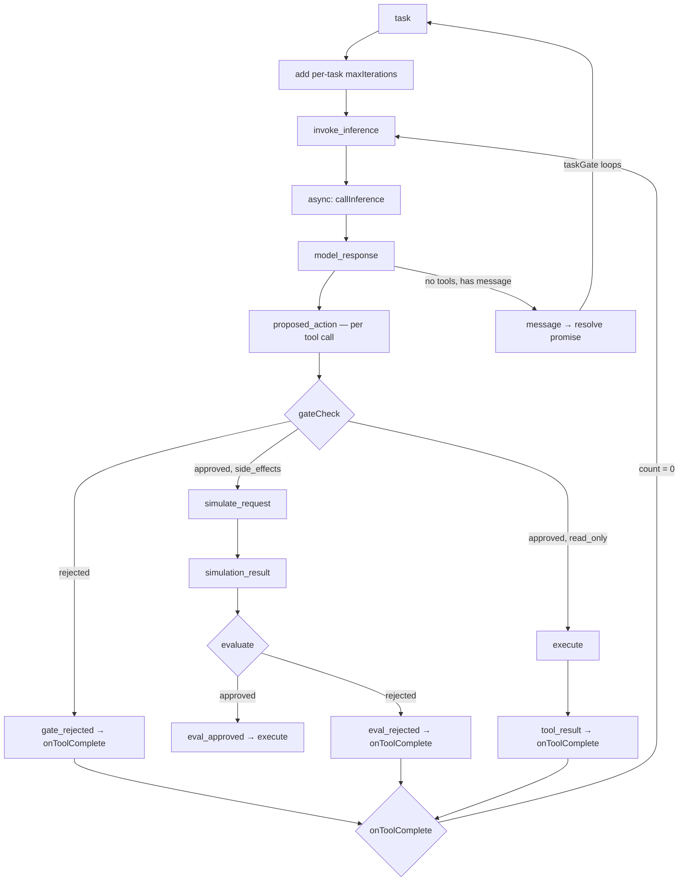

# Agent Build

## Purpose

This is the **development context** for building the agent framework across Waves 1–6. It captures research insights, architectural decisions, and coordination patterns that must survive context compaction. Activate this skill before any agent module work.

**Use this when:**
- Implementing or modifying `src/agent/` files
- Planning wave features (memory, event log, orchestrator, constitution)
- Resuming work after context compaction
- Writing tests for agent behavior
- Designing bThread coordination for the agent loop

## Architecture Overview

### The 6-Step Agent Loop

```
Context → Reason → Gate → Simulate → Evaluate → Execute
```

Each step is a BP event. The loop is driven by async feedback handlers calling `trigger()` — the BP engine is synchronous, async work happens in handlers.

### Event Flow (Current — Post-Refactor)



### Event Vocabulary

All events defined in `agent.constants.ts`:

| Event | Step | Handler Behavior |
|-------|------|-----------------|
| `task` | 1 | Add per-task maxIterations bThread, push prompt, trigger invoke_inference |
| `invoke_inference` | 1 | Async: callInference → trigger model_response (centralized, single call site) |
| `model_response` | 2 | Parse response, dispatch tool calls in parallel |
| `proposed_action` | 3 | Run gateCheck, route to approved/rejected |
| `gate_approved` | 3 | Route by risk class: read_only→execute, else→simulate |
| `gate_rejected` | 3 | Synthetic tool result, onToolComplete |
| `simulate_request` | 4 | Call simulate seam (async), route to simulation_result |
| `simulation_result` | 5 | checkSymbolicGate + optional evaluate seam |
| `eval_approved` | 5 | Trigger execute |
| `eval_rejected` | 5 | Synthetic tool result, onToolComplete |
| `execute` | 6 | Call toolExecutor (async), record trajectory |
| `tool_result` | 6 | Clean up simulation state, onToolComplete |
| `save_plan` | — | Store plan, trigger plan_saved |
| `plan_saved` | — | Trigger invoke_inference |
| `message` | — | Resolve run() promise (taskGate loops back to blocking) |

### Current bThreads (Post-Refactor)

```typescript
// Session-level threads (set once at creation)
bThreads.set({
  // Phase-transition: blocks TASK_EVENTS between tasks
  taskGate: bThread([
    bSync({ waitFor: 'task', block: (e) => TASK_EVENTS.has(e.type) }),
    bSync({ waitFor: 'message' }),
  ], true),

  // Blocks execute for tool calls with pending simulations
  simulationGuard: bThread([
    bSync({ block: (e) => e.type === 'execute' && simulatingIds.has(e.detail?.toolCall?.id) }),
  ], true),

  // Blocks execute if prediction matches dangerous patterns
  symbolicSafetyNet: bThread([
    bSync({ block: (e) => {
      if (e.type !== 'execute') return false
      const pred = simulationPredictions.get(e.detail?.toolCall?.id)
      return pred ? checkSymbolicGate(pred, patterns).blocked : false
    } }),
  ], true),
})

// Per-task thread (added dynamically in 'task' handler, interrupted by 'message')
bThreads.set({
  maxIterations: bThread([
    ...Array.from({ length: N }, () =>
      bSync({ waitFor: 'tool_result', interrupt: ['message'] })
    ),
    bSync({
      block: 'execute',
      request: { type: 'message', detail: { content: '...' } },
      interrupt: ['message'],
    }),
  ]),
})
```

### Key Coordination Patterns

**taskGate** eliminates the `done` flag entirely:
- Phase 1: blocks all TASK_EVENTS, waits for `task`
- Phase 2: allows all events, waits for `message`
- Loops: `message` → back to phase 1 (blocking)
- Stale async triggers after `message` are silently dropped by the block predicate

**Per-task maxIterations** solves the multi-run bug:
- Added fresh in each `task` handler (thread name freed after interrupt)
- Each bSync has `interrupt: [message]` — killed when task ends
- Next `run()` gets a clean counter

**invoke_inference** centralizes 3 former call sites:
- `task` handler → `trigger(invoke_inference)`
- `plan_saved` handler → `trigger(invoke_inference)`
- `onToolComplete()` (count=0) → `trigger(invoke_inference)`
- Single async handler with one try/catch

**onToolComplete()** is sync (replaces async checkComplete):
- Decrements counter, triggers invoke_inference at 0
- No await boundary = no stale-state risk

### Module Map

| File | Purpose | Lines |
|------|---------|-------|
| `agent.ts` | Main loop: bThreads + feedback handlers + run/destroy | ~515 |
| `agent.types.ts` | All type definitions: seams, events, detail types | ~292 |
| `agent.schemas.ts` | Zod schemas: AgentToolCall, AgentPlan, GateDecision, etc. | ~180 |
| `agent.constants.ts` | Event constants (AGENT_EVENTS), risk classes, tool status | ~59 |
| `agent.utils.ts` | parseModelResponse, buildContextMessages, trajectory recorder | ~170 |
| `agent.constitution.ts` | classifyRisk + createGateCheck with customChecks | ~80 |
| `agent.tools.ts` | createToolExecutor with built-in tools (read/write/list/bash) | ~160 |
| `agent.simulate.ts` | Dreamer: buildStateTransitionPrompt, createSimulate, createSubAgentSimulate | ~150 |
| `agent.evaluate.ts` | Judge: checkSymbolicGate, buildRewardPrompt, createEvaluate | ~170 |
| `agent.simulate-worker.ts` | Sub-agent entry point for IPC-based simulation | ~30 |

## BP Refactor — Completed (Task #13)

The `done` flag and 26 `if (done) return` guards were replaced with structural BP coordination. Key changes:

| Before | After |
|--------|-------|
| `let done = false` + 26 guards | `taskGate` bThread (phase-transition) |
| Session-level `maxIterations` (consumed once) | Per-task `maxIterations` with `interrupt: [message]` |
| `async checkComplete()` (3 `if(done)` guards) | Sync `onToolComplete()` → `trigger(invoke_inference)` |
| 3 separate `callInference()` call sites | Single `invoke_inference` async handler |
| `done = true` in message handler | taskGate loops back to blocking automatically |
| `done = true/false` in run/destroy | Not needed — structural coordination |

### Key Discoveries from Exploration Tests

**Ephemeral vs Persistent Blocks** (agent-patterns.spec.ts):
- A sync point with `block + request` loses its block after the request fires
- maxIterations' block on `execute` is EPHEMERAL — after `message` fires, the thread ends and the block vanishes
- For permanent blocking after a sequence, compose with a persistent thread (doneGuard) or use the taskGate pattern

**Phase-Transition > Shared State** (agent-orchestration.spec.ts):
- Using thread position for coordination is more reliable than shared-state predicates
- The orchestrator routing test failed when using `activeProject !== null` because the handler set state before triggering — the block predicate saw stale timing
- Fix: two-phase bThread (waitFor → block → loop) makes sequencing structural

**Blocked Events Are Silently Dropped**:
- BP does NOT queue blocked events. If `trigger()` fires something that a bThread blocks, it disappears
- The caller must retry after the block lifts
- The taskGate test proves stale async triggers are silently dropped between tasks

**Infinite Super-Step Anti-Pattern**:
- `repeat: true` + continuous `request` = stack overflow
- Agent events must enter via `trigger()` from async handlers, breaking the synchronous chain

## Wave Roadmap

| Wave | Focus | Status | Key BP Patterns |
|------|-------|--------|----------------|
| 1 | Tool executor, gate, multi-tool | Done (86 tests) | maxIterations bThread |
| 2 | Simulate + Evaluate | Done (140 tests) | simulationGuard, symbolicSafetyNet, taskGate, invoke_inference |
| 3 | Memory (SQLite + discovery) | Next | Discovery gating (searchGate bThread) |
| 4 | Event log + persistence | Planned | useSnapshot → SQLite append |
| 5 | Orchestrator (multi-project) | Planned | Phase-transition routing, dynamic project threads |
| 6 | Constitution as bThreads | Planned | Config-driven additive rules |

### Wave 3: Memory & Discovery
- SQLite for conversation history, plan steps, event log
- Discovery pipeline: FTS5 → LSP → semantic search
- `searchGate` bThread blocks search results during active tool execution

### Wave 4: Event Log
- `useSnapshot()` captures every BP decision
- Projection: snapshot → structured log entries with `blockedBy` info
- SQLite append-only event log
- Model sees its own coordination history in context

### Wave 5: Orchestrator
- Central BP program routes tasks to project subprocesses
- Phase-transition `oneAtATime` bThread enforces sequential projects
- Dynamic `project_{name}` threads per active project (interrupted by shutdown)
- IPC trigger bridge: `Bun.spawn()` subprocess ↔ `trigger()` via IPC

### Wave 6: Constitution as bThreads
- Each safety rule = independent blocking bThread
- Rules compose additively (block takes precedence)
- Config-driven: JSON/TOML → bThread factories
- Runtime rule addition without modifying existing threads

## Testing Seam Pattern

All external dependencies are injected as function parameters:

```typescript
createAgentLoop({
  inferenceCall,  // mock in tests
  toolExecutor,   // mock in tests
  gateCheck,      // optional, defaults to approve-all
  simulate,       // optional, Wave 2
  evaluate,       // optional, Wave 2
  patterns,       // optional, custom symbolic gate patterns
})
```

Tests use mock implementations that return controlled responses. See `agent.spec.ts` for patterns.

## Exploration Test Files

These tests validate BP mechanisms before applying them to agent.ts:

| File | Tests | Location |
|------|-------|----------|
| agent-patterns.spec.ts | 14 | `src/behavioral/tests/` |
| agent-lifecycle.spec.ts | 5 | `src/behavioral/tests/` |
| agent-orchestration.spec.ts | 10 | `src/behavioral/tests/` |

**Total: 29 exploration tests + 103 behavioral tests + 140 agent tests = 272 total**

## Related Skills

- **behavioral-core** — BP patterns and algorithm reference (shipped with framework)
- **code-patterns** — Coding conventions for utility functions
- **code-documentation** — TSDoc standards
