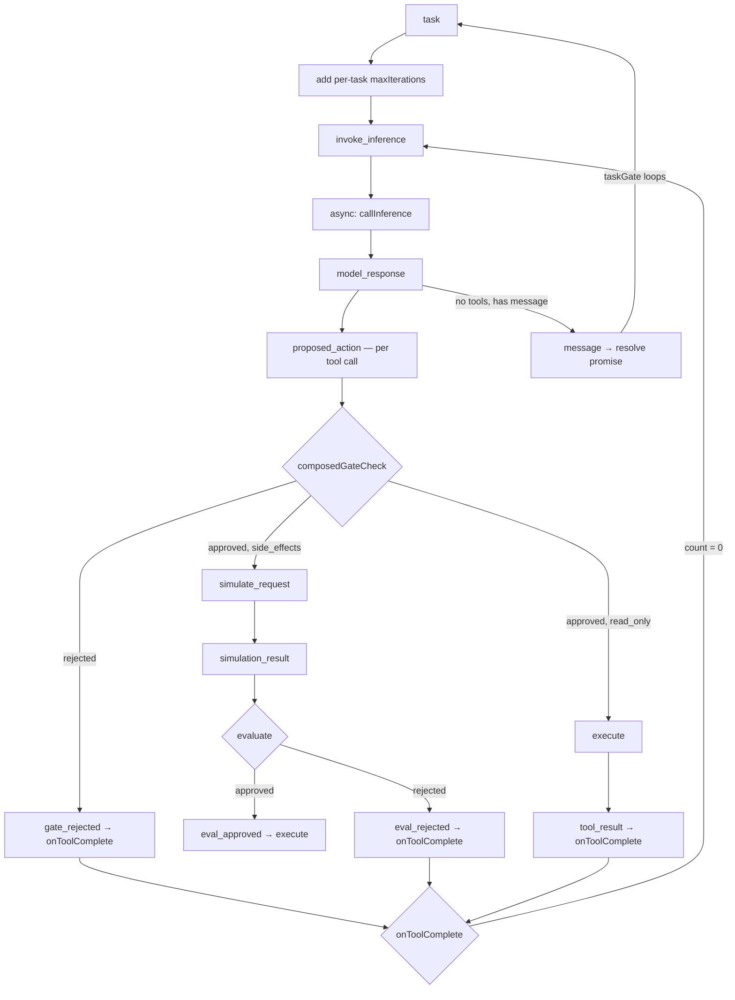

# Agent Build

## Purpose

This is the **development context** for the agent framework — all 6 waves are complete. It captures research insights, architectural decisions, and coordination patterns that must survive context compaction. Activate this skill before any agent module work.

**Use this when:**
- Implementing or modifying `src/agent/` files
- Resuming work after context compaction
- Writing tests for agent behavior
- Designing bThread coordination for the agent loop
- Addressing outstanding issues (see below)

## Architecture Overview

### The 6-Step Agent Loop

```
Context → Reason → Gate → Simulate → Evaluate → Execute
```

Each step is a BP event. The loop is driven by async feedback handlers calling `trigger()` — the BP engine is synchronous, async work happens in handlers.

### Event Flow



Note: `composedGateCheck` = constitution gateCheck → custom gateCheck (short-circuits on rejection).

### Event Vocabulary

All events defined in `agent.constants.ts`:

| Event | Step | Handler Behavior |
|-------|------|-----------------|
| `task` | 1 | Add per-task maxIterations bThread, push prompt, trigger invoke_inference |
| `invoke_inference` | 1 | Async: callInference → trigger model_response (centralized, single call site) |
| `model_response` | 2 | Parse response, dispatch tool calls in parallel |
| `proposed_action` | 3 | Run composedGateCheck, route to approved/rejected |
| `gate_approved` | 3 | Route by risk class: read_only→execute, else→simulate |
| `gate_rejected` | 3 | Synthetic tool result, onToolComplete |
| `simulate_request` | 4 | Call simulate seam (async), route to simulation_result |
| `simulation_result` | 5 | checkSymbolicGate + optional evaluate seam |
| `eval_approved` | 5 | Trigger execute |
| `eval_rejected` | 5 | Synthetic tool result, onToolComplete |
| `execute` | 6 | Call toolExecutor (async), record trajectory |
| `tool_result` | 6 | Clean up simulation state, onToolComplete |
| `save_plan` | — | Store plan, trigger plan_saved |
| `plan_saved` | — | Trigger invoke_inference |
| `message` | — | Resolve run() promise (taskGate loops back to blocking) |

### Current bThreads

```typescript
// Session-level threads (set once at creation)
bThreads.set({
  // Phase-transition: blocks TASK_EVENTS between tasks
  taskGate: bThread([
    bSync({ waitFor: 'task', block: (e) => TASK_EVENTS.has(e.type) }),
    bSync({ waitFor: 'message' }),
  ], true),

  // Blocks execute for tool calls with pending simulations
  simulationGuard: bThread([
    bSync({ block: (e) => e.type === 'execute' && simulatingIds.has(e.detail?.toolCall?.id) }),
  ], true),

  // Blocks execute if prediction matches dangerous patterns
  symbolicSafetyNet: bThread([
    bSync({ block: (e) => {
      if (e.type !== 'execute') return false
      const pred = simulationPredictions.get(e.detail?.toolCall?.id)
      return pred ? checkSymbolicGate(pred, patterns).blocked : false
    } }),
  ], true),

  // Constitution bThreads — one per rule, additive blocking (defense-in-depth)
  ...constitutionResult?.threads,
  // Each constitution_{name} thread: bThread([bSync({ block: predicate })], true)
})

// Per-task thread (added dynamically in 'task' handler, interrupted by 'message')
bThreads.set({
  maxIterations: bThread([
    ...Array.from({ length: N }, () =>
      bSync({ waitFor: 'tool_result', interrupt: ['message'] })
    ),
    bSync({
      block: 'execute',
      request: { type: 'message', detail: { content: '...' } },
      interrupt: ['message'],
    }),
  ]),
})
```

### Key Coordination Patterns

**taskGate** eliminates the `done` flag entirely:
- Phase 1: blocks all TASK_EVENTS, waits for `task`
- Phase 2: allows all events, waits for `message`
- Loops: `message` → back to phase 1 (blocking)
- Stale async triggers after `message` are silently dropped by the block predicate

**Per-task maxIterations** solves the multi-run bug:
- Added fresh in each `task` handler (thread name freed after interrupt)
- Each bSync has `interrupt: [message]` — killed when task ends
- Next `run()` gets a clean counter

**invoke_inference** centralizes 3 former call sites:
- `task` handler → `trigger(invoke_inference)`
- `plan_saved` handler → `trigger(invoke_inference)`
- `onToolComplete()` (count=0) → `trigger(invoke_inference)`
- Single async handler with one try/catch

**onToolComplete()** is sync (replaces async checkComplete):
- Decrements counter, triggers invoke_inference at 0
- No await boundary = no stale-state risk

**constitution dual-layer safety** (Wave 6):
- bThread layer: blocks `execute` events as defense-in-depth (mirrors `symbolicSafetyNet`)
- Imperative layer: runs same rules in `composedGateCheck`, routes violations to `gate_rejected` for model feedback
- Constitution runs before custom gateCheck (short-circuits on rejection)

### Module Map

| File | Purpose |
|------|---------|
| `agent.ts` | Main loop: bThreads + feedback handlers + run/destroy |
| `agent.types.ts` | All type definitions: seams, events, detail types |
| `agent.schemas.ts` | Zod schemas: AgentToolCall, AgentPlan, GateDecision, etc. |
| `agent.constants.ts` | Event constants (AGENT_EVENTS), risk classes, tool status |
| `agent.utils.ts` | parseModelResponse, buildContextMessages, trajectory recorder |
| `agent.constitution.ts` | classifyRisk, createGateCheck, createConstitution, constitutionRule |
| `agent.constitution.types.ts` | ConstitutionRule, ConstitutionRuleConfig, Constitution types |
| `agent.tools.ts` | createToolExecutor with built-in tools (read/write/list/bash) |
| `agent.simulate.ts` | Dreamer: buildStateTransitionPrompt, createSimulate, createSubAgentSimulate |
| `agent.evaluate.ts` | Judge: checkSymbolicGate, buildRewardPrompt, createEvaluate |
| `agent.simulate-worker.ts` | Sub-agent entry point for IPC-based simulation |
| `agent.memory.ts` | SQLite persistence: sessions, messages, event log, FTS5 search |
| `agent.memory.types.ts` | MemoryDb type definitions |
| `agent.orchestrator.ts` | Multi-project coordination: process pool, IPC bridge, oneAtATime |
| `agent.orchestrator.types.ts` | Orchestrator type definitions |
| `agent.orchestrator.constants.ts` | Orchestrator event constants |
| `agent.orchestrator-worker.ts` | Worker entry point for orchestrator subprocesses |

## Wave Completion Summary

| Wave | Focus | Status | Key BP Patterns |
|------|-------|--------|----------------|
| 1 | Tool executor, gate, multi-tool | Done | maxIterations bThread |
| 2–3 | Simulate, evaluate, memory, search | Done | simulationGuard, symbolicSafetyNet, taskGate, invoke_inference |
| 4 | Event log persistence + context injection | Done | useSnapshot → SQLite append |
| 5 | Orchestrator (multi-project) | Done | oneAtATime phase-transition, IPC bridge |
| 6 | Constitution as bThreads | Done | Additive blocking rules, dual-layer safety |

**322 total tests** (219 agent + 103 behavioral) across 25 files.

## Outstanding Issues

See `docs/WAVE-LOG.md` for full details.

| Issue | Severity | Notes |
|-------|----------|-------|
| Stale TSDoc in `agent.schemas.ts` | Low | 3 comments reference "later" for work that is now complete |
| Orchestrator IPC handler fragility | Medium | `getOrSpawnProcess()` handler replacement acknowledged as complex |
| LSP semantic search pipeline not built | Low | Wave 3 partial — FTS5 search works, LSP/semantic layers deferred |
| `searchGate` bThread not implemented | Low | Planned for Wave 3, never built |
| Eval harness canonical imports | Low | `TrajectoryStepSchema` is canonical; eval harness still uses its own copy |
| Some exported functions lack unit tests | Low | `createInferenceCall`, `createSubAgentSimulate`, `parseModelResponse`, `createTrajectoryRecorder` — all covered by integration |
| Runtime constitution via public API | Low | Deferred — `bThreads.set()` works directly for power users |

## BP Refactor — Completed (Task #13)

The `done` flag and 26 `if (done) return` guards were replaced with structural BP coordination:

| Before | After |
|--------|-------|
| `let done = false` + 26 guards | `taskGate` bThread (phase-transition) |
| Session-level `maxIterations` (consumed once) | Per-task `maxIterations` with `interrupt: [message]` |
| `async checkComplete()` (3 `if(done)` guards) | Sync `onToolComplete()` → `trigger(invoke_inference)` |
| 3 separate `callInference()` call sites | Single `invoke_inference` async handler |
| `done = true` in message handler | taskGate loops back to blocking automatically |

### Key Discoveries from Exploration Tests

**Ephemeral vs Persistent Blocks** (agent-patterns.spec.ts):
- A sync point with `block + request` loses its block after the request fires
- maxIterations' block on `execute` is EPHEMERAL — after `message` fires, the thread ends and the block vanishes

**Phase-Transition > Shared State** (agent-orchestration.spec.ts):
- Thread position for coordination is more reliable than shared-state predicates
- Two-phase bThread (waitFor → block → loop) makes sequencing structural

**Blocked Events Are Silently Dropped**:
- BP does NOT queue blocked events — they disappear
- The taskGate test proves stale async triggers are silently dropped between tasks

**Infinite Super-Step Anti-Pattern**:
- `repeat: true` + continuous `request` = stack overflow
- Agent events must enter via `trigger()` from async handlers

## Testing Seam Pattern

All external dependencies are injected as function parameters:

```typescript
createAgentLoop({
  inferenceCall,  // mock in tests
  toolExecutor,   // mock in tests
  constitution,   // optional, ConstitutionRule[] → dual-layer safety
  gateCheck,      // optional, defaults to approve-all
  simulate,       // optional, Dreamer prediction
  evaluate,       // optional, Judge scoring
  patterns,       // optional, custom symbolic gate patterns
  memory,         // optional, SQLite persistence
})
```

Tests use mock implementations that return controlled responses. See `agent.spec.ts` for patterns.

## Exploration Test Files

These tests validate BP mechanisms before applying them to agent.ts:

| File | Tests | Location |
|------|-------|----------|
| agent-patterns.spec.ts | 14 | `src/behavioral/tests/` |
| agent-lifecycle.spec.ts | 5 | `src/behavioral/tests/` |
| agent-orchestration.spec.ts | 10 | `src/behavioral/tests/` |

## Related Skills

- **behavioral-core** — BP patterns and algorithm reference (shipped with framework)
- **code-patterns** — Coding conventions for utility functions
- **code-documentation** — TSDoc standards
