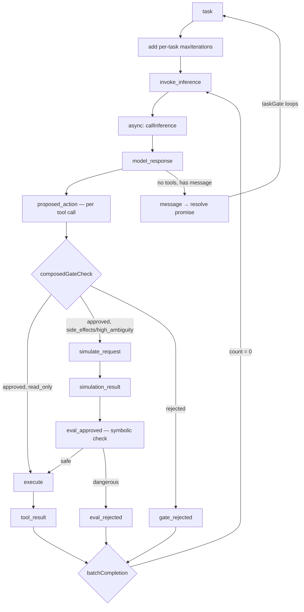

# Agent Build

## Purpose

This is the **development context** for the agent framework — actively evolving through successive waves. This is **greenfield code with zero external consumers** — no backward compatibility needed. Each wave refines the architecture toward BP-first coordination. Activate this skill before any agent module work.

**Use this when:**
- Implementing or modifying `src/agent/` files
- Resuming work after context compaction
- Writing tests for agent behavior
- Designing bThread coordination for the agent loop
- Planning the next wave

## Architecture Overview

### The 6-Step Agent Loop

```
Context → Reason → Gate → Simulate → Evaluate → Execute
```

Each step is a BP event. The loop is driven by async feedback handlers calling `trigger()` — the BP engine is synchronous, async work happens in handlers.

### Event Flow



**Pipeline principle:** Events always flow through the full simulate → evaluate → execute pipeline. Handlers pass through when seams are absent — no conditionals at the routing level.

### Event Vocabulary

All events defined in `agent.constants.ts`:

| Event | Step | Handler Behavior |
|-------|------|-----------------|
| `task` | 1 | Add per-task maxIterations bThread, push prompt, trigger invoke_inference |
| `invoke_inference` | 1 | Async: callInference → trigger model_response (centralized, single call site) |
| `model_response` | 2 | Parse response, dispatch tool calls in parallel via batchCompletion |
| `proposed_action` | 3 | Run composedGateCheck, route to approved/rejected |
| `gate_approved` | 3 | Route by risk class: read_only→execute, side_effects/high_ambiguity→simulate_request |
| `gate_rejected` | 3 | Synthetic tool result (batchCompletion counts this) |
| `simulate_request` | 4 | Call simulate seam or pass through with empty prediction |
| `simulation_result` | 5 | Call evaluate seam or trigger eval_approved |
| `eval_approved` | 5 | Symbolic safety check → execute or eval_rejected |
| `eval_rejected` | 5 | Synthetic tool result (batchCompletion counts this) |
| `execute` | 6 | Call toolExecutor (async), record trajectory |
| `tool_result` | 6 | batchCompletion counts this |
| `save_plan` | — | Store plan, trigger plan_saved |
| `plan_saved` | — | Trigger invoke_inference |
| `message` | — | Resolve run() promise (taskGate loops back to blocking) |

### Current bThreads

```typescript
// Session-level threads (set once at creation)
bThreads.set({
  // Phase-transition: blocks TASK_EVENTS between tasks
  taskGate: bThread([
    bSync({ waitFor: 'task', block: (e) => TASK_EVENTS.has(e.type) }),
    bSync({ waitFor: 'message' }),
  ], true),

  // Constitution bThreads — one per rule, additive blocking (defense-in-depth)
  ...constitutionResult?.threads,
})

// Per-task thread (added dynamically in 'task' handler, interrupted by 'message')
maxIterations: bThread([
  ...Array.from({ length: N }, () =>
    bSync({ waitFor: 'tool_result', interrupt: ['message'] })
  ),
  bSync({
    block: 'execute',
    request: { type: 'message', detail: { content: '...' } },
    interrupt: ['message'],
  }),
])

// Per-response thread (added dynamically in 'model_response' handler)
batchCompletion: bThread([
  ...Array.from({ length: actionCalls.length }, () =>
    bSync({ waitFor: isCompletion, interrupt: ['message'] })
  ),
  bSync({ request: { type: 'invoke_inference' }, interrupt: ['message'] }),
])

// Per-call simulation guard (added in triggerSimulate, one per tool call)
[`sim_guard_${id}`]: bThread([
  bSync({
    block: (e) => e.type === 'execute' && e.detail?.toolCall?.id === id,
    interrupt: [(e) => e.type === 'simulation_result' && e.detail?.toolCall?.id === id],
  }),
])

// Per-call symbolic safety (added in simulate_request handler, only when dangerous)
[`safety_${id}`]: bThread([
  bSync({
    block: (e) => e.type === 'execute' && e.detail?.toolCall?.id === id,
    interrupt: [(e) =>
      (e.type === 'eval_rejected' && e.detail?.toolCall?.id === id) ||
      (e.type === 'tool_result' && e.detail?.result?.toolCallId === id)
    ],
  }),
])
```

### Unparameterized `behavioral()`

`behavioral()` is called without the `AgentEventDetails` generic. Handlers receive `any` for detail and self-validate where needed. This aligns with BP's additive composition — wire up what you need, ignore the rest. The `AgentEventDetails` type is kept as documentation only.

### Key Design Patterns

#### 1. Three-Layer Architecture (Snapshot + Handler + bThread)

Every safety constraint uses three non-substitutable layers:

| Layer | Purpose | Mechanism |
|-------|---------|-----------|
| **Snapshot** | Observability — model sees who blocked/interrupted what | `SelectionBid.blockedBy`, `SelectionBid.interrupts` → SQLite → system prompt |
| **Handler** | Workflow coordination — produce events for counting threads | Routes to rejection event (batchCompletion counts) |
| **bThread** | Structural safety — defense-in-depth | Blocks execute, observable but doesn't produce workflow events |

**Why all three?** A blocked event doesn't produce a workflow event. If `batchCompletion` counts N completions and one is blocked, the batch deadlocks. The handler produces the rejection event. The bThread catches anything the handler misses. The snapshot makes it all visible to the model.

#### 2. Per-Call Dynamic Threads with Predicate Interrupt

Instead of persistent threads reading shared mutable state, each tool call gets its own guard thread:

- `sim_guard_{id}`: blocks execute while simulation is pending, interrupted by `simulation_result`
- `safety_{id}`: blocks execute for dangerous predictions, interrupted by resolution
- Block and interrupt both use **predicate listeners** scoped to the specific tool call ID
- Self-terminating via interrupt — no cleanup needed

**Observable lifecycle:** `SelectionBid.blockedBy: "sim_guard_tc-1"` and `SelectionBid.interrupts: "sim_guard_tc-1"` appear in snapshots, are persisted to SQLite, and fed to the model's system prompt.

#### 3. Pipeline Pass-Through

Events flow through the full simulate → evaluate → execute pipeline regardless of which seams are present:

```
gate_approved → simulate_request → simulation_result → eval_approved → execute
```

When a seam is absent, the handler passes through:
- No `simulate` → `simulate_request` triggers `simulation_result` with empty prediction
- No `evaluate` → `simulation_result` triggers `eval_approved`

This eliminates conditional routing. Adding/removing seams is a handler-level concern, not a routing change.

#### 4. Phase-Transition Gate (taskGate)

Thread position IS the coordination state — no external variables:
- Phase 1: blocks all TASK_EVENTS, waits for `task`
- Phase 2: allows all events, waits for `message`
- Loops: `message` → back to phase 1 (blocking)
- Stale async triggers are silently dropped by the block predicate

#### 5. Interrupt as Structural Lifecycle

`interrupt` is a general lifecycle management tool, not just for task-end cleanup:

| Thread | Interrupt Trigger | Lifecycle Meaning |
|--------|------------------|-------------------|
| `maxIterations` | `message` | Task ended |
| `batchCompletion` | `message` | Task ended mid-batch |
| `sim_guard_{id}` | `simulation_result` (predicate) | Simulation completed for this call |
| `safety_{id}` | `eval_rejected` or `tool_result` (predicate) | Tool call resolved |

Each interrupt is observable via `SelectionBid.interrupts` in snapshots.

#### 6. Thin Handlers, Structural Coordination

Handlers do ONE thing. Routing and lifecycle belong in bThreads:

| DO in handlers | DON'T in handlers |
|----------------|-------------------|
| Call seams (inference, simulate, evaluate, execute) | Route between pipeline stages conditionally |
| Parse/format data | Check if seams exist to decide routing |
| Push to history | Maintain lifecycle state (done flags) |
| Produce rejection events for model feedback | Read shared mutable state for blocking decisions |

### Module Map

| File | Purpose |
|------|---------|
| `agent.ts` | Main loop: bThreads + feedback handlers + run/destroy |
| `agent.types.ts` | Type definitions: seams, events, detail types, AgentEventDetails (reference) |
| `agent.schemas.ts` | Zod schemas: AgentToolCall, AgentPlan, GateDecision, etc. |
| `agent.constants.ts` | Event constants (AGENT_EVENTS), risk classes, tool status |
| `agent.utils.ts` | parseModelResponse, buildContextMessages (with snapshot context), trajectory recorder |
| `agent.tools.ts` | createToolExecutor with built-in tools (read/write/list/bash) |
| `agent.simulate.ts` | Dreamer: buildStateTransitionPrompt, createSimulate, createSubAgentSimulate |
| `agent.evaluate.ts` | Judge: checkSymbolicGate, buildRewardPrompt, createEvaluate |
| `agent.memory.ts` | SQLite persistence: sessions, messages, event log, FTS5 search |
| `agent.orchestrator.ts` | Multi-project coordination: process pool, IPC bridge, oneAtATime |

## Wave Completion Summary

| Wave | Focus | Status | Key BP Patterns |
|------|-------|--------|----------------|
| 1 | Tool executor, gate, multi-tool | Done | maxIterations bThread |
| 2–3 | Simulate, evaluate, memory, search | Done | taskGate, invoke_inference, simulation coordination |
| 4 | Event log persistence + context injection | Done | useSnapshot → SQLite append |
| 5 | Orchestrator (multi-project) | Done | oneAtATime phase-transition, IPC bridge |
| 6 | Constitution as bThreads | Done | Additive blocking rules, dual-layer safety |
| 7 | BP-first architecture + snapshot context | Done | Pipeline pass-through, unparameterized behavioral(), three-layer architecture |
| 8 | Per-call dynamic threads + snapshot observability | Done | Predicate interrupt lifecycle, per-call guards, eliminated shared mutable state |

**1151 total tests** (all passing) across 79 files.

## Key Discoveries (Accumulated)

**Blocks and Interrupts Are Observable** (Wave 8):
- `SelectionBid.blockedBy` records the blocking thread; `SelectionBid.interrupts` records the interrupted thread
- Snapshots are persisted to SQLite via `useSnapshot` and fed to model context via `formatSelectionContext`
- The model literally sees "Blocked: execute (thread: sim_guard_tc-1) by sim_guard_tc-1" in its system prompt

**Per-Call Threads > Persistent Shared-State Threads** (Wave 8):
- Instead of one persistent thread reading a mutable Set/Map, each tool call gets its own guard thread
- Predicate interrupts (`interrupt: [(e) => e.type === X && e.detail?.id === id]`) scope lifecycle to specific calls
- Thread self-terminates via interrupt — no cleanup, no shared state

**Three Non-Substitutable Layers** (Wave 7→8):
- Snapshot observes (model sees blocks/interrupts in context)
- Handler produces events (workflow coordination for batchCompletion counting)
- bThread prevents events (structural safety, defense-in-depth)
- You can't replace a handler with a bThread (blocked events don't produce workflow events)
- You can't rely on snapshot alone (passive observation, not coordination)

**Pipeline Pass-Through > Conditional Bypass** (Wave 7):
- Instead of `if (!seam) shortCircuit()`, events flow through the full pipeline
- Each handler does its single job or passes through
- Adding/removing seams doesn't change routing logic

**Exhaustive Type Maps Fight Additive Composition** (Wave 7):
- `Handlers<T>` mapped type requires every key — forces noop stubs
- Unparameterized `behavioral()` with `DefaultHandlers` aligns with BP's philosophy
- Self-validate with Zod at boundaries, not exhaustive type maps

**Ephemeral vs Persistent Blocks** (Wave 2):
- A sync point with `block + request` loses its block after the request fires
- maxIterations' block on `execute` is EPHEMERAL — after `message` fires, the thread ends

**Phase-Transition > Shared State** (Wave 2):
- Thread position for coordination is more reliable than shared-state predicates
- Two-phase bThread (waitFor → block → loop) makes sequencing structural

**Infinite Super-Step Anti-Pattern**:
- `repeat: true` + continuous `request` = stack overflow
- Agent events must enter via `trigger()` from async handlers

## Testing Seam Pattern

All external dependencies are injected as function parameters:

```typescript
createAgentLoop({
  inferenceCall,  // mock in tests
  toolExecutor,   // mock in tests
  constitution,   // optional, ConstitutionRule[] → dual-layer safety
  gateCheck,      // optional, defaults to approve-all
  simulate,       // optional, Dreamer prediction
  evaluate,       // optional, Judge scoring
  patterns,       // optional, custom symbolic gate patterns
  memory,         // optional, SQLite persistence
})
```

Tests use mock implementations that return controlled responses. See `agent.spec.ts` for patterns.

## Outstanding Issues

See `docs/WAVE-LOG.md` for full details.

| Issue | Severity | Notes |
|-------|----------|-------|
| Orchestrator IPC handler fragility | Medium | `getOrSpawnProcess()` handler replacement acknowledged as complex |
| LSP semantic search pipeline not built | Low | FTS5 search works; LSP and semantic layers deferred |
| `searchGate` bThread not implemented | Low | Planned for Wave 3, never built |
| Runtime constitution via public API | Low | Deferred — `bThreads.set()` works directly for power users |

## Related Skills

- **behavioral-core** — BP patterns and algorithm reference (shipped with framework)
- **code-patterns** — Coding conventions for utility functions
- **code-documentation** — TSDoc standards
