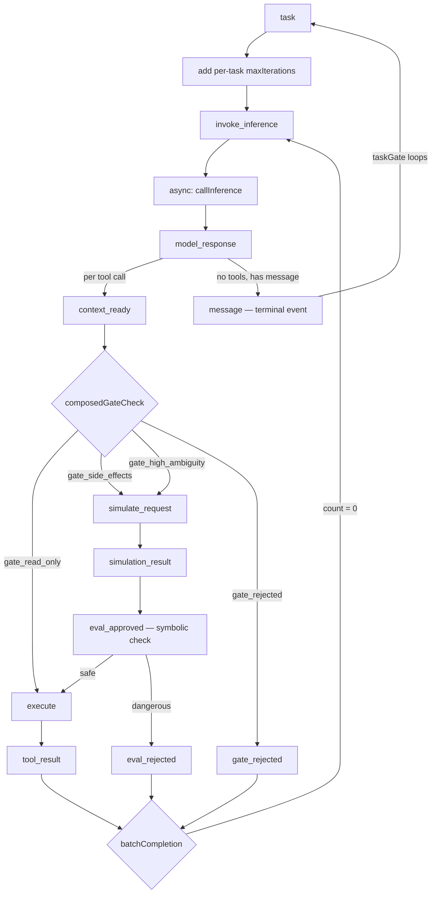

# Agent Build

## Purpose

This is the **development context** for the agent framework — actively evolving through successive waves. This is **greenfield code with zero external consumers** — no backward compatibility needed. Each wave refines the architecture toward BP-first coordination. Activate this skill before any agent module work.

**Use this when:**
- Implementing or modifying `src/agent/` files
- Resuming work after context compaction
- Writing tests for agent behavior
- Designing bThread coordination for the agent loop
- Planning the next wave

## Architecture Overview

### The 6-Step Agent Loop

```
Context → Reason → Gate → Simulate → Evaluate → Execute
```

Each step is a BP event. The loop is driven by async feedback handlers calling `trigger()` — the BP engine is synchronous, async work happens in handlers.

### Event Flow



**Narrow World View (CACM paper):** Each tool call is an independent scenario. `model_response` triggers one `context_ready` event per tool call, each flowing through its own pipeline. `batchCompletion` waits for all N to resolve, then re-invokes inference.

**Pipeline principle:** Events always flow through the full simulate → evaluate → execute pipeline. Handlers pass through when seams are absent — single-path with optional chaining, no conditional routing.

### Event Vocabulary

All events defined in `agent.constants.ts`:

| Event | Step | Handler Role |
|-------|------|-------------|
| `task` | 1 | Sensor: add per-task maxIterations bThread, push prompt, trigger invoke_inference |
| `invoke_inference` | 1 | Actuator: async callInference → trigger model_response |
| `model_response` | 2 | Transform: parse response, add batchCompletion, trigger context_ready per tool call |
| `context_ready` | 3 | Sensor: run composedGateCheck, report risk-class event |
| `gate_read_only` | 3 | Actuator: trigger execute directly (no simulation needed) |
| `gate_side_effects` | 3 | Actuator: add sim_guard, trigger simulate_request |
| `gate_high_ambiguity` | 3 | Actuator: add sim_guard, trigger simulate_request |
| `gate_rejected` | 3 | Actuator: synthetic tool result (batchCompletion counts this) |
| `simulate_request` | 4 | Sensor: call simulate seam via optional chaining, add safety_{id} if dangerous |
| `simulation_result` | 5 | Sensor: call evaluate seam via optional chaining, report approved/rejected |
| `eval_approved` | 5 | Actuator: symbolic safety check on prediction → execute or eval_rejected |
| `eval_rejected` | 5 | Actuator: synthetic tool result (batchCompletion counts this) |
| `execute` | 6 | Actuator: call toolExecutor (async), record trajectory via toToolResult |
| `tool_result` | 6 | batchCompletion counts this |
| `save_plan` | — | Store plan, trigger plan_saved |
| `plan_saved` | — | Trigger invoke_inference |
| `message` | — | Terminal event (taskGate loops back to blocking) |
| `client_connected` | — | Lifecycle: reset state, prepare for new task |
| `disconnected` | — | Lifecycle: cleanup, interrupt taskGate |

### Current bThreads

```typescript
// Session-level threads (set once at creation)
bThreads.set({
  // Outer lifecycle gate: blocks everything until client connects
  sessionGate: bThread([
    bSync({
      waitFor: 'client_connected',
      block: (e) =>
        e.type === 'task' ||
        e.type === 'disconnected' ||
        TASK_EVENTS.has(e.type),
    }),
    bSync({ waitFor: 'disconnected' }),
  ], true),

  // Phase-transition: blocks TASK_EVENTS between tasks, resets on disconnect
  taskGate: bThread([
    bSync({
      waitFor: 'task',
      block: (e) => TASK_EVENTS.has(e.type),
      interrupt: ['disconnected'],
    }),
    bSync({
      waitFor: 'message',
      interrupt: ['disconnected'],
    }),
  ], true),

  // Constitution bThreads — one per rule, additive blocking (defense-in-depth)
  ...constitutionResult?.threads,
})

// Per-task thread (added dynamically in 'task' handler, interrupted by 'message')
maxIterations: bThread([
  ...Array.from({ length: N }, () =>
    bSync({ waitFor: 'tool_result', interrupt: ['message'] })
  ),
  bSync({
    block: 'execute',
    request: { type: 'message', detail: { content: '...' } },
    interrupt: ['message'],
  }),
])

// Per-response thread (added dynamically in 'model_response' handler)
batchCompletion: bThread([
  ...Array.from({ length: actionCalls.length }, () =>
    bSync({ waitFor: isCompletion, interrupt: ['message'] })
  ),
  bSync({ request: { type: 'invoke_inference' }, interrupt: ['message'] }),
])

// Per-call simulation guard (added in gate_side_effects/gate_high_ambiguity, one per tool call)
[`sim_guard_${id}`]: bThread([
  bSync({
    block: (e) => e.type === 'execute' && e.detail?.toolCall?.id === id,
    interrupt: [(e) => e.type === 'simulation_result' && e.detail?.toolCall?.id === id],
  }),
])

// Per-call symbolic safety (added in simulate_request, only when prediction is dangerous)
// Block-only — does NOT request eval_rejected (see Key Discovery: Interrupted Thread Timing)
[`safety_${id}`]: bThread([
  bSync({
    block: (e) => e.type === 'execute' && e.detail?.toolCall?.id === id,
    interrupt: [(e) =>
      (e.type === 'eval_rejected' && e.detail?.toolCall?.id === id) ||
      (e.type === 'tool_result' && e.detail?.result?.toolCallId === id)
    ],
  }),
])
```

### Unparameterized `behavioral()`

`behavioral()` is called without the `AgentEventDetails` generic. Handlers receive `any` for detail and self-validate where needed. This aligns with BP's additive composition — wire up what you need, ignore the rest. The `AgentEventDetails` type is kept as documentation only.

### Key Design Patterns

#### 1. Three-Layer Architecture (Snapshot + Handler + bThread)

Every safety constraint uses three non-substitutable layers:

| Layer | Purpose | Mechanism |
|-------|---------|-----------|
| **Snapshot** | Observability — model sees who blocked/interrupted what | `SelectionBid.blockedBy`, `SelectionBid.interrupts` → SQLite → system prompt |
| **Handler** | Workflow coordination — produce events for counting threads | Routes to rejection event (batchCompletion counts) |
| **bThread** | Structural safety — defense-in-depth | Blocks execute, observable but doesn't produce workflow events |

**Why all three?** A blocked event doesn't produce a workflow event. If `batchCompletion` counts N completions and one is blocked, the batch deadlocks. The handler produces the rejection event. The bThread catches anything the handler misses. The snapshot makes it all visible to the model.

**Why bThreads can't `request` workflow events for this pattern:** Interrupted sibling threads cause a bonus super-step where `selectNextEvent()` can prematurely select a safety thread's `request` before the async handler resumes. See Key Discovery: "Interrupted Thread Timing".

#### 2. Per-Call Dynamic Threads with Predicate Interrupt

Instead of persistent threads reading shared mutable state, each tool call gets its own guard thread:

- `sim_guard_{id}`: blocks execute while simulation is pending, interrupted by `simulation_result`
- `safety_{id}`: blocks execute for dangerous predictions, interrupted by resolution
- Block and interrupt both use **predicate listeners** scoped to the specific tool call ID
- Self-terminating via interrupt — no cleanup needed

**Observable lifecycle:** `SelectionBid.blockedBy: "sim_guard_tc-1"` and `SelectionBid.interrupts: "sim_guard_tc-1"` appear in snapshots, are persisted to SQLite, and fed to the model's system prompt.

#### 3. Pipeline Pass-Through

Events flow through the full simulate → evaluate → execute pipeline regardless of which seams are present:

```
gate_side_effects / gate_high_ambiguity → simulate_request → simulation_result → eval_approved → execute
```

When a seam is absent, the handler passes through:
- No `simulate` → `simulate_request` triggers `simulation_result` with empty prediction
- No `evaluate` → `simulation_result` triggers `eval_approved`

This eliminates conditional routing. Adding/removing seams is a handler-level concern, not a routing change.

#### 4. Two-Level Lifecycle Gating (sessionGate + taskGate)

Thread position IS the coordination state — no external variables:

**sessionGate** (outer):
- Phase 1: blocks `task`, `disconnected`, and all TASK_EVENTS; waits for `client_connected`
- Phase 2: allows everything; waits for `disconnected`
- Loops: `disconnected` → back to phase 1 (blocking)

**taskGate** (inner):
- Phase 1: blocks all TASK_EVENTS, waits for `task`; interrupted by `disconnected`
- Phase 2: allows all events, waits for `message`; interrupted by `disconnected`
- Loops: `message` → back to phase 1 (blocking)
- `disconnected` interrupt resets taskGate to phase 1 mid-task

Stale async triggers are silently dropped by the block predicates.

#### 5. Interrupt as Structural Lifecycle

`interrupt` is a general lifecycle management tool, not just for task-end cleanup:

| Thread | Interrupt Trigger | Lifecycle Meaning |
|--------|------------------|-------------------|
| `taskGate` | `disconnected` | Client disconnected mid-task, reset to phase 1 |
| `maxIterations` | `message` | Task ended |
| `batchCompletion` | `message` | Task ended mid-batch |
| `sim_guard_{id}` | `simulation_result` (predicate) | Simulation completed for this call |
| `safety_{id}` | `eval_rejected` or `tool_result` (predicate) | Tool call resolved |

Each interrupt is observable via `SelectionBid.interrupts` in snapshots.

#### 6. Handlers as Sensors and Actuators

From BP's Sensor/Actuator pattern (BPC Scaling Paper): handlers bridge async I/O. Sensors read external input and report via `trigger()`. Actuators perform external actions. Neither makes coordination decisions — that belongs in bThreads.

| Handler Role | Examples | What They Do |
|-------------|----------|-------------|
| **Sensor** | `context_ready`, `simulate_request`, `simulation_result` | Read seam result, report as event type |
| **Actuator** | `gate_*`, `eval_approved`, `execute` | Perform action (add guard, call executor), trigger result |
| **Transform** | `model_response` | Parse data, add structural bThreads, dispatch per-call events |

**Sensor reporting is OK in handlers.** A gate check handler that calls `composedGateCheck()` and reports "approved" or "rejected" is like a thermometer reporting "hot" vs "cold" — the `if/else` translates the seam's answer into the right event type, not routing logic.

| DO in handlers | DON'T in handlers |
|----------------|-------------------|
| Call seams via optional chaining | Route between pipeline stages conditionally |
| Report seam results as typed events | Check if seams exist to decide routing |
| Push to history, record trajectory | Maintain lifecycle state (done flags, shared Maps) |
| Produce rejection events for workflow | Read shared mutable state for blocking decisions |

### Module Map

| File | Purpose |
|------|---------|
| `agent.ts` | Main loop: bThreads + feedback handlers, returns AgentNode (trigger/subscribe/snapshot/destroy) |
| `agent.types.ts` | Type definitions: seams, events, detail types, AgentEventDetails (reference) |
| `agent.schemas.ts` | Zod schemas: AgentToolCall, AgentPlan, GateDecision, etc. |
| `agent.constants.ts` | Event constants (AGENT_EVENTS), risk classes, tool status |
| `agent.utils.ts` | parseModelResponse, buildContextMessages (with snapshot context), trajectory recorder, toToolResult |
| `agent.tools.ts` | createToolExecutor with built-in tools (read/write/list/bash) |
| `agent.simulate.ts` | Dreamer: buildStateTransitionPrompt, createSimulate, createSubAgentSimulate |
| `agent.evaluate.ts` | Judge: checkSymbolicGate, buildRewardPrompt, createEvaluate |
| `agent.memory.ts` | SQLite persistence: sessions, messages, event log, FTS5 search |
| `agent.orchestrator.ts` | Multi-project coordination: process pool, IPC bridge, oneAtATime |

## Wave Completion Summary

| Wave | Focus | Status | Key BP Patterns |
|------|-------|--------|----------------|
| 1 | Tool executor, gate, multi-tool | Done | maxIterations bThread |
| 2–3 | Simulate, evaluate, memory, search | Done | taskGate, invoke_inference, simulation coordination |
| 4 | Event log persistence + context injection | Done | useSnapshot → SQLite append |
| 5 | Orchestrator (multi-project) | Done | oneAtATime phase-transition, IPC bridge |
| 6 | Constitution as bThreads | Done | Additive blocking rules, dual-layer safety |
| 7 | BP-first architecture + snapshot context | Done | Pipeline pass-through, unparameterized behavioral(), three-layer architecture |
| 8 | Per-call dynamic threads + snapshot observability | Done | Predicate interrupt lifecycle, per-call guards, eliminated shared mutable state |
| 9 | Per-tool-call dispatch + Narrow World View | Done | context_ready per call, eliminated proposed_action + simulationPredictions, single-path handlers, prediction via event chain |
| 10 | Drop run(), expose AgentNode | Done | sessionGate + taskGate lifecycle, restricted trigger, adapter-based subscribe, queueMicrotask for nested dispatch |

**1128 total tests** (all passing) across 80 files.

## Key Discoveries (Accumulated)

**Nested Synchronous Dispatch Requires queueMicrotask** (Wave 10):
- When a sync handler calls `trigger()`, BP dispatches the new event within the same call stack (nested dispatch)
- Calling `disconnect()` during nested dispatch removes subscribers before the outer dispatch reaches them
- Example: `message` fires inside `model_response` dispatch. If the adapter's `message` handler calls `disconnect()` synchronously, the adapter's `model_response` handler never fires — thinking is lost
- Similarly, `resolve()` calling `structuredClone(recorder.getSteps())` during nested dispatch snapshots trajectory before all handlers have contributed
- **Fix:** Defer cleanup and resolution to `queueMicrotask()`. The microtask fires after the full synchronous dispatch completes, ensuring all subscribers see all events

**AgentNode Adapter Pattern — Subscribe, Don't Own** (Wave 10):
- `createAgentLoop` returns `AgentNode` — `{ trigger, subscribe, snapshot, destroy }`
- Trajectory recording moved from core to adapter concern — adapters import `createTrajectoryRecorder` and build their own view via `subscribe`
- `useRestrictedTrigger` blocks internal pipeline events from external callers — only `task`, `client_connected`, `disconnected` are externally triggerable
- Session creation (memory) absorbed into `task` handler — observer connects/disconnects per session lifecycle
- Multiple adapters can `subscribe` independently (ACP, GUI, orchestrator, test helper)

**Interrupted Thread Timing — bThread `request` Cannot Produce Workflow Events** (Wave 9):
- When a thread is interrupted, it moves to the `running` set (terminated). After `actionPublisher` fires the async handler, `running.size && step()` triggers a bonus super-step with `selectNextEvent()`
- If a sibling thread (e.g., `safety_{id}`) has a pending `request`, that request can be selected prematurely — before the async handler resumes and triggers the expected event
- **Consequence:** `safety_{id}` must be block-only (no `request` for `eval_rejected`). The handler (`eval_approved`) must produce the workflow event. This validates the three-layer architecture: handlers produce workflow events, bThreads block as defense-in-depth
- **The prediction flows through the event chain** instead of shared mutable state: `simulation_result` → `eval_approved` detail carries `prediction`, eliminating the `simulationPredictions` Map

**Narrow World View — Per-Tool-Call Dispatch** (Wave 9):
- Each tool call triggers its own `context_ready` event, flowing through an independent pipeline
- `model_response` is a thin transform: parse response, add `batchCompletion`, trigger `context_ready` per call
- `context_ready` is a gate sensor: reads gate decision, reports result as risk-class event (sensor reporting, not routing)
- Eliminated `proposed_action` event — subsumed by `context_ready` with per-call dispatch

**Single-Path Handlers via Optional Chaining** (Wave 9):
- `simulate?.().catch(() => '') ?? ''` — one code path whether or not the seam exists
- `evaluate?.().catch(() => approved) ?? approved` — same pattern
- Eliminates `if (!seam)` pass-through branches entirely

**Blocks and Interrupts Are Observable** (Wave 8):
- `SelectionBid.blockedBy` records the blocking thread; `SelectionBid.interrupts` records the interrupted thread
- Snapshots are persisted to SQLite via `useSnapshot` and fed to model context via `formatSelectionContext`
- The model literally sees "Blocked: execute (thread: sim_guard_tc-1) by sim_guard_tc-1" in its system prompt

**Per-Call Threads > Persistent Shared-State Threads** (Wave 8):
- Instead of one persistent thread reading a mutable Set/Map, each tool call gets its own guard thread
- Predicate interrupts (`interrupt: [(e) => e.type === X && e.detail?.id === id]`) scope lifecycle to specific calls
- Thread self-terminates via interrupt — no cleanup, no shared state

**Three Non-Substitutable Layers** (Wave 7→8):
- Snapshot observes (model sees blocks/interrupts in context)
- Handler produces events (workflow coordination for batchCompletion counting)
- bThread prevents events (structural safety, defense-in-depth)
- You can't replace a handler with a bThread (blocked events don't produce workflow events)
- You can't rely on snapshot alone (passive observation, not coordination)

**Pipeline Pass-Through > Conditional Bypass** (Wave 7):
- Instead of `if (!seam) shortCircuit()`, events flow through the full pipeline
- Each handler does its single job or passes through
- Adding/removing seams doesn't change routing logic

**Exhaustive Type Maps Fight Additive Composition** (Wave 7):
- `Handlers<T>` mapped type requires every key — forces noop stubs
- Unparameterized `behavioral()` with `DefaultHandlers` aligns with BP's philosophy
- Self-validate with Zod at boundaries, not exhaustive type maps

**Ephemeral vs Persistent Blocks** (Wave 2):
- A sync point with `block + request` loses its block after the request fires
- maxIterations' block on `execute` is EPHEMERAL — after `message` fires, the thread ends

**Phase-Transition > Shared State** (Wave 2):
- Thread position for coordination is more reliable than shared-state predicates
- Two-phase bThread (waitFor → block → loop) makes sequencing structural

**Infinite Super-Step Anti-Pattern**:
- `repeat: true` + continuous `request` = stack overflow
- Agent events must enter via `trigger()` from async handlers

## Testing Seam Pattern

All external dependencies are injected as function parameters:

```typescript
const node: AgentNode = createAgentLoop({
  inferenceCall,  // mock in tests
  toolExecutor,   // mock in tests
  constitution,   // optional, ConstitutionRule[] → dual-layer safety
  gateCheck,      // optional, defaults to approve-all
  simulate,       // optional, Dreamer prediction
  evaluate,       // optional, Judge scoring
  patterns,       // optional, custom symbolic gate patterns
  memory,         // optional, SQLite persistence
})
```

Returns an `AgentNode` — `{ trigger, subscribe, snapshot, destroy }`. Adapters build their own view by subscribing to events. Tests use a `runOnce` helper that demonstrates the adapter pattern:

```typescript
const runOnce = (node: AgentNode, prompt: string): Promise<{ output: string; trajectory: TrajectoryStep[] }> => {
  const recorder = createTrajectoryRecorder()
  return new Promise((resolve) => {
    const disconnect = node.subscribe({
      [AGENT_EVENTS.model_response]: (detail) => {
        if (detail.parsed.thinking) recorder.addThought(detail.parsed.thinking)
      },
      [AGENT_EVENTS.tool_result]: (detail) => {
        recorder.addToolCall({ name: detail.result.name, status: detail.result.status,
          output: detail.result.output ?? detail.result.error, duration: detail.result.duration })
      },
      [AGENT_EVENTS.save_plan]: (detail) => { recorder.addPlan(detail.plan.steps) },
      [AGENT_EVENTS.message]: (detail) => {
        recorder.addMessage(detail.content)
        const content = detail.content
        queueMicrotask(() => {
          disconnect()
          node.trigger({ type: AGENT_EVENTS.disconnected })
          resolve({ output: content, trajectory: recorder.getSteps() })
        })
      },
    })
    node.trigger({ type: AGENT_EVENTS.client_connected })
    node.trigger({ type: AGENT_EVENTS.task, detail: { prompt } })
  })
}
```

**`queueMicrotask` is critical** — `message` fires during nested synchronous dispatch from `model_response`. Calling `disconnect()` or `resolve()` synchronously would remove the subscriber before the outer dispatch completes, causing missed events (e.g., thinking not captured). Deferring to microtask lets the full dispatch finish first.

Tests use mock implementations that return controlled responses. See `agent.spec.ts` for patterns.

## Outstanding Issues

See `docs/WAVE-LOG.md` for full details.

| Issue | Severity | Notes |
|-------|----------|-------|
| Orchestrator IPC handler fragility | Medium | `getOrSpawnProcess()` handler replacement acknowledged as complex |
| LSP semantic search pipeline not built | Low | FTS5 search works; LSP and semantic layers deferred |
| `searchGate` bThread not implemented | Low | Planned for Wave 3, never built |
| Runtime constitution via public API | Low | Deferred — `bThreads.set()` works directly for power users |

## Related Skills

- **behavioral-core** — BP patterns and algorithm reference (shipped with framework)
- **code-patterns** — Coding conventions for utility functions
- **code-documentation** — TSDoc standards
