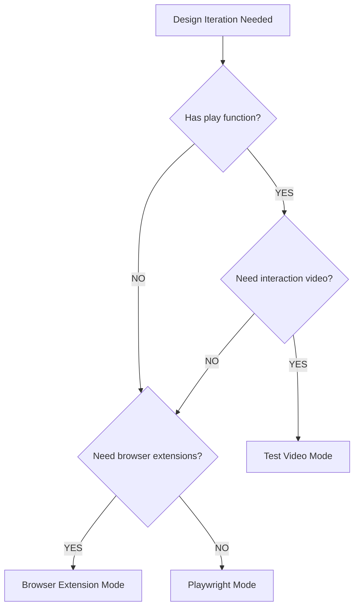

# Mode Selection

When to use each design iteration mode.

## Decision Tree



## Mode Comparison

| Factor | Test Video | Playwright | Extension |
|--------|------------|------------|-----------|
| **Best for** | Interaction stories | Visual inspection | Extensions/auth |
| **Feedback** | Pass/fail + video | Screenshot | Screenshot |
| **Color schemes** | Both in one run | Manual switch | Manual switch |
| **Setup** | None | None | Bridge required |
| **Speed** | Slower (runs tests) | Fast | Fast |
| **Accessibility** | Via play function | Via snapshot | Via snapshot |

## When to Use Test Video Mode

Use when:
- Story has a `play` function with interactions
- Need to verify interaction behavior
- Want videos for both light and dark modes
- Need pass/fail feedback from tests

```bash
bun plaited test src/button.stories.tsx --record-video ./videos --color-scheme both
```

## When to Use Playwright Mode

Use when:
- Quick visual inspection needed
- Static preview without interactions
- Taking screenshots for documentation
- Checking accessibility snapshot

```typescript
await mcp__playwright__browser_navigate({ url: storyUrl })
await mcp__playwright__browser_take_screenshot({ filename: 'preview.png' })
```

## When to Use Browser Extension Mode

Use when:
- Need browser extensions loaded
- Testing with authenticated state
- Inspecting browser dev tools manually
- Existing browser setup required

Requires browser extension bridge setup (see extension-mode.md).

## Combining Modes

For comprehensive design review:

1. **Start with Playwright** - Quick visual check
2. **Iterate changes** - Fast feedback loop
3. **Finalize with Test Video** - Verify interactions, get both color schemes
