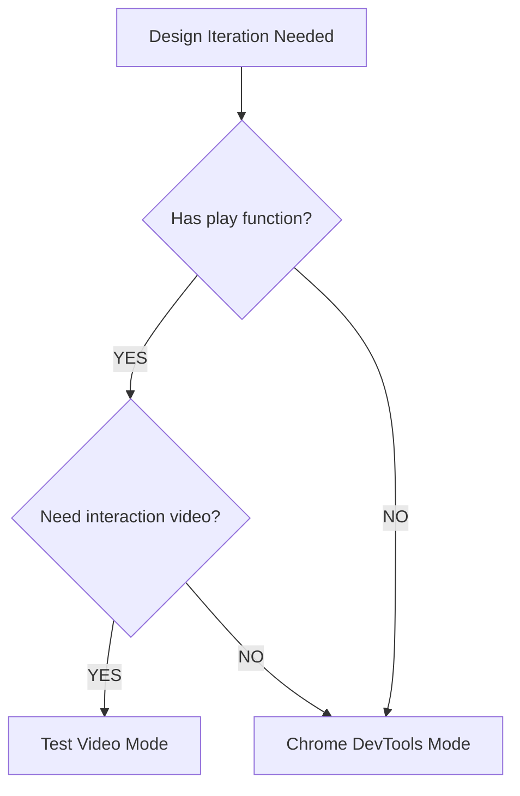

# Mode Selection

When to use each design iteration mode.

## Decision Tree



## Mode Comparison

| Factor | Test Video | Chrome DevTools |
|--------|------------|-----------------|
| **Best for** | Interaction stories | Visual inspection |
| **Feedback** | Pass/fail + video | Screenshot |
| **Color schemes** | Both in one run | Manual switch |
| **Setup** | None | Chrome browser |
| **Speed** | Slower (runs tests) | Fast |
| **Accessibility** | Via play function assertions | Via take_snapshot |

## When to Use Test Video Mode

Use when:
- Story has a `play` function with interactions
- Need to verify interaction behavior
- Want videos for both light and dark modes
- Need pass/fail feedback from tests

```bash
bun plaited test src/button.stories.tsx --record-video ./videos --color-scheme both
```

## When to Use Chrome DevTools Mode

Use when:
- Quick visual inspection needed
- Static preview without interactions
- Taking screenshots for documentation
- Checking accessibility tree structure

```typescript
await mcp__chrome-devtools__navigate_page({ url: storyUrl })
await mcp__chrome-devtools__take_screenshot({ filename: 'preview.png' })
```

## Combining Modes

For comprehensive design review:

1. **Start with Chrome DevTools** - Quick visual check
2. **Iterate changes** - Fast feedback loop
3. **Finalize with Test Video** - Verify interactions, get both color schemes
