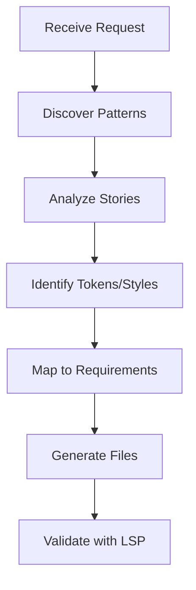

# Design System

Complete toolkit for building Plaited design systems: scaffolding scripts, token patterns, and generation workflows.

## Purpose

This skill provides:
- **Scaffolding** - Generate design system files (tokens, styles, stories, bElements)
- **Token Patterns** - Reference documentation for color, spacing, typography, animation tokens
- **Generation Workflows** - Discover project patterns and compose new elements

## Quick Reference

| Capability | Command/Reference | Use Case |
|------------|-------------------|----------|
| Generate tokens | `scaffold-tokens.ts` | Create `*.tokens.ts` files |
| Generate styles | `scaffold-styles.ts` | Create `*.css.ts` files |
| Generate stories | `scaffold-story.ts` | Create `*.stories.tsx` files |
| Generate bElement | `scaffold-behavioral-template.ts` | Full element with all files |
| Color patterns | `color-systems.md` | Palettes, semantic colors, states |
| Spacing patterns | `spacing-scales.md` | Grid systems, sizing tokens |
| Typography patterns | `typography-scales.md` | Type scales, font stacks |
| Animation patterns | `animation-tokens.md` | Timing, easing, keyframes |
| Discovery workflow | `discovery-workflow.md` | Find project patterns |
| Composition patterns | `composition-patterns.md` | Reuse existing design system |
| Generation workflow | `generation-workflow.md` | Step-by-step element creation |

## Scaffolding Scripts

### scaffold-tokens.ts

Generate a tokens file with createTokens patterns.

```bash
bun scripts/scaffold-tokens.ts <name> <namespace> [--output <path>]
```

**Arguments:**
- `name`: Token file name (e.g., `fills`, `spacing`)
- `namespace`: Token namespace for CSS variables
- `--output`: Output directory (default: current directory)

**Example:**
```bash
bun scripts/scaffold-tokens.ts fills fills --output src/tokens/
# Creates: src/tokens/fills.tokens.ts
```

### scaffold-styles.ts

Generate a styles file with createStyles and createHostStyles.

```bash
bun scripts/scaffold-styles.ts <name> [--host] [--output <path>]
```

**Arguments:**
- `name`: Style file name (e.g., `button`, `card`)
- `--host`: Include hostStyles for bElement
- `--output`: Output directory (default: current directory)

**Example:**
```bash
bun scripts/scaffold-styles.ts toggle-input --host --output src/components/
# Creates: src/components/toggle-input.css.ts
```

### scaffold-story.ts

Generate a story file for testing templates.

```bash
bun scripts/scaffold-story.ts <name> [--element <tag>] [--output <path>]
```

**Arguments:**
- `name`: Story file name
- `--element`: Custom element tag to import (for bElement stories)
- `--output`: Output directory (default: current directory)

**Example:**
```bash
bun scripts/scaffold-story.ts toggle-input --element toggle-input --output src/components/
# Creates: src/components/toggle-input.stories.tsx
```

### scaffold-behavioral-template.ts

Generate a complete bElement with associated files.

```bash
bun scripts/scaffold-behavioral-template.ts <name> [--form-associated] [--output <path>]
```

**Arguments:**
- `name`: Element name (kebab-case, e.g., `toggle-input`)
- `--form-associated`: Include formAssociated: true
- `--output`: Output directory (default: current directory)

**Example:**
```bash
bun scripts/scaffold-behavioral-template.ts toggle-input --form-associated --output src/components/
# Creates:
#   src/components/toggle-input.tokens.ts
#   src/components/toggle-input.css.ts
#   src/components/toggle-input.ts
#   src/components/toggle-input.stories.tsx
```

## Token Patterns

### Quick Start

**Simple Token:**
```typescript
import { createTokens } from 'plaited/ui'

export const { theme } = createTokens('theme', {
  primary: { $value: '#007bff' },
  spacing: { $value: '16px' },
})
```

**Token Scale (for state variations):**
```typescript
export const { fills } = createTokens('fills', {
  fill: {
    default: { $value: 'lightblue' },
    checked: { $value: 'blue' },
    disabled: { $value: 'gray' },
  },
})
// Access: fills.fill.default, fills.fill.checked, etc.
```

### References

- **[color-systems.md](references/color-systems.md)** - Palettes, semantic colors, state-based colors
- **[spacing-scales.md](references/spacing-scales.md)** - Grid systems, spacing tokens, sizing
- **[typography-scales.md](references/typography-scales.md)** - Type scales, font stacks
- **[animation-tokens.md](references/animation-tokens.md)** - Timing, easing, keyframes

### Usage with Styles

```typescript
import { createStyles, createHostStyles, joinStyles } from 'plaited/ui'
import { fills } from './fills.tokens.ts'
import { spacing } from './spacing.tokens.ts'

// In createStyles - pass token reference directly
export const styles = createStyles({
  element: {
    backgroundColor: {
      $default: fills.fill.default,
      ':host(:state(checked))': fills.fill.checked,
    },
    padding: spacing.md,
  }
})

// In hostStyles - use joinStyles to include token CSS variables
export const hostStyles = joinStyles(
  fills.fill.default,
  fills.fill.checked,
  createHostStyles({
    display: 'block',
    padding: spacing.lg,
  })
)
```

## Generation Workflows

### Discovery First

Before generating new elements, discover existing patterns:
1. Find stories with workbench query scripts
2. Read existing bElements to understand patterns
3. Identify reusable tokens and styles
4. Follow project naming conventions

### References

- **[discovery-workflow.md](references/discovery-workflow.md)** - How to find project patterns
- **[composition-patterns.md](references/composition-patterns.md)** - How to compose elements
- **[generation-workflow.md](references/generation-workflow.md)** - Step-by-step generation

### Workflow Overview



## File Organization

Generated files follow Plaited conventions:

```
component/
  [name].tokens.ts      # Design tokens (createTokens)
  [name].css.ts         # Styles (createStyles, createHostStyles)
  [name].ts             # bElement definition
  [name].stories.tsx    # Story tests
```

## Related Skills

- **plaited-ui-patterns** - Templates, bElements, and styling
- **plaited-standards** - Code conventions
- **workbench** - Story discovery and preview
- **typescript-lsp** - Type verification and code navigation
