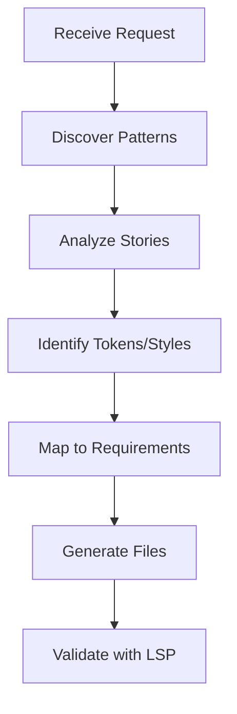

# Generative Templates

Guide for generating new behavioral elements by learning from project patterns.

## Purpose

This skill teaches agents to:
- Discover existing project patterns via code-query
- Analyze bElements, tokens, and styles in the project
- Compose new elements from existing design system pieces
- Generate code that follows project conventions

## Quick Reference

**Discovery First**: Before generating new elements, discover existing patterns:
1. Find stories with code-query
2. Read existing bElements to understand patterns
3. Identify reusable tokens and styles
4. Follow project naming conventions

## References

### Discovery Workflow
- **[discovery-workflow.md](references/discovery-workflow.md)** - How to find project patterns
  - Use code-query scripts to discover stories
  - Identify bElement, token, and style files
  - Map project structure

### Composition Patterns
- **[composition-patterns.md](references/composition-patterns.md)** - How to compose elements
  - Reuse existing tokens
  - Extend existing styles
  - Follow project conventions

### Generation Workflow
- **[generation-workflow.md](references/generation-workflow.md)** - Step-by-step generation
  - Analyze requirements
  - Map to existing patterns
  - Generate files
  - Validate output

## Workflow Overview



## Integration

### With code-query
```bash
# Find all stories in project
bun query-stories.ts src/

# Get story URLs for preview
bun query-story-url.ts src/button.stories.tsx PrimaryButton
```

### With design-system-scaffolding
After discovering patterns, use scaffold scripts to generate files:
```bash
bun scaffold-behavioral-template.ts new-element --output src/components/
```

## Related Skills

- **code-query** - Story and template discovery
- **design-system-scaffolding** - File generation
- **design-tokens-library** - Token patterns
- **plaited-framework-patterns** - Framework conventions
