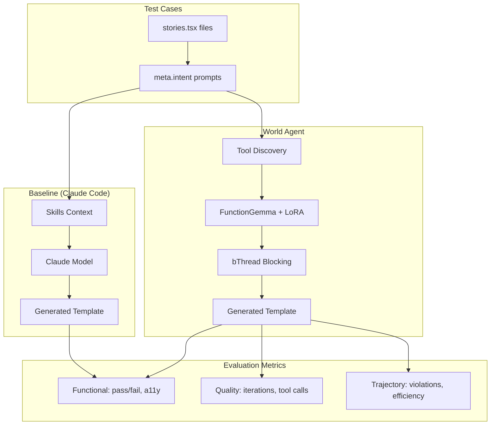
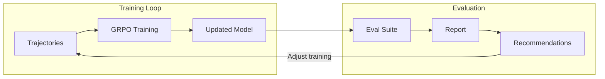

# World Agent Evaluation Guide

Comprehensive guide for evaluating World Agent performance against baselines.

## Overview

World Agent evaluation compares **baseline generation** (Claude Code one-shots with skills) against **trained World Agent** generation across three pillars:

1. **Task Completion** - Did the generated template pass the story tests?
2. **Process Quality** - How efficiently did the agent reach the solution?
3. **Trust/Safety** - Did the agent respect constraints (bThread blocking)?

## Evaluation Architecture



## Why This Matters

### Unique Aspects of World Agent

Unlike traditional LLM benchmarks (ROUGE, BLEU), World Agent evaluation must capture:

| Aspect | Why It Matters | How We Measure |
|--------|----------------|----------------|
| **Neuro-symbolic** | BP layer blocks before execution | Constraint violation count |
| **Trajectory visibility** | Full event trace available | Tool call efficiency |
| **Stories as ground truth** | Pass/fail is deterministic | Story pass rate |
| **Pattern composition** | Should reuse validated patterns | Pattern match rate |

### Baseline Comparison

Comparing against Claude Code one-shots answers: *"Is the trained agent better than just using Claude Code with skills?"*

This is the key question for production deployment. If the trained agent consistently outperforms one-shots, training was worthwhile.

## Metrics Reference

### Functional Metrics (Automated)

| Metric | Description | Threshold |
|--------|-------------|-----------|
| `storyPass` | Story test passed | 90% |
| `typeCheck` | TypeScript compiles | 100% |
| `a11yPass` | Accessibility assertions pass | 100% |

### Quality Metrics (Automated)

| Metric | Description | Target |
|--------|-------------|--------|
| `iterations` | Generations before success | ≤ 3 |
| `toolCalls` | Total tool invocations | Lower is better |
| `patternMatch` | Used pattern from registry | Higher is better |

### Trajectory Metrics (Agent-Specific)

| Metric | Description | Target |
|--------|-------------|--------|
| `constraintViolations` | bThread blocks triggered | 0 |
| `toolEfficiency` | Necessary vs total calls | ≥ 80% |
| `firstPassSuccess` | Passed on iteration 1 | Higher is better |

## Workflow

### 1. Setup Evaluation Assets

```bash
# Run the scaffolding command
claude /create-world-agent-eval .claude/eval
```

This creates:
```
.claude/eval/
├── config.json           # Baseline model, thresholds
├── templates/            # Add your story test cases
├── prompts/              # Custom evaluation prompts
└── baselines/            # Saved baseline outputs
```

### 2. Add Test Cases

Add story files to `templates/` with `meta.intent`:

```typescript
// templates/button.stories.tsx
import { story } from 'plaited/testing'

export const meta = {
  title: 'Button/Primary',
  intent: 'Create a primary action button with hover state and focus ring'
}

export const Default = story({
  template: () => <button>Click me</button>,
  play: async ({ assert }) => {
    await assert.a11y()
    await assert.snapshot()
  }
})
```

The `meta.intent` is the prompt given to both baseline and agent.

### 3. Run Evaluation Suite

```bash
# Full evaluation (baseline + agent)
bun .claude/skills/world-agent/scripts/run-eval-suite.ts .claude/eval

# Baseline only (for initial comparison)
bun .claude/skills/world-agent/scripts/run-eval-suite.ts .claude/eval --baseline-only

# Agent only (after training iterations)
bun .claude/skills/world-agent/scripts/run-eval-suite.ts .claude/eval --agent-only
```

### 4. Compare Results

```bash
# JSON comparison
bun .claude/skills/world-agent/scripts/compare-baseline.ts .claude/eval

# Markdown report
bun .claude/skills/world-agent/scripts/compare-baseline.ts .claude/eval --format markdown

# Single test case
bun .claude/skills/world-agent/scripts/compare-baseline.ts .claude/eval --test PrimaryButton
```

### 5. Generate Report

```bash
# Markdown report
bun .claude/skills/world-agent/scripts/generate-report.ts .claude/eval

# HTML report
bun .claude/skills/world-agent/scripts/generate-report.ts .claude/eval --format html
```

## Interpreting Results

### When Agent Wins

Agent outperforms baseline typically because:
- Faster convergence (fewer iterations)
- Better tool efficiency (fewer calls)
- Learned to compose patterns
- Constraint blocking prevents backtracking

### When Baseline Wins

Baseline outperforms agent typically because:
- Insufficient training data for this scenario
- Constraint blocking too aggressive
- Pattern registry missing relevant patterns
- Need more training iterations

### Improvement Actions

| Symptom | Recommended Action |
|---------|-------------------|
| Low pass rate | Add more training trajectories |
| High iterations | Improve pattern registry coverage |
| Many violations | Adjust constraint bThread rules |
| Agent slower | Check tool discovery weights |

## Integration with Training

Evaluation feeds back into training:



1. Run evaluation after each training iteration
2. Review recommendations in report
3. Adjust training data or constraints
4. Re-train and re-evaluate

## Advanced Configuration

### Custom Thresholds

Edit `config.json`:

```json
{
  "thresholds": {
    "minStoryPassRate": 0.95,
    "maxIterations": 2,
    "minA11yScore": 1.0
  }
}
```

### Custom Metrics

Add metrics to `config.json`:

```json
{
  "metrics": {
    "functional": ["storyPass", "typeCheck", "a11yPass"],
    "quality": ["patternCompliance", "tokenUsage", "codeStyle"],
    "trajectory": ["toolEfficiency", "constraintViolations", "iterationCount"]
  }
}
```

### Multiple Baselines

Test against different Claude models:

```json
{
  "baselineModel": "claude-sonnet-4",
  "alternateBaselines": [
    "claude-opus-4",
    "claude-haiku"
  ]
}
```

## Related Documentation

- [training-workflow.md](training-workflow.md) - Full training process
- [tool-api.md](tool-api.md) - Tool registry and execution
- [SKILL.md](../SKILL.md) - World Agent overview
