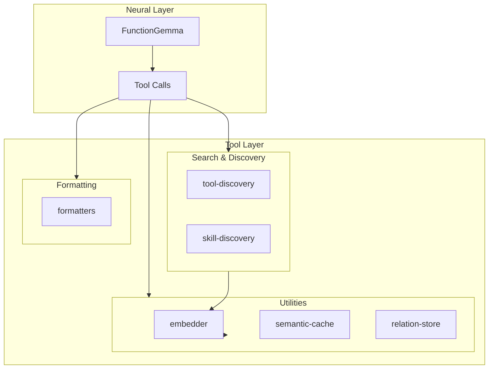

# Tool Layer

> Plain functions that the neural layer can call

## Overview

The Tool Layer provides the foundational capabilities that FunctionGemma (or other LLMs) can invoke. These are pure functions, not behavioral programs. They handle discovery, search, caching, and relationship tracking.



## Storage Strategy

The Tool Layer follows a "right tool for the job" philosophy:

| Need | Tool | Rationale |
|------|------|-----------|
| **Full-text search** | SQLite + FTS5 | BM25 ranking, tokenization |
| **Key-value + TTL** | In-memory Map | No query complexity |
| **Graph traversal** | In-memory Map | Traversal, not search |

### Persistence Pattern

Non-SQLite modules use pluggable persistence:

```typescript
type PersistenceConfig<T> = {
  /** User provides callback to save state */
  onPersist?: (data: T[]) => void | Promise<void>
  /** User loads and passes initial data */
  initialData?: T[]
  /** Auto-persist on mutation */
  autoPersist?: boolean
}
```

This decouples storage from business logic - modules don't care if you use files, APIs, or databases.

## Modules

### tool-discovery

FTS5 + vector hybrid search for discovering tools by name, description, or semantic similarity.

| Property | Value |
|----------|-------|
| **Storage** | SQLite + FTS5 |
| **Persistence** | `dbPath` config |
| **Vector Search** | Optional via embedder |

```typescript
import { createToolDiscovery } from 'plaited/agent'

const discovery = await createToolDiscovery({
  dbPath: './tools.db',
  embedder: true,  // Enable vector search
})

// Register tools
discovery.register({
  name: 'writeFile',
  description: 'Write content to a file',
  parameters: { /* ... */ },
  source: 'local',
})

// Hybrid search with RRF scoring
const results = await discovery.search('file operations', { limit: 5 })
```

### skill-discovery

FTS5 + vector search for AgentSkills directories with mtime caching.

| Property | Value |
|----------|-------|
| **Storage** | SQLite + FTS5 |
| **Persistence** | `dbPath` config |
| **Caching** | Persistent mtime cache |

```typescript
import { createSkillDiscovery } from 'plaited/agent'

const skills = await createSkillDiscovery({
  dbPath: './skills.db',
  skillsDirs: ['.claude/skills', '.plaited/skills'],
})

// Search skills by semantic similarity
const matches = await skills.search('behavioral programming')
```

### embedder

GGUF embeddings via node-llama-cpp. Shared by discovery and cache modules.

| Property | Value |
|----------|-------|
| **Model** | embeddinggemma-300M (Q8_0) |
| **Dimensions** | 256 |
| **Runtime** | In-process (no daemon) |

```typescript
import { createEmbedder, cosineSimilarity } from 'plaited/agent'

const embedder = await createEmbedder({
  modelUri: 'hf:ggml-org/embeddinggemma-300M-GGUF:Q8_0',
})

const embedding = await embedder.embed('search query')
const similarity = cosineSimilarity(embedding1, embedding2)
```

### semantic-cache

In-memory cache for LLM responses based on semantic similarity.

| Property | Value |
|----------|-------|
| **Storage** | In-memory Map |
| **Persistence** | `onPersist` callback |
| **Matching** | Cosine similarity |

```typescript
import { createSemanticCache } from 'plaited/agent'

const cache = await createSemanticCache({
  similarityThreshold: 0.85,
  maxEntries: 1000,
  ttlMs: 24 * 60 * 60 * 1000,
  onPersist: (entries) => Bun.write('cache.json', JSON.stringify(entries)),
  initialEntries: await loadCacheData(),
})

// Lookup or compute
const { response, cached } = await cache.getOrCompute(
  'How do I create a button?',
  async () => callLLM('How do I create a button?')
)
```

### relation-store

In-memory DAG for plans, files, agents, and any domain relationships.

| Property | Value |
|----------|-------|
| **Storage** | In-memory Map |
| **Persistence** | `onPersist` callback |
| **Structure** | Multi-parent DAG |

```typescript
import { createRelationStore } from 'plaited/agent'

const store = createRelationStore({
  onPersist: (nodes) => saveNodes(nodes),
  initialNodes: await loadNodes(),
})

// Plans are just nodes with edgeType: 'plan'
store.add({
  id: 'plan-auth',
  parents: [],
  edgeType: 'plan',
  context: { description: 'Implement authentication', status: 'in_progress' },
})

store.add({
  id: 'step-1',
  parents: ['plan-auth'],
  edgeType: 'step',
  context: { description: 'Create User model', status: 'pending' },
})

// Traversal
store.children('plan-auth')  // → [step-1]
store.ancestors('step-1')    // → [plan-auth]
store.byStatus('pending')    // → [step-1]

// LLM-friendly context
store.toContext(['plan-auth'])
// → "plan: Implement authentication [in_progress]\n  step: Create User model [pending]"
```

### formatters

Convert tools and relations to FunctionGemma's token format.

```typescript
import {
  formatForFunctionGemma,
  parseFunctionGemmaCall,
  formatRelationsForContext,
  toolSchemaToDefinition,
} from 'plaited/agent'

// Format tools for model
const formatted = formatForFunctionGemma(tools.map(toolSchemaToDefinition))
// → <start_function_declaration>declaration:writeFile{...}<end_function_declaration>

// Parse model output
const call = parseFunctionGemmaCall(modelOutput)
// → { name: 'writeFile', args: { path: '...', content: '...' } }

// Format relations for context
const context = formatRelationsForContext(nodes, {
  showStatus: true,
  showParents: true,
})
```

## Module Summary

| Module | Storage | Search | Persistence |
|--------|---------|--------|-------------|
| `tool-discovery` | SQLite + FTS5 | Hybrid (FTS5 + vector) | `dbPath` |
| `skill-discovery` | SQLite + FTS5 | Hybrid (FTS5 + vector) | `dbPath` |
| `semantic-cache` | Map | Cosine similarity | `onPersist` |
| `relation-store` | Map | Traversal only | `onPersist` |
| `embedder` | N/A | N/A | N/A |
| `formatters` | N/A | N/A | N/A |

## Key Principles

1. **Plain functions** - Not behavioral programs; the symbolic layer handles constraints
2. **Right storage** - SQLite for search, Map for traversal
3. **Pluggable I/O** - Modules don't dictate where you store data
4. **Graceful degradation** - Vector search is optional; falls back to FTS5
5. **In-process** - No external daemons for embeddings

## Related

- [world-agent.md](./world-agent.md) - Consumes tools via registry
- [orchestrator.md](./orchestrator.md) - Wires tool results to signals
- [custom-adapters.md](./custom-adapters.md) - Protocol adapters for external tools
