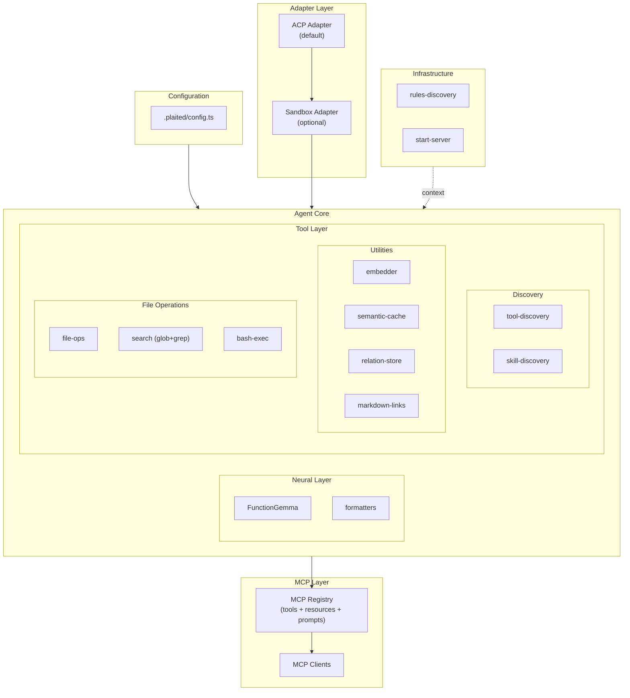

# Tool Layer

> Plain functions that the neural layer can call

## Overview

The Tool Layer provides the foundational capabilities that FunctionGemma (or other LLMs) can invoke. These are pure functions, not behavioral programs. They handle discovery, search, caching, file operations, and relationship tracking.



### Protocol Stack

| Protocol | Direction | Purpose |
|----------|-----------|---------|
| **ACP** | Client ↔ Agent | Session, prompts, responses |
| **MCP** | Agent ↔ Tools | Tools, resources, prompts |
| **A2A** | Agent ↔ Agent | Multi-agent (future) |

**Key architectural decisions:**
- ACP is the default adapter (Gemini CLI compatible)
- Sandbox wraps the entire agent (not a tool inside)
- MCP Registry unifies tools, resources, and prompts
- A2A is a separate adapter layer, NOT a tool source

## Storage Strategy

The Tool Layer follows a "right tool for the job" philosophy:

| Need | Tool | Rationale |
|------|------|-----------|
| **Full-text search** | SQLite + FTS5 | BM25 ranking, tokenization |
| **Key-value + TTL** | In-memory Map | No query complexity |
| **Graph traversal** | In-memory Map | Traversal, not search |

### Persistence Pattern

Non-SQLite modules use pluggable persistence:

```typescript
type PersistenceConfig<T> = {
  /** User provides callback to save state */
  onPersist?: (data: T[]) => void | Promise<void>
  /** User loads and passes initial data */
  initialData?: T[]
  /** Auto-persist on mutation */
  autoPersist?: boolean
}
```

This decouples storage from business logic - modules don't care if you use files, APIs, or databases.

## Modules

### tool-discovery

FTS5 + vector hybrid search for discovering tools by name, description, or semantic similarity.

| Property | Value |
|----------|-------|
| **Storage** | SQLite + FTS5 |
| **Persistence** | `dbPath` config |
| **Vector Search** | Optional via embedder |

```typescript
import { createToolDiscovery } from 'plaited/agent'

const discovery = await createToolDiscovery({
  dbPath: './tools.db',
  embedder: true,  // Enable vector search
})

// Register tools
discovery.register({
  name: 'writeFile',
  description: 'Write content to a file',
  parameters: { /* ... */ },
  source: 'local',
})

// Hybrid search with RRF scoring
const results = await discovery.search('file operations', { limit: 5 })
```

### skill-discovery

FTS5 + vector search for AgentSkills directories with mtime caching and progressive reference loading.

| Property | Value |
|----------|-------|
| **Storage** | SQLite + FTS5 |
| **Persistence** | `dbPath` config |
| **Caching** | Persistent mtime cache |
| **Progressive Loading** | `searchReferences()`, `getReferenceContent()` |

```typescript
import { createSkillDiscovery } from 'plaited/agent'

const skills = await createSkillDiscovery({
  dbPath: './skills.db',
  skillsRoot: '.claude/skills',
  embedder: true,  // Enable vector search
})

// Search skills by semantic similarity
const matches = await skills.search('behavioral programming')

// Progressive loading: search markdown link references
const refs = await skills.searchReferences('testing patterns')
for (const { reference, similarity } of refs) {
  const content = await skills.getReferenceContent(reference)
  // Load content on-demand
}
```

### embedder

GGUF embeddings via node-llama-cpp. Shared by discovery and cache modules.

| Property | Value |
|----------|-------|
| **Model** | embeddinggemma-300M (Q8_0) |
| **Dimensions** | 256 |
| **Runtime** | In-process (no daemon) |

```typescript
import { createEmbedder, findTopSimilar } from 'plaited/agent'

const embedder = await createEmbedder({
  modelUri: 'hf:ggml-org/embeddinggemma-300M-GGUF:Q8_0',
})

const embedding = await embedder.embed('search query')

// Find top similar from a map of embeddings
const matches = findTopSimilar({
  query: embedding,
  embeddings: embeddingsMap,
  limit: 5,
})
```

### semantic-cache

In-memory cache for LLM responses based on semantic similarity.

| Property | Value |
|----------|-------|
| **Storage** | In-memory Map |
| **Persistence** | `onPersist` callback |
| **Matching** | Cosine similarity |

```typescript
import { createSemanticCache } from 'plaited/agent'

const cache = await createSemanticCache({
  similarityThreshold: 0.85,
  maxEntries: 1000,
  ttlMs: 24 * 60 * 60 * 1000,
  onPersist: (entries) => Bun.write('cache.json', JSON.stringify(entries)),
  initialEntries: await loadCacheData(),
})

// Lookup or compute
const { response, cached } = await cache.getOrCompute(
  'How do I create a button?',
  async () => callLLM('How do I create a button?')
)
```

### relation-store

In-memory DAG for plans, files, agents, and any domain relationships.

| Property | Value |
|----------|-------|
| **Storage** | In-memory Map |
| **Persistence** | `onPersist` callback |
| **Structure** | Multi-parent DAG |

```typescript
import { createRelationStore } from 'plaited/agent'

const store = createRelationStore({
  onPersist: (nodes) => saveNodes(nodes),
  initialNodes: await loadNodes(),
})

// Plans are just nodes with edgeType: 'plan'
store.add({
  id: 'plan-auth',
  parents: [],
  edgeType: 'plan',
  context: { description: 'Implement authentication', status: 'in_progress' },
})

store.add({
  id: 'step-1',
  parents: ['plan-auth'],
  edgeType: 'step',
  context: { description: 'Create User model', status: 'pending' },
})

// Traversal
store.children('plan-auth')  // → [step-1]
store.ancestors('step-1')    // → [plan-auth]
store.byStatus('pending')    // → [step-1]

// LLM-friendly context
store.toContext(['plan-auth'])
// → "plan: Implement authentication [in_progress]\n  step: Create User model [pending]"
```

### file-ops

File system operations using Bun's native APIs.

| Property | Value |
|----------|-------|
| **Storage** | N/A (filesystem) |
| **Schemas** | Zod schemas in `file-ops.schemas.ts` |

```typescript
import { readFile, writeFile, editFile } from 'plaited/agent/file-ops'

// Read file
const { content, exists } = await readFile({ path: './config.json' })

// Write file
await writeFile({ path: './output.txt', content: 'Hello, world!' })

// Edit file (find and replace)
const { success, content: newContent } = await editFile({
  path: './config.json',
  oldText: '"debug": false',
  newText: '"debug": true',
})
```

### search

File and content search using Bun.Glob and ripgrep.

| Property | Value |
|----------|-------|
| **Glob** | Bun.Glob for file patterns |
| **Grep** | ripgrep via Bun.$ |
| **Schemas** | Zod schemas in `search.schemas.ts` |

```typescript
import { glob, grep } from 'plaited/agent/search'

// Find files by pattern
const files = await glob({ pattern: '**/*.ts', cwd: './src' })

// Search file contents
const matches = await grep({
  pattern: 'createEmbedder',
  path: './src',
  type: 'ts',
})
```

### bash-exec

Shell command execution with timeout support.

| Property | Value |
|----------|-------|
| **Runtime** | Bun.spawn |
| **Timeout** | AbortController |
| **Schemas** | Zod schemas in `bash-exec.schemas.ts` |

```typescript
import { exec } from 'plaited/agent/bash-exec'

const result = await exec({
  command: 'git status',
  cwd: process.cwd(),
  timeout: 30000,
})

if (result.exitCode === 0) {
  console.log(result.stdout)
}
```

### schema-utils

Convert Zod schemas to ToolSchema format for model consumption.

```typescript
import { zodToToolSchema } from 'plaited/agent/schema-utils'
import { z } from 'zod'

const inputSchema = z.object({
  path: z.string().describe('File path to read'),
  encoding: z.string().optional().describe('File encoding'),
})

const toolSchema = zodToToolSchema({
  name: 'readFile',
  description: 'Read contents of a file',
  schema: inputSchema,
})
// → { name, description, parameters: { type: 'object', properties: {...}, required: [...] } }
```

### markdown-links

Shared utility for extracting `[text](path)` patterns from markdown content.

```typescript
import { extractMarkdownLinks, isExternalLink, getExtension } from 'plaited/agent/markdown-links'

const links = extractMarkdownLinks(markdownContent, {
  extensions: ['.md'],  // Only .md files
  includeExternal: false,  // Exclude http:// https://
})

for (const { displayText, relativePath, lineNumber } of links) {
  console.log(`[${displayText}](${relativePath}) at line ${lineNumber}`)
}
```

### formatters

Convert tools and relations to FunctionGemma's token format.

```typescript
import {
  formatForFunctionGemma,
  parseFunctionGemmaCall,
  formatRelationsForContext,
  toolSchemaToDefinition,
} from 'plaited/agent'

// Format tools for model
const formatted = formatForFunctionGemma(tools.map(toolSchemaToDefinition))
// → <start_function_declaration>declaration:writeFile{...}<end_function_declaration>

// Parse model output
const call = parseFunctionGemmaCall(modelOutput)
// → { name: 'writeFile', args: { path: '...', content: '...' } }

// Format relations for context
const context = formatRelationsForContext(nodes, {
  showStatus: true,
  showParents: true,
})
```

## Infrastructure Modules

These modules are NOT called directly by the model. The orchestrator uses them to manage context.

### rules-discovery

Three-tier progressive loading for AGENTS.md files and references.

| Property | Value |
|----------|-------|
| **Storage** | SQLite + FTS5 |
| **Tier 1** | Root AGENTS.md always loaded |
| **Tier 2** | References indexed, loaded on semantic match |
| **Tier 3** | Nested AGENTS.md loaded for directory-scoped ops |

```typescript
import { createRulesDiscovery } from 'plaited/agent/rules-discovery'

const rules = await createRulesDiscovery({
  rootDir: process.cwd(),
  dbPath: './rules.db',
  embedder: true,
})

// Tier 1: Always available
const rootRules = rules.getRootRules()

// Tier 2: Semantic search on references
const refs = await rules.searchReferences('testing patterns')
const content = await rules.getReferenceContent(refs[0].reference)

// Tier 3: Spatial locality for file operations
const pathRules = rules.getRulesForPath('./src/auth/login.ts')
// Returns all AGENTS.md content from ancestors
```

## Module Summary

### Tool Layer (Complete)

| Module | Storage | Search | Persistence | Tests |
|--------|---------|--------|-------------|-------|
| `tool-discovery` | SQLite + FTS5 | Hybrid (FTS5 + vector) | `dbPath` | 37 |
| `skill-discovery` | SQLite + FTS5 | Hybrid + references | `dbPath` | 50 |
| `semantic-cache` | Map | Cosine similarity | `onPersist` | 27 |
| `relation-store` | Map | Traversal only | `onPersist` | 41 |
| `file-ops` | N/A | N/A | N/A | 13 |
| `search` | N/A | N/A | N/A | 11 |
| `bash-exec` | N/A | N/A | N/A | 11 |
| `schema-utils` | N/A | N/A | N/A | 6 |
| `markdown-links` | N/A | N/A | N/A | 25 |
| `formatters` | N/A | N/A | N/A | 22 |
| `embedder` | N/A | N/A | N/A | - |
| `rules-discovery` | SQLite + FTS5 | Hybrid + spatial | `dbPath` | 25 |

### Protocol Layer (Planned)

| Module | Purpose | Status |
|--------|---------|--------|
| `mcp-registry` | Unified tools + resources + prompts | 🔲 |
| `mcp-client` | One client per MCP server | 🔲 |
| `acp-adapter` | Default ACP adapter | 🔲 |
| `sandbox-adapter` | Optional OS-level isolation | 🔲 |
| `config-loader` | Load `.plaited/config.ts` | 🔲 |

## Key Principles

1. **Plain functions** - Not behavioral programs; the symbolic layer handles constraints
2. **Right storage** - SQLite for search, Map for traversal
3. **Pluggable I/O** - Modules don't dictate where you store data
4. **Graceful degradation** - Vector search is optional; falls back to FTS5
5. **In-process** - No external daemons for embeddings
6. **Progressive loading** - Load content on-demand based on intent or spatial locality
7. **Zod schemas** - Runtime validation with `zodToToolSchema()` conversion

## Related

- [world-agent.md](./world-agent.md) - Consumes tools via registry
- [orchestrator.md](./orchestrator.md) - Wires tool results to signals
- [custom-adapters.md](./custom-adapters.md) - Protocol adapters for external tools
