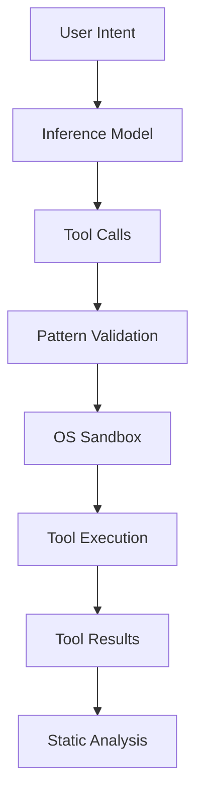

# World Agent

> The useWorldAgent core interface

## Overview

The world agent is a protocol-agnostic behavioral program that generates UI templates. It implements the neuro-symbolic architecture where:

- **Neural layer** - Inference model proposes tool calls
- **Symbolic layer** - bThreads block invalid actions
- **World model** - Stories + browser execution validate outputs

```typescript
import { createWorldAgent } from 'plaited/agent'

const factory = createWorldAgent({
  tools,
  model,
  preferences,
})

const trigger = await factory({
  outbound,
  tools,
  model,
  contextBudget: createContextBudget(),
  codeExecutor: createCodeExecutor({ tools }),
})

trigger({ type: 'generate', detail: { intent: 'Create a button' } })
```

## Context Requirements

The world agent requires these context properties:

| Property | Type | Description |
|----------|------|-------------|
| `outbound` | `Signal<AgentOutEvent>` | Signal for emitting events to adapter |
| `tools` | `ToolRegistry` | Registered tools and schemas |
| `model` | `InferenceModel` | LLM for generating tool calls |
| `contextBudget` | `ContextBudget` | Token budget manager |
| `codeExecutor` | `CodeExecutor` | Sandboxed code execution |

### Outbound Signal

The agent emits events through its `outbound` signal, which the orchestrator wires to the adapter:

```typescript
type AgentOutEvent =
  | { kind: 'thought'; content: string }
  | { kind: 'toolCall'; calls: FunctionCall[] }
  | { kind: 'toolResult'; name: string; result: ToolResult }
  | { kind: 'staticAnalysis'; result: StaticAnalysisResult }
  | { kind: 'response'; content: string }
  | { kind: 'error'; error: Error }
```

### Tool Registry

The registry holds tool implementations and schemas:

```typescript
const tools = createToolRegistry()

tools.register('writeTemplate', async (args) => {
  return { success: true, data: { content: args.content } }
}, {
  name: 'writeTemplate',
  description: 'Write a template file',
  parameters: {
    type: 'object',
    properties: {
      path: { type: 'string' },
      content: { type: 'string' },
    },
    required: ['path', 'content'],
  },
})
```

### Inference Model

The model interface for LLM inference:

```typescript
type InferenceModel = {
  inference: (intent: string, schemas: ToolSchema[]) => Promise<FunctionCall[]>
}
```

## Public Events

The world agent exposes these public events:

### generate

Main entry point for generation requests:

```typescript
trigger({
  type: 'generate',
  detail: {
    intent: 'Create a primary button with hover state',
    context: { /* optional context */ },
  },
})
```

### cancel

Cancel the current operation:

```typescript
trigger({ type: 'cancel' })
```

### feedback

Provide story execution results for learning:

```typescript
trigger({
  type: 'feedback',
  detail: {
    result: {
      passed: true,
      a11yPassed: true,
      totalAssertions: 5,
      passedAssertions: 5,
      errors: [],
    },
  },
})
```

### disconnect

Clean shutdown of the agent:

```typescript
trigger({ type: 'disconnect' })
```

### executeCode

Execute generated code in sandbox:

```typescript
trigger({
  type: 'executeCode',
  detail: {
    code: 'await tools.writeTemplate({ path: "button.tsx", content: template })',
    sandbox: { allowWrite: ['./generated'] },
  },
})
```

### chainTools

Execute multiple tools in sequence or parallel:

```typescript
trigger({
  type: 'chainTools',
  detail: {
    calls: [
      { name: 'writeTemplate', arguments: '{"path":"button.tsx"}' },
      { name: 'writeStyles', arguments: '{"path":"button.styles.ts"}' },
    ],
    sequential: true,  // false for parallel execution
  },
})
```

## Tool Execution

The agent executes tools through a sandboxed code executor:



### Defense in Depth

1. **Pattern validation** - Fast regex check blocks unsafe patterns
2. **OS sandbox** - Kernel-level restrictions via bubblewrap/Seatbelt

```typescript
// Unsafe patterns are blocked before execution
const unsafePatterns = [
  /process\.env/,
  /require\s*\(/,
  /import\s*\(/,
  /eval\s*\(/,
  /Function\s*\(/,
]
```

### Static Analysis

Template outputs are analyzed for:

- Type safety
- Accessibility compliance
- Token usage
- Pattern conformance

```typescript
const result = runStaticAnalysis(content, {
  checks: ['types', 'a11y', 'tokens'],
})
// Result includes: passed, tier, checks[]
```

## Extensibility

### Custom Handlers

Override default event handlers:

```typescript
const factory = createWorldAgent({
  tools,
  model,
  customHandlers: {
    generate: async ({ intent }) => {
      // Custom generation logic
    },
  },
})
```

### Custom bThreads

Add constraint bThreads:

```typescript
const factory = createWorldAgent({
  tools,
  model,
  customBThreads: {
    enforceTokens: bThread([
      bSync({
        block: (event) => event.type === 'toolResult' && !usesTokens(event),
      }),
    ], true),
  },
})
```

### User Preferences

Enable hybrid UI with user preferences:

```typescript
const factory = createWorldAgent({
  tools,
  model,
  preferences: {
    preferredBlocks: ['card', 'list'],
    preferredGroupings: ['stack'],
    avoidPatterns: ['carousel'],
  },
})
```

## Key Principles

1. **Agent IS a bProgram** - Not a class, but a behavioral program
2. **Protocol-agnostic** - Communicates via signals, not transport
3. **Neuro-symbolic** - Neural proposals + symbolic constraints
4. **Tiered validation** - Static (free) -> Judge (selective) -> Browser (ground truth)
