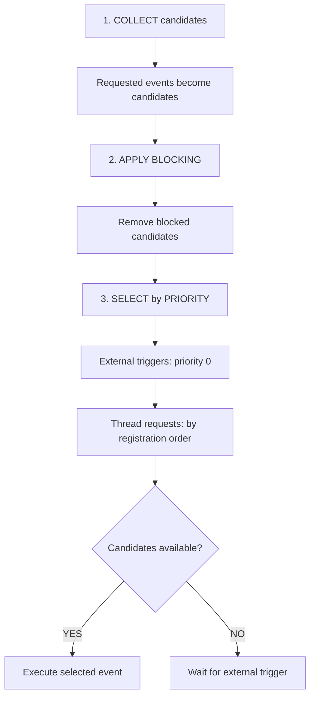
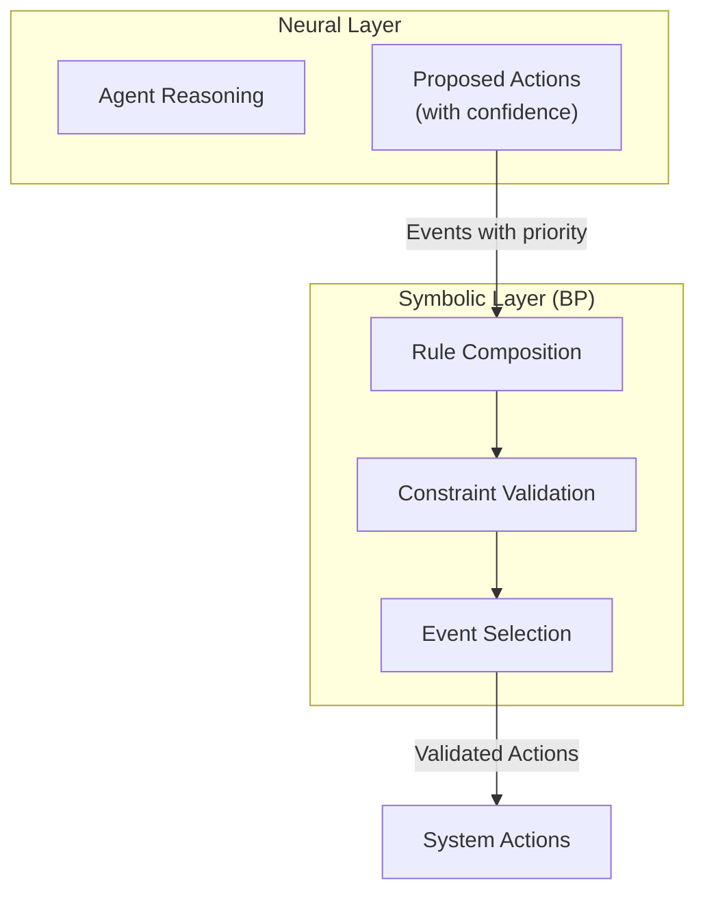

# Plaited Behavioral Core

## Purpose

This skill provides comprehensive documentation for Plaited's behavioral programming paradigm—a general coordination mechanism for managing concurrent behaviors through event-driven synchronization. BP is the foundation for all Plaited applications, whether UI or non-UI.

**Use this when:**
- Implementing event-driven coordination with `behavioral()` and `useBehavioral`
- Designing rule composition with `bThread`/`bSync`
- Understanding event selection, blocking, and priority
- Building symbolic reasoning layers for constraint validation
- Orchestrating test runners (see `useRunner` in `plaited/workshop/use-runner.ts`)
- Implementing game logic and state machines (see `plaited/src/main/tests/tic-tac-toe.spec.ts`)
- Designing workflow coordinators and protocol implementations

## Quick Reference

**Testing**: BP logic is tested with Bun tests (`*.spec.ts`), not browser stories. See `src/main/tests/` for examples.

**TypeScript LSP**: Use the `typescript-lsp` skill for type inference from `plaited` package imports.

## Core Patterns

### Behavioral Programs

**[behavioral-programs.md](references/behavioral-programs.md)** - Complete BP paradigm documentation

**Key Capabilities:**
1. **Event Selection Strategy** - Priority-based selection with blocking precedence
2. **Rule Composition Patterns** - Additive composition of independent threads
3. **Predicate-Based Event Matching** - Dynamic, state-dependent event handling
4. **Thread Lifecycle & Runtime Management** - Dynamic thread addition/removal

**Core APIs:**
- `behavioral()` - Create a behavioral program instance
- `bThread()` - Compose synchronization points into sequences
- `bSync()` - Define synchronization idioms (request, waitFor, block, interrupt)
- `useBehavioral()` - Factory pattern for reusable BP configurations
- `useFeedback()` - Register side-effect handlers
- `useSnapshot()` - Observe BP engine decisions

### Synchronization Idioms

```typescript
import { behavioral, bThread, bSync } from 'plaited'

const { trigger, bThreads, useFeedback } = behavioral()

bThreads.set({
  // Request: propose events
  requester: bThread([
    bSync({ request: { type: 'submit' } })
  ]),

  // WaitFor: pause until matching event
  listener: bThread([
    bSync({ waitFor: 'submit' }),
    bSync({ request: { type: 'confirmed' } })
  ]),

  // Block: prevent events (takes precedence)
  validator: bThread([
    bSync({ block: ({ type }) => type === 'submit' && !isValid() })
  ], true),

  // Interrupt: terminate thread on event
  cancellable: bThread([
    bSync({ request: { type: 'poll' } }),
    bSync({ waitFor: 'response' })
  ], true, { interrupt: 'cancel' })
})
```

### Event Selection Algorithm



### useBehavioral Factory Pattern

```typescript
import { useBehavioral } from 'plaited'

const createProgram = useBehavioral<Events, Context>({
  publicEvents: ['START', 'STOP'],  // API whitelist

  bProgram({ trigger, bThreads, bSync, ...context }) {
    bThreads.set({
      workflow: bThread([
        bSync({ waitFor: 'START' }),
        bSync({ request: { type: 'INTERNAL' } }),
        bSync({ waitFor: 'STOP' })
      ])
    })

    return {
      START() { /* handler */ },
      INTERNAL() { /* internal only */ },
      STOP() { /* handler */ }
    }
  }
})

const publicTrigger = await createProgram({ ...context })
publicTrigger({ type: 'START' })     // Allowed
publicTrigger({ type: 'INTERNAL' })  // Throws: not in publicEvents
```

## Non-UI Use Cases

### Test Orchestration

From `plaited/workshop/use-runner.ts`:

```typescript
const useRunner = useBehavioral<Events, Context>({
  publicEvents: ['run'],

  async bProgram({ trigger, bThreads, bThread, bSync, stories }) {
    let failed: TestResult[] = []
    let passed: TestResult[] = []

    bThreads.set({
      onCountChange: bThread([
        bSync({
          waitFor: ({ type }) => {
            if (!['test_fail', 'test_pass'].includes(type)) return false
            const remaining = stories.size - (failed.length + passed.length)
            return remaining === 1
          }
        }),
        bSync({ request: { type: 'report' } }),
        bSync({ request: { type: 'end' } })
      ], true)
    })

    return {
      test_pass({ pathname }) { passed.push(...) },
      test_fail(detail) { failed.push(...) },
      report() { /* print summary */ },
      end() { process.exit(failed.length > 0 ? 1 : 0) }
    }
  }
})
```

### Game Logic (Tic-Tac-Toe)

See `plaited/src/main/tests/tic-tac-toe.spec.ts` for complete example demonstrating:
- Turn enforcement via blocking
- Square occupation tracking
- Win detection through predicate-based waiting
- Additive rule composition

### Workflow Coordination

```typescript
bThreads.set({
  orderWorkflow: bThread([
    bSync({ waitFor: 'orderReceived' }),
    bSync({ request: { type: 'validateOrder' } }),
    bSync({ waitFor: 'orderValid' }),
    bSync({ request: { type: 'processPayment' } }),
    bSync({ waitFor: 'paymentProcessed' }),
    bSync({ request: { type: 'shipOrder' } })
  ]),

  fraudCheck: bThread([
    bSync({ waitFor: 'processPayment' }),
    bSync({ request: { type: 'checkFraud' } }),
    bSync({ waitFor: 'fraudChecked' }),
    bSync({
      block: ({ type }) => type === 'shipOrder' && isFraudulent
    })
  ])
})
```

## Neuro-Symbolic Reasoning

BP functions as the **symbolic reasoning layer** in neuro-symbolic architectures:



**How BP enables symbolic reasoning:**

1. **Event Selection** - Neural outputs become events with confidence → priority
2. **Rule Composition** - Add constraints without modifying neural models
3. **Predicate Matching** - Context-aware symbolic validation
4. **Thread Lifecycle** - Adaptive reasoning via runtime rule management

### Actor Model Orchestration

For large-scale systems, compose multiple BP programs through an actor model:

```typescript
// Orchestrator coordinates specialized workers
const createOrchestrator = useBehavioral({
  publicEvents: ['TASK_RECEIVED'],

  async bProgram({ trigger, bThreads }) {
    const analysisWorker = await createAnalysisWorker({ taskSignal, resultSignal })
    const validationWorker = await createValidationWorker({ taskSignal, resultSignal })

    resultSignal.listen('result', trigger)

    bThreads.set({
      coordinator: bThread([
        bSync({ waitFor: 'TASK_RECEIVED' }),
        bSync({ request: { type: 'ROUTE_TASK' } }),
        bSync({ waitFor: 'result' }),
        bSync({ request: { type: 'COMPLETE_TASK' } })
      ], true)
    })

    return { /* handlers */ }
  }
})
```

## Behavioral Utilities

- `useRandomEvent(e1, e2, ...)` - Random event selection (template function)
- `shuffleSyncs(s1, s2, ...)` - Randomize sync point order (Fisher-Yates)
- `isBPEvent(value)` - Runtime event validation type guard
- `isPlaitedTrigger(trigger)` - PlaitedTrigger type guard

## Related Skills

- **plaited-standards** - Code conventions, development standards, verification workflow
- **plaited-ui-patterns** - UI application of BP (bElements, templates, styling)
- **typescript-lsp** - Type verification and symbol discovery
