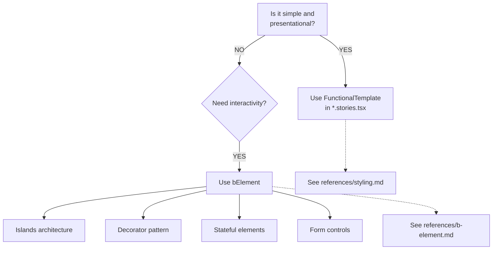
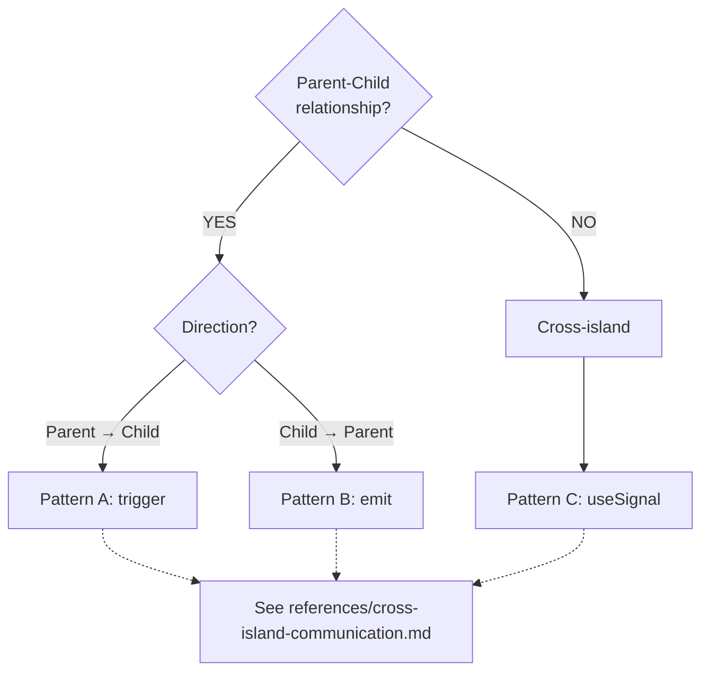
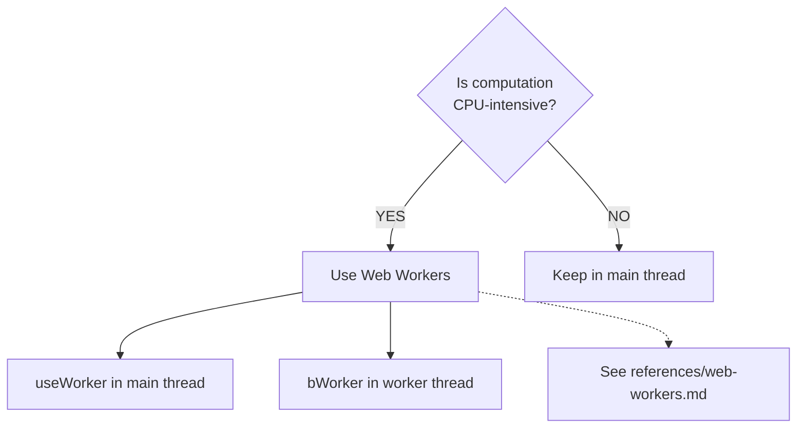

# Plaited Framework Patterns

## Purpose

This skill provides comprehensive documentation for building Plaited applications using behavioral programming, custom elements, and islands architecture. Use this when:
- Designing or implementing Plaited templates and BehavioralElements (bElement or FunctionalTemplate)
- Creating interactive islands with behavioral programs
- Building form-associated custom elements
- Coordinating cross-island communication
- Writing stories for testing
- Styling elements with CSS-in-JS
- Offloading computation to web workers
- Verifying code quality and ensuring accurate Plaited patterns

## Quick Reference

**TypeScript LSP**: This plugin works with `typescript-lsp@claude-plugins-official` for type inference from imports. Use LSP for accurate type signatures from source code.

**Essential Standards**:
- **Code Conventions**: [code-conventions.md](references/code-conventions.md) - Type system, function style, templates, imports, null handling
- **Testing**: [stories.md](references/stories.md) - Story-based testing with Playwright, workshop CLI
- **Standards**: [standards.md](references/standards.md) - 95% confidence threshold, documentation guidelines, Bun APIs
- **Verification**: [verification-workflow.md](references/verification-workflow.md) - Complete code generation workflow

## Pattern Categories

### Templates & Styling
- **[styling.md](references/styling.md)** - Templates (JSX, FT, useTemplate, SSR) + CSS-in-JS (createStyles, createHostStyles, tokens, keyframes)
  - Use for: JSX syntax, template security, FunctionalTemplate pattern, atomic CSS, host styling, design tokens

### Testing
- **[stories.md](references/stories.md)** - Story-based testing with Playwright integration
  - Use for: Writing stories for templates and bElements, workshop CLI usage, accessibility testing, inspector debugging
  - Workshop commands: `bun plaited test`, `bun plaited dev`

### Behavioral Programming Foundations
- **[behavioral-programs.md](references/behavioral-programs.md)** - BP paradigm, super-step execution, thread composition
  - Use for: Understanding BP coordination, event selection, rule composition, predicates, thread lifecycle
  - Key capabilities: Event Selection Strategy, Rule Composition Patterns, Predicate-Based Matching, Thread Lifecycle

### Custom Elements
- **[b-element.md](references/b-element.md)** - Creating custom elements with bElement
  - Use for: Islands architecture, decorator pattern, stateful elements, form controls
  - When to use: Interactive islands, wrapping native elements, complex state, form integration

### Form Integration
- **[form-associated-elements.md](references/form-associated-elements.md)** - Capturing user intent through forms
  - Use for: Custom form controls, ElementInternals API, custom states (`:state()`), validation, type-driven form generation
  - Integration: Works with MCP schemas for outcome-based interfaces

### Cross-Island Communication
- **[cross-island-communication.md](references/cross-island-communication.md)** - Three communication patterns
  - Pattern A: `trigger()` - Parent-to-child (direct method call)
  - Pattern B: `emit()` - Child-to-parent (event bubbling)
  - Pattern C: `useSignal()` - Cross-island pub/sub (actor pattern)
  - Use for: Coordinating islands NOT in parent-child relationship

### Performance
- **[web-workers.md](references/web-workers.md)** - Offloading computation to background threads
  - Use for: CPU-intensive calculations, data processing, complex algorithms
  - APIs: `useWorker()` (main thread), `bWorker()` (worker thread)

### Code Quality & Verification
- **[verification-workflow.md](references/verification-workflow.md)** - Complete code generation workflow
  - Use for: Systematic approach to generating accurate Plaited code
  - Phases: API verification (check bElement first), code generation (apply patterns), post-generation validation
  - 95% confidence threshold before presenting code
- **[lsp-verification.md](references/lsp-verification.md)** - LSP-based type verification
  - Use for: Verifying Plaited framework types before and after code generation
  - Operations: hover, goToDefinition, findReferences, documentSymbol
  - Critical files to check: BProgramArgs, BehavioralElementCallbackDetails, CSS types
- **[code-conventions.md](references/code-conventions.md)** - Plaited code style and conventions
  - Use for: Type system preferences, function style, template creation, import paths, null handling
  - Key patterns: type over interface, JSX syntax only, package imports in tests, object parameters for 2+ params
- **[standards.md](references/standards.md)** - Development standards and best practices
  - Use for: 95% confidence threshold, documentation guidelines, Bun platform APIs
  - Verification protocol: framework-first, LSP verification, WebFetch for web APIs

## Decision Trees

### When to Use Which Pattern?

**Creating UI Elements:**


**Communication Between Elements:**


**Performance Optimization:**


## File Organization

### For Simple Elements (FunctionalTemplate):
```
element/
  button.css.ts          # Styles (createStyles)
  button.tokens.ts       # Design tokens (optional)
  button.stories.tsx     # FT defined + stories
```

### For Complex Elements (bElement):
```
element/
  toggle-input.css.ts         # Styles + hostStyles
  fills.tokens.ts             # Tokens (optional)
  toggle-input.ts             # bElement definition
  toggle-input.stories.tsx    # Import bElement + stories
```

### Naming Conventions:
- **bElement-specific styles**: Export as `styles` and `hostStyles` (filename provides context)
- **Reusable pattern styles**: Export with descriptive names (e.g., `buttonStyles`, `cardStyles`)
- **Token files**: Use `*.tokens.ts` extension

## Integration Points

### With TypeScript LSP:
- Use LSP for type inference from `plaited` package imports
- LSP provides accurate signatures, reducing need for type documentation in rules
- Hover for TSDoc, goToDefinition for source, findReferences for usage

### With Plaited Standards:
- **Code Conventions**: Follow [code-conventions.md](references/code-conventions.md) for type system, function style, and patterns
- **Testing**: Use Bun test runner for unit tests (`.spec.ts`); [stories.md](references/stories.md) for browser tests (`.stories.tsx`)
- **Documentation**: TSDoc standards from [standards.md#documentation-guidelines](references/standards.md#documentation-guidelines)
- **Imports**: Package imports from [code-conventions.md#import-path-standards](references/code-conventions.md#import-path-standards)
- **Platform**: Bun-specific APIs from [standards.md#bun-platform-apis](references/standards.md#bun-platform-apis)

## Best Practices

### Templates Are Static:
```typescript
// ❌ Don't try to re-render different variants
<Button variant={newVariant} />  // Templates are static

// ✅ Use attribute-based styling + helper methods
const btn = $('btn')[0]
btn?.attr('data-variant', 'primary')  // Change via attributes
```

### Token Usage:
```typescript
// ❌ Don't invoke tokens as CSS values
backgroundColor: tokens.primary()  // WRONG

// ✅ Pass token references directly
backgroundColor: tokens.primary    // CORRECT
```

### Communication Hierarchy:
```typescript
// ✅ Parent-child: Use trigger/emit
parent.trigger({ type: 'event' })
child.emit({ type: 'event', bubbles: true, composed: true })

// ✅ Cross-island: Use useSignal
const signal = useSignal<Data>()
signal.set(data)           // Write
signal.listen('evt', trigger)  // Subscribe
```

## Examples

Complete working examples demonstrating Plaited patterns:

### Decorator Pattern
- **[DecoratedCheckbox](examples/decorator-pattern/)** - Wraps native checkbox with custom styling
  - Shows decorator pattern for hard-to-style native elements
  - Uses `useAttributesObserver` to sync slotted element state with custom states
  - Demonstrates `createTokens` for state-based styling
  - Follows styling.md patterns: separate tokens, styles, and element files
  - Files:
    - `fills.tokens.ts` - Design tokens for checkbox states
    - `decorated-checkbox.css.ts` - Styles and hostStyles
    - `decorated-checkbox.ts` - bElement definition
    - `decorated-checkbox.stories.tsx` - Story tests

### Slot Styling
- **[InputAddon](examples/slot-styling/)** - Input decorator with prefix/suffix slots
  - Demonstrates `::slotted()` CSS for styling light DOM elements
  - Shows attribute observation on slotted elements
  - Custom state management with `internals.states`
  - Follows styling.md patterns: separate tokens, styles, and element files
  - Files:
    - `input-addon.tokens.ts` - Design tokens for stroke colors
    - `input-addon.css.ts` - Styles and hostStyles with ::slotted()
    - `input-addon.ts` - bElement definition
    - `input-addon.stories.tsx` - Story tests

### Form-Associated Elements
- **[ToggleInput](examples/form-associated/)** - Custom form control with ElementInternals
  - Form-associated custom element pattern
  - Uses `formAssociated: true` to enable ElementInternals API
  - Custom states (`:state()`) for styling based on form state
  - Demonstrates `internals.setFormValue()` for form integration
  - Follows styling.md patterns: separate tokens, styles, and element files
  - Files:
    - `surfaces.tokens.ts` - Design tokens for toggle states
    - `toggle-input.css.ts` - Styles and hostStyles
    - `toggle-input.tsx` - bElement definition with formAssociated
    - `toggle-input.stories.tsx` - Story tests

### Stateful Elements
- **[Popover](examples/stateful-elements/)** - Native popover API wrapper
  - Stateful element pattern with custom states
  - Syncs custom states with native popover visibility
  - Shows child-to-parent communication via `emit()`
  - Files:
    - `popover.ts` - bElement definition
    - `popover.stories.tsx` - Story tests

### BP Coordination
- **[Tic-Tac-Toe](examples/bp-coordination/)** - Interactive game with BP
  - Complex behavioral program coordination
  - Multiple b-threads working together (turn enforcement, square occupancy, win detection, AI strategy)
  - Demonstrates rule composition and event selection
  - Shows how complex behavior emerges from simple thread interactions
  - Files: `tic-tac-toe-board.tsx`, `board-marker.tsx`, `x-marker.tsx`, `o-marker.tsx`, `tic-tac-toe-board.stories.tsx`

## Related Skills

- **code-documentation** - For writing TSDoc comments and API documentation
- **typescript-lsp** - For type verification, symbol discovery, and code navigation

## Navigation Summary

### Core Patterns
- [styling.md](references/styling.md) - Templates + CSS-in-JS system
- [stories.md](references/stories.md) - Testing patterns with workshop CLI
- [behavioral-programs.md](references/behavioral-programs.md) - BP foundations (4 key capabilities)
- [b-element.md](references/b-element.md) - Custom elements API
- [form-associated-elements.md](references/form-associated-elements.md) - Form integration
- [cross-island-communication.md](references/cross-island-communication.md) - 3 communication patterns
- [web-workers.md](references/web-workers.md) - Performance optimization

### Code Quality & Verification
- [verification-workflow.md](references/verification-workflow.md) - Complete code generation workflow
- [lsp-verification.md](references/lsp-verification.md) - LSP-based type verification
- [code-conventions.md](references/code-conventions.md) - Code style and conventions
- [standards.md](references/standards.md) - Development standards and best practices
