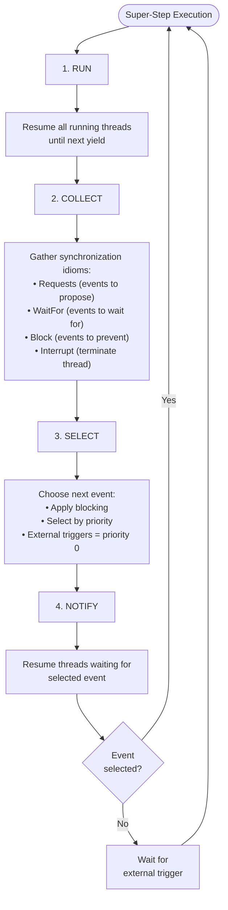
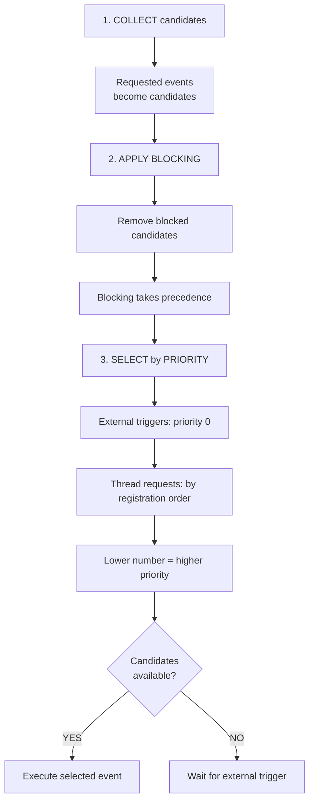
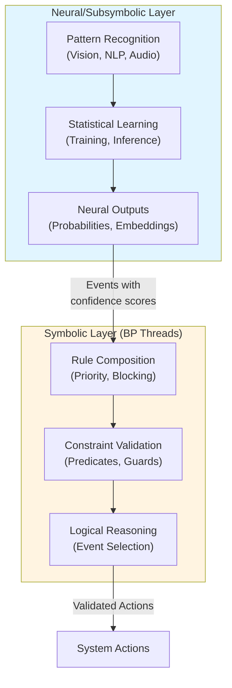

# Behavioral Programming: Foundations

Behavioral Programming (BP) is a general coordination mechanism for managing concurrent behaviors through event-driven synchronization. This document covers BP as a **foundational paradigm**, independent of UI concerns.

**For UI-specific BP usage**, see:
- `b-element.md` for integrating BP with custom elements
- `cross-island-communication.md` for coordinating multiple islands
- `form-associated-elements.md` for capturing user intent

## BP Paradigm Overview

Behavioral Programming enables declarative coordination of concurrent behaviors without direct function calls or shared state mutation.

### Super-Step Execution Model

The BP engine operates in a continuous cycle called the **super-step**:



### Event-Driven Coordination vs Direct Calls

**Traditional approach** (direct coupling):
```typescript
function handleClick() {
  if (!isDisabled()) {          // Direct state check
    updateCounter()              // Direct function call
    validateForm()               // Direct function call
    if (shouldSubmit()) {
      submitForm()               // Direct function call
    }
  }
}
```

**Behavioral Programming** (declarative coordination):
```typescript
const { trigger, bThreads } = behavioral()

bThreads.set({
  // Independent thread: blocks clicks when disabled
  disableProtection: bThread([
    bSync({ block: ({ type }) => type === 'click' && isDisabled() })
  ], true),

  // Independent thread: counter logic
  counterLogic: bThread([
    bSync({ waitFor: 'click' }),
    bSync({ request: { type: 'updateCounter' } })
  ], true),

  // Independent thread: validation logic
  validationLogic: bThread([
    bSync({ waitFor: 'updateCounter' }),
    bSync({ request: { type: 'validate' } })
  ], true),

  // Independent thread: submission logic
  submissionLogic: bThread([
    bSync({ waitFor: 'validate' }),
    bSync({ request: { type: 'submit' }, waitFor: ({ type }) => type === 'submit' })
  ])
})

// Trigger external event
trigger({ type: 'click' })
// Threads coordinate automatically through event space
```

**Key Difference**: Threads coordinate through the event space, not through direct calls or shared state.

## Core Synchronization Idioms

BP threads coordinate using four synchronization idioms provided to each `yield` statement via `bSync()`:

### `request` - Propose Events

Proposes events to be selected during the SELECT phase:

```typescript
// Static request
bSync({ request: { type: 'submit' } })

// Request with detail
bSync({ request: { type: 'add', detail: { value: 42 } } })

// Dynamic request using template function
bSync({ request: ({ counter }) => ({ type: 'update', detail: { count: counter + 1 } }) })
```

**Template function** receives current state as first argument, enabling dynamic event generation.

### `waitFor` - Pause Until Matching Event

Pauses thread execution until a matching event is selected:

```typescript
// String matching (exact type match)
bSync({ waitFor: 'click' })

// Predicate function (dynamic matching)
bSync({
  waitFor: ({ type, detail }) =>
    type === 'input' && detail.value.length > 5
})

// Multiple threads can wait for same event
```

**Predicate-based waitFor** is powerful for state-dependent coordination (see Predicate-Based Event Matching section).

### `block` - Prevent Events

Blocks events from being selected, taking precedence over requests:

```typescript
// String blocking (exact type match)
bSync({ block: 'submit' })

// Predicate blocking (conditional)
bSync({
  block: ({ type }) => type === 'submit' && !isFormValid()
})

// Array of event types
bSync({ block: ['reset', 'clear'] })

// Array of predicates
bSync({
  block: [
    ({ type }) => type === 'save' && !hasChanges(),
    ({ type }) => type === 'delete' && isReadOnly()
  ]
})
```

**Blocking precedence**: If any thread blocks an event, it cannot be selected, regardless of how many threads request it.

### `interrupt` - Terminate Thread

Terminates the thread when a matching event is selected:

```typescript
bThread([
  bSync({ request: { type: 'poll' } }),
  bSync({ waitFor: 'response' }),
  // Repeat polling...
], true, {
  interrupt: 'cancel' // Terminate this thread if 'cancel' event occurs
})
```

**Use cases**: Cleanup, cancellation, timeout handling.

## Thread Composition with bThread/bSync

Threads are composed using generator functions wrapped by `bThread()` and yielding `bSync()` synchronization points.

### `bSync` - Single Synchronization Point

Creates a single synchronization point (one `yield`):

```typescript
import { bSync } from 'plaited'

// Single sync point with request
const syncPoint = bSync({ request: { type: 'event1' } })

// Single sync point with waitFor and block
const syncPoint2 = bSync({
  waitFor: 'event2',
  block: ({ type }) => type === 'unwanted'
})
```

**Important**: `bSync()` returns a `BSync` object that will be yielded inside a generator function, not a generator itself.

### `bThread` - Sequence Composition

Composes multiple `bSync` points into a sequential thread:

```typescript
import { bThread, bSync } from 'plaited'

// Finite sequence (runs once)
const oneShotThread = bThread([
  bSync({ request: { type: 'start' } }),
  bSync({ waitFor: 'ready' }),
  bSync({ request: { type: 'proceed' } })
])

// Infinite sequence (repeats)
const loopingThread = bThread([
  bSync({ request: { type: 'tick' } }),
  bSync({ waitFor: 'tock' })
], true)  // Second parameter: repeat = true

// Conditional repetition using predicate
let count = 0
const conditionalThread = bThread([
  bSync({ request: { type: 'increment' } }),
  bSync({ waitFor: 'incremented' })
], () => count < 10)  // Repeat while count < 10
```

**Repetition modes**:
- `false` (default): Run sequence once
- `true`: Repeat indefinitely
- `() => boolean`: Repeat while predicate returns true

### Generator Function Mechanics

Under the hood, `bThread` uses generator functions:

```typescript
// What bThread creates internally:
function* threadGenerator() {
  // Pause at first sync point
  yield bSync({ request: { type: 'event1' } })

  // Pause at second sync point
  yield bSync({ waitFor: 'event2' })

  // Pause at third sync point
  yield bSync({ request: { type: 'event3' } })
}
```

**Pause/Resume Flow**:
1. Thread yields `bSync` → becomes **pending**
2. SELECT phase chooses event
3. Threads waiting for selected event resume → become **running**
4. Running threads execute until next `yield`
5. Cycle repeats

**IMPORTANT**: Never expose raw `yield` statements in your code. Always use `bThread()` and `bSync()` factory functions.

## ⭐ Event Selection Strategy (KEY CAPABILITY 1)

Event selection is the core mechanism determining which event executes next. Understanding this is critical for Neuro-symbolic AI rule composition.

### Selection Algorithm



### Priority-Based Selection

```typescript
const { trigger, bThreads } = behavioral()

bThreads.set({
  thread1: bThread([bSync({ request: { type: 'event1' } })]),  // Priority 1
  thread2: bThread([bSync({ request: { type: 'event2' } })]),  // Priority 2
  thread3: bThread([bSync({ request: { type: 'event3' } })]),  // Priority 3
})

// All three events are candidates
// 'event1' is selected (lowest priority number = highest priority)
```

**Thread registration order determines initial priority**. Threads registered first get higher priority.

### External Triggers Get Priority 0

External events always have highest priority:

```typescript
const { trigger, bThreads } = behavioral()

bThreads.set({
  autoRequest: bThread([
    bSync({ request: { type: 'auto' } })
  ], true)
})

// External trigger beats internal request
trigger({ type: 'external' })  // Priority 0 - selected first

// Next super-step, 'auto' will be selected (priority 1)
```

### Blocking Precedence Over Requests

Even one blocking thread prevents event selection:

```typescript
const { trigger, bThreads } = behavioral()

bThreads.set({
  requester1: bThread([bSync({ request: { type: 'save' } })]),
  requester2: bThread([bSync({ request: { type: 'save' } })]),
  requester3: bThread([bSync({ request: { type: 'save' } })]),

  // Single blocker prevents all requests
  blocker: bThread([bSync({ block: 'save' })])
})

// 'save' is requested by 3 threads but blocked by 1
// Result: No event selected, execution waits
```

**Implication**: A single validation thread can veto any number of request threads.

## ⭐ Rule Composition Patterns (KEY CAPABILITY 2)

BP's power comes from composing independent threads that coordinate through the event space. Complex behavior emerges from simple thread interactions.

### Additive Composition

Add new rules without modifying existing ones:

```typescript
// Base rule: button click requests 'submit'
const baseRule = bThread([
  bSync({ waitFor: 'click' }),
  bSync({ request: { type: 'submit' } })
], true)

// Add validation rule (blocks submit if invalid)
const validationRule = bThread([
  bSync({ block: ({ type }) => type === 'submit' && !isValid() })
], true)

// Add confirmation rule (blocks submit without confirmation)
const confirmationRule = bThread([
  bSync({ waitFor: 'submit' }),
  bSync({ block: 'submit', request: { type: 'confirm' } }),
  bSync({ waitFor: 'confirmed' })
], true)

// Add rate limiting rule
const rateLimitRule = bThread([
  bSync({ waitFor: 'submit' }),
  bSync({ block: 'submit' }),  // Block immediate resubmit
  bSync({ waitFor: ({ type }) => type === 'timer', request: { type: 'timer' } })
], true)

const { bThreads } = behavioral()

// Compose all rules
bThreads.set({
  baseRule,
  validationRule,
  confirmationRule,
  rateLimitRule
})

// Complex submission flow emerges from independent rules
```

**Key principle**: Each thread represents one concern. Threads coordinate automatically through blocking and waiting.

### Tic-Tac-Toe Example: Independent Rule Coordination

A complete Tic-Tac-Toe game demonstrates additive composition:

```typescript
import { behavioral, bThread, bSync } from 'plaited'

const { trigger, bThreads, useFeedback } = behavioral()

const winConditions = [
  [0, 1, 2], [3, 4, 5], [6, 7, 8],  // Rows
  [0, 3, 6], [1, 4, 7], [2, 5, 8],  // Columns
  [0, 4, 8], [2, 4, 6]              // Diagonals
]

const squares = [0, 1, 2, 3, 4, 5, 6, 7, 8]
let board = new Set(squares)

// Rule 1: Enforce turn-taking
const enforceTurns = bThread([
  bSync({ waitFor: 'X', block: 'O' }),
  bSync({ waitFor: 'O', block: 'X' })
], true)

// Rule 2: Prevent taking occupied squares (one thread per square)
const squaresTaken: Record<string, RulesFunction> = {}
for (const square of squares) {
  squaresTaken[`square_${square}`] = bThread([
    bSync({ waitFor: ({ detail }) => square === detail.square }),
    bSync({ block: ({ detail }) => square === detail.square })
  ])
}

// Rule 3: Detect wins for each player
const detectWins = (player: 'X' | 'O') => {
  const threads: Record<string, RulesFunction> = {}

  for (const [idx, condition] of winConditions.entries()) {
    threads[`${player}_win_${idx}`] = bThread([
      bSync({ waitFor: ({ type, detail }) =>
        type === player && condition.includes(detail.square)
      }),
      bSync({ waitFor: ({ type, detail }) =>
        type === player && condition.includes(detail.square)
      }),
      bSync({ waitFor: ({ type, detail }) =>
        type === player && condition.includes(detail.square)
      }),
      bSync({ request: { type: 'win', detail: { player } } })
    ])
  }

  return threads
}

// Compose all rules
bThreads.set({
  enforceTurns,
  ...squaresTaken,
  ...detectWins('X'),
  ...detectWins('O')
})

// Side effects via feedback handlers (NOT in threads)
useFeedback({
  X({ square }) {
    board.delete(square)
    console.log(`X takes square ${square}`)
  },
  O({ square }) {
    board.delete(square)
    console.log(`O takes square ${square}`)
  },
  win({ player }) {
    console.log(`${player} wins!`)
  }
})

// External triggers
trigger({ type: 'X', detail: { square: 0 } })
trigger({ type: 'O', detail: { square: 1 } })
trigger({ type: 'X', detail: { square: 4 } })
// ... game continues through thread coordination
```

**Emergent behavior**:
- Turn enforcement prevents out-of-turn moves
- Square occupation prevents duplicate moves
- Win detection coordinates with move events
- All rules work together without direct coupling

### Thread Independence

Each thread is self-contained:

```typescript
// Thread 1: Doesn't know about Thread 2
const thread1 = bThread([
  bSync({ request: { type: 'start' } }),
  bSync({ waitFor: 'ready' })
])

// Thread 2: Doesn't know about Thread 1
const thread2 = bThread([
  bSync({ waitFor: 'start' }),
  bSync({ request: { type: 'ready' } })
])

// Yet they coordinate perfectly through event space
bThreads.set({ thread1, thread2 })
```

## ⭐ Predicate-Based Event Matching (KEY CAPABILITY 3)

Predicates enable dynamic, state-dependent event handling beyond simple string matching.

### String Matching vs Predicate Matching

```typescript
// String matching: exact type match
bSync({ waitFor: 'click' })
bSync({ block: 'submit' })

// Predicate matching: dynamic logic
bSync({
  waitFor: ({ type, detail }) =>
    type === 'input' && detail.value.length > 5
})

bSync({
  block: ({ type, detail }) =>
    type === 'submit' && !validateEmail(detail.email)
})
```

### State-Dependent Event Handling

Predicates can reference external state:

```typescript
let formData = { email: '', password: '' }
let hasChanges = false

const { bThreads } = behavioral()

bThreads.set({
  // Block save if no changes
  preventUnnecessarySave: bThread([
    bSync({ block: ({ type }) => type === 'save' && !hasChanges })
  ], true),

  // Block submit if email invalid
  emailValidation: bThread([
    bSync({
      block: ({ type }) =>
        type === 'submit' && !formData.email.includes('@')
    })
  ], true),

  // Block submit if password too short
  passwordValidation: bThread([
    bSync({
      block: ({ type }) =>
        type === 'submit' && formData.password.length < 8
    })
  ], true)
})
```

### Dynamic Event Filtering

Use predicates to filter events based on detail payloads:

```typescript
type ItemEvent = { id: string; action: 'add' | 'remove' | 'update' }

const watchSpecificItem = (targetId: string) =>
  bThread([
    bSync({
      waitFor: ({ type, detail }: { type: string; detail: ItemEvent }) =>
        type === 'item' && detail.id === targetId
    }),
    bSync({ request: { type: 'processItem', detail: { id: targetId } } })
  ], true)

// Create threads for specific items
bThreads.set({
  watchItem1: watchSpecificItem('item-1'),
  watchItem2: watchSpecificItem('item-2')
})

// Only watchItem1 responds to this
trigger({ type: 'item', detail: { id: 'item-1', action: 'update' } })
```

### Complex Predicate Logic

Combine multiple conditions:

```typescript
bSync({
  waitFor: ({ type, detail }) => {
    if (type !== 'purchase') return false
    if (detail.amount <= 0) return false
    if (detail.userId !== currentUser.id) return false
    if (balance < detail.amount) return false
    return true
  }
})
```

### Predicate Performance Considerations

Predicates are evaluated during the COLLECT phase for EVERY pending thread. Keep them efficient:

```typescript
// ✅ Good: Simple checks
bSync({ waitFor: ({ type }) => type === 'click' })

// ✅ Good: Direct property access
bSync({ waitFor: ({ detail }) => detail.value > 100 })

// ❌ Avoid: Expensive computations in predicates
bSync({ waitFor: ({ detail }) => expensiveValidation(detail) })

// ✅ Better: Pre-compute and reference
let isValid = false
// Update isValid in feedback handlers
bSync({ waitFor: ({ type }) => type === 'submit' && isValid })
```

**Tip for async/expensive predicates**: If a predicate needs async data or computationally expensive operations, create a feedback handler that performs the work and triggers an event with the result:

```typescript
const { trigger, bThreads, useFeedback } = behavioral()

let validationResult: { isValid: boolean; errors: string[] } | null = null

bThreads.set({
  submitWorkflow: bThread([
    // Trigger validation request
    bSync({ request: { type: 'validateData' } }),

    // Wait for validation complete with result in stateful variable
    bSync({
      waitFor: ({ type }) => type === 'validationComplete' && validationResult?.isValid === true
    }),

    bSync({ request: { type: 'submit' } })
  ])
})

useFeedback({
  async validateData() {
    // Expensive async operation in handler, not predicate
    const result = await complexValidationService(currentData)
    validationResult = result

    // Trigger event to resume threads
    trigger({ type: 'validationComplete' })
  }
})
```

This pattern keeps predicates fast (simple property check on `validationResult`) while enabling async operations in the right place (feedback handlers).

## ⭐ Thread Lifecycle & Runtime Management (KEY CAPABILITY 4)

Threads can be added and inspected at runtime, enabling dynamic rule composition. **To terminate a thread, use the `interrupt` idiom or wait for it to complete**—there is no direct "remove" API.

### Thread States

Threads exist in two states:

```typescript
type ThreadState = 'running' | 'pending'
```

- **Running**: Currently executing (between resume and next yield)
- **Pending**: Waiting at a sync point (after yield, before resume)

### `bThreads.set()` - Add Threads

Add threads dynamically during execution:

```typescript
const { trigger, bThreads } = behavioral()

// Add initial threads
bThreads.set({
  thread1: bThread([bSync({ request: { type: 'event1' } })])
})

// Add more threads later
bThreads.set({
  thread2: bThread([bSync({ request: { type: 'event2' } })]),
  thread3: bThread([bSync({ request: { type: 'event3' } })])
})

// Attempting to add with existing key triggers a warning and is ignored
bThreads.set({
  thread1: bThread([bSync({ request: { type: 'event1_updated' } })])
  // Console warning: Thread "thread1" already exists and cannot be replaced.
  // Use the 'interrupt' idiom to terminate threads explicitly.
  // The existing thread1 continues running unchanged
})
```

**Key behavior**:
- Attempting to add a thread with an existing key triggers a console warning and is ignored
- This prevents accidental thread replacement, which violates BP's additive composition principle
- To terminate a thread, use the `interrupt` idiom or wait for it to complete
- Adding with new key adds thread to running set
- Threads start immediately (enter running state)

### `bThreads.has()` - Check Thread Status

Query if a thread exists and its state:

```typescript
const { bThreads } = behavioral()

bThreads.set({
  myThread: bThread([
    bSync({ request: { type: 'start' } }),
    bSync({ waitFor: 'continue' })
  ])
})

// Check thread status
const status = bThreads.has('myThread')

if (status.running) {
  console.log('Thread is currently executing')
}

if (status.pending) {
  console.log('Thread is waiting at sync point')
}

if (!status.running && !status.pending) {
  console.log('Thread not found or completed')
}
```

**Return value**:
- Returns an object: `{ running: boolean; pending: boolean }`
- `running: true` - Thread exists and is currently executing
- `pending: true` - Thread exists and is waiting at a sync point
- Both `false` - Thread doesn't exist (never added or already completed)

### Runtime Rule Addition Pattern

Add rules based on application state:

```typescript
const { trigger, bThreads, useFeedback } = behavioral()

let currentMode: 'basic' | 'advanced' = 'basic'

// Start with basic rules
bThreads.set({
  basicValidation: bThread([
    bSync({ block: ({ type }) => type === 'submit' && !hasRequiredFields() })
  ], true)
})

useFeedback({
  switchToAdvanced() {
    currentMode = 'advanced'

    // Add advanced rules at runtime with interrupt capability
    bThreads.set({
      advancedValidation: bThread([
        bSync({ block: ({ type }) => type === 'submit' && !hasComplexValidation() })
      ], true, {
        interrupt: 'switchToBasic'  // Terminates when mode switches
      }),

      autoSave: bThread([
        bSync({ request: { type: 'save' } }),
        bSync({ waitFor: 'saved' })
      ], true, {
        interrupt: 'switchToBasic'  // Terminates when mode switches
      })
    })
  },

  switchToBasic() {
    currentMode = 'basic'
    // Trigger interrupt event to terminate advanced threads
    trigger({ type: 'switchToBasic' })
  }
})
```

### Thread Removal via Interrupt

Use `interrupt` to terminate threads based on events:

```typescript
const { trigger, bThreads } = behavioral()

bThreads.set({
  pollingThread: bThread([
    bSync({ request: { type: 'poll' } }),
    bSync({ waitFor: 'polled' })
  ], true, {
    interrupt: 'stopPolling'  // Terminates when 'stopPolling' event occurs
  })
})

// Start polling
trigger({ type: 'poll' })

// Later, stop polling
trigger({ type: 'stopPolling' })
// pollingThread is now terminated
```

### Dynamic Thread Management Example

Real-world pattern from test orchestration:

```typescript
import { behavioral, bThread, bSync } from 'plaited'

const { trigger, bThreads, useFeedback } = behavioral()

let failedTests: string[] = []
let passedTests: string[] = []
let totalTests = 10

// Start with base threads
bThreads.set({
  onCountChange: bThread([
    bSync({
      waitFor: ({ type }) => {
        const events = ['test_fail', 'test_pass']
        if (!events.includes(type)) return false

        const completed = failedTests.length + passedTests.length
        const remaining = totalTests - completed
        return remaining === 1  // Wait for second-to-last test
      }
    }),
    bSync({ request: { type: 'report' } }),
    bSync({ request: { type: 'end' } })
  ])
})

useFeedback({
  test_fail({ testName }) {
    failedTests.push(testName)

    // Dynamically add failure handler if first failure
    if (failedTests.length === 1) {
      bThreads.set({
        failFast: bThread([
          bSync({ request: { type: 'abort' } })
        ])
      })
    }
  },

  test_pass({ testName }) {
    passedTests.push(testName)
  }
})
```

## Feedback Handlers for Side Effects

BP threads coordinate events, but **side effects** (DOM updates, API calls, state mutation) happen in **feedback handlers**.

### Separation of Coordination from Effects

**IMPORTANT**: Data can flow through event details using **event template functions** (`() => BPEvent`). Template functions are evaluated when the sync point is reached, allowing threads to pass current data values.

```typescript
const { trigger, bThreads, useFeedback } = behavioral()

// Stateful variables hold data between handler calls
let currentData: unknown = null
let processedData: unknown = null

// Threads: COORDINATION ONLY (event sequencing, no side effects)
bThreads.set({
  workflow: bThread([
    bSync({ waitFor: 'dataLoaded' }),
    // Use event template function to pass current data value
    bSync({ request: () => ({ type: 'processData', detail: currentData }) }),
    bSync({ waitFor: 'processed' }),
    // Use event template function to pass processed data value
    bSync({ request: () => ({ type: 'saveData', detail: processedData }) })
  ])
})

// Feedback handlers: SIDE EFFECTS ONLY (async operations, state mutation)
useFeedback({
  async loadData() {
    const response = await fetch('/api/data')
    // Update stateful variable
    currentData = await response.json()
    // Trigger completion event
    trigger({ type: 'dataLoaded' })
  },

  processData(data) {
    // Receives data from request detail: { type: 'processData', detail: currentData }
    processedData = transform(data)
    trigger({ type: 'processed' })
  },

  async saveData(data) {
    // Receives data from request detail: { type: 'saveData', detail: processedData }
    await fetch('/api/save', {
      method: 'POST',
      body: JSON.stringify(data)
    })
    trigger({ type: 'saved' })
  }
})

// Start the workflow with external trigger
trigger({ type: 'loadData' })
```

**Why event template functions?**

1. **Dynamic detail evaluation**: `() => ({ type: 'processData', detail: currentData })` is evaluated when the sync point is reached, capturing the current value of `currentData`
2. **Handlers receive detail**: When the event is selected, the handler receives the `detail` as its parameter
3. **Data flow through events**: Instead of only using stateful variables, data can flow through event details
4. **Type safety**: Event templates enable type-safe data passing when using TypeScript generics

**Two patterns for data flow:**
- **Pattern A (event templates)**: Pass data through request details using template functions
- **Pattern B (stateful variables)**: Store data in variables, use completion events to trigger progression

**Why separate coordination from effects?**
- Threads remain pure and testable (no async operations, no API calls)
- Side effects are isolated and explicit in handlers
- Easy to mock feedback handlers in tests
- Clear separation: threads coordinate timing and data flow, handlers execute operations

### Type-Safe Handler Mapping

Feedback handlers are type-safe based on event types:

```typescript
type Events = {
  increment: number
  decrement: number
  reset: undefined
}

const { useFeedback } = behavioral<Events>()

useFeedback({
  increment(count) {
    // count is typed as number
    console.log('Incrementing:', count)
  },

  decrement(count) {
    // count is typed as number
    console.log('Decrementing:', count)
  },

  reset() {
    // No detail parameter
    console.log('Resetting')
  }
})
```

### Async Handler Support

Feedback handlers can be async. The BP engine doesn't wait for async handlers—handlers must trigger completion events to resume thread coordination.

```typescript
const { trigger, bThreads, useFeedback } = behavioral()

let currentUserId: string | null = null
let currentUser: User | null = null

bThreads.set({
  userWorkflow: bThread([
    bSync({ waitFor: 'requestUser' }),
    // Use event template to pass userId
    bSync({ request: () => ({ type: 'fetchUser', detail: { userId: currentUserId } }) }),
    bSync({ waitFor: 'userLoaded' }),
    // Use event template to pass user data
    bSync({ request: () => ({ type: 'saveUser', detail: { user: currentUser } }) }),
    bSync({ waitFor: 'userSaved' })
  ])
})

useFeedback({
  requestUser(userId: string) {
    currentUserId = userId
    trigger({ type: 'requestUser' })
  },

  async fetchUser({ userId }) {
    // Async operation in handler
    const response = await fetch(`/api/users/${userId}`)
    currentUser = await response.json()
    // Trigger completion event to resume thread
    trigger({ type: 'userLoaded' })
  },

  async saveUser({ user }) {
    // Async operation in handler
    await fetch('/api/users', {
      method: 'POST',
      body: JSON.stringify(user)
    })
    // Trigger completion event to resume thread
    trigger({ type: 'userSaved' })
  }
})

// Start workflow
trigger({ type: 'requestUser', detail: 'user-123' })
```

**Key points:**
- **Async handlers don't block**: The BP engine continues immediately after calling async handlers
- **Trigger completion events**: Handlers must call `trigger()` when async work completes to resume thread coordination
- **Data flow**: Use stateful variables + event template functions to pass data through the workflow
- **Thread waits**: Use `waitFor` to pause threads until async operations complete

### Cleanup via Disconnect

Feedback handlers return cleanup functions:

```typescript
const disconnect = useFeedback({
  tick() {
    console.log('Tick')
  },

  tock() {
    console.log('Tock')
  }
})

// Later, remove all feedback handlers
disconnect()
```

## Snapshot Observation

`useSnapshot` provides visibility into the BP engine's decision-making process after each super-step.

### SnapshotMessage Structure

`SnapshotMessage` is an **array** of candidate bids, sorted by priority. Each element represents one thread's request:

```typescript
type SnapshotMessage = Array<{
  thread: string          // Thread identifier (stringified if from trigger())
  trigger: boolean        // Whether bid originated from external trigger
  selected: boolean       // Whether this bid was selected for execution
  type: string           // Event type being requested
  detail?: unknown       // Optional event payload
  priority: number       // Priority level (lower = higher priority)
  blockedBy?: string     // ID of blocking thread (if blocked)
  interrupts?: string    // ID of interrupted thread (if interrupting)
}>
```

**Key characteristics:**
- Array is sorted by priority (lower numbers first = higher priority)
- Each element shows one thread's candidate request
- `selected: true` marks the winning bid
- `blockedBy` indicates which thread blocked this candidate
- External triggers have `trigger: true` and `priority: 0`

### Observing Program State

```typescript
import { behavioral, bThread, bSync } from 'plaited'

const { trigger, bThreads, useSnapshot } = behavioral()

// Register snapshot observer
useSnapshot((snapshot) => {
  // snapshot is an array of candidate bids
  console.log('=== Super-Step Snapshot ===')

  for (const bid of snapshot) {
    const status = bid.selected ? '✓ SELECTED' : bid.blockedBy ? '✗ BLOCKED' : '  CANDIDATE'
    console.log(`${status} | ${bid.type} | thread: ${bid.thread} | priority: ${bid.priority}`)

    if (bid.blockedBy) {
      console.log(`         → Blocked by: ${bid.blockedBy}`)
    }
  }
})

bThreads.set({
  thread1: bThread([bSync({ request: { type: 'event1' } })]),
  thread2: bThread([bSync({ request: { type: 'event2' } })]),
  blocker: bThread([bSync({ block: 'event2' })])
})

// Snapshot after this super-step (array of 2 bids):
// [
//   {
//     thread: 'thread1',
//     trigger: false,
//     selected: true,         // ← This one was selected
//     type: 'event1',
//     priority: 1,
//     blockedBy: undefined
//   },
//   {
//     thread: 'thread2',
//     trigger: false,
//     selected: false,
//     type: 'event2',
//     priority: 2,
//     blockedBy: 'blocker'    // ← Blocked by blocker thread
//   }
// ]
```

### Use Cases for Snapshot Observation

1. **Debugging**: Understand why events are blocked or selected by inspecting `blockedBy` and `selected` fields
2. **Visualization**: Display program state in dev tools using thread/priority/selected data
3. **Testing**: Verify thread coordination logic by asserting on snapshot structure
4. **Learning**: Observe how threads interact by watching snapshot changes over super-steps

## Reusable Behavioral Programs with useBehavioral

`useBehavioral` is a factory pattern for creating reusable behavioral program configurations. It encapsulates BP setup, lifecycle management, and provides a clean public API with event filtering.

### Why Use useBehavioral?

**Factory Pattern Benefits:**
- Define behavioral program logic once, instantiate multiple times
- Each init() call creates an isolated behavioral program instance
- Separates BP definition from execution context
- Enables dependency injection via context parameter

**Security & Encapsulation:**
- Public events whitelist prevents external triggering of internal events
- Only specified events exposed as public API
- Internal coordination events remain private

**Lifecycle Management:**
- Provides `disconnect()` function for manual cleanup
- PlaitedTrigger integration via `trigger.addDisconnectCallback()`
- All disconnect callbacks invoked when `disconnect()` is called

**Context Injection:**
- Pass external dependencies without global state
- Supports services, APIs, configuration objects
- Typed context for compile-time safety

### Basic Usage

```typescript
import { useBehavioral } from 'plaited'

// Define events interface for type safety
type Events = {
  PROCESS: string
  PROCESSED: string
}

// Define context type
type Context = {
  prefix: string
}

// Create reusable program factory
const createProgram = useBehavioral<Events, Context>({
  // Whitelist public events
  publicEvents: ['PROCESS'],

  // Define behavioral program logic
  bProgram({ trigger, prefix }) {
    return {
      PROCESS(data) {
        const result = `${prefix}:${data}`
        console.log(result)
        trigger({ type: 'PROCESSED', detail: result })
      },
      PROCESSED(value) {
        console.log(`Processed: ${value}`)
      }
    }
  }
})

// Initialize program instance with context
const publicTrigger = await createProgram({ prefix: 'worker-1' })

// Use public API (only PROCESS is allowed)
publicTrigger({ type: 'PROCESS', detail: 'data' })
// ✓ Allowed: triggers PROCESS → PROCESSED

// Attempting to trigger internal events throws error
publicTrigger({ type: 'PROCESSED', detail: 'value' })
// ✗ Throws: "Event type 'PROCESSED' is not allowed"
```

### Public Events Filtering

The `publicEvents` array acts as an API whitelist, providing security by preventing external code from triggering internal coordination events:

```typescript
const createSecureProgram = useBehavioral<
  {
    START: undefined
    INTERNAL_STEP: undefined
    FINISH: undefined
  },
  Record<string, never>
>({
  // Only START is public
  publicEvents: ['START'],

  bProgram({ trigger, bThreads, bThread, bSync }) {
    bThreads.set({
      workflow: bThread([
        bSync({ waitFor: 'START' }),
        bSync({ request: { type: 'INTERNAL_STEP' } }),
        bSync({ waitFor: 'INTERNAL_STEP' }),
        bSync({ request: { type: 'FINISH' } })
      ])
    })

    return {
      START() {
        trigger({ type: 'INTERNAL_STEP' })
      },
      INTERNAL_STEP() {
        console.log('Internal coordination')
        trigger({ type: 'FINISH' })
      },
      FINISH() {
        console.log('Workflow complete')
      }
    }
  }
})

const publicTrigger = await createSecureProgram({})

// ✓ Allowed: START is in publicEvents
publicTrigger({ type: 'START' })

// ✗ Blocked: INTERNAL_STEP and FINISH are internal
publicTrigger({ type: 'INTERNAL_STEP' })  // Throws error
publicTrigger({ type: 'FINISH' })         // Throws error
```

### Context Injection

Pass external dependencies through the context parameter for dependency injection without global state:

```typescript
type DatabaseService = {
  save: (data: string) => Promise<void>
  load: (id: string) => Promise<string>
}

type AppContext = {
  database: DatabaseService
  apiKey: string
  logger: Console
}

const createDataProgram = useBehavioral<
  {
    SAVE: string
    LOAD: string
    SAVED: undefined
    LOADED: string
  },
  AppContext
>({
  publicEvents: ['SAVE', 'LOAD'],

  bProgram({ trigger, database, apiKey, logger }) {
    return {
      async SAVE(data) {
        logger.log('Saving data...')
        await database.save(`${apiKey}:${data}`)
        trigger({ type: 'SAVED' })
      },

      async LOAD(id) {
        logger.log('Loading data...')
        const data = await database.load(`${apiKey}:${id}`)
        trigger({ type: 'LOADED', detail: data })
      },

      SAVED() {
        logger.log('Data saved successfully')
      },

      LOADED(data) {
        logger.log('Data loaded:', data)
      }
    }
  }
})

// Initialize with actual services
const publicTrigger = await createDataProgram({
  database: myDatabaseService,
  apiKey: 'secret-key-123',
  logger: console
})

publicTrigger({ type: 'SAVE', detail: 'important-data' })
```

### Async Initialization

The `bProgram` function can be async to support initialization that requires I/O or setup operations:

```typescript
const createAsyncProgram = useBehavioral<
  {
    READY: undefined
    PROCESS: string
  },
  { configUrl: string }
>({
  publicEvents: ['PROCESS'],

  async bProgram({ trigger, bThreads, bSync, configUrl }) {
    // Async setup: fetch configuration
    const response = await fetch(configUrl)
    const config = await response.json()

    // Set up threads based on loaded config
    bThreads.set({
      processor: bSync({
        waitFor: 'PROCESS',
        request: { type: 'READY' }
      })
    })

    return {
      PROCESS(data) {
        console.log('Processing with config:', config)
        trigger({ type: 'READY' })
      },

      READY() {
        console.log('Ready for next operation')
      }
    }
  }
})

// Initialization waits for async setup
const publicTrigger = await createAsyncProgram({
  configUrl: '/api/config'
})
```

### Manual Lifecycle Management

The `disconnect` function passed to `bProgram` must be called manually when you want to clean up the behavioral program instance:

```typescript
const createManagedProgram = useBehavioral<
  {
    START: undefined
    STOP: undefined
  },
  { interval: number }
>({
  publicEvents: ['START', 'STOP'],

  bProgram({ trigger, disconnect, interval }) {
    let timerId: Timer | null = null

    // Register cleanup callback via PlaitedTrigger
    trigger.addDisconnectCallback(() => {
      if (timerId) {
        clearInterval(timerId)
        console.log('Timer cleaned up')
      }
    })

    return {
      START() {
        timerId = setInterval(() => {
          console.log('Tick')
        }, interval)
      },

      STOP() {
        // Manual cleanup when stopping
        if (timerId) {
          clearInterval(timerId)
          timerId = null
        }
        // Call disconnect to run all cleanup callbacks
        disconnect()
      }
    }
  }
})

const publicTrigger = await createManagedProgram({ interval: 1000 })

publicTrigger({ type: 'START' })  // Starts interval
// ... time passes ...
publicTrigger({ type: 'STOP' })   // Stops interval and runs disconnect callbacks
```

**Important:** The `disconnect()` function is NOT called automatically. You must call it yourself when you want to clean up. In `bElement`, this is handled automatically via `disconnectedCallback()` when the element is removed from the DOM.

### Creating Multiple Isolated Instances

Each init() call creates a completely isolated behavioral program instance with independent state:

```typescript
const createCounter = useBehavioral<
  {
    INCREMENT: undefined
    DECREMENT: undefined
    RESET: undefined
  },
  { initialValue: number }
>({
  publicEvents: ['INCREMENT', 'DECREMENT', 'RESET'],

  bProgram({ initialValue }) {
    let count = initialValue

    return {
      INCREMENT() {
        count++
        console.log('Count:', count)
      },

      DECREMENT() {
        count--
        console.log('Count:', count)
      },

      RESET() {
        count = initialValue
        console.log('Count reset to:', count)
      }
    }
  }
})

// Create multiple independent counters
const counter1 = await createCounter({ initialValue: 0 })
const counter2 = await createCounter({ initialValue: 100 })

counter1({ type: 'INCREMENT' })  // Count: 1
counter2({ type: 'INCREMENT' })  // Count: 101

// Each instance maintains independent state
counter1({ type: 'INCREMENT' })  // Count: 2
counter2({ type: 'DECREMENT' })  // Count: 100
```


- **Automatic lifecycle management** (cleanup on `disconnectedCallback()`)
- **PlaitedTrigger** for resource management
- **Context injection** (element methods, properties, DOM selectors, etc.)

The key difference: In `bElement`, the `disconnect()` function is called automatically when the element is removed from the DOM via the `disconnectedCallback()` lifecycle method. In standalone `useBehavioral`, you must call `disconnect()` yourself.

## Behavioral Utilities

Plaited provides utility functions for randomness, runtime validation, and advanced patterns beyond the core `bThread`/`bSync` composition.

### useRandomEvent: Non-Deterministic Event Selection

Creates an event template function that randomly selects from provided events with uniform probability. The template function is evaluated each time the sync point is reached, ensuring fresh random selection on every iteration.

```typescript
import { behavioral, bThread, bSync, useRandomEvent } from 'plaited'

const { trigger, bThreads, useFeedback } = behavioral()

const leftEvent = { type: 'moveLeft' }
const rightEvent = { type: 'moveRight' }
const upEvent = { type: 'moveUp' }
const downEvent = { type: 'moveDown' }

bThreads.set({
  // useRandomEvent returns a template function
  randomWalker: bThread([
    bSync({ waitFor: 'step' }),
    bSync({ request: useRandomEvent(leftEvent, rightEvent, upEvent, downEvent) })
  ], true)
})

useFeedback({
  step() {
    trigger({ type: 'step' })
  },
  moveLeft() {
    console.log('← Moving left')
  },
  moveRight() {
    console.log('→ Moving right')
  },
  moveUp() {
    console.log('↑ Moving up')
  },
  moveDown() {
    console.log('↓ Moving down')
  }
})

// Each 'step' event triggers a different random move
trigger({ type: 'step' }) // Maybe moveLeft
trigger({ type: 'step' }) // Maybe moveUp
trigger({ type: 'step' }) // Maybe moveRight
```

**Why template function?**
- `useRandomEvent(e1, e2)` returns a template function `() => BPEvent`
- Template evaluated when sync point is reached → fresh random selection each time
- Essential for repeating threads to get different random events per iteration

**Use Cases:**
- **Game mechanics**: Random enemy behavior, loot drops, procedural generation
- **Testing**: Simulating varied user actions, fuzzing event sequences
- **Probabilistic algorithms**: Monte Carlo simulations, randomized decision trees
- **UI variety**: Randomize animation sequences, tips, or examples

### shuffleSyncs: Randomized Execution Order

Randomize the order of synchronization points using Fisher-Yates shuffle:

```typescript
import { behavioral, bThread, bSync, shuffleSyncs } from 'plaited'

const { trigger, bThreads, useFeedback } = behavioral()

const task1 = bSync({ request: { type: 'task1' } })
const task2 = bSync({ request: { type: 'task2' } })
const task3 = bSync({ request: { type: 'task3' } })

// Shuffle executed once when bThread is created
bThreads.set({
  randomizedWorkflow: bThread(shuffleSyncs(task1, task2, task3))
})

useFeedback({
  task1() {
    console.log('Executing task 1')
  },
  task2() {
    console.log('Executing task 2')
  },
  task3() {
    console.log('Executing task 3')
  }
})

// Tasks execute in the shuffled order
// Example output: task3 → task1 → task2
```

**Use Cases:**
- **Load balancing**: Randomize task distribution to avoid patterns
- **Testing**: Verify order-independence of operations
- **UI variety**: Randomize onboarding step order, tutorial sequences
- **Performance testing**: Shuffle request order to find race conditions

**Algorithm**: Uses Fisher-Yates shuffle for uniform distribution with O(n) time complexity and O(1) space (in-place shuffle).

### isBPEvent: Runtime Event Validation

Type guard for validating unknown values as BPEvents:

```typescript
import { isBPEvent } from 'plaited'

function handleMessage(data: unknown) {
  if (isBPEvent(data)) {
    // TypeScript knows data is BPEvent
    console.log('Event type:', data.type)
    if (data.detail) {
      console.log('Event detail:', data.detail)
    }
  } else {
    console.warn('Invalid event:', data)
  }
}

// ✓ Valid
handleMessage({ type: 'click' })
handleMessage({ type: 'submit', detail: { value: 42 } })

// ✗ Invalid
handleMessage('not-an-event')
handleMessage({ detail: 'missing type' })
handleMessage({ type: 123 }) // type must be string
```

**Use Cases:**
- **External data validation**: API responses, WebSocket messages, postMessage
- **Type-safe event handling**: Validate events from untyped sources (message queues, IPC)
- **Runtime assertion**: Debug event flow, ensure event shape correctness
- **Integration testing**: Validate events from external systems

**Validation Logic**: Checks that value is an object with a `type` property that is a string.

### isPlaitedTrigger: Trigger Type Guard

Type guard for identifying enhanced triggers with cleanup support:

```typescript
import { isPlaitedTrigger } from 'plaited'
import type { Trigger, PlaitedTrigger } from 'plaited'

function setupCleanup(trigger: Trigger) {
  if (isPlaitedTrigger(trigger)) {
    // TypeScript knows trigger has addDisconnectCallback
    trigger.addDisconnectCallback(() => {
      console.log('Cleaning up resources...')
    })
  } else {
    console.warn('Trigger does not support cleanup callbacks')
  }
}
```

**Use Cases:**
- **Conditional cleanup registration**: Register cleanup only when supported
- **Framework integration**: Detect Plaited vs. vanilla triggers in libraries
- **Utility functions**: Write code that works with both trigger types
- **Type narrowing**: Leverage TypeScript's type system for safe access

**Detection Logic**: Uses `Object.hasOwn` to check for `addDisconnectCallback` as an own property (not inherited).

## Non-UI Use Cases

BP is a general coordination mechanism, not limited to UI:

### Test Orchestration

From `plaited/workshop/use-runner.ts`:

```typescript
import { behavioral, bThread, bSync } from 'plaited'

const { trigger, bThreads, useFeedback } = behavioral()

let failedTests: string[] = []
let passedTests: string[] = []
let stories = new Set(['story1', 'story2', 'story3'])

bThreads.set({
  onCountChange: bThread([
    bSync({
      waitFor: ({ type }) => {
        const events = ['test_fail', 'test_pass']
        if (!events.includes(type)) return false
        const completed = failedTests.length + passedTests.length
        const remaining = stories.size - completed
        return remaining === 1
      }
    }),
    bSync({ request: { type: 'report' } }),
    bSync({ request: { type: 'end' } })
  ], true)
})

useFeedback({
  test_fail({ testName }) {
    failedTests.push(testName)
  },

  test_pass({ testName }) {
    passedTests.push(testName)
  },

  report() {
    console.log('Test Report:')
    console.log('Passed:', passedTests.length)
    console.log('Failed:', failedTests.length)
  },

  end() {
    process.exit(failedTests.length > 0 ? 1 : 0)
  }
})

// Trigger test events
trigger({ type: 'test_pass', detail: { testName: 'story1' } })
trigger({ type: 'test_fail', detail: { testName: 'story2' } })
trigger({ type: 'test_pass', detail: { testName: 'story3' } })
// 'report' and 'end' events automatically triggered
```

### Game Logic Coordination

Tic-Tac-Toe (see Rule Composition Patterns section above).

### Workflow Coordination

Multi-step business process with data flow through event templates:

```typescript
const { trigger, bThreads, useFeedback } = behavioral()

let currentOrder: Order | null = null
let isFraudulent = false

bThreads.set({
  orderWorkflow: bThread([
    bSync({ waitFor: 'orderReceived' }),
    // Use event template to pass order data
    bSync({ request: () => ({ type: 'validateOrder', detail: currentOrder }) }),
    bSync({ waitFor: 'orderValid' }),
    bSync({ request: () => ({ type: 'processPayment', detail: currentOrder }) }),
    bSync({ waitFor: 'paymentProcessed' }),
    bSync({ request: () => ({ type: 'shipOrder', detail: currentOrder }) }),
    bSync({ waitFor: 'orderShipped' }),
    bSync({ request: () => ({ type: 'notifyCustomer', detail: currentOrder }) })
  ]),

  // Concurrent fraud detection
  fraudCheck: bThread([
    bSync({ waitFor: 'processPayment' }),
    bSync({ request: () => ({ type: 'checkFraud', detail: currentOrder }) }),
    bSync({ waitFor: 'fraudChecked' }),
    bSync({
      block: ({ type }) => type === 'shipOrder' && isFraudulent
    })
  ])
})

useFeedback({
  orderReceived(order: Order) {
    // Store order in stateful variable
    currentOrder = order
    trigger({ type: 'orderReceived' })
  },

  validateOrder(order: Order) {
    const isValid = validateOrderData(order)
    trigger({ type: 'orderValid', detail: { isValid } })
  },

  async processPayment(order: Order) {
    await paymentGateway.charge(order.total)
    trigger({ type: 'paymentProcessed' })
  },

  async checkFraud(order: Order) {
    const result = await fraudService.check(order)
    isFraudulent = result.isFraudulent
    trigger({ type: 'fraudChecked', detail: result })
  },

  shipOrder(order: Order) {
    shippingService.createShipment(order)
    trigger({ type: 'orderShipped' })
  },

  notifyCustomer(order: Order) {
    emailService.send(order.email, 'Order confirmed!')
  }
})

// Start workflow with external order
trigger({ type: 'orderReceived', detail: { id: '123', total: 99.99, email: 'user@example.com' } })
```

### Resource Management

Connection pool coordination:

```typescript
const MAX_CONNECTIONS = 5
let activeConnections = 0

const { trigger, bThreads, useFeedback } = behavioral()

bThreads.set({
  connectionLimit: bThread([
    bSync({
      block: ({ type }) => type === 'acquireConnection' && activeConnections >= MAX_CONNECTIONS
    })
  ], true)
})

useFeedback({
  acquireConnection({ requestId }) {
    activeConnections++
    console.log(`Connection acquired: ${activeConnections}/${MAX_CONNECTIONS}`)
    // Provide connection to requester
  },

  releaseConnection({ requestId }) {
    activeConnections--
    console.log(`Connection released: ${activeConnections}/${MAX_CONNECTIONS}`)
  }
})
```

### Protocol Implementation

State machine via BP threads:

```typescript
type State = 'idle' | 'connecting' | 'connected' | 'disconnected'
let state: State = 'idle'

const { trigger, bThreads } = behavioral()

bThreads.set({
  stateTransitions: bThread([
    // Idle → Connecting
    bSync({ waitFor: 'connect' }),
    bSync({ request: { type: 'connecting' } }),

    // Connecting → Connected
    bSync({ waitFor: 'connectionEstablished' }),
    bSync({ request: { type: 'connected' } }),

    // Connected → Disconnected
    bSync({ waitFor: 'disconnect' }),
    bSync({ request: { type: 'disconnected' } })
  ]),

  preventInvalidTransitions: bThread([
    // Can't connect when already connected
    bSync({ block: ({ type }) => type === 'connect' && state === 'connected' }),

    // Can't disconnect when not connected
    bSync({ block: ({ type }) => type === 'disconnect' && state !== 'connected' })
  ], true)
})

useFeedback({
  connecting() {
    state = 'connecting'
  },

  connected() {
    state = 'connected'
  },

  disconnected() {
    state = 'disconnected'
  }
})
```

### Scaling with Actor Model Orchestration

**Reference**: ["Scaling-Up Behavioral Programming: Steps from Basic Principles to Application Architectures"](https://soft.vub.ac.be/AGERE14/papers/ageresplash2014_submission_1.pdf) describes architectural patterns for scaling BP beyond monolithic programs.

For large systems, avoid monolithic behavioral programs by composing multiple dedicated programs through an actor model. An orchestrator bProgram coordinates specialized worker bPrograms using `useBehavioral`, with bidirectional communication via public triggers and signals.

**Architecture Benefits**:
- **Performance**: Isolated programs reduce coordination overhead
- **Modularity**: Each worker has focused responsibility
- **Scalability**: Add/remove workers without affecting orchestrator
- **Bidirectional Communication**: Orchestrator controls workers (triggers), workers notify orchestrator (signals)
- **Neuro-Symbolic AI**: Separate symbolic reasoning from neural processing

```typescript
import { behavioral, bThread, bSync, useBehavioral, useSignal } from 'plaited'

// ============================================================================
// Shared Signals for Actor Communication
// ============================================================================

type TaskData = { id: string; type: 'analysis' | 'validation'; data: unknown }
type ResultData = { id: string; status: 'success' | 'error'; result?: unknown }

const taskSignal = useSignal<TaskData>()
const resultSignal = useSignal<ResultData>()

// ============================================================================
// Analysis Worker: Neural processing layer
// ============================================================================

type WorkerContext = {
  taskSignal: ReturnType<typeof useSignal<TaskData>>
  resultSignal: ReturnType<typeof useSignal<ResultData>>
}

const createAnalysisWorker = useBehavioral<
  {
    TASK_ASSIGNED: TaskData
    PERFORM_ANALYSIS: undefined
    ANALYSIS_COMPLETE: unknown
    PUBLISH_RESULT: unknown
  },
  WorkerContext
>({
  publicEvents: ['TASK_ASSIGNED'], // Orchestrator can trigger this directly

  bProgram({ trigger, taskSignal, resultSignal, bThreads, bThread, bSync }) {
    let currentTask: TaskData | null = null

    // Worker listens to task signal (actor model pub/sub)
    taskSignal.listen('taskAvailable', trigger)

    bThreads.set({
      analysisWorkflow: bThread([
        bSync({
          waitFor: ({ type, detail }) =>
            type === 'taskAvailable' && detail?.type === 'analysis'
        }),
        bSync({ request: { type: 'TASK_ASSIGNED' } }),
        bSync({ request: { type: 'PERFORM_ANALYSIS' } }),
        bSync({ waitFor: 'ANALYSIS_COMPLETE' }),
        bSync({ request: { type: 'PUBLISH_RESULT' } })
      ], true)
    })

    return {
      TASK_ASSIGNED(task) {
        currentTask = task
      },

      async PERFORM_ANALYSIS() {
        if (!currentTask) return

        // Simulate neural network inference
        const result = await runNeuralAnalysis(currentTask.data)
        trigger({ type: 'ANALYSIS_COMPLETE', detail: result })
      },

      PUBLISH_RESULT(result) {
        if (!currentTask) return

        // Worker → Orchestrator communication via signal
        resultSignal.set({
          id: currentTask.id,
          status: 'success',
          result
        })

        currentTask = null
      }
    }
  }
})

// ============================================================================
// Validation Worker: Symbolic reasoning layer
// ============================================================================

const createValidationWorker = useBehavioral<
  {
    TASK_ASSIGNED: TaskData
    CHECK_RULES: undefined
    RULES_CHECKED: { isValid: boolean }
    PUBLISH_RESULT: { isValid: boolean; data?: unknown }
  },
  WorkerContext
>({
  publicEvents: ['TASK_ASSIGNED'],

  bProgram({ trigger, taskSignal, resultSignal, bThreads, bThread, bSync }) {
    let currentTask: TaskData | null = null

    // Worker listens to task signal
    taskSignal.listen('taskAvailable', trigger)

    bThreads.set({
      validationWorkflow: bThread([
        bSync({
          waitFor: ({ type, detail }) =>
            type === 'taskAvailable' && detail?.type === 'validation'
        }),
        bSync({ request: { type: 'TASK_ASSIGNED' } }),
        bSync({ request: { type: 'CHECK_RULES' } }),
        bSync({ waitFor: 'RULES_CHECKED' }),
        bSync({
          // Block progression if rules fail
          block: ({ type, detail }) =>
            type === 'PUBLISH_RESULT' && !detail?.isValid
        }),
        bSync({ request: { type: 'PUBLISH_RESULT' } })
      ], true)
    })

    return {
      TASK_ASSIGNED(task) {
        currentTask = task
      },

      CHECK_RULES() {
        if (!currentTask) return

        // Symbolic reasoning: apply constraints and business rules
        const isValid = applyBusinessRules(currentTask.data)
        trigger({ type: 'RULES_CHECKED', detail: { isValid } })
      },

      PUBLISH_RESULT({ isValid, data }) {
        if (!currentTask) return

        resultSignal.set({
          id: currentTask.id,
          status: isValid ? 'success' : 'error',
          result: isValid ? data : null
        })

        currentTask = null
      }
    }
  }
})

// ============================================================================
// Orchestrator: Coordinates workflow across workers
// ============================================================================

const createOrchestrator = useBehavioral<
  {
    TASK_RECEIVED: TaskData
    ROUTE_TASK: undefined
    TASK_ROUTED: undefined
    WAIT_FOR_RESULT: undefined
    RESULT_RECEIVED: ResultData
    COMPLETE_TASK: undefined
  },
  Record<string, never>
>({
  publicEvents: ['TASK_RECEIVED'],

  async bProgram({ trigger, bThreads, bThread, bSync }) {
    const pendingTasks = new Map<string, TaskData>()

    // Initialize workers and get their public triggers
    const analysisWorker = await createAnalysisWorker({
      taskSignal,
      resultSignal
    })

    const validationWorker = await createValidationWorker({
      taskSignal,
      resultSignal
    })

    // Orchestrator listens to result signal from workers
    resultSignal.listen('result', trigger)

    bThreads.set({
      workflowCoordinator: bThread([
        bSync({ waitFor: 'TASK_RECEIVED' }),
        bSync({ request: { type: 'ROUTE_TASK' } }),
        bSync({ waitFor: 'TASK_ROUTED' }),
        bSync({ request: { type: 'WAIT_FOR_RESULT' } }),
        bSync({
          waitFor: ({ type, detail }) =>
            type === 'result' && detail && pendingTasks.has(detail.id)
        }),
        bSync({ request: { type: 'RESULT_RECEIVED' } }),
        bSync({ request: { type: 'COMPLETE_TASK' } })
      ], true)
    })

    return {
      TASK_RECEIVED(task) {
        pendingTasks.set(task.id, task)
      },

      ROUTE_TASK() {
        const [id, task] = pendingTasks.entries().next().value

        // Option 1: Direct worker control via public trigger
        if (task.type === 'analysis') {
          analysisWorker({ type: 'TASK_ASSIGNED', detail: task })
        } else {
          validationWorker({ type: 'TASK_ASSIGNED', detail: task })
        }

        // Option 2: Broadcast via signal (both workers listen, filter by type)
        // taskSignal.set(task)

        trigger({ type: 'TASK_ROUTED' })
      },

      WAIT_FOR_RESULT() {
        console.log('Waiting for worker to complete...')
      },

      RESULT_RECEIVED(result) {
        console.log('Result received from worker:', result)
      },

      COMPLETE_TASK() {
        const [id] = pendingTasks.entries().next().value
        pendingTasks.delete(id)
        console.log(`Task ${id} completed`)
      }
    }
  }
})

// Initialize and use orchestrator
const orchestrator = await createOrchestrator({})

// Start processing
orchestrator({
  type: 'TASK_RECEIVED',
  detail: { id: '1', type: 'analysis', data: { values: [1, 2, 3] } }
})

orchestrator({
  type: 'TASK_RECEIVED',
  detail: { id: '2', type: 'validation', data: { email: 'user@example.com' } }
})
```

**Communication Patterns**:

1. **Orchestrator → Worker** (Direct Control):
   ```typescript
   // Via public trigger (type-safe, filtered)
   analysisWorker({ type: 'TASK_ASSIGNED', detail: task })
   ```

2. **Orchestrator → Workers** (Broadcast):
   ```typescript
   // Via signal (all workers receive, filter by predicate)
   taskSignal.set(task)
   // Workers filter: waitFor: ({ detail }) => detail.type === 'analysis'
   ```

3. **Worker → Orchestrator** (Async Notification):
   ```typescript
   // Worker publishes to signal:
   resultSignal.set({ id, status: 'success', result })

   // Orchestrator receives via listen:
   resultSignal.listen('result', trigger)
   // Creates event: { type: 'result', detail: { id, status, result } }
   ```

4. **Worker → Worker** (Peer Communication):
   ```typescript
   // Both workers subscribe to same signal
   taskSignal.listen('taskAvailable', trigger)
   // Enables parallel processing and coordination
   ```

**Key Implementation Details**:

- **Worker Initialization**: Orchestrator calls `await createWorker({ taskSignal, resultSignal })` in `bProgram` callback
- **Signal Injection**: Signals passed via context to enable cross-program communication
- **Public Event Security**: Workers expose only `TASK_ASSIGNED`, protecting internal workflow
- **Bidirectional Flow**:
  - Control: Orchestrator → Workers (public triggers or signal broadcast)
  - Feedback: Workers → Orchestrator (result signal)
- **Signal.listen API**: `signal.listen(eventType, trigger)` creates event `{ type: eventType, detail: signalValue }`
- **Predicate Filtering**: Workers use `waitFor` predicates to filter signal events by task type

**Scaling Principles** (from the paper):

- **Decompose by Concern**: Analysis worker (neural), validation worker (symbolic)
- **Coordinate, Don't Centralize**: Orchestrator routes, workers execute independently
- **Signal for Async Communication**: `useSignal` provides actor model pub/sub between programs
- **Public Triggers for Direct Control**: Orchestrator can directly command specific workers
- **Maintain Thread Simplicity**: Each worker has focused, simple thread structure
- **Layer Abstractions**: Orchestrator manages workflow, workers implement domain logic

**When to Use This Pattern**:
- **Large-scale systems** with hundreds of behavioral threads
- **Neuro-symbolic AI** separating neural inference from symbolic validation
- **Microservice architectures** within single application
- **Performance-critical** systems avoiding monolithic program overhead
- **Dynamic workflows** where workers can be added/removed at runtime

## Summary: BP as Symbolic Reasoning Layer

Behavioral programs function **as the symbolic reasoning layer** in neuro-symbolic AI architectures. BP threads provide logical reasoning, constraint validation, and rule composition on top of neural network outputs.



### How BP Enables Symbolic Reasoning

The four key capabilities make BP function as the symbolic layer:

1. **⭐ Event Selection Strategy**: Enforces logical constraints over neural outputs
   - Neural layer proposes actions with confidence scores (priority)
   - BP threads block invalid combinations
   - Example: Block high-confidence "submit" if form validation rules fail

2. **⭐ Rule Composition Patterns**: Additive rules without modifying neural models
   - Add new constraints without retraining
   - Compose domain rules independently
   - Example: Add "prevent duplicate submission" rule to existing workflow

3. **⭐ Predicate-Based Event Matching**: Context-aware symbolic validation
   - Dynamic guards based on current state
   - Conditional rule activation
   - Example: Different validation rules for different form states

4. **⭐ Thread Lifecycle & Runtime Management**: Adaptive reasoning
   - Add/remove rules at runtime based on context
   - Enable/disable constraints dynamically
   - Example: Activate specialized rules when entering expert mode

### Neural → Symbolic Flow Example

```typescript
// Neural layer outputs events with confidence scores
trigger({
  type: 'predictedAction',
  detail: { action: 'submit', confidence: 0.95 },
  priority: 95  // Confidence → Priority
})

// Symbolic layer (BP threads) validates and constrains
bThreads.set({
  // Rule 1: Block submission if form invalid
  validateForm: bThread([
    bSync({
      block: ({ type }) => type === 'predictedAction' && !isFormValid()
    })
  ], true),

  // Rule 2: Prevent duplicate submissions
  preventDuplicate: bThread([
    bSync({
      block: ({ type }) => type === 'predictedAction' && isSubmitting
    })
  ], true)
})

// Only valid actions pass through symbolic layer
```

**Next Steps**:
- See `b-element.md` for UI integration
- See `cross-island-communication.md` for coordination patterns
- See `form-associated-elements.md` for intent capture
