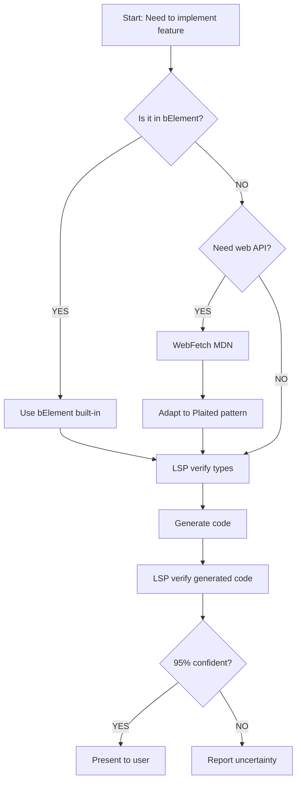

# Code Generation Verification Workflow

Follow this sequence when generating Plaited code to ensure 95% confidence (per [standards.md#confidence-threshold](standards.md#confidence-threshold)).

## Phase 1: API Verification (BEFORE generation)

### 1.1 Check bElement Built-ins FIRST
**Most Important**: Understand what the framework already provides before reaching for web APIs.

**Read type definitions** to understand available context:
- `src/main/b-element.types.ts` - BProgramArgs, BehavioralElementCallbackDetails
- `src/main/css.types.ts` - CSS-in-JS signatures
- `src/main/behavioral.types.ts` - Behavioral programming types

**Verify framework capabilities:**
```typescript
// What's available in bProgram?
bProgram({ $, root, host, internals, trigger, emit, bThreads, bThread, bSync, inspector }) {
  // $ - Query with p-target
  // root - ShadowRoot
  // host - Element instance
  // internals - ElementInternals (if formAssociated: true)
  // trigger - Internal BP events
  // emit - Cross-element communication
  // bThreads - Thread management
  // bThread, bSync - BP utilities
  // inspector - Debugging
}
```

**Check automatic systems:**
- **p-trigger**: Declarative events (no addEventListener needed)
- **p-target**: Automatic helper methods (render, insert, attr, replace)
- **Lifecycle**: Mapped callbacks (onConnected, onDisconnected, etc.)
- **Form association**: Built-in ElementInternals support

### 1.2 LSP Verification of Plaited Types
**Use LSP hover** to verify framework signatures:

```typescript
// Hover on these imports to verify current signatures:
import { bElement } from 'plaited'  // Line X, character Y
import { createStyles, createHostStyles } from 'plaited'
import type { BProgramArgs, BehavioralElementCallbackDetails } from 'plaited'
```

**Common LSP checks:**
- Hover on `bElement` → see parameters (tag, shadowDom, formAssociated, bProgram, etc.)
- Hover on `BProgramArgs` → see all available properties
- Hover on `BehavioralElementCallbackDetails` → see all lifecycle callbacks
- Use `goToDefinition` → read TSDoc and understand implementation
- Use `findReferences` → see usage patterns in codebase

### 1.3 Web API Verification (only if not in bElement)
**Only after confirming the feature isn't built into bElement**, use WebFetch for web platform APIs:

**When to use WebFetch:**
- Browser APIs not wrapped (Intersection Observer, Resize Observer)
- Platform features (Clipboard, File API, Storage)
- CSS APIs (Houdini, Typed OM)

**Sources (priority order):**
1. MDN Web Docs (developer.mozilla.org)
2. WHATWG Living Standards (spec.whatwg.org)
3. W3C Specifications

## Phase 2: Code Generation

### 2.1 Apply Plaited Patterns (Not Raw Web APIs)

**Use bElement patterns:**
```typescript
// ✅ Use $ with p-target, not querySelector
const input = $<HTMLInputElement>('my-input')[0]

// ✅ Use p-trigger, not addEventListener
<button p-trigger={{ click: 'handleClick' }}>

// ✅ Use helper methods, not direct DOM
element?.render(<p>New content</p>)

// ✅ Use internals from BProgramArgs, not attachInternals()
bProgram({ internals }) {
  return {
    setValue(value: string) {
      internals.setFormValue(value)
    }
  }
}
```

### 2.2 Follow Code Conventions
- Apply patterns from [code-conventions.md](code-conventions.md):
  - Use `type` over `interface`
  - Object parameters for 2+ arguments
  - JSX syntax for templates
  - Arrow functions preferred
  - Null handling: assertions (`!`) vs optional chaining (`?.`)
- Use package imports (`'plaited'`, `'plaited/testing'`)

### 2.3 Apply CSS-in-JS Patterns
```typescript
// ✅ Separate files for styles and tokens
// File: element.css.ts
export const styles = createStyles({ /* ... */ })
export const hostStyles = createHostStyles({ /* ... */ })

// File: element.tokens.ts
export const tokens = createTokens('namespace', { /* ... */ })

// ✅ Pass token references, don't invoke
backgroundColor: tokens.primary  // NOT tokens.primary()
```

## Phase 3: Post-Generation Validation

### 3.1 LSP Type Checking
**Verify generated code has no type errors:**

```typescript
// Hover over function calls to verify signatures match
internals.setFormValue('value')
//        ^
// LSP confirms: setFormValue(value: File | string | FormData | null)

// Hover over callback parameters to verify types
onAttributeChanged({ name, oldValue, newValue }) {
//                  ^
// LSP confirms: BehavioralElementCallbackDetails['onAttributeChanged']
}
```

### 3.2 Reference Alignment
**Use LSP findReferences** to see similar patterns:
- How is `bElement` used elsewhere?
- What patterns exist for `bProgram` callbacks?
- How are styles composed in other files?

### 3.3 Test/Story Alignment
**Verify generated code matches patterns in codebase:**
- Read relevant `*.spec.ts` files for unit test patterns
- Check `*.stories.tsx` files for template patterns
- Ensure callbacks follow established conventions
- Confirm event handler names match p-trigger usage

## Confidence Threshold

Only proceed if you achieve **95% confidence** (per [standards.md#confidence-threshold](standards.md#confidence-threshold)) after all three phases:

**Checklist:**
- ✓ Verified what bElement provides (not reinventing features)
- ✓ Used LSP to verify type signatures match current code
- ✓ Applied Plaited patterns (not raw web APIs)
- ✓ Followed code style guidelines
- ✓ Generated code has no type errors (LSP verified)
- ✓ Patterns match existing codebase usage

**If uncertain:**
- Report the discrepancy clearly
- State why you cannot confidently recommend a fix
- Present the issue to the user for manual resolution
- DO NOT invent solutions or infer changes

## Complete Example: Form-Associated Custom Element

### Phase 1: Verification

**1.1 Check bElement built-ins:**
```typescript
// Read BProgramArgs type:
// - internals: ElementInternals ✓ (available if formAssociated: true)
// - $: Query function with p-target ✓
// - trigger: Event dispatcher ✓
```

**1.2 LSP hover verification:**
```typescript
// LSP hover on line 1, char 10:
import { bElement } from 'plaited'
// Confirms: bElement accepts formAssociated parameter

// LSP hover on BProgramArgs:
import type { BProgramArgs } from 'plaited'
// Confirms: internals property available
```

**1.3 WebFetch MDN (for ElementInternals behavior):**
```
WebFetch: developer.mozilla.org/en-US/docs/Web/API/ElementInternals
Confirms: setFormValue(value: File | string | FormData | null)
```

### Phase 2: Generation

```typescript
import { bElement } from 'plaited'
import { styles, hostStyles } from './my-input.css.ts'

export const MyInput = bElement({
  tag: 'my-input',
  formAssociated: true,  // Framework provides internals
  hostStyles,
  shadowDom: (
    <input
      p-target="input"     // Automatic helper methods
      {...styles.input}
      p-trigger={{ input: 'handleInput' }}  // Declarative events
    />
  ),
  bProgram({ $, internals, trigger }) {  // Types from BProgramArgs
    const input = $<HTMLInputElement>('input')[0]  // Type-safe query

    return {
      handleInput() {  // Maps from p-trigger
        const value = input?.attr('value') as string
        trigger({ type: 'updateValue', detail: value })
      },
      updateValue(detail: string) {
        internals.setFormValue(detail)  // LSP verified signature
      },
      onConnected() {
        internals.setFormValue('')
      }
    }
  }
})
```

### Phase 3: Validation

**3.1 LSP type checking:**
```typescript
// Hover on internals.setFormValue:
internals.setFormValue(detail)
//        ^
// LSP confirms: signature matches, no type errors ✓
```

**3.2 findReferences check:**
```typescript
// LSP findReferences on 'formAssociated':
// Sees other form-associated elements in codebase
// Confirms pattern matches ✓
```

**3.3 Test alignment:**
```typescript
// Read form-associated-elements.stories.tsx
// Confirms: pattern matches existing form controls ✓
```

**Confidence: 95%** ✓ Ready to present to user

## Quick Reference

### Decision Tree



### Common Scenarios

| Scenario | Phase 1 Check | Tool | Result |
|----------|---------------|------|--------|
| Need to query elements | Check BProgramArgs | - | Use `$` with p-target |
| Need event handling | Check p-trigger system | - | Use p-trigger attribute |
| Need lifecycle hook | Check BehavioralElementCallbackDetails | LSP hover | Use onConnected, etc. |
| Need form integration | Check formAssociated | LSP hover | Use internals from BProgramArgs |
| Need Intersection Observer | Not in bElement | WebFetch MDN | Use web API + cleanup |
| Verify function signature | - | LSP hover | Get exact types |
| See usage patterns | - | LSP findReferences | Learn from codebase |

## Related Resources

- **[lsp-verification.md](lsp-verification.md)**: Detailed LSP usage guide
- **[b-element.md](b-element.md)**: bElement capabilities and framework-first approach
- **[standards.md#confidence-threshold](standards.md#confidence-threshold)**: 95% confidence threshold requirements
- Use `/create-web-pattern-skill` command to create skills for documenting web API patterns
- **[code-conventions.md](code-conventions.md)**: Plaited code conventions and style
- **[stories.md](stories.md)**: Test file patterns and story-based testing
