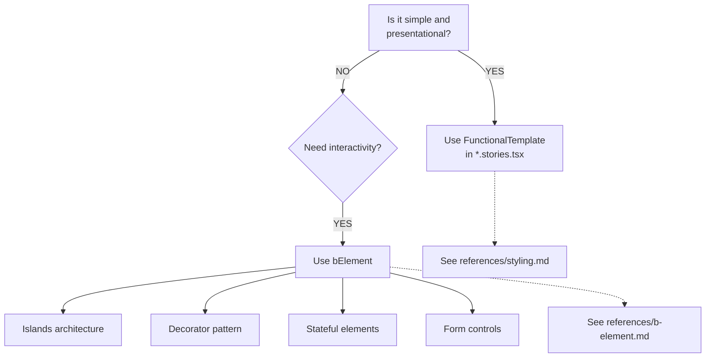
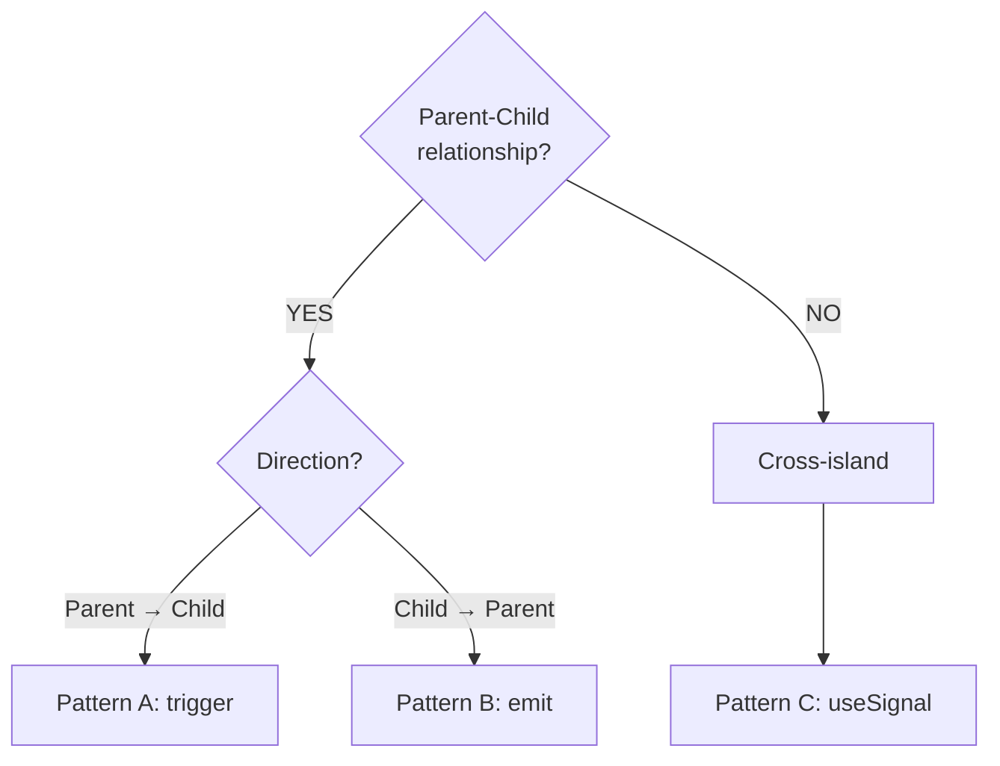

# Plaited UI Patterns

## Purpose

This skill provides documentation for building Plaited user interfaces using behavioral elements, templates, and islands architecture. UI is one application domain of Plaited's behavioral programming paradigm.

**Use this when:**
- Creating templates with bElement or FunctionalTemplate
- Building form-associated custom elements
- Coordinating cross-island communication
- Styling elements with CSS-in-JS (createStyles, createHostStyles)
- Writing stories for testing (`.stories.tsx`)
- Offloading computation to web workers

**For core BP patterns** (event selection, rule composition, useBehavioral), see **plaited-behavioral-core** skill.

## Quick Reference

**Terminology**: Plaited uses **templates** for user interfaces. Use "template" not "component". Refer to browser APIs by specific names (Custom Elements, Shadow DOM) not "Web Components".

**Testing**: UI templates are tested with stories (`.stories.tsx`) using browser automation via the workshop CLI.

**TypeScript LSP**: Use the `typescript-lsp` skill for type inference from `plaited` package imports.

## Pattern Categories

### Templates & Styling

**[styling.md](references/styling.md)** - Templates (JSX, FT, useTemplate, SSR) + CSS-in-JS

Use for:
- JSX syntax and template security
- FunctionalTemplate pattern
- Atomic CSS with createStyles
- Host styling with createHostStyles
- Design tokens with createTokens
- Keyframes animation

### Behavioral Elements

**[b-element.md](references/b-element.md)** - Creating custom elements with bElement

Use for:
- Islands architecture
- Decorator pattern (wrapping native elements)
- Stateful elements
- Form controls

**When to use bElement:**
- Interactive islands requiring state
- Wrapping hard-to-style native elements
- Complex behavioral coordination
- Form integration with ElementInternals

### Form Integration

**[form-associated-elements.md](references/form-associated-elements.md)** - Capturing user intent through forms

Use for:
- Custom form controls with ElementInternals API
- Custom states (`:state()`) for styling
- Form validation
- Type-driven form generation

### Cross-Island Communication

**[cross-island-communication.md](references/cross-island-communication.md)** - Three communication patterns

| Pattern | Direction | API | Use Case |
|---------|-----------|-----|----------|
| A | Parent → Child | `trigger()` | Direct method call |
| B | Child → Parent | `emit()` | Event bubbling |
| C | Cross-island | `useSignal()` | Pub/sub actor pattern |

### Testing

**[stories.md](references/stories.md)** - Story-based testing with browser automation

Use for:
- Writing stories for templates and bElements
- Workshop CLI usage (`bun plaited test`, `bun --hot plaited dev`)
- Accessibility testing
- Inspector debugging

Workshop commands:
```bash
bun run test:stories src/main  # Run story tests
bun --hot plaited dev          # Dev server with hot reload
```

### Performance

**[web-workers.md](references/web-workers.md)** - Offloading computation to background threads

Use for:
- CPU-intensive calculations
- Data processing
- Complex algorithms

APIs:
- `useWorker()` - Main thread interface
- `bWorker()` - Worker thread behavioral program

## Decision Trees

### When to Use Which Pattern?

**Creating UI Elements:**


**Communication Between Elements:**


## File Organization

### For Simple Elements (FunctionalTemplate):
```
element/
  button.css.ts          # Styles (createStyles)
  button.tokens.ts       # Design tokens (optional)
  button.stories.tsx     # FT defined + stories
```

### For Complex Elements (bElement):
```
element/
  toggle-input.css.ts         # Styles + hostStyles
  fills.tokens.ts             # Tokens (optional)
  toggle-input.ts             # bElement definition
  toggle-input.stories.tsx    # Import bElement + stories
```

### Naming Conventions:
- **bElement-specific styles**: Export as `styles` and `hostStyles`
- **Reusable pattern styles**: Export with descriptive names (e.g., `buttonStyles`)
- **Token files**: Use `*.tokens.ts` extension

## Best Practices

### Templates Are Static

```typescript
// Templates render once, use attributes for updates
const btn = $('btn')[0]
btn?.attr('data-variant', 'primary')  // Change via attributes
```

### Token Usage

```typescript
// Pass token references directly, don't invoke
backgroundColor: tokens.primary    // Correct
backgroundColor: tokens.primary()  // Wrong
```

### Communication Hierarchy

```typescript
// Parent-child: Use trigger/emit
parent.trigger({ type: 'event' })
child.emit({ type: 'event', bubbles: true, composed: true })

// Cross-island: Use useSignal
const signal = useSignal<Data>()
signal.set(data)
signal.listen('evt', trigger)
```

## Examples

Complete working examples in `assets/`:

| Example | Pattern | Key Concepts |
|---------|---------|--------------|
| [DecoratedCheckbox](assets/decorator-pattern/) | Decorator | Wrapping native elements, attribute observation |
| [InputAddon](assets/slot-styling/) | Slot styling | `::slotted()` CSS, light DOM styling |
| [ToggleInput](assets/form-associated/) | Form-associated | ElementInternals, custom states |
| [Popover](assets/stateful-elements/) | Stateful | Native popover API, emit() |
| [Tic-Tac-Toe](assets/bp-coordination/) | BP coordination | Complex thread interaction |

## Code Standards

For code conventions, standards, and verification workflow, see the **plaited-standards** skill:
- `code-conventions.md` - Type system, function style, imports
- `standards.md` - 95% confidence threshold, documentation, Bun APIs
- `verification-workflow.md` - Code generation workflow

## Related Skills

- **plaited-standards** - Code conventions, development standards, verification workflow
- **plaited-behavioral-core** - Core BP patterns (foundation)
- **typescript-lsp** - Type verification and symbol discovery
- **workbench** - Story discovery and preview
