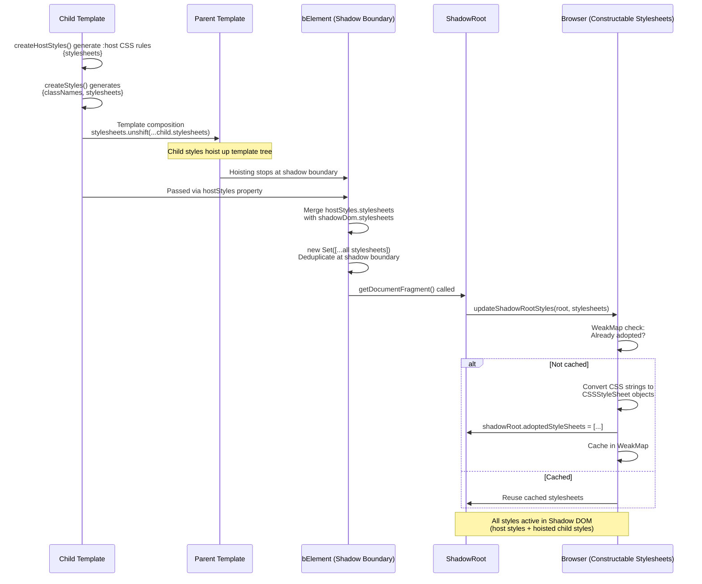

# Styling: Templates and CSS-in-JS

JSX is automatically transformed into `createTemplate()` calls by TypeScript/Bun:

```typescript
// JSX syntax (what you write)
<div className="container">Hello</div>

// Transforms to (internal)
createTemplate('div', { className: 'container', children: 'Hello' })
```

**IMPORTANT**: Always use JSX syntax in your code. Never call `createTemplate()` or `h()` directly - these are internal transformation functions.

### TemplateObject Structure

Every template produces a `TemplateObject` with these properties:

```typescript
type TemplateObject = {
  html: string[]           // HTML fragments
  stylesheets: string[]    // CSS rules from createStyles/createHostStyles
  registry: string[]       // Custom element registrations
  $: typeof TEMPLATE_OBJECT_IDENTIFIER  // Identifier for type checking
}
```

### Fragment for Grouping

Use `Fragment` (or `<>...</>`) to group elements without adding wrapper nodes:

```typescript
import { type FT } from 'plaited'

const List: FT = () => (
  <>
    <li>Item 1</li>
    <li>Item 2</li>
    <li>Item 3</li>
  </>
)

// Renders three <li> elements without wrapping div
```


### FunctionalTemplate Pattern

FunctionalTemplate (FT) is for simple, presentational elements that don't require behavioral programs:

```typescript
import { type FT } from 'plaited'
import { cardStyles } from './card.css.ts'

const Card: FT<{ title: string }> = ({ title, children }) => (
  <div {...cardStyles.card}>
    <h2>{title}</h2>
    {children}
  </div>
)

// Use in other templates or bElements
const app = <Card title="Welcome">Content here</Card>
```

**When to use FT**:
- Buttons, cards, links, layouts
- No state management needed
- Purely presentational
- Easy to style with CSS

**Where to define**:
- Typically in `*.stories.tsx` files for examples
- Can be in separate files for reusability

### Template Security

Plaited provides security-first template design with automatic protections:

#### Automatic HTML Escaping

All content is automatically escaped to prevent XSS attacks:

```typescript
const userInput = '<script>alert("xss")</script>'
const safe = <div>{userInput}</div>
// Renders: <div>&lt;script&gt;alert("xss")&lt;/script&gt;</div>
```

#### Script Protection

Script tags require explicit `trusted` flag:

```typescript
// ❌ Error: Script tag requires 'trusted' property
<script>console.log('hello')</script>

// ✅ Explicit opt-in for trusted content
<script trusted={true}>console.log('hello')</script>
```

#### Event Handler Protection

Inline event handlers (`on*` attributes) are forbidden. Use `p-trigger` instead:

```typescript
// ❌ Error: Event handler attributes not allowed
<button onClick={handler}>Click</button>

// ✅ Use p-trigger declarative event system
<button p-trigger={{ click: 'handleClick' }}>Click</button>
```

#### Trusted Content

For rare cases where you need unescaped HTML:

```typescript
const trustedHTML = '<strong>Bold</strong>'

// Trusted content bypasses HTML escaping
<div trusted={true}>{trustedHTML}</div>
// Renders: <div><strong>Bold</strong></div>
```

**WARNING**: Only use `trusted={true}` for content you control. Never use with user input.

### useTemplate() for Dynamic Content

`useTemplate()` creates a factory function for efficiently cloning and populating template instances:

```typescript
import { bElement, type FT } from 'plaited'

const RowTemplate: FT<{ name: string; value: string }> = ({ name, value }) => (
  <tr>
    <td p-target="name">{name}</td>
    <td p-target="value">{value}</td>
  </tr>
)

const DataTable = bElement({
  tag: 'data-table',
  shadowDom: (
    <>
      <table>
        <tbody p-target="tbody"></tbody>
      </table>
      <template p-target="row">
        <RowTemplate name="" value="" />
      </template>
    </>
  ),
  bProgram({ $ }) {
    const tbody = $<HTMLElement>('tbody')[0]
    const rowTemplate = $<HTMLTemplateElement>('row')[0]!

    // Create template factory
    const createRow = useTemplate(rowTemplate, ($, data) => {
      const name = $('name')[0]
      const value = $('value')[0]
      name?.render(data.name)
      value?.render(data.value)
    })

    return {
      onConnected() {
        // Efficiently create multiple rows
        const rows = [
          { name: 'Alice', value: '100' },
          { name: 'Bob', value: '200' },
        ]

        rows.forEach(data => {
          tbody?.insert('beforeend', createRow(data))
        })
      }
    }
  }
})
```

**Key Benefits**:
- Template cloning is faster than creating from scratch
- Type-safe data binding via generics
- Scoped querying with `$` function
- Helper methods (render, insert, attr) available

**When to use**:
- Dynamic lists
- Repeating content
- Data-driven UI
- Performance-critical rendering

### SSR Integration

Plaited's `ssr()` function renders templates to static HTML with style collection:

```typescript
import { ssr } from 'plaited'

const html = ssr(<MyTemplate />)
// Returns complete HTML string with injected styles
```

#### Style Collection

During SSR, styles are:
1. Collected from all templates
2. Deduplicated via `Set`
3. `:host` selectors converted to `:root`
4. Injected before `</head>`, after `<body>`, or at document start

  hostStyles: createHostStyles({
    display: 'block',
    padding: '1rem',
  }),
  shadowDom: <slot></slot>
})

// SSR output
const html = ssr(<MyElement />)
// Includes: <style>:root { display: block; padding: 1rem; }</style>
```


// Custom element with shadow DOM
<my-element>
  <template shadowrootmode="open">
    <style>:host { display: block; }</style>
    <slot></slot>
  </template>
</my-element>
```

### Integration Point: Templates ↔ Styles

The `stylesheets` property connects templates to CSS-in-JS:

```typescript
import { createStyles } from 'plaited'

const styles = createStyles({
  card: {
    padding: '20px',
    backgroundColor: 'white',
  }
})

// Spread operator adds classNames AND stylesheets to template
const Card = () => <div {...styles.card}>Content</div>

// Template structure:
// {
//   html: ['<div class="padding_abc123 background-color_def456">Content</div>'],
//   stylesheets: ['.padding_abc123{padding:20px}', '.background-color_def456{...}'],
//   registry: [],
//   $: TEMPLATE_OBJECT_IDENTIFIER
// }
```

**Style Hoisting Flow**:
1. `createStyles()` generates `{ classNames, stylesheets }`
2. Spread operator `{...styles.card}` adds both to element
3. Stylesheets hoist up through template tree
4. Hoisting stops at Shadow DOM boundary (bElement)
5. Shadow DOM adopts collected styles via Constructable Stylesheets

---

## CSS-in-JS System

Plaited's CSS-in-JS system provides two main utilities: `createStyles` for generating atomic, hash-based CSS classes for use inside templates, and `createHostStyles` for creating non-atomic styles for a custom element's host (applied via `bElement`'s `hostStyles` property). It offers type-safe styling, automatic Shadow DOM adoption, design tokens, keyframes, and server-side rendering support.

**Key Features:**
- **Atomic CSS (`createStyles`)**: Generates utility classes with deterministic hashes for styling elements inside a template.
- **Host Styling (`createHostStyles`)**: Creates non-atomic styles for a Shadow DOM custom element's host (pass to `bElement` via `hostStyles` property).
- **Nested Selectors**: Support for media queries, pseudo-classes, pseudo-elements, and attribute selectors
- **Shadow DOM Integration**: Automatic style adoption using Constructable Stylesheets with WeakMap caching
- **Style Hoisting**: Child template styles automatically bubble up to parent until Shadow DOM boundary
- **SSR Support**: Styles are collected for SSR, converting `:host` to `:root` for styles not adopted by a Shadow DOM
- **Design Tokens**: Type-safe CSS custom properties
- **Keyframe Animations**: Hash-based animation identifiers
- **Style Composition**: Combine multiple style objects with `joinStyles`

## Core Concepts

### 1. Atomic CSS Generation (`createStyles`)

The `createStyles` function generates atomic CSS where each property is converted into a separate class with a deterministic hash:

```typescript
const styles = createStyles({
  button: {
    padding: '10px',
    backgroundColor: 'blue',
  }
})
// Generates:
// { classNames: ['padding_abc123', 'background-color_def456'], stylesheets: [...] }
```

### 2. Nested Selectors with $default

Property values can be simple values or nested objects with an optional `$default` key for the base style alongside selector variants:

```typescript
const styles = createStyles({
  input: {
    border: {
      $default: '1px solid gray',
      '[disabled]': '1px solid red',
      ':focus': '2px solid blue',
    }
  }
})
```

The `$default` key specifies the base value for a property at a given nesting level. This pattern is recursive, allowing nested selectors like media queries to have their own `$default` value and further nested variants.

### 3. Shadow DOM Adoption

Styles are automatically adopted into Shadow DOM via Constructable Stylesheets:

- **WeakMap Caching**: Prevents duplicate style adoption per ShadowRoot
- **Automatic Adoption**: `updateShadowRootStyles()` converts CSS strings to Constructable Stylesheets
- **Efficient Updates**: Reuses cached stylesheets when possible

### 4. Style Hoisting

Child template styles automatically bubble up through the template tree:

```typescript
// Child template
const childStyles = createStyles({ ... })
const Child = () => <div {...childStyles.foo}>Child</div>

// Parent template - child styles hoist to parent
const Parent = () => <div><Child /></div>
```

Hoisting continues **until a Shadow DOM boundary** is reached (via `bElement`), at which point styles are adopted into that ShadowRoot.

### 5. Server-Side Rendering (SSR)

During SSR:
- Styles are collected from all templates and deduplicated.
- **Global Styles**: Styles not adopted by a Shadow DOM are injected into a `<style>` tag. The injection point is prioritized as follows: before `</head>`, after the opening `<body>` tag, and finally at the start of the document.
  - In this process, `:host` selectors are converted to `:root` to apply them globally.
- **Shadow DOM Styles**: Styles adopted by a custom element with Shadow DOM are embedded within its Declarative Shadow DOM template.

### 6. Browser Hydration

When custom element is defined in browser:
- Declarative Shadow DOM processed
- Inline `<style>` tags converted to Constructable Stylesheets
- WeakMap caching prevents duplicate adoptions
- Shadow boundary styles deduplicated

### 7. Deduplication Strategy

- **SSR Level**: `Set` deduplication in `ssr()` function
- **Shadow Boundary**: `new Set(shadowDom.stylesheets)` when creating shadow root
- **Adoption Level**: WeakMap caching in `updateShadowRootStyles()`

## File Organization

Plaited follows a consistent file organization pattern for styles and templates:

### Pattern 1: Styles and Tokens in Separate Files

**Always define styles in `*.css.ts` files** and **tokens in `*.tokens.ts` files**, separate from template and element definitions.

**File Naming:**
- **Styles**: Use `*.css.ts` extension (e.g., `button.css.ts`, `toggle-input.css.ts`)
- **Tokens**: Use `*.tokens.ts` extension (e.g., `theme.tokens.ts`, `fills.tokens.ts`, `colors.tokens.ts`)

**Naming Convention for Exports:**
- **bElement-specific styles**: Export as `styles` and `hostStyles` (filename provides context)
  - Example: `toggle-input.css.ts` exports `styles` and `hostStyles`
- **Reusable pattern styles**: Export with descriptive names (can be imported into multiple places)
  - Example: `button.css.ts` exports `buttonStyles`
  - Example: `link.css.ts` exports `linkStyles`
  - Example: `card.css.ts` exports `cardStyles`

**File: `button.css.ts`**
```typescript
import { createStyles } from 'plaited'

export const buttonStyles = createStyles({
  btn: {
    padding: '10px 20px',
    backgroundColor: {
      $default: 'blue',
      ':hover': 'darkblue',
    },
  }
})
```

### Pattern 2: FunctionalTemplate for Simple Elements

Use FunctionalTemplate (FT) for easily stylable, presentational elements like buttons, cards, and layouts. These are typically defined in `*.stories.tsx` files to demonstrate DOM structure and styling patterns.

**File: `button.stories.tsx`**
```typescript
import { type FT } from 'plaited'
import { story } from 'plaited/testing'
import { buttonStyles } from './button.css.ts'

const Button: FT<{ variant?: string }> = ({ variant, children, ...attrs }) => (
  <button {...attrs} {...buttonStyles.btn} data-variant={variant}>
    {children}
  </button>
)

export const primaryButton = story({
  description: 'Button with primary variant styling',
  template: () => <Button variant="primary">Click Me</Button>,
})
```

**Purpose**: FunctionalTemplate examples teach agents how to apply styles from `*.css.ts` files to specific DOM structures.

### Pattern 3: bElement for Complex Elements

Use bElement for:
- **Islands architecture**: Interactive islands with behavioral programs
- **Decorator pattern**: Wrapping hard-to-style native elements (inputs, checkboxes)
- **Stateful elements**: Complex state management (popovers, dialogs)
- **Form-associated elements**: Custom form controls (toggle inputs, rating inputs)
- **Non-existent native elements**: Elements that don't exist natively

**Always define bElement in a separate file** (not in `*.stories.tsx`). Stories import the element for testing.

**File: `fills.tokens.ts`**
```typescript
import { createTokens } from 'plaited'

export const { fills } = createTokens('fills', {
  fill: {
    default: { $value: 'lightblue' },
    checked: { $value: 'blue' },
    disabled: { $value: 'grey' },
  },
})
```

**File: `toggle-input.css.ts`**
```typescript
import { createStyles, createHostStyles, joinStyles } from 'plaited'
import { fills } from './fills.tokens.ts'

export const styles = createStyles({
  symbol: {
    height: '16px',
    width: '16px',
    backgroundColor: {
      $default: fills.fill.default,
      ':host(:state(checked))': fills.fill.checked,
      ':host(:state(disabled))': fills.fill.disabled,
    },
  }
})

export const hostStyles = joinStyles(
  fills.fill.default,
  fills.fill.checked,
  fills.fill.disabled,
  createHostStyles({
    display: 'inline-grid',
  })
)
```

**File: `toggle-input.ts`**
```typescript
import { bElement } from 'plaited'
import { styles, hostStyles } from './toggle-input.css.ts'

export const ToggleInput = bElement({
  tag: 'toggle-input',
  formAssociated: true,
  hostStyles,
  shadowDom: (
    <div
      p-target='symbol'
      {...styles.symbol}
      p-trigger={{ click: 'click' }}
    />
  ),
  bProgram({ trigger, internals }) {
    return {
      click() {
        trigger({ type: 'checked', detail: !internals.states.has('checked') })
      },
      // ... other handlers
    }
  },
})
```

**File: `toggle-input.stories.tsx`**
```typescript
import { story } from 'plaited/testing'
import { ToggleInput } from './toggle-input.ts'

export const basicToggle = story({
  description: 'Toggle input with form association',
  template: () => <ToggleInput checked />,
  // ... play function
})
```

**Key Difference**:
- ✅ Simple button → FunctionalTemplate (defined in `*.stories.tsx`)
- ✅ Custom input → bElement (defined in separate file, imported by `*.stories.tsx`)

## API Reference

### `createStyles(classNames)`

Creates atomic CSS classes for Shadow DOM child elements.

**Type Signature:**
```typescript
function createStyles<T extends CreateParams>(classNames: T): ClassNames<T>
```

**Parameters:**
- `classNames`: Object where keys are class names and values are CSS property objects

**Returns:** Object mapping class names to `ElementStylesObject` with:
- `classNames`: Array of generated atomic class names (e.g., `['padding_abc123']`)
- `stylesheets`: Array of CSS rule strings

**Example:**

**File: `button.css.ts`**
```typescript
import { createStyles } from 'plaited'

export const buttonStyles = createStyles({
  btn: {
    padding: '10px 20px',
    backgroundColor: {
      $default: 'blue',
      ':hover': 'darkblue',
      '[disabled]': 'gray',
    },
    fontSize: '16px',
  }
})
```

**File: `button.stories.tsx`**
```typescript
import { type FT } from 'plaited'
import { story } from 'plaited/testing'
import { buttonStyles } from './button.css.ts'

const Button: FT = ({ children }) => (
  <button {...buttonStyles.btn}>{children}</button>
)

export const basicButton = story({
  description: 'Button with hover and disabled states',
  template: () => <Button>Click Me</Button>,
})
```

### `createHostStyles(props)`

Creates non-atomic CSS styles for a custom element's `:host` selector and Shadow DOM. Unlike `createStyles` which generates atomic classes, `createHostStyles` generates non-atomic CSS rules scoped to the host element.

**Type Signature:**
```typescript
function createHostStyles(props: CreateHostParams): HostStylesObject
```

**How to Apply:**

1. **Create the styles** in `*.css.ts` file using `createHostStyles()`
2. **Pass to `bElement`** via the `hostStyles` property
3. **Automatic adoption** - Styles are then automatically adopted into the Shadow DOM

**File: `my-element.css.ts`**
```typescript
import { createHostStyles } from 'plaited'

export const hostStyles = createHostStyles({
  display: 'block',
  padding: '1rem',
})
```

**File: `my-element.ts`**
```typescript
import { bElement } from 'plaited'
import { hostStyles } from './my-element.css.ts'

export const MyElement = bElement({
  tag: 'my-element',
  hostStyles,
  shadowDom: <slot></slot>
})
```

**Parameters:**

The top-level keys of the `props` object are always CSS properties (e.g., `color`, `backgroundColor`). The value of each property can be a string or a nested object to define more complex styling rules.

#### Rule 1: Simple Host Styling

If a CSS property has a simple string value, it applies directly to the host element, generating a `:host` rule.

```typescript
const hostStyles = createHostStyles({
  display: 'block', // Generates: :host { display: block; }
  padding: '1em',   // Generates: :host { padding: 1em; }
})
```

#### Rule 2: Complex Styling with Nested Objects

For conditional styling, a CSS property's value can be a nested object. The keys within this object determine the final CSS selector.

**A. Styling Elements Inside the Shadow DOM**

To style an element inside the shadow root, use a standard CSS selector as the key. This selector will be appended to `:host`, scoping it correctly. The `$default` key is a special case that targets the `:host` itself.

```typescript
const hostStyles = createHostStyles({
  color: {
    $default: 'black',        // Generates: :host { color: black; }
    'h1': 'darkblue',         // Generates: :host h1 { color: darkblue; }
    '> .wrapper': 'purple',   // Generates: :host > .wrapper { color: purple; }
    '::slotted(span)': 'green' // Styles `<span>` elements from the light DOM rendered in a `<slot>`
  }
})
```

**B. Styling the Host Conditionally (`:host(...)`)**

To style the host element based on its own attributes, classes, or pseudo-classes as they exist in the light DOM, use the special `$compoundSelectors` key. The selectors within this object are wrapped by `:host(...)`.

```typescript
const hostStyles = createHostStyles({
  backgroundColor: {
    $default: 'white', // Base style for :host
    $compoundSelectors: {
      ':hover': 'lightgrey',      // Generates: :host(:hover) { ... }
      '[disabled]': '#eee',       // Generates: :host([disabled]) { ... }
      '.dark-theme': 'black',     // Generates: :host(.dark-theme) { ... }
    },
  },
})
```
This pattern allows a host element to change its own appearance based on its context in the main document. Media queries can also be nested within these selectors for responsive host styles.

**C. Conditionally Styling Shadow DOM Children**

You can combine the previous rules to style elements inside the shadow root based on the host element's state. To do this, nest a descendant selector key *inside* a `$compoundSelectors` object.

```typescript
const hostStyles = createHostStyles({
  // Rule B applied to `backgroundColor`
  backgroundColor: {
    $default: 'white',
    $compoundSelectors: {
      '[disabled]': '#eee', // Generates: :host([disabled]) { background-color: #eee; }
    },
  },
  // Rule C applied to `color`
  color: {
    $default: 'black',
    $compoundSelectors: {
      '[disabled]': {
        // This targets a child, not the host
        '.label': 'grey', // Generates: :host([disabled]) .label { color: grey; }
      },
    }
  }
})
```
This is a powerful feature of `createHostStyles`, allowing the host's context to cascade styles into its private Shadow DOM.

**Example:**

**File: `my-element.css.ts`**
```typescript
import { createHostStyles } from 'plaited'

export const hostStyles = createHostStyles({
  display: 'block',
  padding: '20px',
  backgroundColor: {
    $default: 'white',
    $compoundSelectors: {
      '.dark': 'black',
      '[data-theme="blue"]': 'lightblue',
    }
  }
})
```

**File: `my-element.ts`**
```typescript
import { bElement } from 'plaited'
import { hostStyles } from './my-element.css.ts'

export const MyElement = bElement({
  tag: 'my-element',
  hostStyles,
  shadowDom: <slot></slot>
})
```

### `createKeyframes(name, frames)`

Creates CSS `@keyframes` animation with hash-based identifier.

**Type Signature:**
```typescript
function createKeyframes<I extends string>(
  name: I,
  frames: CSSKeyFrames
): Record<I, StyleFunctionKeyframe>
```

**Parameters:**
- `name`: Base animation name (hash will be appended)
- `frames`: Object with `from`, `to`, or percentage keys defining animation stages

**Returns:** Object mapping the animation name to a `StyleFunctionKeyframe`:
- Destructure to extract the keyframe function: `const { fadeIn } = createKeyframes('fadeIn', ...)`
- Invoke `keyframe()` to get `HostStylesObject` with animation CSS
- Access `keyframe.id` to reference animation name in CSS

**Example:**

**File: `animated-element.css.ts`**
```typescript
import { createKeyframes, createHostStyles, joinStyles } from 'plaited'

const { fadeIn } = createKeyframes('fadeIn', {
  from: { opacity: '0' },
  to: { opacity: '1' }
})

export const hostStyles = joinStyles(
  createHostStyles({
    animation: `${fadeIn.id} 0.3s ease-in`,
  }),
  fadeIn()  // Combine keyframe styles with host styles
)
```

**File: `animated-element.ts`**
```typescript
import { bElement } from 'plaited'
import { hostStyles } from './animated-element.css.ts'

export const AnimatedElement = bElement({
  tag: 'animated-element',
  hostStyles,
  shadowDom: <slot></slot>
})
```

### `createTokens(namespace, tokens)`

Creates design tokens as CSS custom properties with type-safe references.

**Type Signature:**
```typescript
function createTokens<T extends TokenDefinitions>(
  namespace: string,
  tokens: T
): TokenReferences<T>
```

**Parameters:**
- `namespace`: String prefix for CSS variable names (kebab-cased)
- `tokens`: Object defining token values with `$value` key

**Returns:** Object with token reference functions and `.styles` property containing CSS custom property definitions

**Token Usage Pattern:**
- **Pass token reference directly** (not invoked) when used as CSS property values
- **Invoke `token()`** only when you need the CSS variable string reference

**Example:**

**File: `theme.tokens.ts`**
```typescript
import { createTokens } from 'plaited'

export const { theme } = createTokens('theme', {
  primary: { $value: '#007bff' },
  spacing: { $value: '16px' },
})
```

**File: `fills.tokens.ts`**
```typescript
import { createTokens } from 'plaited'

export const { fills } = createTokens('fills', {
  fill: {
    default: { $value: 'lightblue' },
    checked: { $value: 'blue' },
    disabled: { $value: 'grey' },
  },
})
```

**File: `toggle-input.css.ts`**
```typescript
import { createStyles, createHostStyles, joinStyles } from 'plaited'
import { theme } from './theme.tokens.ts'
import { fills } from './fills.tokens.ts'

export const styles = createStyles({
  symbol: {
    height: '16px',
    width: '16px',
    backgroundColor: {
      $default: fills.fill.default,
      ':host(:state(checked))': fills.fill.checked,
      ':host(:state(disabled))': fills.fill.disabled,
    },
  }
})

export const hostStyles = joinStyles(
  fills.fill.default,
  fills.fill.checked,
  fills.fill.disabled,
  createHostStyles({
    display: 'inline-grid',
    padding: theme.spacing,  // Token reference, not invoked
  })
)
```

**File: `toggle-input.ts`**
```typescript
import { bElement } from 'plaited'
import { styles, hostStyles } from './toggle-input.css.ts'

export const ToggleInput = bElement({
  tag: 'toggle-input',
  formAssociated: true,
  hostStyles,
  shadowDom: (
    <div
      p-target='symbol'
      {...styles.symbol}
      p-trigger={{ click: 'click' }}
    />
  ),
  bProgram({ trigger, internals }) {
    return {
      click() {
        trigger({ type: 'checked', detail: !internals.states.has('checked') })
      },
      // ... other handlers
    }
  },
})
```

**Using token() function:**
```typescript
// Only invoke token() when you need the CSS variable string
console.log(theme.primary())  // 'var(--theme-primary)'
```

**Supports:**
- Simple values: `{ $value: 'string' | number }`
- Arrays: `{ $value: ['value1', 'value2'], $csv?: boolean }`
- Functions: `{ $value: { $function: 'name', $arguments: [...], $csv?: boolean } }`
- Scales (one level nesting): `{ default: { $value }, checked: { $value } }`
- Token references: `{ $value: otherToken }` (pass reference, don't invoke)

### `joinStyles(...styles)`

A flexible utility that combines multiple style objects into a single `StylesObject`. It is designed to merge styles from `createStyles`, `createHostStyles`, and `createTokens`, and it intelligently filters out any falsy values, making it ideal for conditional style composition.

**Type Signature:**
```typescript
function joinStyles(
  ...styleObjects: (StylesObject | DesignTokenReference | undefined)[]
): StylesObject
```

**Parameters:**
- `...styleObjects`: A variable number of style objects to combine. Falsy values (`undefined`, `null`, `false`) in the list are ignored. This can include:
  - `StylesObject` from `createStyles` and `createHostStyles`.
  - `DesignTokenReference` from `createTokens`.

**Returns:**
A new `StylesObject` with `classNames` and `stylesheets` arrays containing the merged values from all provided sources.

**Key Behaviors:**
- **Class Names**: Concatenates `classNames` from all `createStyles` objects.
- **Stylesheets**: Merges `stylesheets` from `createStyles`, `createHostStyles`, and the `.styles` property of `createTokens` objects.
- **Conditional Logic**: Because it filters falsy values, you can use short-circuiting for conditional styling.

**Example:**

**File: `animated-card.css.ts`**
```typescript
import { createKeyframes, createHostStyles, joinStyles } from 'plaited'

const { pulse } = createKeyframes('pulse', {
  '0%': { transform: 'scale(1)' },
  '50%': { transform: 'scale(1.05)' },
  '100%': { transform: 'scale(1)' }
})

export const hostStyles = joinStyles(
  createHostStyles({
    display: 'block',
    padding: '20px',
    animation: `${pulse.id} 2s infinite`,
  }),
  pulse()  // Combine keyframe styles with host styles
)
```

**File: `animated-card.ts`**
```typescript
import { bElement } from 'plaited'
import { hostStyles } from './animated-card.css.ts'

export const AnimatedCard = bElement({
  tag: 'animated-card',
  hostStyles,
  shadowDom: <slot></slot>
})
```

**Common Pattern: Token Scales with State Variations**

When tokens use scales for state variations, pass each token reference you use to `joinStyles()` to include all CSS variable definitions:

**File: `fills.tokens.ts`**
```typescript
import { createTokens } from 'plaited'

export const { fills } = createTokens('fills', {
  fill: {
    default: { $value: 'lightblue' },
    checked: { $value: 'blue' },
    disabled: { $value: 'gray' },
  }
})
```

**File: `toggle.css.ts`**
```typescript
import { createStyles, createHostStyles, joinStyles } from 'plaited'
import { fills } from './fills.tokens.ts'

export const styles = createStyles({
  symbol: {
    backgroundColor: {
      $default: fills.fill.default,
      ':host(:state(checked))': fills.fill.checked,
      ':host(:state(disabled))': fills.fill.disabled,
    },
  }
})

// joinStyles merges token CSS variables with host styles
export const hostStyles = joinStyles(
  fills.fill.default,  // Includes :host{--fills-fill-default:lightblue;}
  fills.fill.checked,  // Includes :host{--fills-fill-checked:blue;}
  fills.fill.disabled, // Includes :host{--fills-fill-disabled:gray;}
  createHostStyles({
    display: 'inline-grid'
  })
)
```

## Usage Patterns

### 1. Basic Styling

**File: `card.css.ts`**
```typescript
import { createStyles } from 'plaited'

export const cardStyles = createStyles({
  card: {
    padding: '20px',
    borderRadius: '8px',
    backgroundColor: 'white',
    boxShadow: '0 2px 4px rgba(0,0,0,0.1)',
  }
})
```

**File: `card.stories.tsx`**
```typescript
import { type FT } from 'plaited'
import { story } from 'plaited/testing'
import { cardStyles } from './card.css.ts'

const Card: FT = ({ children }) => (
  <div {...cardStyles.card}>{children}</div>
)

export const basicCard = story({
  description: 'Card with basic styling',
  template: () => <Card>Card content</Card>,
})
```

### 2. Nested Selectors

**File: `link.css.ts`**
```typescript
import { createStyles } from 'plaited'

export const linkStyles = createStyles({
  link: {
    color: {
      $default: 'blue',
      ':hover': 'darkblue',
      ':visited': 'purple',
    },
    textDecoration: {
      $default: 'none',
      ':hover': 'underline',
    }
  }
})
```

**File: `link.stories.tsx`**
```typescript
import { type FT } from 'plaited'
import { story } from 'plaited/testing'
import { linkStyles } from './link.css.ts'

const Link: FT<{ href: string }> = ({ href, children }) => (
  <a href={href} {...linkStyles.link}>{children}</a>
)

export const basicLink = story({
  description: 'Basic link with nested selector styles',
  template: () => <Link href="#/">Click me</Link>,
})
```

### 3. Responsive Design

**File: `grid.css.ts`**
```typescript
import { createStyles } from 'plaited'

export const gridStyles = createStyles({
  container: {
    display: 'grid',
    gridTemplateColumns: {
      $default: '1fr',
      '@media (min-width: 768px)': 'repeat(2, 1fr)',
      '@media (min-width: 1024px)': 'repeat(3, 1fr)',
    },
    gap: '20px',
  }
})
```

**File: `grid.stories.tsx`**
```typescript
import { type FT } from 'plaited'
import { story } from 'plaited/testing'
import { gridStyles } from './grid.css.ts'

const Grid: FT = ({ children }) => (
  <div {...gridStyles.container}>{children}</div>
)

export const responsiveGrid = story({
  description: 'Responsive grid with media query breakpoints',
  template: () => (
    <Grid>
      <div>Item 1</div>
      <div>Item 2</div>
      <div>Item 3</div>
    </Grid>
  ),
})
```

### 4. Host Element Styling (bElement)

This section demonstrates using `createHostStyles` with a bElement. See the File Organization section for the complete ToggleInput example with tokens.

### 5. Design Tokens

**File: `theme.tokens.ts`**
```typescript
import { createTokens } from 'plaited'

export const { theme } = createTokens('theme', {
  primary: { $value: '#007bff' },
  secondary: { $value: '#6c757d' },
  spacing: { $value: '16px' },
  fontSize: { $value: '1rem' },
})
```

**File: `button.css.ts`**
```typescript
import { createStyles } from 'plaited'
import { theme } from './theme.tokens.ts'

// ✅ Pass token references directly (not invoked) as CSS values
export const buttonStyles = createStyles({
  btn: {
    backgroundColor: theme.primary,  // NOT theme.primary()
    color: 'white',
    padding: theme.spacing,
    fontSize: theme.fontSize,
    ':hover': {
      backgroundColor: theme.secondary,
    }
  }
})
```

**File: `button.stories.tsx`**
```typescript
import { type FT } from 'plaited'
import { story } from 'plaited/testing'
import { buttonStyles } from './button.css.ts'

const Button: FT = ({ children }) => (
  <button {...buttonStyles.btn}>{children}</button>
)

export const themedButton = story({
  description: 'Button using design tokens for theming',
  template: () => <Button>Click Me</Button>,
})
```

**For bElement usage with tokens**, see the ToggleInput example in Pattern 3 above.

### 6. Animations with Keyframes and Tokens

**File: `colors.tokens.ts`**
```typescript
import { createTokens } from 'plaited'

export const { colors } = createTokens('colors', {
  primary: { $value: '#007bff' },
  accent: { $value: '#ff6b6b' },
})
```

**File: `status-indicator.css.ts`**
```typescript
import { createKeyframes, createHostStyles, joinStyles } from 'plaited'
import { colors } from './colors.tokens.ts'

const { pulse } = createKeyframes('pulse', {
  '0%': {
    transform: 'scale(1)',
    backgroundColor: colors.primary  // NOT colors.primary()
  },
  '50%': {
    transform: 'scale(1.05)',
    backgroundColor: colors.accent
  },
  '100%': {
    transform: 'scale(1)',
    backgroundColor: colors.primary
  }
})

export const hostStyles = joinStyles(
  createHostStyles({
    display: 'block',
    padding: '20px',
    animation: `${pulse.id} 2s infinite`,
  }),
  pulse()  // Combine keyframe styles with host styles
)
```

**File: `status-indicator.ts`**
```typescript
import { bElement } from 'plaited'
import { hostStyles } from './status-indicator.css.ts'

export const StatusIndicator = bElement({
  tag: 'status-indicator',
  hostStyles,
  shadowDom: <slot></slot>
})
```

### 7. Composing Styles with joinStyles

```typescript
import { createStyles, joinStyles } from 'plaited'

const baseButton = createStyles({
  btn: {
    fontFamily: 'sans-serif',
    fontWeight: 700,
    border: 'none',
    borderRadius: '4px',
    cursor: 'pointer',
  }
})

const buttonSizes = createStyles({
  small: {
    fontSize: '12px',
    padding: '8px 16px',
  },
  large: {
    fontSize: '18px',
    padding: '16px 32px',
  }
})

// Combine multiple ElementStylesObject instances
const smallButton = joinStyles(baseButton.btn, buttonSizes.small)

export const SmallButton = ({ children }) => (
  <button {...smallButton}>{children}</button>
)
```

### 8. Attribute-Based Styling

```typescript
import { bElement, createStyles } from 'plaited'

const inputStyles = createStyles({
  field: {
    padding: '8px',
    border: {
      $default: '1px solid gray',
      '[disabled]': '1px solid lightgray',
      ':focus': '2px solid blue',
    },
    backgroundColor: {
      $default: 'white',
      '[disabled]': '#f5f5f5',
    }
  }
})

const MyInput = bElement({
  tag: 'my-input',
  observedAttributes: ['disabled'],
  shadowDom: <input p-target="input" {...inputStyles.field} />,
  bProgram({ $ }) {
    const input = $('input')[0]
    return {
      onAttributeChanged({ name, newValue }) {
        // newValue is string | null - pass directly to attr()
        input?.attr(name, newValue)
      }
    }
  }
})
```

## Integration with Other Features

### Template System

Styles are spread onto elements using JSX syntax:

```typescript
const styles = createStyles({
  button: { padding: '10px', backgroundColor: 'blue' }
})

// Spread style object onto element
const Button = () => <button {...styles.button}>Click</button>
```

The spread operator adds `classNames` and `stylesheets` properties to the element's `TemplateObject`.

### bElement Integration

Host styles are specified via the `hostStyles` parameter:

```typescript
import { bElement, createHostStyles } from 'plaited'

const hostStyles = createHostStyles({
  display: 'block',
  padding: '20px',
})

const MyElement = bElement({
  tag: 'my-element',
  hostStyles,
  shadowDom: <slot></slot>
})
```

Styles from child templates automatically hoist to the `bElement` shadow boundary where they are adopted.

### Server-Side Rendering

Plaited's `ssr()` function distinguishes between global styles and styles meant for a Shadow DOM.

- **Global Styles**: Any stylesheets not adopted by a shadow root are considered global. They are collected, deduplicated, and injected into a single `<style>` tag. During this process, `:host` selectors are converted to `:root` to apply them to the document. The injection point is prioritized: before `</head>`, then after `<body>`, then at the document start.
- **Shadow DOM Styles**: Stylesheets associated with a custom element using Shadow DOM are embedded directly within its Declarative Shadow DOM `<template>` tag. This ensures they are scoped correctly when the element hydrates on the client.

```typescript
import { ssr } from 'plaited'

const html = ssr(<MyTemplate />)
// Styles injected with :root selectors

// SSR Output:
// <style>:root { --theme-primary: #007bff; }</style>
```

### Browser Hydration

When the custom element is defined in the browser:

1. Declarative Shadow DOM processed
2. Inline `<style>` tags converted to Constructable Stylesheets
3. WeakMap caching prevents duplicate adoptions
4. Styles available immediately for rendering

### Attribute-Based Styling Pattern

Instead of dynamically applying classes, use attribute selectors and toggle attributes:

```typescript
const styles = createStyles({
  button: {
    backgroundColor: {
      $default: 'gray',
      '[data-variant="primary"]': 'blue',
      '[data-size="large"]': 'blue',
    },
    padding: {
      $default: '8px 16px',
      '[data-size="large"]': '16px 32px',
    }
  }
})

// In bProgram, toggle attributes to change styles
bProgram({ $ }) {
  const button = $('button')[0]
  return {
    makeVariant() {
      button?.attr('data-variant', 'primary')
    }
  }
}
```

## Style Hoisting & Shadow DOM Adoption



## Common Patterns

### 1. Responsive Typography with Container Queries

```typescript
import { createStyles } from 'plaited'

const typography = createStyles({
  heading: {
    fontSize: {
      $default: '1.5rem',
      '@container (min-width: 400px)': '2rem',
      '@container (min-width: 600px)': '2.5rem',
    },
    lineHeight: '1.2',
  }
})

export const ResponsiveHeading = () => (
  <h1 {...typography.heading}>Responsive Heading</h1>
)
```

### 2. Button with Dynamic Variant Switching

```typescript
import { bElement, createStyles, type FT } from 'plaited'

const buttonStyles = createStyles({
  btn: {
    padding: '10px 20px',
    border: 'none',
    borderRadius: '4px',
    cursor: 'pointer',
    backgroundColor: {
      $default: 'gray',
      '[data-variant="primary"]': 'blue',
      '[data-variant="secondary"]': 'green',
    },
    color: {
      $default: 'black',
      '[data-variant="primary"]': 'white',
      '[data-variant="secondary"]': 'white',
    }
  }
})

// Template accepts variant and PlaitedAttributes (including p-target)
const Button: FT<{ variant?: 'primary' | 'secondary' }> = ({ variant, children, ...attrs }) => (
  <button {...attrs} {...buttonStyles.btn} data-variant={variant}>
    {children}
  </button>
)

// Static usage - template renders once
export const staticButton = (
  <Button variant="primary">Click Me</Button>
)

// Dynamic usage - query with $ and manipulate via helper methods
export const MyCard = bElement({
  tag: 'my-card',
  shadowDom: (
    <>
      <Button p-target="actionBtn" variant="primary">Action</Button>
    </>
  ),
  bProgram({ $ }) {
    const actionBtn = $('actionBtn')[0]

    return {
      toggleVariant() {
        // Templates are static once rendered
        // Change appearance via attribute manipulation using attr() helper
        const current = actionBtn?.attr('data-variant')
        actionBtn?.attr(
          'data-variant',
          current === 'primary' ? 'secondary' : 'primary'
        )
      }
    }
  }
})
```

**Key Principle**: Templates render static markup. Dynamic changes require $ selector + helper methods (`.attr()`, `.render()`, `.insert()`, etc.).

### 3. Dark Mode with Prefers Color Scheme

```typescript
import { createStyles } from 'plaited'

const cardStyles = createStyles({
  card: {
    padding: '20px',
    backgroundColor: {
      $default: 'white',
      '@media (prefers-color-scheme: dark)': '#1a1a1a',
    },
    color: {
      $default: 'black',
      '@media (prefers-color-scheme: dark)': 'white',
    }
  }
})

export const Card = ({ children }) => (
  <div {...cardStyles.card}>{children}</div>
)
```

### 4. Design Tokens with Keyframe Animations

```typescript
import { createTokens, createKeyframes, createHostStyles, joinStyles, bElement } from 'plaited'

const { theme } = createTokens('theme', {
  primary: { $value: '#007bff' },
  spacing: { $value: '16px' },
})

const { fadeIn } = createKeyframes('fadeIn', {
  from: { opacity: '0' },
  to: { opacity: '1' }
})

const hostStyles = joinStyles(
  createHostStyles({
    display: 'block',
    padding: theme.spacing,  // NOT theme.spacing() - token .styles auto-pushed
    color: theme.primary,
    animation: `${fadeIn.id} 0.3s ease-in`,
  }),
  fadeIn()  // Combine keyframe styles with host styles
)

const AnimatedCard = bElement({
  tag: 'animated-card',
  hostStyles,
  shadowDom: <slot></slot>
})
```

### 5. Pseudo-Elements for Decorative Effects

```typescript
import { createStyles } from 'plaited'

const decoratedStyles = createStyles({
  badge: {
    position: 'relative',
    padding: '8px 16px',
    '::before': {
      content: '""',
      position: 'absolute',
      top: '0',
      left: '0',
      width: '4px',
      height: '100%',
      backgroundColor: 'blue',
    }
  }
})

export const Badge = ({ children }) => (
  <div {...decoratedStyles.badge}>{children}</div>
)
```

## Common Pitfalls

### 1. Spread Operator Adds classNames + stylesheets

When you spread a style object onto an element, it adds both `classNames` and `stylesheets` properties:

```typescript
const styles = createStyles({
  btn: { padding: '10px' }
})

// This adds classNames=['padding_abc'] and stylesheets=[...]
<button {...styles.btn}>Click</button>
```

**How It Works:** The spread operator merges the `ElementStylesObject` properties (`classNames` and `stylesheets`) into the element's attributes, which are then processed by the template system.

### 2. joinStyles Doesn't Deduplicate Identical CSS

`joinStyles` merges arrays without deduplication:

```typescript
const combined = joinStyles(styles.a, styles.b, styles.a)
// styles.a's CSS appears twice in combined.stylesheets
```

**Deduplication happens at:**
- SSR level (via `Set`)
- Shadow boundary (via `Set`)
- Adoption level (via WeakMap caching)

### 3. Token Usage Pattern

❌ **Wrong:** Invoking tokens when passing as CSS values
```typescript
const styles = createStyles({
  button: {
    backgroundColor: theme.primary(),  // WRONG - don't invoke
  }
})
```

✅ **Correct:** Pass token reference directly
```typescript
const styles = createStyles({
  button: {
    backgroundColor: theme.primary,  // Correct - pass reference
  }
})
```

Only invoke `token()` when you need the CSS variable string reference:
```typescript
console.log(theme.primary())  // 'var(--theme-primary)'
```

### 4. Never Use String CSS Custom Properties

❌ **Wrong:** Using string CSS custom properties like `'var(--name)'`
```typescript
export const toggleStyles = createStyles({
  symbol: {
    backgroundColor: 'var(--fill)',  // WRONG - don't use strings
  }
})
```

✅ **Correct:** Use `createTokens` and token references

**File: `fills.tokens.ts`**
```typescript
import { createTokens } from 'plaited'

export const { fills } = createTokens('fills', {
  fill: {
    default: { $value: 'lightblue' },
    checked: { $value: 'blue' },
    disabled: { $value: 'gray' },
  },
})
```

**File: `toggle-input.css.ts`**
```typescript
import { createStyles } from 'plaited'
import { fills } from './fills.tokens.ts'

export const toggleStyles = createStyles({
  symbol: {
    backgroundColor: {
      $default: fills.fill.default,  // Correct - use token reference
      ':host(:state(checked))': fills.fill.checked,
      ':host(:state(disabled))': fills.fill.disabled,
    },
  }
})
```

**Rationale:** Tokens provide type safety, automatic CSS variable generation, and centralized design system management. String CSS custom properties bypass these benefits and make refactoring harder.

### 5. createHostStyles Single Parameter

❌ **Wrong:** Passing second array parameter
```typescript
const hostStyles = createHostStyles(
  { color: 'red' },
  [token.styles]  // WRONG - no second parameter
)
```

✅ **Correct:** Token styles automatically included
```typescript
const hostStyles = createHostStyles({
  color: theme.primary  // Token .styles auto-pushed
})
```

### 5. Nested Selector Purpose

❌ **Wrong:** Using nested selectors to create new properties
```typescript
const styles = createStyles({
  input: {
    border: '1px solid gray',
    '[disabled]': {
      opacity: '0.5',  // WRONG - creates new property
    }
  }
})
```

✅ **Correct:** Nested selectors modify the SAME property
```typescript
const styles = createStyles({
  input: {
    border: {
      $default: '1px solid gray',
      '[disabled]': '1px solid red',  // Same property, different value
    },
    opacity: {
      $default: '1',
      '[disabled]': '0.5',
    }
  }
})
```

### 6. Attribute-Based Styling Instead of Class Manipulation

❌ **Wrong:** Trying to dynamically change classes or re-render templates
```typescript
// Don't try to change classes or re-render different template variants
```

✅ **Correct:** Use attribute selectors in CSS, toggle attributes in bProgram
```typescript
const styles = createStyles({
  button: {
    backgroundColor: {
      $default: 'gray',
      '[data-variant="primary"]': 'blue',
    }
  }
})

// Template with spread {...attrs} for p-target
const Button: FT<{ variant?: string }> = ({ variant, children, ...attrs }) => (
  <button {...attrs} {...styles.button} data-variant={variant}>
    {children}
  </button>
)

// Use in bElement
bElement({
  shadowDom: <Button p-target="btn" variant="primary" />,
  bProgram({ $ }) {
    const btn = $('btn')[0]
    return {
      changeStyle() {
        btn?.attr('data-variant', 'secondary')
      }
    }
  }
})
```

**Key Principle:** Templates are static once rendered. Dynamic changes require $ selector + helper methods.

### 7. Custom Attributes Require data- Prefix

❌ **Wrong:** Using custom attributes without `data-` prefix
```typescript
<button variant="primary">Click</button>
```

✅ **Correct:** Use `data-` prefix for custom attributes
```typescript
<button data-variant="primary">Click</button>
```

This follows the HTML standard for custom attributes.
