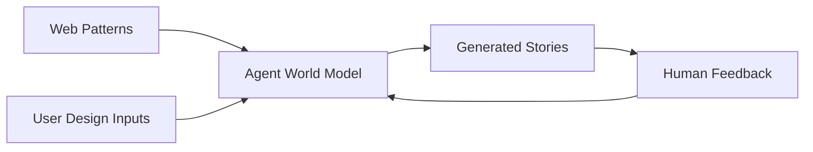

# Web Patterns

Foundation web patterns that train the Plaited agent's world model for generating UI code.

## Purpose

This skill provides **training data** for the Plaited agent—patterns that establish the agent's understanding of web APIs, accessibility requirements, and Plaited integration. These patterns are NOT reusable templates; they are knowledge that informs code generation.

**Use this when:**
- Extracting patterns from web articles (web.dev, MDN, etc.)
- Analyzing Web API documentation for Plaited integration
- Understanding accessibility patterns (ARIA)
- Creating new web pattern documentation

**Training Pipeline:**


## Native HTML First

**CRITICAL**: Before creating a bElement, check if native HTML elements solve the problem.

| Need | Native Solution | When to Use bElement |
|------|-----------------|----------------------|
| Collapsible content | `<details>/<summary>` | Custom animation, complex state |
| Modal dialog | `<dialog>` | Custom backdrop, multiple dialogs |
| Tooltip/popup | Popover API | Custom positioning logic |
| Button actions | Invoker Commands API | Complex multi-step actions |
| Form controls | Native `<input>`, `<select>` | Custom styling, complex validation |

### Popover API

Native popup behavior without JavaScript:

```html
<!-- Declarative popover -->
<button popovertarget="my-popup">Open</button>
<div id="my-popup" popover>Popup content</div>

<!-- With explicit actions -->
<button popovertarget="menu" popovertargetaction="show">Show</button>
<button popovertarget="menu" popovertargetaction="hide">Hide</button>
<button popovertarget="menu" popovertargetaction="toggle">Toggle</button>
```

### Invoker Commands API

Declarative button-to-element control (experimental):

```html
<!-- Dialog control -->
<button commandfor="dialog" command="showModal">Open Dialog</button>
<dialog id="dialog">Content</dialog>

<!-- Popover control -->
<button commandfor="popup" command="togglePopover">Toggle</button>
<div id="popup" popover>Popup</div>

<!-- Details control -->
<button commandfor="details" command="toggle">Toggle</button>
<details id="details"><summary>Summary</summary>Content</details>
```

## Pattern Philosophy

### Patterns Are Training Data

Patterns in this skill train the agent's world model. They are NOT:
- Reusable templates to import
- Published packages
- Shared across projects

They ARE:
- Knowledge for the agent to learn from
- Self-contained examples demonstrating best practices
- Training material that improves generation quality

### Pattern File Structure

Each pattern follows this structure:

```
pattern/
  accordion.css.ts        # Styles (createStyles) - ALWAYS separate
  accordion.tokens.ts     # Design tokens (optional)
  accordion.stories.tsx   # bElement/FT + stories (imports from css.ts)
```

**Key principles:**
1. **Styles in `*.css.ts`** - createStyles always in separate file
2. **bElement or FunctionalTemplate is local** - Defined in stories, NOT exported
3. **Stories ARE exported** - Required for testing and training
4. **Tokens in `*.tokens.ts`** - Design system values when needed

### Self-Contained Stories Example

```typescript
// accordion.css.ts
import { createStyles } from 'plaited'

export const styles = createStyles({
  accordion: {
    border: '1px solid #ccc',
    borderRadius: '4px',
  },
  header: {
    padding: '1rem',
    cursor: 'pointer',
  },
  content: {
    padding: '1rem',
  },
})
```

```typescript
// accordion.stories.tsx
import { bElement } from 'plaited/ui'
import { story } from 'plaited/testing'
import { styles } from './accordion.css.ts'

// bElement - defined locally, NOT exported
const Accordion = bElement({
  tag: 'pattern-accordion',
  shadowDom: (
    <div p-target="accordion" {...styles.accordion}>
      <button p-target="header" p-trigger={{ click: 'toggle' }} {...styles.header}>
        <slot name="header">Header</slot>
      </button>
      <div p-target="content" {...styles.content} hidden>
        <slot>Content</slot>
      </div>
    </div>
  ),
  bProgram({ $ }) {
    return {
      toggle() {
        const content = $('content')[0]
        const isHidden = content?.attr('hidden') !== null
        content?.attr('hidden', isHidden ? null : '')
      },
    }
  },
})

// Stories - EXPORTED for testing/training
export const defaultAccordion = story({
  intent: 'Demonstrates basic accordion expand/collapse behavior',
  template: () => (
    <Accordion>
      <span slot="header">Click to expand</span>
      <p>Accordion content goes here.</p>
    </Accordion>
  ),
  play: async ({ findByAttribute, assert, fireEvent }) => {
    const header = await findByAttribute('p-target', 'header')
    const content = await findByAttribute('p-target', 'content')

    assert({
      given: 'accordion is rendered',
      should: 'have content hidden initially',
      actual: content?.hasAttribute('hidden'),
      expected: true,
    })

    if (header) await fireEvent(header, 'click')

    assert({
      given: 'header is clicked',
      should: 'show content',
      actual: content?.hasAttribute('hidden'),
      expected: false,
    })
  },
})

export const multipleAccordions = story({
  intent: 'Shows multiple independent accordions',
  template: () => (
    <>
      <Accordion>
        <span slot="header">Section 1</span>
        <p>Content 1</p>
      </Accordion>
      <Accordion>
        <span slot="header">Section 2</span>
        <p>Content 2</p>
      </Accordion>
    </>
  ),
})
```

### Pattern Precedence

User-defined patterns **always supersede** foundation patterns from this skill.

**Precedence order:**
1. **User patterns** (extracted by user) → Highest priority
2. **Foundation patterns** (from web-patterns) → Defaults

When generating code, the agent checks user patterns first. If no user pattern exists, foundation patterns provide the baseline.

## Framework-First Adaptation

**CRITICAL**: Check what bElement already provides BEFORE reaching for web APIs.

### What bElement Provides

**BProgramArgs** (available in bProgram callback):
- `$` - Shadow DOM query selector with p-target matching
- `root` - ShadowRoot reference
- `host` - Custom element instance
- `internals` - ElementInternals API
- `trigger` - Internal event dispatcher
- `emit` - Cross-element event dispatcher

**Automatic Systems**:
- **p-trigger**: Declarative event binding with automatic delegation
- **p-target**: Helper methods (render, insert, replace, attr)
- **Shadow DOM**: Automatic via shadowDom parameter
- **Lifecycle**: Callback handlers (onConnected, onDisconnected, etc.)
- **Form Association**: formAssociated: true enables ElementInternals

**Before using ANY web API, ask:**
1. Does BProgramArgs already provide this?
2. Can p-trigger handle this event?
3. Can p-target + helper methods do this?
4. Is this a lifecycle event?

### Adaptation Reference

| Need | bElement Provides | Don't Use |
|------|-------------------|-----------|
| Query Shadow DOM | `$` with p-target | root.querySelector() |
| Event listening | p-trigger attribute | addEventListener() |
| DOM manipulation | Helper methods | Direct DOM APIs |
| Shadow root | `root` in BProgramArgs | this.shadowRoot |
| Element instance | `host` in BProgramArgs | this |
| ElementInternals | `internals` in BProgramArgs | this.attachInternals() |
| Lifecycle | Callback handlers | Raw Custom Element methods |

### Web API Integration (when not in bElement)

```typescript
// Always cleanup web APIs in onDisconnected
bProgram({ host }) {
  let observer: IntersectionObserver | undefined

  return {
    onConnected() {
      observer = new IntersectionObserver((entries) => {
        // Handle intersection
      })
      observer.observe(host)
    },
    onDisconnected() {
      observer?.disconnect()  // Required cleanup
      observer = undefined
    }
  }
}
```

## Output Location

Save extracted patterns to:
```
/references/[pattern-name].md
```

## Pattern Output Template

````markdown
# [Pattern Name]

## Overview
Brief description of what this pattern does.

## Use Cases
- When to use this pattern
- Common scenarios

## Implementation

### Vanilla JavaScript
```javascript
// Standard web API usage
```

### Plaited Adaptation

```typescript
// [pattern-name].css.ts
import { createStyles } from 'plaited'

export const styles = createStyles({
  // Style definitions
})
```

```typescript
// [pattern-name].stories.tsx
import { bElement } from 'plaited/ui'
import { story } from 'plaited/testing'
import { styles } from './[pattern-name].css.ts'

// bElement or FunctionalTemplate - local, NOT exported
const Example = bElement({
  tag: 'example-element',
  shadowDom: (
    <div {...styles.container}>
      {/* Template with p-trigger and p-target */}
    </div>
  ),
  bProgram({ $ }) {
    return {
      // Event handlers
    }
  }
})

// Stories - EXPORTED (intent is required)
export const defaultExample = story({
  intent: 'Describes what this story demonstrates',
  template: () => <Example />,
  play: async ({ findByAttribute, assert, fireEvent }) => {
    // Test assertions
  },
})
```

## Plaited Integration
- Works with Shadow DOM: [yes/no]
- Uses bElement built-ins: [list]
- Requires external web API: [yes/no]
- Cleanup required: [yes/no]

## Browser Compatibility
| Browser | Support |
|---------|---------|
| Chrome | X.X+ |
| Firefox | X.X+ |
| Safari | X.X+ |

## Accessibility
- ARIA considerations
- Keyboard navigation
- Screen reader support

## References
- Source: [Article URL]
- MDN: [MDN link]
````

## Adding New Patterns

When you add a new pattern to the `references/` directory, tell Claude to re-read the skill:
- "Re-read the web-patterns skill to see the new pattern"
- Claude will use the Read tool to load the updated content

## Pattern References

### Form & Structure Patterns

- **[form-structure-pattern.md](references/form-structure-pattern.md)** - Best practices for structuring web forms with semantic HTML, field organization, validation, and UX considerations. Covers proper form elements, logical grouping, accessibility, and mobile-friendly patterns.

- **[css-logical-properties-pattern.md](references/css-logical-properties-pattern.md)** - CSS logical properties for building internationalized elements that adapt to different writing directions (LTR, RTL, vertical). Ensures layouts work correctly across languages and writing modes.

- **[aria-landmarks-pattern.md](references/aria-landmarks-pattern.md)** - Eight landmark roles that identify major page sections for assistive technology users. Facilitates efficient keyboard navigation and helps users perceive page structure (banner, navigation, main, complementary, contentinfo, search, form, region).

### ARIA Widget Patterns

- **[aria-accordion-pattern.md](references/aria-accordion-pattern.md)** - Disclosing widget that enables content to be collapsed or expanded. Provides keyboard navigation and ARIA attributes for show/hide functionality.

- **[aria-alert-pattern.md](references/aria-alert-pattern.md)** - Important messages that alert users to dynamic content changes without interrupting their workflow. Suitable for time-sensitive information that doesn't require user interaction.

- **[aria-alertdialog-pattern.md](references/aria-alertdialog-pattern.md)** - Modal dialog that interrupts workflow to communicate critical messages and acquire user responses. Specialized for action confirmation prompts and error message confirmations.

- **[aria-breadcrumb-pattern.md](references/aria-breadcrumb-pattern.md)** - List of links showing the hierarchical path to the current page. Helps users understand their location within a website or web application.

- **[aria-button-pattern.md](references/aria-button-pattern.md)** - Widget for triggering actions or events. Covers command buttons, toggle buttons (two-state), and menu buttons. Includes proper keyboard support and ARIA attributes.

- **[aria-carousel-pattern.md](references/aria-carousel-pattern.md)** - Sequential presentation of three or more related items (images, movies). Supports manual navigation controls and optional automatic rotation.

- **[aria-checkbox-pattern.md](references/aria-checkbox-pattern.md)** - Dual-state (checked/unchecked) or tri-state (checked/unchecked/mixed) checkboxes. Supports keyboard interaction and proper ARIA states.

- **[aria-combobox-pattern.md](references/aria-combobox-pattern.md)** - Input widget with an associated popup that enables users to choose a value from a collection. Popup can be a listbox, grid, tree, or dialog.

- **[aria-dialog-modal-pattern.md](references/aria-dialog-modal-pattern.md)** - Modal dialog window that blocks interaction with content outside the dialog. Includes focus trapping, escape key handling, and focus management for form dialogs and content viewers.

- **[aria-disclosure-pattern.md](references/aria-disclosure-pattern.md)** - Widget with a button that controls the visibility of associated content. Supports expand/collapse functionality with proper keyboard navigation.

- **[aria-feed-pattern.md](references/aria-feed-pattern.md)** - Section that automatically loads new content as the user scrolls. Presents articles in a dynamic, potentially infinite-scrolling feed format.

- **[aria-grid-pattern.md](references/aria-grid-pattern.md)** - Container widget enabling directional navigation of information or interactive elements using arrow keys. Flexible pattern suitable for simple grouping or complex spreadsheets.

- **[aria-link-pattern.md](references/aria-link-pattern.md)** - Interactive reference to resources, either external or local. Provides proper link semantics and keyboard navigation for accessible links.

- **[aria-listbox-pattern.md](references/aria-listbox-pattern.md)** - Widget that presents a list of options and enables users to select one or more items. Supports single-select, multi-select, and keyboard navigation.

- **[aria-menubar-pattern.md](references/aria-menubar-pattern.md)** - Persistent horizontal or vertical menu bar offering lists of choices to users. Behaves like native OS menus, commonly found in desktop application menubars.

- **[aria-menubutton-pattern.md](references/aria-menubutton-pattern.md)** - Button that opens a menu when activated. Often styled with a downward arrow hint and supports keyboard navigation to menu items.

- **[aria-meter-pattern.md](references/aria-meter-pattern.md)** - Graphical display of a numeric value within a defined range. Suitable for battery percentage, fuel levels, or other measurable values.

- **[aria-radio-pattern.md](references/aria-radio-pattern.md)** - Radio group pattern where only one button in a set can be checked at a time. Includes keyboard navigation (arrow keys) and proper ARIA grouping.

- **[aria-slider-pattern.md](references/aria-slider-pattern.md)** - Input widget for selecting a value from within a given range. Features a thumb that moves along a track, with keyboard navigation support.

- **[aria-slider-multithumb-pattern.md](references/aria-slider-multithumb-pattern.md)** - Slider with two or more thumbs on a single rail. Each thumb sets one value in a related group, useful for range inputs like price filters.

- **[aria-spinbutton-pattern.md](references/aria-spinbutton-pattern.md)** - Input widget for numeric values with increment/decrement controls. Supports keyboard input and button-based value adjustment.

- **[aria-switch-pattern.md](references/aria-switch-pattern.md)** - Two-state toggle control that represents on/off states. Similar to checkbox but semantically distinct for settings and preferences.

- **[aria-table-pattern.md](references/aria-table-pattern.md)** - Tabular information presentation with rows, columns, and headers. Supports sorting, selection, and keyboard navigation for accessible data tables.

- **[aria-tabs-pattern.md](references/aria-tabs-pattern.md)** - Layered sections of content displayed one panel at a time. Includes tab list navigation, keyboard support (arrows, Home/End), and orientation options.

- **[aria-toolbar-pattern.md](references/aria-toolbar-pattern.md)** - Container for grouping commonly used function buttons or controls. Provides keyboard navigation using arrow keys to move focus among controls.

- **[aria-tooltip-pattern.md](references/aria-tooltip-pattern.md)** - Popup that displays information related to an element on hover or focus. Appears after a delay and disappears on Escape or mouse out.

- **[aria-treegrid-pattern.md](references/aria-treegrid-pattern.md)** - Hierarchical data grid combining tree view structure with tabular information. Rows can be expanded/collapsed and supports editing and interaction.

- **[aria-treeview-pattern.md](references/aria-treeview-pattern.md)** - Hierarchical list where items can have child nodes that are expanded or collapsed. Ideal for file systems, navigation menus, and organizational structures.

- **[aria-windowsplitter-pattern.md](references/aria-windowsplitter-pattern.md)** - Control that divides a container into resizable panels. Users can adjust panel sizes using keyboard or mouse, with proper ARIA attributes for accessibility.

## Related Skills

- **ui-patterns** - bElement patterns and styling
- **standards** - Code conventions
- **typescript-lsp@plaited_development-skills** - Type verification for bElement APIs
