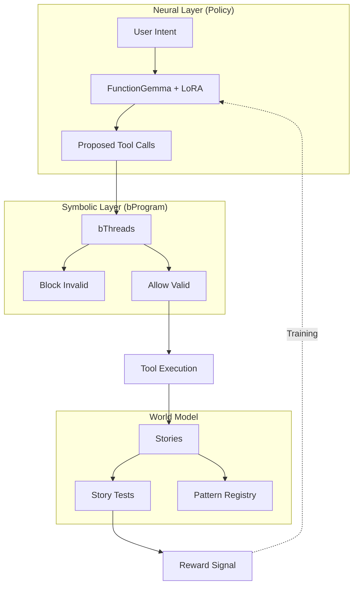

# World Agent

## Purpose

This skill provides guidance for training and deploying generative UI agents that use behavioral programming for coordination. The world agent generates templates by composing validated patterns, learning from story execution feedback.

**Use this when:**
- Training agents with GRPO on Google Colab
- Generating training trajectories from stories
- Computing rewards from story execution results
- Integrating with other agents via A2A protocol
- Indexing validated stories as reusable patterns
- Deploying models to HuggingFace Inference Endpoints
- Executing generated code in a sandboxed environment
- Filtering tools progressively based on user intent

## World Model Architecture

The name "world agent" reflects its alignment with **world model** concepts from reinforcement learning and cognitive science. The agent learns an internal representation of how UI generation works—not by memorizing templates, but by understanding the *dynamics* of template composition.

### Why "World Agent"?

| Concept | Implementation | Purpose |
|---------|----------------|---------|
| **World Model** | Stories + story tests | Defines valid UI states and transitions |
| **Policy** | FunctionGemma (270M) + LoRA | Proposes actions (tool calls) given intent |
| **Symbolic Constraints** | bThreads | Block invalid actions before execution |

The HuggingFace model at `plaited/plaited-world-agent-lora` is the **policy**—trained via SFT/DPO/GRPO to predict which tool calls satisfy user intents. Stories serve as the **world model**, providing ground truth for what constitutes valid, accessible UI. bThreads add **symbolic reasoning**, enforcing constraints that the neural policy might violate.

### Neuro-Symbolic Integration



**Key insight:** The neural policy learns *what* to generate, while bThreads enforce *how* to generate it correctly. Training improves the policy; bThreads provide runtime safety.

## Key Architectural Concept

**The agent IS a bProgram, not a class.**

Unlike HuggingFace tiny-agents which use async generator loops, Plaited's world agent uses `useBehavioral` where bThreads act as runtime constraints that block invalid generations BEFORE tool execution.

```typescript
import { useWorldAgent, createCoreTools } from 'plaited/agent'

const trigger = await useWorldAgent({
  tools: createCoreTools({ outputDir: './generated' }),
  model: inferenceClient
})

trigger({ type: 'generate', detail: { intent: 'Create a button' } })
```

## Quick Reference

| Task | Resource |
|------|----------|
| Training workflow | [training-workflow.md](references/training-workflow.md) |
| Tool API | [tool-api.md](references/tool-api.md) |
| Evaluation guide | [eval-guide.md](references/eval-guide.md) |
| **Styling templates** | [styling-guide.md](references/styling-guide.md) |
| **Design tokens** | [tokens-guide.md](references/tokens-guide.md) |
| **Scaffold training story** | `scripts/scaffold-training-story.ts` |
| Generate trajectories | `scripts/generate-trajectories.ts` |
| Compute rewards | `scripts/compute-rewards.ts` |
| Run evaluation | `scripts/run-eval-suite.ts` |
| Compare baseline | `scripts/compare-baseline.ts` |
| Generate report | `scripts/generate-report.ts` |

## Package Exports

```typescript
// Agent factory
import { useWorldAgent } from 'plaited/agent'

// Tool infrastructure
import { createToolRegistry, createCoreTools } from 'plaited/agent'

// Constraints
import {
  createEnforceTokenUsage,
  createEnforceAccessibility,
  registerBaseConstraints
} from 'plaited/agent'

// Training utilities
import {
  computeReward,
  createTrajectory,
  generateTrajectories,
  extractIntent,
  parseFunctionGemmaOutput  // Parse model output back to FunctionCall[]
} from 'plaited/agent'

// A2A Protocol
import {
  useA2AServer,
  createA2AClient,
  createAgentCard,
  discoverAgent
} from 'plaited/agent'

// Pattern Registry
import {
  createPatternRegistry,
  type Pattern,
  type PatternMatch
} from 'plaited/agent'

// Tool Discovery
import {
  createToolDiscovery,
  filterToolsByIntent,
  schemaToIndexedTool,
  extractKeywords,
  type ToolDiscovery,
  type IndexedTool,
  type ToolSource
} from 'plaited/agent'

// Code Sandbox
import {
  executeSandboxed,
  initializeSandbox,
  createCodeExecutor,
  validateCode,
  SandboxManager
} from 'plaited/agent'

// Skill Scripts
import {
  discoverSkills,
  discoverSkillScripts,
  loadSkillScripts,
  formatSkillsContext,
  scriptsToToolSchemas,
  type SkillMetadata,
  type SkillScript
} from 'plaited/agent'
```

## A2A Protocol Integration

### Present as A2A Agent

```typescript
import { useA2AServer, createAgentCard } from 'plaited/agent'

const card = createAgentCard({
  name: 'ui-generator',
  description: 'Generates UI templates from natural language',
  url: 'https://your-agent.example.com',
  skills: [
    { id: 'compose', name: 'Compose Template', description: 'Compose UI from patterns' }
  ]
})

const trigger = await useA2AServer({
  card,
  port: 3001,
  tools,
  model
})
```

### Consume A2A Agents

```typescript
import { discoverAgent, createTextMessage } from 'plaited/agent'

const { card, client } = await discoverAgent('https://other-agent.example.com')

const task = await client.sendMessage('Generate a data table with sorting')
```

## Pattern Registry

Index validated stories as reusable patterns for composition:

```typescript
import { createPatternRegistry } from 'plaited/agent'

const registry = createPatternRegistry()

// Index passing stories
registry.index(
  { exportName: 'PrimaryButton', filePath: 'button.stories.tsx' },
  { passed: true, a11yPassed: true, totalAssertions: 5, passedAssertions: 5, errors: [] }
)

// Search for patterns
const matches = registry.search('create button')
// Returns: [{ pattern: {...}, score: 0.8, matchReason: 'Matched: button' }]
```

## Tool Discovery

Progressive tool discovery reduces token costs by exposing only relevant tools based on user intent. Uses FTS5 for keyword search with optional sqlite-vec for semantic similarity.

### Basic Usage

```typescript
import { createToolDiscovery, schemaToIndexedTool, filterToolsByIntent } from 'plaited/agent'

// Create discovery registry (in-memory by default)
const discovery = createToolDiscovery()

// Index your tools
const tools = registry.schemas.map((schema) => schemaToIndexedTool(schema))
await discovery.indexBatch(tools)

// Filter tools based on user intent
const relevantSchemas = await filterToolsByIntent(discovery, 'write a template', registry.schemas)
// Returns only tools matching the intent, reducing context size
```

### With MCP/A2A Integration

Track tool provenance when dynamically adding remote tools:

```typescript
import { schemaToIndexedTool } from 'plaited/agent'

// Index local tools
await discovery.index(schemaToIndexedTool(localSchema, 'local'))

// Index MCP server tools
await discovery.index(schemaToIndexedTool(mcpSchema, 'mcp', 'https://mcp.example.com'))

// Index A2A agent tools
await discovery.index(schemaToIndexedTool(a2aSchema, 'a2a', 'https://agent.example.com'))

// Filter by source
const mcpOnly = discovery.bySource('mcp')
const results = await discovery.search('generate image', { source: 'a2a' })
```

### With Vector Search (Optional)

Enable semantic similarity search with sqlite-vec:

```typescript
import { createToolDiscovery } from 'plaited/agent'
import { InferenceClient } from '@huggingface/inference'

const hf = new InferenceClient(process.env.HF_TOKEN)

const discovery = createToolDiscovery({
  enableVectorSearch: true,
  vectorDimensions: 384,
  embedder: async (text) => {
    const result = await hf.featureExtraction({
      model: 'sentence-transformers/all-MiniLM-L6-v2',
      inputs: text
    })
    return new Float32Array(result as number[])
  }
})
```

### Search Options

```typescript
const results = await discovery.search('create button', {
  limit: 5,           // Max results (default: 5)
  minScore: 0.001,    // Score threshold (default: 0.001)
  source: 'local',    // Filter by source
  ftsWeight: 0.5,     // Keyword search weight (default: 0.5)
  vectorWeight: 0.5   // Semantic search weight (default: 0.5)
})
```

### Cleanup

```typescript
// Remove specific tool
discovery.remove('oldTool')

// Clear all tools from a source (e.g., when MCP server disconnects)
discovery.clearSource('mcp')

// Get statistics
const stats = discovery.stats()
// { totalTools: 15, localTools: 10, mcpTools: 3, a2aTools: 2, vectorSearchEnabled: false }

// Close database connection when done
discovery.close()
```

## Code Sandbox

Execute generated code in a sandboxed environment with OS-level isolation via `@anthropic-ai/sandbox-runtime`.

**Defense-in-depth:**
1. **Pattern validation** - Fast regex check blocks obvious unsafe patterns
2. **OS sandbox** - Kernel-level filesystem/network restrictions (bubblewrap/Seatbelt)

### Basic Usage

```typescript
import { executeSandboxed, createCoreTools } from 'plaited/agent'

const tools = createCoreTools({ outputDir: './generated' })

// Execute composable code instead of discrete tool calls
const result = await executeSandboxed(`
  const template = '<button class="btn">{props.label}</button>'
  await tools.writeTemplate({ path: 'button.tsx', content: template })
  return { created: 'button.tsx' }
`, { tools })

// Result includes tool calls made during execution
console.log(result.toolCalls) // [{ name: 'writeTemplate', args: {...}, result: {...} }]
```

### With Sandbox Configuration

```typescript
import { initializeSandbox, createCodeExecutor } from 'plaited/agent'

// Initialize OS-level sandbox once at startup
await initializeSandbox({
  allowWrite: ['./generated', '/tmp'],
  denyRead: ['~/.ssh', '~/.aws'],
  allowedDomains: []  // No network access
})

// Create reusable executor
const execute = createCodeExecutor(tools)

const result = await execute(`
  const files = ['button.tsx', 'input.tsx', 'form.tsx']
  for (const file of files) {
    await tools.writeTemplate({ path: file, content: '<div/>' })
  }
  return files.length
`)
```

### Constraint Integration

Block unsafe code via bThreads before execution:

```typescript
import { bThread, bSync } from 'plaited'
import { hasUnsafePatterns } from 'plaited/agent'

bThreads.set({
  validateCode: bThread([
    bSync({
      block: ({ type, detail }) =>
        type === 'executeCode' && hasUnsafePatterns(detail.code)
    })
  ], true)
})
```

## Intent Generation Workflow

Training data starts with **intents**—natural language descriptions of what a user wants. Your partner can generate 50-100+ diverse intents using this workflow:

### Scaffolding Training Stories

```bash
# Scaffold a story file with multiple intents
bun scripts/scaffold-training-story.ts button --category Button \
  --intents "primary with hover,secondary outline,disabled state,icon button,loading spinner"

# Output: button.stories.tsx with 5 story exports, each with intent field
```

### Intent Format

**Good intents** are specific, action-oriented, and user-focused:

| Good | Bad |
|------|-----|
| "Create a primary button with hover state" | "Make a button" |
| "Build a form input with error message" | "Use createStyles" |
| "Add a disabled state to prevent interaction" | "Gray button" |

### Story Structure for Training

Stories now use a **unified `intent` field** that serves both as test documentation and training data:

```typescript
export const PrimaryButton = story({
  template: () => <Button variant="primary">Click me</Button>,
  intent: 'Create a primary button with hover state',  // Unified field
  play: async ({ assert }) => {
    await assert.a11y()
  },
})
```

The `intent` field replaces the previous `description` field, eliminating duplication between test documentation and training data.

### Generating Trajectories

Once stories have intents, generate training data:

```bash
bun scripts/generate-trajectories.ts src/templates --output trajectories.jsonl
```

## Enhancing Neuro-Symbolic Logic

Users can enhance their agent's symbolic reasoning by adding custom **bThreads** that block invalid tool calls. This is the "symbolic" layer in neuro-symbolic AI.

### Common Constraint Patterns

```typescript
import { bThread, bSync } from 'plaited'

// Block templates without accessibility
const enforceA11y = bThread([
  bSync({
    block: ({ type, detail }) =>
      type === 'toolResult' &&
      detail.name === 'writeTemplate' &&
      !detail.result.data?.content?.includes('aria-')
  })
], true)

// Block styles without token usage
const enforceTokens = bThread([
  bSync({
    block: ({ type, detail }) =>
      type === 'toolResult' &&
      detail.name === 'writeStyles' &&
      !detail.result.data?.content?.includes('createTokens')
  })
], true)

// Require story test for every template
const requireStoryTest = bThread([
  bSync({ waitFor: ({ type, detail }) =>
    type === 'toolResult' && detail.name === 'writeTemplate'
  }),
  bSync({ request: { type: 'requireTest' } }),
  bSync({ waitFor: ({ type, detail }) =>
    type === 'toolResult' && detail.name === 'writeStory'
  })
], true)
```

### Registering Constraints

```typescript
import { useWorldAgent } from 'plaited/agent'

const trigger = await useWorldAgent({
  tools,
  model,
  // Custom bProgram extension
  bProgram({ bThreads }) {
    bThreads.set({
      enforceA11y,
      enforceTokens,
      requireStoryTest,
    })
  }
})
```

**Key insight:** bThreads block actions *before* execution. Unlike post-hoc validation, this prevents the model from ever producing invalid output—the policy learns from blocked attempts during training.

## Training Overview

### FunctionGemma Format

The agent uses FunctionGemma's native function calling format (NOT JSON):

```
<start_function_call>call:writeTemplate{path:<escape>button.tsx<escape>,content:<escape>export const Button = ....<escape>}<end_function_call>
```

**Formatting** happens automatically in trajectory generation. **Parsing** model responses:

```typescript
import { parseFunctionGemmaOutput } from 'plaited/agent'

const modelOutput = '<start_function_call>call:writeTemplate{path:<escape>button.tsx<escape>}<end_function_call>'
const calls = parseFunctionGemmaOutput(modelOutput)
// Returns: [{ name: 'writeTemplate', arguments: '{"path":"button.tsx"}' }]
```

### Phase 1: Generate Trajectories

Run existing stories to collect execution traces:

```bash
bun scripts/generate-trajectories.ts src/templates --output trajectories.jsonl
```

### Phase 2: Train on Colab

See [training-workflow.md](references/training-workflow.md) for complete Colab notebook.

```python
from unsloth import FastLanguageModel
from trl import GRPOConfig, GRPOTrainer

# Load FunctionGemma with Unsloth
model, tokenizer = FastLanguageModel.from_pretrained("google/gemma-function-calling")

# Train with GRPO
trainer = GRPOTrainer(model=model, config=grpo_config, train_dataset=trajectories)
trainer.train()

# Push to HuggingFace
model.push_to_hub("username/plaited-world-agent-lora")
```

### Phase 3: Deploy

Deploy to HuggingFace Inference Endpoints with vLLM, then connect:

```typescript
import { InferenceClient } from '@huggingface/inference'

const client = new InferenceClient(process.env.HF_TOKEN)
const trigger = await useWorldAgent({
  tools: createCoreTools({ outputDir: './generated' }),
  model: {
    chatCompletion: (args) => client.chatCompletion({
      ...args,
      model: 'username/plaited-world-agent',
      endpointUrl: 'https://xxx.endpoints.huggingface.cloud'
    })
  }
})
```

## Adding User Skills

The world agent can leverage user-defined skills via three mechanisms:

### 1. MCP Server Integration

Register skill scripts via MCP servers:

```typescript
import { createToolDiscovery, schemaToIndexedTool } from 'plaited/agent'

const discovery = createToolDiscovery()

// Connect to MCP server and index its tools
const mcpTools = await mcpClient.getTools()
for (const tool of mcpTools) {
  await discovery.index(schemaToIndexedTool(tool.schema, 'mcp', 'https://mcp-server.local'))
}

// Filter tools for an intent (only relevant tools sent to model)
const relevantTools = await filterToolsByIntent(discovery, intent, registry.schemas)
```

### 2. A2A Agent Delegation

Consume capabilities from other A2A agents:

```typescript
import { discoverAgent } from 'plaited/agent'

// Discover external agent
const { card, client } = await discoverAgent('https://design-system-agent.example.com')

// Index A2A agent tools for discovery
for (const skill of card.skills) {
  await discovery.index({
    name: skill.id,
    description: skill.description,
    keywords: extractKeywords(skill.description),
    source: 'a2a',
    sourceUrl: card.url,
    schema: convertSkillToSchema(skill)
  })
}

// Delegate tasks to external agent
const task = await client.sendMessage('Generate a button using carbon design tokens')
```

### 3. Pattern Registry

Index validated stories as composable patterns:

```typescript
import { createPatternRegistry } from 'plaited/agent'

const registry = createPatternRegistry()

// Index user's story as a reusable pattern
registry.index(
  { exportName: 'CarbonButton', filePath: 'carbon/button.stories.tsx' },
  { passed: true, a11yPassed: true, totalAssertions: 10, passedAssertions: 10, errors: [] }
)

// Search for patterns to compose
const matches = registry.search('create a form button')
```

### 4. Skill Scripts

Discover and execute scripts from AgentSkills skill directories:

```typescript
import {
  discoverSkills,
  discoverSkillScripts,
  loadSkillScripts,
  formatSkillsContext,
  scriptsToToolSchemas
} from 'plaited/agent'

// Discover skills and their scripts
const skills = await discoverSkills('.claude/skills')
const scripts = await discoverSkillScripts({ skillsRoot: '.claude/skills' })

// Register scripts as FunctionGemma tools
const registry = createToolRegistry()
await loadSkillScripts(registry, { skillsRoot: '.claude/skills' })

// Generate XML context for system prompt
const context = formatSkillsContext(scripts, skills)
// Returns: <available_skills><skill name="...">...</skill></available_skills>

// Convert to tool schemas for model
const schemas = scriptsToToolSchemas(scripts)
// Each schema has name like "skill-name:script-name"
```

**Script Discovery:**
- Scans `<skill>/scripts/` directories for `.ts`, `.js`, `.sh`, `.py` files
- Extracts description from JSDoc comments
- Extracts parameters from `parseArgs` usage
- Prefixes tool names with skill name: `my-skill:my-script`

**Execution:**
- Scripts run via `Bun.spawn()` with configurable timeout
- Arguments passed as CLI flags or positional args
- JSON output is parsed automatically

## Adding Custom Tools

```typescript
import { createToolRegistry } from 'plaited/agent'

const registry = createToolRegistry()

registry.register('customTool', async (args) => {
  // Tool implementation
  return { success: true, data: result }
}, {
  name: 'customTool',
  description: 'What this tool does',
  parameters: {
    type: 'object',
    properties: {
      input: { type: 'string', description: 'Input parameter' }
    },
    required: ['input']
  }
})
```

## Adding Custom Constraints

```typescript
import { bThread, bSync } from 'plaited'

// Create a constraint bThread
const enforceNamingConvention = bThread([
  bSync({
    block: (event) => {
      if (event.type !== 'toolResult') return false
      const { name, result } = event.detail
      if (name !== 'writeTemplate') return false
      // Block if filename doesn't match convention
      return !result.data?.path?.match(/^[a-z-]+\.tsx$/)
    }
  })
], true)

// Register with bThreads
bThreads.set({ enforceNamingConvention })
```

## Reward Computation

Default weights:
- Story pass/fail: 50%
- Accessibility: 30%
- Assertion ratio: 20%

```typescript
import { computeReward } from 'plaited/agent'

const reward = computeReward(storyResult, {
  storyWeight: 0.5,
  a11yWeight: 0.3,
  assertionWeight: 0.2
})
```

## Agent Evaluation

Compare trained World Agent against baseline (Claude Code one-shots with skills).

### Setup Evaluation

```bash
# Scaffold evaluation assets in your project
claude /create-world-agent-eval .claude/eval
```

This creates `config.json`, `templates/`, `prompts/`, and `baselines/` directories.

### Add Test Cases

Add story files with `meta.intent` to `templates/`:

```typescript
// templates/button.stories.tsx
export const meta = {
  title: 'Button/Primary',
  intent: 'Create a primary action button with hover state'
}

export const Default = story({
  template: PrimaryButton,
  play: async ({ assert }) => {
    await assert.a11y()
  }
})
```

### Run Evaluation

```bash
# Full evaluation (baseline + agent)
bun scripts/run-eval-suite.ts .claude/eval

# Compare results
bun scripts/compare-baseline.ts .claude/eval --format markdown

# Generate report
bun scripts/generate-report.ts .claude/eval
```

### Evaluation Metrics

| Category | Metrics |
|----------|---------|
| **Functional** | Story pass rate, a11y pass, type check |
| **Quality** | Iterations, tool calls, pattern match |
| **Trajectory** | Constraint violations, tool efficiency |

See [eval-guide.md](references/eval-guide.md) for complete documentation.

## Related Skills

- **plaited-behavioral-core** - bProgram patterns, bThread composition
- **plaited-ui-patterns** - Templates, stories, styling
- **workbench** - Story discovery and preview
- **plaited-standards** - Code conventions
