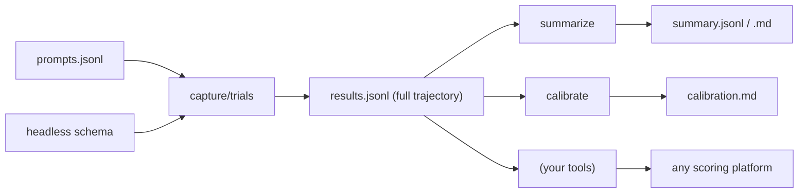
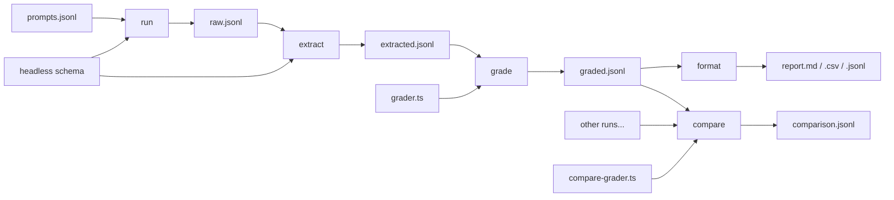

# Agent Eval Harness

## Purpose

CLI tool for capturing trajectories from headless CLI agents, optimized for TypeScript/JavaScript projects using Bun.

**The harness captures. You score.**

| Harness Provides | You Provide |
|------------------|-------------|
| Prompt execution via headless adapters | Scoring logic (Braintrust, custom scripts) |
| Full trajectory capture (thoughts, tools, plans) | Pass/fail determination via graders |
| Structured JSONL output | LLM-as-judge prompts |
| Reproducible execution environment | CI integration, golden file comparison |

**Use this when:**
- Capturing trajectories for downstream evaluation
- Generating training data (SFT/DPO) with full context
- Building regression test fixtures for agent behavior
- Comparing agent responses across configurations

## Installation

```bash
# Run without installing (recommended)
bunx @plaited/agent-eval-harness capture prompts.jsonl --schema ./claude.json -o results.jsonl

# Or install as project dependency
bun add @plaited/agent-eval-harness
```

## Core Principle: Capture Once, Derive Many Views



**Single output format:** Full trajectory JSONL (always)
**No `--format` flag:** Derive views with separate commands
**Schema exports:** Zod schemas + JSON Schema for any tooling

## Commands

### Core Commands

| Command | Input | Output | Purpose |
|---------|-------|--------|---------|
| `capture` | prompts.jsonl + schema | results.jsonl | Trajectory capture (full) |
| `trials` | prompts.jsonl + schema | trials.jsonl | Multi-run + optional metrics |
| `summarize` | results.jsonl | summary.jsonl or .md | Derive compact views |
| `calibrate` | results.jsonl | calibration.md | Sample failures for review |
| `validate-refs` | prompts.jsonl | validation.jsonl | Check reference solutions |
| `balance` | prompts.jsonl | balance.json | Analyze test set coverage |
| `schemas` | (none) | JSON Schema | Export schemas for non-TS users |

### Pipeline Commands (Unix-style)

| Command | Input | Output | Purpose |
|---------|-------|--------|---------|
| `run` | prompts.jsonl + schema | raw.jsonl | Execute prompts, raw output |
| `extract` | raw.jsonl + schema | extracted.jsonl | Parse trajectories |
| `grade` | extracted.jsonl + grader | graded.jsonl | Apply grader scoring |
| `format` | results.jsonl | jsonl/markdown/csv | Convert output format |
| `compare` | multiple results.jsonl | comparison.json | Compare runs (aggregate report) |

All commands support optional `--grader ./grader.ts` for scoring.

## Capture Command

### Basic Usage

```bash
bunx @plaited/agent-eval-harness capture <prompts.jsonl> --schema <schema.json> [options]
```

### Arguments

| Argument/Flag | Description | Default |
|------|-------------|---------|
| `prompts.jsonl` | Input file with prompts to execute | Required |
| `-s, --schema` | Path to headless adapter schema | Required |
| `-o, --output` | Output file/path | stdout |
| `-c, --cwd` | Working directory for agent | current |
| `-t, --timeout` | Request timeout in ms | `60000` |
| `--progress` | Show progress to stderr | false |
| `--append` | Append to output file | false |
| `-g, --grader` | Path to grader module | none |
| `--debug` | Show detailed CLI output for debugging | false |

### Examples

```bash
# Basic capture
bunx @plaited/agent-eval-harness capture prompts.jsonl --schema ./claude.json -o results.jsonl

# Using a local adapter script
bunx @plaited/agent-eval-harness capture prompts.jsonl bun ./my-adapter.ts -o results.jsonl

# With grader (adds score to each result)
bunx @plaited/agent-eval-harness capture prompts.jsonl --schema ./claude.json --grader ./grader.ts -o results.jsonl
```

## Trials Command

Run each prompt multiple times for pass@k/pass^k analysis.

```bash
# Capture only (no grader)
bunx @plaited/agent-eval-harness trials prompts.jsonl --schema ./claude.json -k 5 -o trials.jsonl

# With grader (computes pass@k, pass^k)
bunx @plaited/agent-eval-harness trials prompts.jsonl --schema ./claude.json -k 5 --grader ./grader.ts -o trials.jsonl
```

### Output

Without grader:
```jsonl
{"id":"search-001","input":"Find the CEO","k":5,"trials":[{"trialNum":1,"output":"...","trajectory":[...],"duration":1234},...]}
```

With grader:
```jsonl
{"id":"search-001","input":"Find the CEO","k":5,"passRate":0.8,"passAtK":0.99,"passExpK":0.33,"trials":[{"trialNum":1,"output":"...","pass":true,"score":1.0},...]}
```

## Summarize Command

Derive compact views from full trajectory results.

```bash
# Summary JSONL (for jq analysis)
bunx @plaited/agent-eval-harness summarize results.jsonl -o summary.jsonl

# Markdown (for LLM-as-judge)
bunx @plaited/agent-eval-harness summarize results.jsonl --markdown -o results.md
```

## Calibrate Command

Sample failures for grader review. Calibration helps you distinguish between **agent failures** (agent did wrong thing) and **grader bugs** (agent was correct, grader too strict).

```bash
# Sample failures for human review
bunx @plaited/agent-eval-harness calibrate results.jsonl --sample 10 -o calibration.md

# Re-score with different grader to compare
bunx @plaited/agent-eval-harness calibrate results.jsonl --grader ./loose-grader.ts --sample 10 -o comparison.md
```

See [eval-concepts.md](references/eval-concepts.md#grader-calibration) for why calibration matters.

## Validate-Refs Command

Check that reference solutions pass your grader before evaluating agents.

```bash
# Validate reference solutions
bunx @plaited/agent-eval-harness validate-refs prompts.jsonl --grader ./grader.ts -o validation.jsonl

# Check for failures
cat validation.jsonl | jq 'select(.pass == false)'
```

### Why Use This?

If your reference solution fails your own grader:
- The task definition is ambiguous
- The grader is too strict
- The hint is wrong

**Fix the eval before evaluating the agent.**

### Input Format

Prompts must include a `reference` field:

```jsonl
{"id":"test-001","input":"Create a button component","hint":"<button>","reference":"export const Button = () => <button>Click</button>"}
```

### Output Format

```jsonl
{"id":"test-001","input":"Create a button component","reference":"export const Button = () => <button>Click</button>","pass":true,"score":1.0,"reasoning":"Contains hint content"}
```

## Balance Command

Analyze test set coverage to ensure balanced evaluation.

```bash
# Analyze prompt distribution
bunx @plaited/agent-eval-harness balance prompts.jsonl -o balance.json

# Pretty print
bunx @plaited/agent-eval-harness balance prompts.jsonl | jq .
```

### Why Use This?

An eval with only "make X work" misses "don't break Y". Balance analysis shows:

- **Category distribution** (from `metadata.category`)
- **Positive/negative case ratio**
- **Coverage gaps**

### Output Format

```json
{
  "totalCases": 50,
  "categories": [
    { "name": "ui", "count": 20, "percentage": 40 },
    { "name": "logic", "count": 15, "percentage": 30 },
    { "name": "api", "count": 10, "percentage": 20 },
    { "name": "edge-case", "count": 5, "percentage": 10 }
  ],
  "underrepresented": ["edge-case"],
  "suggestions": ["Consider adding more test cases for: edge-case"]
}
```

### Balanced Eval Design

Include both positive and negative cases:

| Type | Example | Purpose |
|------|---------|---------|
| Positive | "Add a login button" | Agent should succeed |
| Negative | "Add a button without breaking tests" | Agent should not break things |
| Edge case | "Handle empty input gracefully" | Agent should be robust |

See [eval-concepts.md](references/eval-concepts.md#test-set-balance) for more on balanced test sets.

## Pipeline Workflow

The pipeline commands enable Unix-style composition for flexible evaluation workflows.

### Full Pipeline Example

```bash
# Execute → Extract → Grade → Format in one pipeline
cat prompts.jsonl | \
  bunx @plaited/agent-eval-harness run -s claude.json | \
  bunx @plaited/agent-eval-harness extract -s claude.json | \
  bunx @plaited/agent-eval-harness grade -g ./grader.ts | \
  bunx @plaited/agent-eval-harness format -f markdown > report.md
```

### Run Command

Execute prompts and output raw results. Three modes available:

```bash
# Schema mode (recommended)
bunx @plaited/agent-eval-harness run prompts.jsonl --schema claude.json

# Simple mode: {} placeholder substitution
bunx @plaited/agent-eval-harness run prompts.jsonl --simple "claude -p {} --output-format stream-json"

# Shell mode: $PROMPT environment variable
bunx @plaited/agent-eval-harness run prompts.jsonl --shell 'claude -p "$PROMPT" --output-format stream-json'
```

> **⚠️ Security Warning:** The `--simple` and `--shell` modes execute prompts via shell commands. Prompts are escaped but **do not use untrusted prompt content** with these modes. Malicious prompt text could potentially escape the quoting and execute arbitrary commands. Use `--schema` mode (headless adapter) for untrusted inputs.

### Extract Command

Parse raw output into structured trajectories:

```bash
# From file
bunx @plaited/agent-eval-harness extract raw.jsonl --schema claude.json -o extracted.jsonl

# Piped from run
bunx @plaited/agent-eval-harness run prompts.jsonl -s claude.json | \
  bunx @plaited/agent-eval-harness extract -s claude.json
```

### Grade Command

Apply grader to extracted results:

```bash
bunx @plaited/agent-eval-harness grade extracted.jsonl --grader ./grader.ts -o graded.jsonl
```

### Format Command

Convert results to different output formats:

```bash
# Markdown report
bunx @plaited/agent-eval-harness format results.jsonl --style markdown -o report.md

# CSV for spreadsheets
bunx @plaited/agent-eval-harness format results.jsonl --style csv -o results.csv

# JSONL (pass-through, default)
bunx @plaited/agent-eval-harness format results.jsonl --style jsonl
```

### Compare Command

Compare multiple runs of the same prompts and generate aggregate reports:

```bash
# Default: weighted strategy with JSON output
bunx @plaited/agent-eval-harness compare run1.jsonl run2.jsonl -o comparison.json

# Statistical significance strategy
bunx @plaited/agent-eval-harness compare run1.jsonl run2.jsonl --strategy statistical -o comparison.json

# Custom weights via environment variables
COMPARE_QUALITY=0.7 COMPARE_LATENCY=0.2 COMPARE_RELIABILITY=0.1 \
  bunx @plaited/agent-eval-harness compare run1.jsonl run2.jsonl -o comparison.json

# Markdown report format
bunx @plaited/agent-eval-harness compare run1.jsonl run2.jsonl --format markdown -o report.md

# Custom grader (LLM-as-Judge)
bunx @plaited/agent-eval-harness compare run1.jsonl run2.jsonl \
  --strategy custom --grader ./my-llm-judge.ts -o comparison.json

# With explicit labels
bunx @plaited/agent-eval-harness compare \
  --run "with-mcp:results-mcp.jsonl" \
  --run "vanilla:results-vanilla.jsonl" \
  -o comparison.json
```

**Use cases for compare:**
- Same agent, different MCP servers
- Same agent, different skills enabled
- Same agent, different model versions
- Different agents entirely

### Built-in Comparison Strategies

| Strategy | Description | When to Use |
|----------|-------------|-------------|
| `weighted` (default) | Configurable weights for quality, latency, reliability | Quick comparisons |
| `statistical` | Bootstrap sampling for confidence intervals | A/B testing with significance |
| `custom` | Your own LLM-as-Judge or logic-based grader | Semantic evaluation |

### Comparison Report Output

The compare command outputs a holistic `ComparisonReport` JSON:

```json
{
  "meta": { "generatedAt": "...", "runs": ["baseline", "variant"], "promptCount": 100 },
  "quality": { "baseline": { "avgScore": 0.85, "passRate": 0.82 }, "variant": { ... } },
  "performance": { "baseline": { "latency": { "p50": 1200, "p90": 3400 } }, ... },
  "reliability": { "baseline": { "toolErrors": 5, "completionRate": 0.99 }, ... },
  "headToHead": { "pairwise": [{ "runA": "baseline", "runB": "variant", "aWins": 35, "bWins": 55 }] }
}
```

See [comparison-graders.md](references/comparison-graders.md) for complete comparison grader documentation including LLM-as-Judge patterns.

### Comparison Grader Interface

```typescript
import type { ComparisonGrader } from '@plaited/agent-eval-harness/pipeline'

export const grade: ComparisonGrader = async ({ id, input, hint, runs }) => {
  // runs is Record<string, { output, trajectory?, score?, duration?, toolErrors? }>
  // Return rankings from best to worst
  return {
    rankings: [
      { run: 'with-mcp', rank: 1, score: 0.9 },
      { run: 'vanilla', rank: 2, score: 0.7 },
    ],
    reasoning: 'MCP run produced more accurate output'
  }
}
```

### Pipeline Workflow Diagram



## Schemas Command

Export JSON schemas for non-TypeScript tools.

```bash
# List available schemas
bunx @plaited/agent-eval-harness schemas

# Export all schemas as JSON
bunx @plaited/agent-eval-harness schemas --json -o schemas.json

# Export specific schema
bunx @plaited/agent-eval-harness schemas CaptureResult --json
bunx @plaited/agent-eval-harness schemas TrialResult --json
bunx @plaited/agent-eval-harness schemas GraderResult --json
```

### Available Schemas

| Schema | Description |
|--------|-------------|
| `CaptureResult` | Single capture output (id, input, output, trajectory, timing) |
| `TrialResult` | Multi-run trial output (includes passAtK, passExpK) |
| `GraderResult` | Grader return value (pass, score, reasoning) |
| `PromptInput` | Input prompt format |
| `TrajectoryStep` | Single step in trajectory array |
| `SummaryResult` | Compact summary format |

### Usage in Other Languages

Export schemas for validation in Python, Go, etc.:

```bash
# Export all schemas
bunx @plaited/agent-eval-harness schemas --json -o schemas.json

# Use in Python with jsonschema
python -c "
import json
from jsonschema import validate

with open('schemas.json') as f:
    schemas = json.load(f)

with open('results.jsonl') as f:
    for line in f:
        result = json.loads(line)
        validate(result, schemas['CaptureResult'])
        print(f'{result[\"id\"]}: valid')
"
```

## Grader Interface

Graders provide semantic pass/fail scoring for captured trajectories. The harness supports graders written in **any language**.

### Git-Based Grading (Recommended for Coding Tasks)

**Grade outcomes, not paths.** Use the optional `cwd` parameter to detect environmental changes with git:

```typescript
// git-grader.ts
import type { Grader } from '@plaited/agent-eval-harness/schemas'

export const grade: Grader = async ({ output, hint, cwd }) => {
  if (!cwd) return { pass: false, score: 0, reasoning: 'No cwd' }
  
  // Detect file changes
  const status = await Bun.$`git -C ${cwd} status --porcelain`.text()
  const filesCreated = status
    .split('\n')
    .filter(line => line.startsWith('??'))
    .map(line => line.slice(3).trim())
  
  // Verify tests pass
  const testResult = await Bun.$`cd ${cwd} && bun test`.nothrow()
  
  return {
    pass: filesCreated.length > 0 && testResult.exitCode === 0,
    score: testResult.exitCode === 0 ? 1 : 0,
    reasoning: `Files: ${filesCreated.join(', ')}. Tests: ${testResult.exitCode === 0 ? 'pass' : 'fail'}`,
    outcome: {  // Optional: structured data for analysis
      filesCreated,
      testsPassed: testResult.exitCode === 0,
      type: 'file_creation_with_tests'
    }
  }
}
```

See [inline-graders.md](references/inline-graders.md#git-based-outcome-grading) for comprehensive git-based grading patterns.

### Output-Based Grading (General Purpose)

```typescript
// my-grader.ts
import type { Grader } from '@plaited/agent-eval-harness/schemas'

export const grade: Grader = async ({ input, output, hint, trajectory }) => {
  const pass = output.toLowerCase().includes(hint?.toLowerCase() ?? '')
  return {
    pass,
    score: pass ? 1 : 0,
    reasoning: pass ? 'Contains hint content' : 'Missing hint content'
  }
}
```

**Note:** `input` can be `string` (single turn) or `string[]` (multi-turn). The `hint` field provides grader context (renamed from `expected`).

### Python/Executable Graders

Any executable can be a grader using stdin/stdout JSON protocol:

```python
#!/usr/bin/env python3
import json, sys

data = json.load(sys.stdin)
output = data.get("output", "").lower()
hint = (data.get("hint") or "").lower()

pass_result = hint in output if hint else True
print(json.dumps({
    "pass": pass_result,
    "score": 1.0 if pass_result else 0.0,
    "reasoning": "Contains hint" if pass_result else "Missing hint"
}))
```

```bash
chmod +x ./grader.py
bunx @plaited/agent-eval-harness capture prompts.jsonl --schema ./claude.json --grader ./grader.py -o results.jsonl
```

See [inline-graders.md](references/inline-graders.md) for complete grader documentation including LLM-as-Judge patterns.

## Input Format

Each line in `prompts.jsonl`:

```jsonl
{"id":"test-001","input":"Create a button","hint":"should contain <button>"}
{"id":"test-002","input":["Create a button","Make it blue"],"metadata":{"category":"ui"}}
```

| Field | Required | Description |
|-------|----------|-------------|
| `id` | Yes | Unique identifier |
| `input` | Yes | Single prompt (string) or conversation turns (string[]) |
| `hint` | No | Grader context - what to look for (not strict match) |
| `reference` | No | Reference solution (for validate-refs) |
| `metadata` | No | Tags, category, difficulty for filtering |
| `timeout` | No | Override default timeout for this prompt |

**Session behavior:** Each JSONL entry = 1 fresh session
- `input: string` → 1 session, 1 prompt
- `input: string[]` → 1 session, N prompts (sequential turns)

## Output Format

Full trajectory JSONL (always):

```jsonl
{
  "id": "test-001",
  "input": "Find the CEO of Anthropic",
  "output": "The CEO of Anthropic is Dario Amodei.",
  "hint": "should mention Dario Amodei",
  "trajectory": [
    {"type": "thought", "content": "I'll search for this...", "timestamp": 100},
    {"type": "tool_call", "name": "WebSearch", "status": "completed", "input": {...}, "output": {...}, "duration": 500},
    {"type": "message", "content": "The CEO of Anthropic is Dario Amodei.", "timestamp": 700}
  ],
  "metadata": {
    "category": "search",
    "agent": "--schema ./claude.json",
    "trajectoryRichness": "full",
    "turnCount": 1
  },
  "timing": {
    "start": 1704067200000,
    "end": 1704067201234,
    "firstResponse": 100,
    "sessionCreation": 234,
    "total": 1234,
    "inputTokens": 150,
    "outputTokens": 85
  },
  "toolErrors": false
}
```

### Output Fields

| Field | Description |
|-------|-------------|
| `input` | Original prompt (string or string[] for multi-turn) |
| `hint` | Grader context hint (if provided) |
| `metadata.trajectoryRichness` | `"full"` \| `"messages-only"` \| `"minimal"` |
| `metadata.turnCount` | Number of conversation turns (1 for string, N for array) |
| `timing.sessionCreation` | Time to create session (ms) |
| `timing.total` | Total duration (end - start) |
| `timing.inputTokens` | Input tokens consumed (if available from adapter) |
| `timing.outputTokens` | Output tokens generated (if available from adapter) |
| `toolErrors` | Whether any tool calls failed |

**Note:** `toolErrors` replaces misleading `status: 'passed'|'failed'`. Real pass/fail comes from YOUR grader.

## Schema Exports

Consumers can import Zod schemas directly:

```typescript
import { CaptureResultSchema, TrialResultSchema } from '@plaited/agent-eval-harness/schemas'

// Validate external data
const result = CaptureResultSchema.parse(jsonData)

// Generate JSON Schema (Zod 4 native)
import { z } from 'zod'
const jsonSchema = z.toJSONSchema(CaptureResultSchema)
```

Or export JSON schemas for non-TypeScript tools:

```bash
bunx @plaited/agent-eval-harness schemas --json -o schemas.json
bunx @plaited/agent-eval-harness schemas CaptureResult --json
```

## Execution Environment

**Recommendation:** Run the harness in Docker containers for consistent, isolated execution.

```bash
# Run integration tests via Docker
docker compose -f docker-compose.test.yml run --rm test

# Or with explicit API keys
ANTHROPIC_API_KEY=sk-... GEMINI_API_KEY=... docker compose -f docker-compose.test.yml run --rm test
```

### Docker Requirements

| Requirement | Reason |
|-------------|--------|
| **Node.js 24+** | Gemini CLI uses modern JS features (optional chaining) |
| **Non-root user** | Claude CLI blocks `--dangerously-skip-permissions` as root |
| **Gemini API key** | Pass `GEMINI_API_KEY` for Gemini CLI |

See [docker-evals.md](references/docker-evals.md) for complete Docker setup guide, debugging tips, and CI integration patterns.

### Multi-turn Conversations

Use `input: string[]` to execute multi-turn conversations within a single session:

```jsonl
{"id":"context-001","input":["Remember this number: 42","What number did I ask you to remember?"],"hint":"42"}
{"id":"context-002","input":["My name is Alice","What is my name?"],"hint":"Alice"}
```

Run with the headless adapter:

```bash
# Using Claude Code via headless adapter
bunx @plaited/agent-eval-harness capture multi-turn.jsonl \
  bunx @plaited/agent-eval-harness headless --schema ./claude-headless.json \
  -o results.jsonl

# Using Gemini CLI via headless adapter
GEMINI_API_KEY=... bunx @plaited/agent-eval-harness capture multi-turn.jsonl \
  bunx @plaited/agent-eval-harness headless --schema ./gemini-headless.json \
  -o results.jsonl
```

**Key points:**
- Each JSONL entry = 1 fresh session
- `input: string[]` sends sequential turns to the **same session**
- Works with both `stream` mode (Claude) and `iterative` mode (Gemini)
- The adapter handles context preservation automatically

## Downstream Integration

The harness outputs standard JSONL that pipes to any tool:

```bash
# Filter with jq
cat results.jsonl | jq 'select(.metadata.category == "ui")'

# Count tool usage
cat results.jsonl | jq -s 'map(.trajectory | map(select(.type == "tool_call")) | length) | add'

# Summarize for quick analysis
bunx @plaited/agent-eval-harness summarize results.jsonl -o summary.jsonl

# Compare runs with built-in strategies
bunx @plaited/agent-eval-harness compare run1.jsonl run2.jsonl -o comparison.json
```

## Quick Reference

| Resource | Description |
|----------|-------------|
| `bunx @plaited/agent-eval-harness` | CLI help |
| [output-formats.md](references/output-formats.md) | JSONL schemas, command details |
| [inline-graders.md](references/inline-graders.md) | Single input/output graders (TypeScript, Python, shell) |
| [comparison-graders.md](references/comparison-graders.md) | Comparison strategies (weighted, statistical, LLM-as-Judge) |
| [calibration.md](references/calibration.md) | Grader calibration workflow |
| [eval-concepts.md](references/eval-concepts.md) | Evaluation concepts (pass@k, pass^k) |
| [docker-evals.md](references/docker-evals.md) | Docker setup, debugging, CI integration |

## Related

- **[headless-adapters skill](../headless-adapters/SKILL.md)** - Schema-driven adapters for headless CLI agents
