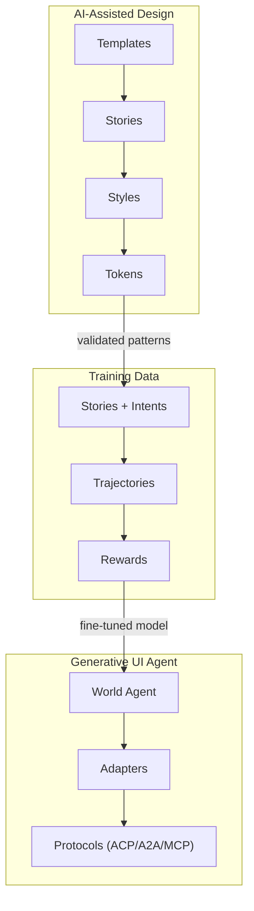
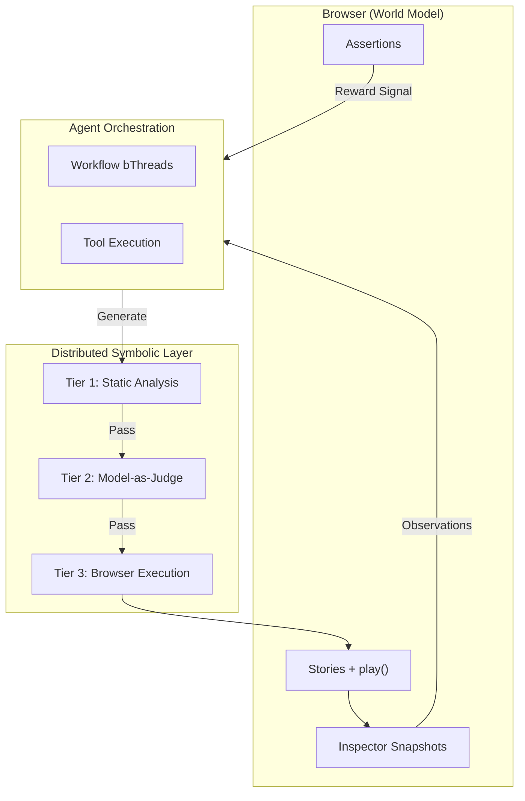
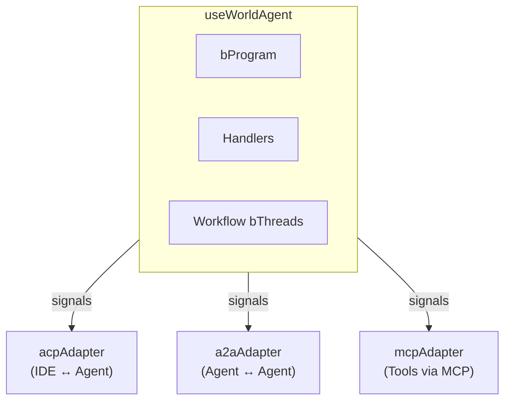

# Loom

*Where threads weave together to create fabric*

## Purpose

Loom is the unified skill for building with Plaited - spanning the full spectrum from AI-assisted design to autonomous generative UI agents. The name reflects Plaited's weaving metaphor: behavioral programs are threads, templates are patterns, and orchestration is weaving.

**Use this when:**
- Creating behavioral element templates and stories
- Designing styles and token systems
- Building custom adapters for world agents
- Orchestrating agent and adapter communication
- Training generative UI agents from validated designs

## The Design-to-Agent Pipeline



## Quick Reference

| Concept | Metaphor | Description |
|---------|----------|-------------|
| **Threads** | Strands | Behavioral programs, signals |
| **Patterns** | Designs | Templates, stories, styles, tokens |
| **Weaving** | Integration | Orchestrator, adapters, protocols |
| **Fabric** | Output | Generative UI, trained agents |

## Core Patterns

### Patterns (AI-Assisted Design)

- [templates.md](references/patterns/templates.md) - Behavioral element templates
- [stories.md](references/patterns/stories.md) - Story-driven testing with intents
- [styles.md](references/patterns/styles.md) - createStyles and CSS-in-JS
- [tokens.md](references/patterns/tokens.md) - Design token systems

### Structural Vocabulary (Structural IA)

Provider-agnostic vocabulary for describing UI structures. Use when extracting patterns, generating training data, or analyzing template composition.

| Concept | Description | Reference |
|---------|-------------|-----------|
| **Objects** | What is conceived as "one" | [objects.md](references/structural/objects.md) |
| **Channels** | Type contracts for information flow | [channels.md](references/structural/channels.md) |
| **Levers** | Tools that shape user energy | [levers.md](references/structural/levers.md) |
| **Loops** | Action → Response cycles | [loops.md](references/structural/loops.md) |
| **Blocks** | Emergent compositional patterns | [blocks.md](references/structural/blocks.md) |

**Query structural vocabulary:**
```bash
bun ./scripts/query-structural.ts              # All topics
bun ./scripts/query-structural.ts channels     # Single topic
bun ./scripts/query-structural.ts channels levers loops  # Multiple topics
```

### Weaving (Agent Architecture)

- [tool-layer.md](references/weaving/tool-layer.md) - Discovery, caching, and relations
- [custom-adapters.md](references/weaving/custom-adapters.md) - Building protocol adapters
- [orchestrator.md](references/weaving/orchestrator.md) - Wiring agents and adapters via signals
- [world-agent.md](references/weaving/world-agent.md) - The useWorldAgent core interface

### Training

- [training-workflow.md](references/training/training-workflow.md) - Complete Colab training guide
- [trajectories.md](references/training/trajectories.md) - Generating training data from stories
- [rewards.md](references/training/rewards.md) - Reward computation from story results
- [tool-api.md](references/training/tool-api.md) - Tool registry and schema API
- [eval-guide.md](references/training/eval-guide.md) - Evaluation metrics and comparison

**Training Scripts:**

| Script | Purpose |
|--------|---------|
| `scaffold-training-story.ts` | Generate story files with intents |
| `generate-trajectories.ts` | Create training JSONL from stories |
| `compute-rewards.ts` | Calculate rewards from story results |
| `run-eval-suite.ts` | Run full evaluation suite |
| `compare-baseline.ts` | Compare agent vs baseline |
| `generate-report.ts` | Generate evaluation report |

**Quick Start:**
```bash
# Scaffold training stories
bun scripts/scaffold-training-story.ts button --category Button \
  --intents "primary,secondary,disabled"

# Generate trajectories
bun scripts/generate-trajectories.ts training/stories -o trajectories.jsonl
```

### Workbench (Discovery & Preview)

Template discovery, preview server, and design iteration modes.

| Capability | Command/Script | Use Case |
|------------|----------------|----------|
| Discover stories | `query-stories.ts` | Find all `*.stories.tsx` files |
| Discover templates | `query-templates.ts` | Find all bElement exports |
| Generate URLs | `query-story-url.ts` | Get preview URL for a story |
| Batch analysis | `query-analyze.ts` | Combined discovery + URLs |
| Dev server | `bun --hot plaited dev` | Hot reload preview |

**Design Iteration Modes:**

- [mode-selection.md](references/workbench/mode-selection.md) - Visual feedback modes
- [test-video-mode.md](references/workbench/test-video-mode.md) - CLI with `--record-video`

**Quick Start:**
```bash
# Discover stories
bun scripts/query-stories.ts src/main

# Start dev server with hot reload
bun --hot plaited dev src/main

# Run tests with video recording
bun plaited test src/templates --record-video ./videos
```

## Architecture Overview

### Browser as World Model



### Deployment Architecture



**Key principles:**
1. **Browser IS the world** - Stories execute in browser; play() validates exploration
2. **Tiered symbolic analysis** - Static (free) → Model-judge (selective) → Browser (ground truth)
3. **Agent bThreads for orchestration** - Workflow sequencing, NOT content validation
4. **Extensible by design** - Custom handlers and bThreads can override defaults
5. **Training separate from deployment** - Colab notebook trains; adapters deploy

## Related Skills

- **plaited-behavioral-core** - Behavioral programming fundamentals (bProgram, bThread, bSync)
- **plaited-ui-patterns** - Template and styling patterns (bElement, createStyles)
- **plaited-standards** - Code conventions and development standards
- **typescript-lsp** - Type verification and code navigation
