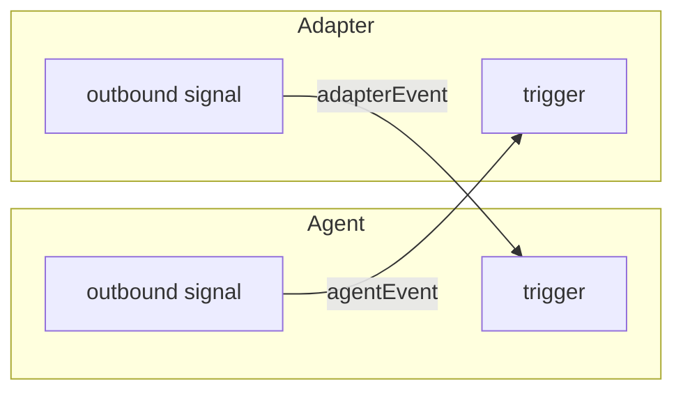
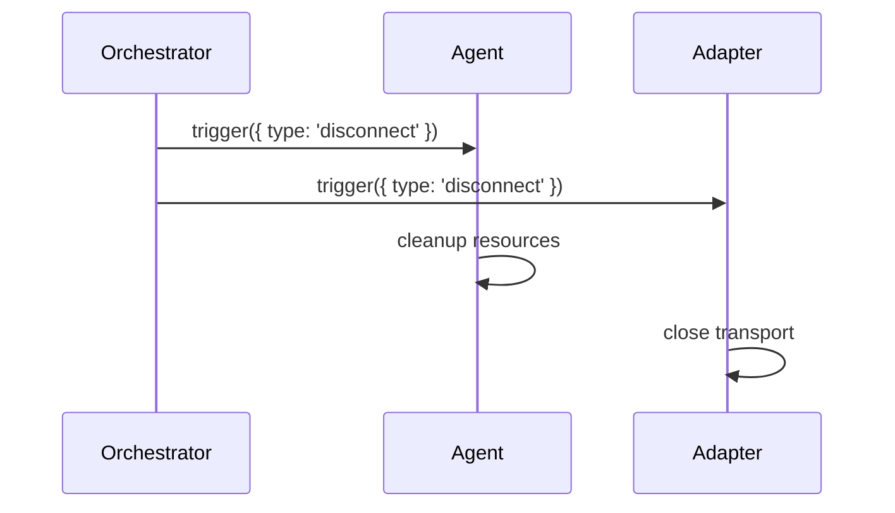

# Orchestrator

> Wiring agents and adapters via signals

## Overview

The orchestrator connects a world agent to its protocol adapter using bidirectional signals. This enables protocol-agnostic communication where the agent focuses on generation logic while adapters handle transport concerns.

```typescript
import { useOrchestrator } from 'plaited/agent'

const result = await useOrchestrator({
  agent: {
    factory: worldAgentFactory,
    context: { tools, model },
  },
  adapter: {
    factory: acpAdapterFactory,
    context: { serverConfig },
  },
})

// Later: clean shutdown
result.disconnect()
```

## Signal Wiring

The orchestrator creates two signals and wires them bidirectionally:

1. **Agent outbound** - Agent events flow to adapter trigger
2. **Adapter outbound** - Adapter events flow to agent trigger



### How It Works

```typescript
// Inside useOrchestrator:

// 1. Create bidirectional signals
const agentOut = useSignal<unknown>()
const adapterOut = useSignal<unknown>()

// 2. Create agent with its outbound signal
const agentTrigger = await agent.factory({
  ...agent.context,
  outbound: agentOut,
})

// 3. Create adapter with its outbound signal
const adapterTrigger = await adapter.factory({
  ...adapter.context,
  outbound: adapterOut,
})

// 4. Wire signals to triggers
agentOut.listen('agentEvent', adapterTrigger)
adapterOut.listen('adapterEvent', agentTrigger)
```

## Lifecycle Management

The orchestrator returns a `disconnect` function that cleanly shuts down both agent and adapter:

```typescript
const { disconnect } = await useOrchestrator({
  agent: { factory: agentFactory, context: {} },
  adapter: { factory: adapterFactory, context: {} },
})

// Clean shutdown - triggers disconnect on both
disconnect()
```

Both agent and adapter must expose `disconnect` as a public event. When called:

1. Agent receives `{ type: 'disconnect' }` and cleans up
2. Adapter receives `{ type: 'disconnect' }` and closes transport

### Disconnect Flow



## Usage Pattern

### Agent Side

The agent emits events through its `outbound` signal:

```typescript
const worldAgent = useBehavioral<WorldAgentEvents, WorldAgentContext>({
  publicEvents: ['generate', 'cancel', 'feedback', 'disconnect'],

  bProgram({ outbound, disconnect }) {
    return {
      generate({ intent }) {
        // Emit thought to adapter
        outbound.set({ kind: 'thought', content: `Processing: ${intent}` })

        // ... execute tools ...

        // Emit result to adapter
        outbound.set({ kind: 'response', content: result })
      },
      disconnect() {
        disconnect()
      },
    }
  },
})
```

### Adapter Side

The adapter receives agent events via its `agentEvent` handler and emits via `outbound`:

```typescript
const acpAdapter = useBehavioral<AdapterEvents, AdapterContext>({
  publicEvents: ['agentEvent', 'disconnect'],

  bProgram({ outbound, disconnect }) {
    return {
      agentEvent(event) {
        // Forward agent event to transport (stdio, HTTP, etc.)
        transport.send(event)
      },
      disconnect() {
        transport.close()
        disconnect()
      },
    }
  },
})
```

## Key Principles

1. **Protocol-agnostic agent** - World agent knows nothing about transport
2. **Signal-based coupling** - No direct dependencies between agent and adapter
3. **Coordinated lifecycle** - Single disconnect cleans up everything
4. **Extensible** - Swap adapters without changing agent code
