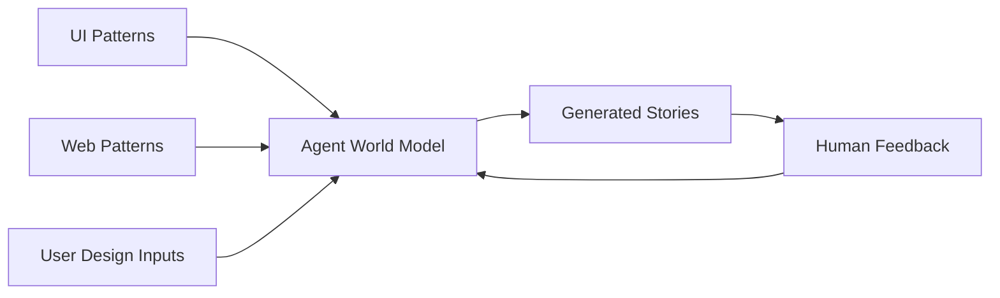
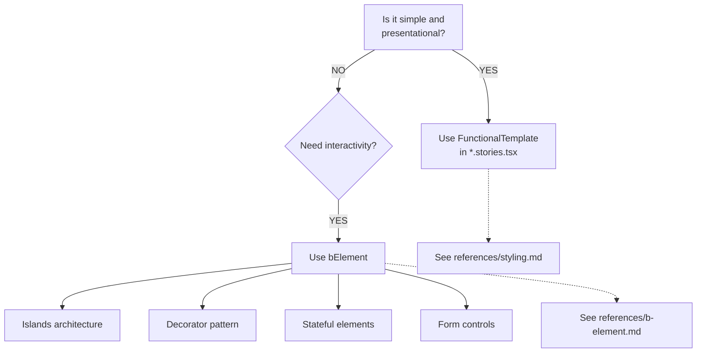
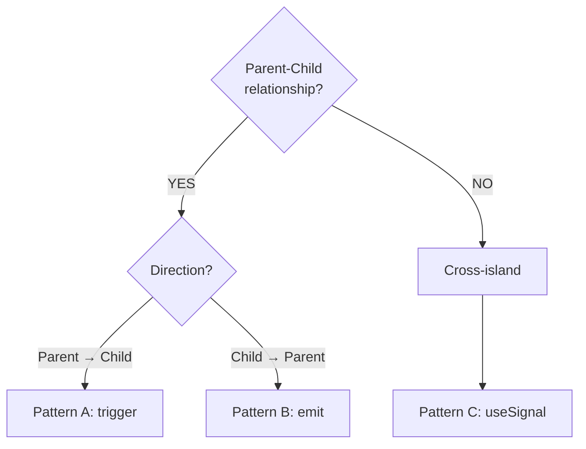

# Plaited UI Patterns

## Purpose

This skill provides **training data** for the Plaited agent—patterns that establish the agent's understanding of UI architecture, styling systems, and element coordination. These patterns inform code generation for user interfaces.

**Use this when:**
- Creating templates with bElement or FunctionalTemplate
- Building form-associated custom elements
- Coordinating cross-island communication
- Styling elements with CSS-in-JS (createStyles, createHostStyles)
- Writing stories for testing (`.stories.tsx`)
- Offloading computation to web workers

**For core BP patterns** (event selection, rule composition, useBehavioral), see **behavioral-core** skill.

## Training Philosophy

### Patterns Are Training Data

All patterns in this skill train the Plaited agent's world model. They are NOT:
- Reusable templates to import directly
- Published packages
- Shared across projects

They ARE:
- Knowledge for the agent to learn from
- Self-contained examples demonstrating best practices
- Training material that improves generation quality

### Training Pipeline



**User Design Inputs include:**
- Color palettes and brand colors
- Type scales (font sizes, weights, line heights)
- Spacing scales
- Border radii, shadows
- Existing design tokens

The agent uses `createTokens`, `createStyles`, `createHostStyles`, `createKeyframes`, and `joinStyles` to translate these inputs into the Plaited styling system.

### Human-on-the-Loop

The agent generates patterns, but humans provide feedback and can edit:

1. **Agent generates** → Stories with bElements, styles, tokens
2. **Human reviews** → Runs stories, checks visual output
3. **Human provides feedback** → "Make the button larger", "Use different colors"
4. **Agent adjusts** → Regenerates based on feedback
5. **Human can edit** → Developers can modify generated code directly

This is a **collaborative** workflow, not fully autonomous.

## Quick Reference

**Terminology**: Plaited uses **templates** for user interfaces. Use "template" not "component". Refer to browser APIs by specific names (Custom Elements, Shadow DOM) not "Web Components".

**Testing**: UI templates are tested with stories (`.stories.tsx`) using browser automation via the workshop CLI.

**TypeScript LSP**: Use the `typescript-lsp@plaited_development-skills` skill for type inference from `plaited` package imports.

## CSS-in-JS API

**createStyles** returns objects with `classNames: string[]` and `stylesheets: string[]`:

```typescript
// button.css.ts
import { createStyles } from 'plaited'

export const styles = createStyles({
  button: {
    padding: '0.5rem 1rem',
    borderRadius: '4px',
  },
})

// Usage in JSX - spread syntax
<button {...styles.button}>Click me</button>
```

## Pattern Categories

### Templates & Styling

**[styling.md](references/styling.md)** - Templates (JSX, FT, useTemplate, SSR) + CSS-in-JS

Use for:
- JSX syntax and template security
- FunctionalTemplate pattern
- Atomic CSS with createStyles
- Host styling with createHostStyles
- Design tokens with createTokens
- Keyframes animation with createKeyframes
- Style composition with joinStyles

### Behavioral Elements

**[b-element.md](references/b-element.md)** - Creating custom elements with bElement

Use for:
- Islands architecture
- Decorator pattern (wrapping native elements)
- Stateful elements
- Form controls

**When to use bElement:**
- Interactive islands requiring state
- Wrapping hard-to-style native elements
- Complex behavioral coordination
- Form integration with ElementInternals

### Form Integration

**[form-associated-elements.md](references/form-associated-elements.md)** - Capturing user intent through forms

Use for:
- Custom form controls with ElementInternals API
- Custom states (`:state()`) for styling
- Form validation
- Type-driven form generation

### Cross-Island Communication

**[cross-island-communication.md](references/cross-island-communication.md)** - Three communication patterns

| Pattern | Direction | API | Use Case |
|---------|-----------|-----|----------|
| A | Parent → Child | `trigger()` | Direct method call |
| B | Child → Parent | `emit()` | Event bubbling |
| C | Cross-island | `useSignal()` | Pub/sub actor pattern |

### Testing

**[stories.md](references/stories.md)** - Story-based testing with browser automation

Use for:
- Writing stories for templates and bElements
- Workshop CLI usage (`bun plaited test`, `bun --hot plaited dev`)
- Accessibility testing
- Inspector debugging

Workshop commands:
```bash
bun run test:stories src/main  # Run story tests
bun --hot plaited dev          # Dev server with hot reload
```

### Performance

**[web-workers.md](references/web-workers.md)** - Offloading computation to background threads

Use for:
- CPU-intensive calculations
- Data processing
- Complex algorithms

APIs:
- `useWorker()` - Main thread interface
- `bWorker()` - Worker thread behavioral program

## Decision Trees

### When to Use Which Pattern?

**Creating UI Elements:**


**Communication Between Elements:**


## File Organization

### Pattern File Structure

Each pattern follows this structure:

```
pattern/
  accordion.css.ts        # Styles (createStyles) - ALWAYS separate
  accordion.tokens.ts     # Design tokens (optional)
  accordion.stories.tsx   # bElement/FT + stories (imports from css.ts)
```

**Key principles:**
1. **Styles in `*.css.ts`** - createStyles always in separate file
2. **bElement or FunctionalTemplate is local** - Defined in stories, NOT exported
3. **Stories ARE exported** - Required for testing and training
4. **Tokens in `*.tokens.ts`** - Design system values when needed

### For Generated Applications

When the agent generates code for an actual application, file structure is determined collaboratively between the agent and developer based on project needs.

### Naming Conventions
- **bElement-specific styles**: Export as `styles` and `hostStyles`
- **Reusable pattern styles**: Export with descriptive names (e.g., `buttonStyles`)
- **Token files**: Use `*.tokens.ts` extension

## Story API

Every story **requires an `intent` property** describing what it demonstrates:

```typescript
// Interaction story (with play function)
export const defaultButton = story({
  intent: 'Demonstrates button click handling',
  template: () => <Button>Click me</Button>,
  play: async ({ findByAttribute, assert, fireEvent }) => {
    const button = await findByAttribute('p-target', 'button')
    if (button) await fireEvent(button, 'click')
    // assertions...
  },
})

// Snapshot story (no play function)
export const disabledButton = story({
  intent: 'Shows disabled button appearance',
  template: () => <Button disabled>Disabled</Button>,
})
```

## Best Practices

### Templates Are Static

```typescript
// Templates render once, use attributes for updates
const btn = $('btn')[0]
btn?.attr('data-variant', 'primary')  // Change via attributes
```

### Token Usage

```typescript
// Pass token references directly, don't invoke
backgroundColor: tokens.primary    // Correct
backgroundColor: tokens.primary()  // Wrong
```

### Communication Hierarchy

```typescript
// Parent-child: Use trigger/emit
parent.trigger({ type: 'event' })
child.emit({ type: 'event', bubbles: true, composed: true })

// Cross-island: Use useSignal
const signal = useSignal<Data>()
signal.set(data)
signal.listen('evt', trigger)
```

## Examples

Complete working examples in `assets/`:

| Example | Pattern | Key Concepts |
|---------|---------|--------------|
| [DecoratedCheckbox](assets/decorator-pattern/) | Decorator | Wrapping native elements, attribute observation |
| [InputAddon](assets/slot-styling/) | Slot styling | `::slotted()` CSS, light DOM styling |
| [ToggleInput](assets/form-associated/) | Form-associated | ElementInternals, custom states |
| [Popover](assets/stateful-elements/) | Stateful | Native popover API, emit() |
| [Tic-Tac-Toe](assets/bp-coordination/) | BP coordination | Complex thread interaction |

## Code Standards

For code conventions, standards, and verification workflow, see the **standards** skill:
- `code-conventions.md` - Type system, function style, imports
- `standards.md` - 95% confidence threshold, documentation, Bun APIs
- `verification-workflow.md` - Code generation workflow

## Related Skills

- **standards** - Code conventions, development standards, verification workflow
- **behavioral-core** - Core BP patterns (foundation)
- **web-patterns** - Web API patterns for bElement architecture
- **typescript-lsp@plaited_development-skills** - Type verification and symbol discovery
