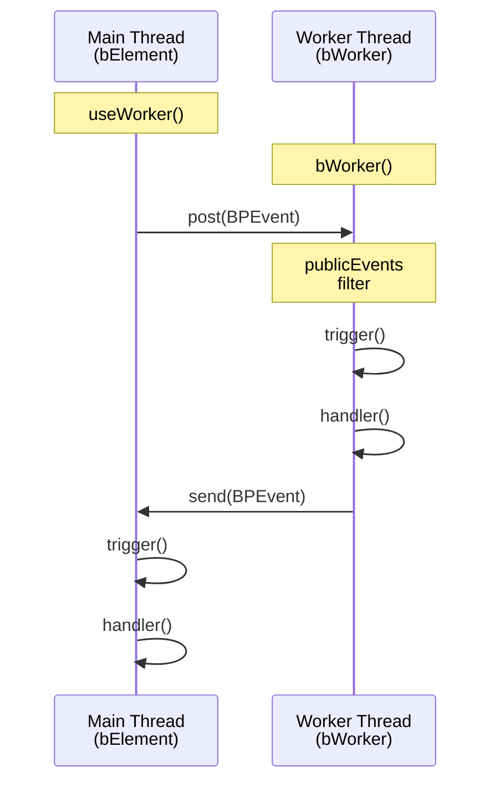

# Web Workers: Offloading Computation

Web Workers enable offloading heavy computation from interactive islands to background threads. Plaited provides `useWorker()` (main thread) and `bWorker()` (worker thread) for type-safe worker integration with behavioral programming.

**For bElement basics**, see `b-element.md`
**For BP foundations**, see `behavioral-programs.md`
**For cross-island communication**, see `cross-island-communication.md`


```typescript
import { useWorker } from 'plaited'
import { bElement } from 'plaited/ui'

const CalculatorElement = bElement({
  tag: 'calculator-element',
  publicEvents: ['calculate', 'update'],
  shadowDom: (
    <>
      <input type="number" p-target="a" />
      <input type="number" p-target="b" />
      <button p-trigger={{ click: 'calculate' }}>Calculate</button>
      <div p-target="result"></div>
    </>
  ),
  bProgram({ $, trigger }) {
    // Create worker instance
    const worker = new Worker(new URL('./calculator.worker.ts', import.meta.url), {
      type: 'module'
    })

    // Connect worker to behavioral program
    const post = useWorker(trigger, worker)

    return {
      calculate() {
        const a = Number($<HTMLInputElement>('a')[0]?.attr('value'))
        const b = Number($<HTMLInputElement>('b')[0]?.attr('value'))

        // Send message to worker
        post({
          type: 'calculate',
          detail: { a, b, operation: 'add' }
        })
      },

      update(result) {
        // Handle worker response
        const display = $('result')[0]
        display?.render(`Result: ${result}`)
      }
    }
  }
})
```

### API Reference

```typescript
type UseWorker = (
  trigger: PlaitedTrigger | Trigger,
  worker: Worker
) => Post

type Post = {
  (event: BPEvent): void
  disconnect(): void
}
```

**Parameters**:
- `trigger`: Event trigger function for handling worker responses
- `worker`: Web Worker instance to communicate with

**Returns**: Enhanced postMessage function with:
- `post(event)`: Send BPEvent to worker
- `post.disconnect()`: Terminate worker and cleanup

### Automatic Cleanup

When using `PlaitedTrigger` (from `bProgram`), cleanup is automatic:

```typescript
bProgram({ trigger }) {
  const worker = new Worker(/* ... */)

  return {
    processData({ data }) {
      post({ type: 'process', detail: data })
    }
  }
}
```

### Manual Cleanup

**NOT needed** when using `PlaitedTrigger` (default from `bProgram`) - worker auto-terminates on disconnect.

```typescript
bProgram({ trigger }) {
  const worker = new Worker(/* ... */)
  const post = useWorker(trigger, worker)

  return {
    timeout() {
      // ✅ Early termination - valid use case
      post.disconnect()
    }

    // ❌ NOT needed - PlaitedTrigger auto-cleans
    // onDisconnected() {
    //   post.disconnect()
    // }
  }
}
```

### Message Validation

Only `BPEvent`-conforming messages are processed:

```typescript
type BPEvent = {
  type: string
  detail?: unknown
}

// ✅ Valid messages
post({ type: 'calculate' })
post({ type: 'process', detail: { data: [1, 2, 3] } })

// ❌ Invalid (runtime validation via isBPEvent)
worker.postMessage('string')  // Not a BPEvent
worker.postMessage({ foo: 'bar' })  // Missing 'type'
```

## bWorker() - Worker Thread

Creates a behavioral program worker with type-safe message handling and lifecycle management.

### Worker File Structure

```typescript
// File: calculator.worker.ts
import { bWorker } from 'plaited'

await bWorker<{
  calculate: {
    a: number
    b: number
    operation: 'add' | 'subtract' | 'multiply' | 'divide'
  }
}>({
  publicEvents: ['calculate'],  // Whitelist incoming events
  bProgram({ send, disconnect, trigger, bThreads }) {
    return {
      calculate({ a, b, operation }) {
        let result: number

        switch (operation) {
          case 'add':
            result = a + b
            break
          case 'subtract':
            result = a - b
            break
          case 'multiply':
            result = a * b
            break
          case 'divide':
            result = a / b
            break
        }

        // Send result back to main thread
        send({
          type: 'update',
          detail: result
        })
      }
    }
  }
})
```

### API Reference

```typescript
type BWorker = <A extends EventDetails>(options: {
  bProgram: (args: BProgramArgs) => Handlers<A> | Promise<Handlers<A>>
  publicEvents: string[]
}) => Promise<void>

type BProgramArgs = {
  send(data: BPEvent): void      // Send to main thread
  disconnect(): void             // Terminate worker
  trigger: PlaitedTrigger       // Internal event system
  bThreads: BThreads            // Manage threads
  bThread: typeof bThread       // Create threads
  bSync: typeof bSync           // Create sync points
  useSnapshot: UseSnapshot      // Observe BP state
}
```

### publicEvents Security Whitelist

Only events in `publicEvents` can trigger handlers from main thread:

```typescript
await bWorker({
  publicEvents: ['process', 'cancel'],  // Only these are allowed

  bProgram({ send }) {
    return {
      process({ data }) {
        // ✅ Can be triggered from main thread
        send({ type: 'result', detail: processData(data) })
      },

      cancel() {
        // ✅ Can be triggered from main thread
        send({ type: 'cancelled' })
      },

      internalEvent() {
        // ❌ Cannot be triggered from main thread
        // Only from within worker (via trigger)
      }
    }
  }
})
```

### Async Initialization

Worker `bProgram` can be async for loading resources:

```typescript
await bWorker({
  publicEvents: ['analyze'],
  async bProgram({ send }) {
    // Load ML model or other resources
    const model = await loadModel()

    return {
      analyze({ data }) {
        const result = model.predict(data)
        send({ type: 'analyzed', detail: result })
      }
    }
  }
})
```

### Worker Cleanup

Use `disconnect()` for worker-side cleanup:

```typescript
bProgram({ send, disconnect }) {
  const resources = loadExpensiveResources()

  return {
    processData({ data }) {
      const result = resources.process(data)
      send({ type: 'result', detail: result })
    },

    cleanup() {
      // Free resources
      resources.dispose()
      // Terminate worker
      disconnect()
    }
  }
}
```

## Message Flow Patterns

### Bidirectional Communication



### Type-Safe Message Passing

Define event types for type safety:

```typescript
// Shared types
type WorkerEvents = {
  calculate: { a: number; b: number; operation: string }
  cancel: undefined
}

type MainThreadEvents = {
  result: number
  error: string
  progress: number
}

// Main thread
const MyElement = bElement<MainThreadEvents>({
  tag: 'my-element',
  publicEvents: ['result', 'error', 'progress'],
  bProgram({ trigger }) {
    const worker = new Worker(/* ... */)
    const post = useWorker(trigger, worker)

    return {
      calculate() {
        post({ type: 'calculate', detail: { a: 5, b: 3, operation: 'add' } })
      },

      result(value) {
        console.log('Result:', value)
      },

      error(message) {
        console.error('Error:', message)
      },

      progress(percent) {
        console.log('Progress:', percent)
      }
    }
  }
})

// Worker thread
await bWorker<WorkerEvents>({
  publicEvents: ['calculate', 'cancel'],
  bProgram({ send }) {
    return {
      calculate({ a, b, operation }) {
        send({ type: 'result', detail: a + b })
      }
    }
  }
})
```

## When to Offload to Workers

### ✅ Good Use Cases

**CPU-Intensive Calculations**:
```typescript
await bWorker({
  publicEvents: ['fibonacci'],
  bProgram({ send }) {
    const fibonacci = (n: number): number => {
      if (n <= 1) return n
      return fibonacci(n - 1) + fibonacci(n - 2)
    }

    return {
      fibonacci({ n }) {
        send({ type: 'result', detail: fibonacci(n) })
      }
    }
  }
})
```

**Data Processing/Transformation**:
```typescript
await bWorker({
  publicEvents: ['processData'],
  bProgram({ send }) {
    return {
      processData({ data }) {
        // Heavy data processing
        const processed = data
          .map(transform)
          .filter(validate)
          .reduce(aggregate, initialValue)

        send({ type: 'processed', detail: processed })
      }
    }
  }
})
```

**Complex Algorithms**:
```typescript
await bWorker({
  publicEvents: ['sort', 'search'],
  bProgram({ send }) {
    return {
      sort({ items }) {
        const sorted = items.sort(complexComparator)
        send({ type: 'sorted', detail: sorted })
      },

      search({ items, query }) {
        const results = complexSearchAlgorithm(items, query)
        send({ type: 'searchResults', detail: results })
      }
    }
  }
})
```

**Image/Video Processing**:
```typescript
await bWorker({
  publicEvents: ['processImage'],
  bProgram({ send }) {
    return {
      processImage({ imageData }) {
        // Apply filters, transformations
        const processed = applyFilters(imageData)
        send({ type: 'imageProcessed', detail: processed })
      }
    }
  }
})
```

### ❌ When NOT to Use Workers

**DOM Manipulation**:
```typescript
// ❌ Workers have no DOM access
await bWorker({
  publicEvents: ['updateDOM'],
  bProgram({ send }) {
    return {
      updateDOM() {
        // ERROR: document is not defined in worker
        document.querySelector('#foo')
      }
    }
  }
})

// ✅ Do DOM work in main thread
bProgram({ $ }) {
  return {
    update() {
      const el = $('foo')[0]
      el?.render('Updated')
    }
  }
}
```

**Small/Fast Operations**:
```typescript
// ❌ Worker overhead > computation time
post({ type: 'add', detail: { a: 1, b: 2 } })

// ✅ Do simple math in main thread
const result = a + b
```

**Frequent Small Messages**:
```typescript
// ❌ Too much message overhead
for (let i = 0; i < 1000; i++) {
  post({ type: 'process', detail: items[i] })
}

// ✅ Batch messages
post({ type: 'processBatch', detail: items })
```

## Integration with Islands

Workers integrate seamlessly with bElement islands:

```typescript
import { useWorker } from 'plaited'
import { bElement } from 'plaited/ui'

const DataProcessor = bElement({
  tag: 'data-processor',
  publicEvents: ['process', 'result', 'progress', 'error'],
  shadowDom: (
    <>
      <button p-trigger={{ click: 'process' }}>Process Data</button>
      <div p-target="progress"></div>
      <div p-target="result"></div>
    </>
  ),
  bProgram({ $, trigger, bThreads, bThread, bSync }) {
    const worker = new Worker(new URL('./processor.worker.ts', import.meta.url), {
      type: 'module'
    })
    const post = useWorker(trigger, worker)

    // Coordinate processing with behavioral threads
    bThreads.set({
      preventDuringProcessing: bThread([
        bSync({ waitFor: 'process' }),
        bSync({ block: 'process', waitFor: ({ type }) => type === 'result' || type === 'error' })
      ], true)
    })

    return {
      process() {
        const progress = $('progress')[0]
        progress?.render('Processing...')

        post({
          type: 'processLargeDataset',
          detail: { data: getLargeDataset() }
        })
      },

      progress({ percent }) {
        const progress = $('progress')[0]
        progress?.render(`Progress: ${percent}%`)
      },

      result({ data }) {
        const display = $('result')[0]
        display?.render(`Result: ${JSON.stringify(data)}`)

        const progress = $('progress')[0]
        progress?.render('Complete!')
      },

      error({ message }) {
        const progress = $('progress')[0]
        progress?.render(`Error: ${message}`)
      }
    }
  }
})
```

## Best Practices

### 1. Break Tasks into Chunks

Report progress for long-running tasks:

```typescript
await bWorker({
  publicEvents: ['processLarge'],
  bProgram({ send }) {
    return {
      processLarge({ data }) {
        const chunkSize = 100
        const total = data.length
        let processed = 0

        for (let i = 0; i < total; i += chunkSize) {
          const chunk = data.slice(i, i + chunkSize)
          processChunk(chunk)

          processed += chunk.length
          // Report progress
          send({
            type: 'progress',
            detail: { percent: Math.floor((processed / total) * 100) }
          })
        }

        send({ type: 'complete' })
      }
    }
  }
})
```

### 2. Handle Errors Gracefully

Always catch and report errors:

```typescript
await bWorker({
  publicEvents: ['riskyOperation'],
  bProgram({ send }) {
    return {
      riskyOperation({ data }) {
        try {
          const result = dangerousProcess(data)
          send({ type: 'success', detail: result })
        } catch (error) {
          send({
            type: 'error',
            detail: {
              message: error instanceof Error ? error.message : 'Unknown error',
              stack: error instanceof Error ? error.stack : undefined
            }
          })
        }
      }
    }
  }
})
```

### 3. Consider Data Transfer Costs

Minimize data copying between threads:

```typescript
// ❌ Large data copy overhead
post({ type: 'process', detail: { largeArray: new Array(1000000) } })

// ✅ Better: transfer ownership (if possible)
const buffer = new ArrayBuffer(1000000)
post({ type: 'process', detail: { buffer } })
// Note: Transferable objects would use worker.postMessage(data, [buffer])
```

### 4. Clean Up Resources

**No manual cleanup needed** - `PlaitedTrigger` (from `bProgram`) auto-terminates workers:

```typescript
bProgram({ trigger }) {
  const worker = new Worker(/* ... */)
  const post = useWorker(trigger, worker)

  // ✅ No onDisconnected needed - auto-cleanup via PlaitedTrigger

  return {

}
```

### 5. Use Behavioral Threads for Coordination

Coordinate worker operations with BP threads:

```typescript
bProgram({ trigger, bThreads, bThread, bSync }) {
  const worker = new Worker(/* ... */)
  const post = useWorker(trigger, worker)

  bThreads.set({
    // Prevent multiple simultaneous operations
    oneAtATime: bThread([
      bSync({ waitFor: 'start' }),
      bSync({ block: 'start', waitFor: ({ type }) => type === 'complete' || type === 'error' })
    ], true),

    // Timeout if worker doesn't respond
    timeout: bThread([
      bSync({ waitFor: 'start' }),
      bSync({ request: ({ timestamp }) => ({
        type: 'timeout',
        detail: Date.now() - timestamp > 5000
      }) })
    ])
  })

  return {
    start() {
      post({ type: 'heavyWork', detail: { timestamp: Date.now() } })
    },

    timeout() {
      console.error('Worker timed out')
      post.disconnect()
    }
  }
}
```

## Complete Example: Image Filter Worker

```typescript
// File: filter.worker.ts
import { bWorker } from 'plaited'

await bWorker<{
  applyFilter: {
    imageData: ImageData
    filter: 'grayscale' | 'sepia' | 'invert'
  }
}>({
  publicEvents: ['applyFilter'],
  bProgram({ send }) {
    const applyGrayscale = (imageData: ImageData) => {
      const data = imageData.data
      for (let i = 0; i < data.length; i += 4) {
        const avg = (data[i] + data[i + 1] + data[i + 2]) / 3
        data[i] = avg
        data[i + 1] = avg
        data[i + 2] = avg
      }
      return imageData
    }

    const applySepia = (imageData: ImageData) => {
      const data = imageData.data
      for (let i = 0; i < data.length; i += 4) {
        const r = data[i]
        const g = data[i + 1]
        const b = data[i + 2]

        data[i] = Math.min(255, r * 0.393 + g * 0.769 + b * 0.189)
        data[i + 1] = Math.min(255, r * 0.349 + g * 0.686 + b * 0.168)
        data[i + 2] = Math.min(255, r * 0.272 + g * 0.534 + b * 0.131)
      }
      return imageData
    }

    return {
      applyFilter({ imageData, filter }) {
        let result: ImageData

        switch (filter) {
          case 'grayscale':
            result = applyGrayscale(imageData)
            break
          case 'sepia':
            result = applySepia(imageData)
            break
          default:
            result = imageData
        }

        send({ type: 'filterApplied', detail: result })
      }
    }
  }
})

// File: image-editor.ts
import { useWorker } from 'plaited'
import { bElement } from 'plaited/ui'

const ImageEditor = bElement({
  tag: 'image-editor',
  publicEvents: ['applyFilter', 'filterApplied'],
  shadowDom: (
    <>
      <canvas p-target="canvas"></canvas>
      <button p-trigger={{ click: 'applyGrayscale' }}>Grayscale</button>
      <button p-trigger={{ click: 'applySepia' }}>Sepia</button>
    </>
  ),
  bProgram({ $, trigger }) {
    const worker = new Worker(new URL('./filter.worker.ts', import.meta.url), {
      type: 'module'
    })
    const post = useWorker(trigger, worker)

    const canvas = $<HTMLCanvasElement>('canvas')[0]
    const ctx = canvas?.getContext('2d')

    return {
      applyGrayscale() {
        if (!ctx || !canvas) return
        const imageData = ctx.getImageData(0, 0, canvas.width, canvas.height)
        post({ type: 'applyFilter', detail: { imageData, filter: 'grayscale' } })
      },

      applySepia() {
        if (!ctx || !canvas) return
        const imageData = ctx.getImageData(0, 0, canvas.width, canvas.height)
        post({ type: 'applyFilter', detail: { imageData, filter: 'sepia' } })
      },

      filterApplied(imageData) {
        ctx?.putImageData(imageData, 0, 0)
      }
    }
  }
})
```

## Summary: Web Workers

**Key capabilities**:
- Offload heavy computation to background threads
- Type-safe message passing with BPEvent
- Behavioral programming in workers
- Automatic cleanup with PlaitedTrigger
- Security via publicEvents whitelist

**Main thread (useWorker)**:
- Create worker connection
- Send messages with `post()`
- Receive messages via `trigger()`
- Automatic cleanup on disconnect

**Worker thread (bWorker)**:
- Full behavioral programming support
- Type-safe event handlers
- Send messages with `send()`
- Async initialization support

**Best practices**:
- Use for CPU-intensive tasks only
- Break long tasks into chunks
- Report progress regularly
- Handle errors gracefully
- Clean up resources promptly
- Consider data transfer costs

**Next steps**:
- See `b-element.md` for bElement integration
- See `behavioral-programs.md` for BP coordination
- See `cross-island-communication.md` for island patterns
