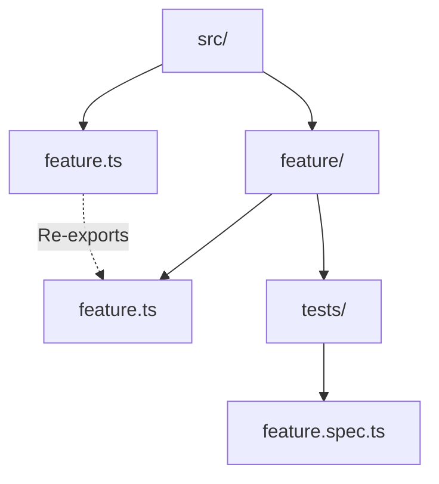

# AGENTS.md

<!-- PLAITED-RULES-START -->

## Rules

# Bun APIs

**Prefer Bun over Node.js** when running in Bun environment.

**File system:**
- `Bun.file(path).exists()` not `fs.existsSync()`
- `Bun.file(path).text()` not `readFileSync()`
- `Bun.write(path, data)` not `writeFileSync()`
*Verify:* `grep 'from .node:fs' src/`  
*Fix:* Replace with Bun.file/Bun.write

**Shell commands:**
- `Bun.$\`cmd\`` not `child_process.spawn()`
*Verify:* `grep 'child_process' src/`  
*Fix:* Replace with Bun.$ template literal

**Path resolution:**
- `Bun.resolveSync()` for module resolution
- `import.meta.dir` for current directory
- Keep `node:path` for join/resolve/dirname
*Verify:* Check for `process.cwd()` misuse

**Executables:**
- `Bun.which(cmd)` to check if command exists
- `Bun.$\`bun add pkg\`` for package management

**When Node.js OK:** readline (interactive input), node:path utilities, APIs without Bun equivalents

**Docs:** https://bun.sh/docs


# Workflow

## Git Commits

**Conventional commits** - `feat:`, `fix:`, `refactor:`, `docs:`, `chore:`, `test:`  
**Multi-line messages** - Use for detailed context  
**Never --no-verify** - Fix the issue, don't bypass hooks  
*Verify:* Check git log format

## GitHub CLI

**Use `gh` over WebFetch** - Better data access, auth, private repos

**PR evaluation** - Fetch ALL sources:
```bash
# 1. Comments/reviews
gh pr view <n> --repo <owner>/<repo> --json title,body,comments,reviews,state

# 2. Security alerts
gh api repos/<owner>/<repo>/code-scanning/alerts

# 3. Inline comments
gh api repos/<owner>/<repo>/pulls/<n>/comments
```

**PR checklist:**
- [ ] Human reviewer comments
- [ ] AI code review comments  
- [ ] Security alerts (ReDoS, injection)
- [ ] Code quality comments
- [ ] Inline suggestions

**URL patterns:**
| URL | Command |
|-----|---------|
| `github.com/.../pull/<n>` | `gh pr view <n> --repo ...` |
| `github.com/.../issues/<n>` | `gh issue view <n> --repo ...` |
| `.../security/code-scanning/<id>` | `gh api .../code-scanning/alerts/<id>` |

**Review states:** `APPROVED`, `CHANGES_REQUESTED`, `COMMENTED`, `PENDING`


# Module Organization

**No index.ts** - Never use index files, they create implicit magic  
*Verify:* `find . -name 'index.ts'`  
*Fix:* Rename to feature name: `feature/index.ts` → `feature.ts` at parent level

**Explicit .ts extensions** - `import { x } from './file.ts'` not `'./file'`  
*Verify:* `grep "from '\./.*[^s]'" src/` (imports without .ts)  
*Fix:* Add `.ts` extension

**Re-export at boundaries** - Parent `feature.ts` re-exports from `feature/feature.ts`



**File organization within modules:**
- `feature.types.ts` - Type definitions only
- `feature.schemas.ts` - Zod schemas + `z.infer<>` types
- `feature.constants.ts` - Constants, error codes
- `feature.ts` - Main implementation

**Direct imports** - Import from specific files, not through re-exports within module  
*Verify:* Check for circular imports  
*Fix:* Import directly: `from './feature.types.ts'` not `from './feature.ts'`


# Testing

**Use test not it** - `test('description', ...)` instead of `it('...')`  
*Verify:* `grep '\bit(' src/**/*.spec.ts`  
*Fix:* Replace `it(` with `test(`

**No conditional assertions** - Never `if (x) expect(x.value)`  
*Verify:* `grep 'if.*expect\|&&.*expect' src/**/*.spec.ts`  
*Fix:* Assert condition first: `expect(x).toBeDefined(); expect(x.value)...`

**Test both branches** - Try/catch, conditionals, fallbacks need both paths tested  
*Verify:* Review test coverage for error paths  
*Fix:* Add test for catch block, else branch, fallback case

**Use real dependencies** - Prefer installed packages over mocks when testing module resolution  
*Verify:* Review test imports for fake paths  
*Fix:* Use actual package like `typescript`

**Organize with describe** - Group related tests in `describe('feature', () => {...})`  
*Verify:* Check for flat test structure  
*Fix:* Add describe blocks by category (happy path, edge cases, errors)

**Coverage checklist** - Happy path, edge cases, error paths, real integrations  
*Verify:* Review test file completeness

**Docker tests** - `*.docker.ts` for external APIs, run via docker-compose  
*Verify:* Check if test needs API key or external service  
*Fix:* Rename to `.docker.ts`, update CI gating

**Run:** `bun test` before commit


# Accuracy

**95% confidence threshold** - Report uncertainty rather than guess

**Verification first** - Read files before stating implementation details
*Verify:* Did you read the file before commenting on it?

**When uncertain:**
- State the discrepancy clearly
- Explain why you can't confidently recommend a fix
- Present issue to user for resolution
- Never invent solutions

**TypeScript verification** - Use LSP tools for type-aware analysis:
- `lsp-find` - Search symbols across workspace
- `lsp-refs` - Find all usages before modifying
- `lsp-hover` - Verify type signatures
- `lsp-analyze` - Batch analysis of file structure

**Dynamic exploration:**
- Read tool for direct file verification
- Grep/Glob for content and pattern searches
- Prioritize live code over cached knowledge

**Agent-specific applications:**
- Documentation: Only update TSDoc if types match current code
- Architecture: Verify patterns exist in codebase
- Code review: Read files before commenting
- Patterns: Confirm examples reflect actual usage

See rules/testing.md for verification in test contexts.


# Skill Activation

**Evaluate on every prompt** - Before any response, tool call, or action, check available skills for relevance

**Activation sequence:**

1. **Evaluate** - For each skill in `<available_skills>`, assess: `[skill-name] - YES/NO - [reason]`
2. **Activate** - Call `Skill(skill-name)` for each relevant skill before proceeding
3. **Respond** - Begin response only after activation is complete

**Applies to all tasks** - Research, explanation, code changes, debugging, review — no exceptions

**Decision-point re-evaluation** - Re-evaluate skills at each planning or delegation step:
- Before entering plan mode
- Before launching subagents (Task tool)
- Before starting each task in a task list
- When the domain shifts mid-task (e.g., from code to evaluation, from schema to grading)

*Verify:* Every Task tool call and plan mode entry was preceded by skill evaluation
*Fix:* Pause, evaluate skills, activate relevant ones, then continue

**Example:**
```
- code-patterns: NO - not writing code
- git-workflow: YES - need commit conventions
- documentation: YES - writing README

> Skill(git-workflow)
> Skill(documentation)
```

**Activation before action** - Evaluating skills without calling `Skill()` provides no benefit
*Verify:* Check that `Skill()` was called for each YES evaluation
*Fix:* Call `Skill(skill-name)` for skipped activations


# Documentation

**TSDoc required** for public APIs

**Template:**
```typescript
/**
 * Brief description
 *
 * @remarks
 * Additional context
 *
 * @param options - Description
 * @returns Description
 *
 * @public
 */
```

**No @example** - Tests are living examples  
**Use @internal** - Mark non-public APIs  
**Mermaid only** - No ASCII box-drawing diagrams  
*Verify:* `grep '[┌│└─]' *.md`


# Core Conventions

**Type over interface** - `type User = {` instead of `interface User {`
*Verify:* `lsp-find interface` or `grep 'interface [A-Z]' src/`
*Fix:* Replace `interface X {` with `type X = {`

**No any types** - Use `unknown` with type guards
*Verify:* `grep ': any' src/`
*Fix:* Replace `any` with `unknown`, add type guard

**PascalCase types** - `type UserConfig`, schemas get `Schema` suffix: `UserConfigSchema`
*Verify:* `lsp-find` for lowercase type names
*Fix:* Rename to PascalCase

**Arrow functions** - Prefer `const fn = () =>` over `function fn()`
*Verify:* `grep 'function \w' src/`
*Fix:* Convert to arrow function

**Object params >2 args** - `fn({ a, b, c }: { ... })` not `fn(a, b, c)`
*Exception:* CLI entry points take `args: string[]`
*Verify:* Review function signatures with `lsp-hover`

**Private fields** - Use `#field` (ES2022) not `private field` (TypeScript)
*Verify:* `grep 'private \w' src/`
*Fix:* Replace `private x` with `#x`

**JSON imports** - `import x from 'file.json' with { type: 'json' }`
*Verify:* `grep "from.*\.json['\"]" src/` (check for missing `with`)
*Fix:* Add `with { type: 'json' }`

**@ts-ignore needs description** - `// @ts-ignore - reason here`
*Verify:* `grep '@ts-ignore' src/` (check for missing comment)

**Short-circuit/ternary OK** - `condition && doSomething()` is acceptable

**Empty interface extending single** - `interface Custom extends Base {}` is OK for branded types

**Mermaid diagrams only** - No ASCII box-drawing in markdown
*Verify:* `grep '[┌│└─]' *.md`

**No @example in TSDoc** - Tests are living examples

**AgentSkills validation** - `bunx @plaited/development-skills validate-skill <path>`


<!-- PLAITED-RULES-END -->
