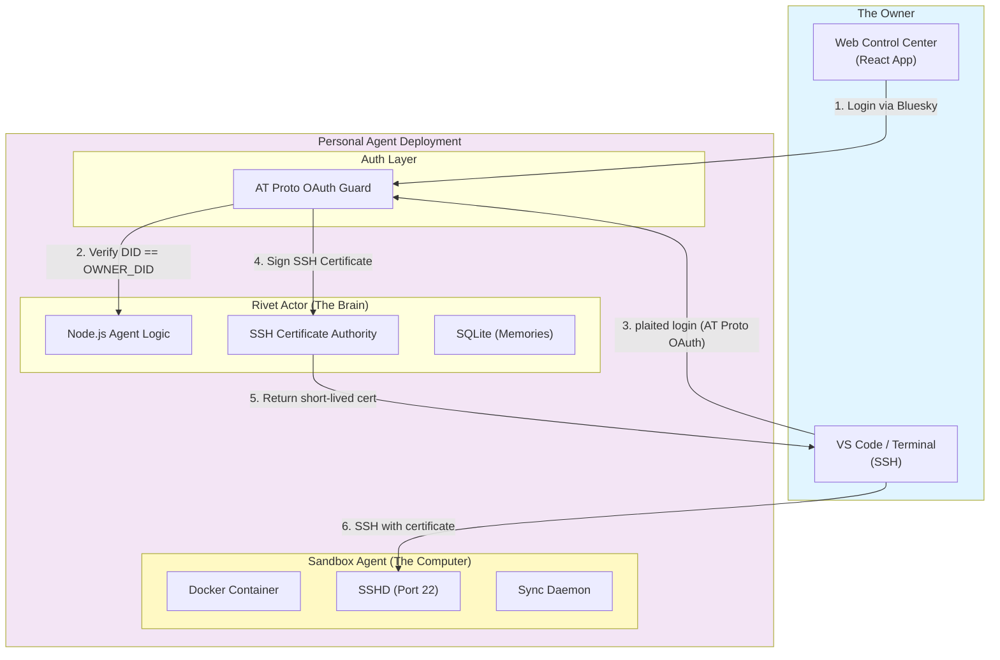

# BACKGROUND AGENT

# Plaited Personal Agent - System Design (Single-Tenant / AT Proto)

## Executive Summary

**Architecture Foundation:** A single-tenant, self-hosted personal AI computer.

**Core Philosophy:** "One User, One Brain, One Computer." Deployed by an individual for their exclusive use. It uses AT Protocol (Bluesky) for identity, ensuring that only the owner controls the agent.

### Key Design Principles

- ✅ **Single Tenancy:** 1 User : 1 Agent instance.
- ✅ **Identity via AT Protocol:** Authentication relies on decentralized identity (DID) via OAuth.
- ✅ **Persistent State:** State is local and persistent.
- ✅ **Dual Interface:**
  - **Web Client:** A dedicated "Control Center" for chatting with the agent.
  - **SSH:** Direct root access to the underlying sandbox for coding.

### Infrastructure Components

| Component | Stack | Function |
| --- | --- | --- |
| **Identity** | AT Protocol OAuth | Verifies the user is the owner (`did:plc:...`). |
| **Orchestration** | Rivet Actor (Singleton) | Manages the session and sandbox lifecycle. |
| **Compute** | Persistent Sandbox (Docker/Firecracker) | Docker container with persistent volume mounts. |
| **State** | SQLite/JSON | Stores chat history, memory, and preferences. |

## System Architecture

### High-Level Design



## Authentication: AT Protocol Integration

Instead of managing a user database, the Agent is configured with a single Environment Variable: `OWNER_DID`.

**Configuration:**

```bash
# The Decentralized ID of the owner (e.g., did:plc:1234...)
ENV OWNER_DID="did:plc:z72i7hdynkq6kh7..."
# The Application Public URL (for OAuth callbacks)
ENV PUBLIC_URL="https://my-agent.railway.app"
```

### The Login Flow

1. **Initiation:** User clicks "Login with Bluesky" on the Web Client.
2. **Resolution:** Client resolves the user's handle (e.g., `@alice.bsky.social`) to their PDS (Personal Data Server).
3. **Redirect:** User is redirected to their PDS to authorize the Agent.
4. **Callback:** PDS redirects back to the Agent with an authorization code.
5. **Verification:**
   - Agent exchanges code for a session token.
   - Agent resolves the token to the user's DID.
   - **CRITICAL CHECK:** `if (authenticated_did === process.env.OWNER_DID) { grant_access() } else { return 403_Forbidden }`

**Why this matters:** You can deploy this agent anywhere. As long as you own the Bluesky handle, you — and only you — can log in.

## Component Deep Dive

### 1. The Rivet Actor (Singleton Brain)

The Rivet Actor is a **Singleton** — the "Always On" process for the personal agent.

**Responsibilities:**

- **Gateway:** It runs the HTTP server and WebSocket endpoint.
- **Sentinel:** It performs the AT Proto DID check on every WebSocket connection.
- **Sandbox Manager:** It ensures the Sandbox Docker container is running. If the container crashes, the Actor restarts it.
- **SSH Certificate Authority:** It holds the CA private key and signs short-lived SSH certificates for authenticated users.

### 2. The Sandbox Agent (Persistent Muscle)

The Sandbox is a **long-lived container** with persistent storage.

**Configuration:**

- **Image:** `plaited/sandbox-agent:latest`
- **Volume:** `/workspace` is mounted to a persistent disk. This means if you restart the agent, your code files remain.
- **SSH Access:** The Sandbox's `sshd` trusts the Rivet Actor's CA key via `TrustedUserCAKeys`. No `authorized_keys` management needed.

### 3. The Web Client (Control Center)

A dedicated single-page application (SPA) hosted by the Rivet Actor.

**Features:**

- **Chat Interface:** Talk to the agent ("Run the tests", "Deploy this").
- **SSH Status:** Shows certificate validity and the `plaited login` command for terminal setup.
- **File Explorer:** View files currently in the Sandbox.

### 4. SSH Security: Certificate Authority + CLI Login

Instead of managing `authorized_keys`, the Rivet Actor acts as an SSH Certificate Authority. A local CLI command bridges AT Protocol identity into SSH credentials.

**Setup (one-time):**

The Rivet Actor generates a CA key pair on first boot. The CA public key is written to the Sandbox's `sshd_config`:

```
# /etc/ssh/sshd_config (inside Sandbox)
TrustedUserCAKeys /etc/ssh/ca.pub
AuthorizedPrincipalsFile /etc/ssh/auth_principals/%u
```

**The CLI Login Flow:**

```bash
$ plaited login --agent https://my-agent.railway.app

# 1. CLI opens browser → Bluesky OAuth (PKCE + DPoP)
# 2. User authenticates with their PDS
# 3. PDS redirects to CLI's localhost callback
# 4. CLI receives AT Proto token, verifies DID
# 5. CLI generates a local SSH key pair
# 6. CLI sends public key + token to Agent: POST /api/ssh/cert
# 7. Agent verifies: authenticated_did === OWNER_DID
# 8. Agent signs the public key → short-lived certificate (24h)
# 9. CLI writes cert + key to ~/.ssh/plaited-*
# 10. CLI updates ~/.ssh/config

✓ Logged in as did:plc:z72i... (cert valid for 24h)
✓ SSH configured: ssh sandbox
```

**Generated `~/.ssh/config`:**

```
Host sandbox
    HostName my-agent.railway.app
    Port 2222
    User root
    IdentityFile ~/.ssh/plaited-key
    CertificateFile ~/.ssh/plaited-key-cert.pub
```

**After login, any IDE works immediately:**

- `ssh sandbox` from terminal
- VS Code → Remote-SSH → `sandbox`
- Cursor → Remote-SSH → `sandbox`
- Zed → Remote Development → `sandbox`

**Certificate properties:**

- **Validity:** 24 hours (no revocation infrastructure needed — certs simply expire)
- **Principals:** `[OWNER_DID, "root"]` — embedded in the certificate
- **Key ID:** `OWNER_DID` — logged by `sshd` for audit trail
- **Extensions:** `permit-pty`, `permit-port-forwarding` enabled

**Renewal:** When the certificate expires, the user runs `plaited login` again. The flow is the same — browser opens, Bluesky auth, new cert signed.

**Why SSH CA over `authorized_keys`:**

- No file injection/cleanup inside the Sandbox container
- Certificates expire automatically — no dangling keys
- `sshd` logs the certificate's `key_id` (the DID) for audit
- Adding the CA key to `sshd_config` is a one-time setup; no per-login changes to the Sandbox

## Data Flow: "The Personal Loop"

**Scenario:** User asks Agent to fix a bug.

1. **User (Web):** "Run the linter and fix errors."
2. **Rivet Actor:** Receives request. Checks `OWNER_DID`. Authenticated.
3. **Rivet Actor:** Sends command to Sandbox via internal Docker network: `npm run lint`.
4. **Sandbox:** Executes command. Linter finds errors.
5. **Sandbox:** Streams output back to Rivet Actor.
6. **Rivet Actor:** Feeds output to LLM (e.g., OpenAI/Anthropic/Local LLM).
7. **Rivet Actor:** Generates a code patch.
8. **Rivet Actor:** Sends patch to Sandbox.
9. **Sandbox:** Applies patch. `sync-daemon` notifies Rivet Actor of file change.
10. **Rivet Actor:** Pushes "File Updated" notification to Web Client.
11. **User (SSH):** Logs in via VS Code to verify the fix manually.

## Deployment Guide (Self-Hosted)

This architecture is designed to be deployed via `docker-compose` on a VPS (DigitalOcean, Hetzner) or a PaaS (Railway, Render).

### docker-compose.yml (Personal Edition)

```yaml
version: '3.8'

services:
  # The Brain (Rivet)
  personal-agent:
    image: my-personal-agent:latest
    ports:
      - "80:3000"
    environment:
      - OWNER_DID=did:plc:1234...  # <--- SECURITY LOCK
      - ATPROTO_SERVICE=https://bsky.social
      - OPENAI_API_KEY=sk-...
      - SANDBOX_HOST=sandbox
    volumes:
      - ./agent-data:/data  # Persist memory/chat logs
    depends_on:
      - sandbox

  # The Muscle (Sandbox)
  sandbox:
    image: plaited/sandbox-agent:latest
    environment:
      - ACTOR_URL=http://personal-agent:3000
      # sshd trusts the Actor's CA key (mounted via volume)
    volumes:
      - ./workspace:/workspace  # Persist your code
    ports:
      - "2222:22"  # SSH Port Mapping
```

## Security Considerations

### The "God Mode" Problem

Since this agent has SSH access and web control, if anyone compromises the `OWNER_DID` check (e.g., by spoofing the DID resolution), they own the box.

**Mitigation:** Use strict AT Proto OAuth 2.0 PKCE flow. Validate the signature of the token against the PDS public key.

### Exposed Ports

The SSH port (`2222`) is open to the internet.

**Mitigation:** Fail2Ban on the host, or use a VPN (Tailscale) to access the SSH port instead of exposing it publicly.
