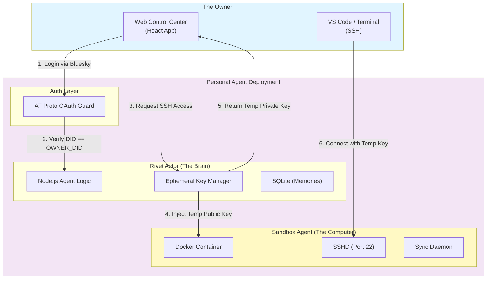

# BACKGROUND AGENT

# Plaited Personal Agent - System Design (Single-Tenant / AT Proto)

## Executive Summary

**Architecture Foundation:** A single-tenant, self-hosted personal AI computer.

**Core Philosophy:** "One User, One Brain, One Computer." Deployed by an individual for their exclusive use. It uses AT Protocol (Bluesky) for identity, ensuring that only the owner controls the agent.

### Key Design Principles

- ✅ **Single Tenancy:** 1 User : 1 Agent instance.
- ✅ **Identity via AT Protocol:** Authentication relies on decentralized identity (DID) via OAuth.
- ✅ **Persistent State:** State is local and persistent.
- ✅ **Dual Interface:**
  - **Web Client:** A dedicated "Control Center" for chatting with the agent.
  - **SSH:** Direct root access to the underlying sandbox for coding.

### Infrastructure Components

| Component | Stack | Function |
| --- | --- | --- |
| **Identity** | AT Protocol OAuth | Verifies the user is the owner (`did:plc:...`). |
| **Orchestration** | Rivet Actor (Singleton) | Manages the session and sandbox lifecycle. |
| **Compute** | Persistent Sandbox (Docker/Firecracker) | Docker container with persistent volume mounts. |
| **State** | SQLite/JSON | Stores chat history, memory, and preferences. |

## System Architecture

### High-Level Design



## Authentication: AT Protocol Integration

Instead of managing a user database, the Agent is configured with a single Environment Variable: `OWNER_DID`.

**Configuration:**

```bash
# The Decentralized ID of the owner (e.g., did:plc:1234...)
ENV OWNER_DID="did:plc:z72i7hdynkq6kh7..."
# The Application Public URL (for OAuth callbacks)
ENV PUBLIC_URL="https://my-agent.railway.app"
```

### The Login Flow

1. **Initiation:** User clicks "Login with Bluesky" on the Web Client.
2. **Resolution:** Client resolves the user's handle (e.g., `@alice.bsky.social`) to their PDS (Personal Data Server).
3. **Redirect:** User is redirected to their PDS to authorize the Agent.
4. **Callback:** PDS redirects back to the Agent with an authorization code.
5. **Verification:**
   - Agent exchanges code for a session token.
   - Agent resolves the token to the user's DID.
   - **CRITICAL CHECK:** `if (authenticated_did === process.env.OWNER_DID) { grant_access() } else { return 403_Forbidden }`

**Why this matters:** You can deploy this agent anywhere. As long as you own the Bluesky handle, you — and only you — can log in.

## Component Deep Dive

### 1. The Rivet Actor (Singleton Brain)

The Rivet Actor is a **Singleton** — the "Always On" process for the personal agent.

**Responsibilities:**

- **Gateway:** It runs the HTTP server and WebSocket endpoint.
- **Sentinel:** It performs the AT Proto DID check on every WebSocket connection.
- **Sandbox Manager:** It ensures the Sandbox Docker container is running. If the container crashes, the Actor restarts it.
- **Key Authority:** It manages the `authorized_keys` file inside the Sandbox.

### 2. The Sandbox Agent (Persistent Muscle)

The Sandbox is a **long-lived container** with persistent storage.

**Configuration:**

- **Image:** `plaited/sandbox-agent:latest`
- **Volume:** `/workspace` is mounted to a persistent disk. This means if you restart the agent, your code files remain.
- **SSH Access:** Managed dynamically by the Rivet Actor (see section 4).

### 3. The Web Client (Control Center)

A dedicated single-page application (SPA) hosted by the Rivet Actor.

**Features:**

- **Chat Interface:** Talk to the agent ("Run the tests", "Deploy this").
- **SSH Manager:** A button to "Connect via SSH" which triggers the Ephemeral Handshake.
- **File Explorer:** View files currently in the Sandbox.

### 4. SSH Security: The "Ephemeral Handshake"

Instead of burning a static SSH key into the container, we piggyback on the secure AT Protocol session to generate keys on the fly.

**The Workflow:**

1. **Web Auth:** User logs into Web Client via Bluesky (AT Proto).
2. **Request:** User clicks "Connect via Terminal" in the UI.
3. **Generation:** The Rivet Actor generates a new RSA Key Pair (2048-bit).
4. **Injection:** The Rivet Actor writes the Public Key to `~/.ssh/authorized_keys` inside the Sandbox (via Docker Volume or Exec).
5. **Delivery:** The Rivet Actor sends the Private Key to the Web Client over the secure WebSocket.
6. **Connection:** The Web Client displays the key or auto-configures a web-based terminal. The user can also download it for VS Code.
7. **Expiry:** The Rivet Actor deletes the key from `authorized_keys` after 24 hours.

## Data Flow: "The Personal Loop"

**Scenario:** User asks Agent to fix a bug.

1. **User (Web):** "Run the linter and fix errors."
2. **Rivet Actor:** Receives request. Checks `OWNER_DID`. Authenticated.
3. **Rivet Actor:** Sends command to Sandbox via internal Docker network: `npm run lint`.
4. **Sandbox:** Executes command. Linter finds errors.
5. **Sandbox:** Streams output back to Rivet Actor.
6. **Rivet Actor:** Feeds output to LLM (e.g., OpenAI/Anthropic/Local LLM).
7. **Rivet Actor:** Generates a code patch.
8. **Rivet Actor:** Sends patch to Sandbox.
9. **Sandbox:** Applies patch. `sync-daemon` notifies Rivet Actor of file change.
10. **Rivet Actor:** Pushes "File Updated" notification to Web Client.
11. **User (SSH):** Logs in via VS Code to verify the fix manually.

## Deployment Guide (Self-Hosted)

This architecture is designed to be deployed via `docker-compose` on a VPS (DigitalOcean, Hetzner) or a PaaS (Railway, Render).

### docker-compose.yml (Personal Edition)

```yaml
version: '3.8'

services:
  # The Brain (Rivet)
  personal-agent:
    image: my-personal-agent:latest
    ports:
      - "80:3000"
    environment:
      - OWNER_DID=did:plc:1234...  # <--- SECURITY LOCK
      - ATPROTO_SERVICE=https://bsky.social
      - OPENAI_API_KEY=sk-...
      - SANDBOX_HOST=sandbox
    volumes:
      - ./agent-data:/data  # Persist memory/chat logs
    depends_on:
      - sandbox

  # The Muscle (Sandbox)
  sandbox:
    image: plaited/sandbox-agent:latest
    environment:
      - ACTOR_URL=http://personal-agent:3000
      # Note: No static PUBLIC_KEY needed. Keys are injected dynamically.
    volumes:
      - ./workspace:/workspace  # Persist your code
    ports:
      - "2222:22"  # SSH Port Mapping
```

## Security Considerations

### The "God Mode" Problem

Since this agent has SSH access and web control, if anyone compromises the `OWNER_DID` check (e.g., by spoofing the DID resolution), they own the box.

**Mitigation:** Use strict AT Proto OAuth 2.0 PKCE flow. Validate the signature of the token against the PDS public key.

### Exposed Ports

The SSH port (`2222`) is open to the internet.

**Mitigation:** Fail2Ban on the host, or use a VPN (Tailscale) to access the SSH port instead of exposing it publicly.
