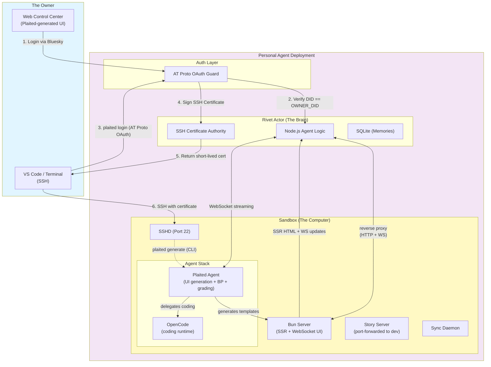

# BACKGROUND AGENT

# Plaited Personal Agent - System Design (Single-Tenant / AT Proto)

## Executive Summary

**Architecture Foundation:** A single-tenant, self-hosted personal AI computer.

**Core Philosophy:** "One User, One Brain, One Computer." Deployed by an individual for their exclusive use. It uses AT Protocol (Bluesky) for identity, ensuring that only the owner controls the agent.

### Key Design Principles

- ✅ **Single Tenancy:** 1 User : 1 Agent instance.
- ✅ **Identity via AT Protocol:** Authentication relies on decentralized identity (DID) via OAuth.
- ✅ **Persistent State:** State is local and persistent.
- ✅ **Dual Interface:**
  - **Web Client:** A dedicated "Control Center" for chatting with the agent.
  - **SSH:** Direct root access to the underlying sandbox for coding.

### Infrastructure Components

| Component | Stack | Function |
| --- | --- | --- |
| **Identity** | AT Protocol OAuth | Verifies the user is the owner (`did:plc:...`). |
| **Orchestration** | Rivet Actor (Singleton) | Session lifecycle, client streaming, SSH CA. |
| **UI Agent** | Plaited Agent (in Sandbox) | Generative UI, BP constraints, grading, structural vocabulary. |
| **Coding Agent** | OpenCode (in Sandbox) | File ops, search, bash exec, LLM-driven code generation. |
| **UI Delivery** | Bun Server (in Sandbox) | SSR of Plaited templates, WebSocket UI streaming. |
| **Compute** | Persistent Sandbox (Docker/Firecracker) | Container running Plaited Agent + OpenCode + Bun Server + SSHD + sync daemon. |
| **State** | SQLite/JSON | Chat history, memory, preferences, module registry. |

## System Architecture

### High-Level Design



## Authentication: AT Protocol Integration

Instead of managing a user database, the Agent is configured with a single Environment Variable: `OWNER_DID`.

**Configuration:**

```bash
# The Decentralized ID of the owner (e.g., did:plc:1234...)
ENV OWNER_DID="did:plc:z72i7hdynkq6kh7..."
# The Application Public URL (for OAuth callbacks)
ENV PUBLIC_URL="https://my-agent.railway.app"
```

### The Login Flow

1. **Initiation:** User clicks "Login with Bluesky" on the Web Client.
2. **Resolution:** Client resolves the user's handle (e.g., `@alice.bsky.social`) to their PDS (Personal Data Server).
3. **Redirect:** User is redirected to their PDS to authorize the Agent.
4. **Callback:** PDS redirects back to the Agent with an authorization code.
5. **Verification:**
   - Agent exchanges code for a session token.
   - Agent resolves the token to the user's DID.
   - **CRITICAL CHECK:** `if (authenticated_did === process.env.OWNER_DID) { grant_access() } else { return 403_Forbidden }`

**Why this matters:** You can deploy this agent anywhere. As long as you own the Bluesky handle, you — and only you — can log in.

## Component Deep Dive

### 1. The Rivet Actor (Singleton Brain)

The Rivet Actor is a **Singleton** — the "Always On" process for the personal agent.

**Responsibilities:**

- **Gateway:** It runs the HTTP server and WebSocket endpoint.
- **Reverse Proxy:** After authentication, it proxies HTTP requests and WebSocket connections to the Sandbox's Bun Server. The browser never connects to the Sandbox directly.
- **Sentinel:** It performs the AT Proto DID check on every connection — HTTP and WebSocket.
- **Sandbox Manager:** It ensures the Sandbox Docker container is running. If the container crashes, the Actor restarts it.
- **SSH Certificate Authority:** It holds the CA private key and signs short-lived SSH certificates for authenticated users.

### 2. The Sandbox (Persistent Muscle)

The Sandbox is a **long-lived container** with persistent storage. Inspired by [Ramp's background agent architecture](https://engineering.ramp.com/post/why-we-built-our-background-agent), it runs two agent processes: the **Plaited Agent** (generative UI) and **[OpenCode](https://opencode.ai)** (general-purpose coding).

**Agent Stack (two processes):**

```
Rivet Actor (outside)
    ↕ WebSocket
Plaited Agent (daemon + CLI)
    ↕ OpenCode SDK/API
OpenCode (headless coding runtime)
    ↕ tools
/workspace filesystem
```

#### 2a. Plaited Agent (UI Intelligence)

The Plaited Agent is the **primary intelligence layer** — all user requests flow through it. It understands Plaited's structural vocabulary (objects, channels, levers, loops, blocks), applies BP constraints, runs grading, and generates UI modules. It delegates actual code writing to OpenCode.

**Responsibilities:**

- **UI Generation:** Translates user intent ("build me a dashboard") into Plaited templates, bElements, and styles.
- **BP Constraints:** Enforces safety, boundary, and budget rules via bThreads (ratchet — can add, cannot remove).
- **Grading:** Runs multi-tier verification — tsc, biome, `bun plaited test` (headless), accessibility audits.
- **Control Center UI:** Generates and maintains the web Control Center that users interact with.
- **Module Lifecycle:** Generate → Save → Constrain → Share (via A2A Agent Cards).

**Two modes:**

- **Daemon mode:** Always running. Receives prompts from Rivet Actor via WebSocket, streams results back. Serves web app users.
- **CLI mode:** Dev SSHs in and runs `plaited generate 'recipe tracker'` directly. Same agent, invoked on-demand.

**AI-Assisted Design (SSH dev):**

When a dev SSHs in, the Plaited Agent exposes a **Story Server** on a port-forwarded URL. The dev sees live story previews in their browser while the agent iterates on templates — enabling the human-in-the-loop AI-assisted design workflow from the [PLAITED-AGENT-PLAN](PLAITED-AGENT-PLAN.md).

#### 2b. OpenCode (Coding Runtime)

[OpenCode](https://opencode.ai) runs headless inside the Sandbox. The Plaited Agent delegates all file operations and code generation to it.

**Why OpenCode (from Ramp's evaluation):**

- **Server-first architecture** — designed for headless operation with pluggable clients
- **Fully typed SDK** — extensible via plugins (`tool.execute.before`, lifecycle hooks)
- **Source-accessible** — the agent can read its own source, reducing hallucination
- **Plugin system** — Plaited Agent integrates via OpenCode plugins for file-edit gating, streaming, and session control

**What OpenCode handles:**

- File operations (read, write, edit)
- Search (glob, grep)
- Bash execution
- LLM-driven code generation (the "hands" that write code)

**What OpenCode does NOT handle:**

- UI design decisions (Plaited Agent)
- BP constraint enforcement (Plaited Agent)
- Grading and verification (Plaited Agent)
- Structural vocabulary mapping (Plaited Agent)

#### 2c. Bun Server (UI Delivery)

The Bun Server runs inside the Sandbox, co-located with the Plaited runtime, generated templates, and `/workspace` filesystem. It is the rendering engine for the Control Center and all generated UI.

**How it works:**

- **SSR:** The Bun Server renders Plaited templates server-side, interpolating state data into HTML before sending it to the browser. Templates live in `/workspace` — the same files the Plaited Agent generates and OpenCode writes.
- **WebSocket UI Streaming:** When state changes (e.g., agent finishes a task, new chat message, file updated), the Bun Server pushes UI updates to the browser over a WebSocket connection. The browser patches the DOM incrementally — no full-page reload.
- **Rivet Actor as Reverse Proxy:** The browser connects to the Rivet Actor's public URL. After authentication, the Actor proxies HTTP and WebSocket traffic to the Bun Server inside the Sandbox. This keeps the Sandbox unexposed to the internet (except SSH).

**Why in the Sandbox (not the Rivet Actor):**

- Templates and state live in `/workspace` — no need to sync files to another process.
- The Plaited runtime (for SSR) is already installed in the Sandbox image.
- Hot-reload is trivial: when the Plaited Agent generates a new template, the Bun Server picks it up immediately from the filesystem.
- The Rivet Actor stays thin — auth, proxy, and sandbox lifecycle only.

#### 2d. Infrastructure Services

- **SSHD:** CA certificate auth. The owner can SSH in alongside both agents — all three work on the same `/workspace` filesystem.
- **Sync Daemon:** Watches `/workspace` for file changes (from OpenCode, Plaited Agent, or SSH users) and pushes updates to the Rivet Actor for Web Client sync.
- **Story Server:** Runs during AI-assisted design sessions. Serves live template previews on a port-forwarded URL for the SSH dev.

**Configuration:**

- **Image:** `plaited/sandbox-agent:latest`
- **Volume:** `/workspace` is mounted to a persistent disk. Code files persist across restarts.
- **SSH Access:** The Sandbox's `sshd` trusts the Rivet Actor's CA key via `TrustedUserCAKeys`. No `authorized_keys` management needed.
- **OpenCode Config:** Configured via `opencode.json`. Skills and tools are pre-installed in the image.

**Communication chains:**

- **Prompt flow:** Browser → Rivet Actor (auth) → Plaited Agent (intent + BP) → OpenCode (code writing) → `/workspace` filesystem.
- **UI delivery flow:** Plaited Agent generates templates → Bun Server SSR's with state → Rivet Actor proxies → Browser. WebSocket pushes incremental UI updates through the same path.
- **State flow:** Rivet Actor pushes state updates (chat messages, memories) to the Bun Server. The Bun Server re-renders affected templates and streams UI patches to the browser.

### 3. The Web Client (Control Center)

The Control Center is itself a Plaited-generated UI — built and maintained by the Plaited Agent using its own template system. Served by the Bun Server inside the Sandbox, proxied through the Rivet Actor.

**Delivery model:**

- **Initial load:** Browser requests the Control Center URL. Rivet Actor authenticates, then reverse-proxies to the Bun Server. The Bun Server SSR's the Control Center template with current state (chat history, file tree, agent status) and returns HTML.
- **Live updates:** After initial load, the browser opens a WebSocket through the Rivet Actor to the Bun Server. State changes (new messages, task progress, file edits) push incremental UI updates to the browser — no polling, no full reloads.

**Features:**

- **Chat Interface:** Talk to the agent ("Run the tests", "Deploy this"). Messages stream in real-time via WebSocket.
- **SSH Status:** Shows certificate validity and the `plaited login` command for terminal setup.
- **File Explorer:** View files currently in the Sandbox. Updates live as the agent writes files.

### 4. SSH Security: Certificate Authority + CLI Login

Instead of managing `authorized_keys`, the Rivet Actor acts as an SSH Certificate Authority. A local CLI command bridges AT Protocol identity into SSH credentials.

**Setup (one-time):**

The Rivet Actor generates a CA key pair on first boot. The CA public key is written to the Sandbox's `sshd_config`:

```
# /etc/ssh/sshd_config (inside Sandbox)
TrustedUserCAKeys /etc/ssh/ca.pub
AuthorizedPrincipalsFile /etc/ssh/auth_principals/%u
```

**The CLI Login Flow:**

```bash
$ plaited login --agent https://my-agent.railway.app

# 1. CLI opens browser → Bluesky OAuth (PKCE + DPoP)
# 2. User authenticates with their PDS
# 3. PDS redirects to CLI's localhost callback
# 4. CLI receives AT Proto token, verifies DID
# 5. CLI generates a local SSH key pair
# 6. CLI sends public key + token to Agent: POST /api/ssh/cert
# 7. Agent verifies: authenticated_did === OWNER_DID
# 8. Agent signs the public key → short-lived certificate (24h)
# 9. CLI writes cert + key to ~/.ssh/plaited-*
# 10. CLI updates ~/.ssh/config

✓ Logged in as did:plc:z72i... (cert valid for 24h)
✓ SSH configured: ssh sandbox
```

**Generated `~/.ssh/config`:**

```
Host sandbox
    HostName my-agent.railway.app
    Port 2222
    User root
    IdentityFile ~/.ssh/plaited-key
    CertificateFile ~/.ssh/plaited-key-cert.pub
```

**After login, any IDE works immediately:**

- `ssh sandbox` from terminal
- VS Code → Remote-SSH → `sandbox`
- Cursor → Remote-SSH → `sandbox`
- Zed → Remote Development → `sandbox`

**Certificate properties:**

- **Validity:** 24 hours (no revocation infrastructure needed — certs simply expire)
- **Principals:** `[OWNER_DID, "root"]` — embedded in the certificate
- **Key ID:** `OWNER_DID` — logged by `sshd` for audit trail
- **Extensions:** `permit-pty`, `permit-port-forwarding` enabled

**Renewal:** When the certificate expires, the user runs `plaited login` again. The flow is the same — browser opens, Bluesky auth, new cert signed.

**Why SSH CA over `authorized_keys`:**

- No file injection/cleanup inside the Sandbox container
- Certificates expire automatically — no dangling keys
- `sshd` logs the certificate's `key_id` (the DID) for audit
- Adding the CA key to `sshd_config` is a one-time setup; no per-login changes to the Sandbox

## Data Flows

### Flow A: Web User → UI Generation

**Scenario:** User asks for a new UI module.

1. **User (Web):** "Build me a recipe tracker with ingredient lists."
2. **Rivet Actor:** Receives request via WebSocket. Checks `OWNER_DID`. Authenticated.
3. **Rivet Actor:** Streams prompt to Plaited Agent inside Sandbox.
4. **Plaited Agent:** Maps intent to structural vocabulary (objects, channels, levers). Checks BP constraints.
5. **Plaited Agent:** Delegates to OpenCode: "Create a Plaited bElement with these template specs."
6. **OpenCode:** Writes template files, styles, and story tests to `/workspace`.
7. **Plaited Agent:** Runs grading — tsc, biome, `bun plaited test` (headless), a11y audit.
8. **Plaited Agent:** If grading fails, feeds errors back to OpenCode for another iteration.
9. **Plaited Agent:** Streams progress and results back to Rivet Actor.
10. **Bun Server:** Picks up the new template from `/workspace`, SSR's it with current state.
11. **Bun Server → Rivet Actor → Browser:** Pushes UI update via WebSocket. The new module appears live in the Control Center.

### Flow B: Web User → Code Fix

**Scenario:** User asks for a bug fix (non-UI task).

1. **User (Web):** "Run the linter and fix errors."
2. **Rivet Actor:** Streams prompt to Plaited Agent.
3. **Plaited Agent:** Recognizes this as a general coding task, delegates directly to OpenCode.
4. **OpenCode:** Reads codebase, runs `bun run lint`, generates a code patch, applies file edits.
5. **OpenCode:** Streams results back through Plaited Agent → Rivet Actor → Web Client.

### Flow C: SSH Dev → AI-Assisted Design

**Scenario:** Developer SSHs in to iterate on a template with live preview.

1. **Dev (SSH):** `plaited generate 'recipe tracker' --interactive`
2. **Plaited Agent (CLI mode):** Starts Story Server, exposes preview URL (port-forwarded to dev's browser).
3. **Plaited Agent:** Generates initial template, delegates code writing to OpenCode.
4. **Dev:** Views live stories in browser, provides feedback ("make the ingredient list sortable").
5. **Plaited Agent:** Iterates — updates template, re-runs grading, refreshes preview.
6. **Sync Daemon:** Pushes file changes to Rivet Actor → Web Client sees updates too.

## Deployment Guide (Self-Hosted)

This architecture is designed to be deployed via `docker-compose` on a VPS (DigitalOcean, Hetzner) or a PaaS (Railway, Render).

### docker-compose.yml (Personal Edition)

```yaml
version: '3.8'

services:
  # The Brain (Rivet)
  personal-agent:
    image: my-personal-agent:latest
    ports:
      - "80:3000"
    environment:
      - OWNER_DID=did:plc:1234...  # <--- SECURITY LOCK
      - ATPROTO_SERVICE=https://bsky.social
      - OPENAI_API_KEY=sk-...
      - SANDBOX_HOST=sandbox
    volumes:
      - ./agent-data:/data  # Persist memory/chat logs
    depends_on:
      - sandbox

  # The Muscle (Sandbox)
  sandbox:
    image: plaited/sandbox-agent:latest
    environment:
      - ACTOR_URL=http://personal-agent:3000
      # sshd trusts the Actor's CA key (mounted via volume)
    volumes:
      - ./workspace:/workspace  # Persist your code
    ports:
      - "2222:22"  # SSH Port Mapping
```

## Security Considerations

### The "God Mode" Problem

Since this agent has SSH access and web control, if anyone compromises the `OWNER_DID` check (e.g., by spoofing the DID resolution), they own the box.

**Mitigation:** Use strict AT Proto OAuth 2.0 PKCE flow. Validate the signature of the token against the PDS public key.

### Exposed Ports

The SSH port (`2222`) is open to the internet.

**Mitigation:** Fail2Ban on the host, or use a VPN (Tailscale) to access the SSH port instead of exposing it publicly.
