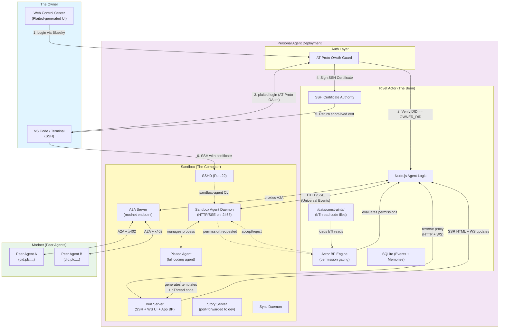
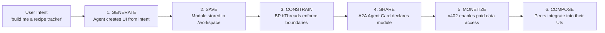
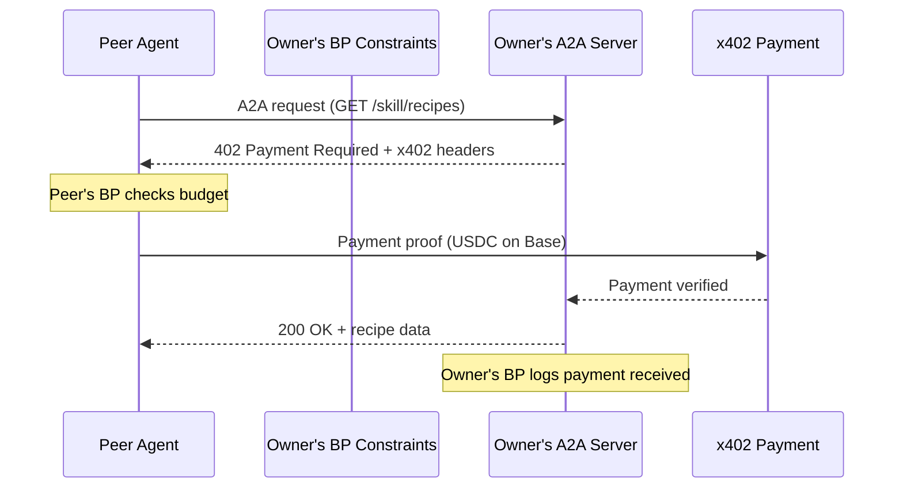

# BACKGROUND AGENT

# Plaited Personal Agent - System Design (Single-Tenant / AT Proto)

## Executive Summary

**Architecture Foundation:** A single-tenant, self-hosted personal AI computer.

**Core Philosophy:** "One User, One Brain, One Computer." Deployed by an individual for their exclusive use. It uses AT Protocol (Bluesky) for identity, ensuring that only the owner controls the agent. Each agent is a **modnet node** — a user-owned unit in a modular network where modules compose peer-to-peer.

### Key Design Principles

- ✅ **Single Tenancy:** 1 User : 1 Agent instance.
- ✅ **Identity via AT Protocol:** Authentication relies on decentralized identity (DID) via OAuth.
- ✅ **Modnet Node:** Each agent is a node in a modular network. Modules are user-owned, peer-to-peer via A2A, monetized via x402.
- ✅ **Persistent State:** State is local and persistent. User data lives on their agent — nowhere else.
- ✅ **BP-Constrained:** Two behavioral programming engines — Actor-level (permission gating) and Application-level (module behavior) — enforce safety via bThread code.
- ✅ **Dual Interface:**
  - **Web Client:** A dedicated "Control Center" for chatting with the agent.
  - **SSH:** Direct root access to the underlying sandbox for coding.

### Infrastructure Components

| Component | Stack | Function |
| --- | --- | --- |
| **Identity** | AT Protocol OAuth | Verifies the user is the owner (`did:plc:...`). |
| **Orchestration** | Rivet Actor (Singleton) | Session lifecycle, event persistence, BP permission gating, SSH CA. |
| **Agent Runtime** | [Sandbox Agent](https://sandboxagent.dev) (in Sandbox) | Universal HTTP/SSE daemon managing the Plaited Agent process. |
| **Plaited Agent** | Coding Agent (in Sandbox) | Full coding agent: generative UI, file ops, bash, BP bThread generation, grading, structural vocabulary. |
| **UI Delivery** | Bun Server (in Sandbox) | SSR of Plaited templates, WebSocket UI streaming, application-level BP runtime. |
| **Modnet** | A2A Protocol | Peer-to-peer module communication between agents. |
| **Payments** | x402 (HTTP 402) | Micropayments for module data access between nodes. |
| **Compute** | Persistent Sandbox (Docker/Firecracker) | Container running sandbox-agent + Plaited Agent + Bun Server + SSHD + sync daemon. |
| **State** | SQLite + Code Files | Event stream, constraint bThreads (`/data/constraints/`), module code (`/workspace`). |

## System Architecture

### High-Level Design



## Authentication: AT Protocol Integration

Instead of managing a user database, the Agent is configured with a single Environment Variable: `OWNER_DID`.

**Configuration:**

```bash
# The Decentralized ID of the owner (e.g., did:plc:1234...)
ENV OWNER_DID="did:plc:z72i7hdynkq6kh7..."
# The Application Public URL (for OAuth callbacks)
ENV PUBLIC_URL="https://my-agent.railway.app"
```

### The Login Flow

1. **Initiation:** User clicks "Login with Bluesky" on the Web Client.
2. **Resolution:** Client resolves the user's handle (e.g., `@alice.bsky.social`) to their PDS (Personal Data Server).
3. **Redirect:** User is redirected to their PDS to authorize the Agent.
4. **Callback:** PDS redirects back to the Agent with an authorization code.
5. **Verification:**
   - Agent exchanges code for a session token.
   - Agent resolves the token to the user's DID.
   - **CRITICAL CHECK:** `if (authenticated_did === process.env.OWNER_DID) { grant_access() } else { return 403_Forbidden }`

**Why this matters:** You can deploy this agent anywhere. As long as you own the Bluesky handle, you — and only you — can log in.

## Component Deep Dive

### 1. The Rivet Actor (Singleton Brain)

The Rivet Actor is a **Singleton** — the "Always On" process for the personal agent.

**Responsibilities:**

- **Gateway:** It runs the HTTP server and WebSocket endpoint.
- **Reverse Proxy:** After authentication, it proxies HTTP requests and WebSocket connections to the Sandbox's Bun Server. The browser never connects to the Sandbox directly.
- **Sentinel:** It performs the AT Proto DID check on every connection — HTTP and WebSocket.
- **Sandbox Manager:** It ensures the Sandbox Docker container is running. If the container crashes, the Actor restarts it.
- **SSH Certificate Authority:** It holds the CA private key and signs short-lived SSH certificates for authenticated users.
- **BP Permission Gating:** Runs a `behavioral()` instance with constraint bThreads loaded from `/data/constraints/`. Evaluates every `permission.requested` event from sandbox-agent against active bThreads before replying accept/reject. See [BP Constraint Architecture](#bp-constraint-architecture).
- **Event Persistence:** Streams all Universal Events from sandbox-agent SSE into SQLite. The Actor is the durable source of truth for all transcripts. See [Event Persistence](#event-persistence).

### 2. The Sandbox (Persistent Muscle)

The Sandbox is a **long-lived container** with persistent storage. Inspired by [Ramp's background agent architecture](https://engineering.ramp.com/post/why-we-built-our-background-agent), it runs the [Sandbox Agent](https://sandboxagent.dev) daemon — a Rust-based HTTP/SSE server that manages the **Plaited Agent** as a single, full-capability coding agent.

**Agent Stack (one agent, managed by sandbox-agent):**

```
Rivet Actor (outside)
    ↕ HTTP/SSE (Universal Events)
Sandbox Agent Daemon (:2468)
    ↕ manages process lifecycle
Plaited Agent (full coding agent)
    ↕ file writes, bash, tools
/workspace filesystem
```

#### 2a. Sandbox Agent Daemon

The [Sandbox Agent](https://sandboxagent.dev) daemon is a **stateless adapter** — a Rust binary that provides a universal HTTP + SSE interface for controlling the Plaited Agent. It normalizes the agent's native event format into the **Universal Event Schema**.

**Responsibilities:**

- **Agent Process Management:** Spawns and manages the Plaited Agent as a subprocess. Handles lifecycle (start, resume, terminate).
- **Universal Event Schema:** Normalizes all agent events into 11 event types with monotonic sequence numbers — `session.started`, `session.ended`, `item.started`, `item.delta`, `item.completed`, `permission.requested`, `permission.resolved`, `question.requested`, `question.resolved`, `error`, `agent.unparsed`.
- **SSE Streaming:** Streams events to the Rivet Actor via Server-Sent Events with offset-based reconnection. The Actor tracks `lastSequence` and reconnects seamlessly after blips.
- **Permission Mediation:** When the agent requests a dangerous action (file write, bash exec), the daemon emits `permission.requested`. The Rivet Actor's BP engine evaluates it and replies accept/reject. The daemon forwards the decision to the agent.
- **In-Memory Sessions:** Sessions live in memory only. No disk persistence. The Rivet Actor is responsible for persisting events to SQLite.

**Key API endpoints:**

| Method | Endpoint | Purpose |
|---|---|---|
| POST | `/v1/sessions/{id}` | Create session (configure agent, model, permission mode) |
| POST | `/v1/sessions/{id}/messages` | Send message (fire-and-forget) |
| GET | `/v1/sessions/{id}/events/sse?offset=N` | Subscribe to SSE stream from offset |
| POST | `/v1/sessions/{id}/permissions/{id}/reply` | Reply to permission request (`once`/`always`/`reject`) |
| POST | `/v1/sessions/{id}/terminate` | Terminate session |

**Why sandbox-agent (not custom orchestration):**

- **Designed for Rivet Actors** — sandbox-agent and Rivet Actors are built to work together. The Actor creates sessions, the daemon manages the agent subprocess.
- **Universal Event Schema** — one event format regardless of underlying agent implementation. Future-proofs against agent changes.
- **Permission mediation built-in** — the `permission.requested`/`permission.resolved` flow is the natural hook for BP constraint evaluation.
- **Offset-based reconnection** — monotonic sequence numbers mean the Actor never loses events, even across network blips.
- **No orchestration logic needed** — the daemon handles subprocess lifecycle, stdio parsing, session management. The Actor stays thin.

#### 2b. Plaited Agent (Full Coding Agent)

The Plaited Agent is the **sole intelligence layer** — a full coding agent that handles everything from UI generation to file operations to bash execution. It understands Plaited's structural vocabulary (objects, channels, levers, loops, blocks), generates bThread code, runs grading, and writes all files directly.

**Responsibilities:**

- **UI Generation:** Translates user intent ("build me a dashboard") into Plaited templates, bElements, styles, and bThread modules.
- **bThread Generation:** Writes behavioral program code — generator functions with closures and predicates that define module runtime behavior. These are real TypeScript files, not config.
- **File Operations:** Reads, writes, and edits files directly in `/workspace`. No delegation to a separate coding agent.
- **Bash Execution:** Runs shell commands (builds, linters, test runners) directly.
- **Grading:** Runs multi-tier verification — tsc, biome, `bun plaited test` (headless), accessibility audits.
- **Control Center UI:** Generates and maintains the web Control Center that users interact with.
- **Module Lifecycle:** Generate → Save → Constrain → Share (via A2A Agent Cards).

**Managed by sandbox-agent — two interaction modes:**

- **Web mode:** Rivet Actor creates a sandbox-agent session, sends user messages via `POST /messages`, streams results via SSE. The Actor handles permission requests through its BP engine.
- **SSH mode:** Dev SSHs in and interacts with the Plaited Agent through the sandbox-agent CLI directly. Same agent, same session model, invoked from the terminal.

**AI-Assisted Design (SSH dev):**

When a dev SSHs in, the Plaited Agent exposes a **Story Server** on a port-forwarded URL. The dev sees live story previews in their browser while the agent iterates on templates — enabling the human-in-the-loop AI-assisted design workflow from the [PLAITED-AGENT-PLAN](PLAITED-AGENT-PLAN.md).

#### 2c. Bun Server (UI Delivery + Application BP)

The Bun Server runs inside the Sandbox, co-located with the Plaited runtime, generated templates, and `/workspace` filesystem. It is the rendering engine for the Control Center and all generated UI, and the **Application-level BP runtime** that executes module bThreads.

**How it works:**

- **SSR:** The Bun Server renders Plaited templates server-side, interpolating state data into HTML before sending it to the browser. Templates live in `/workspace` — the same files the Plaited Agent generates and writes.
- **WebSocket UI Streaming:** When state changes (e.g., agent finishes a task, new chat message, file updated), the Bun Server pushes UI updates to the browser over a WebSocket connection. The browser patches the DOM incrementally — no full-page reload.
- **Application BP Runtime:** Loads and runs bThread code generated by the Plaited Agent. Each module's `behavioral()` instance runs here, handling UI events, user interactions, and module behavior. This is separate from the Actor's permission-gating BP engine.
- **Rivet Actor as Reverse Proxy:** The browser connects to the Rivet Actor's public URL. After authentication, the Actor proxies HTTP and WebSocket traffic to the Bun Server inside the Sandbox. This keeps the Sandbox unexposed to the internet (except SSH).

**Why in the Sandbox (not the Rivet Actor):**

- Templates, bThread code, and state live in `/workspace` — no need to sync files to another process.
- The Plaited runtime (for SSR and BP) is already installed in the Sandbox image.
- Hot-reload is trivial: when the Plaited Agent generates a new template or bThread, the Bun Server picks it up immediately from the filesystem.
- The Rivet Actor stays thin — auth, proxy, event persistence, and permission gating only.

#### 2d. Infrastructure Services

- **SSHD:** CA certificate auth. The owner can SSH in alongside the agent — both work on the same `/workspace` filesystem.
- **Sync Daemon:** Watches `/workspace` for file changes (from the Plaited Agent or SSH users) and pushes updates to the Rivet Actor for Web Client sync.
- **Story Server:** Runs during AI-assisted design sessions. Serves live template previews on a port-forwarded URL for the SSH dev.

**Configuration:**

- **Image:** `plaited/sandbox-agent:latest`
- **Volume:** `/workspace` is mounted to a persistent disk. Code files persist across restarts.
- **SSH Access:** The Sandbox's `sshd` trusts the Rivet Actor's CA key via `TrustedUserCAKeys`. No `authorized_keys` management needed.
- **Sandbox Agent:** Starts on container boot, listens on `:2468`. Auto-installs the Plaited Agent binary on first session creation.

**Communication chains:**

- **Prompt flow:** Browser → Rivet Actor (auth) → sandbox-agent `POST /messages` → Plaited Agent (intent + code writing) → `/workspace` filesystem.
- **Permission flow:** Plaited Agent attempts action → sandbox-agent emits `permission.requested` via SSE → Rivet Actor's BP engine evaluates → `POST /permissions/{id}/reply` → sandbox-agent forwards decision → agent proceeds or adjusts.
- **UI delivery flow:** Plaited Agent generates templates + bThread code → Bun Server loads and SSR's with state → Rivet Actor proxies → Browser. WebSocket pushes incremental UI updates through the same path.
- **Event persistence flow:** sandbox-agent SSE streams all Universal Events → Rivet Actor writes each event to SQLite → Actor is source of truth for all transcripts.
- **State flow:** Rivet Actor pushes state updates (chat messages, memories) to the Bun Server. The Bun Server re-renders affected templates and streams UI patches to the browser.

### 3. The Web Client (Control Center)

The Control Center is itself a Plaited-generated UI — built and maintained by the Plaited Agent using its own template system. Served by the Bun Server inside the Sandbox, proxied through the Rivet Actor.

**Delivery model:**

- **Initial load:** Browser requests the Control Center URL. Rivet Actor authenticates, then reverse-proxies to the Bun Server. The Bun Server SSR's the Control Center template with current state (chat history, file tree, agent status) and returns HTML.
- **Live updates:** After initial load, the browser opens a WebSocket through the Rivet Actor to the Bun Server. State changes (new messages, task progress, file edits) push incremental UI updates to the browser — no polling, no full reloads.

**Features:**

- **Chat Interface:** Talk to the agent ("Run the tests", "Deploy this"). Messages stream in real-time via WebSocket.
- **SSH Status:** Shows certificate validity and the `plaited login` command for terminal setup.
- **File Explorer:** View files currently in the Sandbox. Updates live as the agent writes files.

### 4. SSH Security: Certificate Authority + CLI Login

Instead of managing `authorized_keys`, the Rivet Actor acts as an SSH Certificate Authority. A local CLI command bridges AT Protocol identity into SSH credentials.

**Setup (one-time):**

The Rivet Actor generates a CA key pair on first boot. The CA public key is written to the Sandbox's `sshd_config`:

```
# /etc/ssh/sshd_config (inside Sandbox)
TrustedUserCAKeys /etc/ssh/ca.pub
AuthorizedPrincipalsFile /etc/ssh/auth_principals/%u
```

**The CLI Login Flow:**

```bash
$ plaited login --agent https://my-agent.railway.app

# 1. CLI opens browser → Bluesky OAuth (PKCE + DPoP)
# 2. User authenticates with their PDS
# 3. PDS redirects to CLI's localhost callback
# 4. CLI receives AT Proto token, verifies DID
# 5. CLI generates a local SSH key pair
# 6. CLI sends public key + token to Agent: POST /api/ssh/cert
# 7. Agent verifies: authenticated_did === OWNER_DID
# 8. Agent signs the public key → short-lived certificate (24h)
# 9. CLI writes cert + key to ~/.ssh/plaited-*
# 10. CLI updates ~/.ssh/config

✓ Logged in as did:plc:z72i... (cert valid for 24h)
✓ SSH configured: ssh sandbox
```

**Generated `~/.ssh/config`:**

```
Host sandbox
    HostName my-agent.railway.app
    Port 2222
    User root
    IdentityFile ~/.ssh/plaited-key
    CertificateFile ~/.ssh/plaited-key-cert.pub
```

**After login, any IDE works immediately:**

- `ssh sandbox` from terminal
- VS Code → Remote-SSH → `sandbox`
- Cursor → Remote-SSH → `sandbox`
- Zed → Remote Development → `sandbox`

**Certificate properties:**

- **Validity:** 24 hours (no revocation infrastructure needed — certs simply expire)
- **Principals:** `[OWNER_DID, "root"]` — embedded in the certificate
- **Key ID:** `OWNER_DID` — logged by `sshd` for audit trail
- **Extensions:** `permit-pty`, `permit-port-forwarding` enabled

**Renewal:** When the certificate expires, the user runs `plaited login` again. The flow is the same — browser opens, Bluesky auth, new cert signed.

**Why SSH CA over `authorized_keys`:**

- No file injection/cleanup inside the Sandbox container
- Certificates expire automatically — no dangling keys
- `sshd` logs the certificate's `key_id` (the DID) for audit
- Adding the CA key to `sshd_config` is a one-time setup; no per-login changes to the Sandbox

## Data Flows

### Flow A: Web User → UI Generation

**Scenario:** User asks for a new UI module.

1. **User (Web):** "Build me a recipe tracker with ingredient lists."
2. **Rivet Actor:** Receives request via WebSocket. Checks `OWNER_DID`. Authenticated.
3. **Rivet Actor:** Sends prompt to sandbox-agent: `POST /v1/sessions/{id}/messages`. Subscribes to SSE stream.
4. **Sandbox Agent:** Spawns/resumes Plaited Agent process with the message.
5. **Plaited Agent:** Maps intent to structural vocabulary (objects, channels, levers).
6. **Plaited Agent:** Writes template files, styles, bThread modules, and story tests to `/workspace`. Each file write triggers a `permission.requested` event.
7. **Sandbox Agent → Rivet Actor (SSE):** `permission.requested { action: "file:write", metadata: { path: "/workspace/recipes/..." } }`.
8. **Rivet Actor (BP Engine):** Evaluates against constraint bThreads. `/workspace` writes allowed. Replies: `POST /permissions/{id}/reply { reply: "always" }`.
9. **Plaited Agent:** Runs grading — tsc, biome, `bun plaited test` (headless), a11y audit. If grading fails, iterates.
10. **Plaited Agent:** Streams progress via `item.delta` events through sandbox-agent SSE → Rivet Actor persists to SQLite → forwards to Web Client.
11. **Bun Server:** Picks up the new templates and bThread code from `/workspace`, SSR's with current state, loads bThreads into application BP.
12. **Bun Server → Rivet Actor → Browser:** Pushes UI update via WebSocket. The new module appears live in the Control Center.

### Flow B: Web User → Code Fix

**Scenario:** User asks for a bug fix (non-UI task).

1. **User (Web):** "Run the linter and fix errors."
2. **Rivet Actor:** Sends prompt to sandbox-agent. Subscribes to SSE.
3. **Plaited Agent:** Reads codebase, runs `bun run lint` (bash tool triggers `permission.requested`).
4. **Rivet Actor (BP Engine):** Evaluates bash permission. `bun run lint` allowed. Replies accept.
5. **Plaited Agent:** Generates a code patch, applies file edits to `/workspace`.
6. **Plaited Agent:** Streams results via sandbox-agent SSE → Rivet Actor → Web Client.

### Flow C: SSH Dev → AI-Assisted Design

**Scenario:** Developer SSHs in to iterate on a template with live preview.

1. **Dev (SSH):** Interacts with Plaited Agent through sandbox-agent CLI.
2. **Plaited Agent:** Starts Story Server, exposes preview URL (port-forwarded to dev's browser).
3. **Plaited Agent:** Generates initial template and bThread code, writes to `/workspace`.
4. **Dev:** Views live stories in browser, provides feedback ("make the ingredient list sortable").
5. **Plaited Agent:** Iterates — updates template and bThreads, re-runs grading, refreshes preview.
6. **Sync Daemon:** Pushes file changes to Rivet Actor → Web Client sees updates too.

### Flow D: Modnet → Module Composition

**Scenario:** A peer agent discovers and composes a module from this agent.

1. **Peer Agent:** Discovers this agent's A2A endpoint (via AT Protocol social graph, QR code, or direct URL).
2. **Peer Agent:** Fetches `/.well-known/agent.json` — reads Agent Card with skills, boundary, scale, and pricing.
3. **Peer Agent:** Requests recipe data: `GET /skill/recipes`.
4. **A2A Server (Sandbox):** Returns `402 Payment Required` with x402 headers (price: 0.01 USDC).
5. **Peer Agent:** Its own Actor BP engine checks budget constraints. Allowed. Sends payment proof.
6. **A2A Server:** Verifies payment, checks boundary (search: all, participation: ask). Owner's Actor BP has pre-approved this peer's DID.
7. **A2A Server:** Returns recipe data. Peer agent composes it into their own UI.
8. **Ongoing:** Peer subscribes to updates. When this agent's owner adds a new recipe, the peer's UI updates via A2A push.
9. **Disconnect:** Owner revokes peer's access (or goes offline). Peer's subscription fails. Recipe data disappears from peer's UI.

## Modnet Architecture

### One Agent = One Modnet Node

Each personal agent deployment is a **modnet node** — a user-owned unit in a modular network. Rachel Jaffe's [modnet concept](assets/Modnet.md) describes a world where individuals own discrete modules composed of front-end and back-end, separate from any platform. These modules connect peer-to-peer to form crowd-sourced networks (modnets) that exist only as long as participants stay connected.

In this architecture, the agent IS the modnet node:

| Modnet Concept | System Mapping |
|---|---|
| **Module** | Generated UI module (template + bThreads + boundary) stored in `/workspace` |
| **Module owner** | The agent's `OWNER_DID` — decentralized identity via AT Protocol |
| **Module host** | The Sandbox (persistent container with Bun Server) |
| **Network connection** | A2A protocol between agents |
| **Data residency** | User's data lives ON their agent — nowhere else |
| **Disconnect** | Agent offline or connection revoked → data disappears from peers |

### Structural Vocabulary

The Plaited Agent's base model is trained on Rachel Jaffe's [structural information architecture](assets/Structural-IA.md) — a functional design language for digital systems. This vocabulary is the **shared language** between modnet nodes and the constraint language for BP bThreads.

**Core vocabulary (functional units, not visual components):**

| Element | Description | Role in Agent |
|---|---|---|
| **Objects** | Anything conceived as one unit | Base model understands what constitutes "one thing" in a UI |
| **Channels** | Connections that exchange information between objects | Model understands information flow between elements |
| **Levers** | Tools that change energy demand or alter energy inputs | Model understands affordances, mechanics, engagement |
| **Loops** | Two connected dynamics — action and response | Model understands feedback patterns |
| **Blocks** | Multiple modules organized to create emergent interactions | Model understands composition (pools, streams, walls, threads) |

**Three-layer approach:**

1. **Training data** — Base model is trained on structural IA patterns (desk, bedroom, marketplace, carnival, etc.) so it understands what functional patterns exist in digital spaces.
2. **BP constraints** — bThreads use the vocabulary (objects, channels, levers, loops, blocks) + scale + boundary to constrain generation. The vocabulary is the language constraints speak.
3. **Template generation** — The actual Plaited templates are the output. The model chooses templates based on its understanding of patterns. The mapping from vocabulary to templates is **learned** (emergent from training), not hardcoded.

**Why functional, not visual:** Jaffe distinguishes Alexander's physical patterns (what things *look like*) from Wurman's functionalism (what things *do*). The structural vocabulary describes function — "this module needs a channel between these two objects" — not form. The agent decides what Plaited templates to render; the vocabulary ensures the interaction design is correct.

### Scale (S1–S8)

Scale defines how modules compose into larger structures in the modnet — not a mapping to specific UI elements:

| Scale | Name | Modnet Role |
|---|---|---|
| S1 | Singular Object | Atomic data (a price, a name, a photo) |
| S2 | Object Group | Related objects (a product listing, a step sequence) |
| S3 | Block | Composed modules (a pool, a stream, a thread) |
| S4 | Block Group | A room — related blocks forming a section |
| S5 | Module | A complete user-owned unit (a recipe tracker, a portfolio) |
| S6 | Module Group | Multiple modules from one or more agents |
| S7 | Platform Structure | A neighborhood — emergent structure from connected modules |
| S8 | Super-structure | A city — cross-cutting modnet spanning many agents |

When a module declares its scale in its A2A Agent Card, it tells peer agents how it can be composed. BP bThreads enforce scale compatibility — a S1 object cannot claim to be a S7 platform.

### Discovery

The A2A Agent Card URL (`/.well-known/agent.json`) is the universal connection point. How you discover it is orthogonal:

| Mechanism | How It Works |
|---|---|
| **AT Protocol social graph** | Follow someone on Bluesky → their agent is discoverable. The handle resolves to a DID, the DID resolves to their agent's A2A endpoint. |
| **Direct URL share** | Send someone your agent URL (paste, email, DM). |
| **QR code** | Scan a QR code at an event → opens the agent's `.well-known/agent.json`. Physical proximity creates the connection. |
| **Bluetooth / NFC** | Mobile app broadcasts A2A Agent Card via Bluetooth or NFC. Walk near someone → discover their modules. |
| **Web link** | Agent URL embedded in a website, email signature, blog post. |

This maps to Jaffe's vision: the farmer shows up at the market square with their stall module. The *proximity* creates the connection, the *module standard* (A2A Agent Card) makes it composable.

### Ephemeral Networks

Modnet connections are ephemeral — two mechanisms enforce this:

**1. Agent offline = gone:**
When the Sandbox is down (stopped, crashed, sleeping), the A2A endpoint is unreachable. Peers' subscriptions fail gracefully. No data residue — the agent's modules simply become undiscoverable. Come back online = rejoin.

**2. Explicit disconnect:**
The owner can revoke individual A2A connections while the agent stays online. BP bThreads enforce boundary rules — the agent can withdraw modules from specific peers or networks without going offline.

**Why this matters:** Unlike platforms where your data persists after you leave, modnet data lives ON the agent. There is no copy on a central server. Disconnect and your contribution to the network vanishes. This is Jaffe's core insight — value is captured at the individual level and lasts only as long as people choose to stay connected.

### Module Lifecycle



- **Generate:** The Plaited Agent translates user intent into structural vocabulary, writes templates, styles, stories, and bThread code directly to `/workspace`. This is the modnet unlock — the agent removes the "who builds?" barrier.
- **Save:** Module (template + styles + stories + bThread code) persists in `/workspace`.
- **Constrain:** BP bThreads enforce boundary rules. The ratchet property applies — constraints can be added, not removed.
- **Share:** An A2A Agent Card is generated declaring the module's skills, boundary, and scale.
- **Monetize:** If the owner sets a price, x402 headers are added to the module's A2A endpoint.
- **Compose:** Peer agents discover the module and integrate it into their own UIs via A2A.

### A2A Agent Card (Module Declaration)

Each module is declared via an A2A Agent Card — the modnet's standard for discoverability and composition:

```
/.well-known/agent.json
{
  "name": "Alice's Recipe Tracker",
  "description": "Seasonal recipes with ingredient lists and prep steps",
  "url": "https://alice-agent.railway.app",
  "did": "did:plc:alice123...",
  "skills": [
    {
      "id": "recipes",
      "name": "Recipe Collection",
      "contentType": "recipe-tracker",
      "structuralVocab": ["objects", "channels", "loops"],
      "scale": "S5",
      "price": { "amount": "0.01", "currency": "USDC", "network": "base" }
    }
  ],
  "boundary": {
    "search": "all",
    "participation": "ask"
  }
}
```

The card declares: what the module does (content type), how it's structured (vocabulary + scale), who can find it (search boundary), who can interact (participation boundary), and what it costs (x402 price).

## x402 Micropayments

### Payment Between Modnet Nodes

x402 layers directly on HTTP — no protocol bridge needed. When a peer agent requests data from a module with a price set, the flow is:



### BP Budget Authorization

BP bThreads authorize payments on both sides — the requester checks budget before paying, the owner enforces pricing:

**Requester side (outgoing payments):**
- Budget guard — block payments exceeding remaining budget
- Per-transaction limit — block single payments above threshold
- User approval — require owner confirmation for large payments

**Owner side (incoming payments):**
- Pricing enforcement — ensure correct amount received before serving data
- Boundary check — verify requester's DID is allowed to participate
- Payment logging — record all transactions via BP snapshots

### Why x402 + Modnet

x402 is the economic layer that makes modnets sustainable. Without monetization, modules are charity. With x402:

- A farmer's stall module can charge for real-time produce data
- An artist's portfolio can charge for high-resolution access
- A researcher's dataset can charge per-query
- BP constraints make payments **programmable** — the agent autonomously handles micropayments within owner-set budgets

This maps to Jaffe's vision: "value is captured at a smaller scale and lasts only as long as people decide to keep their modules connected to a network."

## BP Constraint Architecture

### Two BP Engines

The system runs **two separate `behavioral()` instances** with different purposes:

| | Actor BP Engine | Application BP Engine |
|---|---|---|
| **Purpose** | Gate agent permissions (safety) | Module runtime behavior (UX) |
| **Runs in** | Rivet Actor (Node.js) | Bun Server (Sandbox) |
| **bThreads come from** | `/data/constraints/*.ts` (append-only) | `/workspace/modules/**/*.ts` (generated) |
| **Who writes them** | Owner (via Control Center) or Plaited Agent (ratcheted) | Plaited Agent (generated, iterable) |
| **Ratchet** | Yes — can add, cannot remove or modify | No — agent iterates freely |
| **Events** | `permission.requested` from sandbox-agent | UI events, user interactions |

### Actor BP Engine (Permission Gating)

The Rivet Actor runs a `behavioral()` instance that evaluates every `permission.requested` event from sandbox-agent. Constraint bThreads are **real TypeScript generator functions** — loaded from code files in `/data/constraints/`.

**How it works:**

1. Actor starts → loads all `*.ts` files from `/data/constraints/` → calls `bThreads.set()` with them.
2. Sandbox-agent SSE delivers `permission.requested { action: "file:write", metadata: { path: ".env" } }`.
3. Actor calls `trigger({ type: 'permission:file:write', detail: { path: '.env' } })` on its BP engine.
4. Active bThreads evaluate — if any bThread `block`s the event, the Actor replies `reject`. Otherwise, `accept`.
5. Actor logs the decision to SQLite for audit trail.

**Constraint bThread example** (a real generator function, not config):

```typescript
// /data/constraints/block-sensitive-files.ts
import { bThread, bSync } from 'plaited'

const sensitivePattern = /\.(env|pem|key|credentials)$/

export const blockSensitiveWrites = bThread([
  bSync({
    waitFor: ({ type, detail }) =>
      type === 'permission:file:write' &&
      sensitivePattern.test(detail.path),
    block: ({ type, detail }) =>
      type === 'permission:file:write' &&
      sensitivePattern.test(detail.path),
  }),
], true) // repeats forever — always blocking
```

This follows the same pattern as `enforceTurns` in tic-tac-toe — a bThread that sits indefinitely, blocking events when a predicate matches.

**Ratchet enforcement:**

- `/data/constraints/` is an **append-only directory**. New constraint files can be added; existing files cannot be deleted or modified.
- The Actor enforces this at the filesystem level — the sandbox cannot write to `/data/constraints/`.
- When the Plaited Agent generates a new constraint (e.g., from a user request "never allow payments over $5"), the Actor writes the bThread file to `/data/constraints/` and dynamically adds it to the running BP engine via `bThreads.set()`.
- `bThreads.set()` already enforces additive-only composition — attempting to add a thread with an existing ID triggers a warning and is ignored.

### Application BP Engine (Module Behavior)

The Bun Server runs a separate `behavioral()` instance (or multiple, one per module) for UI-level behavior. These bThreads are generated by the Plaited Agent as part of module creation and live in `/workspace`.

**Example — a generated recipe tracker module:**

```typescript
// /workspace/modules/recipes/recipes.behavioral.ts
import { bThread, bSync } from 'plaited'

export const enforceSaveBeforeShare = bThread([
  bSync({ waitFor: 'shareRecipe', block: 'publishToModnet' }),
  bSync({ waitFor: 'recipeSaved' }),
  bSync({ request: { type: 'publishToModnet' } }),
], true)

export const limitBatchDelete = bThread([
  bSync({
    block: ({ type, detail }) =>
      type === 'deleteRecipes' && detail.count > 10,
  }),
], true)
```

These bThreads are **not ratcheted** — the Plaited Agent can iterate on them freely as part of the design process. They define module behavior, not system safety.

## Event Persistence

### Three Persistence Layers

The system has three distinct persistence layers, each serving a different purpose:

```
/data/events.sqlite        ← Event stream (Actor writes, source of truth for transcripts)
/data/constraints/*.ts     ← Constraint bThread code (Actor's BP engine loads these)
/workspace/**              ← Generated modules + bThread code (Agent writes, Bun Server runs)
```

### Event Stream (SQLite)

The Rivet Actor persists **all Universal Events** from sandbox-agent to SQLite as they arrive via SSE.

**Why the Actor, not the sandbox:**

- Sandbox-agent daemon is **stateless** — sessions are in-memory only, lost on restart. This is by design: the daemon is a stateless adapter, not a database.
- The Actor is the **durable, always-on process** with persistent storage.
- The Actor tracks `lastSequence` per session. On reconnection, it resumes from `?offset=lastSequence` — no event loss.
- The Web Client replays transcripts from the Actor's SQLite, not from the sandbox daemon.

**What gets persisted:**

| SQLite Table | Contains | Purpose |
|---|---|---|
| `events` | All Universal Events (sequence, type, data, timestamp) | Full conversation transcript |
| `sessions` | Session metadata (agent, model, start/end time) | Session index |
| `bp_decisions` | Permission request + decision + bThread that blocked/allowed | Audit trail |
| `memories` | Long-term user preferences, context | Cross-session state |

### Constraint Code (Append-Only Files)

Constraint bThreads persist as TypeScript files in `/data/constraints/`. The Actor loads all files on startup and reconstructs its BP engine. New files are appended; existing files are never modified or deleted.

### Module Code (Workspace)

Generated templates, styles, stories, and bThread modules persist in `/workspace`. The Plaited Agent writes them; the Bun Server loads and executes them. This is standard code persistence — files on a persistent volume, version-controlled by the agent.

## Deployment Guide (Self-Hosted)

This architecture is designed to be deployed via `docker-compose` on a VPS (DigitalOcean, Hetzner) or a PaaS (Railway, Render).

### docker-compose.yml (Personal Edition)

```yaml
version: '3.8'

services:
  # The Brain (Rivet Actor)
  personal-agent:
    image: my-personal-agent:latest
    ports:
      - "80:3000"
    environment:
      - OWNER_DID=did:plc:1234...  # <--- SECURITY LOCK
      - ATPROTO_SERVICE=https://bsky.social
      - ANTHROPIC_API_KEY=sk-...
      - SANDBOX_AGENT_URL=http://sandbox:2468
      - SANDBOX_AGENT_TOKEN=<generated-on-boot>
    volumes:
      - ./agent-data:/data          # Events, memories, constraint bThreads
    depends_on:
      - sandbox

  # The Muscle (Sandbox + sandbox-agent daemon)
  sandbox:
    image: plaited/sandbox-agent:latest
    environment:
      - ACTOR_URL=http://personal-agent:3000
      - SANDBOX_AGENT_TOKEN=<generated-on-boot>
      # sshd trusts the Actor's CA key (mounted via volume)
    volumes:
      - ./workspace:/workspace       # Persist generated code + module bThreads
    ports:
      - "2222:22"  # SSH Port Mapping
    # sandbox-agent daemon starts on boot, listens on :2468
```

## Security Considerations

### The "God Mode" Problem

Since this agent has SSH access and web control, if anyone compromises the `OWNER_DID` check (e.g., by spoofing the DID resolution), they own the box.

**Mitigation:** Use strict AT Proto OAuth 2.0 PKCE flow. Validate the signature of the token against the PDS public key.

### Exposed Ports

The SSH port (`2222`) is open to the internet.

**Mitigation:** Fail2Ban on the host, or use a VPN (Tailscale) to access the SSH port instead of exposing it publicly.

## Open Questions

- **Scale-to-template mapping:** The base model is trained on structural IA concepts and S1–S8 scale, but should there be explicit mappings from scale levels to Plaited template constructs (e.g., "S3 block = a stream template"), or should the mapping remain emergent (learned by the model during training)? BP constraints shape generation using the vocabulary — but how tightly coupled should vocabulary be to specific templates?
- **Emergent network assembly:** Jaffe describes networks that self-assemble from simple rules as modules connect. How does this translate to A2A? When enough agents connect, does a higher-order structure emerge automatically, or does someone need to host a "block" pattern?
- **Mobile discovery:** QR codes and Bluetooth A2A Card sharing need a mobile app. What's the minimum viable mobile client for modnet participation?
- **Subscription model for A2A:** How do peer agents subscribe to live updates? WebSocket push? Polling? AT Protocol event streams?
- **x402 wallet integration:** Which wallet provider? How does the agent manage keys? Does the Rivet Actor hold the wallet, or the Sandbox?
- **BP constraint portability:** When a module is composed into a peer's UI, do the original BP constraints travel with it? Or does the peer's agent apply its own constraints?
- **Constraint authoring UX:** How does the owner author new constraint bThreads? Via natural language ("never allow payments over $5") translated by the Plaited Agent into generator functions? Or a visual builder in the Control Center?
- **Actor BP hot-loading:** When a new constraint file is added to `/data/constraints/`, can the Actor load it into the running `behavioral()` instance without restart? `bThreads.set()` supports runtime addition, but does the module loading work seamlessly?
- **Sandbox-agent session continuity:** Sandbox-agent sessions are in-memory. When the sandbox restarts, the Actor has persisted events but the agent's internal context is lost. How does the Actor seed a new session with historical context? Resume flags? System prompt injection?
- **Plaited Agent implementation:** What base model/framework implements the Plaited Agent? Is it a custom agent built on the Plaited framework itself, or an existing coding agent (e.g., Claude) configured with Plaited skills, AGENTS.md, and MCP tools?
