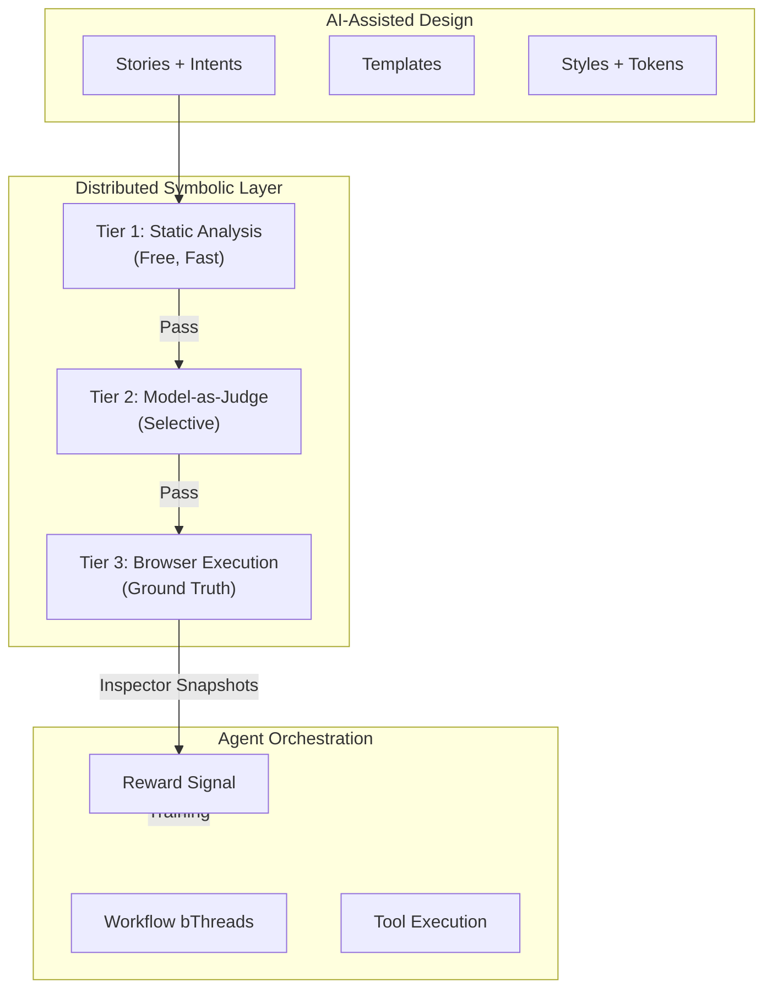
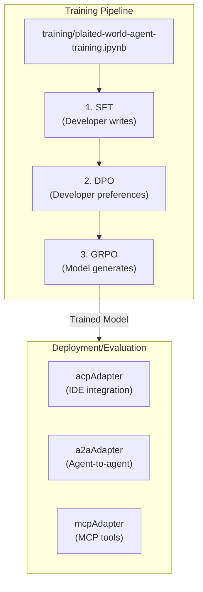
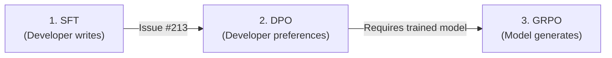

# Neuro-Symbolic World Agent Implementation Plan

> **For Claude Session Working on `src/agent-next/`**

This plan implements a neuro-symbolic world agent architecture combining:
- **Browser as World Model** - Stories execute in browser; play() validates exploration
- **Tiered Symbolic Analysis** - Static → Model-as-judge → Browser execution
- **Structural Vocabulary** - Objects, Channels, Levers, Loops, Blocks

## Philosophy



## Key Architectural Insight: Browser as World

From examining `src/testing/plaited-fixture.tsx` and `src/workshop/get-server.ts`:

1. **Stories execute in browser** - The browser IS the world model
2. **play() is simulated user** - Model generates actions exploring the world
3. **Inspector snapshots are observations** - Browser sends state to server via WebSocket
4. **Assertions provide reward signal** - Pass/fail feeds training

**This means:**
- bThreads in agent orchestrate workflow, NOT structural validation
- Structural validation happens via tiered analysis (static → model → browser)
- Agent bThreads ensure proper sequencing (generate → validate → execute)

---

## Tiered Symbolic Analysis

### Tier 1: Static Analysis (Free, Fast)

Pre-execution checks that catch common issues:

| Check | Implementation | Catches |
|-------|----------------|---------|
| **Token usage** | Regex for `createTokens` refs | Missing token imports |
| **Accessibility** | AST for `aria-*` attrs | Missing labels |
| **Loop completeness** | `p-trigger` → handler pairs | Incomplete interactions |
| **Import validation** | Module resolution | Missing dependencies |
| **Style validation** | `createStyles` pattern check | Invalid CSS-in-JS |

```typescript
// src/agent-next/static-analysis.ts
export type StaticAnalysisResult = {
  passed: boolean
  tier: 1
  checks: Array<{
    name: string
    passed: boolean
    message?: string
  }>
}

export const runStaticAnalysis = async (
  code: string,
  options?: { tokenPath?: string }
): Promise<StaticAnalysisResult> => {
  const checks = [
    checkTokenUsage(code, options?.tokenPath),
    checkAccessibility(code),
    checkLoopCompleteness(code),
    checkImports(code),
    checkStylePatterns(code),
  ]
  return {
    passed: checks.every(c => c.passed),
    tier: 1,
    checks,
  }
}
```

### Tier 2: Model-as-Judge (Selective)

For subjective quality that static analysis can't catch:

| Aspect | Prompt Pattern |
|--------|---------------|
| **Naming** | "Does this name clearly describe the element's purpose?" |
| **Structure** | "Is this the appropriate structural pattern for the intent?" |
| **Composition** | "Are these objects grouped correctly for the user's task?" |

```typescript
// src/agent-next/model-judge.ts
export type JudgeResult = {
  passed: boolean
  tier: 2
  score: number  // 0-1 confidence
  reasoning: string
}

export const runModelJudge = async (
  code: string,
  intent: string,
  model: ModelClient
): Promise<JudgeResult> => {
  // Only invoke when Tier 1 passes
  // Uses small model (same FunctionGemma or Haiku)
}
```

### Tier 3: Browser Execution (Ground Truth)

Stories execute in browser via workshop:

```typescript
// Training flow
1. Generate code → Tier 1 static checks
2. If Tier 1 passes → Optional Tier 2 judge
3. If Tier 2 passes → Execute in browser (Tier 3)
4. Browser runs play() → Inspector sends snapshots
5. Assertions → Reward signal for training
```

---

## Agent bThreads: Workflow Orchestration

Agent bThreads coordinate workflow, NOT content validation:

```typescript
// src/agent-next/workflow-constraints.ts

/**
 * Enforce generation workflow sequence.
 *
 * @remarks
 * Ensures proper order: generate → validate → execute → feedback
 */
export const enforceWorkflowSequence: RulesFunction = bThread(
  [
    bSync({ waitFor: 'generate' }),
    bSync({
      waitFor: 'staticAnalysis',
      block: 'executeCode'  // Can't execute before validation
    }),
    bSync({
      waitFor: ({ type, detail }) =>
        type === 'staticAnalysis' && detail.passed,
      interrupt: ({ type, detail }) =>
        type === 'staticAnalysis' && !detail.passed  // Abort on failure
    }),
    bSync({ waitFor: 'executeCode' }),
  ],
  true,
)

/**
 * Budget enforcement.
 *
 * @remarks
 * Blocks tool calls that would exceed context budget.
 */
export const enforceContextBudget: RulesFunction = bThread(
  [
    bSync({
      block: ({ type, detail }) =>
        type === 'toolCall' &&
        !contextBudget.canFit(estimateToolTokens(detail.schema))
    })
  ],
  true,
)

/**
 * Concurrent generation limit.
 *
 * @remarks
 * Prevents runaway generation loops.
 */
export const limitConcurrentGeneration: RulesFunction = bThread(
  [
    bSync({
      block: ({ type }) => type === 'generate',
      waitFor: 'generationComplete'
    })
  ],
  true,
)
```

---

## Recommendations for Code Execution & Extensibility

### Current State Analysis

From examining `src/agent-next/`:

| File | Status | Purpose |
|------|--------|---------|
| `use-world-agent.ts` | Skeleton | TODOs for handlers |
| `agent-next.types.ts` | Partial | Basic events, needs extension |
| `tool-discovery.ts` | Complete | FTS5 + optional vector search |
| `skill-discovery.ts` | Complete | AgentSkills script execution |
| `context-budget.ts` | Complete | 32K token management |
| `use-orchestrator.ts` | Complete | Signal wiring |

### Missing Handlers

The current skeleton needs these handlers for code execution scenarios:

| Handler | Purpose | Priority |
|---------|---------|----------|
| `executeCode` | Sandbox code execution | High |
| `chainTools` | Compose tool sequences | High |
| `resolveTool` | Route to MCP/A2A/local | Medium |
| `staticAnalysis` | Run Tier 1 checks | High |
| `modelJudge` | Run Tier 2 evaluation | Medium |

### Recommended Event Extensions

```typescript
// Add to WorldAgentEvents in agent-next.types.ts

export type WorldAgentEvents =
  | { type: 'generate'; detail: { intent: string; context?: unknown } }
  | { type: 'cancel' }
  | { type: 'feedback'; detail: { result: StoryResult } }
  | { type: 'disconnect' }
  // Code execution events
  | { type: 'executeCode'; detail: { code: string; sandbox?: SandboxConfig } }
  | { type: 'chainTools'; detail: { calls: FunctionCall[]; sequential?: boolean } }
  | { type: 'resolveTool'; detail: { name: string; source?: ToolSource } }
  // Analysis events
  | { type: 'staticAnalysis'; detail: StaticAnalysisResult }
  | { type: 'modelJudge'; detail: JudgeResult }
  | { type: 'browserResult'; detail: StoryResult }

export type SandboxConfig = {
  allowWrite?: string[]
  denyRead?: string[]
  allowedDomains?: string[]
  timeout?: number
}

export type ToolSource = 'local' | 'mcp' | 'a2a' | 'skill'
```

### Extensibility Pattern

**Yes, developers CAN and SHOULD pass custom handlers and bThreads.**

The `useBehavioral` pattern already supports this. Recommended factory:

```typescript
// src/agent-next/use-world-agent.ts

export type WorldAgentConfig = {
  tools: ToolRegistry
  model: ModelClient
  contextBudget?: ContextBudget
  // Extension points
  customHandlers?: Partial<WorldAgentHandlers>
  customBThreads?: Record<string, ReturnType<typeof bThread>>
  constraints?: {
    skipTier2?: boolean  // Skip model-as-judge
    staticChecks?: string[]  // Which static checks to run
  }
  preferences?: UserPreferenceProfile  // For hybrid UI
}

export const createWorldAgent = (config: WorldAgentConfig) => {
  return useBehavioral<WorldAgentEvents, WorldAgentContext>({
    publicEvents: [
      'generate', 'cancel', 'feedback', 'disconnect',
      'executeCode', 'chainTools', 'resolveTool',
      ...Object.keys(config.customHandlers ?? {})
    ],

    async bProgram({ trigger, bThreads, bSync, bThread, disconnect, ...ctx }) {
      // 1. Register default workflow bThreads
      bThreads.set({
        enforceWorkflowSequence,
        enforceContextBudget,
        limitConcurrentGeneration,
      })

      // 2. Register preference constraints if provided
      if (config.preferences) {
        bThreads.set({
          enforcePreferences: createPreferenceConstraint(config.preferences)
        })
      }

      // 3. Register custom bThreads (can override defaults)
      if (config.customBThreads) {
        bThreads.set(config.customBThreads)
      }

      // 4. Build default handlers
      const defaultHandlers = {
        async generate({ intent, context }) { /* ... */ },
        async executeCode({ code, sandbox }) { /* ... */ },
        async chainTools({ calls, sequential }) { /* ... */ },
        async resolveTool({ name, source }) { /* ... */ },
        cancel() { /* ... */ },
        feedback({ result }) { /* ... */ },
        disconnect() { disconnect() },
      }

      // 5. Merge custom handlers (can override defaults)
      return { ...defaultHandlers, ...config.customHandlers }
    },
  })
}
```

### Code Executor Integration

For MCP sandboxing (per Anthropic articles):

```typescript
// src/agent-next/code-executor.ts

export type CodeExecutionResult = {
  success: boolean
  output?: unknown
  error?: string
  toolCalls?: Array<{ name: string; args: unknown; result: unknown }>
}

export const createCodeExecutor = (
  tools: ToolRegistry,
  sandbox?: SandboxConfig
): CodeExecutor => {
  return {
    async execute(code: string): Promise<CodeExecutionResult> {
      // 1. Pattern validation (fast, free)
      if (hasUnsafePatterns(code)) {
        return { success: false, error: 'Unsafe pattern detected' }
      }

      // 2. OS sandbox execution (if @anthropic-ai/sandbox-runtime available)
      // 3. Track tool calls made during execution
      // 4. Return structured result
    }
  }
}

const hasUnsafePatterns = (code: string): boolean => {
  const unsafe = [
    /process\.env/,
    /require\s*\(\s*['"]child_process['"]\)/,
    /eval\s*\(/,
    /Function\s*\(/,
  ]
  return unsafe.some(p => p.test(code))
}
```

### Skill Script Integration

Leverage existing `skill-discovery.ts` for tool resolution:

```typescript
// In resolveTool handler
async resolveTool({ name, source }) {
  switch (source) {
    case 'skill':
      // Use skill-discovery.ts
      const scripts = await discoverSkillScripts({ skillsRoot: '.claude/skills' })
      return scripts.find(s => s.qualifiedName === name)

    case 'mcp':
      // Route to MCP server
      return await mcpClient.getTool(name)

    case 'a2a':
      // Route to A2A agent
      return await a2aClient.getTool(name)

    default:
      // Local tool registry
      return config.tools.get(name)
  }
}
```

---

## User Preference Constraints (Hybrid UI)

Support familiar structures with generative content:

```typescript
// src/agent-next/preference-constraints.ts

/**
 * User preference profile for hybrid UI.
 *
 * @remarks
 * Allows users to specify familiar structures they prefer.
 * Generated content fills in the dynamic parts while
 * maintaining structural consistency.
 */
export type UserPreferenceProfile = {
  /** Preferred block patterns */
  preferredBlocks?: BlockType[]
  /** Preferred object groupings */
  preferredGroupings?: Array<'nested' | 'relational' | 'list' | 'steps'>
  /** Base templates to use as starting points */
  baseTemplates?: string[]
  /** Required structural patterns */
  requiredPatterns?: StructuralMetadata[]
}

/**
 * Create a preference constraint bThread.
 *
 * @remarks
 * Blocks generations that don't align with user preferences.
 * This creates hybrid UI: familiar structure + generative content.
 */
export const createPreferenceConstraint = (
  profile: UserPreferenceProfile
): RulesFunction => bThread(
  [
    bSync({
      block: ({ type, detail }) => {
        if (type !== 'toolResult' || detail.name !== 'writeTemplate') return false

        const structural = extractStructuralMetadata(detail.result?.content)

        // Block if block type doesn't match preference
        if (profile.preferredBlocks?.length) {
          if (!structural.block || !profile.preferredBlocks.includes(structural.block)) {
            return true
          }
        }

        // Block if grouping doesn't match preference
        if (profile.preferredGroupings?.length) {
          const hasPreferredGrouping = structural.objects.some(
            o => o.grouping && profile.preferredGroupings!.includes(o.grouping)
          )
          if (!hasPreferredGrouping) return true
        }

        return false
      }
    })
  ],
  true,
)
```

---

## Style & Token Analysis

### Style Validation (Tier 1)

```typescript
// src/agent-next/style-analysis.ts

export type StyleAnalysisResult = {
  usesCreateStyles: boolean
  usesCreateTokens: boolean
  tokenReferences: string[]
  invalidPatterns: string[]
}

/**
 * Check createStyles usage patterns.
 */
export const checkStylePatterns = (code: string): StaticCheck => {
  const issues: string[] = []

  // Must use createStyles, not inline styles
  if (/style=\{/.test(code) && !/createStyles/.test(code)) {
    issues.push('Use createStyles instead of inline styles')
  }

  // Token references should not be invoked
  if (/tokens\.\w+\(\)/.test(code)) {
    issues.push('Token references should not be invoked: use tokens.primary, not tokens.primary()')
  }

  // createHostStyles for custom element host styling
  if (/:host/.test(code) && !/createHostStyles/.test(code)) {
    issues.push('Use createHostStyles for :host pseudo-class styling')
  }

  return {
    name: 'stylePatterns',
    passed: issues.length === 0,
    message: issues.join('; '),
  }
}

/**
 * Check token usage and references.
 */
export const checkTokenUsage = (code: string, tokenPath?: string): StaticCheck => {
  const issues: string[] = []

  // If using color/spacing/typography values, should use tokens
  const hardcodedPatterns = [
    { pattern: /#[0-9a-fA-F]{3,6}/, message: 'Hardcoded color - use token' },
    { pattern: /\d+px(?!\s*\/\/)/, message: 'Hardcoded pixel value - consider token' },
  ]

  for (const { pattern, message } of hardcodedPatterns) {
    if (pattern.test(code)) {
      issues.push(message)
    }
  }

  return {
    name: 'tokenUsage',
    passed: issues.length === 0,
    message: issues.join('; '),
  }
}
```

---

## Training Pipeline Clarification

**Training uses Colab notebook, NOT adapters:**



### Trajectory Generation (Pre-Training)

```typescript
// .claude/skills/world-agent/scripts/generate-trajectories.ts

type TrajectoryWithStructure = {
  intent: string
  toolCalls: FunctionCall[]
  result: StoryResult
  structural: StructuralMetadata
  tiers: {
    static: StaticAnalysisResult
    judge?: JudgeResult
    browser: StoryResult
  }
}
```

---

## Implementation Tasks

### Task 1: Update Types (`agent-next.types.ts`)

Add:
- `SandboxConfig` for code execution
- Extended `WorldAgentEvents` with code execution events
- `UserPreferenceProfile` for hybrid UI
- `StaticAnalysisResult`, `JudgeResult` for tiered analysis

### Task 2: Create Static Analysis (`static-analysis.ts`)

Implement Tier 1 checks:
- Token usage validation
- Style pattern validation
- Accessibility checks
- Loop completeness
- Import validation

### Task 3: Create Workflow Constraints (`workflow-constraints.ts`)

Agent bThreads for orchestration:
- `enforceWorkflowSequence`
- `enforceContextBudget`
- `limitConcurrentGeneration`

### Task 4: Create Preference Constraints (`preference-constraints.ts`)

For hybrid UI:
- `UserPreferenceProfile` type
- `createPreferenceConstraint` factory

### Task 5: Update Agent Factory (`use-world-agent.ts`)

Extensible pattern:
- Accept `customHandlers` and `customBThreads`
- Add code execution handlers
- Integrate tiered analysis

### Task 6: Create Code Executor (`code-executor.ts`)

MCP sandboxing integration:
- Pattern validation (fast check)
- Sandbox execution
- Tool call tracking

### Task 7: Update Trajectory Generation

Extract tiered analysis results for training feedback.

### Task 8: Update Training Notebooks

**Training phases have dependencies:**



**Issue #213 must complete first** - SFT and DPO train the base model. Only then can GRPO run because it needs a model capable of generating reasonable outputs to improve upon.

**Separate notebooks by environment:**

| Notebook | Environment | Phases | Prerequisite |
|----------|-------------|--------|--------------|
| `plaited-world-agent-training.ipynb` | Colab (T4 GPU) | SFT + DPO | None (Issue #213) |
| `plaited-world-agent-grpo.ipynb` | Local (with browser) | GRPO | SFT model from Issue #213 |

**Why separate?** GRPO requires browser execution for reward computation. Colab doesn't provide browser access, so GRPO must run locally with Playwright.

#### Colab Notebook Updates (`plaited-world-agent-training.ipynb`)

Current notebook has SFT + DPO. Updates needed:

1. **Trajectory format update** - Include tiered analysis results
2. **Structural metadata** - Add to trajectory output
3. **Documentation** - Clarify that GRPO runs locally

#### Local GRPO Notebook (`plaited-world-agent-grpo.ipynb`)

New notebook for GRPO phase with browser reward:

**Phase 3: GRPO (Group Relative Policy Optimization)**

```python
# Cell: GRPO Training (Phase 3)
# Model generates → Browser validates → Reward signal
from trl import GRPOConfig, GRPOTrainer

grpo_config = GRPOConfig(
    output_dir="./grpo-output",
    num_train_epochs=1,
    per_device_train_batch_size=2,
    gradient_accumulation_steps=8,
    learning_rate=1e-6,  # Very low LR for GRPO
    logging_steps=10,
    save_steps=50,
    fp16=True,
    max_length=2048,
    # GRPO specific
    num_generations=4,  # Generate 4 candidates per intent
    temperature=0.8,
)

# Reward function connects to browser execution
def compute_reward(intent: str, generation: str) -> float:
    """
    Reward from tiered analysis:
    - Tier 1: Static analysis (fast, free)
    - Tier 2: Model-as-judge (selective)
    - Tier 3: Browser execution (ground truth)
    """
    # Run static analysis
    static_result = run_static_analysis(generation)
    if not static_result.passed:
        return 0.0  # Fast rejection

    # Run browser test (via workshop CLI)
    browser_result = run_browser_test(generation)

    # Compute reward from story result
    reward = 0.0
    if browser_result.passed:
        reward += 0.5  # Story passed
    if browser_result.a11y_passed:
        reward += 0.3  # Accessibility passed
    reward += 0.2 * (browser_result.passed_assertions / browser_result.total_assertions)

    return reward

grpo_trainer = GRPOTrainer(
    model=model,
    args=grpo_config,
    train_dataset=intent_dataset,  # Just intents, model generates
    reward_fn=compute_reward,
    tokenizer=tokenizer,
)

print("Starting GRPO training...")
grpo_trainer.train()
```

**Trajectory Format Update**

Update trajectory generation to include tiered analysis:

```python
# trajectories.jsonl format
{
  "messages": [...],
  "reward": 0.85,
  "tiers": {
    "static": {"passed": true, "checks": [...]},
    "judge": {"passed": true, "score": 0.9},
    "browser": {"passed": true, "a11y_passed": true}
  },
  "structural": {
    "objects": [...],
    "channel": "selection",
    "loops": [...],
    "levers": [...],
    "block": "pool"
  }
}
```

**Browser Integration Cell**

```python
# Cell: Browser Reward Function (for GRPO)
import subprocess
import json

def run_browser_test(code: str) -> dict:
    """Run story test via workshop CLI and return result."""
    # Write generated code to temp file
    temp_path = "/tmp/generated-story.tsx"
    with open(temp_path, "w") as f:
        f.write(code)

    # Run workshop test
    result = subprocess.run(
        ["bun", "plaited", "test", temp_path, "--json"],
        capture_output=True,
        text=True,
        timeout=30
    )

    if result.returncode == 0:
        return json.loads(result.stdout)
    else:
        return {"passed": False, "error": result.stderr}
```

---

## Verification Checklist

- [ ] Static analysis catches common issues (tokens, styles, a11y)
- [ ] Workflow bThreads enforce proper sequencing
- [ ] Custom handlers can be passed to agent
- [ ] Custom bThreads can override defaults
- [ ] Preference constraints enable hybrid UI
- [ ] Code execution uses sandbox when configured
- [ ] Tiered analysis feeds training rewards
- [ ] Training notebook has GRPO phase with browser reward
- [ ] Trajectory format includes tiers and structural metadata

---

## References

- [Anthropic Code Execution with MCP](https://www.anthropic.com/engineering/code-execution-with-mcp)
- [Anthropic Claude Code Sandboxing](https://www.anthropic.com/engineering/claude-code-sandboxing)
- [WebDreamer (arxiv:2411.06559)](https://arxiv.org/abs/2411.06559)
- [NNGroup AI Paradigm](https://www.nngroup.com/articles/ai-paradigm/) - Hybrid UI inspiration
- Structural vocabulary: `.claude/skills/loom/references/structural/`
- Training notebook: `training/plaited-world-agent-training.ipynb`
