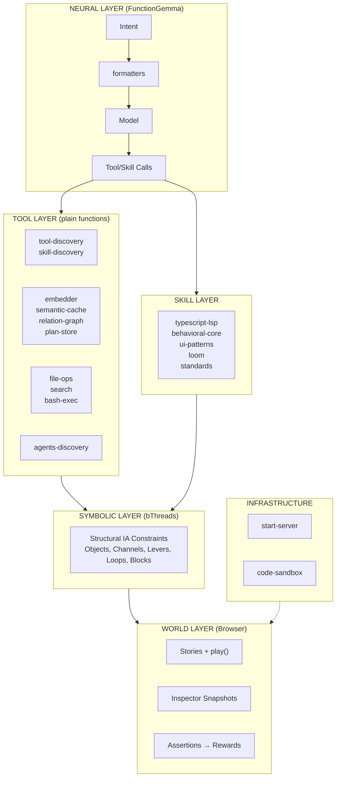
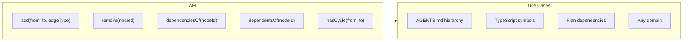
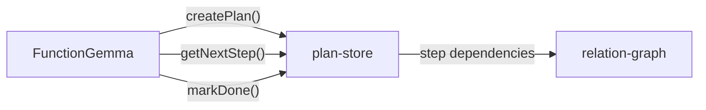

# Neuro-Symbolic World Agent Implementation Plan

> **For Claude Session Working on `src/agent`**

This plan implements a neuro-symbolic world agent architecture combining:
- **Browser as World Model** - Stories execute in browser; play() validates exploration
- **Tiered Symbolic Analysis** - Static → Model-as-judge → Browser execution
- **Structural Vocabulary** - Objects, Channels, Levers, Loops, Blocks

---

## Architecture Overview



---

## Tool Layer

Plain functions that FunctionGemma can call. Not behavioral programs.

### Existing (✅)

| Module | Purpose | Notes |
|--------|---------|-------|
| `tool-discovery` | FTS5 + vector search for tools | Hybrid RRF scoring |
| `skill-discovery` | FTS5 + vector search for skills | Persistent SQLite cache |
| `embedder` | node-llama-cpp GGUF embeddings | EmbeddingGemma-300m default |
| `semantic-cache` | Reuse responses for similar queries | Vector similarity |
| `formatters` | Tools → FunctionGemma tokens | Control tokens + parsing |

### To Build (🔲)

| Module | Purpose | Notes |
|--------|---------|-------|
| `file-ops` | read, write, edit | Bun.file(), Bun.write() |
| `search` | glob + grep | Bun.Glob, Bun.$ rg |
| `bash-exec` | terminal commands | Bun.$ |
| `relation-graph` | edge store + recursive CTE | generic, any domain |
| `plan-store` | multi-step plans | works with relation-graph |
| `agents-discovery` | AGENTS.md + refs | hierarchical, uses relation-graph |

### relation-graph



### plan-store

External context management for FunctionGemma's 32K limit.



### SQLite Strategy

- Each module accepts optional `sqlite?: { db?: Database, dbPath?: string }`
- Defaults to `:memory:`
- User can share DB across modules when needed

---

## Infrastructure

| Module | Purpose | Status |
|--------|---------|--------|
| `start-server` | Workshop subprocess | ✅ |
| `code-sandbox` | @anthropic-ai/sandbox-runtime | 🔲 port from old branch |

---

## Refactor Notes

| File | Action |
|------|--------|
| `agent.types.ts` | Fix stale comment - says MiniLM but uses EmbeddingGemma |

---

## Next Steps

### Immediate (Next Session)

1. **Create `relation-graph.ts`**
   - SQLite table: `edges (from_node, to_node, edge_type, metadata)`
   - Recursive CTE for dependenciesOf/dependentsOf
   - Cycle detection before insert
   - Tests in `tests/relation-graph.spec.ts`

2. **Create `plan-store.ts`**
   - Tables: `plans`, `steps`
   - Steps reference edges via relation-graph
   - Tests in `tests/plan-store.spec.ts`

### Following Sessions

3. Port `code-sandbox.ts` from old branch
4. Create `file-ops.ts`, `search.ts`, `bash-exec.ts`
5. Create `agents-discovery.ts`

### Later

6. Symbolic Layer - bThreads for Structural IA constraints
7. World Agent factory
8. Adapters (ACP, A2A, MCP)

---

## Session Pickup Notes

**Last Session Context:**
- Verified 121 tests passing in src/agent/
- Installed node-llama-cpp dependency
- Tool layer = plain functions, not behavioral
- relation-graph is generic (not tied to specific domain)
- SQLite sharing via optional config

**Key References:**
- Structural IA: `.claude/skills/loom/references/structural/`
- Behavioral Core: `.claude/skills/behavioral-core/`
- Old code-sandbox: `github.com/plaited/plaited/blob/c76bd81.../src/agent/code-sandbox.ts`

**Start Next Session With:**
```
Read PLAITED-AGENT-PLAN.md and continue from "Next Steps > Immediate"
```
