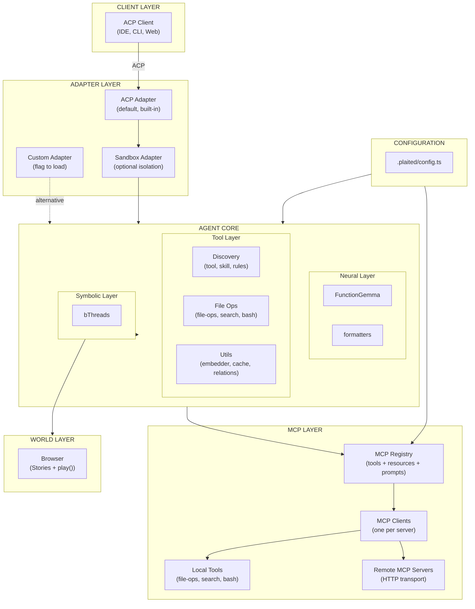
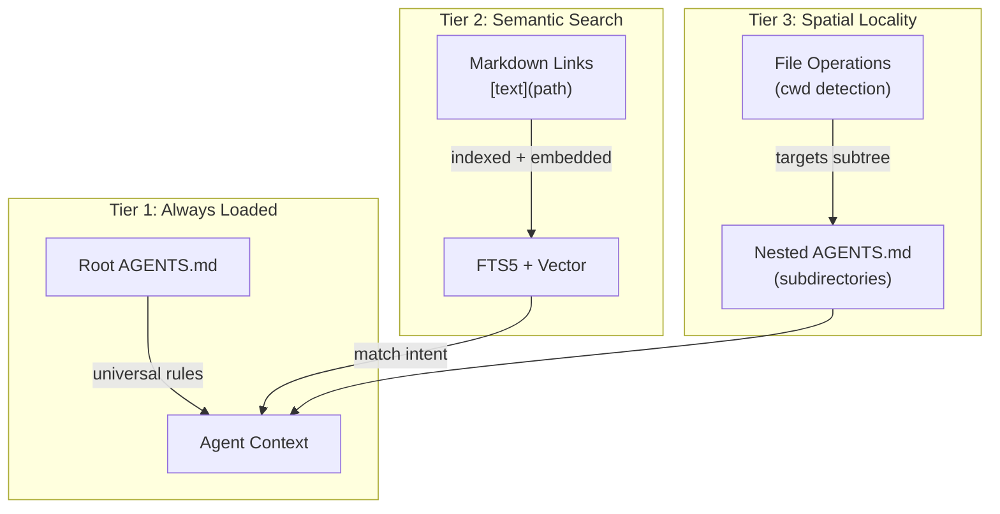
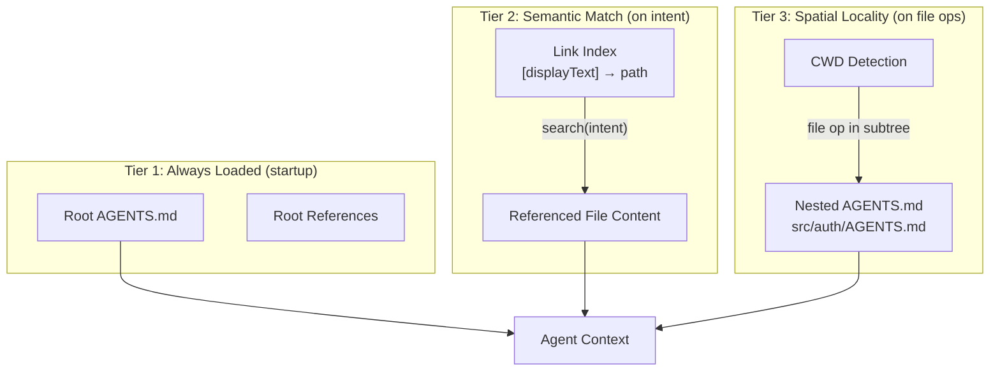
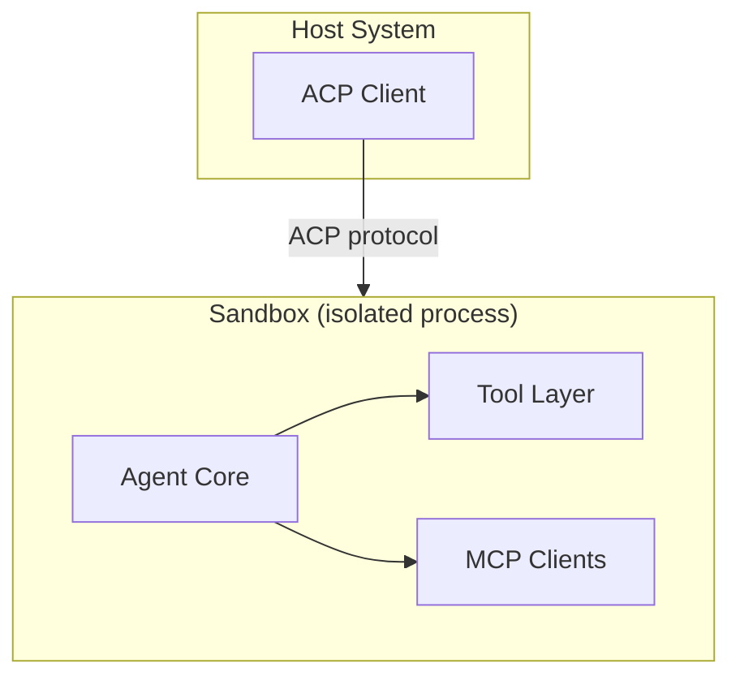

# Neuro-Symbolic World Agent Implementation Plan

> **For Claude Session Working on `src/agent`**

This plan implements a neuro-symbolic world agent architecture combining:
- **Browser as World Model** - Stories execute in browser; play() validates exploration
- **Tiered Symbolic Analysis** - Static → Model-as-judge → Browser execution
- **Structural Vocabulary** - Objects, Channels, Levers, Loops, Blocks
- **Protocol Layers** - ACP (client), MCP (tools), A2A (future agents)
- **Adapter Pattern** - Agent wrappable by sandbox, ACP, A2A adapters

---

## Architecture Overview



### Protocol Stack

| Protocol | Direction | Purpose | Status |
|----------|-----------|---------|--------|
| **ACP** | Client ↔ Agent | Session, prompts, responses | Default adapter |
| **MCP** | Agent ↔ Tools | Tools, resources, prompts | Unified registry |
| **A2A** | Agent ↔ Agent | Multi-agent collaboration | Future (separate layer) |

### Key Architectural Decisions

1. **ACP as default adapter** - Built-in, with flag to load custom adapters
2. **Sandbox wraps agent** - Not a tool, an adapter layer
3. **One MCP client per server** - Dynamic provisioning based on config
4. **MCP Registry** - Unified for tools + resources + prompts with FTS5 + embeddings
5. **Remote MCP first** - HTTP transport, stdio later
6. **A2A is NOT a ToolSource** - Separate collaboration layer (future)
7. **Config file** - `.plaited/config.ts` for local development

---

## Storage Strategy: Right Tool for the Job

Different modules need different storage patterns. Use the simplest tool that meets the requirements.

| Need | Tool | Rationale |
|------|------|-----------|
| **Full-text search with ranking** | SQLite + FTS5 | BM25, prefix matching, tokenization built-in |
| **Simple key-value with TTL** | In-memory Map | No query complexity needed |
| **Graph traversal (DAG)** | In-memory Map | Traversal, not search |
| **Structured queries with joins** | SQLite | Relational data with FK constraints |

### Persistence Philosophy

Modules that don't need SQLite use pluggable persistence:
- **Initial data** - User loads from wherever (file, API, DB) and passes JSON
- **Persist callback** - User provides function to save; module calls it with current state

This decouples storage concerns and supports remote stores, cloud storage, or custom serialization.

### Module Storage Assignments

| Module | Storage | Persistence | Rationale |
|--------|---------|-------------|-----------|
| `tool-discovery` | SQLite + FTS5 | `dbPath` config | FTS5 for hybrid search |
| `skill-discovery` | SQLite + FTS5 | `dbPath` config | FTS5 + mtime cache |
| `semantic-cache` | In-memory Map | `onPersist` callback | Simple TTL key-value |
| `relation-store` | In-memory Map | `onPersist` callback | DAG traversal |

---

## Tool Layer

Plain functions that FunctionGemma can call. Not behavioral programs.

### Complete (✅)

| Module | Purpose | Storage | Status |
|--------|---------|---------|--------|
| `tool-discovery` | FTS5 + vector search for tools | SQLite | ✅ Hybrid RRF scoring |
| `skill-discovery` | FTS5 + vector search for skills | SQLite | ✅ + progressive references |
| `embedder` | node-llama-cpp GGUF embeddings | N/A | ✅ Shared by all modules |
| `semantic-cache` | Reuse responses for similar queries | Map + callback | ✅ Vector similarity |
| `formatters` | Tools → FunctionGemma tokens | N/A | ✅ Control tokens + parsing |
| `relation-store` | DAG for plans, files, agents | Map + callback | ✅ Multi-parent, LLM context |
| `file-ops` | read, write, edit | N/A | ✅ Bun.file(), Bun.write() |
| `search` | glob + grep | N/A | ✅ Bun.Glob, ripgrep |
| `bash-exec` | terminal commands | N/A | ✅ Bun.spawn + AbortController |
| `schema-utils` | Zod → ToolSchema | N/A | ✅ `zodToToolSchema()` |
| `markdown-links` | Extract `[text](path)` patterns | N/A | ✅ Shared utility |

---

## relation-store

Unified DAG for plans, file relationships, agent hierarchies, and any domain.

### Design Principles

1. **Multi-parent DAG** - Nodes can have multiple parents (not a tree)
2. **LLM-friendly context** - `NodeContext` is structured for model consumption
3. **In-memory first** - Fast traversal without SQLite overhead
4. **Pluggable persistence** - User provides `onPersist` callback
5. **Plans are just nodes** - No separate plan-store; use `edgeType: 'plan'` / `'step'`

### Types

```typescript
type NodeContext = {
  description: string
  status?: 'pending' | 'in_progress' | 'done' | 'failed'
  [key: string]: unknown  // Extensible
}

type RelationNode = {
  id: string
  parents: string[]       // DAG: multiple parents allowed
  edgeType: string        // 'plan', 'step', 'file', 'agent', etc.
  context: NodeContext
  createdAt: number
}

type RelationStoreConfig = {
  /** Called on persist() - user handles storage */
  onPersist?: (nodes: RelationNode[]) => void | Promise<void>
  /** Initial data - user already loaded it */
  initialNodes?: RelationNode[]
  /** Auto-persist on mutation (default: false) */
  autoPersist?: boolean
}
```

### API

```typescript
type RelationStore = {
  // Core CRUD
  add: (node: Omit<RelationNode, 'createdAt'>) => void
  update: (id: string, updates: Partial<NodeContext>) => void
  remove: (id: string) => void
  get: (id: string) => RelationNode | undefined
  has: (id: string) => boolean

  // Traversal
  ancestors: (id: string) => RelationNode[]
  descendants: (id: string) => RelationNode[]
  parents: (id: string) => RelationNode[]
  children: (id: string) => RelationNode[]
  roots: () => RelationNode[]
  leaves: () => RelationNode[]

  // Filtering
  byEdgeType: (edgeType: string) => RelationNode[]
  byStatus: (status: NodeContext['status']) => RelationNode[]

  // DAG Safety
  wouldCreateCycle: (from: string, toParents: string[]) => boolean

  // LLM Integration
  toContext: (ids: string[]) => string

  // Persistence
  persist: () => void | Promise<void>

  // Utilities
  all: () => RelationNode[]
  clear: () => void
  size: () => number
}
```

### Usage Example

```typescript
// User loads data however they want
const savedData = await loadFromSomewhere()

const store = createRelationStore({
  initialNodes: savedData,
  onPersist: (nodes) => saveToSomewhere(nodes)
})

// Create a plan with steps
store.add({
  id: 'plan-auth',
  parents: [],
  edgeType: 'plan',
  context: { description: 'Implement auth', status: 'in_progress' }
})

store.add({
  id: 'step-1',
  parents: ['plan-auth'],
  edgeType: 'step',
  context: { description: 'Create User model', status: 'pending' }
})

// Query
store.children('plan-auth')     // → [step-1]
store.byStatus('pending')       // → [step-1]
store.toContext(['plan-auth'])  // → formatted for FunctionGemma

// Persist when ready
await store.persist()
```

---

## rules-discovery

Progressive loading of AGENTS.md files and their markdown references. Renamed from `agents-discovery` to better reflect its purpose: loading rules and instructions for agent behavior.

### Context Budget

FunctionGemma has **37K token context** - more than initially assumed. This allows a hybrid approach:
- Root rules always loaded (universal instructions)
- Progressive loading for specifics (semantic search on intent)
- Spatial locality for nested rules (directory-scoped)

### Three-Tier Progressive Loading



### Loading Strategy

| Tier | Trigger | Content | Rationale |
|------|---------|---------|-----------|
| **1. Always** | Agent startup | Root `AGENTS.md` | Universal rules apply to all tasks |
| **2. Semantic** | Intent matches | `[text](path)` links | Load specific refs when relevant |
| **3. Spatial** | File ops in subtree | Nested `AGENTS.md` | Directory-specific conventions |

### Markdown Link Parsing

**Critical insight**: `skill-discovery.ts` does NOT currently parse markdown links `[text](path)` as structured references. It chunks the entire body text including markdown syntax.

For `rules-discovery`, we need to:
1. **Extract markdown links** - Parse `[display text](relative/path)` from AGENTS.md
2. **Index link text** - The display text is the semantic key for search
3. **Resolve paths** - Convert relative paths to absolute for loading
4. **Chunk content** - Index the referenced file content for semantic search

### Types

```typescript
type RuleReference = {
  displayText: string      // "[text]" portion - semantic key
  relativePath: string     // "(path)" portion - file location
  absolutePath: string     // Resolved from AGENTS.md location
  source: string           // Which AGENTS.md contains this link
}

type RulesDiscoveryConfig = {
  /** Root AGENTS.md path */
  rootPath: string
  /** SQLite database path */
  dbPath: string
  /** Embedder instance for semantic search */
  embedder: Embedder
  /** Current working directory for spatial locality */
  cwd?: string
}

type RulesDiscovery = {
  /** Get rules for an intent (Tier 2 semantic search) */
  getRulesForIntent: (intent: string) => Promise<string[]>
  /** Get rules for a file path (Tier 3 spatial locality) */
  getRulesForPath: (filePath: string) => Promise<string[]>
  /** Get root rules (Tier 1 always loaded) */
  getRootRules: () => string
  /** Refresh index (re-scan AGENTS.md files) */
  refresh: () => Promise<void>
  /** Close database connection */
  close: () => void
}
```

### AgentSkills Spec: Full Structure

The AgentSkills specification defines three optional directories beyond SKILL.md:

```
skill-name/
├── SKILL.md          # Required - metadata + instructions
├── scripts/          # Optional - executable code (already implemented ✅)
├── references/       # Optional - additional documentation (needs progressive loading)
└── assets/           # Optional - static resources (needs discovery)
```

**Reference implementation (skills-ref) is minimal:**
- Only parses frontmatter from SKILL.md
- Does NOT discover scripts, assets, or references
- Our `skill-discovery.ts` already exceeds this by discovering scripts

### Resource Handling Strategy

| Resource | Approach | Rationale |
|----------|----------|-----------|
| **SKILL.md body** | Progressive via markdown links | Reduce context bloat |
| **scripts/** | Agent parses body + calls bash-exec | Simple, no special infra |
| **references/** | Progressive loading by intent | Semantic search on display text |
| **assets/** | Deferred (no plan yet) | Low priority |

**Scripts are simple:**
1. `skill-discovery.ts` discovers scripts (metadata in DB)
2. Agent reads SKILL.md body → sees script documentation
3. Agent calls `bun scripts/foo.ts` via bash-exec
4. No caching or special handling needed

**References need progressive loading:**
```
.claude/skills/loom/
├── SKILL.md                          # Tier 1: Always loaded on skill match
│   ├── [templates](references/patterns/templates.md)   # Tier 2: Indexed
│   └── [tool-layer](references/weaving/tool-layer.md)
└── references/
    ├── patterns/
    │   └── templates.md              # Loaded when "templates" matches intent
    └── weaving/
        └── tool-layer.md
```

### Shared Utility

```typescript
// markdown-links.ts - shared by skill-discovery and rules-discovery
type MarkdownLink = {
  displayText: string   // "[text]" portion - semantic key
  relativePath: string  // "(path)" portion - file location
  lineNumber: number    // Location in source file
}

export const extractMarkdownLinks = (content: string): MarkdownLink[]
```

### Implementation Priority

1. **markdown-links.ts** - Shared link extraction
2. **Enhance skill-discovery** - Add `searchReferences()` API
3. **rules-discovery** - Uses same patterns for AGENTS.md
4. **(Deferred) asset-discovery** - No immediate plan

---

## Infrastructure

| Module | Purpose | Status |
|--------|---------|--------|
| `start-server` | Workshop subprocess | ✅ |
| `rules-discovery` | AGENTS.md context management | ✅ |

**Why rules-discovery is infrastructure, not a tool:**
- Model doesn't call it directly (unlike tool-discovery, skill-discovery)
- Orchestrator uses it to manage context before/after tool calls
- Intercepts file operations to load spatial rules
- Loads root AGENTS.md at startup
- Provides context, not actions

---

## Protocol Layer

### ACP (Agent Client Protocol)

ACP is the **default adapter** for client-to-agent communication. Gemini CLI has built-in ACP support.

```typescript
// ACP Adapter interface
type ACPAdapter = {
  name: 'acp'
  wrap: (agent: Agent, config: ACPConfig) => ACPServer
}

type ACPConfig = {
  transport: 'stdio' | 'http'
  port?: number
  // MCP servers can come from ACP session/new OR config file
  mcpServers?: MCPServerConfig[]
}

// Custom adapters can be loaded via flag
// --adapter=./my-adapter.ts
type AdapterModule = {
  default: AgentAdapter
}
```

**Key features:**
- Default built-in adapter
- Flag to load custom adapters: `--adapter=./path/to/adapter.ts`
- MCP config can come from ACP `session/new` OR `.plaited/config.ts` (merged)

### MCP (Model Context Protocol)

MCP handles agent-to-tools communication with **three primitives**: Tools, Resources, Prompts.

```typescript
// Unified MCP Registry using FTS5 + embeddings (like tool-discovery)
type MCPRegistry = {
  // === Tools ===
  tools: {
    search: (query: string, options?: SearchOptions) => Promise<ToolMatch[]>
    register: (tool: MCPTool, serverId: string) => Promise<void>
    execute: (name: string, args: unknown, serverId: string) => Promise<ToolResult>
  }

  // === Resources ===
  resources: {
    search: (query: string, options?: SearchOptions) => Promise<ResourceMatch[]>
    register: (resource: MCPResource, serverId: string) => Promise<void>
    read: (uri: string, serverId: string) => Promise<ResourceContent>
    subscribe?: (uri: string, serverId: string) => AsyncIterable<ResourceUpdate>
  }

  // === Prompts ===
  prompts: {
    search: (query: string, options?: SearchOptions) => Promise<PromptMatch[]>
    register: (prompt: MCPPrompt, serverId: string) => Promise<void>
    get: (name: string, args?: unknown, serverId: string) => Promise<PromptContent>
  }

  // === Context Optimization ===
  // Uses FTS5 + embeddings to minimize context usage for FunctionGemma
  discoverRelevant: (intent: string, options?: DiscoveryOptions) => Promise<{
    tools: ToolMatch[]
    resources: ResourceMatch[]
    prompts: PromptMatch[]
  }>

  // === Server Management ===
  servers: {
    add: (config: MCPServerConfig) => Promise<MCPClient>
    remove: (serverId: string) => Promise<void>
    list: () => MCPServerConfig[]
    get: (serverId: string) => MCPClient | undefined
  }
}

// One MCP client per server (dynamically provisioned)
type MCPServerConfig = {
  id: string
  name: string
  transport: 'http' | 'stdio'  // HTTP first, stdio supported
  url?: string                  // For HTTP
  command?: string[]            // For stdio
  auth?: AuthConfig
}
```

**MCP Client Middleware/Hooks:**

```typescript
type MCPClientConfig = {
  server: MCPServerConfig

  // Hooks for extensibility (for auth, logging, pagination)
  hooks?: {
    // Auth (OAuth, bearer token)
    onAuth?: () => Promise<AuthToken>
    onAuthRefresh?: (expired: AuthToken) => Promise<AuthToken>

    // Request/Response
    onRequest?: (req: MCPRequest) => MCPRequest | Promise<MCPRequest>
    onResponse?: (res: MCPResponse) => MCPResponse | Promise<MCPResponse>

    // Logging
    onLog?: (log: MCPLog) => void

    // Pagination
    onPaginate?: (cursor: string) => Promise<boolean>
  }

  // Features
  features?: {
    completions?: boolean
    logging?: boolean
    sampling?: boolean
  }
}
```

**Implementation uses Anthropic MCP v2 SDK internally:**

```typescript
// Abstract interface (our stable API)
type MCPClient = { /* ... */ }

// Implementation uses @modelcontextprotocol/sdk v2
import { Client } from '@modelcontextprotocol/sdk'  // v2, no SSE
```

### A2A (Agent-to-Agent) - Future

A2A is a **separate layer** (like sandbox), NOT a ToolSource. Planned for multi-agent collaboration.

```typescript
// Future: A2A wraps agent like sandbox does
type A2AAdapter = {
  name: 'a2a'
  wrap: (agent: Agent, config: A2AConfig) => A2APeer
}

// ToolSource does NOT include 'a2a'
type ToolSource = 'local' | 'mcp' | 'skill'  // No 'a2a'
```

---

## Configuration

### `.plaited/config.ts`

```typescript
// .plaited/config.ts

import { defineConfig } from 'plaited/agent'

export default defineConfig({
  // Agent settings
  agent: {
    name: 'my-project-agent',
    model: 'functiongemma',
  },

  // MCP servers (merged with ACP session/new config)
  mcp: {
    servers: [
      {
        id: 'github',
        name: 'GitHub MCP',
        transport: 'http',
        url: 'https://mcp.github.com',
        auth: { type: 'oauth', clientId: process.env.GITHUB_CLIENT_ID },
      },
      {
        id: 'local-db',
        name: 'Local Database',
        transport: 'http',
        url: 'http://localhost:3001',
      },
    ],
    hooks: {
      onLog: (log) => console.log('[MCP]', log),
    },
  },

  // Skills (path relative to project root)
  skills: {
    root: '.plaited/skills',  // Default
  },

  // Rules
  rules: {
    root: 'AGENTS.md',
  },

  // Adapters
  adapters: {
    // Default: ACP
    acp: {
      transport: 'stdio',
    },
    // Optional: Sandbox (wraps agent)
    sandbox: {
      enabled: process.env.NODE_ENV === 'production',
      security: {
        allowWrite: ['./output'],
        denyRead: ['~/.ssh', '~/.aws', '.env'],
        allowedDomains: [],
      },
    },
  },

  // Scripts (promoted code - future)
  scripts: {
    persistence: 'file',
    path: '.plaited/scripts.json',
    expirationDays: 30,
  },
})
```

### Config Schema

```typescript
import { z } from 'zod'

const MCPServerSchema = z.object({
  id: z.string(),
  name: z.string(),
  transport: z.enum(['http', 'stdio']),
  url: z.string().optional(),
  command: z.array(z.string()).optional(),
  auth: z.object({
    type: z.enum(['oauth', 'bearer', 'none']),
    clientId: z.string().optional(),
    token: z.string().optional(),
  }).optional(),
})

const ConfigSchema = z.object({
  agent: z.object({
    name: z.string(),
    model: z.string().default('functiongemma'),
  }),
  mcp: z.object({
    servers: z.array(MCPServerSchema).default([]),
    hooks: z.object({}).passthrough().optional(),
  }).optional(),
  skills: z.object({
    root: z.string().default('.plaited/skills'),
  }).optional(),
  rules: z.object({
    root: z.string().default('AGENTS.md'),
  }).optional(),
  adapters: z.object({
    acp: z.object({
      transport: z.enum(['stdio', 'http']).default('stdio'),
      port: z.number().optional(),
    }).optional(),
    sandbox: z.object({
      enabled: z.boolean().default(false),
      security: z.object({
        allowWrite: z.array(z.string()).default([]),
        denyRead: z.array(z.string()).default(['~/.ssh', '~/.aws', '.env']),
        allowedDomains: z.array(z.string()).default([]),
      }).optional(),
    }).optional(),
  }).optional(),
  scripts: z.object({
    persistence: z.enum(['file', 'callback']).default('file'),
    path: z.string().optional(),
    expirationDays: z.number().default(30),
  }).optional(),
})

export type PlaitedConfig = z.infer<typeof ConfigSchema>
```

---

## Adapter Pattern

Adapters wrap the agent to expose it via different protocols or add capabilities.

```typescript
// Core agent interface (protocol-agnostic)
type Agent = {
  /** Process input, yield outputs */
  process: (input: AgentInput) => AsyncIterable<AgentOutput>

  /** Capabilities for discovery */
  capabilities: () => Capability[]

  /** MCP registry for tools/resources/prompts */
  mcp: MCPRegistry

  /** Lifecycle */
  start: () => Promise<void>
  stop: () => Promise<void>
}

// Adapter interface
type AgentAdapter<TConfig = unknown, TWrapped = unknown> = {
  name: string
  wrap: (agent: Agent, config: TConfig) => TWrapped
}

// Built-in adapters
const sandboxAdapter: AgentAdapter<SandboxConfig, SandboxedAgent>
const acpAdapter: AgentAdapter<ACPConfig, ACPServer>

// Future adapters
const a2aAdapter: AgentAdapter<A2AConfig, A2APeer>
const httpAdapter: AgentAdapter<HTTPConfig, HTTPServer>
```

### Composition

```typescript
// Local development
const agent = await createAgent(config)
const server = acpAdapter.wrap(agent, { transport: 'stdio' })

// Production (sandboxed)
const agent = await createAgent(config)
const sandboxed = sandboxAdapter.wrap(agent, sandboxConfig)
const server = acpAdapter.wrap(sandboxed, { transport: 'http', port: 3000 })

// Custom adapter via flag
// bun run agent --adapter=./my-adapter.ts
const customAdapter = await import(adapterPath)
const server = customAdapter.default.wrap(agent, customConfig)
```

---

## Detailed Infrastructure Specifications

### rules-discovery.ts

Three-tier progressive loading for AGENTS.md and markdown references.



#### Types

```typescript
type RuleReference = {
  /** Display text from `[text]` - semantic key */
  displayText: string
  /** Relative path from `(path)` */
  relativePath: string
  /** Resolved absolute path */
  absolutePath: string
  /** Source AGENTS.md that contains this link */
  source: string
  /** 1-indexed line number */
  lineNumber: number
}

type RulesDiscoveryConfig = {
  /** Root directory to scan for AGENTS.md */
  rootDir: string
  /** SQLite database path */
  dbPath?: string
  /** Embedder for semantic search (optional) */
  embedder?: Embedder
  /** Current working directory for spatial locality */
  cwd?: string
}

type RulesDiscovery = {
  /** Get root rules (Tier 1 - always loaded) */
  getRootRules: () => string

  /** Search references by intent (Tier 2 - semantic) */
  searchReferences: (intent: string, options?: { limit?: number }) => Promise<ReferenceMatch[]>

  /** Load reference content */
  getReferenceContent: (ref: RuleReference) => Promise<string | undefined>

  /** Get rules for a file path (Tier 3 - spatial) */
  getRulesForPath: (filePath: string) => string[]

  /** Refresh index */
  refresh: () => Promise<void>

  /** Get statistics */
  stats: () => RulesDiscoveryStats

  /** Close resources */
  close: () => Promise<void>
}
```

#### Database Schema

```sql
-- AGENTS.md files
CREATE TABLE IF NOT EXISTS rules (
  rowid INTEGER PRIMARY KEY AUTOINCREMENT,
  path TEXT UNIQUE NOT NULL,        -- Absolute path to AGENTS.md
  content TEXT NOT NULL,            -- Full content (for Tier 1/3)
  mtime INTEGER NOT NULL            -- File modification time
);

-- Markdown link references
CREATE TABLE IF NOT EXISTS rule_references (
  rowid INTEGER PRIMARY KEY AUTOINCREMENT,
  source_path TEXT NOT NULL,        -- Which AGENTS.md contains this
  display_text TEXT NOT NULL,       -- Semantic key for search
  relative_path TEXT NOT NULL,
  absolute_path TEXT NOT NULL,
  line_number INTEGER NOT NULL,
  FOREIGN KEY (source_path) REFERENCES rules(path) ON DELETE CASCADE
);

-- FTS5 for text search
CREATE VIRTUAL TABLE IF NOT EXISTS rules_fts USING fts5(
  display_text,
  content
);

CREATE INDEX IF NOT EXISTS idx_refs_source ON rule_references(source_path);
```

#### Implementation Notes

1. **Tier 1 (Always)**: Load root `AGENTS.md` at startup, cache in memory
2. **Tier 2 (Semantic)**: Index `[text](path)` links, embed displayText for search
3. **Tier 3 (Spatial)**: When file-ops targets a path, check for `AGENTS.md` in ancestors

**Spatial Loading Algorithm:**
```typescript
const getRulesForPath = (filePath: string): string[] => {
  const rules: string[] = []
  let dir = dirname(filePath)

  // Walk up to root, collecting AGENTS.md
  while (dir !== rootDir && !dir.endsWith('/')) {
    const agentsPath = join(dir, 'AGENTS.md')
    if (rulesCache.has(agentsPath)) {
      rules.unshift(rulesCache.get(agentsPath)!)
    }
    dir = dirname(dir)
  }

  return rules
}
```

---

### sandbox-adapter.ts

**Sandbox wraps the entire agent**, providing OS-level isolation for all operations.

#### Purpose

Wrap the agent in `@anthropic-ai/sandbox-runtime` for:
- File system isolation (all file-ops run inside sandbox)
- Network restrictions (controlled domains only)
- Resource limits (memory, CPU)
- Process isolation (agent can't escape)

#### Architecture



#### Types

```typescript
type SandboxConfig = {
  /** Enable sandbox (default: false in dev, true in production) */
  enabled: boolean
  /** Security settings */
  security?: {
    /** Allowed write paths (default: ['./output']) */
    allowWrite?: string[]
    /** Denied read paths (default: ['~/.ssh', '~/.aws', '.env']) */
    denyRead?: string[]
    /** Allowed network domains (default: []) */
    allowedDomains?: string[]
  }
  /** Resource limits */
  limits?: {
    /** Memory in bytes (default: 512MB) */
    memory?: number
    /** Timeout in ms (default: 300000) */
    timeout?: number
  }
}

type SandboxedAgent = Agent & {
  /** Get sandbox status */
  sandboxStatus: () => { isolated: boolean; pid?: number }
}

/** Adapter interface */
const sandboxAdapter: AgentAdapter<SandboxConfig, SandboxedAgent> = {
  name: 'sandbox',
  wrap: (agent, config) => { /* ... */ }
}
```

#### Composition with ACP

```typescript
// Development (no sandbox)
const agent = await createAgent(config)
const server = acpAdapter.wrap(agent, { transport: 'stdio' })

// Production (sandboxed)
const agent = await createAgent(config)
const sandboxed = sandboxAdapter.wrap(agent, {
  enabled: true,
  security: {
    allowWrite: ['./output'],
    denyRead: ['~/.ssh', '~/.aws', '.env'],
    allowedDomains: ['api.github.com'],
  },
})
const server = acpAdapter.wrap(sandboxed, { transport: 'http', port: 3000 })
```

#### Implementation Notes

1. **Runtime Detection**: Check if `@anthropic-ai/sandbox-runtime` is installed
2. **Graceful Fallback**: If not available in dev, warn; in production, fail
3. **Process Communication**: ACP messages pass through sandbox boundary
4. **MCP Inside Sandbox**: MCP clients run inside sandbox, subject to network rules

**Old Branch Reference (for patterns):**
```
github.com/plaited/plaited/blob/c76bd81.../src/agent/code-sandbox.ts
```

Key patterns to adapt:
- AbortController for timeout
- Stream handling for stdout/stderr
- Error normalization
- Security policy enforcement

---

## Refactor Notes

| File | Action | Status |
|------|--------|--------|
| `agent.types.ts` | Fix stale comment - says MiniLM but uses EmbeddingGemma | ✅ |
| `semantic-cache.ts` | Refactor from SQLite to Map + onPersist callback | ✅ |

---

## Next Steps

### Phase 1: Core Infrastructure (Current)

1. **Simplify `semantic-cache.ts`**
   - Remove SQLite dependency
   - Use in-memory Map for entries + embeddings
   - Add `onPersist` callback, `initialEntries` config
   - Keep same public API

2. **Create `relation-store.ts`**
   - In-memory Map<string, RelationNode>
   - Multi-parent DAG with cycle detection
   - `onPersist` callback for pluggable persistence
   - Tests in `tests/relation-store.spec.ts`

3. **Add `formatRelationsForContext()` to `formatters.ts`**
   - Format DAG nodes for FunctionGemma
   - Tree-style indentation with status

4. **Fix `agent.types.ts` stale comment**

### Phase 2: File Operations

5. **Create `file-ops.ts`**
   - `readFile()`, `writeFile()`, `editFile()`
   - Uses Bun.file(), Bun.write()

6. **Create `search.ts`**
   - `glob()`, `grep()`
   - Uses Bun.Glob, ripgrep via Bun.$

7. **Create `bash-exec.ts`**
   - `exec()` with timeout, cwd options
   - Uses Bun.$

### Phase 3: Progressive Loading Infrastructure ✅

8. **Create `markdown-links.ts`** (shared utility) ✅
   - `extractMarkdownLinks(content)` → `MarkdownLink[]`
   - Regex: `/(?<!!)\\[([^\\]]+)\\]\\(([^)]+)\\)/g` (excludes images)
   - Returns `{ displayText, relativePath, lineNumber }`
   - Options: `pathPattern`, `extensions`, `includeExternal`
   - Commit: `628e35e`

9. **Enhance `skill-discovery.ts`** with progressive references ✅
   - Index markdown links from SKILL.md body (`.md` files only)
   - Add `searchReferences(intent, options)` → vector search on displayText
   - Add `getReferences(skillName)` → cached references
   - Add `getReferenceContent(ref)` → load from disk
   - Store reference embeddings separately (referenceEmbeddings Map)
   - Commit: `4429e4b`

10. **Create `rules-discovery.ts`** (infrastructure) ✅
    - Three-tier progressive loading (Always → Semantic → Spatial)
    - Uses shared markdown-links.ts
    - SQLite + FTS5 for hybrid search (follow skill-discovery pattern)
    - Commit: `b805be5`

**Note:** Scripts handled by bash-exec (no special infra). Assets deferred (no plan).

### Phase 4: Protocol Layer

11. **Remove 'a2a' from ToolSource**
    - A2A is a separate adapter layer, not a tool source
    - Update `agent.types.ts` and `tool-discovery.ts`

12. **Create `mcp-registry.ts`** (unified registry)
    - FTS5 + embeddings for all three MCP primitives
    - Tools, Resources, Prompts with search/register/execute methods
    - `discoverRelevant(intent)` for context optimization

13. **Create `mcp-client.ts`** (one per server)
    - Dynamic provisioning based on config
    - Middleware/hooks for auth, logging, pagination
    - HTTP transport first, stdio supported
    - Uses `@modelcontextprotocol/sdk` v2 internally

14. **Create `acp-adapter.ts`** (default adapter)
    - Built-in ACP adapter
    - Wraps Agent → ACPServer
    - Support `--adapter=./path.ts` flag for custom adapters

15. **Create `sandbox-adapter.ts`** (optional wrapper)
    - Wraps agent in `@anthropic-ai/sandbox-runtime`
    - OS-level isolation for all agent operations
    - See detailed spec below

16. **Create `config-loader.ts`**
    - Load and validate `.plaited/config.ts`
    - Merge with ACP session/new config

### Phase 5: Symbolic Layer

17. **Symbolic Layer** - bThreads for Structural IA constraints
18. **World Agent factory**
19. **A2A adapter** (future multi-agent collaboration)

---

## Task Checklist

### Phase 1: Core Infrastructure ✅

- [x] Simplify `semantic-cache.ts` → Map + onPersist
- [x] Create `relation-store.ts`
- [x] Create `tests/relation-store.spec.ts`
- [x] Add `formatRelationsForContext()` to formatters.ts
- [x] Fix `agent.types.ts` stale comment
- [x] Add tool-layer.md reference to loom skill

### Phase 2: File Operations ✅

- [x] Create `file-ops.ts` with Zod schemas
- [x] Create `search.ts` (glob + grep)
- [x] Create `bash-exec.ts` with timeout
- [x] Create `schema-utils.ts` (zodToToolSchema)

### Phase 3: Progressive Loading ✅

- [x] Create `markdown-links.ts` (shared utility)
- [x] Enhance `skill-discovery.ts` with searchReferences, getReferences, getReferenceContent
- [x] Create `rules-discovery.ts` (infrastructure)

### Phase 4: Protocol Layer

- [ ] Create `mcp-registry.ts` (unified registry for tools + resources + prompts)
- [ ] Create `mcp-client.ts` (one per server, middleware/hooks support)
- [ ] Create `acp-adapter.ts` (default built-in adapter)
- [ ] Create `sandbox-adapter.ts` (optional, wraps agent)
- [ ] Create `config-loader.ts` (loads `.plaited/config.ts`)
- [ ] Create `agent.ts` (core protocol-agnostic agent)

### Phase 5: Symbolic Layer (Future)

- [ ] Symbolic Layer - bThreads for Structural IA constraints
- [ ] World Agent factory
- [ ] A2A adapter (future multi-agent collaboration)

---

## Session Pickup Notes

### Phase 1 Complete ✅
- `relation-store.ts` - Multi-parent DAG with cycle detection (41 tests)
- `semantic-cache.ts` - Refactored SQLite → Map + onPersist (27 tests)
- `formatters.ts` - Added `formatRelationsForContext()`, `formatPlanContext()`
- Commit: `232acfe`

### Phase 2 Complete ✅
- `file-ops.ts` + schemas - readFile, writeFile, editFile (11 tests)
- `search.ts` + schemas - glob (Bun.Glob) + grep (ripgrep) (12 tests)
- `bash-exec.ts` + schemas - exec with timeout (11 tests)
- `schema-utils.ts` - zodToToolSchema() (7 tests)
- Commit: `c6e9afe`

### Phase 3 Complete ✅
- ✅ `markdown-links.ts` - extractMarkdownLinks(), isExternalLink(), getExtension() (25 tests)
  - Commit: `628e35e`
- ✅ `skill-discovery.ts` enhanced with progressive references
  - Added: searchReferences(), getReferences(), getReferenceContent()
  - Added: SkillReference, ReferenceMatch types
  - Added: skill_references table, referenceEmbeddings Map
  - Commit: `4429e4b`
- ✅ `rules-discovery.ts` - Three-tier progressive loading (25 tests)
  - Commit: `b805be5`

### New Architectural Decisions (Phase 4 Planning)

- **ACP as default adapter**: Built-in adapter, with `--adapter=` flag for custom adapters
- **Sandbox wraps agent**: Not a tool inside agent, an adapter layer providing OS-level isolation
- **Unified MCP Registry**: Tools + Resources + Prompts with FTS5 + embeddings (like tool-discovery)
- **One MCP client per server**: Dynamic provisioning based on config
- **HTTP transport first**: For MCP, stdio supported but secondary
- **A2A is NOT a ToolSource**: Separate layer (like sandbox), not `'a2a'` in ToolSource union
- **Config file**: `.plaited/config.ts` for local development settings

### Key Design Decisions
- SQLite + FTS5 for search (tool-discovery, skill-discovery, rules-discovery)
- In-memory Map + callback persistence for semantic-cache, relation-store
- Zod for tool schemas: Runtime validation + `z.toJSONSchema()` → ToolSchema
- Object pattern for 2+ params (typed values)
- Plans are just relation nodes with `edgeType: 'plan'` / `'step'`
- **Progressive loading**: displayText as semantic key, absolutePath resolved at index time

### Key References
- Tool Layer Docs: `.claude/skills/loom/references/weaving/tool-layer.md`
- skill-discovery.ts: Pattern for SQLite + FTS5 + progressive references
- Old code-sandbox: `github.com/plaited/plaited/blob/c76bd81.../src/agent/code-sandbox.ts`

### Current Module Inventory

```
src/agent/
├── agent.types.ts           # ✅ Shared types (ToolSource: 'local' | 'mcp' | 'skill')
├── embedder.ts              # ✅ GGUF embeddings
├── formatters.ts            # ✅ FunctionGemma token formatting
├── schema-utils.ts          # ✅ Zod → ToolSchema
├── markdown-links.ts        # ✅ [text](path) extraction (shared)
│
├── discovery/               # Discovery modules
│   ├── tool-discovery.ts    # ✅ FTS5 + vector for tools
│   ├── skill-discovery.ts   # ✅ FTS5 + vector + progressive refs
│   └── rules-discovery.ts   # ✅ AGENTS.md context management
│
├── storage/                 # Storage modules
│   ├── semantic-cache.ts    # ✅ Map + onPersist for LLM responses
│   └── relation-store.ts    # ✅ DAG for plans, files, agents
│
├── tools/                   # Tool implementations
│   ├── file-ops.ts          # ✅ read, write, edit
│   ├── file-ops.schemas.ts
│   ├── search.ts            # ✅ glob + grep
│   ├── search.schemas.ts
│   ├── bash-exec.ts         # ✅ shell commands
│   └── bash-exec.schemas.ts
│
├── mcp/                     # 🔲 MCP layer (Phase 4)
│   ├── mcp.types.ts         # MCP types
│   ├── mcp-registry.ts      # Unified registry (tools + resources + prompts)
│   └── mcp-client.ts        # One client per server
│
├── adapters/                # 🔲 Protocol adapters (Phase 4)
│   ├── acp-adapter.ts       # Default ACP adapter
│   └── sandbox-adapter.ts   # Optional OS-level isolation
│
├── config/                  # 🔲 Configuration (Phase 4)
│   └── config-loader.ts     # Loads .plaited/config.ts
│
├── infrastructure/          # Infrastructure (not called by model)
│   └── start-server.ts      # ✅ Workshop subprocess
│
└── agent.ts                 # 🔲 Core protocol-agnostic agent (Phase 4)
```

### Start Next Session With

```
Read PLAITED-AGENT-PLAN.md and implement Phase 4 - Protocol Layer.

COMPLETED THIS SESSION:
- ✅ Removed 'a2a' from ToolSource (agent.types.ts, tool-discovery.ts, tests)
- ✅ Updated tool-layer.md with new architecture
- ✅ Updated folder structure (1-level subfolders)
- ✅ Config uses singular skills.root defaulting to '.plaited/skills'

PHASE 4 IMPLEMENTATION ORDER:

1. Create folder structure
   - mkdir -p src/agent/{discovery,storage,tools,mcp,adapters,config,infrastructure}
   - Move existing files into subfolders
   - Update imports

2. Create src/agent/config/config-loader.ts
   - Load and validate .plaited/config.ts
   - Export defineConfig() helper
   - Zod schema validation

3. Create src/agent/mcp/mcp.types.ts
   - MCPRegistry, MCPClient, MCPServerConfig types
   - Tool, Resource, Prompt primitives

4. Create src/agent/mcp/mcp-client.ts
   - One client per server
   - Middleware/hooks for auth, logging
   - HTTP transport first, stdio supported
   - Uses @modelcontextprotocol/sdk internally

5. Create src/agent/mcp/mcp-registry.ts
   - Unified registry for tools + resources + prompts
   - FTS5 + embeddings (follow tool-discovery pattern)
   - discoverRelevant(intent) for context optimization

6. Create src/agent/adapters/acp-adapter.ts
   - Default built-in adapter
   - Wraps Agent → ACPServer

7. Create src/agent/adapters/sandbox-adapter.ts
   - Optional OS-level isolation wrapper
   - Uses @anthropic-ai/sandbox-runtime

KEY ARCHITECTURAL DECISIONS:
- ACP is default adapter (Gemini CLI compatible)
- Sandbox wraps entire agent (not a tool)
- A2A is separate layer (future), NOT a ToolSource
- MCP Registry unifies tools + resources + prompts
- Config at .plaited/config.ts, skills at .plaited/skills
```
