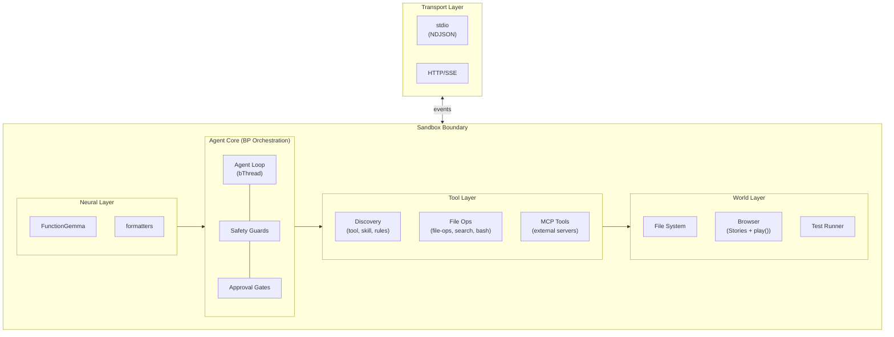
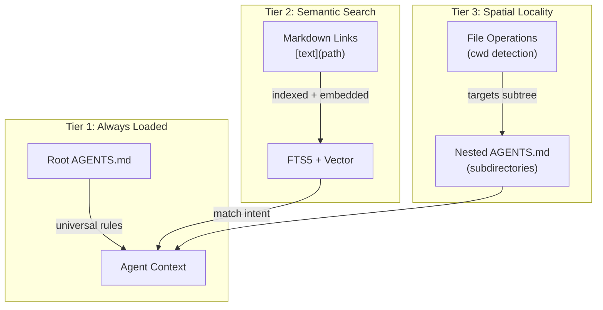

# Neuro-Symbolic World Agent Implementation Plan

> **For Claude Session Working on `src/agent`**

This plan implements a **headless-first** neuro-symbolic world agent architecture combining:
- **Browser as World Model** - Stories execute in browser; play() validates exploration
- **Tiered Symbolic Analysis** - Static → Model-as-judge → Browser execution
- **Structural Vocabulary** - Objects, Channels, Levers, Loops, Blocks
- **BP-Based Orchestration** - `useBehavioral()` for agent loop coordination
- **Dual-Mode Operation** - Structured (approval gates) OR Wiggum ("let it cook")
- **Headless Core** - Agent-first design with thin transport wrappers

---

## Architecture Overview



### Key Architectural Decisions

1. **BP-Based Agent Loop** - Use `useBehavioral()` for orchestration
2. **Dual-Mode Operation** - Structured (approval gates) OR Wiggum ("let it cook")
3. **Hybrid Tool Approach** - BASH-first with typed tools as alternatives
4. **Sandbox Wraps Agent** - OS-level isolation, active in BOTH modes
5. **FunctionGemma + Injection** - Default to local model, inject mock for testing
6. **Thin Transports** - stdio/HTTP are simple I/O wrappers, not protocol adapters
7. **AsyncGenerator Streaming** - All output via `yield` events

---

## Storage Strategy: Right Tool for the Job

Different modules need different storage patterns. Use the simplest tool that meets the requirements.

| Need | Tool | Rationale |
|------|------|-----------|
| **Full-text search with ranking** | SQLite + FTS5 | BM25, prefix matching, tokenization built-in |
| **Simple key-value with TTL** | In-memory Map | No query complexity needed |
| **Graph traversal (DAG)** | In-memory Map | Traversal, not search |
| **Structured queries with joins** | SQLite | Relational data with FK constraints |

### Persistence Philosophy

Modules that don't need SQLite use pluggable persistence:
- **Initial data** - User loads from wherever (file, API, DB) and passes JSON
- **Persist callback** - User provides function to save; module calls it with current state

This decouples storage concerns and supports remote stores, cloud storage, or custom serialization.

### Module Storage Assignments

| Module | Storage | Persistence | Rationale |
|--------|---------|-------------|-----------|
| `tool-discovery` | SQLite + FTS5 | `dbPath` config | FTS5 for hybrid search |
| `skill-discovery` | SQLite + FTS5 | `dbPath` config | FTS5 + mtime cache |
| `semantic-cache` | In-memory Map | `onPersist` callback | Simple TTL key-value |
| `relation-store` | In-memory Map | `onPersist` callback | DAG traversal |

---

## Tool Layer (Phases 1-3 Complete ✅)

Plain functions that FunctionGemma can call. **311 passing tests.**

| Module | Purpose | Storage | Status |
|--------|---------|---------|--------|
| `tool-discovery` | FTS5 + vector search for tools | SQLite | ✅ 45 tests |
| `skill-discovery` | FTS5 + vector search for skills | SQLite | ✅ 62 tests |
| `rules-discovery` | Three-tier AGENTS.md loading | SQLite | ✅ 25 tests |
| `embedder` | node-llama-cpp GGUF embeddings | N/A | ✅ |
| `semantic-cache` | Reuse responses for similar queries | Map + callback | ✅ 27 tests |
| `formatters` | Tools → FunctionGemma tokens | N/A | ✅ 45 tests |
| `relation-store` | DAG for plans, files, agents | Map + callback | ✅ 41 tests |
| `file-ops` | read, write, edit | N/A | ✅ 11 tests |
| `search` | glob + grep | N/A | ✅ 12 tests |
| `bash-exec` | terminal commands | N/A | ✅ 11 tests |
| `schema-utils` | Zod → ToolSchema | N/A | ✅ |
| `markdown-links` | Extract `[text](path)` patterns | N/A | ✅ |

**Gap Analysis:** All core coding agent capabilities exist. Only gap is web fetch (add as MCP tool).

---

## relation-store

Unified DAG for plans, file relationships, agent hierarchies, and any domain.

### Design Principles

1. **Multi-parent DAG** - Nodes can have multiple parents (not a tree)
2. **LLM-friendly context** - `NodeContext` is structured for model consumption
3. **In-memory first** - Fast traversal without SQLite overhead
4. **Pluggable persistence** - User provides `onPersist` callback
5. **Plans are just nodes** - No separate plan-store; use `edgeType: 'plan'` / `'step'`

### Types

```typescript
type NodeContext = {
  description: string
  status?: 'pending' | 'in_progress' | 'done' | 'failed'
  [key: string]: unknown  // Extensible
}

type RelationNode = {
  id: string
  parents: string[]       // DAG: multiple parents allowed
  edgeType: string        // 'plan', 'step', 'file', 'agent', etc.
  context: NodeContext
  createdAt: number
}

type RelationStoreConfig = {
  /** Called on persist() - user handles storage */
  onPersist?: (nodes: RelationNode[]) => void | Promise<void>
  /** Initial data - user already loaded it */
  initialNodes?: RelationNode[]
  /** Auto-persist on mutation (default: false) */
  autoPersist?: boolean
}
```

### API

```typescript
type RelationStore = {
  // Core CRUD
  add: (node: Omit<RelationNode, 'createdAt'>) => void
  update: (id: string, updates: Partial<NodeContext>) => void
  remove: (id: string) => void
  get: (id: string) => RelationNode | undefined
  has: (id: string) => boolean

  // Traversal
  ancestors: (id: string) => RelationNode[]
  descendants: (id: string) => RelationNode[]
  parents: (id: string) => RelationNode[]
  children: (id: string) => RelationNode[]
  roots: () => RelationNode[]
  leaves: () => RelationNode[]

  // Filtering
  byEdgeType: (edgeType: string) => RelationNode[]
  byStatus: (status: NodeContext['status']) => RelationNode[]

  // DAG Safety
  wouldCreateCycle: (from: string, toParents: string[]) => boolean

  // LLM Integration
  toContext: (ids: string[]) => string

  // Persistence
  persist: () => void | Promise<void>

  // Utilities
  all: () => RelationNode[]
  clear: () => void
  size: () => number
}
```

---

## rules-discovery

Progressive loading of AGENTS.md files and their markdown references.

### Context Budget

FunctionGemma has **37K token context**. Hybrid approach:
- Root rules always loaded (universal instructions)
- Progressive loading for specifics (semantic search on intent)
- Spatial locality for nested rules (directory-scoped)

### Three-Tier Progressive Loading



| Tier | Trigger | Content | Rationale |
|------|---------|---------|-----------|
| **1. Always** | Agent startup | Root `AGENTS.md` | Universal rules apply to all tasks |
| **2. Semantic** | Intent matches | `[text](path)` links | Load specific refs when relevant |
| **3. Spatial** | File ops in subtree | Nested `AGENTS.md` | Directory-specific conventions |

---

## Phase 4: Headless Agent Core

### Dual-Mode Operation

Two modes, switchable at runtime:

| Mode | Pattern | Approval | Best For |
|------|---------|----------|----------|
| **Structured** | Think → Approve → Act → Observe | Required | High-risk, interactive |
| **Wiggum** | Bash → Check → Repeat until done | Bypassed | Well-defined, autonomous |

Both modes run inside the sandbox for defense-in-depth.

#### Structured Mode
- Full BP orchestration with approval gates
- Human oversight per action
- Use for: code review, sensitive changes, learning

#### Wiggum Mode ("Let It Cook")
- Inspired by Vercel's "BASH is all you need" and Anthropic's Ralph Wiggum
- Model generates BASH commands directly
- Iterates until task complete or max iterations
- "Failures are data" - errors become context for next attempt
- Use for: overnight batch jobs, well-defined tasks, generative UI

#### Generative UI Use Case

Wiggum mode is ideal for deployed generative UI agents:

```
User describes UI → Agent generates template/styles →
Browser validates (stories + play()) → Iterate until correct
```

Example flow:
1. **Generate**: Model produces `LoginForm.tsx` + `LoginForm.stories.tsx`
2. **Execute**: `bun plaited test LoginForm.stories.tsx`
3. **Check**: Did play() pass? Visual correct?
4. **Repeat**: Adjust and retry until done

---

### Hybrid Tool Approach

Following Vercel's insight that "we were building custom tools for what Unix already solves":

```typescript
const tools = {
  // PRIMARY: BASH is the main tool
  bash: {
    description: 'Execute any bash command',
    execute: (command: string) => exec({ command, timeout: 30000 })
  },

  // ALTERNATIVES: Typed tools for when model prefers them
  // Model can choose: `cat file.ts` OR `readFile({ path: 'file.ts' })`
  readFile: { ... },   // Alternative to cat/head/tail
  writeFile: { ... },  // Alternative to echo/cat heredoc
  editFile: { ... },   // Alternative to sed/patch
  search: { ... },     // Alternative to find/grep

  // DISCOVERY: Context management (not replaceable by BASH)
  discoverTools: { ... },
  discoverSkills: { ... },
  discoverRules: { ... }
}
```

| Approach | Tokens | Flexibility | Safety | Verdict |
|----------|--------|-------------|--------|---------|
| Typed tools only | High (many schemas) | Low | High | Over-engineered |
| BASH only | Low | High | Medium | May miss edge cases |
| **Hybrid** | Medium | High | High | Best of both |

The model can:
- Use BASH when it knows the command: `grep -r "TODO" src/`
- Use typed tools when convenient: `search({ pattern: 'TODO', glob: 'src/**' })`
- Discovery modules remain typed (context management, not BASH)

---

### Agent Loop as Behavioral Program

Core pattern using `useBehavioral()` for dual-mode orchestration:

```typescript
const createAgentLoop = useBehavioral<AgentEvents, AgentContext>({
  publicEvents: ['prompt', 'approval_response', 'cancel', 'setMode'],

  bProgram({ trigger, bThreads, bThread, bSync, modelCall, bash }) {
    let mode: 'structured' | 'wiggum' = 'structured'
    let iterationCount = 0
    let maxIterations = 100

    // =========================================================
    // STRUCTURED MODE - Full orchestration with approval gates
    // =========================================================
    const structuredLoop = bThread([
      bSync({ waitFor: 'prompt' }),
      bSync({ request: { type: 'think' } }),
      bSync({ waitFor: 'thought' }),
      bSync({ request: { type: 'act' } }),      // May be blocked by approval
      bSync({ waitFor: 'acted' }),
      bSync({ request: { type: 'observe' } }),
    ], true, { interrupt: 'enterWiggum' })

    const approvalGate = bThread([
      bSync({
        waitFor: ({ type, detail }) =>
          type === 'act' && requiresApproval(detail?.toolName)
      }),
      bSync({
        block: 'act',
        request: { type: 'approval_gate' }
      }),
      bSync({ waitFor: 'approval_response' })
    ], true, { interrupt: 'enterWiggum' })

    // =========================================================
    // WIGGUM MODE - "Let it cook" - BASH until done
    // =========================================================
    const wiggumLoop = bThread([
      bSync({ waitFor: 'enterWiggum' }),
      bSync({ request: { type: 'wiggum_generate' } }),
      bSync({ waitFor: 'wiggum_generated' }),
      bSync({ request: { type: 'wiggum_execute' } }),
      bSync({ waitFor: 'wiggum_executed' }),
      bSync({ request: { type: 'wiggum_check' } }),
      bSync({
        waitFor: ({ type, detail }) =>
          type === 'wiggum_checked' && (detail?.done || iterationCount >= maxIterations)
      }),
      bSync({ request: { type: 'wiggum_complete' } })
    ], true, { interrupt: 'exitWiggum' })

    // Iteration guard - prevents runaway loops
    const wiggumGuard = bThread([
      bSync({
        block: ({ type }) =>
          type === 'wiggum_execute' && iterationCount >= maxIterations
      })
    ], true)

    // =========================================================
    // SAFETY - Always active regardless of mode
    // =========================================================
    const safetyGuard = bThread([
      bSync({
        block: ({ type, detail }) =>
          (type === 'act' || type === 'wiggum_execute') &&
          isDangerous(detail?.command)
      })
    ], true)

    bThreads.set({
      structuredLoop,
      approvalGate,
      wiggumLoop,
      wiggumGuard,
      safetyGuard
    })

    return {
      // Mode switching
      setMode({ newMode, maxIter }) {
        mode = newMode
        maxIterations = maxIter ?? 100
        iterationCount = 0
        trigger({ type: newMode === 'wiggum' ? 'enterWiggum' : 'exitWiggum' })
      },

      // Structured mode handlers
      async think() {
        const response = await modelCall(messages, tools)
        trigger({ type: 'thought', detail: response })
      },
      async act(toolCall) {
        const result = await executeTool(toolCall)
        trigger({ type: 'acted', detail: result })
      },
      observe(result) {
        messages.push(formatResult(result))
        trigger({ type: 'prompt' })
      },

      // Wiggum mode handlers
      async wiggum_generate() {
        const response = await modelCall(messages, [{ name: 'bash', description: 'Execute any bash command' }])
        trigger({ type: 'wiggum_generated', detail: response })
      },
      async wiggum_execute({ command }) {
        iterationCount++
        emit({ type: 'iteration', count: iterationCount })
        const result = await bash.execute(command)
        messages.push({ role: 'assistant', content: `$ ${command}\n${result.stdout}\n${result.stderr}` })
        trigger({ type: 'wiggum_executed', detail: result })
      },
      async wiggum_check() {
        const response = await modelCall([...messages, { role: 'user', content: 'Are you done? Reply {"done": true/false}' }])
        trigger({ type: 'wiggum_checked', detail: JSON.parse(response.content) })
      },
      wiggum_complete() {
        emit({ type: 'done', stopReason: 'end_turn', iterations: iterationCount })
      },

      // Shared handlers
      approval_gate(event) { emit({ type: 'approval_gate', ...event }) },
      approval_response(decision) {
        trigger(decision.allow ? { type: 'approval_response' } : { type: 'acted', detail: { error: 'denied' } })
      },
      cancel() { /* interrupt terminates both modes */ }
    }
  }
})
```

### Why BP for Agent Orchestration

| Agent Challenge | BP Solution |
|-----------------|-------------|
| Non-blocking approval | `block` + `request: approval_gate` |
| Clean cancellation | `interrupt` idiom |
| Safety constraints | Additive blocking threads |
| Multi-step workflows | `bThread` sequences |
| Independent concerns | Thread composition |

---

### Model Integration

FunctionGemma-first with testing injection:

```typescript
type ModelCall = (
  messages: Message[],
  tools: ToolDefinition[]
) => AsyncGenerator<ModelChunk>

// Default: FunctionGemma via node-llama-cpp
const defaultModelCall: ModelCall = async function* (messages, tools) {
  const formatted = formatForFunctionGemma(tools)
  for await (const chunk of llamaCpp.generate(messages, formatted)) {
    yield chunk
  }
}

// Agent config accepts optional override
type AgentConfig = {
  cwd: string
  permissionMode: PermissionMode
  modelCall?: ModelCall  // Optional - for testing
  // ...
}

// Tests use mock
const mockModelCall: ModelCall = async function* () {
  yield { type: 'tool_use', name: 'Read', input: { path: '/test' } }
  yield { type: 'done' }
}

test('agent executes tool', async () => {
  const agent = createAgent({ ...config, modelCall: mockModelCall })
  const events = await collect(agent.run('read file'))
  expect(events).toContainEqual({ type: 'tool_use', ... })
})
```

### Why Not Full Pluggable Models

| Concern | Reality |
|---------|---------|
| Format divergence | Each model has different tool formats |
| Parsing divergence | Each model returns different structures |
| Premature abstraction | Building for hypotheticals |
| Complexity cost | 500+ lines vs 200 lines |

**Decision:** FunctionGemma-first. Single injection point for testing. Add models later if needed.

---

### Sandbox Architecture

Defense in depth: BP + Sandbox

| Layer | Protection | Structured Mode | Wiggum Mode |
|-------|------------|-----------------|-------------|
| **1. BP Safety Guard** | Blocks dangerous commands | ✅ | ✅ |
| **2. Approval Gates** | Human confirmation | ✅ | ❌ (bypassed) |
| **3. Iteration Limit** | Prevents runaway loops | N/A | ✅ |
| **4. Sandbox** | OS-level isolation | ✅ | ✅ |

Wiggum mode relaxes the BP layer (no approval) but sandbox remains strict.

#### Sandbox Wraps Entire Agent

```typescript
// Development: Direct execution (structured mode)
const agent = createAgent(config)
for await (const event of agent.run(prompt)) {
  console.log(event)
}

// Production: Sandboxed execution (either mode)
const sandboxed = sandboxAdapter.wrap(agent, {
  enabled: true,
  security: {
    allowWrite: ['./src', './tests', './.plaited'],
    denyRead: ['~/.ssh', '~/.aws', '.env'],
    allowedDomains: ['api.github.com']
  },
  limits: {
    timeout: 8 * 60 * 60 * 1000,  // 8 hours for Wiggum
    memory: 4 * 1024 * 1024 * 1024  // 4GB
  }
})

// Wiggum mode inside sandbox - safe autonomy
sandboxed.setMode({ newMode: 'wiggum', maxIterations: 1000 })
for await (const event of sandboxed.run(prompt)) {
  console.log(event)
}
```

#### Sandbox Implementation

Uses `@anthropic-ai/sandbox-runtime`:
- Spawns agent in isolated subprocess
- Restricts file system access
- Controls network access
- Passes events through IPC

```typescript
const sandboxAdapter = {
  wrap: (agent: Agent, config: SandboxConfig) => {
    if (!config.enabled) return agent

    return {
      async *run(prompt) {
        const subprocess = spawn(sandboxRuntime, {
          security: config.security
        })
        subprocess.stdin.write(JSON.stringify({ prompt }))

        for await (const line of subprocess.stdout) {
          yield JSON.parse(line) as AgentEvent
        }
      },
      cancel: () => subprocess.kill()
    }
  }
}
```

---

### Transport Layer

Thin wrappers, not protocol adapters. Transports simply convert AsyncGenerator to I/O format:

```typescript
// Stdio transport (CLI)
const stdioTransport = (agent: Agent) => {
  for await (const line of process.stdin) {
    const { prompt } = JSON.parse(line)
    for await (const event of agent.run(prompt)) {
      process.stdout.write(JSON.stringify(event) + '\n')
    }
  }
}

// HTTP/SSE transport (Web)
const httpTransport = (agent: Agent) => ({
  fetch: async (req: Request) => {
    const { prompt } = await req.json()
    return new Response(
      async function* () {
        for await (const event of agent.run(prompt)) {
          yield `data: ${JSON.stringify(event)}\n\n`
        }
      }(),
      { headers: { 'Content-Type': 'text/event-stream' } }
    )
  }
})
```

---

### Event Types

```typescript
type AgentEvent =
  | { type: 'init'; runId: string; model: string }
  | { type: 'thinking'; content: string }
  | { type: 'text'; content: string; isPartial: boolean }
  | { type: 'tool_use'; toolCallId: string; toolName: string; input: unknown }
  | { type: 'tool_result'; toolCallId: string; status: 'completed'|'failed'; output?: unknown }
  | { type: 'approval_gate'; gateId: string; toolName: string; input: unknown }
  | { type: 'iteration'; count: number }
  | { type: 'error'; code: string; message: string; recoverable: boolean }
  | { type: 'done'; stopReason: 'end_turn'|'cancelled'|'error'; result?: string; iterations?: number }
```

---

## MCP Integration

MCP handles agent-to-tools communication. One MCP client per server, unified registry.

### MCP Registry

```typescript
type MCPRegistry = {
  // === Tools ===
  tools: {
    search: (query: string, options?: SearchOptions) => Promise<ToolMatch[]>
    register: (tool: MCPTool, serverId: string) => Promise<void>
    execute: (name: string, args: unknown, serverId: string) => Promise<ToolResult>
  }

  // === Resources ===
  resources: {
    search: (query: string, options?: SearchOptions) => Promise<ResourceMatch[]>
    register: (resource: MCPResource, serverId: string) => Promise<void>
    read: (uri: string, serverId: string) => Promise<ResourceContent>
    subscribe?: (uri: string, serverId: string) => AsyncIterable<ResourceUpdate>
  }

  // === Prompts ===
  prompts: {
    search: (query: string, options?: SearchOptions) => Promise<PromptMatch[]>
    register: (prompt: MCPPrompt, serverId: string) => Promise<void>
    get: (name: string, args?: unknown, serverId: string) => Promise<PromptContent>
  }

  // === Context Optimization ===
  discoverRelevant: (intent: string) => Promise<{
    tools: ToolMatch[]
    resources: ResourceMatch[]
    prompts: PromptMatch[]
  }>

  // === Server Management ===
  servers: {
    add: (config: MCPServerConfig) => Promise<MCPClient>
    remove: (serverId: string) => Promise<void>
    list: () => MCPServerConfig[]
  }
}
```

### MCP Server Config

```typescript
type MCPServerConfig = {
  id: string
  name: string
  transport: 'http' | 'stdio'
  url?: string       // For HTTP
  command?: string[] // For stdio
  auth?: AuthConfig
}
```

---

## GRPO Training Integration

Wiggum mode naturally produces RL training data - each run generates (state, action, reward) tuples.

### Trajectory Format

```typescript
type Trajectory = {
  task_id: string
  prompt: string
  steps: Array<{
    state: string       // Current context (files, conversation)
    action: string      // BASH command generated
    observation: string // stdout/stderr result
    thinking?: string   // Model reasoning (optional)
  }>
  outcome: 'success' | 'failure'
  iterations: number
  reward: number        // 1 for success, 0 for failure, or graded
}
```

### Training Data Generation

```typescript
// Generate training trajectories from task dataset
const tasks = loadTaskDataset('training-tasks.jsonl')

for (const task of tasks) {
  const agent = createAgent(config)
  const sandboxed = sandboxAdapter.wrap(agent, sandboxConfig)

  sandboxed.setMode({ newMode: 'wiggum', maxIterations: 100 })

  const trajectory = captureTrajectory(sandboxed.run(task.prompt))
  await appendToFile('trajectories.jsonl', JSON.stringify(trajectory))
}
```

### Why Wiggum + GRPO Works

| Wiggum Feature | GRPO Benefit |
|----------------|--------------|
| "Failures are data" | Negative examples for training |
| Sandbox isolation | Safe exploration of action space |
| Clear done signal | Unambiguous reward assignment |
| BASH-first | Consistent, learnable action space |
| Iteration limit | Bounded trajectory length |

---

## Configuration

### `.plaited/config.ts`

```typescript
import { defineConfig } from 'plaited/agent'

export default defineConfig({
  agent: {
    name: 'my-project-agent',
    model: 'functiongemma',
  },

  // MCP servers
  mcp: {
    servers: [
      {
        id: 'github',
        name: 'GitHub MCP',
        transport: 'http',
        url: 'https://mcp.github.com',
      },
    ],
  },

  // Skills
  skills: {
    root: '.plaited/skills',
  },

  // Rules
  rules: {
    root: 'AGENTS.md',
  },

  // Sandbox (wraps agent)
  sandbox: {
    enabled: process.env.NODE_ENV === 'production',
    security: {
      allowWrite: ['./src', './tests', './.plaited'],
      denyRead: ['~/.ssh', '~/.aws', '.env'],
      allowedDomains: ['api.github.com'],
    },
    limits: {
      timeout: 8 * 60 * 60 * 1000, // 8 hours
      memory: 4 * 1024 * 1024 * 1024, // 4GB
    },
  },
})
```

---

## Implementation Order

### Phase 4A: Agent Core (Priority)

1. **`src/agent/core/agent.types.ts`**
   - AgentEvent discriminated union
   - AgentConfig with permissionMode
   - ModelCall type

2. **`src/agent/core/agent-loop.ts`**
   - BP-based orchestration using `useBehavioral()`
   - Think→Act→Observe cycle
   - Safety guards and approval gates

3. **`src/agent/core/agent.ts`**
   - `createAgent()` factory
   - AsyncGenerator `run()` method
   - FunctionGemma integration with injection point

4. **`src/agent/core/agent.spec.ts`**
   - Tests using mock modelCall
   - Verify event sequence
   - Test cancellation and approval

### Phase 4B: Transports

5. **`src/agent/transports/stdio.ts`**
   - NDJSON over stdin/stdout

6. **`src/agent/transports/http-sse.ts`**
   - POST /run with SSE response

### Phase 4C: Sandbox

7. **`src/agent/sandbox/sandbox-adapter.ts`**
   - Wrap agent in isolated subprocess
   - Security policy enforcement

### Phase 4D: MCP Integration

8. **`src/agent/mcp/mcp-client.ts`**
   - One client per server
   - HTTP transport

9. **`src/agent/mcp/mcp-registry.ts`**
   - Unified tools + resources + prompts
   - FTS5 + embeddings

### Phase 4E: Configuration

10. **`src/agent/config/config-loader.ts`**
    - Load `.plaited/config.ts`
    - Zod validation

---

## File Structure

```
src/agent/
├── core/
│   ├── agent.ts              # createAgent() factory
│   ├── agent.types.ts        # AgentEvent, AgentConfig
│   ├── agent-loop.ts         # BP orchestration (useBehavioral)
│   └── agent.spec.ts         # Tests with mock model
├── transports/
│   ├── stdio.ts              # NDJSON stdin/stdout
│   └── http-sse.ts           # HTTP with SSE
├── sandbox/
│   └── sandbox-adapter.ts    # OS-level isolation
├── mcp/
│   ├── mcp.types.ts
│   ├── mcp-client.ts
│   └── mcp-registry.ts
├── config/
│   └── config-loader.ts
└── [existing modules remain]
    ├── tool-discovery.ts
    ├── skill-discovery.ts
    ├── rules-discovery.ts
    ├── file-ops.ts
    ├── search.ts
    ├── bash-exec.ts
    ├── semantic-cache.ts
    ├── relation-store.ts
    ├── formatters.ts
    └── embedder.ts
```

---

## Verification

```bash
# Run agent tests (uses mock model - fast)
bun test src/agent/core

# Test stdio transport manually
echo '{"prompt":"List files in src/"}' | bun run src/agent/cli.ts

# Test HTTP transport
bun run src/agent/server.ts &
curl -X POST localhost:3000/run \
  -H 'Content-Type: application/json' \
  -H 'Accept: text/event-stream' \
  -d '{"prompt":"Hello"}'

# Test with real model (slow, requires GGUF)
PLAITED_MODEL=functiongemma bun test src/agent/core --timeout 60000
```

---

## Task Checklist

### Phase 1: Core Infrastructure ✅

- [x] Simplify `semantic-cache.ts` → Map + onPersist
- [x] Create `relation-store.ts`
- [x] Create `tests/relation-store.spec.ts`
- [x] Add `formatRelationsForContext()` to formatters.ts
- [x] Fix `agent.types.ts` stale comment
- [x] Add tool-layer.md reference to loom skill

### Phase 2: File Operations ✅

- [x] Create `file-ops.ts` with Zod schemas
- [x] Create `search.ts` (glob + grep)
- [x] Create `bash-exec.ts` with timeout
- [x] Create `schema-utils.ts` (zodToToolSchema)

### Phase 3: Progressive Loading ✅

- [x] Create `markdown-links.ts` (shared utility)
- [x] Enhance `skill-discovery.ts` with searchReferences, getReferences, getReferenceContent
- [x] Create `rules-discovery.ts` (infrastructure)

### Phase 4: Headless Agent Core

- [ ] Create `src/agent/core/agent.types.ts` (AgentEvent, AgentConfig, ModelCall)
- [ ] Create `src/agent/core/agent-loop.ts` (BP orchestration with dual modes)
- [ ] Create `src/agent/core/agent.ts` (createAgent factory)
- [ ] Create `src/agent/core/agent.spec.ts` (tests with mock model)
- [ ] Create `src/agent/transports/stdio.ts` (NDJSON transport)
- [ ] Create `src/agent/transports/http-sse.ts` (HTTP/SSE transport)
- [ ] Create `src/agent/sandbox/sandbox-adapter.ts` (OS-level isolation)
- [ ] Create `src/agent/mcp/mcp.types.ts` (MCP types)
- [ ] Create `src/agent/mcp/mcp-client.ts` (one client per server)
- [ ] Create `src/agent/mcp/mcp-registry.ts` (unified registry)
- [ ] Create `src/agent/config/config-loader.ts` (loads .plaited/config.ts)

### Phase 5: Symbolic Layer (Future)

- [ ] Symbolic Layer - bThreads for Structural IA constraints
- [ ] World Agent factory
- [ ] A2A layer (future multi-agent collaboration)

---

## Session Pickup Notes

### Phase 3 Complete ✅
- ✅ `markdown-links.ts` - extractMarkdownLinks(), isExternalLink(), getExtension() (25 tests)
- ✅ `skill-discovery.ts` enhanced with progressive references
- ✅ `rules-discovery.ts` - Three-tier progressive loading (25 tests)

### Key Architecture Changes (This Session)

| Removed | Added |
|---------|-------|
| ACP (Agent Client Protocol) section | BP-based agent loop |
| `acp-adapter.ts` references | Thin transports (stdio, HTTP) |
| Protocol-first design | Agent-first design |
| Complex adapter composition | Simple sandbox wrapper |
| ACP config examples | Dual-mode operation (Structured/Wiggum) |

### Key Design Decisions
- **BP-Based Agent Loop** - Use `useBehavioral()` for orchestration
- **Dual-Mode Operation** - Structured (approval gates) OR Wiggum ("let it cook")
- **Hybrid Tool Approach** - BASH-first with typed tools as alternatives
- **Sandbox Wraps Agent** - OS-level isolation, active in BOTH modes
- **FunctionGemma + Injection** - Default to local model, inject mock for testing
- **Thin Transports** - stdio/HTTP are simple I/O wrappers, not protocol adapters
- **AsyncGenerator Streaming** - All output via `yield` events

### Current Module Inventory

```
src/agent/
├── agent.types.ts           # ✅ Shared types (ToolSource: 'local' | 'mcp' | 'skill')
├── embedder.ts              # ✅ GGUF embeddings
├── formatters.ts            # ✅ FunctionGemma token formatting
├── schema-utils.ts          # ✅ Zod → ToolSchema
├── markdown-links.ts        # ✅ [text](path) extraction (shared)
│
├── discovery/               # Discovery modules
│   ├── tool-discovery.ts    # ✅ FTS5 + vector for tools
│   ├── skill-discovery.ts   # ✅ FTS5 + vector + progressive refs
│   └── rules-discovery.ts   # ✅ AGENTS.md context management
│
├── storage/                 # Storage modules
│   ├── semantic-cache.ts    # ✅ Map + onPersist for LLM responses
│   └── relation-store.ts    # ✅ DAG for plans, files, agents
│
├── tools/                   # Tool implementations
│   ├── file-ops.ts          # ✅ read, write, edit
│   ├── file-ops.schemas.ts
│   ├── search.ts            # ✅ glob + grep
│   ├── search.schemas.ts
│   ├── bash-exec.ts         # ✅ shell commands
│   └── bash-exec.schemas.ts
│
├── core/                    # 🔲 Agent Core (Phase 4A)
│   ├── agent.types.ts       # AgentEvent, AgentConfig, ModelCall
│   ├── agent-loop.ts        # BP orchestration (useBehavioral)
│   ├── agent.ts             # createAgent() factory
│   └── agent.spec.ts        # Tests with mock model
│
├── transports/              # 🔲 Transport Layer (Phase 4B)
│   ├── stdio.ts             # NDJSON stdin/stdout
│   └── http-sse.ts          # HTTP with SSE
│
├── sandbox/                 # 🔲 Sandbox (Phase 4C)
│   └── sandbox-adapter.ts   # OS-level isolation
│
├── mcp/                     # 🔲 MCP Layer (Phase 4D)
│   ├── mcp.types.ts         # MCP types
│   ├── mcp-client.ts        # One client per server
│   └── mcp-registry.ts      # Unified registry
│
├── config/                  # 🔲 Configuration (Phase 4E)
│   └── config-loader.ts     # Loads .plaited/config.ts
│
└── infrastructure/          # Infrastructure (not called by model)
    └── start-server.ts      # ✅ Workshop subprocess
```

### Start Next Session With

```
Read PLAITED-AGENT-PLAN.md and implement Phase 4A - Agent Core.

PHASE 4A IMPLEMENTATION ORDER:

1. Create src/agent/core/agent.types.ts
   - AgentEvent discriminated union
   - AgentConfig type
   - ModelCall type signature
   - PermissionMode type

2. Create src/agent/core/agent-loop.ts
   - BP-based orchestration using useBehavioral()
   - Dual-mode: Structured (approval gates) + Wiggum ("let it cook")
   - Safety guards (always active)
   - Iteration limits for Wiggum mode

3. Create src/agent/core/agent.ts
   - createAgent() factory
   - AsyncGenerator run() method
   - FunctionGemma integration with injection point

4. Create src/agent/core/agent.spec.ts
   - Tests using mock modelCall
   - Verify event sequence
   - Test cancellation and approval
   - Test mode switching

KEY PATTERNS:
- useBehavioral() from 'plaited' for BP orchestration
- bThread with interrupt for clean cancellation
- AsyncGenerator for streaming events
- modelCall injection for testing
```
