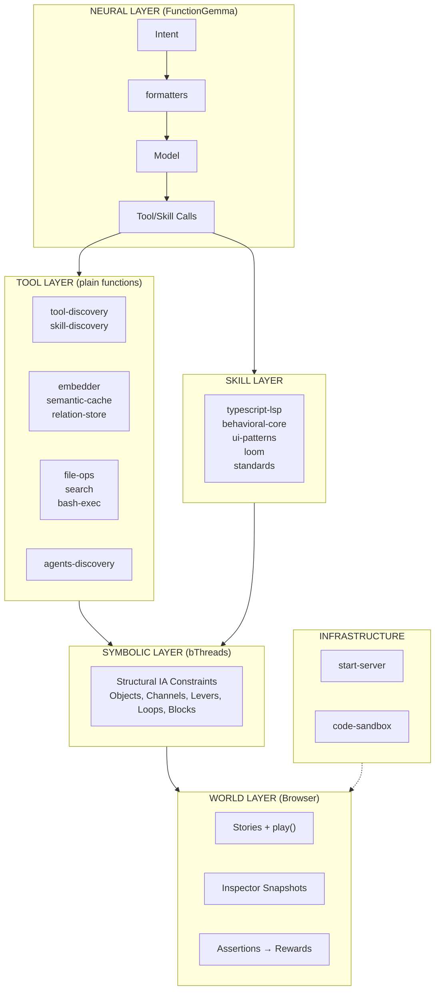

# Neuro-Symbolic World Agent Implementation Plan

> **For Claude Session Working on `src/agent`**

This plan implements a neuro-symbolic world agent architecture combining:
- **Browser as World Model** - Stories execute in browser; play() validates exploration
- **Tiered Symbolic Analysis** - Static → Model-as-judge → Browser execution
- **Structural Vocabulary** - Objects, Channels, Levers, Loops, Blocks

---

## Architecture Overview



---

## Storage Strategy: Right Tool for the Job

Different modules need different storage patterns. Use the simplest tool that meets the requirements.

| Need | Tool | Rationale |
|------|------|-----------|
| **Full-text search with ranking** | SQLite + FTS5 | BM25, prefix matching, tokenization built-in |
| **Simple key-value with TTL** | In-memory Map | No query complexity needed |
| **Graph traversal (DAG)** | In-memory Map | Traversal, not search |
| **Structured queries with joins** | SQLite | Relational data with FK constraints |

### Persistence Philosophy

Modules that don't need SQLite use pluggable persistence:
- **Initial data** - User loads from wherever (file, API, DB) and passes JSON
- **Persist callback** - User provides function to save; module calls it with current state

This decouples storage concerns and supports remote stores, cloud storage, or custom serialization.

### Module Storage Assignments

| Module | Storage | Persistence | Rationale |
|--------|---------|-------------|-----------|
| `tool-discovery` | SQLite + FTS5 | `dbPath` config | FTS5 for hybrid search |
| `skill-discovery` | SQLite + FTS5 | `dbPath` config | FTS5 + mtime cache |
| `semantic-cache` | In-memory Map | `onPersist` callback | Simple TTL key-value |
| `relation-store` | In-memory Map | `onPersist` callback | DAG traversal |

---

## Tool Layer

Plain functions that FunctionGemma can call. Not behavioral programs.

### Existing (✅)

| Module | Purpose | Storage | Notes |
|--------|---------|---------|-------|
| `tool-discovery` | FTS5 + vector search for tools | SQLite | Hybrid RRF scoring |
| `skill-discovery` | FTS5 + vector search for skills | SQLite | Persistent cache + mtime |
| `embedder` | node-llama-cpp GGUF embeddings | N/A | Shared by all modules |
| `semantic-cache` | Reuse responses for similar queries | Map + callback ✅ | Vector similarity |
| `formatters` | Tools → FunctionGemma tokens | N/A | Control tokens + parsing |

### Built (✅)

| Module | Purpose | Storage | Notes |
|--------|---------|---------|-------|
| `relation-store` | DAG for plans, files, agents | Map + callback | Multi-parent, LLM context |

### To Build (🔲)

| Module | Purpose | Storage | Notes |
|--------|---------|---------|-------|
| `file-ops` | read, write, edit | N/A | Bun.file(), Bun.write() |
| `search` | glob + grep | N/A | Bun.Glob, Bun.$ rg |
| `bash-exec` | terminal commands | N/A | Bun.$ |
| `agents-discovery` | AGENTS.md + refs | uses relation-store | Hierarchical file refs |

---

## relation-store

Unified DAG for plans, file relationships, agent hierarchies, and any domain.

### Design Principles

1. **Multi-parent DAG** - Nodes can have multiple parents (not a tree)
2. **LLM-friendly context** - `NodeContext` is structured for model consumption
3. **In-memory first** - Fast traversal without SQLite overhead
4. **Pluggable persistence** - User provides `onPersist` callback
5. **Plans are just nodes** - No separate plan-store; use `edgeType: 'plan'` / `'step'`

### Types

```typescript
type NodeContext = {
  description: string
  status?: 'pending' | 'in_progress' | 'done' | 'failed'
  [key: string]: unknown  // Extensible
}

type RelationNode = {
  id: string
  parents: string[]       // DAG: multiple parents allowed
  edgeType: string        // 'plan', 'step', 'file', 'agent', etc.
  context: NodeContext
  createdAt: number
}

type RelationStoreConfig = {
  /** Called on persist() - user handles storage */
  onPersist?: (nodes: RelationNode[]) => void | Promise<void>
  /** Initial data - user already loaded it */
  initialNodes?: RelationNode[]
  /** Auto-persist on mutation (default: false) */
  autoPersist?: boolean
}
```

### API

```typescript
type RelationStore = {
  // Core CRUD
  add: (node: Omit<RelationNode, 'createdAt'>) => void
  update: (id: string, updates: Partial<NodeContext>) => void
  remove: (id: string) => void
  get: (id: string) => RelationNode | undefined
  has: (id: string) => boolean

  // Traversal
  ancestors: (id: string) => RelationNode[]
  descendants: (id: string) => RelationNode[]
  parents: (id: string) => RelationNode[]
  children: (id: string) => RelationNode[]
  roots: () => RelationNode[]
  leaves: () => RelationNode[]

  // Filtering
  byEdgeType: (edgeType: string) => RelationNode[]
  byStatus: (status: NodeContext['status']) => RelationNode[]

  // DAG Safety
  wouldCreateCycle: (from: string, toParents: string[]) => boolean

  // LLM Integration
  toContext: (ids: string[]) => string

  // Persistence
  persist: () => void | Promise<void>

  // Utilities
  all: () => RelationNode[]
  clear: () => void
  size: () => number
}
```

### Usage Example

```typescript
// User loads data however they want
const savedData = await loadFromSomewhere()

const store = createRelationStore({
  initialNodes: savedData,
  onPersist: (nodes) => saveToSomewhere(nodes)
})

// Create a plan with steps
store.add({
  id: 'plan-auth',
  parents: [],
  edgeType: 'plan',
  context: { description: 'Implement auth', status: 'in_progress' }
})

store.add({
  id: 'step-1',
  parents: ['plan-auth'],
  edgeType: 'step',
  context: { description: 'Create User model', status: 'pending' }
})

// Query
store.children('plan-auth')     // → [step-1]
store.byStatus('pending')       // → [step-1]
store.toContext(['plan-auth'])  // → formatted for FunctionGemma

// Persist when ready
await store.persist()
```

---

## Infrastructure

| Module | Purpose | Status |
|--------|---------|--------|
| `start-server` | Workshop subprocess | ✅ |
| `code-sandbox` | @anthropic-ai/sandbox-runtime | 🔲 port from old branch |

---

## Refactor Notes

| File | Action | Status |
|------|--------|--------|
| `agent.types.ts` | Fix stale comment - says MiniLM but uses EmbeddingGemma | ✅ |
| `semantic-cache.ts` | Refactor from SQLite to Map + onPersist callback | ✅ |

---

## Next Steps

### Phase 1: Core Infrastructure (Current)

1. **Simplify `semantic-cache.ts`**
   - Remove SQLite dependency
   - Use in-memory Map for entries + embeddings
   - Add `onPersist` callback, `initialEntries` config
   - Keep same public API

2. **Create `relation-store.ts`**
   - In-memory Map<string, RelationNode>
   - Multi-parent DAG with cycle detection
   - `onPersist` callback for pluggable persistence
   - Tests in `tests/relation-store.spec.ts`

3. **Add `formatRelationsForContext()` to `formatters.ts`**
   - Format DAG nodes for FunctionGemma
   - Tree-style indentation with status

4. **Fix `agent.types.ts` stale comment**

### Phase 2: File Operations

5. **Create `file-ops.ts`**
   - `readFile()`, `writeFile()`, `editFile()`
   - Uses Bun.file(), Bun.write()

6. **Create `search.ts`**
   - `glob()`, `grep()`
   - Uses Bun.Glob, ripgrep via Bun.$

7. **Create `bash-exec.ts`**
   - `exec()` with timeout, cwd options
   - Uses Bun.$

### Phase 3: Discovery & Integration

8. **Create `agents-discovery.ts`**
   - Parse AGENTS.md and referenced files
   - Build hierarchy using relation-store
   - Extract rules, skills, patterns

9. **Port `code-sandbox.ts`**
   - From old branch
   - @anthropic-ai/sandbox-runtime integration

### Phase 4: Symbolic Layer

10. **Symbolic Layer** - bThreads for Structural IA constraints
11. **World Agent factory**
12. **Adapters** (ACP, A2A, MCP)

---

## Task Checklist

### Immediate (This Session)

- [x] Update PLAITED-AGENT-PLAN.md
- [x] Simplify `semantic-cache.ts` → Map + onPersist
- [x] Create `relation-store.ts`
- [x] Create `tests/relation-store.spec.ts`
- [x] Add `formatRelationsForContext()` to formatters.ts
- [x] Fix `agent.types.ts` stale comment
- [x] Add tool-layer.md reference to loom skill

### Following Sessions

- [ ] Create `file-ops.ts`
- [ ] Create `search.ts`
- [ ] Create `bash-exec.ts`
- [ ] Create `agents-discovery.ts`
- [ ] Port `code-sandbox.ts`

---

## Session Pickup Notes

**Completed in Phase 1 (Tool Layer Core):**
- ✅ Created `relation-store.ts` with multi-parent DAG, cycle detection, traversal
- ✅ Created `tests/relation-store.spec.ts` (41 tests passing)
- ✅ Refactored `semantic-cache.ts` from SQLite to Map + onPersist (27 tests passing)
- ✅ Added `formatRelationsForContext()` and `formatPlanContext()` to formatters.ts
- ✅ Fixed stale comment in `agent.types.ts` (MiniLM → embeddinggemma-300M)
- ✅ Added `tool-layer.md` reference to loom skill
- ✅ Committed: `232acfe feat(agent): complete tool layer with relation-store and semantic-cache refactor`

**In Progress (Parameter Style Fixes):**
- ✅ Fixed `findTopSimilar` in embedder.ts (3 params → object pattern)
- ✅ Updated call sites in tool-discovery.ts and skill-discovery.ts
- 🔲 Fix `schemaToIndexedTool` in tool-discovery.ts:508 (3 params → object)
- 🔲 Fix `filterToolsByIntent` in tool-discovery.ts:549 (4 params → object)
- 🔲 Update ~20 call sites in tool-discovery.spec.ts

**Phase 2 Architecture Decision: Zod Schemas**

Zod 4.x has `z.toJSONSchema()` built-in! Use this pattern:

```typescript
// file-ops.schemas.ts
import { z } from 'zod'

export const ReadFileInputSchema = z.object({
  path: z.string().describe('File path to read'),
  startLine: z.number().optional().describe('Starting line (1-indexed)'),
})
export type ReadFileInput = z.infer<typeof ReadFileInputSchema>

// file-ops.ts
export const readFile = async (input: ReadFileInput) => {
  const { path, startLine } = ReadFileInputSchema.parse(input)
  // ... implementation
}

// schema-utils.ts - Convert Zod → ToolSchema for FunctionGemma
export const zodToToolSchema = (name: string, description: string, schema: z.ZodObject<any>): ToolSchema
```

**Phase 2 File Structure:**
```
src/agent/
├── schema-utils.ts          # zodToToolSchema() helper
├── file-ops.schemas.ts      # Zod schemas
├── file-ops.ts              # Implementation
├── search.schemas.ts
├── search.ts
├── bash-exec.schemas.ts
├── bash-exec.ts
└── tests/
    ├── file-ops.spec.ts
    ├── search.spec.ts
    └── bash-exec.spec.ts
```

**Key Design Decisions:**
- SQLite + FTS5 for search (tool-discovery, skill-discovery)
- In-memory Map + callback persistence for everything else
- **Zod for tool schemas**: Runtime validation + `z.toJSONSchema()` → ToolSchema
- CLI entry points: `args: string[]` (shell provides strings)
- Internal APIs: Object pattern for 3+ params (typed values)
- Plans are just relation nodes with `edgeType: 'plan'` / `'step'`

**Key References:**
- Tool Layer Docs: `.claude/skills/loom/references/weaving/tool-layer.md`
- Existing Zod patterns: `src/workshop/workshop.schemas.ts`, `src/testing/testing.schemas.ts`
- Old code-sandbox: `github.com/plaited/plaited/blob/c76bd81.../src/agent/code-sandbox.ts`

**Start Next Session With:**
```
Read PLAITED-AGENT-PLAN.md and continue Phase 2:
1. Finish parameter style fixes (schemaToIndexedTool, filterToolsByIntent + call sites)
2. Create schema-utils.ts with zodToToolSchema
3. Create file-ops, search, bash-exec with Zod schemas
4. Tests and commit
```
