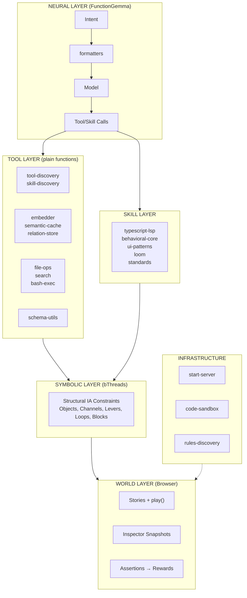
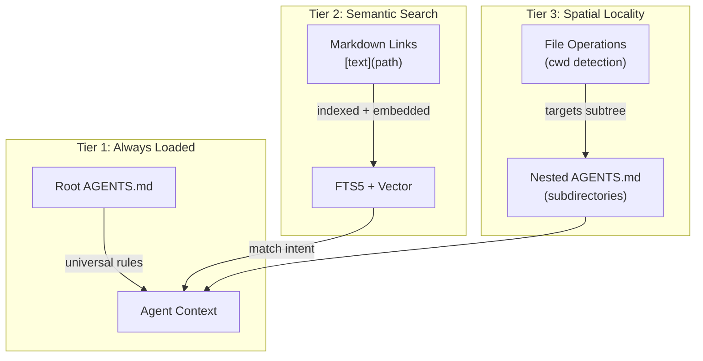

# Neuro-Symbolic World Agent Implementation Plan

> **For Claude Session Working on `src/agent`**

This plan implements a neuro-symbolic world agent architecture combining:
- **Browser as World Model** - Stories execute in browser; play() validates exploration
- **Tiered Symbolic Analysis** - Static → Model-as-judge → Browser execution
- **Structural Vocabulary** - Objects, Channels, Levers, Loops, Blocks

---

## Architecture Overview



---

## Storage Strategy: Right Tool for the Job

Different modules need different storage patterns. Use the simplest tool that meets the requirements.

| Need | Tool | Rationale |
|------|------|-----------|
| **Full-text search with ranking** | SQLite + FTS5 | BM25, prefix matching, tokenization built-in |
| **Simple key-value with TTL** | In-memory Map | No query complexity needed |
| **Graph traversal (DAG)** | In-memory Map | Traversal, not search |
| **Structured queries with joins** | SQLite | Relational data with FK constraints |

### Persistence Philosophy

Modules that don't need SQLite use pluggable persistence:
- **Initial data** - User loads from wherever (file, API, DB) and passes JSON
- **Persist callback** - User provides function to save; module calls it with current state

This decouples storage concerns and supports remote stores, cloud storage, or custom serialization.

### Module Storage Assignments

| Module | Storage | Persistence | Rationale |
|--------|---------|-------------|-----------|
| `tool-discovery` | SQLite + FTS5 | `dbPath` config | FTS5 for hybrid search |
| `skill-discovery` | SQLite + FTS5 | `dbPath` config | FTS5 + mtime cache |
| `semantic-cache` | In-memory Map | `onPersist` callback | Simple TTL key-value |
| `relation-store` | In-memory Map | `onPersist` callback | DAG traversal |

---

## Tool Layer

Plain functions that FunctionGemma can call. Not behavioral programs.

### Existing (✅)

| Module | Purpose | Storage | Notes |
|--------|---------|---------|-------|
| `tool-discovery` | FTS5 + vector search for tools | SQLite | Hybrid RRF scoring |
| `skill-discovery` | FTS5 + vector search for skills | SQLite | Persistent cache + mtime |
| `embedder` | node-llama-cpp GGUF embeddings | N/A | Shared by all modules |
| `semantic-cache` | Reuse responses for similar queries | Map + callback ✅ | Vector similarity |
| `formatters` | Tools → FunctionGemma tokens | N/A | Control tokens + parsing |

### Built (✅)

| Module | Purpose | Storage | Notes |
|--------|---------|---------|-------|
| `relation-store` | DAG for plans, files, agents | Map + callback | Multi-parent, LLM context |

### Built (Phase 2) ✅

| Module | Purpose | Storage | Notes |
|--------|---------|---------|-------|
| `file-ops` | read, write, edit | N/A | Bun.file(), Bun.write() |
| `search` | glob + grep | N/A | Bun.Glob, ripgrep |
| `bash-exec` | terminal commands | N/A | Bun.spawn + AbortController |
| `schema-utils` | Zod → ToolSchema | N/A | `zodToToolSchema()` |

### To Build (🔲)

| Module | Purpose | Storage | Notes |
|--------|---------|---------|-------|
| `rules-discovery` | AGENTS.md + refs | SQLite + FTS5 | Progressive loading |

---

## relation-store

Unified DAG for plans, file relationships, agent hierarchies, and any domain.

### Design Principles

1. **Multi-parent DAG** - Nodes can have multiple parents (not a tree)
2. **LLM-friendly context** - `NodeContext` is structured for model consumption
3. **In-memory first** - Fast traversal without SQLite overhead
4. **Pluggable persistence** - User provides `onPersist` callback
5. **Plans are just nodes** - No separate plan-store; use `edgeType: 'plan'` / `'step'`

### Types

```typescript
type NodeContext = {
  description: string
  status?: 'pending' | 'in_progress' | 'done' | 'failed'
  [key: string]: unknown  // Extensible
}

type RelationNode = {
  id: string
  parents: string[]       // DAG: multiple parents allowed
  edgeType: string        // 'plan', 'step', 'file', 'agent', etc.
  context: NodeContext
  createdAt: number
}

type RelationStoreConfig = {
  /** Called on persist() - user handles storage */
  onPersist?: (nodes: RelationNode[]) => void | Promise<void>
  /** Initial data - user already loaded it */
  initialNodes?: RelationNode[]
  /** Auto-persist on mutation (default: false) */
  autoPersist?: boolean
}
```

### API

```typescript
type RelationStore = {
  // Core CRUD
  add: (node: Omit<RelationNode, 'createdAt'>) => void
  update: (id: string, updates: Partial<NodeContext>) => void
  remove: (id: string) => void
  get: (id: string) => RelationNode | undefined
  has: (id: string) => boolean

  // Traversal
  ancestors: (id: string) => RelationNode[]
  descendants: (id: string) => RelationNode[]
  parents: (id: string) => RelationNode[]
  children: (id: string) => RelationNode[]
  roots: () => RelationNode[]
  leaves: () => RelationNode[]

  // Filtering
  byEdgeType: (edgeType: string) => RelationNode[]
  byStatus: (status: NodeContext['status']) => RelationNode[]

  // DAG Safety
  wouldCreateCycle: (from: string, toParents: string[]) => boolean

  // LLM Integration
  toContext: (ids: string[]) => string

  // Persistence
  persist: () => void | Promise<void>

  // Utilities
  all: () => RelationNode[]
  clear: () => void
  size: () => number
}
```

### Usage Example

```typescript
// User loads data however they want
const savedData = await loadFromSomewhere()

const store = createRelationStore({
  initialNodes: savedData,
  onPersist: (nodes) => saveToSomewhere(nodes)
})

// Create a plan with steps
store.add({
  id: 'plan-auth',
  parents: [],
  edgeType: 'plan',
  context: { description: 'Implement auth', status: 'in_progress' }
})

store.add({
  id: 'step-1',
  parents: ['plan-auth'],
  edgeType: 'step',
  context: { description: 'Create User model', status: 'pending' }
})

// Query
store.children('plan-auth')     // → [step-1]
store.byStatus('pending')       // → [step-1]
store.toContext(['plan-auth'])  // → formatted for FunctionGemma

// Persist when ready
await store.persist()
```

---

## rules-discovery

Progressive loading of AGENTS.md files and their markdown references. Renamed from `agents-discovery` to better reflect its purpose: loading rules and instructions for agent behavior.

### Context Budget

FunctionGemma has **37K token context** - more than initially assumed. This allows a hybrid approach:
- Root rules always loaded (universal instructions)
- Progressive loading for specifics (semantic search on intent)
- Spatial locality for nested rules (directory-scoped)

### Three-Tier Progressive Loading



### Loading Strategy

| Tier | Trigger | Content | Rationale |
|------|---------|---------|-----------|
| **1. Always** | Agent startup | Root `AGENTS.md` | Universal rules apply to all tasks |
| **2. Semantic** | Intent matches | `[text](path)` links | Load specific refs when relevant |
| **3. Spatial** | File ops in subtree | Nested `AGENTS.md` | Directory-specific conventions |

### Markdown Link Parsing

**Critical insight**: `skill-discovery.ts` does NOT currently parse markdown links `[text](path)` as structured references. It chunks the entire body text including markdown syntax.

For `rules-discovery`, we need to:
1. **Extract markdown links** - Parse `[display text](relative/path)` from AGENTS.md
2. **Index link text** - The display text is the semantic key for search
3. **Resolve paths** - Convert relative paths to absolute for loading
4. **Chunk content** - Index the referenced file content for semantic search

### Types

```typescript
type RuleReference = {
  displayText: string      // "[text]" portion - semantic key
  relativePath: string     // "(path)" portion - file location
  absolutePath: string     // Resolved from AGENTS.md location
  source: string           // Which AGENTS.md contains this link
}

type RulesDiscoveryConfig = {
  /** Root AGENTS.md path */
  rootPath: string
  /** SQLite database path */
  dbPath: string
  /** Embedder instance for semantic search */
  embedder: Embedder
  /** Current working directory for spatial locality */
  cwd?: string
}

type RulesDiscovery = {
  /** Get rules for an intent (Tier 2 semantic search) */
  getRulesForIntent: (intent: string) => Promise<string[]>
  /** Get rules for a file path (Tier 3 spatial locality) */
  getRulesForPath: (filePath: string) => Promise<string[]>
  /** Get root rules (Tier 1 always loaded) */
  getRootRules: () => string
  /** Refresh index (re-scan AGENTS.md files) */
  refresh: () => Promise<void>
  /** Close database connection */
  close: () => void
}
```

### AgentSkills Spec: Full Structure

The AgentSkills specification defines three optional directories beyond SKILL.md:

```
skill-name/
├── SKILL.md          # Required - metadata + instructions
├── scripts/          # Optional - executable code (already implemented ✅)
├── references/       # Optional - additional documentation (needs progressive loading)
└── assets/           # Optional - static resources (needs discovery)
```

**Reference implementation (skills-ref) is minimal:**
- Only parses frontmatter from SKILL.md
- Does NOT discover scripts, assets, or references
- Our `skill-discovery.ts` already exceeds this by discovering scripts

### Resource Handling Strategy

| Resource | Approach | Rationale |
|----------|----------|-----------|
| **SKILL.md body** | Progressive via markdown links | Reduce context bloat |
| **scripts/** | Agent parses body + calls bash-exec | Simple, no special infra |
| **references/** | Progressive loading by intent | Semantic search on display text |
| **assets/** | Deferred (no plan yet) | Low priority |

**Scripts are simple:**
1. `skill-discovery.ts` discovers scripts (metadata in DB)
2. Agent reads SKILL.md body → sees script documentation
3. Agent calls `bun scripts/foo.ts` via bash-exec
4. No caching or special handling needed

**References need progressive loading:**
```
.claude/skills/loom/
├── SKILL.md                          # Tier 1: Always loaded on skill match
│   ├── [templates](references/patterns/templates.md)   # Tier 2: Indexed
│   └── [tool-layer](references/weaving/tool-layer.md)
└── references/
    ├── patterns/
    │   └── templates.md              # Loaded when "templates" matches intent
    └── weaving/
        └── tool-layer.md
```

### Shared Utility

```typescript
// markdown-links.ts - shared by skill-discovery and rules-discovery
type MarkdownLink = {
  displayText: string   // "[text]" portion - semantic key
  relativePath: string  // "(path)" portion - file location
  lineNumber: number    // Location in source file
}

export const extractMarkdownLinks = (content: string): MarkdownLink[]
```

### Implementation Priority

1. **markdown-links.ts** - Shared link extraction
2. **Enhance skill-discovery** - Add `searchReferences()` API
3. **rules-discovery** - Uses same patterns for AGENTS.md
4. **(Deferred) asset-discovery** - No immediate plan

---

## Infrastructure

| Module | Purpose | Status |
|--------|---------|--------|
| `start-server` | Workshop subprocess | ✅ |
| `code-sandbox` | @anthropic-ai/sandbox-runtime | 🔲 port from old branch |
| `rules-discovery` | AGENTS.md context management | 🔲 |

**Why rules-discovery is infrastructure, not a tool:**
- Model doesn't call it directly (unlike tool-discovery, skill-discovery)
- Orchestrator uses it to manage context before/after tool calls
- Intercepts file operations to load spatial rules
- Loads root AGENTS.md at startup
- Provides context, not actions

---

## Refactor Notes

| File | Action | Status |
|------|--------|--------|
| `agent.types.ts` | Fix stale comment - says MiniLM but uses EmbeddingGemma | ✅ |
| `semantic-cache.ts` | Refactor from SQLite to Map + onPersist callback | ✅ |

---

## Next Steps

### Phase 1: Core Infrastructure (Current)

1. **Simplify `semantic-cache.ts`**
   - Remove SQLite dependency
   - Use in-memory Map for entries + embeddings
   - Add `onPersist` callback, `initialEntries` config
   - Keep same public API

2. **Create `relation-store.ts`**
   - In-memory Map<string, RelationNode>
   - Multi-parent DAG with cycle detection
   - `onPersist` callback for pluggable persistence
   - Tests in `tests/relation-store.spec.ts`

3. **Add `formatRelationsForContext()` to `formatters.ts`**
   - Format DAG nodes for FunctionGemma
   - Tree-style indentation with status

4. **Fix `agent.types.ts` stale comment**

### Phase 2: File Operations

5. **Create `file-ops.ts`**
   - `readFile()`, `writeFile()`, `editFile()`
   - Uses Bun.file(), Bun.write()

6. **Create `search.ts`**
   - `glob()`, `grep()`
   - Uses Bun.Glob, ripgrep via Bun.$

7. **Create `bash-exec.ts`**
   - `exec()` with timeout, cwd options
   - Uses Bun.$

### Phase 3: Progressive Loading Infrastructure

8. **Create `markdown-links.ts`** (shared utility)
   - `extractMarkdownLinks(content)` → `MarkdownLink[]`
   - Regex: `/\[([^\]]+)\]\(([^)]+)\)/g`
   - Returns `{ displayText, relativePath, lineNumber }`
   - Used by skill-discovery, rules-discovery, and future modules

9. **Enhance `skill-discovery.ts`** with progressive references
   - Index markdown links from SKILL.md body
   - Add `searchReferences(skillName, intent)` API
   - Store reference embeddings separately from body chunks
   - Load referenced files on-demand

10. **Create `rules-discovery.ts`** (infrastructure)
    - Three-tier progressive loading (Always → Semantic → Spatial)
    - Uses shared markdown-links.ts
    - SQLite + FTS5 for hybrid search (like skill-discovery)
    - Tier 1: Root AGENTS.md always in context
    - Tier 2: Indexed references loaded on semantic match
    - Tier 3: Nested AGENTS.md loaded for directory-scoped ops

11. **Port `code-sandbox.ts`**
    - From old branch
    - @anthropic-ai/sandbox-runtime integration

**Note:** Scripts handled by bash-exec (no special infra). Assets deferred (no plan).

### Phase 4: Symbolic Layer

10. **Symbolic Layer** - bThreads for Structural IA constraints
11. **World Agent factory**
12. **Adapters** (ACP, A2A, MCP)

---

## Task Checklist

### Immediate (This Session)

- [x] Update PLAITED-AGENT-PLAN.md
- [x] Simplify `semantic-cache.ts` → Map + onPersist
- [x] Create `relation-store.ts`
- [x] Create `tests/relation-store.spec.ts`
- [x] Add `formatRelationsForContext()` to formatters.ts
- [x] Fix `agent.types.ts` stale comment
- [x] Add tool-layer.md reference to loom skill

### Following Sessions

- [x] Create `file-ops.ts`
- [x] Create `search.ts`
- [x] Create `bash-exec.ts`
- [x] Create `schema-utils.ts`
- [ ] Create `rules-discovery.ts` (renamed from agents-discovery)
- [ ] Port `code-sandbox.ts`

---

## Session Pickup Notes

**Completed in Phase 1 (Tool Layer Core):**
- ✅ Created `relation-store.ts` with multi-parent DAG, cycle detection, traversal
- ✅ Created `tests/relation-store.spec.ts` (41 tests passing)
- ✅ Refactored `semantic-cache.ts` from SQLite to Map + onPersist (27 tests passing)
- ✅ Added `formatRelationsForContext()` and `formatPlanContext()` to formatters.ts
- ✅ Fixed stale comment in `agent.types.ts` (MiniLM → embeddinggemma-300M)
- ✅ Added `tool-layer.md` reference to loom skill
- ✅ Committed: `232acfe feat(agent): complete tool layer with relation-store and semantic-cache refactor`

**Completed in Phase 2 (File Operations):**
- ✅ Fixed `schemaToIndexedTool` (3 params → object pattern with `SchemaToIndexedToolOptions`)
- ✅ Fixed `filterToolsByIntent` (4 params → object pattern with `FilterToolsByIntentOptions`)
- ✅ Updated ~20 call sites in tool-discovery.spec.ts
- ✅ Created `schema-utils.ts` with `zodToToolSchema()` for Zod→ToolSchema conversion
- ✅ Created `file-ops.ts` with `readFile`, `writeFile`, `editFile` using Bun.file()
- ✅ Created `search.ts` with `glob` (Bun.Glob) and `grep` (ripgrep)
- ✅ Created `bash-exec.ts` with `exec` using Bun.spawn + timeout
- ✅ All tools have Zod schemas (`.schemas.ts` files) with descriptions
- ✅ 41 new tests passing (schema-utils: 7, file-ops: 11, search: 12, bash-exec: 11)
- ✅ Committed: `c6e9afe feat(agent): add tool layer modules with Zod schemas`

**Key Design Decisions:**
- SQLite + FTS5 for search (tool-discovery, skill-discovery)
- In-memory Map + callback persistence for everything else
- **Zod for tool schemas**: Runtime validation + `z.toJSONSchema()` → ToolSchema
- CLI entry points: `args: string[]` (shell provides strings)
- Internal APIs: Object pattern for 2+ params (typed values)
- Plans are just relation nodes with `edgeType: 'plan'` / `'step'`

**Key References:**
- Tool Layer Docs: `.claude/skills/loom/references/weaving/tool-layer.md`
- Existing Zod patterns: `src/workshop/workshop.schemas.ts`, `src/testing/testing.schemas.ts`
- Old code-sandbox: `github.com/plaited/plaited/blob/c76bd81.../src/agent/code-sandbox.ts`
- skill-discovery.ts: Pattern for SQLite + FTS5 hybrid search

**Architecture Decision (rules-discovery):**
- Renamed from `agents-discovery` to `rules-discovery` (better reflects purpose)
- FunctionGemma has 37K context (not 4K-8K as initially assumed)
- Three-tier progressive loading:
  1. **Always**: Root AGENTS.md in context
  2. **Semantic**: Markdown links `[text](path)` indexed + loaded on intent match
  3. **Spatial**: Nested AGENTS.md loaded when file ops target that subtree

**Critical Gap Confirmed:**
`skill-discovery.ts` does NOT parse markdown links as structured references:
```typescript
// skill-discovery.ts lines 669-670
const body = extractBody(content)  // Raw markdown including [text](path) syntax
const chunks = chunkText(body, chunkSize, chunkOverlap)  // Chunked as-is
```
- ❌ Can't semantically search "testing rules" → get referenced file
- ❌ Can't load linked files progressively
- ✅ Does match keywords in raw markdown (e.g., "testing.md" as text)

This pattern (markdown link extraction) should be implemented for `rules-discovery` and potentially backported to `skill-discovery`.

**Start Next Session With:**
```
Read PLAITED-AGENT-PLAN.md and continue Phase 3:
1. Create rules-discovery.ts with three-tier progressive loading
   - Parse markdown links [text](path) as structured references
   - SQLite + FTS5 for hybrid search (follow skill-discovery pattern)
   - Tier 1: Root AGENTS.md always loaded
   - Tier 2: References indexed, loaded on semantic match
   - Tier 3: Nested AGENTS.md loaded for directory-scoped ops
2. Port code-sandbox.ts from old branch
3. Tests and commit
```
