# Neuro-Symbolic World Agent Implementation Plan (V7)

> **Architecture**: V7 Neuro-Symbolic with Unified Capability Host
> **Last Updated**: 2026-02-03 (BP-GRPO Training Architecture session)
> **Research Notes**: [Notion - BP-GRPO Research](https://www.notion.so/plaited/Research-notes-ideas-2fd978090ff1800e8b0ec5548cdacaa6) (paper drafting, session logs, related work)

This plan implements a **neuro-symbolic world agent** that:
- Uses **Unified Capability Host** for MCP servers AND Agent Skills (same level)
- Uses **Federated Discovery Pools** with provenance tagging
- Generates **TypeScript code** that orchestrates MCP servers, skills, and tools
- Executes via **bash/Bun.$** (Unix philosophy)
- Uses **BP constraints** as symbolic reasoning layer (ratchet: can add, cannot remove)
- Uses **BP snapshots** for audit (no separate audit system)
- Supports **AGENTS.md-only** rules with hierarchical override semantics
- Uses **agent-generated indexing** for rules (no special syntax required)
- Supports **hot-reload** via event-driven capability management (no restart needed)
- Includes **world model** for sim(o,a) prediction before execution
- Trains via **SFT → GRPO** cycles
- Future: exposes itself as **MCP server** (after SDK v2)
- Future: supports **OAuth, DID, VC, ABAC** via clean interfaces

---

## Architecture Overview

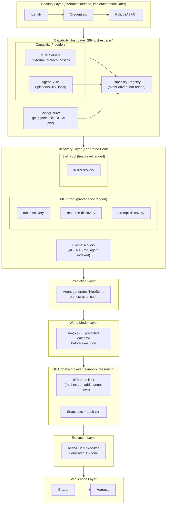

### Core Decisions

| Decision | Choice | Rationale |
|----------|--------|-----------|
| Training approach | SFT → GRPO cycles | DeepSeek-R1 validated |
| Personalization | BP bThreads (symbolic, not PESO) | Instant adaptation, interpretable |
| Execution model | TS code → bash/Bun.$ | FunctionGemma Unix philosophy |
| Constraints | BP as symbolic overlay | Ratchet: can add, cannot remove |
| World model | Phase 1, not optional | sim(o,a) before execution |
| MCP role | Full host now, server later | Complete spec compliance |
| Security | Interfaces now, implementations later | Future-proof for OAuth/DID/VC/ABAC |
| **Capability hosting** | Unified Capability Host (MCP + Skills) | Both are capability providers, same level |
| **Discovery pools** | Federated with provenance | Track source (MCP server vs skill), enable trust filtering |
| **Skill trust** | Tiered (certified, scanned, user, agent-generated) | Security without blocking ecosystem growth |
| **Skill diffing** | Git-based (`git diff`) | Leverage existing tooling, agent-analyzable |
| **Rules architecture** | AGENTS.md-only, hierarchical | Single spec, nested can override parent |
| **Rules indexing** | Agent-generated metadata | No special syntax, model derives structure |
| **Index triggers** | Event-driven (generation, session start, /refresh) | Sub-Variant B2: predictable latency, no stale results |
| **Capability lifecycle** | Event-driven registry + BP orchestration | Hot-reload without restart, /refresh command |
| **Configuration** | Pluggable ConfigSource interface | Deployment-flexible (file, DB, API, env) |
| **Audit** | BP snapshots | No separate audit system needed |
| **Model architecture** | Edge + Remote | FunctionGemma (edge) + Falcon-H1R (remote) |
| **Deployment modes** | AI-Assisted Design + Generative UI Production | Different requirements per phase |
| **Training pairs** | Three-source preference pairs | Success/Fail + Frontier/Yours + Allowed/Blocked |
| **Constraint learning** | Two-tier approval | Dev approval (design) + User deletable (production) |

---

## Model Architecture

The agent uses a dual-model architecture optimized for different deployment phases.

### Model Stack

| Layer | Model | Role | Training |
|-------|-------|------|----------|
| Edge | FunctionGemma | Fast local inference, common patterns | Distilled from Remote |
| Remote | Falcon-H1R | Complex reasoning, handles edge cases | GRPO with 3-source pairs |
| Frontier | Claude/GPT (via OpenCode/Cursor) | Reference trajectories (AI-Assisted Design only) | Frozen (oracle) |

### Deployment Modes

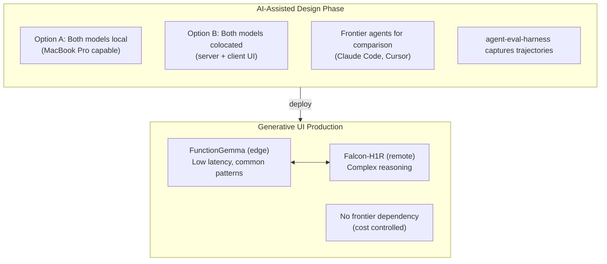

**AI-Assisted Design**: Both models run together (locally on MacBook Pro or colocated on server). Frontier agents used for comparison/training via harness.

**Generative UI Production**: Edge handles fast, common patterns. Remote handles complex reasoning. No frontier dependency (cost control).

### Pattern Mixing Philosophy

| Pattern | Component | Role |
|---------|-----------|------|
| **Deterministic** | Grader (tsc, biome, tests) | Ground truth, no ambiguity |
| **Symbolic** | BP constraints (bThreads) | Verifiable safety, explicit reasoning |
| **Generative** | LLMs (FunctionGemma, Falcon-H1R) | Flexibility, natural language understanding |

This follows proven patterns from compiler design (parse → type-check → generate) and databases (query → plan → execute).

---

## Observable / Affectable Taxonomy

Understanding what the agent can observe vs affect is foundational to the architecture.

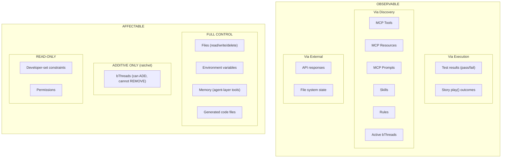

**Key Insight**: The ratchet property (can add bThreads, cannot remove) provides a safety mechanism where constraints accumulate but never disappear without developer intervention.

---

## Execution Model

The agent generates TypeScript that orchestrates, executed via shell:

```
Agent predicts → TypeScript code that:
                   ├── Calls MCP servers
                   ├── Uses skill scripts
                   ├── Leverages discovered tools/resources/prompts
                   └── Composes via Unix patterns
                            ↓
              Executed via: bash / Bun.$ shell commands
```

**Not**: "TS mode vs bash mode" as separate execution paths
**Actually**: TS orchestrates everything, shell executes the orchestration

This aligns with FunctionGemma's Unix philosophy and Anthropic's code execution with MCP pattern.

---

## Capability Host Layer

The Capability Host Layer manages both MCP servers (external, protocol-based) and Agent Skills (local, filesystem-based) as unified capability providers.

### Unified Capability Host

MCP servers and Agent Skills are both "capability providers" at the same architectural level:

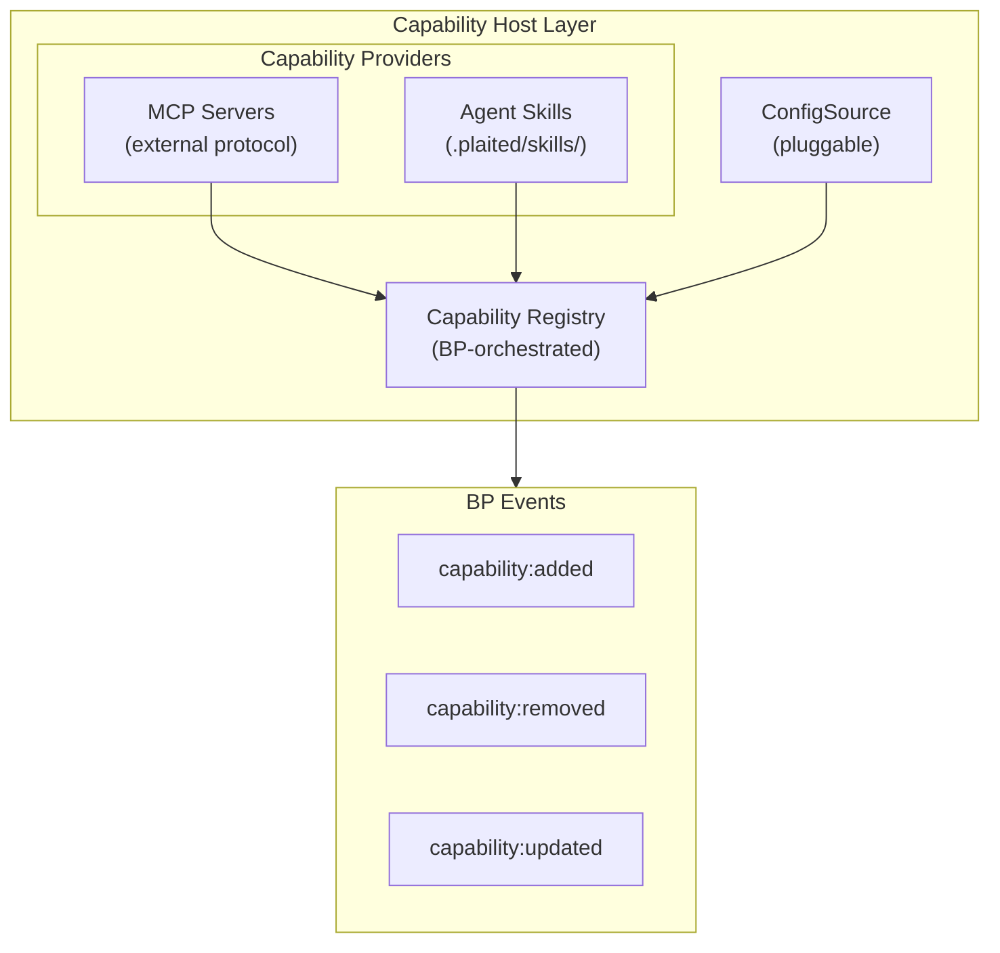

### Federated Discovery Pools

Skills and MCP contribute to separate pools with provenance tagging:

```typescript
type DiscoveryPools = {
  // MCP pool - tagged with serverId
  mcp: {
    tools: ToolEntry[]      // { ...tool, serverId, provenance: 'mcp' }
    resources: ResourceEntry[]
    prompts: PromptEntry[]
  }

  // Skill pool - tagged with skillId and trust level
  skills: {
    tools: ToolEntry[]      // { ...tool, skillId, trustLevel, provenance: 'skill' }
    resources: ResourceEntry[]
    prompts: PromptEntry[]
  }

  // Federated search returns results from both pools
  search: (query: string) => Promise<{
    results: (ToolEntry | ResourceEntry | PromptEntry)[]
    // Results tagged with provenance for trust filtering
  }>
}
```

**Key insight**: Provenance is preserved—know where each capability came from for trust decisions.

### Skill Trust Model

Tiered trust with scan-on-install for non-certified skills:

```typescript
type SkillTrust =
  | { level: 'certified'; source: 'plaited/*' }
  | { level: 'scanned'; scanResult: ScanResult; approvedAt: Date }
  | { level: 'user-authored'; path: string }
  | { level: 'agent-generated'; generatedBy: string; reviewedAt?: Date }

type ScanResult = {
  permissions: string[]        // What capabilities does it request?
  dependencies: string[]       // MCP servers, external APIs
  codeAnalysis: {
    hasNetworkCalls: boolean
    hasFileSystemAccess: boolean
    hasShellExecution: boolean
  }
  aiAssessment?: string        // LLM analysis of implications
  webResearch?: string[]       // Links to package reputation
}
```

**Skill diffing**: Use `git diff` on skill repos to analyze changes before updates. Agent can run `git fetch && git diff HEAD..origin/main` to see incoming changes.

### Event-Driven Capability Lifecycle

BP orchestrates capability lifecycle with hot-reload (no restart needed):

```typescript
type CapabilityRegistry = {
  // Lifecycle (all emit BP events)
  register: (source: CapabilitySource) => Promise<void>
  unregister: (sourceId: string) => Promise<void>
  refresh: (sourceId?: string) => Promise<void>  // undefined = refresh all

  // Query
  list: () => CapabilitySource[]
  get: (sourceId: string) => CapabilitySource | undefined
}

type CapabilitySource =
  | { type: 'mcp'; serverId: string; config: MCPServerConfig }
  | { type: 'skill'; skillId: string; path: string; trust: TrustLevel }
  | { type: 'rules'; path: string }

type CapabilityEvent =
  | { type: 'session-start'; source: ConfigSource }
  | { type: 'mcp-add'; config: MCPServerConfig }
  | { type: 'mcp-remove'; serverId: string }
  | { type: 'skill-add'; path: string; trustLevel: TrustLevel }
  | { type: 'skill-remove'; skillId: string }
  | { type: 'rules-reindex'; paths: string[] }
  | { type: 'refresh-all' }
```

### Pluggable ConfigSource

Configuration source is abstracted for deployment flexibility:

```typescript
type ConfigSource = {
  load: () => Promise<AgentConfig>
  save?: (config: AgentConfig) => Promise<void>  // Optional persistence
  watch?: () => AsyncIterable<ConfigChange>      // Optional watching
}

// Implementations for different deployments
const localFileSource: ConfigSource = { /* .plaited/config.json */ }
const databaseSource: ConfigSource = { /* tenant DB lookup */ }
const apiSource: ConfigSource = { /* fetch from /agent/config */ }
const envSource: ConfigSource = { /* parse from env vars */ }
```

**Audit via BP snapshots**: No separate audit system needed—BP snapshots at each bSync capture the complete capability state.

---

## Storage Strategy

Different modules need different storage patterns. Use the simplest tool that meets requirements.

| Need | Tool | Rationale |
|------|------|-----------|
| **Full-text search with ranking** | SQLite + FTS5 | BM25, prefix matching, tokenization |
| **Simple key-value with TTL** | In-memory Map | No query complexity needed |
| **Graph traversal (DAG)** | In-memory Map | Traversal, not search |
| **Structured queries with joins** | SQLite | Relational data with FK constraints |

### Persistence Philosophy

Modules that don't need SQLite use pluggable persistence:
- **Initial data** - User loads from wherever and passes JSON
- **Persist callback** - User provides function; module calls with current state

This decouples storage concerns and supports remote stores, cloud storage, or custom serialization.

### Module Storage Assignments

| Module | Storage | Persistence | Status |
|--------|---------|-------------|--------|
| `tool-discovery` | SQLite + FTS5 | `dbPath` config | ✅ 45 tests |
| `skill-discovery` | SQLite + FTS5 | `dbPath` config | ✅ 62 tests |
| `rules-discovery` | SQLite + FTS5 | `dbPath` config | ✅ 25 tests |
| `semantic-cache` | In-memory Map | `onPersist` callback | ✅ 27 tests |
| `relation-store` | In-memory Map | `onPersist` callback | ✅ 41 tests |

---

## Rules Architecture (AGENTS.md-Only)

Rules use AGENTS.md files exclusively with hierarchical discovery and agent-generated indexing.

### AGENTS.md Hierarchy

```
project-root/
├── AGENTS.md                    # Project root (primary)
├── src/
│   └── feature/
│       └── AGENTS.md            # Feature-specific (additive/override)
└── .plaited/
    └── skills/
        └── my-skill/
            └── AGENTS.md        # Skill-specific (loaded when skill active)
```

**Resolution order** (nested can override parent):
1. `/AGENTS.md` (always loaded)
2. `/src/AGENTS.md` (if working in /src)
3. `/src/feature/AGENTS.md` (if working in /src/feature)

### Agent-Generated Indexing

AGENTS.md files remain natural language—no special syntax required. Agent analyzes content and generates structured index:

```typescript
type GeneratedRuleIndex = {
  id: string
  source: string              // Path to AGENTS.md
  section: string             // Extracted section heading
  content: string             // Original text

  // Agent-generated metadata (no special syntax in source)
  actionTypes: ActionType[]   // ['file-write', 'shell-exec', ...]
  constraint: {
    type: 'must' | 'must-not' | 'should' | 'may'
    description: string
  }
  keywords: string[]          // For FTS
  embedding: number[]         // For semantic search
}

type ActionType =
  | 'file-read' | 'file-write'
  | 'shell-exec'
  | 'mcp-call'
  | 'skill-invoke'
  | 'code-generation'
  | 'testing'
  | 'documentation'
```

### Event-Driven Indexing (Sub-Variant B2)

Index triggers ensure predictable search latency with no stale results:

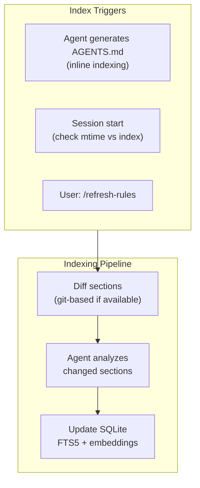

**Key behaviors**:
1. **On generation**: Index immediately (user is waiting anyway)
2. **On session start**: Compare file mtime vs index timestamp
3. **On /refresh-rules**: Force full reindex
4. **No stale results**: Always search fresh index

### Rules Discovery Integration

```typescript
type RulesDiscovery = {
  // Index management
  indexAfterGeneration: (path: string) => Promise<void>
  ensureFreshOnSessionStart: () => Promise<void>
  refreshAll: () => Promise<void>

  // Search (assumes index is fresh)
  searchByIntent: (intent: string) => Promise<RuleMatch[]>
  searchByAction: (action: ActionType) => Promise<RuleMatch[]>

  // BP integration - convert retrieved rules to constraints
  toBThreads: (rules: RuleMatch[]) => BThread[]
}
```

### Integration with World Model + BP

Rules become inputs to the BP layer, not just context decoration:

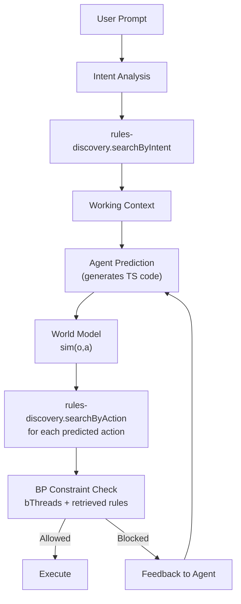

---

## Completed Infrastructure (311 tests)

These modules form the foundation for Phase 4+. They will be refined as memory features later.

| Module | Purpose | Serves |
|--------|---------|--------|
| `tool-discovery` | FTS5 + vector search for tools | Discovery Layer |
| `skill-discovery` | FTS5 + vector + progressive refs | Discovery Layer |
| `rules-discovery` | AGENTS.md-only with agent-generated indexing | Discovery Layer |
| `embedder` | node-llama-cpp GGUF embeddings | Memory/Search |
| `semantic-cache` | Reuse responses for similar queries | Memory |
| `relation-store` | DAG for plans, files, agents | Memory/Planning |
| `formatters` | Tools → FunctionGemma tokens | Prediction Layer |
| `file-ops` | read, write, edit | Execution Layer |
| `search` | glob + grep | Execution Layer |
| `bash-exec` | terminal commands | Execution Layer |
| `schema-utils` | Zod → ToolSchema | Tooling |
| `markdown-links` | Extract `[text](path)` patterns | Discovery Layer |

### How Existing Work Serves V7

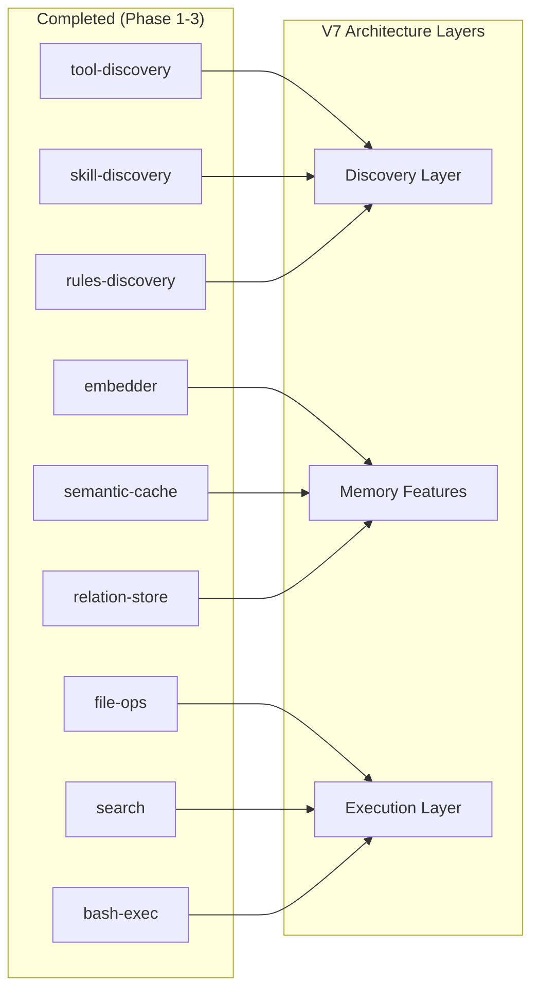

---

## Phase 4: Capability Host Layer

The agent uses a **Unified Capability Host** that manages both MCP servers and Agent Skills as capability providers. See [Capability Host Layer](#capability-host-layer) section above for architecture details.

### Implementation Order

1. **Capability Types** (`src/agent/capability-host/capability.types.ts`)
   - CapabilitySource, CapabilityEvent, CapabilityRegistry interfaces
   - ConfigSource interface for pluggable configuration

2. **Config Source** (`src/agent/capability-host/config-source.ts`)
   - ConfigSource interface
   - File-based implementation (`config-source-file.ts`)

3. **Skill Trust** (`src/agent/capability-host/skill-trust.ts`)
   - Tiered trust model (certified, scanned, user-authored, agent-generated)
   - ScanResult type for skill scanning
   - Git-based diffing utilities

4. **Capability Registry** (`src/agent/capability-host/capability-registry.ts`)
   - BP-orchestrated lifecycle management
   - Event emission (capability:added, capability:removed, capability:updated)
   - Hot-reload support via /refresh

5. **Rules Discovery Refactor** (`src/agent/discovery/rules-discovery.ts`)
   - AGENTS.md-only with hierarchical override
   - Agent-generated indexing (no special syntax)
   - Event-driven triggers (Sub-Variant B2)
   - searchByIntent + searchByAction methods

6. **MCP Provider** (`src/agent/mcp/mcp-provider.ts`)
   - MCP as capability provider (integrates with registry)
   - Full MCP primitives (tools, resources, prompts, sampling)

### MCP Primitives (via MCP Provider)

| Primitive | Direction | Status | Purpose |
|-----------|-----------|--------|---------|
| **Tools** | Server → Host | ✅ Have discovery | Callable functions |
| **Resources** | Server → Host | ❌ Need discovery | Data access (files, APIs, DBs) |
| **Prompts** | Server → Host | ❌ Need discovery | Reusable templates |
| **Sampling** | Server ← Host | ❌ Need | Host provides LLM to servers |
| **Roots** | Host → Server | ❌ Need | Workspace context |
| **Logging** | Bidirectional | ❌ Need | Debug/audit trail (via BP snapshots) |
| **Notifications** | Bidirectional | ❌ Need | Resource updates, status |

### MCP Provider Types

```typescript
type MCPProvider = {
  type: 'mcp'

  // === Server Management ===
  servers: {
    add: (config: MCPServerConfig) => Promise<MCPClient>
    remove: (serverId: string) => Promise<void>
    list: () => MCPServerConfig[]
  }

  // === Primitives (feed into federated discovery pools) ===
  tools: MCPToolRegistry
  resources: MCPResourceRegistry
  prompts: MCPPromptRegistry

  // === Host Capabilities ===
  sampling: MCPSamplingProvider
  roots: MCPRootsProvider
}

type MCPToolRegistry = {
  search: (query: string, options?: SearchOptions) => Promise<ToolMatch[]>
  register: (tool: MCPTool, serverId: string) => Promise<void>
  execute: (name: string, args: unknown, serverId: string) => Promise<ToolResult>
}

type MCPResourceRegistry = {
  search: (query: string, options?: SearchOptions) => Promise<ResourceMatch[]>
  register: (resource: MCPResource, serverId: string) => Promise<void>
  read: (uri: string, serverId: string) => Promise<ResourceContent>
  subscribe?: (uri: string, serverId: string) => AsyncIterable<ResourceUpdate>
}

type MCPPromptRegistry = {
  search: (query: string, options?: SearchOptions) => Promise<PromptMatch[]>
  register: (prompt: MCPPrompt, serverId: string) => Promise<void>
  get: (name: string, args?: unknown, serverId: string) => Promise<PromptContent>
}

type MCPSamplingProvider = {
  /** Host provides LLM to MCP servers that request sampling */
  createMessage: (request: SamplingRequest) => Promise<SamplingResponse>
}
```

---

## Phase 5: World Model Layer

The world model predicts outcomes **before** execution. This is Phase 1 priority, not optional.

### Purpose

```
sim(o,a) → predicted outcome

Where:
  o = current observation (state)
  a = proposed action (generated TS code)
  → = world model prediction
```

### World Model Interface

```typescript
type WorldModel = {
  /** Predict outcome of action given current state */
  predict: (params: {
    observation: Observation
    action: ExecutablePrediction
  }) => Promise<WorldModelPrediction>

  /** Update model based on actual outcome */
  learn?: (params: {
    prediction: WorldModelPrediction
    actual: ExecutionResult
  }) => Promise<void>
}

type Observation = {
  /** Current file system state (relevant files) */
  files: FileState[]
  /** Active MCP servers and capabilities */
  mcpState: MCPState
  /** Recent conversation context */
  context: Message[]
  /** Active bThreads */
  constraints: string[]
}

type WorldModelPrediction = {
  /** Predicted outcome type */
  predictedOutcome: {
    type: 'success' | 'failure' | 'partial'
    changes: PredictedChange[]
    sideEffects: PredictedSideEffect[]
  }
  /** Confidence in prediction (0-1) */
  confidence: number
  /** Reasoning for prediction */
  reasoning: string
  /** Predicted constraint violations */
  constraintViolations?: string[]
}
```

### Research Backing

| Paper | Key Insight | Application |
|-------|-------------|-------------|
| WMPO | World model + GRPO for on-policy RL | Simulate before execute |
| RLVR-World | Train world model WITH RL | Task-aligned predictions |
| Better World Models | Explicit state prediction → better GRPO | Invest in representations |

### Integration with BP

The world model predictions feed into BP constraint checking:

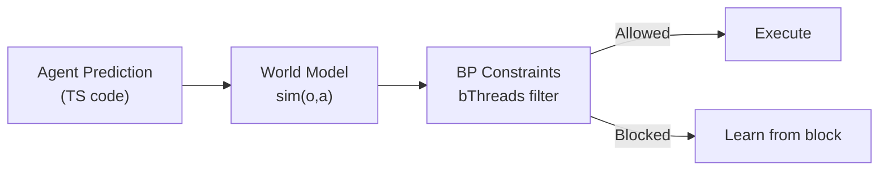

---

## Phase 6: BP Constraint Layer

BP provides the **symbolic reasoning layer**. Constraints are additive (ratchet property).

### Ratchet Property

```typescript
// Agent CAN add new bThreads at runtime
bThreads.set({
  newConstraint: bThread([
    bSync({ block: ({ type, detail }) =>
      type === 'file-write' && isSensitivePath(detail.path)
    })
  ], true)
})

// Agent CANNOT remove existing bThreads
// (behavioral.ts warns and skips if thread already exists)
```

### BP Constraint Examples

```typescript
bThreads.set({
  // Block unsafe MCP calls
  mcpGuard: bThread([
    bSync({ block: ({ type, detail }) =>
      type === 'mcp-call' && !isAllowedServer(detail.server)
    })
  ], true),

  // Block file ops outside workspace
  fileGuard: bThread([
    bSync({ block: ({ type, detail }) =>
      type === 'file-write' && !isInWorkspace(detail.path)
    })
  ], true),

  // Require world model confidence above threshold
  confidenceGuard: bThread([
    bSync({ block: ({ type, detail }) =>
      type === 'execute' && detail.worldModelConfidence < 0.7
    })
  ], true)
})
```

### BP-Agent Integration

```typescript
type BPDecision = {
  prediction: ExecutablePrediction
  allowed: boolean
  blockingThread?: string
  reason?: string
}

const checkConstraints = async (
  prediction: ExecutablePrediction,
  bThreads: BThreadRegistry
): Promise<BPDecision> => {
  // Check if any bThread would block this action
  for (const [name, thread] of bThreads) {
    if (thread.wouldBlock(prediction)) {
      return {
        prediction,
        allowed: false,
        blockingThread: name,
        reason: `Blocked by constraint: ${name}`
      }
    }
  }
  return { prediction, allowed: true }
}
```

### Learning Constraints from Blocks

BP blocks aren't just safety—they're training signal:

1. **Block capture**: Every BP block logged with context
2. **Pattern detection**: Cluster similar blocks
3. **bThread proposal**: Auto-generate constraints from recurring patterns
4. **Validation**: Ensure proposed constraints don't over-constrain

```typescript
type BThreadProposal = {
  id: string
  pattern: {
    actionType: string
    conditions: Record<string, unknown>
    frequency: number
    avgScoreLoss: number
  }
  proposedBThread: {
    block: string  // Condition expression
    reason: string
  }
  confidence: number
}
```

### Two-Tier Constraint Approval

| Phase | Who Approves | Mechanism | Can Delete? |
|-------|--------------|-----------|-------------|
| **AI-Assisted Design** | Dev/Designer | Explicit approval of proposed bThreads | Yes (full control) |
| **Generative UI Production** | End User | Can delete threads generated from their intent | User-generated only |

```typescript
type BThreadMetadata = {
  source: 'core' | 'org' | 'agent-proposed' | 'user-intent'
  approvedBy?: string
  createdAt: Date
  deletable: boolean  // Only user-intent threads deletable in production
}
```

**Key insight**: Users don't need to understand the code—they can delete threads based on outcomes they don't like. This is implicit preference feedback.

---

## Phase 7: Agent Loop

The agent loop orchestrates the full flow: discovery → prediction → world model → BP → execution → grading.

### Agent Loop Types

```typescript
type ExecutablePrediction = {
  /** TypeScript orchestration code */
  code: string
  /** Dependencies required */
  dependencies: {
    mcpServers: string[]
    skills: string[]
    resources: string[]
    tools: string[]
  }
  /** Expected outcome for verification */
  expectedOutcome: {
    type: string
    assertions: string[]
  }
}

type AgentLoopConfig = {
  /** MCP host instance */
  mcpHost: MCPHost
  /** World model for prediction */
  worldModel: WorldModel
  /** BP program for constraints */
  bProgram: BehavioralProgram
  /** Grader for verification */
  grader: Grader
  /** Working directory */
  cwd: string
}

type AgentEvent =
  | { type: 'discovery'; tools: number; resources: number; prompts: number }
  | { type: 'prediction'; code: string; confidence: number }
  | { type: 'world_model'; prediction: WorldModelPrediction }
  | { type: 'bp_check'; allowed: boolean; reason?: string }
  | { type: 'execution'; result: ExecutionResult }
  | { type: 'grading'; result: GraderResult }
  | { type: 'trajectory_step'; step: TrajectoryStep }
  | { type: 'done'; success: boolean; iterations: number }
```

### Agent Loop Flow

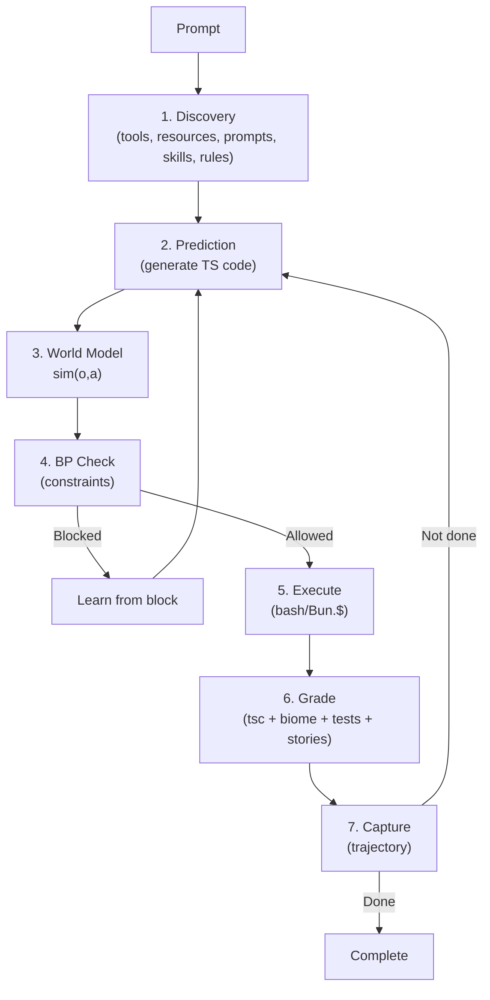

---

## Phase 8: Grader

The grader provides reward signals for training. Multi-tier approach for comprehensive evaluation.

### Grader Interface

```typescript
type Grader = (params: {
  prediction: ExecutablePrediction
  executionResult: ExecutionResult
  cwd: string
}) => Promise<GraderResult>

type GraderResult = {
  pass: boolean
  score: number  // 0-1
  reasoning: string
  outcome: {
    tier1: boolean  // Static (tsc + biome)
    tier2: boolean  // Functional (tests + stories)
  }
  details?: {
    tsc: { exitCode: number; errors?: string[] }
    biome: { exitCode: number; errors?: string[] }
    tests: { exitCode: number; passed: number; failed: number }
    stories: { exitCode: number; passed: number; failed: number }
  }
}
```

### Grader Implementation

```typescript
const grade: Grader = async ({ prediction, executionResult, cwd }) => {
  // Tier 1: Static Analysis
  const tsc = await Bun.$`cd ${cwd} && tsc --noEmit`.nothrow()
  const biome = await Bun.$`cd ${cwd} && biome check`.nothrow()

  // Tier 2: Functional Testing
  const tests = await Bun.$`cd ${cwd} && bun test`.nothrow()
  const stories = await Bun.$`cd ${cwd} && bun plaited test`.nothrow()

  const results = [tsc, biome, tests, stories]
  const score = results.filter(r => r.exitCode === 0).length / 4

  return {
    pass: score >= 0.75,
    score,
    reasoning: `tsc:${tsc.exitCode} biome:${biome.exitCode} tests:${tests.exitCode} stories:${stories.exitCode}`,
    outcome: {
      tier1: tsc.exitCode === 0 && biome.exitCode === 0,
      tier2: tests.exitCode === 0 && stories.exitCode === 0
    }
  }
}
```

---

## Phase 9: Training Pipeline

Training follows SFT → GRPO cycles, validated by DeepSeek-R1. The key innovation is **three-source preference pairs** for GRPO training.

### Three-Source Preference Pairs

GRPO requires `(preferred, dispreferred)` pairs. We generate from THREE sources:

| Source | When Generated | Preferred | Dispreferred | What It Teaches |
|--------|----------------|-----------|--------------|-----------------|
| **Success/Fail** | During trials (k=5 runs per prompt) | Run that passed grader | Run that failed grader | Basic competence |
| **Frontier/Yours** | AI-Assisted Design phase only | Frontier trajectory (when better) | Your agent trajectory | Quality ceiling |
| **Allowed/Blocked** | Any execution with BP | Action that executed | Action that BP blocked | Constraint compliance |

The **Allowed/Blocked** source is novel—BP blocks provide clean negative examples with explicit symbolic reasoning attached.

```typescript
type PreferencePair = {
  id: string
  input: string | string[]
  preferred: {
    trajectory: unknown[]
    output: string
    score: number
    source: 'successful' | 'frontier' | 'allowed'
  }
  dispreferred: {
    trajectory: unknown[]
    output: string
    score: number
    source: 'failed' | 'yours' | 'blocked'
  }
  margin: number  // Score difference (for GRPO weighting)
}
```

### Training Instance

```typescript
type TrainingInstance = {
  id: string
  prompt: string
  context: DiscoveryContext
  prediction: ExecutablePrediction
  worldModelPrediction: WorldModelPrediction
  bpDecision: BPDecision
  executionResult?: ExecutionResult
  graderResult: GraderResult
  trajectory: TrajectoryStep[]
}

type TrajectoryStep = {
  timestamp: number
  type: 'thought' | 'tool_call' | 'message' | 'bp_block' | 'error'
  content: string
  metadata?: Record<string, unknown>
}
```

### Training Phases

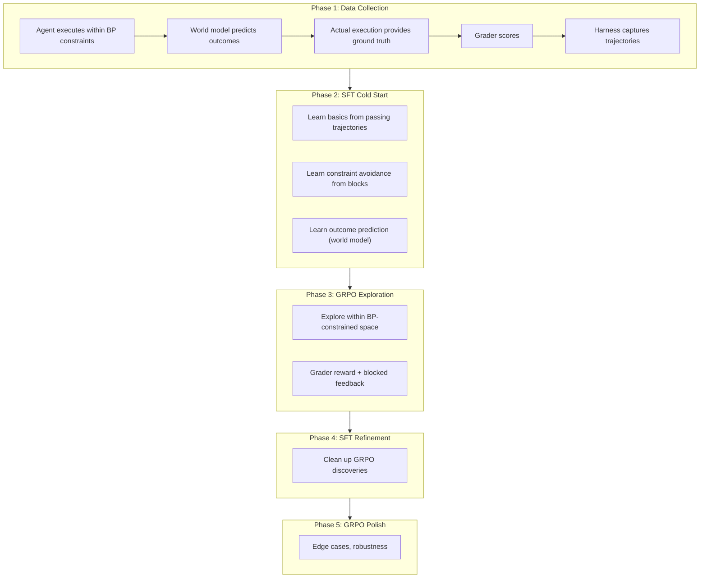

### Integration with agent-eval-harness

The `@plaited/agent-eval-harness` captures trajectories for training:

```bash
# Capture trajectories from prompts
bunx @plaited/agent-eval-harness capture prompts.jsonl \
  --schema ./agent-headless.json \
  --grader ./grader.ts \
  -o trajectories.jsonl

# Multi-run for pass@k analysis
bunx @plaited/agent-eval-harness trials prompts.jsonl \
  --schema ./agent-headless.json \
  -k 5 \
  --grader ./grader.ts \
  -o trials.jsonl
```

---

## Phase 10: Security Interfaces (Future)

Define interfaces now, implement later. Future-proofs for OAuth, DID, Verifiable Credentials, ABAC.

### Identity Layer

```typescript
type Identity = {
  id: string
  type: 'oauth' | 'did' | 'api-key' | 'anonymous'
  attributes: Record<string, unknown>
  raw?: unknown  // Original token/credential
}

type IdentityResolver = {
  resolve: (token: string) => Promise<Identity | undefined>
}
```

### Credential Layer

```typescript
type Credential = {
  type: 'vc' | 'oauth-scope' | 'role' | 'capability'
  issuer: string
  subject: string
  claims: Record<string, unknown>
  expiresAt?: Date
  proof?: unknown  // Cryptographic proof
}

type CredentialVerifier = {
  verify: (credential: Credential) => Promise<{
    valid: boolean
    reason?: string
  }>
}
```

### Policy Layer (ABAC)

```typescript
type PolicySubject = {
  identity: Identity
  credentials: Credential[]
  attributes: Record<string, unknown>
}

type PolicyAction = {
  type: 'tool-call' | 'resource-read' | 'resource-write' | 'prompt' | 'sampling'
  name: string
  parameters?: Record<string, unknown>
}

type PolicyResource = {
  uri: string
  type: string
  owner?: string
  sensitivity?: 'public' | 'internal' | 'confidential' | 'restricted'
  attributes: Record<string, unknown>
}

type PolicyContext = {
  timestamp: Date
  environment: Record<string, unknown>
  requestId: string
}

type PolicyObligation = {
  type: string
  parameters: Record<string, unknown>
}

type PolicyDecision = {
  allowed: boolean
  reason?: string
  obligations?: PolicyObligation[]
  advice?: string[]
}

type PolicyEvaluator = {
  evaluate: (
    subject: PolicySubject,
    action: PolicyAction,
    resource: PolicyResource,
    context: PolicyContext
  ) => Promise<PolicyDecision>
}
```

### Security Integration Point

```typescript
type SecureAgent = {
  /** Security layer wraps all agent operations */
  security: {
    identity: IdentityResolver
    credentials: CredentialVerifier
    policy: PolicyEvaluator
  }

  /** All MCP operations go through policy check */
  mcp: SecureMCPHost
}
```

---

## Phase 11: Agent as MCP Server (Future - SDK v2)

After SDK v2 releases, expose the agent itself as an MCP server.

### Agent Server Interface

```typescript
type AgentAsMCPServer = {
  /** Expose agent capabilities as MCP tools */
  tools: {
    run_prompt: {
      description: 'Execute agent with prompt'
      inputSchema: { prompt: string; mode?: 'structured' | 'autonomous' }
    }
    query_memory: {
      description: 'Query agent memory/relations'
      inputSchema: { query: string }
    }
    add_constraint: {
      description: 'Add BP constraint (ratchet)'
      inputSchema: { constraint: BThreadDefinition }
    }
  }

  /** Expose agent state as MCP resources */
  resources: {
    'agent://memory/*': 'Relation store nodes'
    'agent://constraints/*': 'Active bThreads'
    'agent://trajectory/*': 'Execution history'
  }

  /** Expose agent prompts */
  prompts: {
    code_review: 'Review code changes'
    generate_tests: 'Generate tests for file'
    // ... skill-defined prompts
  }
}
```

---

## Foundation Product Model

This agent is a **foundation** that organizations extend—similar to Ramp's Inspect pattern but with BP safety instead of trusting model intelligence.

### What You Ship (Foundation)

| Component | Description |
|-----------|-------------|
| Model stack | FunctionGemma (edge) + Falcon-H1R (remote) |
| BP runtime | Core bThreads + ratchet property |
| Training loop | agent-eval-harness + GRPO with 3-source pairs |
| Skill protocol | AgentSkills spec |
| Grader | tsc + biome + tests + stories |

### What Orgs Add (Extensions)

| Component | Description |
|-----------|-------------|
| Org skills | "How we ship at [OrgName]" |
| Org bThreads | Compliance, security, workflow rules |
| Org MCPs | Internal tool integrations |
| Custom graders | Domain-specific verification |

### Differentiation from Ramp Inspect

| Aspect | Ramp Inspect | Your Foundation |
|--------|--------------|-----------------|
| Base | Built on OpenCode | Own agent (no external dependency) |
| Safety | "Frontier models are smart enough to contain themselves" | BP constraints (verifiable, symbolic) |
| Models | Frozen frontier models | Trainable models (FunctionGemma, Falcon-H1R) |
| Customization | Skills only | Skills + BP rules + custom graders |
| Training | None | agent-eval-harness + GRPO |

### Org Training Pattern

Organizations can rapidly train new models using the harness:

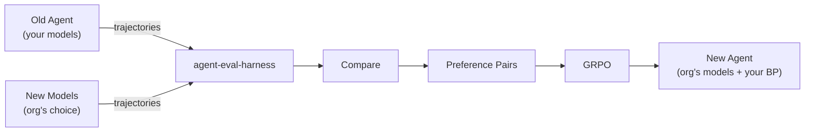

Reference: [Ramp Engineering Blog](https://engineering.ramp.com/post/why-we-built-our-background-agent)

---

## Implementation Phases Summary

### Phase 1-3: Complete ✅

| Phase | Components | Tests | Status |
|-------|------------|-------|--------|
| 1 | semantic-cache, relation-store | 68 | ✅ |
| 2 | file-ops, search, bash-exec | 34 | ✅ |
| 3 | skill-discovery refs, rules-discovery | 87 | ✅ |

### Phase 4-11: Planned

| Phase | Components | Priority | Effort |
|-------|------------|----------|--------|
| 4 | Capability Host (MCP + Skills + Rules refactor) | High | High |
| 5 | World Model | High | High |
| 6 | BP-Agent Wiring | High | Medium |
| 7 | Agent Loop | High | High |
| 8 | Grader | Medium | Medium |
| 9 | Training Pipeline | Medium | High |
| 10 | Security Interfaces | Low | Low (types only) |
| 11 | Agent as MCP Server | Future | High |

---

## File Structure

```
src/agent/
├── agent.types.ts              # ✅ Shared types
├── embedder.ts                 # ✅ GGUF embeddings
├── formatters.ts               # ✅ Token formatting
├── schema-utils.ts             # ✅ Zod → ToolSchema
├── markdown-links.ts           # ✅ Link extraction
│
├── capability-host/            # Capability Host Layer (NEW)
│   ├── capability.types.ts     # 🔲 CapabilitySource, CapabilityEvent
│   ├── capability-registry.ts  # 🔲 BP-orchestrated registry
│   ├── config-source.ts        # 🔲 Pluggable ConfigSource interface
│   ├── config-source-file.ts   # 🔲 File-based implementation
│   └── skill-trust.ts          # 🔲 Tiered trust, scan-on-install
│
├── discovery/                  # Discovery Layer (Federated Pools)
│   ├── tool-discovery.ts       # ✅ FTS5 + vector for tools
│   ├── skill-discovery.ts      # ✅ FTS5 + vector + refs
│   ├── rules-discovery.ts      # 🔄 AGENTS.md-only, agent-indexed
│   ├── resource-discovery.ts   # 🔲 MCP resources
│   └── prompt-discovery.ts     # 🔲 MCP prompts
│
├── storage/                    # Memory Features
│   ├── semantic-cache.ts       # ✅ LLM response cache
│   └── relation-store.ts       # ✅ DAG for plans
│
├── tools/                      # Execution Layer
│   ├── file-ops.ts             # ✅ read, write, edit
│   ├── search.ts               # ✅ glob + grep
│   └── bash-exec.ts            # ✅ shell commands
│
├── mcp/                        # MCP Provider (under Capability Host)
│   ├── mcp.types.ts            # 🔲 MCP types
│   ├── mcp-client.ts           # 🔲 Per-server client
│   ├── sampling-provider.ts    # 🔲 LLM for servers
│   └── mcp-provider.ts         # 🔲 MCP as capability provider
│
├── world-model/                # World Model Layer
│   ├── world-model.types.ts    # 🔲 Prediction types
│   └── world-model.ts          # 🔲 sim(o,a)
│
├── core/                       # Agent Core
│   ├── agent.types.ts          # 🔲 AgentEvent, AgentConfig
│   ├── agent-loop.ts           # 🔲 BP orchestration
│   ├── agent.ts                # 🔲 createAgent()
│   └── agent.spec.ts           # 🔲 Tests
│
├── grader/                     # Verification Layer
│   ├── grader.types.ts         # 🔲 GraderResult
│   └── grader.ts               # 🔲 tsc + biome + tests
│
├── security/                   # Security Layer (interfaces only)
│   ├── identity.types.ts       # 🔲 Identity, IdentityResolver
│   ├── credential.types.ts     # 🔲 Credential, CredentialVerifier
│   └── policy.types.ts         # 🔲 ABAC types
│
└── transports/                 # Transport Layer
    ├── stdio.ts                # 🔲 NDJSON
    └── http-sse.ts             # 🔲 HTTP/SSE

.plaited/                       # Agent Configuration Directory
├── skills/                     # Installed skills
│   ├── certified/              # From plaited/development-skills
│   ├── third-party/            # Scanned and approved
│   │   └── some-skill/
│   │       └── .trust.json     # Scan result + approval timestamp
│   ├── user/                   # User-authored (implicit trust)
│   └── generated/              # Agent-generated (needs review)
└── cache/                      # Indexes, embeddings, etc.
    └── rules-index.db          # Agent-generated rule index
```

---

## Verification

```bash
# Discovery tests
bun test src/agent/discovery

# MCP host compliance
bun test src/agent/mcp

# World model predictions
bun test src/agent/world-model

# BP integration
bun test src/agent/core

# Grader accuracy
bun test src/agent/grader

# End-to-end trajectory capture
bunx @plaited/agent-eval-harness capture test-prompts.jsonl \
  --schema ./agent-headless.json \
  -o results.jsonl
```

---

## Session Pickup Notes

### V7 Architecture Key Changes (from V6)

| V6 | V7 |
|----|-----|
| Separate MCP Host Layer | Unified Capability Host (MCP + Skills) |
| Single discovery pool | Federated pools with provenance |
| `.plaited/rules/` directory | AGENTS.md-only with hierarchy |
| Manual rule tagging | Agent-generated indexing |
| Restart for config changes | Hot-reload via /refresh |
| config.json dependency | Pluggable ConfigSource |
| Separate audit system | BP snapshots = audit |

### V6 → V7 Migration Notes

1. **Rules migration**: Merge `.plaited/rules/*.md` INTO root `AGENTS.md`
2. **No backward compatibility**: Clean break when switching to new agent
3. **Skill trust**: Existing certified skills retain trust, new skills need scan

### Start Next Session With

```
Read PLAITED-AGENT-PLAN.md and implement the Capability Host Layer.

IMPLEMENTATION ORDER:

1. src/agent/capability-host/capability.types.ts
   - CapabilitySource, CapabilityEvent, CapabilityRegistry
   - ConfigSource interface

2. src/agent/capability-host/config-source.ts
   - ConfigSource interface
   - config-source-file.ts (file-based implementation)

3. src/agent/capability-host/skill-trust.ts
   - SkillTrust types (certified, scanned, user-authored, agent-generated)
   - ScanResult type
   - Git-based diffing utilities

4. src/agent/capability-host/capability-registry.ts
   - BP-orchestrated registry
   - Event emission for add/remove/update
   - Hot-reload support

5. src/agent/discovery/rules-discovery.ts (REFACTOR)
   - AGENTS.md-only discovery
   - Agent-generated indexing
   - Event-driven index triggers (Sub-Variant B2)
   - searchByIntent + searchByAction

6. src/agent/mcp/mcp-provider.ts
   - MCP as capability provider (not standalone host)
   - Integrates with capability-registry

KEY PATTERNS:
- BP orchestrates capability lifecycle
- BP snapshots provide audit trail
- ConfigSource is pluggable (file, DB, API, env)
- Federated discovery pools preserve provenance
- Agent-generated rule indexing (no special syntax)
- Event-driven: generation, session-start, /refresh
```

---

## Learnings

- 2024: World model = prediction before execution, not execution itself
- 2024: BP constraints should be overlay on ALL execution
- 2024: SFT→GRPO cycles validated by DeepSeek-R1
- 2024: bThreads can be ADDED at runtime but not REMOVED (ratchet)
- 2024: Agent generates TS code, executed via bash/Bun.$ (Unix philosophy)
- 2024: PESO is for continual learning, not world model prediction (removed)
- 2024: Need full MCP host support (all primitives)
- 2024: Security interfaces defined now, implementations later (future-proof)
- 2024: Agent as MCP server waits for SDK v2
- 2026-02: MCP servers and Agent Skills are both "capability providers" - same architectural level
- 2026-02: Federated discovery pools preserve provenance (know where capability came from)
- 2026-02: Skill trust should be tiered: certified → scanned → user-authored → agent-generated
- 2026-02: Git diff is ideal for skill diffing (skills are repos, leverage existing tooling)
- 2026-02: AGENTS.md-only simplifies rules architecture (single spec, hierarchical override)
- 2026-02: Agent-generated indexing removes need for special syntax in AGENTS.md
- 2026-02: Event-driven indexing (Sub-Variant B2) ensures predictable latency, no stale results
- 2026-02: config.json is filesystem-centric; deployed agents need pluggable ConfigSource
- 2026-02: BP snapshots ARE the audit trail - no separate audit system needed
- 2026-02: Hot-reload via /refresh is unique UX advantage (most agents require restart)
- 2026-02: Edge-remote model architecture (FunctionGemma + Falcon-H1R) enables fast local + powerful remote
- 2026-02: Two deployment modes: AI-Assisted Design (both models together) vs Generative UI Production (edge-remote split)
- 2026-02: Three-source preference pairs for GRPO: Success/Fail + Frontier/Yours + Allowed/Blocked (novel)
- 2026-02: Allowed/Blocked pairs provide training signal with explicit symbolic reasoning—unexplored in literature
- 2026-02: Frontier agents (Claude Code, Cursor) used only during AI-Assisted Design, not production (cost control)
- 2026-02: Two-tier constraint approval: dev approval (design phase) + user-deletable threads (production)
- 2026-02: User-deletable threads = implicit RLHF (preference feedback without explicit labeling)
- 2026-02: Learning constraints from own failures differs from ICRL (which learns from expert demos)
- 2026-02: Pattern mixing: Deterministic (grader) + Symbolic (BP) + Generative (LLMs) follows compiler/database patterns
- 2026-02: Foundation product model: orgs extend with skills + BP rules + custom graders
- 2026-02: agent-eval-harness enables model-agnostic training—swap models and re-run comparison
