# Neuro-Symbolic World Agent Implementation Plan

> **For Claude Session Working on `src/agent`**

This plan implements a neuro-symbolic world agent architecture combining:
- **Browser as World Model** - Stories execute in browser; play() validates exploration
- **Tiered Symbolic Analysis** - Static → Model-as-judge → Browser execution
- **Structural Vocabulary** - Objects, Channels, Levers, Loops, Blocks

---

## Architecture Overview

```mermaid
flowchart TB
    subgraph Neural["NEURAL LAYER (FunctionGemma)"]
        Intent["Intent"]
        Formatters["formatters"]
        Model["Model"]
        Calls["Tool/Skill Calls"]
        Intent --> Formatters --> Model --> Calls
    end

    subgraph Tool["TOOL LAYER (plain functions)"]
        subgraph Discovery["Discovery"]
            ToolDisc["tool-discovery"]
            SkillDisc["skill-discovery<br/>+ searchReferences"]
        end

        subgraph Utils["Utilities"]
            Embedder["embedder"]
            Cache["semantic-cache"]
            Relations["relation-store"]
            MdLinks["markdown-links"]
        end

        subgraph FileTools["File Operations"]
            FileOps["file-ops"]
            Search["search (glob+grep)"]
            BashExec["bash-exec"]
        end

        subgraph Schema["Schema"]
            SchemaUtils["schema-utils<br/>zodToToolSchema"]
        end
    end

    subgraph Skill["SKILL LAYER"]
        Skills["typescript-lsp<br/>behavioral-core<br/>ui-patterns<br/>loom<br/>standards"]
    end

    subgraph Symbolic["SYMBOLIC LAYER (bThreads)"]
        Constraints["Structural IA Constraints<br/>Objects, Channels, Levers, Loops, Blocks"]
    end

    subgraph World["WORLD LAYER (Browser)"]
        Stories["Stories + play()"]
        Inspector["Inspector Snapshots"]
        Assertions["Assertions → Rewards"]
    end

    subgraph Infra["INFRASTRUCTURE"]
        StartServer["start-server ✅"]
        Sandbox["code-sandbox 🔲"]
        RulesDisc["rules-discovery 🔲"]
    end

    Calls --> Tool
    Calls --> Skill
    Tool --> Symbolic
    Skill --> Symbolic
    Symbolic --> World
    Infra -.-> World
    Infra -.-> Tool
```



---

## Storage Strategy: Right Tool for the Job

Different modules need different storage patterns. Use the simplest tool that meets the requirements.

| Need | Tool | Rationale |
|------|------|-----------|
| **Full-text search with ranking** | SQLite + FTS5 | BM25, prefix matching, tokenization built-in |
| **Simple key-value with TTL** | In-memory Map | No query complexity needed |
| **Graph traversal (DAG)** | In-memory Map | Traversal, not search |
| **Structured queries with joins** | SQLite | Relational data with FK constraints |

### Persistence Philosophy

Modules that don't need SQLite use pluggable persistence:
- **Initial data** - User loads from wherever (file, API, DB) and passes JSON
- **Persist callback** - User provides function to save; module calls it with current state

This decouples storage concerns and supports remote stores, cloud storage, or custom serialization.

### Module Storage Assignments

| Module | Storage | Persistence | Rationale |
|--------|---------|-------------|-----------|
| `tool-discovery` | SQLite + FTS5 | `dbPath` config | FTS5 for hybrid search |
| `skill-discovery` | SQLite + FTS5 | `dbPath` config | FTS5 + mtime cache |
| `semantic-cache` | In-memory Map | `onPersist` callback | Simple TTL key-value |
| `relation-store` | In-memory Map | `onPersist` callback | DAG traversal |

---

## Tool Layer

Plain functions that FunctionGemma can call. Not behavioral programs.

### Complete (✅)

| Module | Purpose | Storage | Status |
|--------|---------|---------|--------|
| `tool-discovery` | FTS5 + vector search for tools | SQLite | ✅ Hybrid RRF scoring |
| `skill-discovery` | FTS5 + vector search for skills | SQLite | ✅ + progressive references |
| `embedder` | node-llama-cpp GGUF embeddings | N/A | ✅ Shared by all modules |
| `semantic-cache` | Reuse responses for similar queries | Map + callback | ✅ Vector similarity |
| `formatters` | Tools → FunctionGemma tokens | N/A | ✅ Control tokens + parsing |
| `relation-store` | DAG for plans, files, agents | Map + callback | ✅ Multi-parent, LLM context |
| `file-ops` | read, write, edit | N/A | ✅ Bun.file(), Bun.write() |
| `search` | glob + grep | N/A | ✅ Bun.Glob, ripgrep |
| `bash-exec` | terminal commands | N/A | ✅ Bun.spawn + AbortController |
| `schema-utils` | Zod → ToolSchema | N/A | ✅ `zodToToolSchema()` |
| `markdown-links` | Extract `[text](path)` patterns | N/A | ✅ Shared utility |

---

## relation-store

Unified DAG for plans, file relationships, agent hierarchies, and any domain.

### Design Principles

1. **Multi-parent DAG** - Nodes can have multiple parents (not a tree)
2. **LLM-friendly context** - `NodeContext` is structured for model consumption
3. **In-memory first** - Fast traversal without SQLite overhead
4. **Pluggable persistence** - User provides `onPersist` callback
5. **Plans are just nodes** - No separate plan-store; use `edgeType: 'plan'` / `'step'`

### Types

```typescript
type NodeContext = {
  description: string
  status?: 'pending' | 'in_progress' | 'done' | 'failed'
  [key: string]: unknown  // Extensible
}

type RelationNode = {
  id: string
  parents: string[]       // DAG: multiple parents allowed
  edgeType: string        // 'plan', 'step', 'file', 'agent', etc.
  context: NodeContext
  createdAt: number
}

type RelationStoreConfig = {
  /** Called on persist() - user handles storage */
  onPersist?: (nodes: RelationNode[]) => void | Promise<void>
  /** Initial data - user already loaded it */
  initialNodes?: RelationNode[]
  /** Auto-persist on mutation (default: false) */
  autoPersist?: boolean
}
```

### API

```typescript
type RelationStore = {
  // Core CRUD
  add: (node: Omit<RelationNode, 'createdAt'>) => void
  update: (id: string, updates: Partial<NodeContext>) => void
  remove: (id: string) => void
  get: (id: string) => RelationNode | undefined
  has: (id: string) => boolean

  // Traversal
  ancestors: (id: string) => RelationNode[]
  descendants: (id: string) => RelationNode[]
  parents: (id: string) => RelationNode[]
  children: (id: string) => RelationNode[]
  roots: () => RelationNode[]
  leaves: () => RelationNode[]

  // Filtering
  byEdgeType: (edgeType: string) => RelationNode[]
  byStatus: (status: NodeContext['status']) => RelationNode[]

  // DAG Safety
  wouldCreateCycle: (from: string, toParents: string[]) => boolean

  // LLM Integration
  toContext: (ids: string[]) => string

  // Persistence
  persist: () => void | Promise<void>

  // Utilities
  all: () => RelationNode[]
  clear: () => void
  size: () => number
}
```

### Usage Example

```typescript
// User loads data however they want
const savedData = await loadFromSomewhere()

const store = createRelationStore({
  initialNodes: savedData,
  onPersist: (nodes) => saveToSomewhere(nodes)
})

// Create a plan with steps
store.add({
  id: 'plan-auth',
  parents: [],
  edgeType: 'plan',
  context: { description: 'Implement auth', status: 'in_progress' }
})

store.add({
  id: 'step-1',
  parents: ['plan-auth'],
  edgeType: 'step',
  context: { description: 'Create User model', status: 'pending' }
})

// Query
store.children('plan-auth')     // → [step-1]
store.byStatus('pending')       // → [step-1]
store.toContext(['plan-auth'])  // → formatted for FunctionGemma

// Persist when ready
await store.persist()
```

---

## rules-discovery

Progressive loading of AGENTS.md files and their markdown references. Renamed from `agents-discovery` to better reflect its purpose: loading rules and instructions for agent behavior.

### Context Budget

FunctionGemma has **37K token context** - more than initially assumed. This allows a hybrid approach:
- Root rules always loaded (universal instructions)
- Progressive loading for specifics (semantic search on intent)
- Spatial locality for nested rules (directory-scoped)

### Three-Tier Progressive Loading


### Loading Strategy

| Tier | Trigger | Content | Rationale |
|------|---------|---------|-----------|
| **1. Always** | Agent startup | Root `AGENTS.md` | Universal rules apply to all tasks |
| **2. Semantic** | Intent matches | `[text](path)` links | Load specific refs when relevant |
| **3. Spatial** | File ops in subtree | Nested `AGENTS.md` | Directory-specific conventions |

### Markdown Link Parsing

**Critical insight**: `skill-discovery.ts` does NOT currently parse markdown links `[text](path)` as structured references. It chunks the entire body text including markdown syntax.

For `rules-discovery`, we need to:
1. **Extract markdown links** - Parse `[display text](relative/path)` from AGENTS.md
2. **Index link text** - The display text is the semantic key for search
3. **Resolve paths** - Convert relative paths to absolute for loading
4. **Chunk content** - Index the referenced file content for semantic search

### Types

```typescript
type RuleReference = {
  displayText: string      // "[text]" portion - semantic key
  relativePath: string     // "(path)" portion - file location
  absolutePath: string     // Resolved from AGENTS.md location
  source: string           // Which AGENTS.md contains this link
}

type RulesDiscoveryConfig = {
  /** Root AGENTS.md path */
  rootPath: string
  /** SQLite database path */
  dbPath: string
  /** Embedder instance for semantic search */
  embedder: Embedder
  /** Current working directory for spatial locality */
  cwd?: string
}

type RulesDiscovery = {
  /** Get rules for an intent (Tier 2 semantic search) */
  getRulesForIntent: (intent: string) => Promise<string[]>
  /** Get rules for a file path (Tier 3 spatial locality) */
  getRulesForPath: (filePath: string) => Promise<string[]>
  /** Get root rules (Tier 1 always loaded) */
  getRootRules: () => string
  /** Refresh index (re-scan AGENTS.md files) */
  refresh: () => Promise<void>
  /** Close database connection */
  close: () => void
}
```

### AgentSkills Spec: Full Structure

The AgentSkills specification defines three optional directories beyond SKILL.md:

```
skill-name/
├── SKILL.md          # Required - metadata + instructions
├── scripts/          # Optional - executable code (already implemented ✅)
├── references/       # Optional - additional documentation (needs progressive loading)
└── assets/           # Optional - static resources (needs discovery)
```

**Reference implementation (skills-ref) is minimal:**
- Only parses frontmatter from SKILL.md
- Does NOT discover scripts, assets, or references
- Our `skill-discovery.ts` already exceeds this by discovering scripts

### Resource Handling Strategy

| Resource | Approach | Rationale |
|----------|----------|-----------|
| **SKILL.md body** | Progressive via markdown links | Reduce context bloat |
| **scripts/** | Agent parses body + calls bash-exec | Simple, no special infra |
| **references/** | Progressive loading by intent | Semantic search on display text |
| **assets/** | Deferred (no plan yet) | Low priority |

**Scripts are simple:**
1. `skill-discovery.ts` discovers scripts (metadata in DB)
2. Agent reads SKILL.md body → sees script documentation
3. Agent calls `bun scripts/foo.ts` via bash-exec
4. No caching or special handling needed

**References need progressive loading:**
```
.claude/skills/loom/
├── SKILL.md                          # Tier 1: Always loaded on skill match
│   ├── [templates](references/patterns/templates.md)   # Tier 2: Indexed
│   └── [tool-layer](references/weaving/tool-layer.md)
└── references/
    ├── patterns/
    │   └── templates.md              # Loaded when "templates" matches intent
    └── weaving/
        └── tool-layer.md
```

### Shared Utility

```typescript
// markdown-links.ts - shared by skill-discovery and rules-discovery
type MarkdownLink = {
  displayText: string   // "[text]" portion - semantic key
  relativePath: string  // "(path)" portion - file location
  lineNumber: number    // Location in source file
}

export const extractMarkdownLinks = (content: string): MarkdownLink[]
```

### Implementation Priority

1. **markdown-links.ts** - Shared link extraction
2. **Enhance skill-discovery** - Add `searchReferences()` API
3. **rules-discovery** - Uses same patterns for AGENTS.md
4. **(Deferred) asset-discovery** - No immediate plan

---

## Infrastructure

| Module | Purpose | Status |
|--------|---------|--------|
| `start-server` | Workshop subprocess | ✅ |
| `code-sandbox` | @anthropic-ai/sandbox-runtime | 🔲 |
| `rules-discovery` | AGENTS.md context management | 🔲 |

**Why rules-discovery is infrastructure, not a tool:**
- Model doesn't call it directly (unlike tool-discovery, skill-discovery)
- Orchestrator uses it to manage context before/after tool calls
- Intercepts file operations to load spatial rules
- Loads root AGENTS.md at startup
- Provides context, not actions

---

## Detailed Infrastructure Specifications

### rules-discovery.ts

Three-tier progressive loading for AGENTS.md and markdown references.


#### Types

```typescript
type RuleReference = {
  /** Display text from `[text]` - semantic key */
  displayText: string
  /** Relative path from `(path)` */
  relativePath: string
  /** Resolved absolute path */
  absolutePath: string
  /** Source AGENTS.md that contains this link */
  source: string
  /** 1-indexed line number */
  lineNumber: number
}

type RulesDiscoveryConfig = {
  /** Root directory to scan for AGENTS.md */
  rootDir: string
  /** SQLite database path */
  dbPath?: string
  /** Embedder for semantic search (optional) */
  embedder?: Embedder
  /** Current working directory for spatial locality */
  cwd?: string
}

type RulesDiscovery = {
  /** Get root rules (Tier 1 - always loaded) */
  getRootRules: () => string

  /** Search references by intent (Tier 2 - semantic) */
  searchReferences: (intent: string, options?: { limit?: number }) => Promise<ReferenceMatch[]>

  /** Load reference content */
  getReferenceContent: (ref: RuleReference) => Promise<string | undefined>

  /** Get rules for a file path (Tier 3 - spatial) */
  getRulesForPath: (filePath: string) => string[]

  /** Refresh index */
  refresh: () => Promise<void>

  /** Get statistics */
  stats: () => RulesDiscoveryStats

  /** Close resources */
  close: () => Promise<void>
}
```

#### Database Schema

```sql
-- AGENTS.md files
CREATE TABLE IF NOT EXISTS rules (
  rowid INTEGER PRIMARY KEY AUTOINCREMENT,
  path TEXT UNIQUE NOT NULL,        -- Absolute path to AGENTS.md
  content TEXT NOT NULL,            -- Full content (for Tier 1/3)
  mtime INTEGER NOT NULL            -- File modification time
);

-- Markdown link references
CREATE TABLE IF NOT EXISTS rule_references (
  rowid INTEGER PRIMARY KEY AUTOINCREMENT,
  source_path TEXT NOT NULL,        -- Which AGENTS.md contains this
  display_text TEXT NOT NULL,       -- Semantic key for search
  relative_path TEXT NOT NULL,
  absolute_path TEXT NOT NULL,
  line_number INTEGER NOT NULL,
  FOREIGN KEY (source_path) REFERENCES rules(path) ON DELETE CASCADE
);

-- FTS5 for text search
CREATE VIRTUAL TABLE IF NOT EXISTS rules_fts USING fts5(
  display_text,
  content
);

CREATE INDEX IF NOT EXISTS idx_refs_source ON rule_references(source_path);
```

#### Implementation Notes

1. **Tier 1 (Always)**: Load root `AGENTS.md` at startup, cache in memory
2. **Tier 2 (Semantic)**: Index `[text](path)` links, embed displayText for search
3. **Tier 3 (Spatial)**: When file-ops targets a path, check for `AGENTS.md` in ancestors

**Spatial Loading Algorithm:**
```typescript
const getRulesForPath = (filePath: string): string[] => {
  const rules: string[] = []
  let dir = dirname(filePath)

  // Walk up to root, collecting AGENTS.md
  while (dir !== rootDir && !dir.endsWith('/')) {
    const agentsPath = join(dir, 'AGENTS.md')
    if (rulesCache.has(agentsPath)) {
      rules.unshift(rulesCache.get(agentsPath)!)
    }
    dir = dirname(dir)
  }

  return rules
}
```

---

### code-sandbox.ts

Secure code execution via @anthropic-ai/sandbox-runtime.

#### Purpose

Execute generated code in an isolated environment with:
- File system isolation
- Network restrictions
- Timeout enforcement
- Resource limits

#### Types

```typescript
type SandboxConfig = {
  /** Timeout in milliseconds (default: 30000) */
  timeout?: number
  /** Memory limit in bytes (default: 512MB) */
  memoryLimit?: number
  /** Allowed environment variables */
  env?: Record<string, string>
  /** Working directory inside sandbox */
  cwd?: string
}

type SandboxResult = {
  /** Exit code (0 = success) */
  exitCode: number
  /** Standard output */
  stdout: string
  /** Standard error */
  stderr: string
  /** Execution time in ms */
  duration: number
  /** Whether execution timed out */
  timedOut: boolean
}

type CodeSandbox = {
  /** Execute code in sandbox */
  execute: (code: string, config?: SandboxConfig) => Promise<SandboxResult>

  /** Execute a file in sandbox */
  executeFile: (filePath: string, config?: SandboxConfig) => Promise<SandboxResult>

  /** Check if sandbox runtime is available */
  isAvailable: () => boolean
}
```

#### Implementation Notes

1. **Runtime Detection**: Check if `@anthropic-ai/sandbox-runtime` is installed
2. **Graceful Fallback**: If not available, warn and use restricted Bun.spawn
3. **Resource Cleanup**: Ensure sandbox resources are released on timeout

**Old Branch Reference:**
```
github.com/plaited/plaited/blob/c76bd81.../src/agent/code-sandbox.ts
```

Key patterns to preserve:
- AbortController for timeout
- Stream handling for stdout/stderr
- Error normalization

---

## Refactor Notes

| File | Action | Status |
|------|--------|--------|
| `agent.types.ts` | Fix stale comment - says MiniLM but uses EmbeddingGemma | ✅ |
| `semantic-cache.ts` | Refactor from SQLite to Map + onPersist callback | ✅ |

---

## Next Steps

### Phase 1: Core Infrastructure (Current)

1. **Simplify `semantic-cache.ts`**
   - Remove SQLite dependency
   - Use in-memory Map for entries + embeddings
   - Add `onPersist` callback, `initialEntries` config
   - Keep same public API

2. **Create `relation-store.ts`**
   - In-memory Map<string, RelationNode>
   - Multi-parent DAG with cycle detection
   - `onPersist` callback for pluggable persistence
   - Tests in `tests/relation-store.spec.ts`

3. **Add `formatRelationsForContext()` to `formatters.ts`**
   - Format DAG nodes for FunctionGemma
   - Tree-style indentation with status

4. **Fix `agent.types.ts` stale comment**

### Phase 2: File Operations

5. **Create `file-ops.ts`**
   - `readFile()`, `writeFile()`, `editFile()`
   - Uses Bun.file(), Bun.write()

6. **Create `search.ts`**
   - `glob()`, `grep()`
   - Uses Bun.Glob, ripgrep via Bun.$

7. **Create `bash-exec.ts`**
   - `exec()` with timeout, cwd options
   - Uses Bun.$

### Phase 3: Progressive Loading Infrastructure

8. **Create `markdown-links.ts`** (shared utility) ✅
   - `extractMarkdownLinks(content)` → `MarkdownLink[]`
   - Regex: `/(?<!!)\\[([^\\]]+)\\]\\(([^)]+)\\)/g` (excludes images)
   - Returns `{ displayText, relativePath, lineNumber }`
   - Options: `pathPattern`, `extensions`, `includeExternal`
   - Commit: `628e35e`

9. **Enhance `skill-discovery.ts`** with progressive references ✅
   - Index markdown links from SKILL.md body (`.md` files only)
   - Add `searchReferences(intent, options)` → vector search on displayText
   - Add `getReferences(skillName)` → cached references
   - Add `getReferenceContent(ref)` → load from disk
   - Store reference embeddings separately (referenceEmbeddings Map)
   - Commit: `4429e4b`

10. **Create `rules-discovery.ts`** (infrastructure) 🔲
    - Three-tier progressive loading (Always → Semantic → Spatial)
    - Uses shared markdown-links.ts
    - SQLite + FTS5 for hybrid search (follow skill-discovery pattern)
    - See detailed spec below

11. **Port `code-sandbox.ts`** 🔲
    - From old branch: `github.com/plaited/plaited/blob/c76bd81.../src/agent/code-sandbox.ts`
    - @anthropic-ai/sandbox-runtime integration
    - See detailed spec below

**Note:** Scripts handled by bash-exec (no special infra). Assets deferred (no plan).

### Phase 4: Symbolic Layer

10. **Symbolic Layer** - bThreads for Structural IA constraints
11. **World Agent factory**
12. **Adapters** (ACP, A2A, MCP)

---

## Task Checklist

### Phase 1: Core Infrastructure ✅

- [x] Simplify `semantic-cache.ts` → Map + onPersist
- [x] Create `relation-store.ts`
- [x] Create `tests/relation-store.spec.ts`
- [x] Add `formatRelationsForContext()` to formatters.ts
- [x] Fix `agent.types.ts` stale comment
- [x] Add tool-layer.md reference to loom skill

### Phase 2: File Operations ✅

- [x] Create `file-ops.ts` with Zod schemas
- [x] Create `search.ts` (glob + grep)
- [x] Create `bash-exec.ts` with timeout
- [x] Create `schema-utils.ts` (zodToToolSchema)

### Phase 3: Progressive Loading ✅ (partial)

- [x] Create `markdown-links.ts` (shared utility)
- [x] Enhance `skill-discovery.ts` with searchReferences, getReferences, getReferenceContent
- [ ] Create `rules-discovery.ts` (infrastructure)
- [ ] Port `code-sandbox.ts` (infrastructure)

### Phase 4: Symbolic Layer (Future)

- [ ] Symbolic Layer - bThreads for Structural IA constraints
- [ ] World Agent factory
- [ ] Adapters (ACP, A2A, MCP)

---

## Session Pickup Notes

### Phase 1 Complete ✅
- `relation-store.ts` - Multi-parent DAG with cycle detection (41 tests)
- `semantic-cache.ts` - Refactored SQLite → Map + onPersist (27 tests)
- `formatters.ts` - Added `formatRelationsForContext()`, `formatPlanContext()`
- Commit: `232acfe`

### Phase 2 Complete ✅
- `file-ops.ts` + schemas - readFile, writeFile, editFile (11 tests)
- `search.ts` + schemas - glob (Bun.Glob) + grep (ripgrep) (12 tests)
- `bash-exec.ts` + schemas - exec with timeout (11 tests)
- `schema-utils.ts` - zodToToolSchema() (7 tests)
- Commit: `c6e9afe`

### Phase 3 In Progress
- ✅ `markdown-links.ts` - extractMarkdownLinks(), isExternalLink(), getExtension() (25 tests)
  - Commit: `628e35e`
- ✅ `skill-discovery.ts` enhanced with progressive references
  - Added: searchReferences(), getReferences(), getReferenceContent()
  - Added: SkillReference, ReferenceMatch types
  - Added: skill_references table, referenceEmbeddings Map
  - Commit: `4429e4b`
- 🔲 `rules-discovery.ts` - See detailed spec above
- 🔲 `code-sandbox.ts` - See detailed spec above

### Key Design Decisions
- SQLite + FTS5 for search (tool-discovery, skill-discovery, rules-discovery)
- In-memory Map + callback persistence for semantic-cache, relation-store
- Zod for tool schemas: Runtime validation + `z.toJSONSchema()` → ToolSchema
- Object pattern for 2+ params (typed values)
- Plans are just relation nodes with `edgeType: 'plan'` / `'step'`
- **Progressive loading**: displayText as semantic key, absolutePath resolved at index time

### Key References
- Tool Layer Docs: `.claude/skills/loom/references/weaving/tool-layer.md`
- skill-discovery.ts: Pattern for SQLite + FTS5 + progressive references
- Old code-sandbox: `github.com/plaited/plaited/blob/c76bd81.../src/agent/code-sandbox.ts`

### Current Module Inventory

```
src/agent/
├── agent.types.ts           # Shared types
├── embedder.ts              # GGUF embeddings
├── tool-discovery.ts        # FTS5 + vector for tools
├── skill-discovery.ts       # FTS5 + vector + progressive refs for skills
├── semantic-cache.ts        # Map + onPersist for LLM responses
├── relation-store.ts        # DAG for plans, files, agents
├── formatters.ts            # FunctionGemma token formatting
├── file-ops.ts              # read, write, edit
├── file-ops.schemas.ts
├── search.ts                # glob + grep
├── search.schemas.ts
├── bash-exec.ts             # shell commands
├── bash-exec.schemas.ts
├── schema-utils.ts          # Zod → ToolSchema
├── markdown-links.ts        # [text](path) extraction (shared)
├── start-server.ts          # Infrastructure: workshop subprocess
├── rules-discovery.ts       # 🔲 Infrastructure: AGENTS.md context
└── code-sandbox.ts          # 🔲 Infrastructure: secure execution
```

### Start Next Session With

```
Read PLAITED-AGENT-PLAN.md and continue with infrastructure:

1. Create rules-discovery.ts
   - Follow skill-discovery pattern (SQLite + FTS5)
   - Three-tier progressive loading
   - Use markdown-links.ts for link extraction
   - Tests in tests/rules-discovery.spec.ts

2. Port code-sandbox.ts
   - From old branch
   - @anthropic-ai/sandbox-runtime integration
   - Graceful fallback to Bun.spawn if not available

3. Update loom skill's tool-layer.md if needed
```
