# Generative UI Client + Modnet Architecture (V8)

> **Architecture**: V8 Generative UI Client + OpenCode Server + Modnet
> **Last Updated**: 2026-02-07 (Modnet Architecture session)
> **Evolved From**: V7 Neuro-Symbolic with Unified Capability Host
> **Research Notes**: [Notion - BP-GRPO Research](https://www.notion.so/plaited/Research-notes-ideas-2fd978090ff1800e8b0ec5548cdacaa6)

This plan implements a **generative UI client** that:
- **Specializes** in generating user-owned UI modules (not a general-purpose coding agent)
- **Delegates** general coding to an **OpenCode server** via HTTP API/SDK
- **Facilitates modnets** (modular networks) where modules compose into crowd-sourced networks
- Uses **A2A protocol** for module-to-module communication
- Uses **AT Protocol OAuth (DIDs)** for decentralized identity
- Uses **x402** for monetizing module data via micropayments
- Uses **BP constraints** as symbolic reasoning layer for boundary enforcement + payment authorization
- Uses **browser world model** for sim(o,a) prediction before execution
- Trains via **SFT → GRPO** cycles
- Preserves user **data ownership** — data lives on user's agent, not a central service

---

## Architectural Shift: V7 → V8

| V7 (Standalone Agent) | V8 (Client + Server + Modnet) |
|---|---|
| General-purpose coding agent | Specialized generative UI client |
| Builds own file-ops, search, bash-exec | Delegates to OpenCode server |
| MCP host for everything | MCP stays in OpenCode; A2A for modnet |
| Generic security interfaces (future) | AT Protocol OAuth + x402 (concrete) |
| Agent as MCP server (future) | Agent as A2A server (modnet participant) |
| Unified Capability Host | OpenCode handles capability management |
| Federated discovery pools | OpenCode handles tool discovery |
| No module ownership concept | User-owned modules, ephemeral networks |

---

## Architecture Overview


### Core Decisions

| Decision | Choice | Rationale |
|---|---|---|
| Agent role | Generative UI client | Specialization > generalization |
| General coding | OpenCode server | Don't rebuild what exists (Unix philosophy) |
| Module communication | A2A protocol | Peer-to-peer, not client-server |
| Identity | AT Protocol OAuth (DIDs) | Decentralized, portable across servers |
| Payments | x402 (HTTP 402) | HTTP-native, stablecoin micropayments |
| Constraints | BP as symbolic overlay | Boundaries, payment auth, modnet rules |
| World model | Browser (stories + play()) | Ground truth for UI validation |
| Training approach | SFT → GRPO cycles | DeepSeek-R1 validated |
| Personalization | BP bThreads (symbolic) | Instant adaptation, interpretable |
| Data ownership | User's agent owns data | Ephemeral networks, disconnect = gone |
| Modnet unlock | Agent generates modules from intent | Removes "who builds?" barrier |

---

## Protocol Stack

| Layer | Technology | Purpose |
|---|---|---|
| **Identity** | AT Protocol OAuth (DIDs) | Decentralized identity, no central authority |
| **Communication** | A2A (Agent-to-Agent) | Module ↔ module: tasks, skills, push notifications |
| **Payment** | x402 (HTTP 402 headers) | Monetize module data, stablecoin micropayments |
| **Constraints** | BP (bThreads) | Boundary enforcement, payment authorization |
| **UI Generation** | Plaited Agent (client) | Compose resources into live interfaces |
| **Compute** | OpenCode Server | Code execution, skills, MCP integrations |
| **Tool Access** | MCP (inside OpenCode) | Server ↔ tool servers (filesystem, DB, etc.) |

### Protocol Responsibilities

```mermaid
flowchart LR
    subgraph ClientProtos["Plaited Client Protocols"]
        A2A["A2A<br/>(modnet peers)"]
        ACP["ACP<br/>(IDE integration)"]
    end

    subgraph ServerProtos["OpenCode Server Protocols"]
        MCP["MCP<br/>(tool servers)"]
        HTTP["HTTP API<br/>(client ↔ server)"]
    end

    subgraph CrossCutting["Cross-Cutting"]
        ATP["AT Protocol OAuth<br/>(identity everywhere)"]
        X402["x402<br/>(payment on A2A)"]
    end

    A2A --- X402
    ATP --- A2A
    ATP --- ACP
    ATP --- HTTP
```



**Key boundary**: MCP is an OpenCode concern. The Plaited client never hosts MCP servers directly — it sends generation requests to OpenCode, which orchestrates MCP tools.

### A2A for Modnet Communication

A2A provides the peer-to-peer protocol for modnet:

```typescript
type ModuleAgentCard = {
  name: string
  description: string
  url: string // Agent's A2A endpoint
  did: string // AT Protocol DID
  skills: ModuleSkill[]
  capabilities: {
    streaming: boolean
    pushNotifications: boolean
    x402: boolean // Supports paid access
  }
  boundary: ModuleBoundary
}

type ModuleSkill = {
  id: string
  name: string
  description: string
  contentType: string // Template tag / element name
  structuralVocab: string[] // objects, channels, levers, loops, blocks
  price?: X402Price // Cost to access this skill's data
}

type ModuleBoundary = {
  search: 'all' | 'none' | 'ask' // Who can discover this module
  participation: 'all' | 'none' | 'ask' // Who can interact
}
```

### x402 Payment Flow

x402 layers directly on HTTP — no protocol bridge needed:


BP decides payment authorization — bThreads check budget constraints before paying:

```typescript
bThreads.set({
  budgetGuard: bThread([
    bSync({
      block: ({ type, detail }) =>
        type === 'x402-payment' && detail.amount > remainingBudget
    })
  ], true),

  maxPerTransaction: bThread([
    bSync({
      block: ({ type, detail }) =>
        type === 'x402-payment' && detail.amount > MAX_SINGLE_PAYMENT
    })
  ], true)
})
```

---

## Modnet Architecture

### The Modnet Concept

Modnets (modular networks) are crowd-sourced networks where user-owned modules compose into larger structures. Each module has:

| Modnet Tag | Plaited Equivalent | Description |
|---|---|---|
| **Content type** | Template tag / element name | What kind of module this is |
| **Structure** | Structural vocabulary | How information is organized (objects, channels, levers, loops, blocks) |
| **Mechanics** | bThreads | Cross-cutting composable behaviors |
| **Boundary** | Shadow DOM + publicEvents + A2A capability negotiation | What's exposed vs private |
| **Scale** | Template composition via slots (S1–S8) | From singular objects to super-structures |

### The Modnet Unlock

**Before**: Modnets required people to manually build UIs and templates.
**After**: The agent generates modules from user intent, then saves and constrains them.


### Module Lifecycle


### Ephemeral Networks

Modnet connections are ephemeral — disconnect and your data disappears from others' views:

```typescript
// When user disconnects, their A2A server stops
// Other agents' subscriptions fail gracefully
// No data residue on other agents
```

This is enforced by the A2A protocol: agents subscribe to live resources. No subscription = no access.

### Scale System (S1–S8)

From Rachel Jaffe's modnet theory, mapped to template composition:

| Scale | Name | Template Mapping |
|---|---|---|
| S1 | Singular Object | Single element (button, input) |
| S2 | Object Pair | Two related elements |
| S3 | Group | Named slot with children |
| S4 | Array | Repeated pattern (list items) |
| S5 | Stack | Vertical composition |
| S6 | Grid | 2D layout |
| S7 | Page | Full surface |
| S8 | Super-structure | Multi-page / multi-surface |

---

## OpenCode Integration

### Agent as Client to OpenCode

The Plaited agent connects to OpenCode as a web client via its HTTP API:


### OpenCode SDK Usage

```typescript
import { OpenCode } from '@opencode-ai/sdk'

const client = new OpenCode({ baseURL: 'http://localhost:3000' })

// Create session
const session = await client.session.create()

// Send generation request (OpenCode handles file-ops, MCP, etc.)
const response = await client.chat.create(session.id, {
  messages: [{ role: 'user', content: generatePrompt }],
})

// Stream events
for await (const event of response) {
  switch (event.type) {
    case 'text':
      // Model reasoning
      break
    case 'tool_call':
      // OpenCode executing tools (file write, search, etc.)
      break
    case 'result':
      // Final generated code
      break
  }
}
```

### What Agent Keeps (Client-Side)

| Capability | Why Client-Side |
|---|---|
| BP constraints | Symbolic validation, boundary enforcement, payment auth |
| Browser world model | Stories + play() for UI validation |
| Structural vocabulary | Modnet design language |
| UI generation logic | Template composition from intent |
| Training pipeline | Trajectory capture for SFT/GRPO |
| A2A adapter | Modnet peer communication |
| AT Protocol auth | DID-based identity |
| x402 payment logic | Budget management, payment proof |

### What Agent Drops (Server Handles)

| Capability | Why Server-Side |
|---|---|
| file-ops (read, write, edit) | OpenCode has native file operations |
| search (glob + grep) | OpenCode has search tools |
| bash-exec | OpenCode has shell execution |
| MCP host infrastructure | OpenCode hosts MCP servers |
| Tool/skill discovery | OpenCode manages its own tools |
| Embedder | Not needed at client level |
| Semantic cache | Server caches its own responses |

---

## Observable / Affectable Taxonomy

Updated for the client + server + modnet architecture:


---

## Model Architecture

The agent uses a dual-model architecture optimized for different deployment phases.

### Model Stack

| Layer | Model | Role | Training |
|---|---|---|---|
| Edge | FunctionGemma | Fast local inference, common UI patterns | Distilled from Remote |
| Remote | Falcon-H1R | Complex reasoning, novel compositions | GRPO with 3-source pairs |
| Frontier | Claude/GPT (via OpenCode) | Reference trajectories (AI-Assisted Design only) | Frozen (oracle) |

### Deployment Modes


### Pattern Mixing Philosophy

| Pattern | Layer | Role |
|---|---|---|
| **Deterministic** | Grader (tsc, biome, stories) | Ground truth, no ambiguity |
| **Symbolic** | BP constraints (bThreads) | Verifiable safety, boundary enforcement |
| **Generative** | LLMs (FunctionGemma, Falcon-H1R) | Flexibility, intent understanding |

---

## BP Constraint Layer

BP provides the **symbolic reasoning layer**. In V8, constraints serve three roles:
1. **Safety** — block unsafe actions (ratchet: can add, cannot remove)
2. **Boundary enforcement** — modnet boundary rules (search + participation)
3. **Payment authorization** — x402 budget management

### Ratchet Property

```typescript
// Agent CAN add new bThreads at runtime
bThreads.set({
  newConstraint: bThread([
    bSync({ block: ({ type, detail }) =>
      type === 'generate' && violatesModnetBoundary(detail)
    })
  ], true)
})

// Agent CANNOT remove existing bThreads
```

### Modnet Boundary Enforcement

```typescript
bThreads.set({
  // Enforce module boundary (search visibility)
  searchBoundary: bThread([
    bSync({ block: ({ type, detail }) =>
      type === 'a2a-respond' &&
      detail.skill.boundary.search === 'none' &&
      !isAuthorizedPeer(detail.requester)
    })
  ], true),

  // Enforce participation boundary
  participationBoundary: bThread([
    bSync({ block: ({ type, detail }) =>
      type === 'a2a-task' &&
      detail.skill.boundary.participation === 'ask' &&
      !hasUserApproval(detail.requester)
    })
  ], true),

  // Budget guard for x402 payments
  budgetGuard: bThread([
    bSync({ block: ({ type, detail }) =>
      type === 'x402-payment' && detail.amount > remainingBudget
    })
  ], true),

  // Block generation that violates structural vocabulary
  structuralGuard: bThread([
    bSync({ block: ({ type, detail }) =>
      type === 'generate' && !isValidStructure(detail.structure)
    })
  ], true)
})
```

### Two-Tier Constraint Approval

| Phase | Who Approves | Mechanism | Can Delete? |
|---|---|---|---|
| **AI-Assisted Design** | Dev/Designer | Explicit approval of proposed bThreads | Yes (full control) |
| **Generative UI Production** | End User | Can delete threads generated from their intent | User-generated only |

**Key insight**: Users don't need to understand the code—they can delete threads based on outcomes they don't like. This is implicit preference feedback.

### Learning Constraints from Blocks

BP blocks are training signal:

1. **Block capture**: Every BP block logged with context
2. **Pattern detection**: Cluster similar blocks
3. **bThread proposal**: Auto-generate constraints from recurring patterns
4. **Validation**: Ensure proposed constraints don't over-constrain

---

## World Model Layer

The world model predicts outcomes **before** execution. For V8, this is specifically the **browser as world model**.

### Browser IS the World

```mermaid
flowchart TB
    subgraph Browser["Browser (World Model)"]
        Stories["Stories + play()"]
        Inspector["Inspector Snapshots"]
        Assertions["Assertions"]
    end

    subgraph Symbolic["Tiered Symbolic Analysis"]
        Static["Tier 1: Static Analysis<br/>(tsc, biome — free)"]
        Judge["Tier 2: Model-as-Judge<br/>(selective)"]
        BrowserExec["Tier 3: Browser Execution<br/>(ground truth)"]
    end

    subgraph Agent["Agent"]
        Workflow["Workflow bThreads"]
        Tools["Tool Execution"]
    end

    Agent -->|"Generate"| Static
    Static -->|"Pass"| Judge
    Judge -->|"Pass"| BrowserExec
    BrowserExec --> Stories
    Stories --> Inspector
    Inspector -->|"Observations"| Agent
    Assertions -->|"Reward Signal"| Agent
```



### World Model Interface

```typescript
type WorldModel = {
  /** Predict outcome of UI generation action */
  predict: (params: {
    observation: UIObservation
    action: GenerationAction
  }) => Promise<WorldModelPrediction>

  /** Update model based on actual browser outcome */
  learn?: (params: {
    prediction: WorldModelPrediction
    actual: StoryResult
  }) => Promise<void>
}

type UIObservation = {
  /** Current template state */
  templates: TemplateState[]
  /** Active structural vocabulary */
  structuralContext: StructuralContext
  /** Active bThreads */
  constraints: string[]
  /** Modnet context (what peers expose) */
  modnetContext?: ModnetContext
}

type WorldModelPrediction = {
  predictedOutcome: {
    type: 'success' | 'failure' | 'partial'
    changes: PredictedChange[]
    accessibilityIssues?: string[]
  }
  confidence: number
  reasoning: string
  constraintViolations?: string[]
}
```

---

## Agent Loop

The agent loop orchestrates: intent → generation → world model → BP → execution → grading.

### Agent Loop Flow

```mermaid
flowchart TB
    Intent["User Intent"] --> Structure["1. Structural Analysis<br/>(map intent to vocabulary)"]
    Structure --> Generate["2. Generate<br/>(create template code)"]
    Generate --> WorldModel["3. World Model<br/>sim(o,a) — predict outcome"]
    WorldModel --> BP["4. BP Check<br/>(boundary + payment + safety)"]
    BP -->|Blocked| Learn["Learn from block"]
    Learn --> Generate
    BP -->|Allowed| Execute["5. Execute via OpenCode<br/>(write files, run tools)"]
    Execute --> Grade["6. Grade<br/>(static + stories + a11y)"]
    Grade --> Capture["7. Capture<br/>(trajectory)"]
    Capture -->|Not done| Generate
    Capture -->|Done| Save["8. Save Module<br/>(A2A Card + boundary)"]
```



### Agent Loop Types

```typescript
type GenerationAction = {
  /** Intent mapped to structural vocabulary */
  structure: {
    objects: string[]
    channels: string[]
    levers: string[]
    loops: string[]
    blocks: string[]
  }
  /** Generated template code */
  code: string
  /** Dependencies (templates, styles, tokens) */
  dependencies: string[]
  /** Expected outcome for verification */
  expectedOutcome: {
    type: string
    assertions: string[]
  }
}

type AgentEvent =
  | { type: 'structural_analysis'; structure: StructuralContext }
  | { type: 'generation'; code: string; confidence: number }
  | { type: 'world_model'; prediction: WorldModelPrediction }
  | { type: 'bp_check'; allowed: boolean; reason?: string }
  | { type: 'opencode_execution'; result: OpenCodeResult }
  | { type: 'grading'; result: GraderResult }
  | { type: 'module_saved'; card: ModuleAgentCard }
  | { type: 'trajectory_step'; step: TrajectoryStep }
  | { type: 'done'; success: boolean; iterations: number }
```

---

## Grader

Updated for UI-focused verification. Multi-tier approach:

### Grader Interface

```typescript
type Grader = (params: {
  action: GenerationAction
  executionResult: OpenCodeResult
  cwd: string
}) => Promise<GraderResult>

type GraderResult = {
  pass: boolean
  score: number // 0-1
  reasoning: string
  outcome: {
    tier1: boolean // Static (tsc + biome)
    tier2: boolean // Functional (stories + a11y)
  }
  details?: {
    tsc: { exitCode: number; errors?: string[] }
    biome: { exitCode: number; errors?: string[] }
    stories: { exitCode: number; passed: number; failed: number }
    a11y: { passed: boolean; violations?: string[] }
  }
}
```

### Grader Implementation

```typescript
const grade: Grader = async ({ action, executionResult, cwd }) => {
  // Tier 1: Static Analysis
  const tsc = await opencode.exec(session, 'tsc --noEmit')
  const biome = await opencode.exec(session, 'biome check')

  // Tier 2: Functional (UI-specific)
  const stories = await opencode.exec(session, 'bun plaited test')
  const a11y = runAccessibilityAudit(executionResult.output)

  const results = [tsc, biome, stories, a11y]
  const score = results.filter(r => r.passed).length / 4

  return {
    pass: score >= 0.75,
    score,
    reasoning: `tsc:${tsc.exitCode} biome:${biome.exitCode} stories:${stories.exitCode} a11y:${a11y.passed}`,
    outcome: {
      tier1: tsc.exitCode === 0 && biome.exitCode === 0,
      tier2: stories.exitCode === 0 && a11y.passed
    }
  }
}
```

---

## Training Pipeline

Training follows SFT → GRPO cycles. The three-source preference pair innovation carries forward from V7.

### Three-Source Preference Pairs

| Source | When Generated | Preferred | Dispreferred | What It Teaches |
|---|---|---|---|---|
| **Success/Fail** | During trials (k=5 per prompt) | Run that passed grader | Run that failed grader | Basic UI competence |
| **Frontier/Yours** | AI-Assisted Design only | Frontier trajectory (when better) | Your agent trajectory | Quality ceiling |
| **Allowed/Blocked** | Any execution with BP | Action that executed | Action that BP blocked | Constraint compliance + boundaries |

The **Allowed/Blocked** source is especially valuable for modnet boundary learning — BP blocks on boundary violations provide clean negative examples.

### Training Phases


### Integration with agent-eval-harness

```bash
# Capture UI generation trajectories
bunx @plaited/agent-eval-harness capture prompts.jsonl \
  --schema ./agent-headless.json \
  --grader ./grader.ts \
  -o trajectories.jsonl

# Multi-run for pass@k analysis
bunx @plaited/agent-eval-harness trials prompts.jsonl \
  --schema ./agent-headless.json \
  -k 5 \
  --grader ./grader.ts \
  -o trials.jsonl
```

---

## Completed Infrastructure (311 tests)

These modules form the foundation. In V8, some shift roles:

| Module | V7 Role | V8 Role | Tests |
|---|---|---|---|
| `tool-discovery` | Discovery Layer | **Training data** — index UI tools for trajectory generation | 45 |
| `skill-discovery` | Discovery Layer | **Training data** — index skills for trajectory generation | 62 |
| `rules-discovery` | Discovery Layer | **Client-side** — index modnet rules + structural vocabulary | 25 |
| `embedder` | Memory/Search | **Training** — embeddings for semantic similarity | - |
| `semantic-cache` | Memory | **Training** — cache generation patterns | 27 |
| `relation-store` | Memory/Planning | **Client-side** — DAG for module relationships | 41 |
| `formatters` | Prediction Layer | **Client-side** — format tools for model | 22 |
| `file-ops` | Execution Layer | **Drops** — OpenCode handles | 13 |
| `search` | Execution Layer | **Drops** — OpenCode handles | 11 |
| `bash-exec` | Execution Layer | **Drops** — OpenCode handles | 11 |
| `schema-utils` | Tooling | **Client-side** — Zod → ToolSchema for A2A | 6 |
| `markdown-links` | Discovery Layer | **Client-side** — extract references | 25 |

**Note**: Modules marked "Drops" aren't deleted — they remain available but the agent no longer invokes them directly. OpenCode provides equivalent functionality.

---

## Phase 4: OpenCode Client Adapter

Connect the Plaited agent to OpenCode as its general-purpose coding backend.

### Implementation Order

1. **OpenCode Types** (`src/agent/opencode/opencode.types.ts`)
   - Session, message, tool call, and event types
   - OpenCode SDK wrapper interface

2. **OpenCode Adapter** (`src/agent/opencode/opencode-adapter.ts`)
   - useBehavioral-based adapter (follows custom-adapters pattern)
   - HTTP API / SDK connection management
   - Session lifecycle (create, resume, disconnect)
   - Event streaming (SSE)

3. **Code Executor** (`src/agent/opencode/code-executor.ts`)
   - Bridge between agent generation and OpenCode execution
   - Send generated template code to OpenCode for file writing
   - Receive execution results

### OpenCode Adapter Skeleton

```typescript
const createOpenCodeAdapter = (config: { baseURL: string }) => {
  return useBehavioral<OpenCodeEvents, OpenCodeContext>({
    publicEvents: ['execute', 'disconnect'],

    async bProgram({ outbound, disconnect }) {
      const client = new OpenCode({ baseURL: config.baseURL })
      const session = await client.session.create()

      return {
        async execute({ code, intent }) {
          // Send to OpenCode for execution
          const stream = await client.chat.create(session.id, {
            messages: [{ role: 'user', content: code }],
          })

          for await (const event of stream) {
            outbound.set({ kind: 'opencode_event', event })
          }
        },
        disconnect() {
          session.close()
          disconnect()
        },
      }
    },
  })
}
```

---

## Phase 5: A2A Adapter + Modnet

Implement A2A protocol support for modnet participation.

### Implementation Order

1. **A2A Types** (`src/agent/a2a/a2a.types.ts`)
   - Agent Card, Task, Skill, Message types
   - x402 payment types

2. **A2A Server** (`src/agent/a2a/a2a-server.ts`)
   - HTTP server exposing `/.well-known/agent.json` (Agent Card)
   - Task submission, status, streaming endpoints
   - x402 payment header handling

3. **A2A Client** (`src/agent/a2a/a2a-client.ts`)
   - Discover peer agents via Agent Cards
   - Submit tasks to peers
   - Subscribe to peer resources

4. **A2A Adapter** (`src/agent/a2a/a2a-adapter.ts`)
   - useBehavioral-based adapter
   - Bidirectional signal wiring (same orchestrator pattern)
   - BP integration for boundary enforcement

5. **Module Manager** (`src/agent/modnet/module-manager.ts`)
   - Generate → Save → Constrain → Share lifecycle
   - Agent Card generation from module metadata
   - Boundary configuration

### A2A Adapter Skeleton

```typescript
const createA2AAdapter = (config: {
  port: number
  did: string
  skills: ModuleSkill[]
}) => {
  return useBehavioral<A2AEvents, A2AContext>({
    publicEvents: ['task', 'disconnect'],

    async bProgram({ outbound, disconnect }) {
      // Serve Agent Card at /.well-known/agent.json
      const server = createA2AServer({
        card: buildAgentCard(config),
        onTask: (task) => {
          outbound.set({ type: 'a2a_task', detail: task })
        },
      })

      await server.listen(config.port)

      return {
        task({ taskId, skill, input }) {
          // Handle incoming A2A task
          // BP checks boundary before responding
        },
        disconnect() {
          server.close()
          disconnect()
        },
      }
    },
  })
}
```

---

## Phase 6: AT Protocol + x402 Integration

### Implementation Order

1. **AT Protocol Auth** (`src/agent/identity/atproto-auth.ts`)
   - DID resolution (did:plc:, did:web:)
   - OAuth flow for AT Protocol
   - Token management

2. **x402 Payment** (`src/agent/payment/x402.ts`)
   - Payment header parsing (402 responses)
   - Payment proof generation
   - Budget tracking

3. **BP Payment Constraints** (`src/agent/payment/payment-constraints.ts`)
   - Budget guard bThreads
   - Per-transaction limits
   - Payment logging via BP snapshots

### Identity Types

```typescript
type AgentIdentity = {
  did: string // e.g., did:plc:abc123 or did:web:agent.example.com
  handle: string // e.g., @user.bsky.social
  type: 'atproto'
}

type IdentityResolver = {
  resolve: (did: string) => Promise<AgentIdentity | undefined>
  authenticate: (token: string) => Promise<AgentIdentity>
}
```

### x402 Types

```typescript
type X402Price = {
  amount: string // In smallest unit (e.g., cents)
  currency: string // e.g., 'USDC'
  network: string // e.g., 'base'
}

type X402PaymentProof = {
  scheme: 'exact'
  payload: string // Signed payment proof
}

type X402Config = {
  wallet: WalletConfig
  maxPerTransaction: number
  dailyBudget: number
  requireApproval: boolean // Ask user for payments above threshold
}
```

---

## Phase 7: World Model + BP Wiring

Connect the browser world model to the BP constraint layer and OpenCode execution.

### Implementation (same as V7, adjusted for UI focus)

1. **World Model Types** (`src/agent/world-model/world-model.types.ts`)
2. **World Model** (`src/agent/world-model/world-model.ts`)
3. **BP-Agent Wiring** (`src/agent/core/agent-loop.ts`)

---

## Phase 8: Agent Loop + Grader

Full agent loop: intent → structural analysis → generation → world model → BP → execute via OpenCode → grade → capture trajectory.

### Implementation

1. **Agent Core** (`src/agent/core/agent.ts`) — createWorldAgent with modnet context
2. **Grader** (`src/agent/grader/grader.ts`) — tsc + biome + stories + a11y
3. **Trajectory Capture** — integration with agent-eval-harness

---

## Phase 9: Training Pipeline

Same SFT → GRPO approach from V7, now with modnet-specific training signal:

- **UI pattern competence** — generate correct templates
- **Structural vocabulary usage** — appropriate objects/channels/levers/loops/blocks
- **Boundary compliance** — respect module boundaries
- **Payment authorization** — handle x402 correctly
- **Modnet composition** — compose peer modules effectively

---

## Phase 10: Orchestrator Wiring

Wire all adapters together via the orchestrator pattern:

```mermaid
flowchart TB
    subgraph Agent["createWorldAgent"]
        BP["bProgram"]
        Handlers["Handlers"]
        BThreads["Workflow bThreads"]
    end

    Agent -->|"signals"| ACP["acpAdapter<br/>(IDE ↔ Agent)"]
    Agent -->|"signals"| A2A["a2aAdapter<br/>(Agent ↔ Agent / Modnet)"]
    Agent -->|"signals"| OpenCode["openCodeAdapter<br/>(Agent → OpenCode Server)"]
```



Each adapter is a separate useBehavioral program wired via the orchestrator's bidirectional signals.

---

## Foundation Product Model

This agent is a **modnet foundation** — users extend it with their own modules, constraints, and peer connections.

### What You Ship (Foundation)

| Layer | Description |
|---|---|
| Model stack | FunctionGemma (edge) + Falcon-H1R (remote) |
| BP runtime | Core bThreads + ratchet + boundary enforcement |
| Training loop | agent-eval-harness + GRPO with 3-source pairs |
| Structural vocabulary | Objects, channels, levers, loops, blocks |
| A2A adapter | Modnet peer communication |
| AT Protocol auth | Decentralized identity |
| x402 payment | Micropayment infrastructure |
| Grader | tsc + biome + stories + a11y |

### What Users Add (Extensions)

| Layer | Description |
|---|---|
| Modules | Generated UI modules from their intents |
| Boundaries | Custom search/participation rules per module |
| bThreads | Personal constraints (budget, content, access) |
| Peers | A2A connections to other users' agents |
| Monetization | x402 pricing on their module data |

### Differentiation

| Aspect | General Coding Agents | Your Foundation |
|---|---|---|
| Scope | Everything | UI generation + modnet orchestration |
| Coding | Built-in | Delegated to OpenCode |
| Data | Central service | User-owned (on their agent) |
| Network | Isolated | Modnet (peer-to-peer via A2A) |
| Identity | Platform accounts | Decentralized (AT Protocol DIDs) |
| Monetization | None | x402 micropayments |
| Safety | Model intelligence | BP constraints (verifiable, symbolic) |

---

## Implementation Phases Summary

### Phase 1–3: Complete ✅

| Phase | Components | Tests | Status |
|---|---|---|---|
| 1 | semantic-cache, relation-store | 68 | ✅ |
| 2 | file-ops, search, bash-exec | 34 | ✅ (OpenCode concern in V8) |
| 3 | skill-discovery refs, rules-discovery | 87 | ✅ |

### Phase 4–10: Planned

| Phase | Components | Priority | Effort |
|---|---|---|---|
| 4 | OpenCode Client Adapter | High | Medium |
| 5 | A2A Adapter + Modnet | High | High |
| 6 | AT Protocol + x402 | High | High |
| 7 | World Model + BP Wiring | High | High |
| 8 | Agent Loop + Grader | High | High |
| 9 | Training Pipeline | Medium | High |
| 10 | Orchestrator Wiring | Medium | Medium |

---

## File Structure

```
src/agent/
├── agent.types.ts              # ✅ Shared types
├── formatters.ts               # ✅ Token formatting
├── schema-utils.ts             # ✅ Zod → ToolSchema
├── markdown-links.ts           # ✅ Link extraction
│
├── opencode/                   # OpenCode Client (NEW)
│   ├── opencode.types.ts       # 🔲 Session, message, event types
│   ├── opencode-adapter.ts     # 🔲 useBehavioral adapter
│   └── code-executor.ts        # 🔲 Generation → execution bridge
│
├── a2a/                        # A2A Protocol (NEW)
│   ├── a2a.types.ts            # 🔲 Agent Card, Task, Skill
│   ├── a2a-server.ts           # 🔲 HTTP server + Agent Card
│   ├── a2a-client.ts           # 🔲 Discover + connect to peers
│   └── a2a-adapter.ts          # 🔲 useBehavioral adapter
│
├── identity/                   # AT Protocol (NEW)
│   ├── identity.types.ts       # 🔲 DID, AgentIdentity
│   └── atproto-auth.ts         # 🔲 OAuth flow, token mgmt
│
├── payment/                    # x402 (NEW)
│   ├── x402.types.ts           # 🔲 Price, PaymentProof
│   ├── x402.ts                 # 🔲 Payment header handling
│   └── payment-constraints.ts  # 🔲 BP budget guards
│
├── modnet/                     # Modnet (NEW)
│   ├── modnet.types.ts         # 🔲 Module, Boundary, Scale
│   ├── module-manager.ts       # 🔲 Lifecycle: generate → share
│   └── structural-vocab.ts     # 🔲 Objects, channels, levers, loops, blocks
│
├── discovery/                  # Discovery Layer (retained)
│   ├── tool-discovery.ts       # ✅ FTS5 + vector for tools
│   ├── skill-discovery.ts      # ✅ FTS5 + vector + refs
│   └── rules-discovery.ts      # ✅ AGENTS.md-only, agent-indexed
│
├── storage/                    # Memory (retained)
│   ├── semantic-cache.ts       # ✅ LLM response cache
│   └── relation-store.ts       # ✅ DAG for module relationships
│
├── world-model/                # World Model
│   ├── world-model.types.ts    # 🔲 UIObservation, prediction
│   └── world-model.ts          # 🔲 Browser-based sim(o,a)
│
├── core/                       # Agent Core
│   ├── agent.types.ts          # 🔲 AgentEvent, AgentConfig
│   ├── agent-loop.ts           # 🔲 BP orchestration
│   ├── agent.ts                # 🔲 createWorldAgent()
│   └── agent.spec.ts           # 🔲 Tests
│
├── grader/                     # Verification
│   ├── grader.types.ts         # 🔲 GraderResult (UI-focused)
│   └── grader.ts               # 🔲 tsc + biome + stories + a11y
│
├── embedder.ts                 # ✅ GGUF embeddings (training use)
│
└── tools/                      # Retained but OpenCode-delegated
    ├── file-ops.ts             # ✅ (available, OpenCode preferred)
    ├── search.ts               # ✅ (available, OpenCode preferred)
    └── bash-exec.ts            # ✅ (available, OpenCode preferred)
```

---

## Verification

```bash
# Discovery tests (retained modules)
bun test src/agent/discovery

# A2A adapter compliance
bun test src/agent/a2a

# OpenCode adapter
bun test src/agent/opencode

# x402 payment logic
bun test src/agent/payment

# World model predictions
bun test src/agent/world-model

# BP integration
bun test src/agent/core

# Grader accuracy (UI-focused)
bun test src/agent/grader

# End-to-end trajectory capture
bunx @plaited/agent-eval-harness capture test-prompts.jsonl \
  --schema ./agent-headless.json \
  -o results.jsonl
```

---

## Session Pickup Notes

### V8 Architecture Key Changes (from V7)

| V7 | V8 |
|---|---|
| Standalone general-purpose agent | Specialized generative UI client |
| Builds own file-ops, search, bash-exec | Delegates to OpenCode server |
| Unified Capability Host (MCP + Skills) | OpenCode handles capability management |
| Federated discovery pools | OpenCode handles tool discovery |
| MCP for all communication | A2A for modnet, MCP stays in OpenCode |
| Generic security interfaces (future) | AT Protocol OAuth + x402 (concrete) |
| Agent as MCP server (future) | Agent as A2A server (modnet participant) |
| No module ownership concept | User-owned modules, ephemeral networks |
| No payment infrastructure | x402 micropayments with BP budget guards |

### Start Next Session With

```
Read PLAITED-AGENT-PLAN.md and implement the OpenCode Client Adapter.

IMPLEMENTATION ORDER:

1. src/agent/opencode/opencode.types.ts
   - Session, message, tool call types
   - OpenCode SDK wrapper interface

2. src/agent/opencode/opencode-adapter.ts
   - useBehavioral adapter following custom-adapters pattern
   - HTTP API connection, session lifecycle
   - Event streaming (SSE)

3. src/agent/opencode/code-executor.ts
   - Bridge: agent generation → OpenCode execution
   - Template code → file writing via OpenCode

KEY PATTERNS:
- useBehavioral for adapter (same as ACP, A2A adapters)
- Bidirectional signals via orchestrator
- BP constraints check before forwarding to OpenCode
- Session management (create, resume, disconnect)
- OpenCode SDK: @opencode-ai/sdk
```

---

## Open Threads

- How does module discovery work? (mDNS, registry, AT Protocol relay?)
- How do ephemeral/proximity-based connections map to A2A transport?
- Training pipeline: how to capture trajectories from both client (UI decisions) and server (coding actions)?
- How does the structural vocabulary inform A2A Agent Card schema design?
- What's the minimum viable Agent Card for modnet participation?
- How do x402 payments integrate with AT Protocol identity for receipts?

---

## References

| Resource | Description |
|---|---|
| [Modnet concept](assets/Modnet.md) | Rachel Jaffe — modular network theory |
| [OpenCode server API](https://opencode.ai/docs/server/) | HTTP API + SSE, SDK: @opencode-ai/sdk |
| [x402](https://www.x402.org/) | HTTP 402 Payment Required protocol |
| [AT Protocol OAuth](https://atproto.com/specs/oauth) | Decentralized identity via DIDs |
| [A2A Protocol](https://google.github.io/A2A/) | Agent-to-Agent communication |
| [a2a-x402](https://github.com/google-agentic-commerce/a2a-x402) | A2A + x402 integration reference |
| [System design](https://gist.github.com/EdwardIrby/9e06d246fd9a8150cb408f95b9365e54) | Multi-client server architecture |
| [qmd multi-surface](https://github.com/tobi/qmd) | CLI + MCP + plugin + skill pattern |
| [subtask2](https://github.com/spoons-and-mirrors/subtask2) | OpenCode orchestration plugin |

---

## Learnings

### From V7 (retained)
- 2024: World model = prediction before execution, not execution itself
- 2024: BP constraints should be overlay on ALL execution
- 2024: SFT→GRPO cycles validated by DeepSeek-R1
- 2024: bThreads can be ADDED at runtime but not REMOVED (ratchet)
- 2024: PESO is for continual learning, not world model prediction (removed)
- 2024: Security interfaces defined now, implementations later (future-proof)
- 2026-02: Edge-remote model architecture (FunctionGemma + Falcon-H1R)
- 2026-02: Three-source preference pairs for GRPO (novel)
- 2026-02: Allowed/Blocked pairs provide training signal with explicit symbolic reasoning
- 2026-02: Two-tier constraint approval: dev approval + user-deletable threads
- 2026-02: User-deletable threads = implicit RLHF
- 2026-02: Pattern mixing: Deterministic + Symbolic + Generative follows compiler/database patterns
- 2026-02: agent-eval-harness enables model-agnostic training

### From V8 (new)
- 2026-02: Agent scope drifted to general-purpose — refocused on generative UI specialization
- 2026-02: Don't rebuild what exists — delegate general coding to OpenCode
- 2026-02: MCP is a server concern (OpenCode), not a client concern (Plaited agent)
- 2026-02: A2A is the right protocol for peer-to-peer modnet communication
- 2026-02: x402 layers directly on HTTP — no protocol bridge needed for payments
- 2026-02: AT Protocol DIDs give decentralized identity without central authority
- 2026-02: BP decides payment authorization — bThreads check budget constraints
- 2026-02: Modnet unlock: agent removes "who builds the modules?" barrier by generating from intent
- 2026-02: Ephemeral networks via A2A subscriptions — disconnect = data disappears
- 2026-02: Structural vocabulary (objects, channels, levers, loops, blocks) IS the modnet design language
- 2026-02: Rachel Jaffe's structural vocabulary already exists in loom skill — modnet was always implicit
- 2026-02: A2A Agent Card = module declaration format (skills, boundaries, pricing)
- 2026-02: User's data lives ON their agent (client + server combo)
- 2026-02: Agent is both A2A server (exposes module data) and A2A client (consumes peer modules)
- 2026-02: OpenCode SDK pattern: create session → stream chat → receive tool_call events
- 2026-02: Foundation model shifts: orgs → users. Users extend with modules, boundaries, peers
