# Neuro-Symbolic World Agent Implementation Plan (V6)

> **Architecture**: V6 Neuro-Symbolic (No PESO)
> **Session Resume**: `/Users/eirby/.claude/plans/dreamy-noodling-manatee.md`

This plan implements a **neuro-symbolic world agent** that:
- Acts as a **full MCP host** (all primitives: tools, resources, prompts, sampling, roots, notifications)
- Generates **TypeScript code** that orchestrates MCP servers, skills, and tools
- Executes via **bash/Bun.$** (Unix philosophy)
- Uses **BP constraints** as symbolic reasoning layer (ratchet: can add, cannot remove)
- Includes **world model** for sim(o,a) prediction before execution
- Trains via **SFT → GRPO** cycles
- Future: exposes itself as **MCP server** (after SDK v2)
- Future: supports **OAuth, DID, VC, ABAC** via clean interfaces

---

## Architecture Overview

```mermaid
flowchart TB
    subgraph Security["Security Layer (interfaces defined, implementations later)"]
        Identity["Identity"]
        Credentials["Credentials"]
        Policy["Policy (ABAC)"]
        Identity --> Credentials --> Policy
    end

    subgraph MCPHost["MCP Host Layer (full spec)"]
        Tools["Tools"]
        Resources["Resources"]
        Prompts["Prompts"]
        Sampling["Sampling"]
        Roots["Roots"]
        Notifications["Notifications"]
    end

    subgraph Discovery["Discovery Layer"]
        ToolDisc["tool-discovery"]
        ResourceDisc["resource-discovery"]
        PromptDisc["prompt-discovery"]
        SkillDisc["skill-discovery"]
        RulesDisc["rules-discovery"]
    end

    subgraph Prediction["Prediction Layer"]
        Agent["Agent generates TypeScript<br/>orchestration code"]
    end

    subgraph WorldModel["World Model Layer"]
        Sim["sim(o,a) → predicted outcome<br/>before execution"]
    end

    subgraph BP["BP Constraint Layer (symbolic reasoning)"]
        BThreads["bThreads filter<br/>(ratchet: can add, cannot remove)"]
    end

    subgraph Execution["Execution Layer"]
        BashExec["bash/Bun.$ executes<br/>generated TS code"]
    end

    subgraph Verification["Verification Layer"]
        Grader["Grader"]
        Harness["Harness"]
        Grader --> Harness
    end

    Security --> MCPHost
    MCPHost --> Discovery
    Discovery --> Prediction
    Prediction --> WorldModel
    WorldModel --> BP
    BP --> Execution
    Execution --> Verification
```



### Core Decisions

| Decision | Choice | Rationale |
|----------|--------|-----------|
| Training approach | SFT → GRPO cycles | DeepSeek-R1 validated |
| Personalization | BP bThreads (symbolic, not PESO) | Instant adaptation, interpretable |
| Execution model | TS code → bash/Bun.$ | FunctionGemma Unix philosophy |
| Constraints | BP as symbolic overlay | Ratchet: can add, cannot remove |
| World model | Phase 1, not optional | sim(o,a) before execution |
| MCP role | Full host now, server later | Complete spec compliance |
| Security | Interfaces now, implementations later | Future-proof for OAuth/DID/VC/ABAC |

---

## Observable / Affectable Taxonomy

Understanding what the agent can observe vs affect is foundational to the architecture.


**Key Insight**: The ratchet property (can add bThreads, cannot remove) provides a safety mechanism where constraints accumulate but never disappear without developer intervention.

---

## Execution Model

The agent generates TypeScript that orchestrates, executed via shell:

```
Agent predicts → TypeScript code that:
                   ├── Calls MCP servers
                   ├── Uses skill scripts
                   ├── Leverages discovered tools/resources/prompts
                   └── Composes via Unix patterns
                            ↓
              Executed via: bash / Bun.$ shell commands
```

**Not**: "TS mode vs bash mode" as separate execution paths
**Actually**: TS orchestrates everything, shell executes the orchestration

This aligns with FunctionGemma's Unix philosophy and Anthropic's code execution with MCP pattern.

---

## Storage Strategy

Different modules need different storage patterns. Use the simplest tool that meets requirements.

| Need | Tool | Rationale |
|------|------|-----------|
| **Full-text search with ranking** | SQLite + FTS5 | BM25, prefix matching, tokenization |
| **Simple key-value with TTL** | In-memory Map | No query complexity needed |
| **Graph traversal (DAG)** | In-memory Map | Traversal, not search |
| **Structured queries with joins** | SQLite | Relational data with FK constraints |

### Persistence Philosophy

Modules that don't need SQLite use pluggable persistence:
- **Initial data** - User loads from wherever and passes JSON
- **Persist callback** - User provides function; module calls with current state

This decouples storage concerns and supports remote stores, cloud storage, or custom serialization.

### Module Storage Assignments

| Module | Storage | Persistence | Status |
|--------|---------|-------------|--------|
| `tool-discovery` | SQLite + FTS5 | `dbPath` config | ✅ 45 tests |
| `skill-discovery` | SQLite + FTS5 | `dbPath` config | ✅ 62 tests |
| `rules-discovery` | SQLite + FTS5 | `dbPath` config | ✅ 25 tests |
| `semantic-cache` | In-memory Map | `onPersist` callback | ✅ 27 tests |
| `relation-store` | In-memory Map | `onPersist` callback | ✅ 41 tests |

---

## Completed Infrastructure (311 tests)

These modules form the foundation for Phase 4+. They will be refined as memory features later.

| Module | Purpose | Serves |
|--------|---------|--------|
| `tool-discovery` | FTS5 + vector search for tools | Discovery Layer |
| `skill-discovery` | FTS5 + vector + progressive refs | Discovery Layer |
| `rules-discovery` | Three-tier AGENTS.md loading | Discovery Layer |
| `embedder` | node-llama-cpp GGUF embeddings | Memory/Search |
| `semantic-cache` | Reuse responses for similar queries | Memory |
| `relation-store` | DAG for plans, files, agents | Memory/Planning |
| `formatters` | Tools → FunctionGemma tokens | Prediction Layer |
| `file-ops` | read, write, edit | Execution Layer |
| `search` | glob + grep | Execution Layer |
| `bash-exec` | terminal commands | Execution Layer |
| `schema-utils` | Zod → ToolSchema | Tooling |
| `markdown-links` | Extract `[text](path)` patterns | Discovery Layer |

### How Existing Work Serves V6


---

## Phase 4: MCP Host Layer

The agent must be a **full MCP host** supporting all primitives, not just tools.

### MCP Primitives

| Primitive | Direction | Status | Purpose |
|-----------|-----------|--------|---------|
| **Tools** | Server → Host | ✅ Have discovery | Callable functions |
| **Resources** | Server → Host | ❌ Need discovery | Data access (files, APIs, DBs) |
| **Prompts** | Server → Host | ❌ Need discovery | Reusable templates |
| **Sampling** | Server ← Host | ❌ Need | Host provides LLM to servers |
| **Roots** | Host → Server | ❌ Need | Workspace context |
| **Logging** | Bidirectional | ❌ Need | Debug/audit trail |
| **Notifications** | Bidirectional | ❌ Need | Resource updates, status |

### MCP Host Types

```typescript
type MCPHost = {
  // === Primitives ===
  tools: MCPToolRegistry
  resources: MCPResourceRegistry
  prompts: MCPPromptRegistry

  // === Host Capabilities ===
  sampling: MCPSamplingProvider
  roots: MCPRootsProvider
  logging: MCPLoggingHandler

  // === Notifications ===
  notifications: MCPNotificationHandler

  // === Server Management ===
  servers: {
    add: (config: MCPServerConfig) => Promise<MCPClient>
    remove: (serverId: string) => Promise<void>
    list: () => MCPServerConfig[]
  }

  // === Context Optimization ===
  discoverRelevant: (intent: string) => Promise<{
    tools: ToolMatch[]
    resources: ResourceMatch[]
    prompts: PromptMatch[]
  }>
}

type MCPToolRegistry = {
  search: (query: string, options?: SearchOptions) => Promise<ToolMatch[]>
  register: (tool: MCPTool, serverId: string) => Promise<void>
  execute: (name: string, args: unknown, serverId: string) => Promise<ToolResult>
}

type MCPResourceRegistry = {
  search: (query: string, options?: SearchOptions) => Promise<ResourceMatch[]>
  register: (resource: MCPResource, serverId: string) => Promise<void>
  read: (uri: string, serverId: string) => Promise<ResourceContent>
  subscribe?: (uri: string, serverId: string) => AsyncIterable<ResourceUpdate>
}

type MCPPromptRegistry = {
  search: (query: string, options?: SearchOptions) => Promise<PromptMatch[]>
  register: (prompt: MCPPrompt, serverId: string) => Promise<void>
  get: (name: string, args?: unknown, serverId: string) => Promise<PromptContent>
}

type MCPSamplingProvider = {
  /** Host provides LLM to MCP servers that request sampling */
  createMessage: (request: SamplingRequest) => Promise<SamplingResponse>
}
```

### Implementation Order

1. **Resource Discovery** (`src/agent/mcp/resource-discovery.ts`)
   - FTS5 + vector search for MCP resources
   - Mirrors tool-discovery pattern

2. **Prompt Discovery** (`src/agent/mcp/prompt-discovery.ts`)
   - FTS5 + vector search for MCP prompts
   - Mirrors tool-discovery pattern

3. **MCP Host** (`src/agent/mcp/mcp-host.ts`)
   - Full spec implementation
   - Orchestrates all registries

4. **Sampling Provider** (`src/agent/mcp/sampling-provider.ts`)
   - Host provides LLM to servers
   - Uses agent's model

---

## Phase 5: World Model Layer

The world model predicts outcomes **before** execution. This is Phase 1 priority, not optional.

### Purpose

```
sim(o,a) → predicted outcome

Where:
  o = current observation (state)
  a = proposed action (generated TS code)
  → = world model prediction
```

### World Model Interface

```typescript
type WorldModel = {
  /** Predict outcome of action given current state */
  predict: (params: {
    observation: Observation
    action: ExecutablePrediction
  }) => Promise<WorldModelPrediction>

  /** Update model based on actual outcome */
  learn?: (params: {
    prediction: WorldModelPrediction
    actual: ExecutionResult
  }) => Promise<void>
}

type Observation = {
  /** Current file system state (relevant files) */
  files: FileState[]
  /** Active MCP servers and capabilities */
  mcpState: MCPState
  /** Recent conversation context */
  context: Message[]
  /** Active bThreads */
  constraints: string[]
}

type WorldModelPrediction = {
  /** Predicted outcome type */
  predictedOutcome: {
    type: 'success' | 'failure' | 'partial'
    changes: PredictedChange[]
    sideEffects: PredictedSideEffect[]
  }
  /** Confidence in prediction (0-1) */
  confidence: number
  /** Reasoning for prediction */
  reasoning: string
  /** Predicted constraint violations */
  constraintViolations?: string[]
}
```

### Research Backing

| Paper | Key Insight | Application |
|-------|-------------|-------------|
| WMPO | World model + GRPO for on-policy RL | Simulate before execute |
| RLVR-World | Train world model WITH RL | Task-aligned predictions |
| Better World Models | Explicit state prediction → better GRPO | Invest in representations |

### Integration with BP

The world model predictions feed into BP constraint checking:


---

## Phase 6: BP Constraint Layer

BP provides the **symbolic reasoning layer**. Constraints are additive (ratchet property).

### Ratchet Property

```typescript
// Agent CAN add new bThreads at runtime
bThreads.set({
  newConstraint: bThread([
    bSync({ block: ({ type, detail }) =>
      type === 'file-write' && isSensitivePath(detail.path)
    })
  ], true)
})

// Agent CANNOT remove existing bThreads
// (behavioral.ts warns and skips if thread already exists)
```

### BP Constraint Examples

```typescript
bThreads.set({
  // Block unsafe MCP calls
  mcpGuard: bThread([
    bSync({ block: ({ type, detail }) =>
      type === 'mcp-call' && !isAllowedServer(detail.server)
    })
  ], true),

  // Block file ops outside workspace
  fileGuard: bThread([
    bSync({ block: ({ type, detail }) =>
      type === 'file-write' && !isInWorkspace(detail.path)
    })
  ], true),

  // Require world model confidence above threshold
  confidenceGuard: bThread([
    bSync({ block: ({ type, detail }) =>
      type === 'execute' && detail.worldModelConfidence < 0.7
    })
  ], true)
})
```

### BP-Agent Integration

```typescript
type BPDecision = {
  prediction: ExecutablePrediction
  allowed: boolean
  blockingThread?: string
  reason?: string
}

const checkConstraints = async (
  prediction: ExecutablePrediction,
  bThreads: BThreadRegistry
): Promise<BPDecision> => {
  // Check if any bThread would block this action
  for (const [name, thread] of bThreads) {
    if (thread.wouldBlock(prediction)) {
      return {
        prediction,
        allowed: false,
        blockingThread: name,
        reason: `Blocked by constraint: ${name}`
      }
    }
  }
  return { prediction, allowed: true }
}
```

---

## Phase 7: Agent Loop

The agent loop orchestrates the full flow: discovery → prediction → world model → BP → execution → grading.

### Agent Loop Types

```typescript
type ExecutablePrediction = {
  /** TypeScript orchestration code */
  code: string
  /** Dependencies required */
  dependencies: {
    mcpServers: string[]
    skills: string[]
    resources: string[]
    tools: string[]
  }
  /** Expected outcome for verification */
  expectedOutcome: {
    type: string
    assertions: string[]
  }
}

type AgentLoopConfig = {
  /** MCP host instance */
  mcpHost: MCPHost
  /** World model for prediction */
  worldModel: WorldModel
  /** BP program for constraints */
  bProgram: BehavioralProgram
  /** Grader for verification */
  grader: Grader
  /** Working directory */
  cwd: string
}

type AgentEvent =
  | { type: 'discovery'; tools: number; resources: number; prompts: number }
  | { type: 'prediction'; code: string; confidence: number }
  | { type: 'world_model'; prediction: WorldModelPrediction }
  | { type: 'bp_check'; allowed: boolean; reason?: string }
  | { type: 'execution'; result: ExecutionResult }
  | { type: 'grading'; result: GraderResult }
  | { type: 'trajectory_step'; step: TrajectoryStep }
  | { type: 'done'; success: boolean; iterations: number }
```

### Agent Loop Flow


---

## Phase 8: Grader

The grader provides reward signals for training. Multi-tier approach for comprehensive evaluation.

### Grader Interface

```typescript
type Grader = (params: {
  prediction: ExecutablePrediction
  executionResult: ExecutionResult
  cwd: string
}) => Promise<GraderResult>

type GraderResult = {
  pass: boolean
  score: number  // 0-1
  reasoning: string
  outcome: {
    tier1: boolean  // Static (tsc + biome)
    tier2: boolean  // Functional (tests + stories)
  }
  details?: {
    tsc: { exitCode: number; errors?: string[] }
    biome: { exitCode: number; errors?: string[] }
    tests: { exitCode: number; passed: number; failed: number }
    stories: { exitCode: number; passed: number; failed: number }
  }
}
```

### Grader Implementation

```typescript
const grade: Grader = async ({ prediction, executionResult, cwd }) => {
  // Tier 1: Static Analysis
  const tsc = await Bun.$`cd ${cwd} && tsc --noEmit`.nothrow()
  const biome = await Bun.$`cd ${cwd} && biome check`.nothrow()

  // Tier 2: Functional Testing
  const tests = await Bun.$`cd ${cwd} && bun test`.nothrow()
  const stories = await Bun.$`cd ${cwd} && bun plaited test`.nothrow()

  const results = [tsc, biome, tests, stories]
  const score = results.filter(r => r.exitCode === 0).length / 4

  return {
    pass: score >= 0.75,
    score,
    reasoning: `tsc:${tsc.exitCode} biome:${biome.exitCode} tests:${tests.exitCode} stories:${stories.exitCode}`,
    outcome: {
      tier1: tsc.exitCode === 0 && biome.exitCode === 0,
      tier2: tests.exitCode === 0 && stories.exitCode === 0
    }
  }
}
```

---

## Phase 9: Training Pipeline

Training follows SFT → GRPO cycles, validated by DeepSeek-R1.

### Training Instance

```typescript
type TrainingInstance = {
  id: string
  prompt: string
  context: DiscoveryContext
  prediction: ExecutablePrediction
  worldModelPrediction: WorldModelPrediction
  bpDecision: BPDecision
  executionResult?: ExecutionResult
  graderResult: GraderResult
  trajectory: TrajectoryStep[]
}

type TrajectoryStep = {
  timestamp: number
  type: 'thought' | 'tool_call' | 'message' | 'bp_block' | 'error'
  content: string
  metadata?: Record<string, unknown>
}
```

### Training Phases


### Integration with agent-eval-harness

The `@plaited/agent-eval-harness` captures trajectories for training:

```bash
# Capture trajectories from prompts
bunx @plaited/agent-eval-harness capture prompts.jsonl \
  --schema ./agent-headless.json \
  --grader ./grader.ts \
  -o trajectories.jsonl

# Multi-run for pass@k analysis
bunx @plaited/agent-eval-harness trials prompts.jsonl \
  --schema ./agent-headless.json \
  -k 5 \
  --grader ./grader.ts \
  -o trials.jsonl
```

---

## Phase 10: Security Interfaces (Future)

Define interfaces now, implement later. Future-proofs for OAuth, DID, Verifiable Credentials, ABAC.

### Identity Layer

```typescript
type Identity = {
  id: string
  type: 'oauth' | 'did' | 'api-key' | 'anonymous'
  attributes: Record<string, unknown>
  raw?: unknown  // Original token/credential
}

type IdentityResolver = {
  resolve: (token: string) => Promise<Identity | undefined>
}
```

### Credential Layer

```typescript
type Credential = {
  type: 'vc' | 'oauth-scope' | 'role' | 'capability'
  issuer: string
  subject: string
  claims: Record<string, unknown>
  expiresAt?: Date
  proof?: unknown  // Cryptographic proof
}

type CredentialVerifier = {
  verify: (credential: Credential) => Promise<{
    valid: boolean
    reason?: string
  }>
}
```

### Policy Layer (ABAC)

```typescript
type PolicySubject = {
  identity: Identity
  credentials: Credential[]
  attributes: Record<string, unknown>
}

type PolicyAction = {
  type: 'tool-call' | 'resource-read' | 'resource-write' | 'prompt' | 'sampling'
  name: string
  parameters?: Record<string, unknown>
}

type PolicyResource = {
  uri: string
  type: string
  owner?: string
  sensitivity?: 'public' | 'internal' | 'confidential' | 'restricted'
  attributes: Record<string, unknown>
}

type PolicyContext = {
  timestamp: Date
  environment: Record<string, unknown>
  requestId: string
}

type PolicyObligation = {
  type: string
  parameters: Record<string, unknown>
}

type PolicyDecision = {
  allowed: boolean
  reason?: string
  obligations?: PolicyObligation[]
  advice?: string[]
}

type PolicyEvaluator = {
  evaluate: (
    subject: PolicySubject,
    action: PolicyAction,
    resource: PolicyResource,
    context: PolicyContext
  ) => Promise<PolicyDecision>
}
```

### Security Integration Point

```typescript
type SecureAgent = {
  /** Security layer wraps all agent operations */
  security: {
    identity: IdentityResolver
    credentials: CredentialVerifier
    policy: PolicyEvaluator
  }

  /** All MCP operations go through policy check */
  mcp: SecureMCPHost
}
```

---

## Phase 11: Agent as MCP Server (Future - SDK v2)

After SDK v2 releases, expose the agent itself as an MCP server.

### Agent Server Interface

```typescript
type AgentAsMCPServer = {
  /** Expose agent capabilities as MCP tools */
  tools: {
    run_prompt: {
      description: 'Execute agent with prompt'
      inputSchema: { prompt: string; mode?: 'structured' | 'autonomous' }
    }
    query_memory: {
      description: 'Query agent memory/relations'
      inputSchema: { query: string }
    }
    add_constraint: {
      description: 'Add BP constraint (ratchet)'
      inputSchema: { constraint: BThreadDefinition }
    }
  }

  /** Expose agent state as MCP resources */
  resources: {
    'agent://memory/*': 'Relation store nodes'
    'agent://constraints/*': 'Active bThreads'
    'agent://trajectory/*': 'Execution history'
  }

  /** Expose agent prompts */
  prompts: {
    code_review: 'Review code changes'
    generate_tests: 'Generate tests for file'
    // ... skill-defined prompts
  }
}
```

---

## Implementation Phases Summary

### Phase 1-3: Complete ✅

| Phase | Components | Tests | Status |
|-------|------------|-------|--------|
| 1 | semantic-cache, relation-store | 68 | ✅ |
| 2 | file-ops, search, bash-exec | 34 | ✅ |
| 3 | skill-discovery refs, rules-discovery | 87 | ✅ |

### Phase 4-11: Planned

| Phase | Components | Priority | Effort |
|-------|------------|----------|--------|
| 4 | MCP Host (full spec) | High | High |
| 5 | World Model | High | High |
| 6 | BP-Agent Wiring | High | Medium |
| 7 | Agent Loop | High | High |
| 8 | Grader | Medium | Medium |
| 9 | Training Pipeline | Medium | High |
| 10 | Security Interfaces | Low | Low (types only) |
| 11 | Agent as MCP Server | Future | High |

---

## File Structure

```
src/agent/
├── agent.types.ts              # ✅ Shared types
├── embedder.ts                 # ✅ GGUF embeddings
├── formatters.ts               # ✅ Token formatting
├── schema-utils.ts             # ✅ Zod → ToolSchema
├── markdown-links.ts           # ✅ Link extraction
│
├── discovery/                  # Discovery Layer
│   ├── tool-discovery.ts       # ✅ FTS5 + vector for tools
│   ├── skill-discovery.ts      # ✅ FTS5 + vector + refs
│   ├── rules-discovery.ts      # ✅ AGENTS.md loading
│   ├── resource-discovery.ts   # 🔲 MCP resources
│   └── prompt-discovery.ts     # 🔲 MCP prompts
│
├── storage/                    # Memory Features
│   ├── semantic-cache.ts       # ✅ LLM response cache
│   └── relation-store.ts       # ✅ DAG for plans
│
├── tools/                      # Execution Layer
│   ├── file-ops.ts             # ✅ read, write, edit
│   ├── search.ts               # ✅ glob + grep
│   └── bash-exec.ts            # ✅ shell commands
│
├── mcp/                        # MCP Host Layer
│   ├── mcp.types.ts            # 🔲 MCP types
│   ├── mcp-host.ts             # 🔲 Full host
│   ├── mcp-client.ts           # 🔲 Per-server client
│   ├── sampling-provider.ts    # 🔲 LLM for servers
│   └── mcp-registry.ts         # 🔲 Unified registry
│
├── world-model/                # World Model Layer
│   ├── world-model.types.ts    # 🔲 Prediction types
│   └── world-model.ts          # 🔲 sim(o,a)
│
├── core/                       # Agent Core
│   ├── agent.types.ts          # 🔲 AgentEvent, AgentConfig
│   ├── agent-loop.ts           # 🔲 BP orchestration
│   ├── agent.ts                # 🔲 createAgent()
│   └── agent.spec.ts           # 🔲 Tests
│
├── grader/                     # Verification Layer
│   ├── grader.types.ts         # 🔲 GraderResult
│   └── grader.ts               # 🔲 tsc + biome + tests
│
├── security/                   # Security Layer (interfaces only)
│   ├── identity.types.ts       # 🔲 Identity, IdentityResolver
│   ├── credential.types.ts     # 🔲 Credential, CredentialVerifier
│   └── policy.types.ts         # 🔲 ABAC types
│
└── transports/                 # Transport Layer
    ├── stdio.ts                # 🔲 NDJSON
    └── http-sse.ts             # 🔲 HTTP/SSE
```

---

## Verification

```bash
# Discovery tests
bun test src/agent/discovery

# MCP host compliance
bun test src/agent/mcp

# World model predictions
bun test src/agent/world-model

# BP integration
bun test src/agent/core

# Grader accuracy
bun test src/agent/grader

# End-to-end trajectory capture
bunx @plaited/agent-eval-harness capture test-prompts.jsonl \
  --schema ./agent-headless.json \
  -o results.jsonl
```

---

## Session Pickup Notes

### V6 Architecture Key Changes

| Removed | Added |
|---------|-------|
| PESO adapter stack | BP handles adaptation symbolically |
| "TS mode vs bash mode" | TS orchestrates, bash executes |
| Three-layer bThread registry | bThreads are runtime-additive (ratchet) |
| Optional world model | Phase 1, required |
| Tools-only MCP | Full MCP host (all primitives) |
| No security considerations | Security interfaces (future-proof) |

### Start Next Session With

```
Read PLAITED-AGENT-PLAN.md and implement Phase 4 - MCP Host Layer.

IMPLEMENTATION ORDER:

1. src/agent/mcp/mcp.types.ts
   - MCPHost, MCPToolRegistry, MCPResourceRegistry, MCPPromptRegistry
   - MCPSamplingProvider, MCPServerConfig

2. src/agent/discovery/resource-discovery.ts
   - FTS5 + vector search for MCP resources
   - Mirrors tool-discovery pattern

3. src/agent/discovery/prompt-discovery.ts
   - FTS5 + vector search for MCP prompts
   - Mirrors tool-discovery pattern

4. src/agent/mcp/mcp-client.ts
   - One client per MCP server
   - HTTP/stdio transports

5. src/agent/mcp/mcp-host.ts
   - Full spec implementation
   - Orchestrates all registries

KEY PATTERNS:
- Use tool-discovery as reference implementation
- FTS5 + vector for all discovery modules
- Pluggable persistence (onPersist callback)
- Full MCP spec compliance
```

---

## Learnings

- 2024: World model = prediction before execution, not execution itself
- 2024: BP constraints should be overlay on ALL execution
- 2024: SFT→GRPO cycles validated by DeepSeek-R1
- 2024: bThreads can be ADDED at runtime but not REMOVED (ratchet)
- 2024: Agent generates TS code, executed via bash/Bun.$ (Unix philosophy)
- 2024: PESO is for continual learning, not world model prediction (removed)
- 2024: Need full MCP host support (all primitives)
- 2024: Security interfaces defined now, implementations later (future-proof)
- 2024: Agent as MCP server waits for SDK v2
