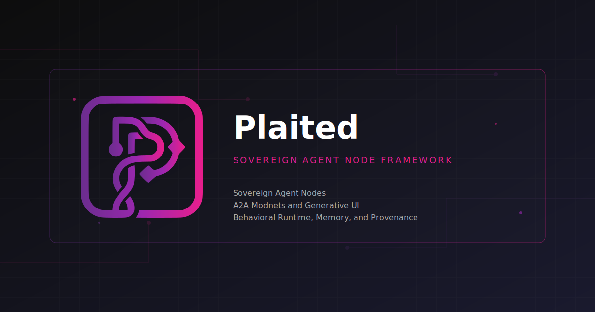

**Build design systems that AI can generate from**

[](https://github.com/plaited/plaited/actions/workflows/ci.yml)


---

Plaited is a design system toolkit with AI built in. Define your tokens, templates, and stories—the Workshop plugin handles the rest. No ML expertise required.

## What You Can Build

**AI-Assisted Design Systems** — Your design tokens and patterns become the vocabulary AI uses to generate consistent UI.

**Generative UI Agents** — Train agents that compose templates from your design system, not from scratch.

**Personalized Knowledge Worker Screens** — Generate role-specific interfaces that follow your design guidelines.

## Get Started

### Step 1: Install the package

```bash
bun install plaited
```

### Step 2: Install development skills

Install skills for your AI coding agent:

```bash
curl -fsSL https://raw.githubusercontent.com/plaited/skills-installer/main/install.sh | bash -s -- --agent claude --project development-skills
```

**Supported agents:**

| Agent | Directory | Features |
|-------|-----------|----------|
| claude | `.claude/` | skills, commands |
| cursor | `.claude/` | skills |
| copilot | `.github/` | skills |
| opencode | `.opencode/` | skills, commands |
| amp | `.agents/` | skills, commands |
| goose | `.claude/` | skills |
| factory | `.factory/` | skills |

Replace `claude` with your agent name. Skills include TypeScript LSP tools, documentation helpers, and development rules scaffolding.

### Step 3: Start building

Describe what you want to build. The skills teach your AI agent how to work with Plaited—discovering stories, starting the dev server, running tests, and iterating with visual feedback.

<details>
<summary>Manual CLI</summary>

```bash
# Start the dev server with hot reload
bun --hot plaited dev

# Run story tests
bun plaited test
```

</details>

## Performance

Plaited is fast. See the [js-framework-benchmark results](https://krausest.github.io/js-framework-benchmark/2025/table_chrome_143.0.7499.41.html).

<details>
<summary><strong>How It Works (Behavioral Programming)</strong></summary>

Behavioral programming aligns with how reinforcement learning agents reason about the world:

- **Stories as world model** — Stories define valid UI states and transitions, serving as ground truth for both testing and agent training
- **Runtime constraints** — bThreads block invalid actions before they execute, providing symbolic guardrails for neural generation
- **Natural reward signals** — Story pass/fail + accessibility checks = clear training signal

This architecture enables the [World Agent](training/README.md)—a neuro-symbolic system where a neural policy proposes actions and behavioral constraints ensure correctness.

</details>

<details>
<summary><strong>Package Exports</strong></summary>

The vertical integration is reflected in the package structure:

| Export | Description |
|--------|-------------|
| `plaited` | Core behavioral programming — `useBehavioral`, `useSignal` |
| `plaited/ui` | UI framework — templates, `bElement`, `createStyles` |
| `plaited/utils` | Utility functions — type guards, helpers |
| `plaited/testing` | Test utilities — `story` factory, Playwright integration |
| `plaited/workshop` | Discovery utilities — template and story collection |
| `plaited/agent` | Agent utilities — world agent, tool definitions |

```typescript
import { useBehavioral, useSignal } from 'plaited'
import { bElement, createStyles } from 'plaited/ui'
import { story } from 'plaited/testing'
```

**CLI** (requires Bun):
- `bun plaited dev` — Start dev server with story browser
- `bun plaited test` — Run story-based tests with Playwright

</details>

<details>
<summary><strong>Development Skills</strong></summary>

Skills from `@plaited/development-skills` teach your AI coding agent how to build with Plaited:

**What it enables:**
- Generate templates, styles, and stories from descriptions
- Scaffold design tokens and behavioral elements
- Run tests with visual feedback
- Validate accessibility automatically
- Type verification via TypeScript LSP integration

**How it works:**
- Skills auto-activate based on what you're doing
- AI learns your project's patterns from existing code
- LSP tools catch type errors before you run

**Available commands:**
- `/lsp-hover` — Get type information at a position
- `/lsp-find` — Search for symbols across workspace
- `/lsp-refs` — Find all references to a symbol
- `/lsp-analyze` — Batch analysis of a file
- `/validate-skill` — Validate skill directories
- `/scaffold-rules` — Scaffold development rules for AI agents

</details>

<details>
<summary><strong>Requirements</strong></summary>

**For full development (CLI, workshop, testing):**
- [Bun](https://bun.sh/) >= v1.2.9

**For core package only:**
- Node.js >= v22.6.0 (with `--experimental-strip-types`)
- Or Bun >= v1.2.9

</details>

## Getting Help

- **Questions & Discussions**: [Plaited Discussions](https://github.com/orgs/plaited/discussions)
- **Bug Reports**: [GitHub Issues](https://github.com/plaited/plaited/issues)

## License

ISC

---

See [CONTRIBUTING.md](CONTRIBUTING.md) for contribution guidelines.
