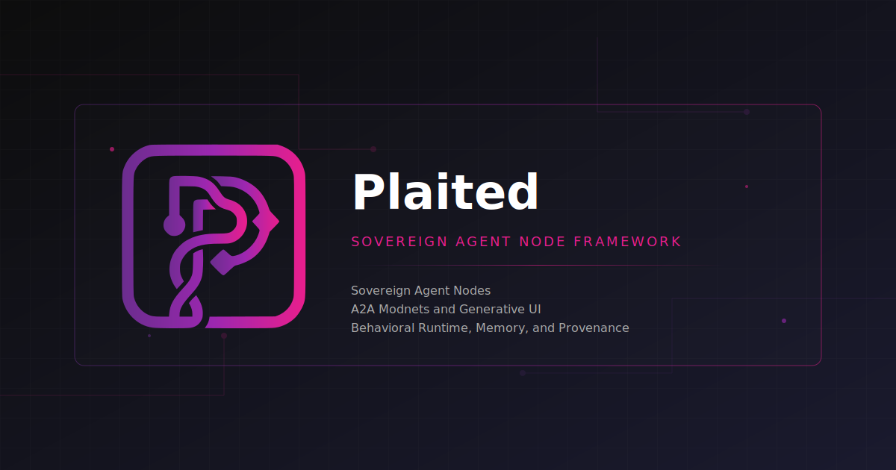

**Sovereign agent nodes first. Framework details second.**

[](https://github.com/plaited/plaited/actions/workflows/ci.yml)

---

Plaited is a framework for **sovereign agent nodes**.

Each node is owned by one user or organization, keeps its modules internal, records its own memory and provenance, and collaborates with other nodes through A2A instead of a central platform. The long-term goal is a **modnet**: a network of sovereign nodes exchanging tasks, services, artifacts, and controlled data without giving up local authority.

Under that model, Plaited provides the technical substrate:
- a BP-first runtime
- an agent loop with governance and evaluation seams
- generative UI primitives
- A2A and modnet building blocks
- git + `.memory/`-based provenance
- dev autoresearch infrastructure for improving the framework itself

## Layer 1: What Plaited Is Building

### Sovereign Nodes

A Plaited node is:
- one agent serving one user or organization
- one local workspace with its own constitution, memory, and modules
- one treaty boundary where all external coordination goes through A2A and PM mediation

Modules stay internal to the node. Other nodes do not directly access them. They request services, receive artifacts, or negotiate bounded work through A2A.

### Modnets

A modnet is a network of sovereign nodes:
- nodes communicate peer-to-peer
- A2A is the external exchange boundary
- git bundles and other artifacts can later be exchanged through governed A2A flows
- enterprise and shared-service nodes are first-class future targets, not special cases

### Native Model Direction

The framework and harness are being built first.

After that, a separate native-model lane focuses on making Falcon or another Plaited-native model strong at:
- generating modules end-to-end
- generating UI through Plaited's controller/generative UI model
- operating inside Plaited's BP/PM/MSS ontology

### Native-Model Status

The current native-model lane is no longer centered on a speculative cloud PoC.
It now has a working local bootstrap loop:
- curated eval outputs become an SFT dataset boundary
- a Bun wrapper launches the uv-managed MLX trainer
- Falcon can be served locally with or without a LoRA adapter
- tuned and untuned runs can be compared before promotion

Current conclusion:
- this Mac is now treated as a native-model control-plane and tooling box
- this Mac is good for:
  - validation
  - curation
  - data shaping
  - compare/report tooling
  - shared native-model infrastructure work
- this Mac is not the forward execution path for meaningful Falcon training
- the MSI box is the intended training plane for less truncated, higher-headroom
  follow-up runs
- the MSI target is a NVIDIA DGX Spark OS device in Network Appliance Mode,
  reached remotely from this Mac over Tailscale rather than used as a
  desktop-first local workstation

The first successful local bootstrap run used:
- `mlx-community/Falcon-H1R-7B-4bit`
- `--max-seq-length 384`
- `--num-layers 2`
- `--iters 20`

That proved the workflow, but the tuned adapter did not beat the untuned local
Falcon baseline, so it should not be promoted.

### Native-Model Workflow

Use this Mac for:
- bounded validation
- curation and stable training-boundary management
- data shaping
- compare/report tooling
- fixing shared native-model infrastructure

Treat local MLX runs here as proof-of-loop or tooling-debug work only, not as
the normal path for improving Falcon quality.

Use the MSI box for:
- actual native-model execution and training
- longer-context training
- less aggressive quantization
- more trainable layers
- serious candidate promotion attempts
- later tool-aware process and autonomous-improvement training phases

Operator model for the MSI environment:
- access the DGX Spark remotely from this Mac over Tailscale
- assume SSH-style remote shell workflows, not local GUI-first usage on the box
- keep long-running jobs in reconnect-safe `cmux` sessions
- use Zed on this Mac as the editor over the remote workspace
- document ports and service endpoints explicitly because the MSI runs in
  Network Appliance Mode

Key commands:

```bash
# Run the bounded validation batch against the Falcon adapter
bun run native-model:validate -- --adapter ./scripts/falcon-h1r-mlx-adapter.ts

# Compare untuned vs tuned validation artifacts
bun run native-model:compare -- \
  --baseline ./dev-research/native-model/evals/runs/falcon-untuned-baseline \
  --candidate ./dev-research/native-model/evals/runs/<candidate-run>

# Prepare and run an MLX bootstrap train/eval cycle only when debugging or
# verifying the local toolchain
bun run native-model:bootstrap-cycle -- \
  --model mlx-community/Falcon-H1R-7B-4bit \
  --max-seq-length 384 \
  --num-layers 2 \
  --iters 20

# Run a bounded local MLX training attempt directly
bun run native-model:train:mlx -- \
  --base-model mlx-community/Falcon-H1R-7B-4bit \
  --max-seq-length 384 \
  --num-layers 2 \
  --iters 20 \
  --run

# Serve the tracked Falcon adapter target from .env.schema
bun run falcon:mlx

# Run a native-model fanout over multiple training strategies
bun run program:run -- ./dev-research/native-model/slice-4.md --lane native-model --pattern fanout --agents 3 --model mlx-community/Falcon-H1R-7B-4bit --max-seq-length 384 --num-layers 2 --iters 20
```

Detailed training and MSI handoff notes live in:
- [training/README.md](/Users/eirby/Workspace/plaited/dev-research/native-model/training/README.md)

## Layer 2: How Plaited Works

### Behavioral Programming First

Plaited's core runtime is behavioral-program shaped:
- symbolic constraints and coordination are expressed as behavioral programs
- the neural model proposes work
- the symbolic layer governs, blocks, coordinates, and records it

This keeps:
- safety logic stable across model changes
- orchestration observable
- provenance and distillation tractable

### Runtime Taxonomy

Current runtime work is converging on:
- `MSS object` — structural description only
- `artifact` — concrete implementation asset
- `behavioral actor` — BP runtime edge around an artifact
- `sub-agent` — isolated behavioral actor with fresh context/runtime
- `team` — coordinated set of sub-agents
- `PM` — sovereign coordinator and treaty authority

### Agent Loop

The agent loop is a framework primitive, not a black box product feature. It provides:
- gating
- simulation/evaluation seams
- governance and constitution enforcement
- memory and snapshot handling
- local and A2A execution surfaces

Exports today include:
- [agent.ts](/Users/eirby/Workspace/plaited/src/agent.ts)
- [behavioral.ts](/Users/eirby/Workspace/plaited/src/behavioral.ts)
- [modnet.ts](/Users/eirby/Workspace/plaited/src/modnet.ts)
- [runtime.ts](/Users/eirby/Workspace/plaited/src/runtime.ts)
- [ui.ts](/Users/eirby/Workspace/plaited/src/ui.ts)

### Generative UI

Generative UI remains an important capability, but it now sits inside the broader node architecture.

The intent is not “AI-generated screens” in isolation. It is:
- UI generated by sovereign nodes
- shaped by local modules and memory
- constrained by behavioral programs and constitutions
- delivered through Plaited's controller/generative UI runtime

### Provenance and Memory

Plaited separates two uses of memory:

- this framework repo's top-level `.memory/`
  - local dev/eval/autoresearch traces
  - ignored from git
- future node/module `.memory/`
  - part of the node's operational record
  - expected to be committed as provenance

Git is not just deployment plumbing here. It is part of the accountability model.

## Repository Map

- [src/](/Users/eirby/Workspace/plaited/src/) — framework code that ships with the node
- [scripts/](/Users/eirby/Workspace/plaited/scripts/) — eval, adapters, graders, dev autoresearch infrastructure
- [skills/](/Users/eirby/Workspace/plaited/skills/) — implementation patterns, references, operational tooling
- [docs/](/Users/eirby/Workspace/plaited/docs/) — design rationale and active architecture docs
- [dev-research/](/Users/eirby/Workspace/plaited/dev-research/) — bounded research programs for improving Plaited itself

Current research lanes:
- [program.md](/Users/eirby/Workspace/plaited/dev-research/runtime-taxonomy/program.md) — framework/runtime/autoresearch lane
- [program.md](/Users/eirby/Workspace/plaited/dev-research/skills/program.md) — skills/tooling lane
- [program.md](/Users/eirby/Workspace/plaited/dev-research/improve/program.md) — generic improvement substrate lane
- [program.md](/Users/eirby/Workspace/plaited/dev-research/native-model/program.md) — native-model/Falcon lane
- [program.md](/Users/eirby/Workspace/plaited/dev-research/modnet/program.md) — inter-node/modnet lane
- [program.md](/Users/eirby/Workspace/plaited/dev-research/mss-seed/program.md) — compact MSS/Modnet seed ontology lane
- [program.md](/Users/eirby/Workspace/plaited/dev-research/mss-corpus/program.md) — graph-ready MSS/Modnet corpus lane
- [program.md](/Users/eirby/Workspace/plaited/dev-research/behavioral-factories/program.md) — downstream factory-compilation lane

## Development

### Requirements

- [Bun](https://bun.sh/) `>= v1.2.9`
- `git`
- for Pi/autoresearch and remote-model research lanes:
  - Varlock + 1Password setup via [`.env.schema`](/Users/eirby/Workspace/plaited/.env.schema)
  - provider access for the configured lane models and search integrations

### Useful Commands

```bash
# Typecheck
bun --bun tsc --noEmit

# Full test suite
bun test

# Generic autoresearch runner
bun run autoresearch:runner -- scripts/behavioral-factories.ts run

# Active research lane through autoresearch
bun run research:behavioral-factories

# Direct lane surface
bun scripts/behavioral-factories.ts status
bun scripts/behavioral-factories.ts validate
```

### Current Research Flow

The current research split is:
- `scripts/autoresearch-runner.ts`
  - worktree-backed orchestration
  - attempts, parallelism, retries, lane isolation
- `src/improve`
  - eval/improvement framework
  - graders, meta-verifiers, trial utilities, shared judge contracts
- active lane scripts such as:
  - [behavioral-factories.ts](/Users/eirby/Workspace/plaited/scripts/behavioral-factories.ts)
  - retained seed/corpus artifacts are treated as fixed upstream inputs

For the active behavioral-factories lane:
- `research:behavioral-factories` runs `behavioral-factories` through `autoresearch-runner`
- it defaults to bounded worktree-backed autoresearch with:
  - `15` attempts
  - `3` parallel lane instances
- promotion is still a separate explicit step after review

Each autoresearch attempt writes observable artifacts under:
- `.prompts/autoresearch-runner/<lane>/<timestamp>/`

These runs can include:
- lane-local validation
- changed-file summaries
- LLM judge scoring
- optional meta-verifier confidence

### Skill Evaluation

Skill evaluation is separate from structural validation:
- `plaited validate-skill`
  - AgentSkills-compatible structure only
- `plaited evaluate-skill`
  - behavioral quality against the skill's local `evals/` surface
- `plaited validate-research`
  - structural validation for `dev-research/**/program.md` and `slice-*.md`

`evaluate-skill` uses the skill-local files when present:
- `evals/trigger-prompts.jsonl`
- `evals/output-cases.jsonl`
- `evals/RUBRIC.md`

Default artifact layout stays inside the skill:
- `<skill>/evals/runs/<run-id>/`
  - run-specific `results.jsonl`, `summary.md`, `summary.json`, `benchmark.json`, `RESULTS.md`
- `<skill>/evals/RESULTS.md`
  - latest human-review summary
- `<skill>/evals/benchmark.json`
  - latest machine-readable aggregate summary
- `<skill>/evals/latest-run.json`
  - pointer to the latest run and artifact paths

The tool also commits those updated eval artifacts by default when the skill
lives in a git repo, so git history becomes the longitudinal skill-eval log.

For `baseline:"without-skill"` runs, `evaluate-skill` now snapshots both the
with-skill and without-skill scenarios into detached `.worktrees/` checkouts
from the same git state. Repo-local adapter, grader, and prompt paths are
resolved inside those worktrees so Codex comparisons stay inspectable even when
the current checkout has uncommitted changes.

Examples:
- trigger eval against the current skill:
  - `plaited evaluate-skill '{"skillPath":"skills/generative-ui","mode":"trigger","adapterPath":"./scripts/codex-cli-adapter.ts","graderPath":"./scripts/gemini-judge.ts","k":2,"progress":true}'`
- with-skill vs without-skill comparison:
  - `plaited evaluate-skill '{"skillPath":"skills/generative-ui","mode":"trigger","adapterPath":"./scripts/codex-cli-adapter.ts","graderPath":"./scripts/gemini-judge.ts","baseline":"without-skill","useWorktree":true,"k":2,"progress":true}'`
- validate the internal research docs:
  - `plaited validate-research '{"paths":["dev-research"]}'`

# Compare untuned vs tuned validation artifacts
bun run native-model:compare -- \
  --baseline ./dev-research/native-model/evals/runs/falcon-untuned-baseline \
  --candidate ./dev-research/native-model/evals/runs/<candidate-run>

# Start the local EmbeddingGemma MLX embedding server
bun run embedding:mlx

# Start the local Qwen3 VL MLX vision-language server
bun run qwen:vl:mlx

# Start the local Qwen3 TTS MLX audio server
bun run qwen:tts:mlx
```

What each command does:

- `bun run native-model:validate -- --adapter ...`
  - runs the current native-model eval prompt batch through the trial layer
  - writes `run.json`, `results.jsonl`, `summary.md`, and `summary.json`
  - is the command to use when checking validation pass rate, training eligibility, and trajectory richness

- `bun run native-model:train`
  - converts `dev-research/native-model/evals/curated-good-outputs.jsonl` into a trainer-friendly SFT dataset
  - writes a manifest and output paths for the first local tuning run
  - does not start training by itself unless a trainer backend is configured

- `bun run native-model:train:mlx -- ...`
  - prepares the SFT dataset and launches the MLX LoRA/SFT backend through a Bun wrapper
  - keeps Python as the training implementation, but Bun as the operator surface
  - defaults to a timestamped run under `dev-research/native-model/training/runs/`
  - forwards flags to:
    - [train_mlx_lora.py](/Users/eirby/Workspace/plaited/dev-research/native-model/training/train_mlx_lora.py)
  - on this Mac, the proven working bootstrap settings are the quantized Falcon run shown above

- `bun run native-model:bootstrap-cycle -- ...`
  - runs the bounded bootstrap loop end-to-end
  - trains a candidate local adapter
  - evaluates untuned and tuned Falcon runs
  - compares both summaries
  - optionally promotes the tuned adapter by updating `FALCON_ADAPTER_PATH` in [`.env.schema`](/Users/eirby/Workspace/plaited/.env.schema)

- `bun run native-model:compare -- ...`
  - compares two validation artifacts
  - accepts a run directory, `summary.json`, or `results.jsonl`
  - reports pass-rate, eligibility, and score deltas before promotion decisions

- `bun run falcon:mlx`
  - starts the local MLX inference server for Falcon H1R on Apple Silicon
  - reads the tracked promoted adapter path from [`.env.schema`](/Users/eirby/Workspace/plaited/.env.schema)
  - is for local inference/eval loops, not weight updates
  - use `FALCON_DISABLE_ADAPTER=1 bun run falcon:mlx` for an untuned baseline run

- `bun run embedding:mlx`
  - starts the local MLX embedding server using EmbeddingGemma
  - is the local embedding backend for `embed_search`

- `bun run qwen:vl:mlx`
  - starts the local MLX vision-language server using Qwen3 VL
  - is the local vision backend for `analyze_image`

- `bun run qwen:tts:mlx`
  - starts the local MLX text-to-speech server using Qwen3 TTS
  - is the local audio backend for `speak`

The MLX LoRA/SFT backend currently lives under:
- [training](/Users/eirby/Workspace/plaited/dev-research/native-model/training)

Use `--output-dir` when you want a stable run path:

```bash
bun run native-model:train:mlx -- \
  --base-model mlx-community/Falcon-H1R-7B-4bit \
  --max-seq-length 384 \
  --num-layers 2 \
  --iters 20 \
  --output-dir ./dev-research/native-model/training/runs/bootstrap-mlx \
  --run
```

### Agent-Facing CLI

The repo ships an agent-facing CLI toolbox:
- `plaited read-file`
- `plaited write-file`
- `plaited edit-file`
- `plaited list-files`
- `plaited bash`
- `plaited validate-skill`
- `plaited ingest-skill`
- `plaited discover-skills`
- `plaited evaluate-skill`
- `plaited search`
- `plaited skill-links`
- `plaited eval`
- `plaited training-score`

See:
- [cli.ts](/Users/eirby/Workspace/plaited/src/cli.ts)

## Read Next

- [ARCHITECTURE.md](/Users/eirby/Workspace/plaited/docs/ARCHITECTURE.md)
- [modnet-node skill](/Users/eirby/Workspace/plaited/skills/modnet-node/SKILL.md)
- [HYPERGRAPH-MEMORY.md](/Users/eirby/Workspace/plaited/docs/HYPERGRAPH-MEMORY.md)
- [constitution skill](/Users/eirby/Workspace/plaited/skills/constitution/SKILL.md)

## License

ISC
